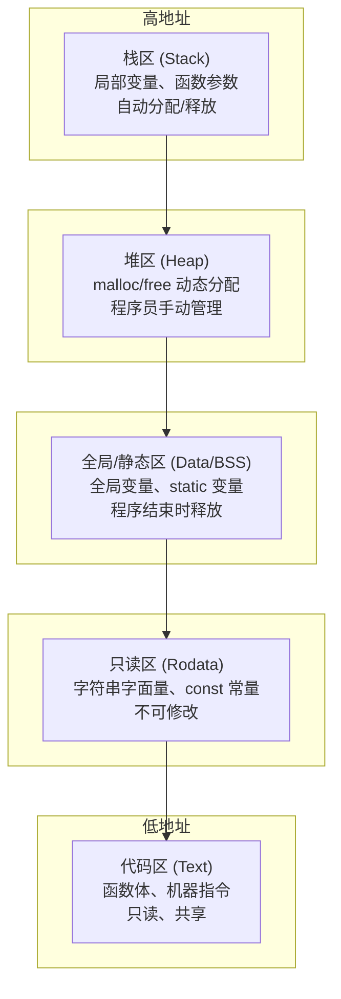
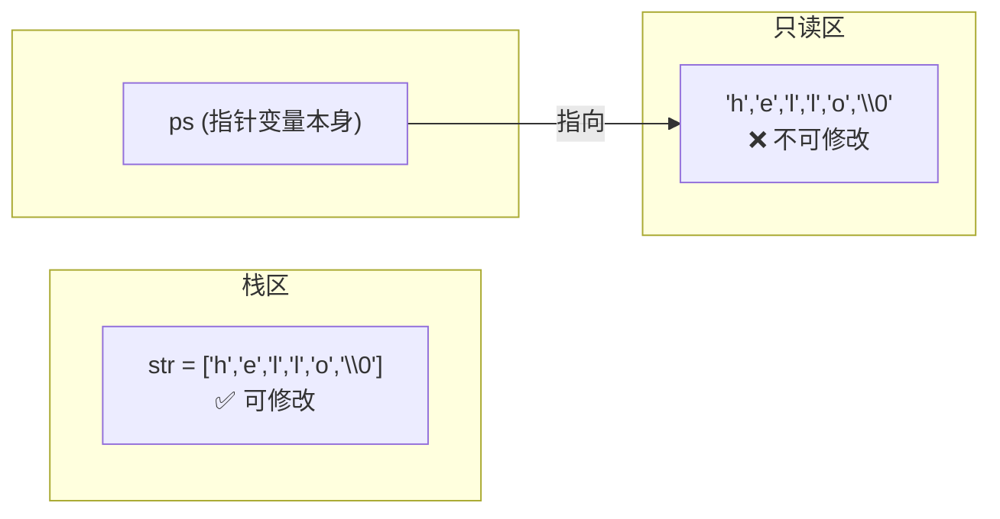

## 一、内存分区模型

C 程序运行时，操作系统将内存划分为以下区域（从**高地址到低地址**）：



### 各区详细说明

| 区域 | 存储内容 | 生命周期 | 读写权限 | 管理方式 |
|------|---------|---------|---------|---------|
| **栈区** | 局部变量、函数参数、`char arr[]` | 函数调用期间 | 读写 | 编译器自动管理 |
| **堆区** | `malloc`/`calloc` 分配的动态内存 | 手动 `free` 之前 | 读写 | 程序员手动管理 |
| **全局区** | 全局变量、`static` 变量 | 程序运行期间 | 读写 | 编译器自动管理 |
| **只读区** | `"字符串字面量"`、`const` 常量 | 程序运行期间 | **只读** | 编译器自动管理 |
| **代码区** | 函数体的机器指令 | 程序运行期间 | 只读 | 编译器/OS 管理 |

---

## 二、栈区详解

### 特点

- **先进后出**（LIFO），函数调用压栈，返回出栈
- 局部变量在函数返回后**自动销毁**
- 栈空间有限（通常几 MB），递归过深会**栈溢出**

### 关键区别

```c
char str[] = "hello";   // 把字面量 复制 到栈区 → 可改
char* ps = "hello";     // 指针指向只读区的字面量 → 不可改！
```



> [!warning] 核心理解
> - `char str[]`  = 在栈上开一块空间，把字面量**拷进去** → 这份拷贝是栈上的，随便改。
> - `char* ps`  = 指针本身在栈上（4/8 字节），但它**指向**只读区的那份字面量 → 改它就炸。

---

## 三、堆区详解

### 特点
- 通过 `malloc`、`calloc`、`realloc` 分配
- 通过 `free` 释放，否则**内存泄漏**
- 比栈区大得多，适合存放大量数据

### 示例
```c
#include <stdlib.h>

int* p = (int*)malloc(100 * sizeof(int));   // 分配 100 个 int
// ... 使用 ...
free(p);   // 用完必须释放
p = NULL;  // 避免悬空指针
```

> [!danger] 注意
> - `free` 后指针变成**悬空指针**，再访问 → 未定义行为
> - `free` 后立即赋 `NULL`，是个好习惯

---

## 四、段错误（Segmentation Fault）

### 什么是段错误

程序试图访问**不允许访问的内存**时，操作系统发出 SIGSEGV 信号，程序崩溃。

### 常见触发场景

| 场景 | 示例 | 原因 |
|------|------|------|
| 写只读区 | `char* s = "abc"; s[0] = 'x';` | 试图修改只读数据段 |
| 解引用 NULL | `int* p = NULL; *p = 42;` | 访问地址 0 |
| 数组越界写 | `arr[999999] = 1;` | 写到不属于进程的内存 |
| 悬空指针 | `free(p); *p = 1;` | 访问已释放的内存 |
| 栈溢出 | 无限递归 | 栈空间耗尽 |

### 只读区段错误图解

```
代码区         只读区              全局区          堆区           栈区
[ main() ]  ["hello yanan\0"]   [全局变量]    [malloc区域]   [局部变量]
    ↑                              ↑
    |  ps 指向这里                  |  试图 *(ps+4)='w' 写入
    |                              |  → 只读区不能写 → SIGSEGV! 
char* ps = "hello yanan";
```

### 栈区 vs 只读区

```c
char str[13] = "hello world";   // 栈上拷了一份 → 可写
char* ps     = "hello yanan";   // 指向只读区字面量 → 不可写

// 写 str → 没问题
str[0] = 'H';            // ✅

// 写 *ps → 段错误
*(ps + 4) = 'w';         // ❌ SIGSEGV
```

**数组自己有一份**（栈），**指针只是指一头**（只读区）。

---

## 五、全局/静态区

| 子区域 | 存放内容 | 初始化 |
|--------|---------|-------|
| `.data` | 已初始化的全局/静态变量 | 有初值 |
| `.bss` | 未初始化的全局/静态变量 | 自动清零 |

```c
int g_a = 100;       // .data 区（有初值）
int g_b;             // .bss 区（自动 0）
static int s = 10;   // .data 区（有初值）
```

---

> [!abstract] 本篇关联
> - [[01.C语言语法基础]]
> - [[02. 数组、字符串与函数基础]]
> - [[03. 指针]]
