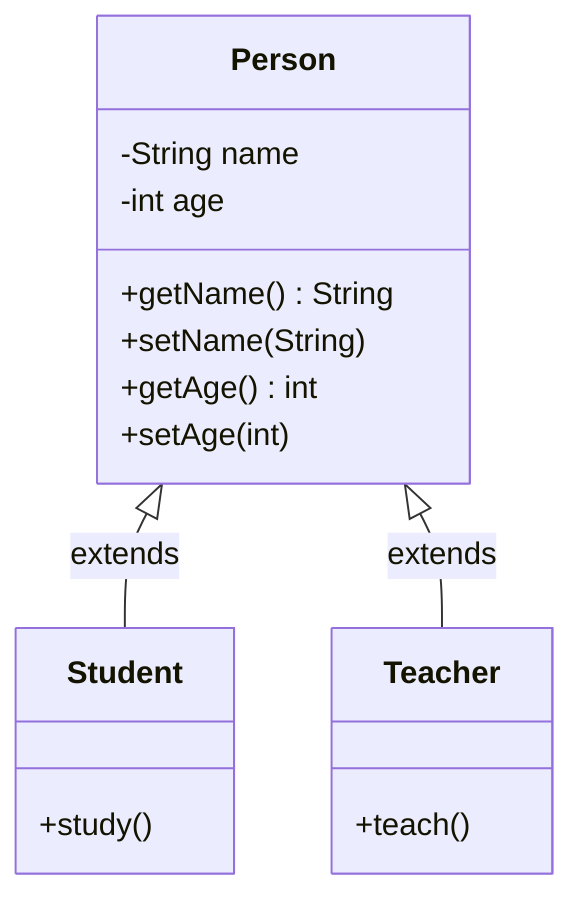
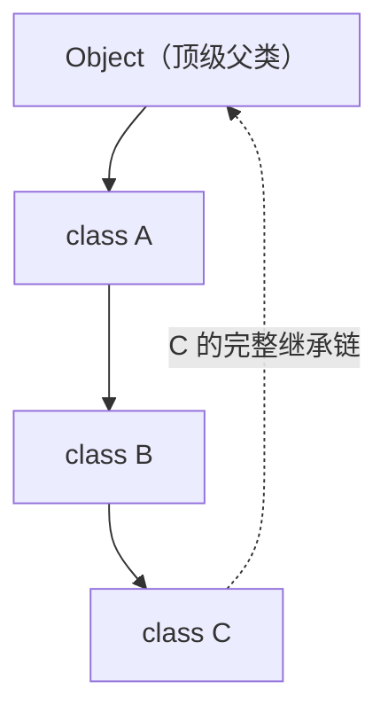
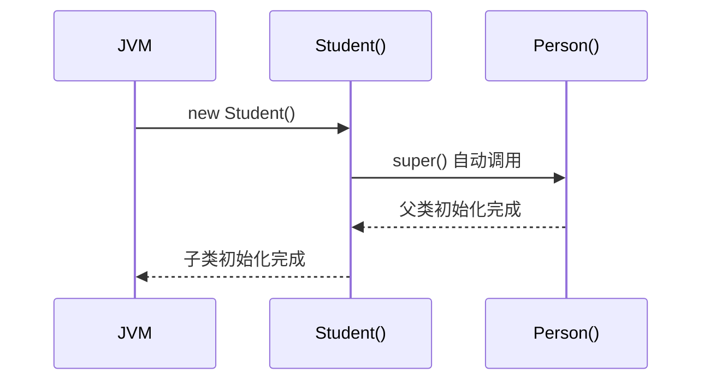
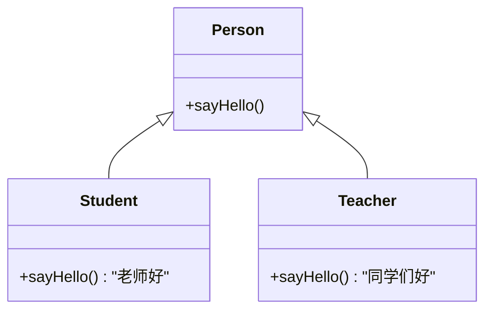

## 1. 继承（Inheritance）

### 1.1 为什么需要继承

两个类有大量重复的属性和方法时，用继承来消除冗余。



> 没有继承的话，`name`、`age`、`getName()`... 每个类都得写一遍——程序员不是复印机。

### 1.2 继承的语法

```java
public class Student extends Person {
    // 自动拥有 Person 中的非私有成员
    // 可以添加自己的特有属性和方法
}
```

**好处：**

- 把多个子类中重复的代码抽取到父类，**提高复用性**
- 子类可以在父类基础上增加新功能，**增强扩展性**

### 1.3 继承的特点

| 特点 | 说明 |
|------|------|
| **单继承** | 一个子类只能有一个直接父类（`class A extends B`） |
| **不支持多继承** | Java 不允许 `class A extends B, C` |
| **支持多层继承** | `class C extends B`，`class B extends A`，C 同时继承 B 和 A |
| **顶级父类 Object** | 所有类都直接或间接继承 `java.lang.Object` |



### 1.4 成员变量的访问

**书写规则：** 把子类中共有的属性抽取到父类。

**调用规则：** ==就近原则==——优先在方法内部找，再到本类成员变量，最后到父类。


```java
public class Fu {
    String name = "Fu";
}

public class Zi extends Fu {
    String name = "Zi";

    public void show() {
        String name = "局部";

        System.out.println(name);        // 输出：局部（就近：方法内）
        System.out.println(this.name);   // 输出：Zi   （本类成员变量）
        System.out.println(super.name);  // 输出：Fu   （父类成员变量）
    }
}
```

### 1.5 成员方法的访问与重写（Override）

**书写规则：** 把子类中共性的方法抽取到父类。

**方法重写（`@Override`）：** 在子类中把父类的方法重新写一遍，方法声明保持一致。

> [!note] 使用场景
> 父类的方法不能满足子类需求时，子类重写它。如果还需要父类的原始逻辑，用 `super.方法名()` 调用父类方法获取结果，再做额外处理。

```java
public class Animal {
    public void eat() {
        System.out.println("动物吃东西");
    }
}

public class Cat extends Animal {
    @Override
    public void eat() {
        super.eat();                    // 先执行父类逻辑
        System.out.println("猫吃鱼");   // 再加自己的逻辑
    }
}
```

#### 重写注意事项

| 规则 | 说明 |
|------|------|
| 方法名、形参列表 | 必须与父类**完全一致** |
| 返回值类型 | 子类必须 **≤** 父类（JDK5+ 支持协变返回类型） |
| 访问权限 | 子类必须 **≥** 父类 |
| 不能重写的 | `private` 方法、`static` 方法、`final` 方法 — 这些不是虚方法 |

**访问权限大小关系：**

```
private  <  默认(package-private)  <  protected  <  public
(最小)                                                      (最大)
```

> [!warning] 权限只能放大不能缩小
> ```java
> class Parent {
>     protected void method() {}  // protected
> }
>
> class Child extends Parent {
>     @Override
>     public void method() {}     // ✅ public ≥ protected
>
>     // @Override
>     // private void method() {} // ❌ private < protected，编译错误！
> }
> ```

> [!important] 只有虚方法能被重写
> - `private` — 私有，子类根本看不见
> - `static` — 静态，属于类不属于对象，没有多态
> - `final` — 最终，明确禁止重写
>
> 记住口诀：**私静终，三重门，子类重写没门！**

### 1.6 构造方法

父类的构造方法**不会被子类继承**，只能通过 `super` 关键字调用。

```java
public class Person {
    private String name;
    private int age;

    public Person() {}                      // 无参构造

    public Person(String name, int age) {   // 有参构造
        this.name = name;
        this.age = age;
    }
}

public class Student extends Person {
    public Student() {
        // super();  ← JVM 自动添加，调用父类无参构造
    }

    public Student(String name, int age) {
        super(name, age);  // 手动调用父类有参构造
    }
}
```



> [!important] super() 的规则
> - 子类构造方法中**默认隐藏 `super()`**，调用父类无参构造
> - 想要调用父类**有参构造**，必须手动写 `super(参数)`
> - `super()` 必须是构造方法的**第一行**
> - **如果父类没有无参构造，子类必须手动调用有参构造**，否则编译报错

### 1.7 this 与 super 关键字对比

| 关键字 | 含义 | 访问成员变量 | 访问成员方法 | 访问构造方法 |
|--------|------|-------------|-------------|-------------|
| `this` | 当前对象的引用 | `this.变量名` | `this.方法名()` | `this(参数)` 调用本类其他构造 |
| `super` | 父类存储空间的标识 | `super.变量名` | `super.方法名()` | `super(参数)` 调用父类构造 |

```java
public class Zi extends Fu {
    private int score;

    public Zi() {
        this(0);  // 调用本类的有参构造
    }

    public Zi(int score) {
        super();       // 调用父类无参构造
        this.score = score;
    }

    public void show() {
        System.out.println(this.score);   // 本类的
        System.out.println(super.name);   // 父类的
    }
}
```

> [!tip]
> `this()` 和 `super()` 都必须在构造方法**第一行**，所以它们**不能同时出现**。这就像一个人不能同时坐两张椅子——你只能选一个。

### 1.8 继承的底层原理

> [!important] 核心认知
> **子类能调用 ≠ 子类能继承。** 子类对象中确实有一块父类数据空间，但 `private` 成员子类无法直接访问。

**子类真正能继承的（直接可用）：**

| 修饰符 | 能否被子类继承使用 |
|--------|:---:|
| `public` | ✅ |
| `protected` | ✅ |
| 默认（package-private） | ✅（同包） / ❌（跨包） |
| `private` | ❌（存在但不可直接访问） |

**继承的内存结构（子类对象在堆中的布局）：**

```
┌─────────────────────────┐
│   子类对象 (new Zi())     │
│                         │
│  ┌─────────────────────┐│
│  │   父类成员空间       ││ ← super 区：父类非私有成员
│  │   name, age ...     ││
│  └─────────────────────┘│
│  ┌─────────────────────┐│
│  │   子类独有成员       ││
│  │   score, study()... ││
│  └─────────────────────┘│
└─────────────────────────┘
```

**字节码文件层面：**

子类 `.class` 文件中**不包含父类的字节码**。调用父类方法时，JVM 通过继承链向上查找：

```
子类方法调用链路：
Zi.show() → 先在 Zi.class 中找 → 没找到 → 去 Fu.class 中找
→ 没找到 → 去 Object.class 中找 → 找到了！执行
```

---

## 2. 多态（Polymorphism）

多态：**事物的多种形态**。同一个行为，不同的子类表现出不同的方式。



### 2.1 多态的前提条件

| 条件 | 是否必须 | 说明 |
|------|:---:|------|
| 有继承/实现关系 | ==必须== | 多态建立在继承体系上 |
| 父类引用指向子类对象 `Fu f = new Zi();` | ==必须== | 核心语法 |
| 有方法重写 | 可选 | 没有重写多态就没意义了 |

```java
// 多态的标准写法
Person p = new Student();  // 父类类型 变量名 = new 子类对象();
```

### 2.2 多态调用成员的特点

> [!important] 口诀：**编译看左边，运行看右边**（仅适用于方法）

| 成员类型 | 编译时（javac） | 运行时（java） |
|----------|:---:|:---:|
| **成员变量** | 看左边（父类） | 看左边（父类） |
| **成员方法** | 看左边（父类） | ==看右边（子类）== |

```java
public class Animal {
    String name = "动物";

    public void eat() {
        System.out.println("动物吃东西");
    }
}

public class Dog extends Animal {
    String name = "狗";

    @Override
    public void eat() {
        System.out.println("狗吃骨头");
    }

    public void watchDoor() {
        System.out.println("狗看门");
    }
}

// 测试
public class Test {
    public static void main(String[] args) {
        Animal a = new Dog();   // 多态

        System.out.println(a.name);   // 输出：动物（变量：编译看左，运行看左）
        a.eat();                       // 输出：狗吃骨头（方法：编译看左，运行看右）

        // a.watchDoor();             // ❌ 编译错误！父类没有 watchDoor()
    }
}
```

> [!warning] 多态的弊端
> **不能调用子类的独有功能。** 编译时看的是父类类型，父类里没有的方法就调不了。

### 2.3 类型转换

为了解决多态无法调用子类独有方法的问题，需要类型转换。

| 转换方向 | 语法 | 特点 |
|----------|------|------|
| 向上转型（自动） | `Animal a = new Dog();` | 安全，自动完成 |
| 向下转型（强制） | `Dog d = (Dog) a;` | 有风险，可能 `ClassCastException` |

```java
Animal a = new Dog();    // 向上转型：自动
Dog d = (Dog) a;         // 向下转型：强制
d.watchDoor();           // ✅ 现在可以调用子类独有方法了
```

### 2.4 instanceof 运算符

`instanceof`：检查一个对象是否是某个类（或其子类）的实例，返回 `boolean`。

```java
对象 instanceof 类型   // → true / false
```

**[强制转换的安全写法：**

```java
public static void handleAnimal(Animal a) {
    // 先判断类型，再安全转换
    if (a instanceof Dog) {
        Dog d = (Dog) a;
        d.watchDoor();          // 安全！
    } else if (a instanceof Cat) {
        Cat c = (Cat) a;
        c.catchMouse();         // 安全！
    } else {
        System.out.println("未知动物类型");
    }
}
```

> [!tip] JDK 16+ 增强写法
> ```java
> if (a instanceof Dog d) {  // 判断 + 转换 + 声明变量，一步到位
>     d.watchDoor();
> }
> ```

### 2.5 多态的应用场景

```java
// 场景：统一的动物喂食方法
public class Feeder {
    // 参数用父类类型，可以接收任何子类对象
    public void feed(Animal a) {
        a.eat();  // 实际运行时根据对象类型调用对应的方法
    }
}

Feeder feeder = new Feeder();
feeder.feed(new Dog());   // 输出：狗吃骨头
feeder.feed(new Cat());   // 输出：猫吃鱼
```

> [!success] 多态的好处
> 用父类类型作为参数，一个方法能处理所有子类——这才叫**"写一次，用一辈子"**。

---

> [!abstract] 本篇关联
> - [[代码学习/Java基础/Java/6.面向对象/01.面向对象基础与内存原理]]
> - [[代码学习/Java基础/Java/6.面向对象/02.static、final与枚举]]
> - [[代码学习/Java基础/Java/6.面向对象/04.抽象类、接口与内部类]]
