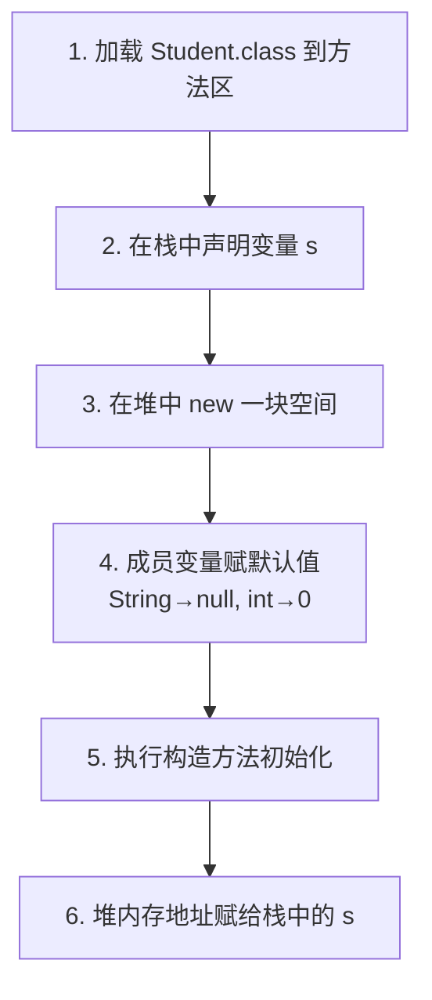

面向对象三大特征：==封装==、==继承==、==多态==。

## 1. 封装（Encapsulation）

封装：将零散的数据和行为包装成一个整体（类），对外隐藏实现细节，仅暴露有限的访问接口。

### 1.1 JavaBean 规范

```java
public class Student {
    // 1. 成员变量用 private 修饰
    private String name;
    private int age;

    // 2. 必须提供无参构造方法
    public Student() {}

    // 3. 有参构造方法（可选）
    public Student(String name, int age) {
        this.name = name;
        this.age = age;
    }

    // 4. 为每个私有变量提供 public 的 getter/setter
    public String getName() {
        return name;
    }

    public void setName(String name) {
        this.name = name;
    }

    public int getAge() {
        return age;
    }

    public void setAge(int age) {
        this.age = age;
    }
}
```

> [!tip] 封装的好处
> - 提高代码的**安全性**（数据不被随意篡改）
> - 提高代码的**复用性**（一个 JavaBean 到处用）
> - **高内聚、低耦合**：内部实现自由修改，外部调用不受影响

## 2. 对象的内存分配

### 2.1 JVM 内存区域简介

Java 程序运行时，内存分为以下几个核心区域：

| 区域 | 存储内容 | 特点 |
|------|----------|------|
| **栈（Stack）** | 方法运行时使用的内存，存放局部变量、方法参数 | 方法入栈运行，出栈释放 |
| **堆（Heap）** | `new` 出来的对象、数组 | 有默认初始化值，由 GC 回收 |
| **方法区（Method Area）** | 类的字节码文件（`.class`），包括静态变量、常量池 | 字节码加载时进入 |

### 2.2 对象创建的内存过程

以 `Student s = new Student();` 为例，内存中发生以下步骤：



> [!note] 内存结构示意图（文字版）
> ```
> ┌────────── 栈内存 ──────────┐    ┌──────────── 堆内存 ────────────┐
> │                            │    │                                │
> │  Student s = 0x0011        │───>│  new Student()                 │
> │                            │    │  ┌──────────────────────────┐  │
> │                            │    │  │ name = null → "张三"      │  │
> │                            │    │  │ age  = 0    → 20         │  │
> │                            │    │  └──────────────────────────┘  │
> └────────────────────────────┘    └────────────────────────────────┘
>
> ┌────────── 方法区 ──────────┐
> │  Student.class             │
> │  - name: String            │
> │  - age: int                │
> │  + getName(), setName()... │
> └────────────────────────────┘
> ```

**多个对象的情况：**

```java
Student s1 = new Student("张三", 20);
Student s2 = new Student("李四", 22);
```

```
栈内存：                        堆内存：
┌──────────────────────┐      ┌──────────────────────┐
│ s1 = 0x0011          │─────>│ Student(name="张三")  │
│ s2 = 0x0022          │──┐   └──────────────────────┘
└──────────────────────┘  │   ┌──────────────────────┐
                           └──>│ Student(name="李四")  │
                               └──────────────────────┘
```

> [!important] 关键结论
> 栈中的变量存的是**引用地址**，真正的对象数据在**堆**中。每个 `new` 都会在堆中创建独立的空间。

### 2.3 对象在方法中的传递

Java 中方法传参只有一种方式：==值传递==。

- **基本类型**：传递的是**数据的值**，方法内修改不影响外部
- **引用类型**：传递的是**地址值**，方法内可以通过地址修改堆中的对象

```java
// 基本类型 — 传递值副本
public static void changeInt(int num) {
    num = 200;  // 改的只是副本，外部不受影响
}

public static void main(String[] args) {
    int a = 10;
    changeInt(a);
    System.out.println(a);  // 输出：10
}
```

```java
// 引用类型 — 传递地址副本
public static void changeStudent(Student s) {
    s.setName("李四");  // 通过地址修改堆中对象，外部可见
}

public static void main(String[] args) {
    Student stu = new Student("张三", 20);
    changeStudent(stu);
    System.out.println(stu.getName());  // 输出：李四
}
```

> [!warning] 内存图解：引用类型传参
> ```
> main方法栈帧：                  changeStudent方法栈帧：
> ┌──────────────┐              ┌──────────────┐
> │ stu=0x0011   │              │ s=0x0011     │  ← 复制了地址值
> └──────┬───────┘              └──────┬───────┘
>        │                             │
>        └─────────┬───────────────────┘
>                  ↓
>        堆内存：Student(name="张三")  ← 两个引用指向同一对象！
> ```

> [!tip] 避坑指南
> 有些书上说"引用传递"，严格讲 Java 只有值传递。引用类型的"值"就是那个地址。别在面试里栽跟头。

---

> [!abstract] 本篇关联
> - [[05.原理]]
> - [[04.方法]]
> - [[02.static、final与枚举]]
> - [[03.继承与多态]]
