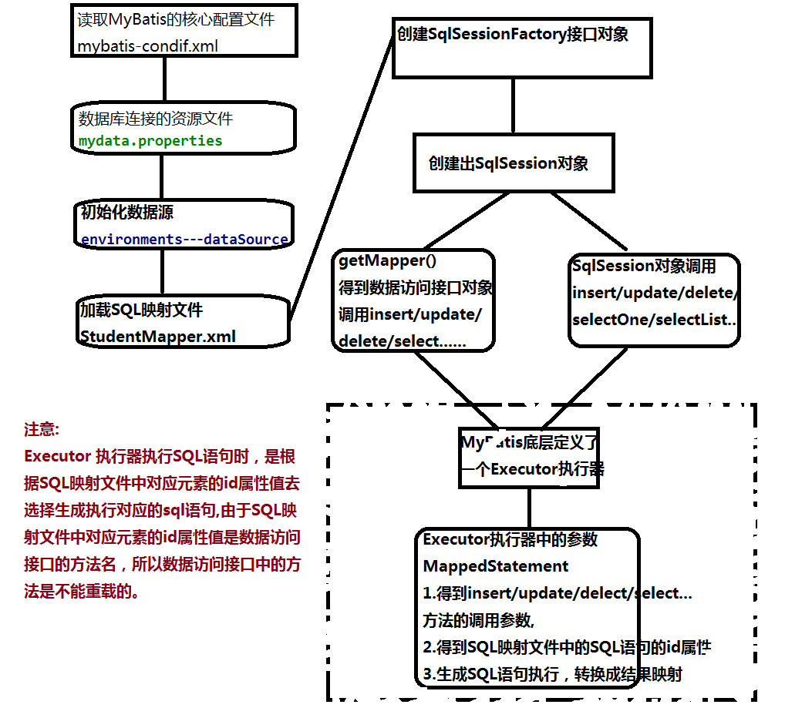
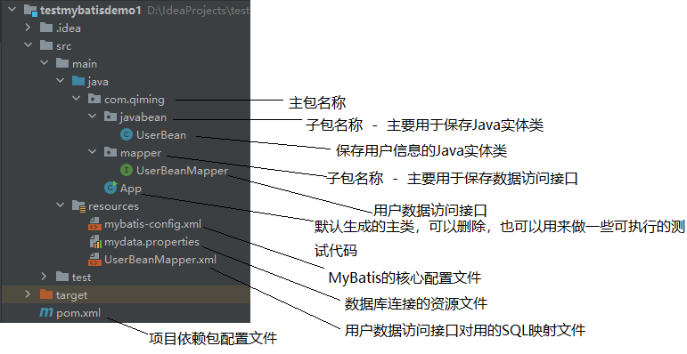

MyBatis框架访问数据库
# 一、什么是MyBatis?
       一个基于ORM的数据访问层框架。
      ORM---对象关系映射
1.为了简化数据库访问操作，提高开发的效率，提升项目的性能，增加程序的可维护性
2.当我们使用Java程序控制Java对象的时候，数据库中的数据表记录会随之变化。  
   将操作数据库的SQL语句从Java程序中分离

# 二、通过MyBatis访问数据库
## 1.数据访问接口+SQL映射文件



### 方式1:
通过SqlSession对象调用getMapper()方法得到数据访问接口对象之后，
使用数据访问接口对象调用数据访问接口中的insertXXX、updateXXXX、deleteXXX、selectXXXX方法

#### b1.创建数据库以及数据库表
mysql> create  table t_user(
    -> user_id int  primary key  auto_increment,
    -> user_name  varchar(20),
    -> user_age int,
    -> user_address  varchar(30)
    -> );
Query OK, 0 rows affected (0.38 sec)

#### b2.创建基于Maven的普通Java项目,完善项目结构

#### b3.导入依赖包pom.xml
```xml
<!-- 导入Mysql数据库链接jar包 -->
    <dependency>
      <groupId>mysql</groupId>
      <artifactId>mysql-connector-java</artifactId>
      <version>8.0.33</version>
    </dependency>
    <!-- mybatis核心包 -->
    <dependency>
      <groupId>org.mybatis</groupId>
      <artifactId>mybatis</artifactId>
      <version>3.5.6</version>
    </dependency>

```
#### b4.参考数据库表，创建javaBean类
```java
package com.qiming.javabean;
import java.io.Serializable;
/**
 * 保存用户信息的Java实体类
 */
public class UserBean implements Serializable {
    private  int userid;  // 用户id
    private  String  username;  //用户姓名
    private  int  userage;  //用户年龄
    private  String  useraddress;  //用户地址

    public int getUserid() {
        return userid;
    }
    public void setUserid(int userid) {
        this.userid = userid;
    }
    public String getUsername() {
        return username;
    }
    public void setUsername(String username) {
        this.username = username;
    }
    public int getUserage() {
        return userage;
    }
    public void setUserage(int userage) {
        this.userage = userage;
    }
    public String getUseraddress() {
        return useraddress;
    }
    public void setUseraddress(String useraddress) {
        this.useraddress = useraddress;
    }
}
```

#### b5.创建数据库访问接口mapper
```java
package com.qiming.mapper;

import com.qiming.javabean.UserBean;

import java.util.List;

/**
 * 用户信息的数据访问接口
 */
public interface UserBeanMapper {
    /**
     * 添加用户信息
     * @param userBean
     * @return
     */
    int  insertUserBean(UserBean  userBean);
    /**
     * 修改用户信息
     * @param userBean
     * @return
     */
    int  updateUserBean(UserBean  userBean);

    /**
     * 删除用户信息
     * @param userid
     * @return
     */
    int  deleteUserBeanById(int userid);

    /**
     * 查询所有用户信息
     * @return
     */
    List<UserBean> selectAllUserBean();

    /**
     * 查询一个用户信息
     * @param userid
     * @return
     */
    UserBean  selectUserBeanById(int userid);
}
```


#### b6.创建数据库连接资源文件mydata.properties
      位置：src/main/resources
      名称：需要使用“.properties”结尾
src/main/resources/mydata.properties

```properties
mydrivername = com.mysql.cj.jdbc.Driver
myurl = jdbc:mysql://127.0.0.1:3306/qiming_db
myusername = root
mypassword = 123456
```

#### b7.创建MyBatis的核心配置文件mybatis-config.xml
    位置：src/main/resources
    名称：需要使用“.xml”结尾  [mybatis-config.xml]
```xml
<?xml version="1.0" encoding="UTF-8"?>
<!DOCTYPE configuration
        PUBLIC "-//mybatis.org//DTD Config 3.0//EN"
        "http://mybatis.org/dtd/mybatis-3-config.dtd">

<configuration>
    <!-- 配置引入数据库链接字符串的资源文件 -->
    <properties resource="mydata.properties"></properties>
    <!-- 配置mybatis默认的连接数据库的环境 -->
    <environments default="development">
        <!--配置一个简单的开发环境-->
        <environment id="development">
            <!-- 配置事务管理器 -->
            <transactionManager type="JDBC"></transactionManager>
            <!-- 配置数据源-->
            <dataSource type="POOLED">
                <property name="driver" value="${mydrivername}"/>
                <property name="url" value="${myurl}"/>
                <property name="username" value="${myusername}"/>
                <property name="password" value="${mypassword}"/>
            </dataSource>
        </environment>
    </environments>
    <!-- 配置MyBatis数据访问接口的SQL映射文件路径 -->
    <mappers>
        <mapper resource="UserBeanMapper.xml"></mapper>
    </mappers>
</configuration>
```
#### b8.配置SQL映射文件UserBeanMapper.xml
```xml
<?xml version="1.0" encoding="UTF-8"?>
<!DOCTYPE mapper
        PUBLIC "-//mybatis.org//DTD Mapper 3.0//EN"
        "http://mybatis.org/dtd/mybatis-3-mapper.dtd">
<mapper namespace="com.qiming.mapper.UserBeanMapper">
    <insert id="insertUserBean" parameterType="com.qiming.javabean.UserBean">
      insert into t_user  values (null,#{username},#{userage},#{useraddress});
    </insert>
    <update id="updateUserBean" parameterType="com.qiming.javabean.UserBean">
        update t_user  set  user_name=#{username},user_age=#{userage},user_address=#{useraddress} where user_id=#{userid};
    </update>
    <delete id="deleteUserBeanById" parameterType="java.lang.Integer">
        delete from t_user where user_id = #{userid};
    </delete>
    <!--配置resultMap -->
    <resultMap id="usermap" type="com.qiming.javabean.UserBean">
        <id property="userid"  column="user_id"></id>
        <result property="username" column="user_name"></result>
        <result property="userage" column="user_age"></result>
        <result property="useraddress" column="user_address"></result>
    </resultMap>
    <select id="selectAllUserBean" resultMap="usermap">
        select * from t_user;
    </select>
    <select id="selectUserBeanById" parameterType="java.lang.Integer" resultMap="usermap">
        select * from t_user where user_id = #{userid};
    </select>
</mapper>
```

#### b9.测试
```java
package com.qiming;

import com.qiming.javabean.UserBean;
import com.qiming.mapper.UserBeanMapper;
import org.apache.ibatis.io.Resources;
import org.apache.ibatis.session.SqlSession;
import org.apache.ibatis.session.SqlSessionFactory;
import org.apache.ibatis.session.SqlSessionFactoryBuilder;

import java.io.IOException;
import java.util.List;

/**
 * 测试类
 */
public class App {
    //得到SqlSession对象
    public  static SqlSession  getSqlSession(){
        SqlSession  sqlSession =null;
        try {
            if(sqlSession == null) {
                //得到创建SqlSession对象的工厂对象【SqlSessionFactory对象】
                SqlSessionFactory sqlSessionFactory = new SqlSessionFactoryBuilder().build(Resources.getResourceAsReader("mybatis-config.xml"));
                sqlSession = sqlSessionFactory.openSession(true);
            }else{
                return sqlSession;
            }
        }catch (IOException e){
            e.printStackTrace();
            System.out.println("SqlSession对象获取失败");
        }
        return  sqlSession;
        }


    /**
     * 测试添加数据方法
     */
    public  static  void  testInsertUserBean(){
        //获取SqlSession对象
        SqlSession  sqlSession =getSqlSession();
        //得到需要的数据访问接口对象
        UserBeanMapper userBeanMapper = sqlSession.getMapper(UserBeanMapper.class);
        UserBean  userBean = new UserBean();
        userBean.setUsername("zhangsan");
        userBean.setUserage(23);
        userBean.setUseraddress("西安");
        //使用数据访问接口对象调用添加方法
        int  inserttemp = userBeanMapper.insertUserBean(userBean);
        if(inserttemp>0){
            System.out.println("添加数据成功!");
        }else{
            System.out.println("添加数据失败!");
        }
        //关闭sqlSession
        sqlSession.close();
    }

    /**
     * 测试修改数据方法
     */
    public  static  void  testUpdateUserBean(){
        //获取SqlSession对象
        SqlSession  sqlSession =getSqlSession();
        //得到需要的数据访问接口对象
        UserBeanMapper userBeanMapper = sqlSession.getMapper(UserBeanMapper.class);
        UserBean  userBean = new UserBean();
        userBean.setUserid(4);
        userBean.setUsername("lisi");
        userBean.setUserage(24);
        userBean.setUseraddress("上海");
        //使用数据访问接口对象调用修改方法
        int  updatetemp = userBeanMapper.updateUserBean(userBean);
        if(updatetemp>0){
            System.out.println("修改数据成功!");
        }else{
            System.out.println("修改数据失败!");
        }
        //关闭sqlSession
        sqlSession.close();
    }

    /**
     * 测试查询所有数据方法
     */
    public  static  void  testSelectAllUserBean(){
        //获取SqlSession对象
        SqlSession  sqlSession =getSqlSession();
        //得到需要的数据访问接口对象
        UserBeanMapper userBeanMapper = sqlSession.getMapper(UserBeanMapper.class);
        //使用数据访问接口对象调用查询所有方法
        List<UserBean> userBeanList = userBeanMapper.selectAllUserBean();
        if(userBeanList.size() > 0){
           for(UserBean userBean:userBeanList){
               System.out.println(userBean.getUserid()+"--"+
                       userBean.getUsername()+"--"+
                       userBean.getUserage()+"--"+
                       userBean.getUseraddress());
           }
        }else{
            System.out.println("没有记录!");
        }
        //关闭sqlSession
        sqlSession.close();
    }

    /**
     * 测试查询一个数据方法
     */
    public  static  void  testSelectUserBeanById(){
        //获取SqlSession对象
        SqlSession  sqlSession =getSqlSession();
        //得到需要的数据访问接口对象
        UserBeanMapper userBeanMapper = sqlSession.getMapper(UserBeanMapper.class);
        //使用数据访问接口对象调用查询一个用户方法
        UserBean userBean = userBeanMapper.selectUserBeanById(10);
        if(userBean != null){
                System.out.println(userBean.getUserid()+"--"+
                        userBean.getUsername()+"--"+
                        userBean.getUserage()+"--"+
                        userBean.getUseraddress());
        }else{
            System.out.println("没有记录!");
        }
        //关闭sqlSession
        sqlSession.close();
    }

    /**
     * 测试删除数据方法
     */
    public  static  void  testDeleteUserBean(){
        //获取SqlSession对象
        SqlSession  sqlSession =getSqlSession();
        //得到需要的数据访问接口对象
        UserBeanMapper userBeanMapper = sqlSession.getMapper(UserBeanMapper.class);
        //使用数据访问接口对象调用删除方法
        int  deletetemp = userBeanMapper.deleteUserBeanById(3);
        if(deletetemp>0){
            System.out.println("删除数据成功!");
        }else{
            System.out.println("删除数据失败!");
        }
        //关闭sqlSession
        sqlSession.close();
    }

    public static void main( String[] args ) {
        //System.out.println( getSqlSession() );
        //testInsertUserBean();
        //testUpdateUserBean();
        //testSelectAllUserBean();
        //testSelectUserBeanById();
        testDeleteUserBean();
    }
}

```

### 方式2:
通过SqlSession对象的自己提供的insert  update  delete  selectList   selectOne.....方法

```java
package com.qiming;

import com.qiming.javabean.UserBean;
import com.qiming.mapper.UserBeanMapper;
import org.apache.ibatis.io.Resources;
import org.apache.ibatis.session.SqlSession;
import org.apache.ibatis.session.SqlSessionFactory;
import org.apache.ibatis.session.SqlSessionFactoryBuilder;

import java.io.IOException;
import java.util.List;

/**
 * 测试类
 */
public class App {
    //得到SqlSession对象
    public  static SqlSession  getSqlSession(){
        SqlSession  sqlSession =null;
        try {
            if(sqlSession == null) {
                //得到创建SqlSession对象的工厂对象【SqlSessionFactory对象】
                SqlSessionFactory sqlSessionFactory = new SqlSessionFactoryBuilder().build(Resources.getResourceAsReader("mybatis-config.xml"));
                sqlSession = sqlSessionFactory.openSession(true);
            }else{
                return sqlSession;
            }
        }catch (IOException e){
            e.printStackTrace();
            System.out.println("SqlSession对象获取失败");
        }
        return  sqlSession;
        }


    /**
     * 测试添加数据方法
     */
    public  static  void  testInsertUserBean(){
        //获取SqlSession对象
        SqlSession  sqlSession =getSqlSession();
        UserBean  userBean = new UserBean();
        userBean.setUsername("zhangsan");
        userBean.setUserage(23);
        userBean.setUseraddress("西安");
        //调用SqlSession对象提供的insert完成添加
        //insert方法的参数1---数据库访问接口中的添加方法名称【包名+接口名+方法名】
        //insert方法的参数2---数据库访问接口中的添加方法的参数
        int  inserttemp = sqlSession.insert("com.qiming.mapper.UserBeanMapper.insertUserBean",userBean);
        if(inserttemp>0){
            System.out.println("添加数据成功!");
        }else{
            System.out.println("添加数据失败!");
        }
        //关闭sqlSession
        sqlSession.close();
    }

    /**
     * 测试修改数据方法
     */
    public  static  void  testUpdateUserBean(){
        //获取SqlSession对象
        SqlSession  sqlSession =getSqlSession();
        UserBean  userBean = new UserBean();
        userBean.setUserid(4);
        userBean.setUsername("java");
        userBean.setUserage(24);
        userBean.setUseraddress("上海");
        //调用SqlSession对象提供的update完成修改
        //update方法的参数1---数据库访问接口中的修改方法名称【包名+接口名+方法名】
        //update方法的参数2---数据库访问接口中的修改方法的参数
        int  updatetemp = sqlSession.update("com.qiming.mapper.UserBeanMapper.updateUserBean",userBean);
        if(updatetemp>0){
            System.out.println("修改数据成功!");
        }else{
            System.out.println("修改数据失败!");
        }
        //关闭sqlSession
        sqlSession.close();
    }

    /**
     * 测试查询所有数据方法
     */
    public  static  void  testSelectAllUserBean(){
        //获取SqlSession对象
        SqlSession  sqlSession =getSqlSession();
        //调用SqlSession对象提供的selectList完成查询所有
        //selectList方法的参数1---数据库访问接口中的查询所有方法名称【包名+接口名+方法名】
        List<UserBean> userBeanList = sqlSession.selectList("com.qiming.mapper.UserBeanMapper.selectAllUserBean");
        if(userBeanList.size() > 0){
           for(UserBean userBean:userBeanList){
               System.out.println(userBean.getUserid()+"--"+
                       userBean.getUsername()+"--"+
                       userBean.getUserage()+"--"+
                       userBean.getUseraddress());
           }
        }else{
            System.out.println("没有记录!");
        }
        //关闭sqlSession
        sqlSession.close();
    }

    /**
     * 测试查询一个数据方法
     */
    public  static  void  testSelectUserBeanById(){
        //获取SqlSession对象
        SqlSession  sqlSession =getSqlSession();
        //调用SqlSession对象提供的selectOne完成查询一个数据
        //selectOne方法的参数1---数据库访问接口中的查询一个数据方法名称【包名+接口名+方法名】
        //selectOne方法的参数2---数据库访问接口中的查询一个数据方法的参数
        UserBean userBean = sqlSession.selectOne("com.qiming.mapper.UserBeanMapper.selectUserBeanById",5);
        if(userBean != null){
                System.out.println(userBean.getUserid()+"--"+
                        userBean.getUsername()+"--"+
                        userBean.getUserage()+"--"+
                        userBean.getUseraddress());
        }else{
            System.out.println("没有记录!");
        }
        //关闭sqlSession
        sqlSession.close();
    }

    /**
     * 测试删除数据方法
     */
    public  static  void  testDeleteUserBean(){
        //获取SqlSession对象
        SqlSession  sqlSession =getSqlSession();
        //调用SqlSession对象提供的delete完成删除一个数据
        //delete方法的参数1---数据库访问接口中的删除一个数据方法名称【包名+接口名+方法名】
        //delete方法的参数2---数据库访问接口中的删除一个数据方法的参数
        int  deletetemp = sqlSession.delete("com.qiming.mapper.UserBeanMapper.deleteUserBeanById",5);
        if(deletetemp>0){
            System.out.println("删除数据成功!");
        }else{
            System.out.println("删除数据失败!");
        }
        //关闭sqlSession
        sqlSession.close();
    }

    public static void main( String[] args ) {
        //System.out.println( getSqlSession() );
        //testInsertUserBean();
        //testUpdateUserBean();
        //testSelectAllUserBean();
        //testSelectUserBeanById();
        testDeleteUserBean();
    }
}
```


## 2.数据访问接口+注解
### 1.创建数据库和数据库表
### 2.创建基于Maven的普通Java项目，并完善
### 3.导入依赖包pom.xml
```xml
<!-- 导入Mysql数据库链接jar包 -->
    <dependency>
      <groupId>mysql</groupId>
      <artifactId>mysql-connector-java</artifactId>
      <version>8.0.33</version>
    </dependency>
    <!-- mybatis核心包 -->
    <dependency>
      <groupId>org.mybatis</groupId>
      <artifactId>mybatis</artifactId>
      <version>3.5.6</version>
    </dependency>
```
### 4.创建Java实体类
```java
package com.qiming.javabean;

public class UserBean {
    private int userid;
    private String username;
    private int userage;
    private String useraddress;

    public int getUserid() {
        return userid;
    }

    public void setUserid(int userid) {
        this.userid = userid;
    }

    public String getUsername() {
        return username;
    }

    public void setUsername(String username) {
        this.username = username;
    }

    public int getUserage() {
        return userage;
    }

    public void setUserage(int userage) {
        this.userage = userage;
    }

    public String getUseraddress() {
        return useraddress;
    }

    public void setUseraddress(String useraddress) {
        this.useraddress = useraddress;
    }
}
```

### 5.创建数据访问接口
```java
package com.qiming.mapper;

import com.qiming.javabean.UserBean;

import java.util.List;

public interface UserBeanMapper {
    int  insertUserBean(UserBean userBean);
    int  updateUserBean(UserBean userBean);
    int  deleteUserBeanById(int userid);
    UserBean selectUserBeanById(int userid);
    List<UserBean> selectUserBeanAll();
}
```

### 6.创建数据库连接资源文件【mydata.properties】
```properties
mydrivername = com.mysql.cj.jdbc.Driver
myurl = jdbc:mysql://127.0.0.1:3306/qiming_db
myusername = root
mypassword = 123456

```
### 7.MyBatis的核心配置文件
```xml
<?xml version="1.0" encoding="UTF-8" ?>
<!DOCTYPE configuration
        PUBLIC "-//mybatis.org//DTD Config 3.0//EN"
        "http://mybatis.org/dtd/mybatis-3-config.dtd">
<configuration>
    <properties resource="mydata.properties"></properties>
    <environments default="development">
        <environment id="development">
            <transactionManager type="JDBC"></transactionManager>
            <dataSource type="POOLED">
                <property name="driver" value="${mydrivername}"/>
                <property name="url" value="${myurl}"/>
                <property name="username" value="${myusername}"/>
                <property name="password" value="${mypassword}"/>
            </dataSource>
        </environment>
    </environments>
</configuration>

```
### 8.修改数据访问接口添加注解
```java
package com.qiming.mapper;

import com.qiming.javabean.UserBean;
import org.apache.ibatis.annotations.*;

import java.util.List;

public interface UserBeanMapper {
    @Insert("insert  into t_user values(null,#{username},#{userage},#{useraddress});")
    int  insertUserBean(UserBean userBean);
    @Update("update t_user set user_name=#{username},user_age=#{userage},user_address=#{useraddress} where user_id=#{userid};")
    int  updateUserBean(UserBean userBean);
    @Delete("delete from t_user where user_id=#{userid};")
    int  deleteUserBeanById(int userid);
    @Results(id = "userres1",value = {
            @Result(column = "user_id",property = "userid"),
            @Result(column = "user_name",property = "username"),
            @Result(column = "user_age",property = "userage"),
            @Result(column = "user_address",property = "useraddress")
    })
    @Select("select * from t_user where user_id=#{userid};")
    UserBean selectUserBeanById(int userid);
    @Results(id = "userres2",value = {
            @Result(column = "user_id",property = "userid"),
            @Result(column = "user_name",property = "username"),
            @Result(column = "user_age",property = "userage"),
            @Result(column = "user_address",property = "useraddress")
    })
    @Select("select * from t_user;")
    List<UserBean> selectUserBeanAll();
}
```

测试添加数据的操作，出现错误
```
Exception in thread "main" org.apache.ibatis.exceptions.PersistenceException: 
### Error updating database.  Cause: java.lang.IllegalArgumentException: Mapped Statements collection does not contain value for com.qiming.mapper.UserBeanMapper.insertUserBean
### Cause: java.lang.IllegalArgumentException: Mapped Statements collection does not contain value for com.qiming.mapper.UserBeanMapper.insertUserBean
	at org.apache.ibatis.exceptions.ExceptionFactory.wrapException(ExceptionFactory.java:30)
	at org.apache.ibatis.session.defaults.DefaultSqlSession.update(DefaultSqlSession.java:199)
	at org.apache.ibatis.session.defaults.DefaultSqlSession.insert(DefaultSqlSession.java:184)
	at com.qiming.App.testInsert(App.java:33)
	at com.qiming.App.main(App.java:38)
Caused by: java.lang.IllegalArgumentException: Mapped Statements collection does not contain value for com.qiming.mapper.UserBeanMapper.insertUserBean
	at org.apache.ibatis.session.Configuration$StrictMap.get(Configuration.java:1031)
	at org.apache.ibatis.session.Configuration.getMappedStatement(Configuration.java:821)
	at org.apache.ibatis.session.Configuration.getMappedStatement(Configuration.java:814)
	at org.apache.ibatis.session.defaults.DefaultSqlSession.update(DefaultSqlSession.java:196)
	... 3 more

```
### 上面的错误处理方法：
原因时没有SQL映射文件
解决方法：
#### 1.在MyBatis的核心配置文件中配置
```xml
<mappers>
        <mapper resource="UserBeanMapper.xml"></mapper>
</mappers>
```
#### 2.新建Sql映射文件
```xml
<?xml version="1.0" encoding="UTF-8"?>
<!DOCTYPE mapper
        PUBLIC "-//mybatis.org//DTD Mapper 3.0//EN"
        "http://mybatis.org/dtd/mybatis-3-mapper.dtd">
<mapper namespace="com.qiming.mapper.UserBeanMapper">
</mapper>
```

### 9.编写测试代码
```java
package com.qiming;

import com.qiming.javabean.UserBean;
import com.qiming.mapper.UserBeanMapper;
import org.apache.ibatis.io.Resources;
import org.apache.ibatis.session.SqlSession;
import org.apache.ibatis.session.SqlSessionFactory;
import org.apache.ibatis.session.SqlSessionFactoryBuilder;

import java.io.IOException;
import java.util.List;

/**
 * 测试类
 */
public class App {
    //得到SqlSession对象
    public  static SqlSession  getSqlSession(){
        SqlSession  sqlSession =null;
        try {
            if(sqlSession == null) {
                //得到创建SqlSession对象的工厂对象【SqlSessionFactory对象】
                SqlSessionFactory sqlSessionFactory = new SqlSessionFactoryBuilder().build(Resources.getResourceAsReader("mybatis-config.xml"));
                sqlSession = sqlSessionFactory.openSession(true);
            }else{
                return sqlSession;
            }
        }catch (IOException e){
            e.printStackTrace();
            System.out.println("SqlSession对象获取失败");
        }
        return  sqlSession;
        }


    /**
     * 测试添加数据方法
     */
    public  static  void  testInsertUserBean(){
        //获取SqlSession对象
        SqlSession  sqlSession =getSqlSession();
        UserBean  userBean = new UserBean();
        userBean.setUsername("zhangsan");
        userBean.setUserage(23);
        userBean.setUseraddress("西安");
        //调用SqlSession对象提供的insert完成添加
        //insert方法的参数1---数据库访问接口中的添加方法名称【包名+接口名+方法名】
        //insert方法的参数2---数据库访问接口中的添加方法的参数
        int  inserttemp = sqlSession.insert("com.qiming.mapper.UserBeanMapper.insertUserBean",userBean);
        if(inserttemp>0){
            System.out.println("添加数据成功!");
        }else{
            System.out.println("添加数据失败!");
        }
        //关闭sqlSession
        sqlSession.close();
    }

    /**
     * 测试修改数据方法
     */
    public  static  void  testUpdateUserBean(){
        //获取SqlSession对象
        SqlSession  sqlSession =getSqlSession();
        UserBean  userBean = new UserBean();
        userBean.setUserid(4);
        userBean.setUsername("java");
        userBean.setUserage(24);
        userBean.setUseraddress("上海");
        //调用SqlSession对象提供的update完成修改
        //update方法的参数1---数据库访问接口中的修改方法名称【包名+接口名+方法名】
        //update方法的参数2---数据库访问接口中的修改方法的参数
        int  updatetemp = sqlSession.update("com.qiming.mapper.UserBeanMapper.updateUserBean",userBean);
        if(updatetemp>0){
            System.out.println("修改数据成功!");
        }else{
            System.out.println("修改数据失败!");
        }
        //关闭sqlSession
        sqlSession.close();
    }

    /**
     * 测试查询所有数据方法
     */
    public  static  void  testSelectAllUserBean(){
        //获取SqlSession对象
        SqlSession  sqlSession =getSqlSession();
        //调用SqlSession对象提供的selectList完成查询所有
        //selectList方法的参数1---数据库访问接口中的查询所有方法名称【包名+接口名+方法名】
        List<UserBean> userBeanList = sqlSession.selectList("com.qiming.mapper.UserBeanMapper.selectAllUserBean");
        if(userBeanList.size() > 0){
           for(UserBean userBean:userBeanList){
               System.out.println(userBean.getUserid()+"--"+
                       userBean.getUsername()+"--"+
                       userBean.getUserage()+"--"+
                       userBean.getUseraddress());
           }
        }else{
            System.out.println("没有记录!");
        }
        //关闭sqlSession
        sqlSession.close();
    }

    /**
     * 测试查询一个数据方法
     */
    public  static  void  testSelectUserBeanById(){
        //获取SqlSession对象
        SqlSession  sqlSession =getSqlSession();
        //调用SqlSession对象提供的selectOne完成查询一个数据
        //selectOne方法的参数1---数据库访问接口中的查询一个数据方法名称【包名+接口名+方法名】
        //selectOne方法的参数2---数据库访问接口中的查询一个数据方法的参数
        UserBean userBean = sqlSession.selectOne("com.qiming.mapper.UserBeanMapper.selectUserBeanById",5);
        if(userBean != null){
                System.out.println(userBean.getUserid()+"--"+
                        userBean.getUsername()+"--"+
                        userBean.getUserage()+"--"+
                        userBean.getUseraddress());
        }else{
            System.out.println("没有记录!");
        }
        //关闭sqlSession
        sqlSession.close();
    }

    /**
     * 测试删除数据方法
     */
    public  static  void  testDeleteUserBean(){
        //获取SqlSession对象
        SqlSession  sqlSession =getSqlSession();
        //调用SqlSession对象提供的delete完成删除一个数据
        //delete方法的参数1---数据库访问接口中的删除一个数据方法名称【包名+接口名+方法名】
        //delete方法的参数2---数据库访问接口中的删除一个数据方法的参数
        int  deletetemp = sqlSession.delete("com.qiming.mapper.UserBeanMapper.deleteUserBeanById",5);
        if(deletetemp>0){
            System.out.println("删除数据成功!");
        }else{
            System.out.println("删除数据失败!");
        }
        //关闭sqlSession
        sqlSession.close();
    }

    public static void main( String[] args ) {
        //System.out.println( getSqlSession() );
        //testInsertUserBean();
        //testUpdateUserBean();
        //testSelectAllUserBean();
        //testSelectUserBeanById();
        testDeleteUserBean();
    }
}

```