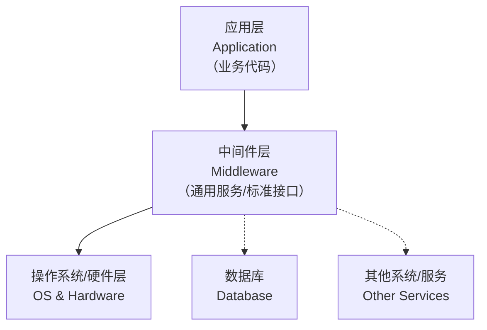

# 2.中间件判断
从Web服务器、应用服务器到数据库和消息队列，识别这些中间件的“身份”是安全测试、信息收集的基础。

这里为你系统梳理了常见的中间件分类、关键判断方法和一些实用建议。

### 🧩 中间件是什么？一张图看懂分层
可以将中间件看作是位于操作系统和应用程序之间的“软件桥梁”或“服务超市”，为上层应用提供通用的服务和能力，让开发者专注于业务本身。它的核心价值在于解耦、复用和简化开发。

---

### 📚 中间件的主要分类与代表产品
为了更清晰地理解，我按功能和典型用途将中间件分为了几大类：

| 分类 | 核心功能 | 常见产品/技术 |
| :--- | :--- | :--- |
| ***� 远程调用 & 通信** | 解决分布式系统中不同服务间的通信问题。 | gRPC, Apache Thrift, Dubbo, CORBA |
| **⛓️**** 集成 & 流程** | 连接异构系统，实现数据、服务的集成与编排。 | Apache Camel, MuleSoft, IBM Integration Bus |
| ***� 事务处理** | 确保分布式事务的ACID（原子性、一致性、隔离性、持久性）特性。 | Java Transaction API (JTA), IBM WebSphere |

> 注意：部分软件（如Redis）功能强大，可能同时属于多个分类。
>

---

### 🕵️ 如何判断目标使用了什么中间件？
这里整理了一份实战方法速查表，从易到难，覆盖了主流的判断思路。

| 判断方法              | 原理简述                            | 具体操作与示例                                                                                                                                                                                                                                                                                                                        | 工具/命令                          |
| :---------------- | :------------------------------ | :----------------------------------------------------------------------------------------------------------------------------------------------------------------------------------------------------------------------------------------------------------------------------------------------------------------------------- | :----------------------------- |
| **看一眼就够 (浏览器)**   | 通过浏览器插件或在线服务，无感识别网站背后的技术栈。      | **Wappalyzer**：安装Chrome/Firefox插件，访问目标网站后点击图标即可看到分析结果   **BuiltWith**：访问 `builtwith.com`，输入域名进行查询                                                                                                                                                                                                                              | Wappalyzer   BuiltWith         |
| **肉眼观察 (HTTP响应)** | 通过分析HTTP响应头、默认页面特征、Cookie等获取线索。 | 1. **查看Server头**：`curl -I http://目标域名` 或 `whatweb 目标域名`，观察 `Server` 字段的值   2. **查看X-Powered-By头**：开发框架或语言（如 `PHP/7.4.33`）的线索   3. **查看Cookie**：`PHPSESSID` (PHP), `JSESSIONID` (JSP), `ASPSESSIONID` (ASP)   4. **观察404页面风格**：不同Web服务器（如IIS, Nginx, Apache）的默认404页面样式不同   5. **访问favicon.ico**：某些CMS或应用有固定图标（如WordPress），可反向查询 | `curl`   `wget`   `nmap -sV`   |
| **命令行利器 (专业工具)**  | 使用专业工具进行主动探测，获取深层信息。            | **WhatWeb**：Kali内置，强大的命令行指纹识别工具   `whatweb 目标域名` (基础扫描)    `whatweb -a 3 目标域名` (中等强度扫描)   `whatweb -v 目标域名` (详细信息)   **Nmap**：服务版本检测脚本   `nmap -sV -p 80,443 目标IP` (识别端口服务及版本)   `nmap -p 8080 --script=http-title,http-headers 目标IP`   **Nmap默认端口参考**：Tomcat/JBoss (8080), WebLogic (7001), Nginx/Apache (80/443)             | `whatweb`   `nmap`   `masscan` |
| **主动触发 (异常请求)**   | 通过构造非正常请求，诱导目标返回详细错误信息。         | 访问一个不存在的路径，如 `http://目标域名/this-path-does-not-exist-123456`。   **观察**：错误页面中可能会包含服务器版本、中间件类型等敏感信息。                                                                                                                                                                                                                               | `curl`/浏览器                     |
| **在线网站**          | 指纹识别                            |                                                                                                                                                                                                                                                                                                                                |                                |

---

还可以通过一些在线网站 指纹识别

### ⚠️ 高风险中间件一览（安全视角）
了解这些是进行风险评估的第一步。以下是一些历史上出现过严重漏洞或配置问题的中间件。

+ **Web中间件**
    - **Apache**：解析漏洞、文件包含、配置错误导致的目录遍历。
    - **Nginx**：CRLF注入、配置错误（如 `alias` 穿越）、` range` 过滤器整数溢出。
    - **IIS**：**短文件名漏洞**、HTTP动词篡改、`WebDAV` 配置不当导致的任意文件上传。
    - **Tomcat**：弱口令导致后台部署WAR包Getshell、`Manager` 后台暴露、示例文件未删除。
    - **JBoss**：反序列化漏洞（如CVE-2017-12149）、`invoker/JMXInvokerServlet` 暴露。
    - **WebLogic**：**反序列化漏洞高危频发**（如CVE-2019-2725）、SSRF、后台弱口令。
    - **Jetty**：信息泄露、部分版本存在双重解码绕过。
+ **数据库 & 缓存**
    - **Redis**：**未授权访问高危**、主从复制RCE。
    - **Memcached**：未授权访问、UDP反射放大DDoS攻击。
    - **MySQL**：弱口令、SQL注入、`LOAD DATA LOCAL INFILE` 读取客户端文件。
+ **消息队列**
    - **ActiveMQ**：反序列化漏洞（如CVE-2015-5254）、任意文件写入（CVE-2016-3088）。
    - **Kafka**：未授权访问、`JMX` 暴露带来的RCE风险。
    - **RabbitMQ**：弱口令、`management` 插件暴露。
+ **其他服务**
    - **Zookeeper**：未授权访问、敏感信息泄露。
    - **Elasticsearch**：未授权访问、Groovy脚本RCE（旧版）、任意文件读取（CVE-2015-1427）。

---

### 💎 总结与注意事项
+ **技术中立原则**：这些判断和识别方法本身是中性技术，是否合规取决于**是否获得了目标资产的明确授权**。请务必在法律框架内，对自己拥有权限的系统进行测试。
+ **组合验证优于单一判断**：不要仅凭一个信息（如HTTP Server头）就下结论。结合 `whatweb`的扫描结果、`nmap`的服务版本、Wappalyzer的识别，能获得更准确的判断。
+ **关注“非标准”部署**：许多中间件（如Tomcat, Redis）会运行在非默认端口，全面扫描所有开放端口才能确保不遗漏。
+ **利用指纹库**：成熟的工具（如Nmap, Whatweb）都内置了庞大的指纹库，这是它们能准确识别多种中间件的基础，也是专业人员和普通用户的区别所在。

如果你想了解某个特定中间件的历史漏洞或更具体的配置加固方法，可以继续提问。
