# 1Burp Suite 安装与使用详解
## 目录
| 课时 | 主题 | 时长 | 核心产出 |
| --- | --- | --- | --- |
| **第 1 课时** | Burp Suite 简介与安装配置 | 60 min | 装好 Burp + JDK，能正常启动 |
| **第 2 课时** | Proxy 模块与浏览器代理 | 60 min | 能抓 HTTP/HTTPS 包并改包 |
| **第 3 课时** | Repeater / Intruder / Decoder 等核心模块 | 60 min | 能改包重放、暴力枚举、编解码 |
| **第 4 课时** | 实战工作流 + 插件 + 移动端抓包 | 60 min | 完整渗透流程跑通 |


---

## 学员前置检查
- [ ] 已学完 HTTP 协议基础（知道请求/响应结构）
- [ ] 已学完法律红线课（知道"授权"是底线）
- [ ] 操作系统：Windows 10/11、macOS 12+、或 Ubuntu 20.04+
- [ ] 至少 8 GB 内存（16 GB 推荐）
- [ ] 5 GB 可用磁盘空间
- [ ] 已装好靶场（DVWA / Pikachu 任一）

> ⚠️ **绝对红线**：本课的所有抓包实操**仅限本地靶场**（127.0.0.1 / 本机 IP）。**禁止用真实网站练手**。
>

---

# 第 1 课时：Burp Suite 简介与安装配置
## 1.1 Burp Suite 是什么？
### 1.1.1 一句话定义
> **Burp Suite** 是 PortSwigger 公司出品的**集成式 Web 应用渗透测试平台**，是全球 Web 安全从业者事实上的"瑞士军刀"。
>

### 1.1.2 它能干什么？
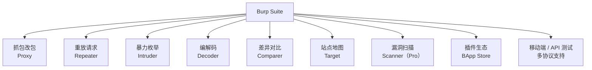

### 1.1.3 为什么是"必学"工具？
| 维度 | Burp 的地位 |
| --- | --- |
| 行业占有率 | 全球 Web 渗透测试**第一** |
| 招聘要求 | 90%+ 渗透岗位**必填** |
| 工具生态 | 2000+ 插件（BApp） |
| 官方训练 | [PortSwigger Web Academy](https://portswigger.net/web-security) 免费配 Burp |
| 国际认证 | Burp Certified Practitioner（BCP） |


> 🎯 **业内黑话**："Burp 起开" = 启动 Burp Suite 开始干活。
>

---

## 1.2 版本对比（重要！）
PortSwigger 提供 **3 个版本**：

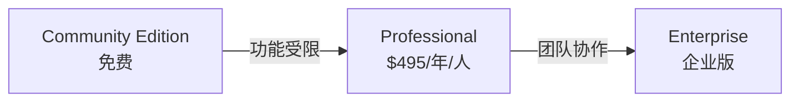

### 详细对比
| 功能 | Community（免费） | Professional | Enterprise |
| --- | :---: | :---: | :---: |
| Proxy 抓包改包 | ✅ | ✅ | ✅ |
| Repeater 重放 | ✅ | ✅ | ✅ |
| Intruder 暴力枚举 | ⚠️ 限速 | ✅ 无限 | ✅ |
| Decoder / Comparer | ✅ | ✅ | ✅ |
| Sequencer 随机性 | ✅ | ✅ | ✅ |
| Target 站点地图 | ✅ 基础 | ✅ 完整 | ✅ |
| **漏洞扫描 Scanner** | ❌ | ✅ | ✅ 大规模 |
| **保存/恢复项目** | ⚠️ 不支持保存 | ✅ | ✅ |
| **BChecks 自定义扫描** | ❌ | ✅ | ✅ |
| 插件 BApp Store | ✅ | ✅ | ✅ |
| 嵌入式浏览器 | ✅ | ✅ | ✅ |
| 协作 / CI 集成 | ❌ | ⚠️ 限 | ✅ |
| 价格 | 免费 | $495/年 | 商谈 |


### 1.3.1 Burp 的运行依赖
Burp Suite 是 **Java 程序**，需要 **JDK 17+**（自 2023 版起强制要求）。

```plain
┌──────────────────────────────────────┐
│  Burp Suite 启动包 (.jar)            │
│              ▼                       │
│      Java Runtime (JDK 17+)          │
│              ▼                       │
│       操作系统 (Win/Mac/Linux)        │
└──────────────────────────────────────┘
```

### 1.3.2 安装 JDK 17
#### Windows
```powershell
# 方法 1：官网下载 Oracle JDK 17
# https://www.oracle.com/java/technologies/downloads/

# 方法 2：用 winget（推荐）
winget install Microsoft.OpenJDK.17

# 方法 3：用 Chocolatey
choco install microsoft-openjdk17
```

验证：

```powershell
java -version
# 输出应类似：openjdk version "17.0.x"
```

#### macOS
```bash
# 用 Homebrew（推荐）
brew install openjdk@17

# 配置 JAVA_HOME（zsh）
echo 'export JAVA_HOME=$(/usr/libexec/java_home -v 17)' >> ~/.zshrc
echo 'export PATH=$JAVA_HOME/bin:$PATH' >> ~/.zshrc
source ~/.zshrc

# 验证
java -version
```

#### Linux (Ubuntu/Debian)
```bash
sudo apt update
sudo apt install -y openjdk-17-jdk

# 验证
java -version
```

> 💡 **多版本 JDK 共存**：可用 `update-alternatives --config java`（Linux）或 `jenv`（macOS）管理。
>

---

## 1.4 下载与安装 Burp Suite
### 1.4.1 下载地址
**官方下载**：[https://portswigger.net/burp/communitydownload](https://portswigger.net/burp/communitydownload)

> ⚠️ **务必从官网下载**，不要从第三方网盘 / 论坛下载，避免后门。
>

### 1.4.2 各平台安装步骤
#### Windows
1. 下载 `burpsuite_community_windows_v2024_x_x.exe`
2. 双击运行 → Next → 接受协议 → 安装
3. 启动开始菜单中的 "Burp Suite Community Edition"
4. 首次启动会要求激活（Community 版激活只需点几下）

#### macOS
1. 下载 `burpsuite_community_macos_v2024_x_x.dmg`
2. 双击挂载 → 拖动 Burp Suite 到 Applications
3. 首次启动若提示"无法验证开发者"：
    - 系统偏好设置 → 安全性与隐私 → 允许打开

#### Linux
```bash
# 方式 1：deb 包（Debian/Ubuntu）
sudo dpkg -i burpsuite_community_linux_v2024_x_x.deb

# 方式 2：jar 包（通用）
chmod +x burpsuite_community_v2024_x_x.jar
java -jar burpsuite_community_v2024_x_x.jar
```

### 1.4.3 首次启动流程
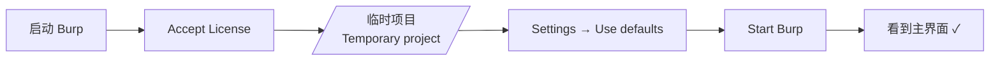

**关键选择**：

+ **Temporary project**（临时）：培训阶段用这个，关掉就没了
+ **New project on disk**（磁盘项目）：**Pro 才能保存**，社区版只能临时
+ **Open existing project**：打开之前的项目（社区版禁用）

> 💡 **Community 版限制提示**：若选"保存项目"会跳出"仅 Pro 支持"，正常现象。
>

---

## 1.5 主界面全景
启动后看到的界面：

```plain
┌─────────────────────────────────────────────────────────────┐
│  Menu: File / Settings / Help / ...                         │
├─────────────────────────────────────────────────────────────┤
│  Tabs:  [Dashboard] [Target] [Proxy] [Intruder] [Repeater]  │
│         [Sequencer] [Decoder] [Comparer] [Logger++] [Extender]│
├─────────────────────────────────────────────────────────────┤
│  │                                                          │
│  │   当前 Tab 的内容区                                       │
│  │                                                          │
│  │                                                          │
├─────────────────────────────────────────────────────────────┤
│  Status bar: Event log / Tasks / ...                        │
└─────────────────────────────────────────────────────────────┘
```

### 各 Tab 速览
| Tab | 中文 | 用途 | 课时 |
| --- | --- | --- | :---: |
| Dashboard | 仪表盘 | 任务概览、扫描通知 | - |
| **Target** | 目标 | 站点地图、作用域 | 1.6 |
| **Proxy** | 代理 | 抓包/改包/历史 | 课时 2 |
| **Intruder** | 入侵者 | 暴力枚举、Fuzz | 课时 3 |
| **Repeater** | 重放器 | 改包反复试 | 课时 3 |
| Sequencer | 序列分析 | Session 随机性 | 选学 |
| **Decoder** | 解码器 | 编码/解码 | 课时 3 |
| **Comparer** | 对比器 | 差异对比 | 课时 3 |
| Logger++ | 增强日志 | 所有请求记录（插件） | 课时 4 |
| Extender | 扩展 | 插件管理 | 课时 4 |


---

## 1.6 全局设置（一次性配置）
### 1.6.1 打开 Settings
`Settings` (齿轮图标) 或 `Burp → Settings` (Mac菜单栏)

### 1.6.2 必改的几项
#### (1) Project → Scope（作用域）
防止你**不小心抓到无关网站**的流量。

```plain
Scope
  ├── Add → Domain name: 127.0.0.1
  ├── Add → Domain name: localhost
  └── Add → Domain name: 你的靶场域名
```

**勾选**："Only show in-scope items"（在 Target/Proxy 中只显示范围内请求）

#### (2) Network → Connections → SOCKS proxy（按需）
如需走代理上网：填入你的 SOCKS 代理。

#### (3) Network → HTTP → HTTP Regular Upstream Proxy
Burp 自身的出网代理（极少需要）。

#### (4) Suite → Appearance
主题切换、字号调整。

#### (5) User → Misc → Performance
内存调优（处理大流量时有用）。

---

## 1.7 嵌入式浏览器（Built-in Browser）
### 1.7.1 这是什么？
Burp 2023+ 内置了 **Chromium 浏览器**，**已自动配置好代理和证书**，开箱即用。

```plain
┌──────────────────────────────────────┐
│  Burp Suite                          │
│    ├── Proxy (127.0.0.1:8080)        │
│    └── 嵌入式 Chromium ── 自动走代理 │
└──────────────────────────────────────┘
```

### 1.7.2 启动
`Proxy → Open browser` → 弹出一个 Chromium 窗口。

> 💡 **强烈推荐新手用嵌入式浏览器**：
>
> + 不用手动配置代理
> + 不用手动装证书
> + 不影响日常浏览
> + 不污染系统浏览器
>

### 1.7.3 何时用系统浏览器？
+ 需要**特定插件**（如开发者工具的某些功能）
+ 测试**移动 Web**（要 UA 切换）
+ 嵌入浏览器**不兼容**某站点时

---

## 1.8 第一个抓包验证
### 1.8.1 准备靶场
```bash
# 启动 DVWA
docker run -d -p 80:80 --name dvwa vulnerables/web-dvwa

# 默认账号 admin / password
```

### 1.8.2 完整流程


### 1.8.3 操作步骤
1. 启动 Burp → 进入 `Proxy → Intercept` 标签
2. 确认 `Intercept is on`（拦截开启）
3. 点 `Open browser` 启动嵌入浏览器
4. 访问 `http://127.0.0.1/login.php`
5. Burp 拦截到请求 → 看到 GET 请求原文
6. 点 `Forward` 放行，或点 `Drop` 丢弃

> ✅ **若能看到下面类似的请求**，说明环境完全就绪：
>

```http
GET /login.php HTTP/1.1
Host: 127.0.0.1
User-Agent: Mozilla/5.0 ...
Accept: text/html,...
...
```

---

## 1.9 课时 1 小结
| 关键词 | 一句话 |
| --- | --- |
| 工具 | Burp Suite = Web 渗透瑞士军刀 |
| 版本 | 培训用 Community 足够 |
| 环境 | 需要 JDK 17+，官网下载 |
| 项目 | 临时项目即可，关掉即失效 |
| 浏览器 | 嵌入式 Chromium 最省事 |
| 作用域 | 一定要配 Scope，避免抓到无关流量 |


### 课间实操题（10 min）
1. 安装 JDK 17 并验证版本。
2. 下载并启动 Burp Suite Community。
3. 启动 DVWA 靶场。
4. 用嵌入式浏览器访问 DVWA，在 Burp 中成功拦截到 GET 请求。
5. 在 Scope 中添加 127.0.0.1，启用 "Only show in-scope items"。

---

# 第 2 课时：Proxy 模块与浏览器代理
## 2.1 Proxy 模块全景
### 2.1.1 Proxy 是 Burp 的心脏
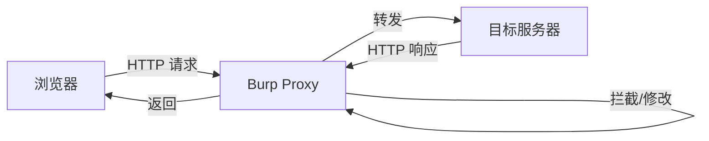

### 2.1.2 三个子标签
| 子标签 | 用途 |
| --- | --- |
| **Intercept** | 实时拦截 / 修改 / 放行 |
| **HTTP history** | 历史请求列表（自动记录） |
| **WebSockets history** | WebSocket 消息记录 |


---

## 2.2 配置系统浏览器代理（替代嵌入浏览器）
### 2.2.1 Burp 默认监听端口
```plain
协议: HTTP
地址: 127.0.0.1
端口: 8080
```

验证：`Settings → Network → Network → Proxy listeners`

### 2.2.2 Firefox 配置（推荐！）
> Firefox 的代理独立于系统，最适合渗透测试用。
>

1. Firefox → `Settings → Network Settings → Manual proxy configuration`
2. HTTP Proxy: `127.0.0.1`，Port: `8080`
3. 勾选 **Also use this proxy for HTTPS**
4. No Proxy for: `localhost, 127.0.0.1`（**注意：测试本地靶场时要清掉这条**）

### 2.2.3 Chrome / Edge 配置
Chrome / Edge 走**系统代理**：

#### Windows
`Settings → Network → Proxy → Manual proxy setup`

+ Address: `127.0.0.1`
+ Port: `8080`

#### macOS
`System Settings → Network → Wi-Fi → Details → Proxies`

+ Web Proxy (HTTP): `127.0.0.1:8080`
+ Secure Web Proxy (HTTPS): `127.0.0.1:8080`

#### Linux (Ubuntu)
`Settings → Network → Network Proxy → Manual`

+ HTTP / HTTPS Proxy: `127.0.0.1:8080`

### 2.2.4 推荐工具：SwitchyOmega（浏览器插件）
| 优点 | 说明 |
| --- | --- |
| 一键切换 | Burp / 直连 / 自定义场景 |
| 不影响系统 | 只影响浏览器 |
| 多 Profile | 可保存多个代理配置 |


下载：[Chrome 应用商店](https://chrome.google.com/webstore/detail/proxy-switchyomega/padekgcemlokbadohgkifijomclgjgif) / [Firefox 附加组件](https://addons.mozilla.org/firefox/addon/switchyomega/)

> 💡 **必装插件**：日常渗透必备，比改系统代理舒服 100 倍。
>

### 2.2.5 验证代理
```bash
# 浏览器开着代理，访问该 URL
http://burp
# 若出现 "Burp Suite Page Not Found" 说明代理生效

# 命令行验证
curl -x http://127.0.0.1:8080 http://burp
```

---

## 2.3 HTTPS 抓包与证书
### 2.3.1 为什么需要装证书？
```plain
浏览器 ──HTTPS──► Burp ──HTTPS──► 真实服务器

Burp 用自签证书冒充服务器 → 浏览器报警"不安全"
```

解决：**把 Burp 的根证书导入浏览器信任列表**。

### 2.3.2 导入证书（Firefox）
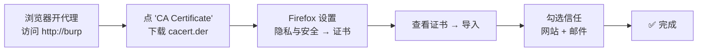

### 2.3.3 导入证书（Chrome / Edge）
1. 浏览器开代理访问 `http://burp` → 下载 `cacert.der`
2. Windows：双击 `cacert.der` → 安装证书 → **本地计算机** → **受信任的根证书颁发机构**
3. macOS：双击 → 钥匙串访问 → 添加到"系统"钥匙串 → **双击证书 → 信任 → 始终信任**
4. Linux（Chrome）：

```bash
sudo cp cacert.der /usr/local/share/ca-certificates/burp.crt
sudo update-ca-certificates
# 然后在 Chrome 里手动导入到" Authorities"
```

### 2.3.4 验证
访问 `https://example.com` —— **不再出现"您的连接不是私密连接"警告** → 证书生效。

> ⚠️ **重要安全提醒**：
>
> + 培训结束后**立即从系统删除 Burp 证书**
> + 否则**咖啡厅 / 公共 WiFi 的中间人攻击**会得手（攻击者用同样的根证书冒充任何网站）
> + 删除路径同导入路径，找到 "PortSwigger CA" → 删除
>

---

## 2.4 Intercept 子标签详解
### 2.4.1 界面
```plain
┌──────────────────────────────────────────┐
│ [Intercept is on/off]  [Forward] [Drop]  │
│ [Action ▼] [Show in Repeater] [..]       │
├──────────────────────────────────────────┤
│  HTTP 请求原文（可编辑）                  │
│                                          │
└──────────────────────────────────────────┘
```

### 2.4.2 关键按钮
| 按钮 | 功能 | 快捷键 |
| --- | --- | :---: |
| **Intercept is on** | 切换拦截开关 | - |
| **Forward** | 放行当前请求 | Ctrl+R / Ctrl+F |
| **Drop** | 丢弃当前请求 | Ctrl+D |
| **Action** | 下拉菜单，可发送到其他模块 | - |
| **Raw / Hex / Headers** | 切换请求显示方式 | - |


### 2.4.3 实时改包
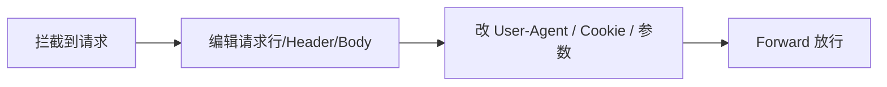

### 2.4.4 实操：修改请求
**目标**：把 DVWA 的安全等级从 `impossible` 改为 `low`（绕过防护）。

```http
# 拦截到：
GET /vulnerabilities/sqli/?id=1 HTTP/1.1
Host: 127.0.0.1
Cookie: security=impossible; PHPSESSID=xxx

# 修改为：
GET /vulnerabilities/sqli/?id=1 HTTP/1.1
Host: 127.0.0.1
Cookie: security=low; PHPSESSID=xxx     ← 改这里
```

按 `Forward`，观察页面响应 —— SQL 注入的过滤突然失效了。

### 2.4.5 Action 菜单（重点）
```plain
Action ▼
  ├── Send to Repeater       (Ctrl+R)   ← 必背
  ├── Send to Intruder       (Ctrl+I)   ← 必背
  ├── Send to Sequencer
  ├── Send to Comparer
  ├── Send to Decoder
  ├── Do an active scan                 (Pro)
  ├── Request in browser
  └── ...
```

> 💡 **快捷键是渗透效率的关键**：`Ctrl+R` 重放、`Ctrl+I` 送 Intruder，背下来！
>

---

## 2.5 HTTP History 子标签
### 2.5.1 这是什么？
**自动记录所有经过 Burp 的请求/响应**，无需手动拦截。

```plain
┌──────────────────────────────────────────────────────────┐
│ # │ Host          │ Method │ URL           │ Status │ ..│
├───┼───────────────┼─────────┼───────────────┼────────┼───┤
│ 1 │ 127.0.0.1     │ GET     │ /login.php    │ 200    │   │
│ 2 │ 127.0.0.1     │ POST    │ /login.php    │ 302    │   │
│ 3 │ 127.0.0.1     │ GET     │ /index.php    │ 200    │   │
└──────────────────────────────────────────────────────────┘
```

### 2.5.2 过滤器（重要！）
点顶部的过滤器条 → 可按以下条件筛选：

| 维度 | 选项 |
| --- | --- |
| Method | GET / POST / PUT / DELETE 等 |
| MIME type | HTML / JSON / Script 等 |
| Status code | 200 / 302 / 403 等 |
| Search | 关键字（在请求/响应中搜索） |
| Scope | 只显示作用域内 |
| Annotation | 只显示已加注释的 |


### 2.5.3 实操：找登录请求
1. 浏览器访问 DVWA，用 `admin / password` 登录
2. 打开 HTTP History
3. 在过滤器输入 `password`
4. 找到 POST 请求，点开 → 看到 Body：`username=admin&password=password&Login=Login`

### 2.5.4 颜色与注释
| 功能 | 用法 |
| --- | --- |
| 右键 → Highlight | 给请求加颜色标记（红/绿/蓝等） |
| 右键 → Comment | 加文字注释 |
| Notes 列 | 显示注释 |


> 💡 **实战技巧**：渗透一个网站时，**给"疑似漏洞点"标红 + 加注释**，避免后期淹没在历史记录里。
>

---

## 2.6 Target 模块（站点地图）
### 2.6.1 两个视图
```plain
Target
  ├── Site map     ← 树状结构展示所有访问过的目录/页面
  └── Issues       ← 扫描出的漏洞列表（Pro）
```

### 2.6.2 站点地图的价值
```plain
example.com/
  ├── /login.php          [POST]
  ├── /admin/             [403]      ← 隐藏目录
  │   └── /config.php     [403]
  ├── /api/
  │   ├── /v1/users       [200]      ← JSON 接口
  │   └── /v1/orders      [401]
  └── /static/
```

+ 一眼看清**整站结构**
+ 发现**未授权目录**
+ 找**API 接口**

### 2.6.3 作用域（Scope）配置
`Target → Scope → Add`：

| 类型 | 输入 | 含义 |
| --- | --- | --- |
| Domain name | `example.com` | 所有子域 |
| Domain name | `*.example.com` | 同上 |
| URL prefix | `https://example.com/admin/` | 仅该路径 |
| URL regex | `^https://.*\.example\.com/api/.*$` | 正则 |


> 🎯 **渗透视角**：Scope 是**保护自己的第一道防线** —— Scope 外的请求即使被你抓到，也不要主动去测。
>

---

## 2.7 课时 2 小结
| 模块 | 要点 |
| --- | --- |
| 监听端口 | 127.0.0.1:8080 |
| 浏览器 | 优先用嵌入式 Chromium；系统浏览器用 SwitchyOmega |
| 证书 | [http://burp](http://burp) 下载，导入到"受信任根 CA" |
| 安全 | 培训后**立即删除** Burp 根证书 |
| Intercept | 实时改包；快捷键 Ctrl+R / Ctrl+I |
| History | 自动记录，善用过滤器 |
| Target | 站点地图 + Scope 保护 |


### 课间实操题（15 min）
1. 用 Firefox 配置代理，成功抓到 DVWA 登录请求。
2. 导入 Burp 证书，能抓 HTTPS 站点（如 `https://example.com`）。
3. 在 History 中用过滤器找出所有 POST 请求。
4. 拦截登录请求，把 `username=admin` 改成 `username=administrator`，看响应差异。
5. 在 Target 站点地图中找到 DVWA 的所有隐藏目录。

---

# 第 3 课时：Repeater / Intruder / Decoder 等核心模块
## 3.1 Repeater（重放器）—— 最常用！
### 3.1.1 用途
> **改一改 → 发一次 → 看响应 → 再改 → 再发**，反复试 Payload 的工具。
>

### 3.1.2 界面
```plain
┌─────────────────────────────────────────────────────────┐
│  Repeater                                  [+] [×]      │  ← Tab 标签
├──────────────┬──────────────────────────────────────────┤
│ Position     │  请求区（左）                             │
│ Inspector    │  ┌───────────────────────────────────┐  │
│ Target       │  │ GET /?id=1 HTTP/1.1              │  │
│              │  │ Host: 127.0.0.1                  │  │
│              │  │ ...                              │  │
│              │  └───────────────────────────────────┘  │
│              │  [Send]  [Cancel]   [..]                │
├──────────────┼──────────────────────────────────────────┤
│              │  响应区（右）                             │
│              │  ┌───────────────────────────────────┐  │
│              │  │ HTTP/1.1 200 OK                  │  │
│              │  │ ...                              │  │
│              │  │ <html>...</html>                 │  │
│              │  └───────────────────────────────────┘  │
└──────────────┴──────────────────────────────────────────┘
```

### 3.1.3 核心操作
| 操作 | 快捷键 | 说明 |
| --- | :---: | --- |
| 从 Proxy 发来 | Ctrl+R | 任意请求右键 → Send to Repeater |
| 发送请求 | - | 点 `Send` |
| 修改请求 | 直接编辑 | 请求区的字都可改 |
| 切换视图 | Raw / Hex / Params / Headers | 顶部 Tab |


### 3.1.4 Inspector 面板（2020+ 新功能）
左侧 `Inspector` 显示：

+ **Request Attributes**：Host / Method / HTTP 版本可快速改
+ **Request Query Parameters**：URL 参数表
+ **Request Body Parameters**：Body 参数表
+ **Request Headers**：Header 表
+ **Response Headers** / **Response Body**

**优势**：表格式编辑比手改 raw 文本方便，自动处理 URL 编码。

### 3.1.5 实操：Repeater 测试 SQL 注入
**目标**：DVWA 的 SQL 注入关卡（安全等级 low）。

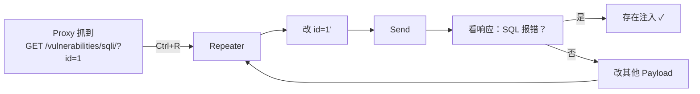

**Payload 序列**：

```plain
id=1             → 正常
id=1'            → SQL 报错
id=1'-- -        → 正常（注释绕过）
id=1' UNION SELECT 1-- -            → 看列数
id=1' UNION SELECT 1,2-- -          → 显示位
id=1' UNION SELECT user(),2-- -     → 拿到当前用户
id=1' UNION SELECT database(),2-- - → 拿到库名
```

**每次改完点 Send，对比响应差异。**

### 3.1.6 Repeater 的小技巧
| 技巧 | 用法 |
| --- | --- |
| 多标签 | 点 `+` 开多个 Repeater 标签，并行测试 |
| 历史 | `←` `→` 翻历史发送记录 |
| Beautifier | 自动美化 JSON / XML / HTML |
| Render | 渲染响应为网页（看视觉效果） |
| Show in Browser | 把响应在浏览器里看 |
| Copy as curl command | 一键复制为 curl 命令 |


> 💡 **必学**：`右键 → Copy as curl command` —— 可以把请求贴到终端里用 curl 跑，方便写 PoC。
>

---

## 3.2 Intruder（入侵者）—— 暴力枚举
### 3.2.1 用途
> 给请求里的**某个变量**塞进**字典**，批量发送 —— 用来爆破密码、枚举 ID、Fuzz 参数。
>

### 3.2.2 四种攻击类型
| 类型 | 含义 | 适用场景 |
| --- | --- | --- |
| **Sniper** | 1 个变量，1 个字典，逐个塞 | 单参数爆破 |
| **Battering ram** | 多个变量共用同一字典 | 用户名和密码同字典 |
| **Pitchfork** | 多变量各自字典，并行 | 字典对应位置 |
| **Cluster bomb** | 多变量各自字典，全组合 | 用户名 × 密码 全组合 |


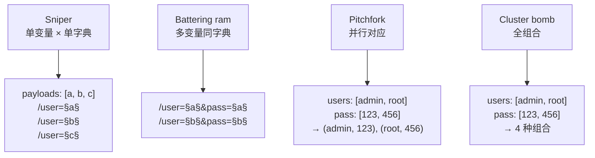

### 3.2.3 完整操作流程
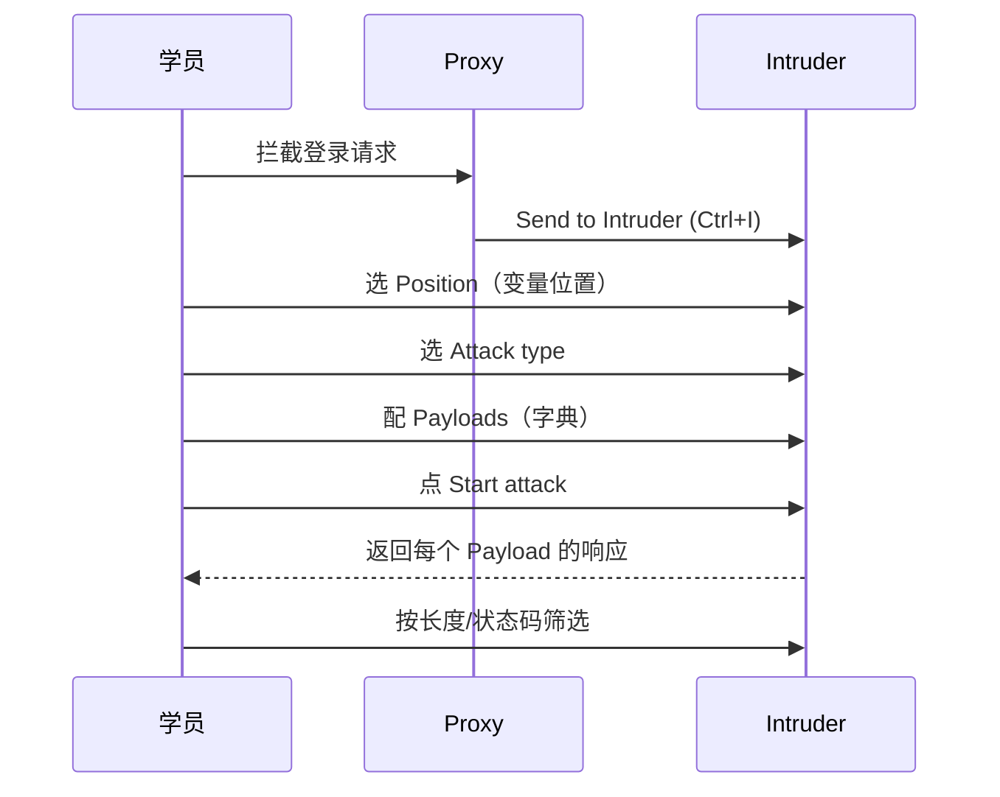

### 3.2.4 实操：爆破 DVWA 登录
**前置**：DVWA 安全等级 low，关闭 CSRF token。

**步骤**：

1. Proxy 拦截到登录请求：

```http
POST /login.php HTTP/1.1
...
username=admin&password=password&Login=Login
```

2. 右键 → `Send to Intruder` (Ctrl+I)
3. **Positions 标签**：
    - 点 `Clear §` 清除默认标记
    - 选中 `admin` → 点 `Add §`
    - 选中 `password` → 点 `Add §`
    - 结果：`username=§admin§&password=§password§&Login=Login`
    - 攻击类型选 **Cluster bomb**
4. **Payloads 标签**：
    - Payload set 1（用户名）：

```plain
admin
administrator
root
test
```

    - Payload set 2（密码）：

```plain
password
123456
admin
12345678
letmein
```

5. **Resource pool** 标签（可选）：限制并发避免把靶场打爆
6. 点 `Start attack` → 弹出新窗口
7. **结果分析**：
    - 点 `Length` 列排序
    - **响应长度异常的**通常是登录成功
    - 或看 `Status` 列，302 通常表示登录成功

### 3.2.5 Payload Sets 高级配置
| 类型 | 用途 |
| --- | --- |
| Simple list | 简单列表 |
| Runtime file | 从文件读取（如 rockyou.txt） |
| Numbers | 数字范围（如 1-1000） |
| Dates | 日期 |
| Brute forcer | 字符组合暴力破解（按字符集） |
| **Character blocks** | 长字符串（Fuzz 测试） |
| Null payloads | 空 Payload（用来重放） |
| **Character substitution** | 字符替换（a→@, o→0） |
| Recursive grep | 递归（上一次响应作为下次输入） |


> 💡 **Fuzz 字符**：`Character blocks` 里的长字符串用来测溢出 / 边界。
>

### 3.2.6 Grep - Match（结果匹配）
在 `Settings → Intruder → Grep - Match` 添加关键字：

```plain
登录成功
admin
欢迎
error
invalid
```

结果列表会自动加列显示哪些匹配上了。

### 3.2.7 Community 版的限制
+ **请求频率受限**（约 1 req/s）
+ 不能用 Resource pool 多任务

> 🎯 **绕过限制的合规做法**：
>
> + 不绕！社区版慢一点是正常的
> + 急需快速度：买正版 Pro
> + 或用 ffuf / wfuzz / hydra 命令行替代
>

---

## 3.3 Decoder（解码器）
### 3.3.1 用途
编码 / 解码各种格式：URL / Base64 / HTML / Hex / ASCII 等。

### 3.3.2 界面
```plain
┌──────────────────────────────────────┐
│  输入框（上方）                       │
├──────────────────────────────────────┤
│  [Encode as...] [Decode as...] [Hash]│
│   URL / Base64 / HTML / Hex / ...    │
├──────────────────────────────────────┤
│  输出框（下方）                       │
└──────────────────────────────────────┘
```

### 3.3.3 实操
| 输入 | 操作 | 输出 |
| --- | --- | --- |
| `hello world` | URL encode | `hello%20world` |
| `hello%20world` | URL decode | `hello world` |
| `admin:password` | Base64 encode | `YWRtaW46cGFzc3dvcmQ=` |
| `YWRtaW46cGFzc3dvcmQ=` | Base64 decode | `admin:password` |
| `<script>` | HTML encode | `&lt;script&gt;` |
| `%253c` | URL decode 两次 | `<` |


> 🎯 **渗透场景**：
>
> + 看到 Cookie 里 `data=eyJ1c2VyIjoiYWRtaW4ifQ==` → Base64 解码 → JSON
> + 双重 URL 编码绕过 WAF：`<` → `%3c` → `%253c`
>

### 3.3.4 Hash 计算
Decoder 也支持哈希：MD5 / SHA1 / SHA256 / SHA512。

```plain
输入: 123456
Hash → MD5:  e10adc3949ba59abbe56e057f20f883e
Hash → SHA256: 8d969eef6ecad3c29a3a629280e686cf0c3f5d5a86aff3ca12020c923adc6c92
```

> 🎯 **场景**：拿到数据库里的 MD5 密码哈希，先本地查彩虹表（cmd5.com）。
>

---

## 3.4 Comparer（对比器）
### 3.4.1 用途
**对比两个请求/响应的差异**，找"什么变了"。

### 3.4.2 实操
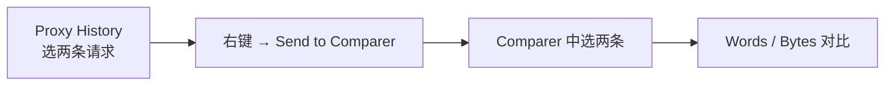

**场景**：测试 SQL 注入时：

+ 请求 1：`id=1` → 响应 A
+ 请求 2：`id=1'` → 响应 B（可能 500 报错）
+ Comparer 对比 → 一眼看到 SQL 报错信息在哪个位置

### 3.4.3 视图
+ **Words**：按词对比
+ **Chars**：按字符对比
+ **Bytes**：按字节对比

---

## 3.5 Sequencer（选学）
### 3.5.1 用途
分析**会话 Token、SessionID、CSRF Token** 等的**随机性强度**。

### 3.5.2 操作
1. Proxy History 选一个登录响应
2. 右键 → `Send to Sequencer`
3. 选 `Set-Cookie` 中的 Token
4. 点 `Start live capture`
5. 采集 1000+ 个样本后 `Analyze now`
6. 看：
    - **Entropy（熵）**：越高越随机
    - **Character-level analysis**：每个位置字符分布
    - **Length**：是否固定长度

> 🎯 **场景**：检测目标系统的 SessionID 是否可预测 —— 若熵低，可能存在**会话预测漏洞**。
>

---

## 3.6 Logger++（增强日志，需装插件）
### 3.6.1 为什么需要？
Proxy History 只记录 HTTP，**Logger++ 能记录所有工具（包括 Repeater、Intruder）的请求**，并且：

+ 高级过滤（类似 SQL 查询）
+ 表格视图可排序
+ 可导出 CSV

### 3.6.2 安装
`Extensions → BApp Store → 搜 Logger++ → Install`

---

## 3.7 课时 3 小结
| 模块 | 用途 | 核心动作 |
| --- | --- | --- |
| **Repeater** | 改包重放 | Ctrl+R → 改 → Send |
| **Intruder** | 暴力枚举 | 4 种攻击类型 |
| **Decoder** | 编解码 + Hash | 双重编码绕 WAF |
| **Comparer** | 差异对比 | 找"响应差在哪" |
| Sequencer | Token 随机性 | 1000+ 样本分析 |
| Logger++ | 增强日志 | 全工具请求记录 |


### 课间实操题（20 min）
1. 用 Repeater 完成 DVWA SQL 注入（low 等级），拿到 `database()` 返回值。
2. 用 Intruder（Cluster bomb）爆破 DVWA 登录，找到正确账号密码。
3. Decoder 练习：解码 `eyJzdWIiOiIxMjMifQ==`，看是什么 JSON。
4. 用 Comparer 对比 `id=1` 和 `id=1'` 的响应差异。
5. （选学）装 Logger++ 插件，观察 Repeater 请求是否被记录。

---

# 第 4 课时：实战工作流 + 插件 + 移动端抓包
## 4.1 标准 Web 渗透工作流
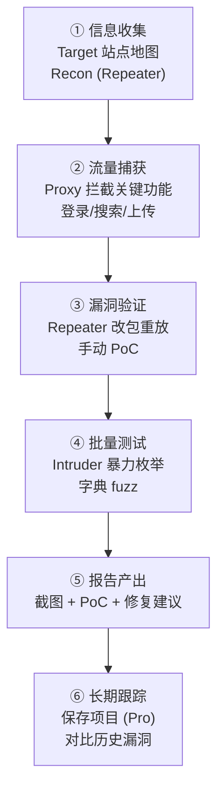

### 4.1.1 信息收集阶段
| 动作 | 用 Burp 哪个模块 |
| --- | --- |
| 浏览网站，记录所有页面 | Target → Site map |
| 抓 API 请求，看返回 | HTTP History |
| 探测隐藏目录 | Intruder（Path 字典） |
| 看 Cookie / Token 结构 | Inspector |


### 4.1.2 流量捕获阶段
**核心动作**：**操作网站所有功能**，让 Burp 记录完整流量。

```plain
□ 登录
□ 注销
□ 修改密码
□ 搜索
□ 上传头像
□ 查看个人资料
□ 越权候选点（带 id 参数的请求）
□ API 请求（前端调 XHR/Fetch 的）
```

### 4.1.3 漏洞验证阶段
| 漏洞 | 验证方式 |
| --- | --- |
| SQL 注入 | Repeater 加 `'` `-- -` `UNION SELECT` |
| XSS | Repeater 加 `<script>alert(1)</script>` |
| 越权 (IDOR) | Repeater 改 `id=别人的id` |
| 命令注入 | Repeater 加 `;id` `|whoami` |
| 文件上传 | Repeater 改 `filename=shell.php` |
| SSRF | Repeater 改 URL 参数 = `http://127.0.0.1` |
| XXE | Repeater 改 Content-Type 为 XML + 外部实体 |


---

## 4.2 实战演示：完整拿下 DVWA SQL 注入（low）
### 4.2.1 步骤
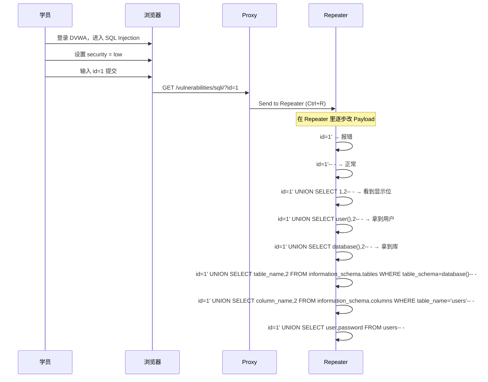

### 4.2.2 关键 Payload 表
| 阶段 | Payload |
| --- | --- |
| 判断注入 | `1'` |
| 闭合引号 | `1'-- -` |
| 看列数 | `1' UNION SELECT 1-- -`（递增到不报错） |
| 看显示位 | `1' UNION SELECT 1,2-- -` |
| 当前用户 | `1' UNION SELECT user(),2-- -` |
| 当前库 | `1' UNION SELECT database(),2-- -` |
| 版本 | `1' UNION SELECT version(),2-- -` |
| 所有库 | `1' UNION SELECT schema_name,2 FROM information_schema.schemata-- -` |
| 表名 | `1' UNION SELECT table_name,2 FROM information_schema.tables WHERE table_schema='dvwa'-- -` |
| 列名 | `1' UNION SELECT column_name,2 FROM information_schema.columns WHERE table_name='users'-- -` |
| 数据 | `1' UNION SELECT user,password FROM users-- -` |


> ⚠️ **重申合规**：以上 Payload 仅用于 DVWA 等授权靶场。
>

---

## 4.3 插件生态：BApp Store
### 4.3.1 打开方式
`Extensions → BApp Store`

### 4.3.2 必装插件清单（培训推荐）
| 插件 | 功能 | 必装度 |
| --- | --- | :---: |
| **Logger++** | 增强日志 | ★★★★★ |
| **JSON Viewer** | 响应自动美化 JSON | ★★★★★ |
| **AuthMatrix** | 权限矩阵测试（越权神器） | ★★★★★ |
| **Autorize** | 自动越权检测 | ★★★★ |
| **Hackvertor** | 标签化编解码（XSS 绕 WAF） | ★★★★ |
| **Param Miner** | 参数发现 / Header 缓存探测 | ★★★★ |
| **HTTP Request Smuggler** | HTTP 请求走私 | ★★★ |
| **Active Scan++** | 扩展主动扫描 | ★★★★ |
| **JS Link Finder** | 提取 JS 中的接口 | ★★★★ |
| **Retire.js** | 检测前端组件漏洞 | ★★★ |
| **GAP** | 参数 / 端点挖掘 | ★★★ |
| **Flow** | 流量统计 | ★★ |


### 4.3.3 安装示例
```plain
Extensions → BApp Store
  → 搜 "Logger++"
  → 点击 Install
  → 安装后顶部多出 Logger++ 标签
```

### 4.3.4 自己写插件（进阶）
| 接口 | 说明 |
| --- | --- |
| **Montoya API**（现） | Java 现代接口，替代旧的 Extender API |
| **Jython** | 用 Python 2.x 写（已不推荐） |
| **Kotlin / Groovy** | JVM 语言皆可 |


> 🎯 **入门门槛**：会 Java 看官方示例 → [https://github.com/PortSwigger/example-extensions](https://github.com/PortSwigger/example-extensions)
>

---

## 4.4 移动端抓包
### 4.4.1 架构图


### 4.4.2 步骤
1. **电脑 + 手机同一 WiFi**
2. **Burp 监听所有接口**：
    - `Settings → Network → Proxy listeners → Edit`
    - Bind to address: **All interfaces**
    - Bind to port: `8080`
3. **手机查电脑 IP**：
    - Windows：`ipconfig`
    - macOS：`ifconfig` / 系统设置
    - Linux：`ip addr`
4. **手机配置 WiFi 代理**：
    - 设置 → WiFi → 当前 WiFi → 配置代理
    - 手动 → 主机名：电脑 IP，端口：8080
5. **手机访问 **`http://电脑IP:8080/cert` 下载证书
6. **安装证书**：
    - iOS：设置 → 通用 → VPN 与设备管理 → 安装
    - Android：设置 → 安全 → 加密与凭据 → 安装证书

### 4.4.3 Android 7+ 的坑
> Android 7.0 起，**App 默认不信任用户证书**，只信任系统证书。
>

**解决方案**：

| 方案 | 难度 | 说明 |
| --- | :---: | --- |
| **Root 后装系统证书** | 高 | 把 Burp CA 装到 `/system/etc/security/cacerts/` |
| **Magisk + Move Certificates** | 中 | Magisk 模块自动挪到系统 |
| ** objection + Frida** | 中 | 绕过 SSL Pinning |
| **用 Android 6 模拟器** | 低 | 推荐新手 |
| **改 APK 的 networkSecurityConfig** | 中 | 反编译 → 改 → 重打包 |


### 4.4.4 SSL Pinning（证书绑定）
很多 App 写死了**自己的服务器证书指纹**，不信任任何 CA → 即使装了 Burp 证书也抓不到包。

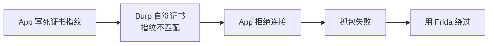

**绕过工具**：

+ **objection**：`objection -g 包名 explore` → `android sslpinning disable`
+ **Frida 代码**：hook OkHttp / TrustManager
+ **JustTrustMe**：Xposed 模块

### 4.4.5 双向 TLS (mTLS)
部分金融 App 不仅客户端验服务器，**服务器还验客户端证书** → 抓包失败。

**解决**：从 App 内提取 `.p12` / `.pfx` 客户端证书 → 在 Burp 中导入：  
`Settings → Network → TLS → Client TLS certificates → Add`

---

## 4.5 Burp 与命令行工具的协作
### 4.5.1 curl 复制请求
Repeater 右下角 → `Copy as curl command` → 终端粘贴：

```bash
curl -i -s -k 'http://127.0.0.1/vulnerabilities/sqli/?id=1' \
  -H 'Host: 127.0.0.1' \
  -H 'Cookie: security=low; PHPSESSID=abc123' \
  -H 'User-Agent: Mozilla/5.0'
```

**好处**：

+ 写 PoC 报告时贴 curl，方便复现
+ 写脚本时参考
+ 加入 CI/CD 自动化测试

### 4.5.2 配合 ffuf / dirsearch
Burp 抓流量 → 提取关键 Header/Cookie → 给 ffuf：

```bash
ffuf -u http://127.0.0.1/admin/FUZZ \
  -w wordlist.txt \
  -mc 200,301,302,401,403 \
  -H "Cookie: PHPSESSID=abc123"
```

### 4.5.3 配合 sqlmap
Burp 抓到疑似注入请求 → 导出 → sqlmap 自动跑：

```bash
# Burp: 选中请求 → 右键 → Copy to file → req.txt
sqlmap -r req.txt --batch --dbs
```

---

## 4.6 常见问题排查
### 4.6.1 抓不到包？
| 现象 | 排查 |
| --- | --- |
| 浏览器报"代理拒绝连接" | Burp 没启动 / 端口不对 |
| HTTPS 站点红警告 | 证书没装好 |
| HTTP History 没记录 | Scope 过滤了 / SwitchyOmega 没切对 |
| App 连不上网 | 手机和电脑不在同 WiFi / 防火墙拦截 |


### 4.6.2 Burp 卡顿？
+ 关掉 `Extensions → 全部`
+ 清空 `HTTP History`（按住 Ctrl+A → Del）
+ 增大内存：启动时 `java -Xmx4g -jar burp.jar`
+ 关闭 Logger++ 自动滚动

### 4.6.3 端口 8080 被占用？
```bash
# 查占用
lsof -i :8080          # macOS/Linux
netstat -ano | grep 8080   # Windows

# 解决：换端口
Settings → Network → Proxy listeners → Edit → Port: 8888
```

---

# 附录 A：必背快捷键
| 快捷键 | 功能 |
| :---: | --- |
| `Ctrl+R` | Send to Repeater |
| `Ctrl+I` | Send to Intruder |
| `Ctrl+Shift+D` | Send to Decoder |
| `Ctrl+Shift+C` | Copy as curl command |
| `Ctrl+F` | Forward（Intercept 中） |
| `Ctrl+D` | Drop |
| `Ctrl+Space` | 切换 Intercept 开关 |
| `Ctrl+=` / `Ctrl+-` | 字号调整 |


---

# 课程回顾（必背 30 条）
1. Burp 是 Web 渗透事实标准
2. Community 版免费够用，培训首选
3. JDK 17+，官网下载
4. 默认监听 127.0.0.1:8080
5. 嵌入式 Chromium = 零配置上手
6. 系统浏览器推荐 Firefox + SwitchyOmega
7. HTTPS 抓包要装 Burp 根证书
8. 证书地址 `http://burp` 下载
9. **培训结束立即删除根证书**
10. Intercept = 实时拦截/改包
11. HTTP History = 自动记录历史
12. Target = 站点地图 + Scope
13. **Scope = 保护自己的第一道防线**
14. Repeater 是最常用模块，Ctrl+R 发送
15. Inspector 表格编辑比手改方便
16. Intruder 4 种攻击类型
17. Sniper = 单变量单字典
18. Cluster bomb = 全组合（用户名 × 密码）
19. Decoder 支持双重 URL 编码（绕 WAF）
20. Comparer 找响应差异
21. Sequencer 分析 Token 随机性
22. Logger++ 是必装插件
23. AuthMatrix 是越权测试神器
24. 移动端抓包 = 同 WiFi + 装证书
25. Android 7+ 默认不信用户证书
26. SSL Pinning 用 objection / Frida 绕
27. mTLS 要提取客户端证书导入 Burp
28. Repeater 可一键 Copy as curl
29. sqlmap 可读 Burp 导出的 req.txt
30. **授权是底线，靶场是家园**
