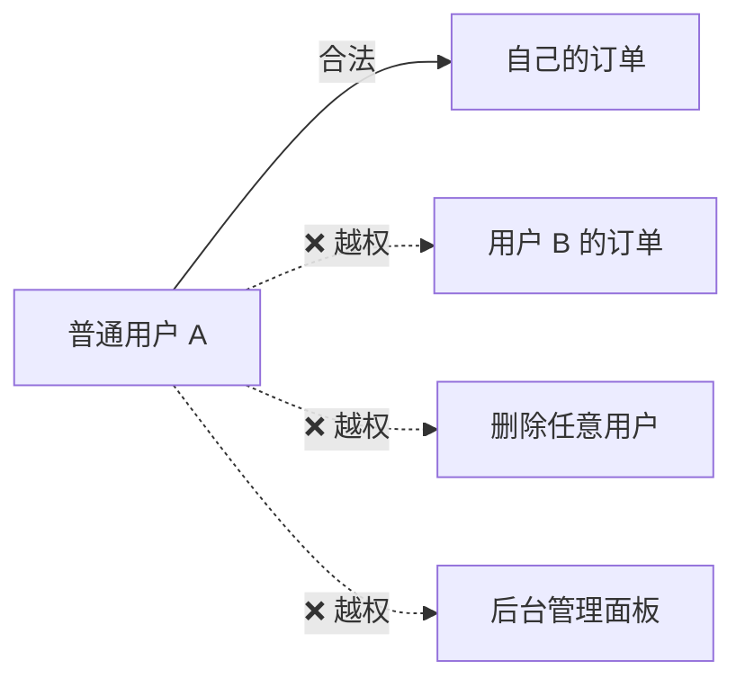
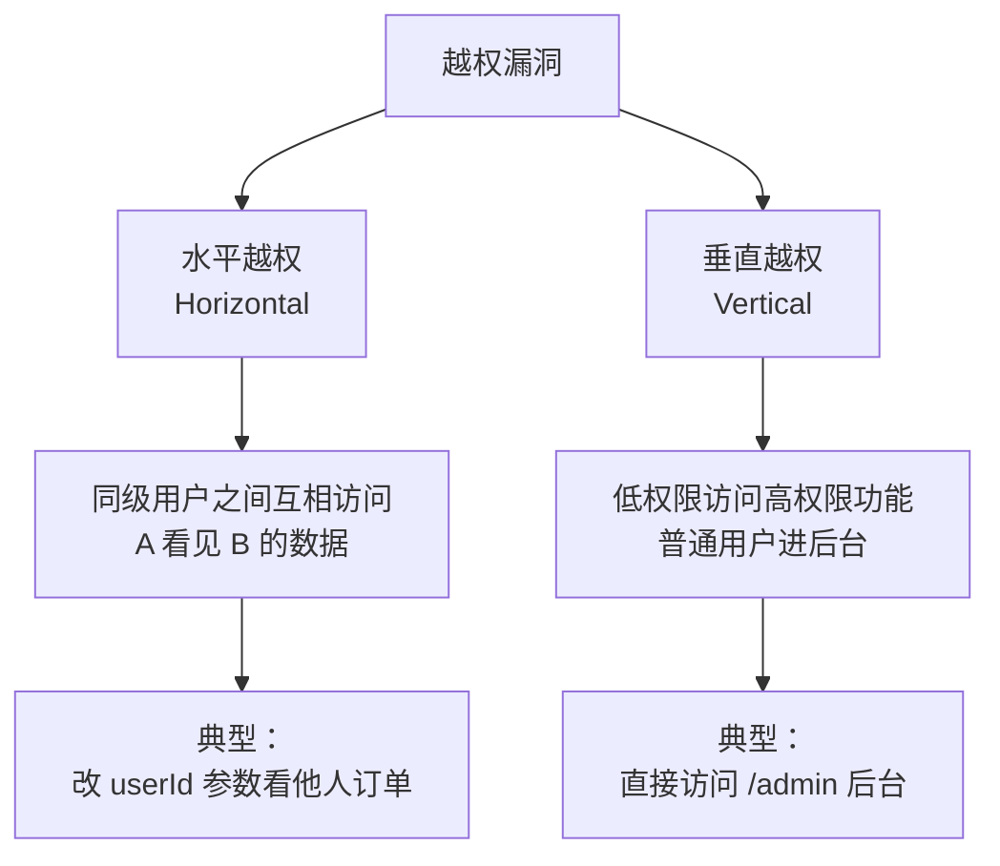
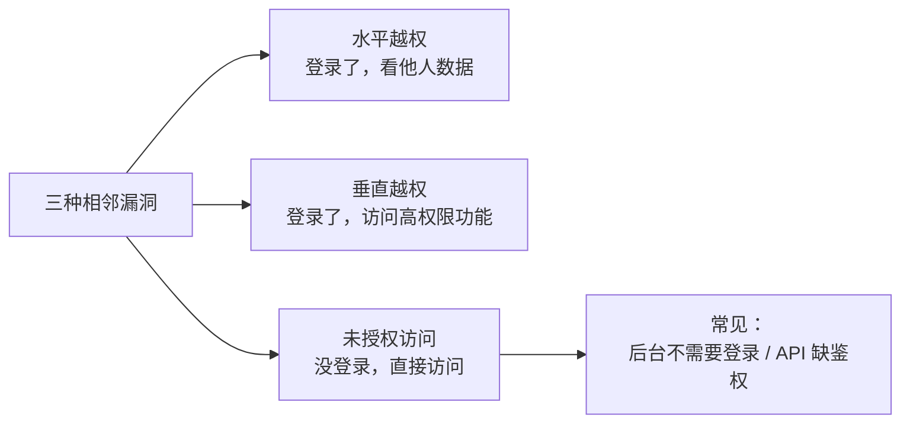
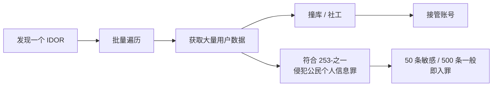
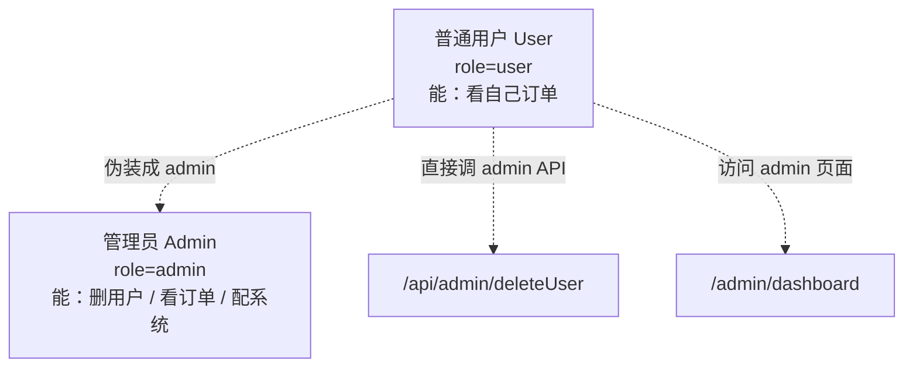
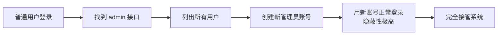
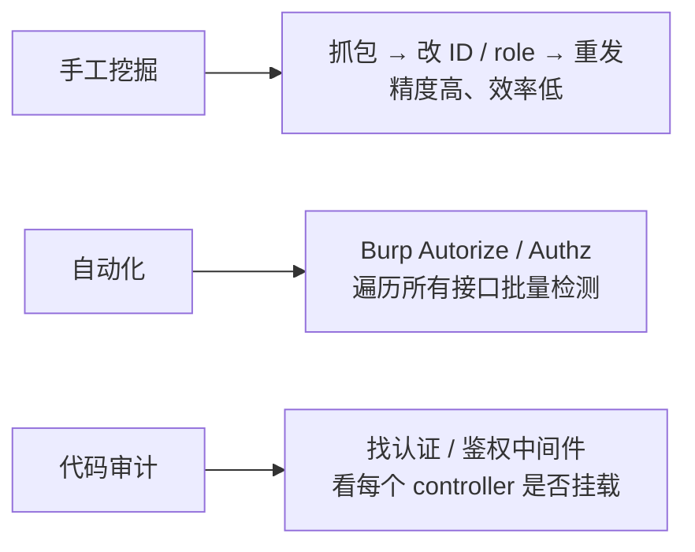
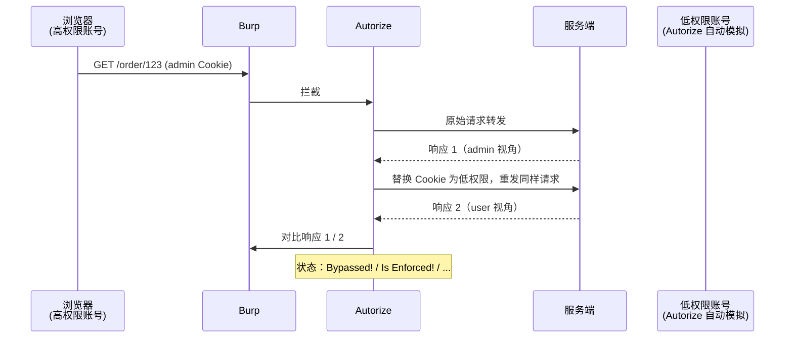
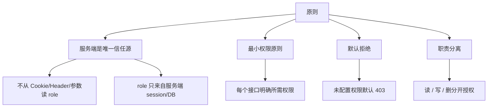

# 越权漏洞详解 —— 水平越权与垂直越权
| 课时 | 主题 | 时长 | 核心产出 |
| :---: | --- | :---: | --- |
| 第 1 课 | 认证 vs 授权 + 越权基础概念 | 50 min | 看一眼就知道是不是越权 |
| 第 2 课 | 水平越权：原理、案例、靶场复现 | 60 min | 完成 pikachu / DVWA 水平越权 |
| 第 3 课 | 垂直越权：原理、案例、靶场复现 | 60 min | 完成 bwapp / 自建垂直越权 |
| 第 4 课 | 自动化挖掘 + 防御方案 + 真实案例 | 50 min | Burp Authz / Autorize 插件实战 |


> 🎯 **学完本课你应当能做到**：
>
> 1. 区分"未授权访问"、"水平越权"、"垂直越权"
> 2. 在 30 秒内说出某个接口属于哪种越权
> 3. 用 Burp Autorize 插件对一个站点全量扫描越权
> 4. 给出基于 RBAC + 服务端会话校验的修复方案

---

# 🗓️ 第 1 课 · 认证 vs 授权 + 越权基础概念
## 1.1 三个最容易混淆的概念


### 一句话区分
| 概念 | 一句话 | HTTP 状态码 |
| --- | --- | :---: |
| 认证 (Authentication) | 你是谁？验证身份。 | 401 |
| 授权 (Authorization) | 你能干啥？检查权限。 | 403 |
| 会话 (Session) | 你登录状态还在吗？ | — |


**举例**：

+ 用 admin 账号登录 → 认证 ✅
+ admin 想删用户列表 → 检查 admin 是否有"删用户"权限 → 授权 ✅/❌
+ admin 半小时没操作 → Session 过期 → 重新认证

---

## 1.2 什么是越权漏洞？
> **越权（Broken Access Control / 权限突破）**：  
用户**执行了超越自己权限范围**的操作。
>



**OWASP Top 10 2021** 中，**A01: Broken Access Control（权限失控）排名第一**，是业界最高发的 Web 漏洞类型。

---

## 1.3 越权的两大类（核心）


### 对比表（必背）
| 维度 | 水平越权 | 垂直越权 |
| --- | --- | --- |
| 攻击者 vs 受害者 | **同级**（同角色） | **跨级**（低 → 高） |
| 典型表现 | 看他人订单 / 改他人信息 | 进 admin 后台 / 调用管理 API |
| 利用方式 | 改 ID / Token / Cookie | 直接访问 URL / 修改 role 参数 |
| 危害 | 数据泄露（同级别） | 完全接管系统 |
| 高发场景 | 电商订单、SaaS 多租户 | 后台管理、计费系统 |
| 修复难点 | 需绑定 owner 校验 | 需要严格的 RBAC |


---

## 1.4 还要分清：未授权访问


**举例区分**：

| 场景 | 类型 |
| --- | --- |
| 登录后改 `userId=100` 看他人订单 | 水平越权 |
| 普通用户访问 `/admin/userList` 看到全部用户 | 垂直越权 |
| 没登录直接访问 `/admin/userList` 看到 200 | 未授权访问 |
| 普通用户的 Cookie 调 `/api/admin/delete` 成功 | 垂直越权 |


---

## 1.5 越权漏洞的根因

```mermaid
 graph TB
    Root["根因：信任了客户端"] --> R1["信任 URL 参数<br/>userId=100 直接用"]
    Root --> R2["信任 Hidden 字段<br/><input type='hidden' name='role' value='admin'>"]
    Root --> R3["信任 Cookie<br/>role=admin 可改"]
    Root --> R4["信任请求来源<br/>Referer / 路径白名单"]
    Root --> R5["缺失对象级校验<br/>没检查 obj.owner == user"]
```


**核心反模式**：

```java
// ❌ 错误代码（典型水平越权源码）
@GetMapping("/order/{id}")
public Order getOrder(@PathVariable Long id) {
    return orderRepository.findById(id);   // 没检查这个订单是不是当前用户的
}

// ✅ 正确代码
@GetMapping("/order/{id}")
public Order getOrder(@PathVariable Long id, @AuthenticationPrincipal User user) {
    Order o = orderRepository.findById(id);
    if (!o.getUserId().equals(user.getId())) {
        throw new AccessDeniedException("无权访问");
    }
    return o;
}
```

---

## 1.6 越权的 6 种典型变种（先建印象）
|  #  | 名称              | 说明                     | 示例                                |
| :-: | --------------- | ---------------------- | --------------------------------- |
|  1  | IDOR（不安全直接对象引用） | 改 ID 参数访问他人资源          | `?id=1023` → `?id=1024`           |
|  2  | 多步流程跳过          | 跳过权限校验步骤               | 注册流程最后一步直接 POST<br>示例：重置密码        |
|  3  | HTTP 方法滥用       | GET 改成 PUT / DELETE 绕过 | `PUT /user/123`                   |
|  4  | 路径强制浏览          | 访问被"隐藏"的 URL           | `/admin/config.php`               |
|  5  | 角色篡改            | 修改 role / isAdmin 参数   | Cookie `role=user` → `role=admin` |
|  6  | API 接口暴露        | 移动端 API 缺鉴权            | `/api/v2/users/all`               |


---

## 1.7 第 1 课小结
| 概念 | 一句话理解 |
| --- | --- |
| 认证 | 你是谁？（401） |
| 授权 | 你能干啥？（403） |
| 越权 | 干了不该干的事 |
| 水平越权 | 同级用户之间互相访问 |
| 垂直越权 | 低权限访问高权限功能 |
| 未授权访问 | 根本没登录就访问到了 |
| 根因 | 服务端**信任了客户端** |

### 课间实操（5 分钟，纯思考）
判断以下场景属于哪种漏洞：

| # | 场景 | 你的判断 |
| :---: | --- | :---: |
| 1 | 登录后改 `?oid=8888` 看到他人订单详情 | ? |
| 2 | 没登录访问 `/admin/dashboard` 直接进入 | ? |
| 3 | POST `role=admin` 把自己变成管理员 | ? |
| 4 | 修改手机号时把 `userId=100` 改成 `101` 改了别人号码 | ? |
| 5 | 用普通账号 Cookie 访问 `/api/admin/listUsers` 成功 | ? |


**答案**：1-水平、2-未授权访问、3-垂直、4-水平、5-垂直

---
# 🗓️ 第 2 课 · 水平越权：原理、案例、靶场复现
## 2.1 IDOR —— 水平越权的最常见形态
> **IDOR (Insecure Direct Object Reference) 不安全直接对象引用**：  
应用直接把请求参数（ID、文件名等）作为访问对象，**不做归属校验**。
>

### 一个最小例子
```plain
GET /api/order?orderId=12345
Cookie: session=userA
```

```java
// ❌ 漏洞代码
Long id = Long.valueOf(request.getParameter("orderId"));
Order o = db.findById(id);
return o;   // 谁的订单？没检查！
```

**攻击**：把 `orderId` 改成 `12346 / 12347 ...`，**遍历所有用户订单**。

---

## 2.2 IDOR 的"特征位"
判断一个参数是否有 IDOR 风险，看三点：

```plain
① 是否是"对象标识符"     → ?id= / ?uid= / ?orderId= / ?docId=
② 是否"自增 / 可枚举"    → 1001, 1002, 1003...
③ 是否"服务端校验归属"    → 看响应是否区分
```

### 容易被忽略的 IDOR 载体
| 载体 | 示例 |
| --- | --- |
| URL 参数 | `?id=123` |
| POST body | `userId=123` |
| JSON 字段 | `{"orderId": 123}` |
| Cookie | `userId=123` |
| Header | `X-User-Id: 123` |
| RESTful 路径 | `/api/users/123/orders` |
| GraphQL | `query { user(id:123) {...} }` |
| UUID（不可枚举但仍 IDOR） | `?token=abc-def-...` |


> 🎯 **关键理解**：  
UUID 只是"难以枚举"，**只要不校验归属依然是越权**。  
一旦泄露（日志、分享链接、客户端代码）就立刻可利用。
>

---

## 2.3 水平越权典型场景
### 场景 1：电商订单越权
```plain
GET /order/detail?orderId=10234   ← 我的订单
GET /order/detail?orderId=10235   ← 改一下，看到张三的订单
```

**危害**：泄露姓名 / 地址 / 手机号 / 商品信息。

### 场景 2：SaaS 多租户越权
```plain
GET /api/tenant/abc123/documents
                          ↓ 改成
GET /api/tenant/xyz789/documents   ← 别家公司的文档！
```

### 场景 3：密码重置越权
```plain
POST /resetPassword
email=victim@qq.com&newPassword=hacked123
```

某些早期 CMS 直接根据 email 参数重置，**任何人可重置任何账号**。

### 场景 4：文件下载越权
```plain
GET /download?file=invoice_2024_03.pdf
                          ↓
GET /download?file=../../../../etc/passwd      ← 顺便就成 LFI
GET /download?file=invoice_2024_03_userB.pdf  ← 他人发票
```

### 场景 5：消息 / 通知越权
```plain
GET /message/read?msgId=999    ← 改 msgId 看他人私信
```

---

## 2.4 水平越权危害链


> ⚠️ **法律红线**：  
越权拿 1 条是漏洞 PoC，拿 500 条已经是犯罪。  
**PoC 必须最小化**，最多验证 1-2 条。
>

---

## 2.5 靶场复现 1：pikachu 水平越权
### 启动 pikuchi
```bash
docker run -d --name pikachu -p 8088:80 area39/pikachu
# 访问 http://localhost:8088
```

### 找到漏洞点
进入 `Vulnlevels/越权` → `水平越权`：

1. 点击「登录」用账号 `lucy/123456` 登录
2. 进入「查看个人信息」页面，看到 lucy 的账号信息
3. URL 是 `http://localhost:8088/vul/overpermission/user.php?username=lucy`

### 利用
```plain
改 username 参数：
?username=lucy     → lucy 的信息
?username=lili     → lili 的信息
?username=kobe     → kobe 的信息
```

### 原理源码（pikuchi 实际代码）
```php
// vul/overpermission/user.php
$username = $_GET['username'];           // ❌ 直接拿 URL 参数
$html = $username;
// 没有检查 session 用户是否等于 username
```

**修复后应当**：

```php
session_start();
if ($_SESSION['username'] !== $_GET['username']) {
    die('权限不足');
}
```

---

## 2.6 靶场复现 2：DVWA IDOR
### 启动 DVWA
```bash
docker run -d --name dvwa -p 8080:80 vulnerables/web-dvwa
# 默认账号 admin/password
```

### 漏洞点
进入 `DVWA Security → Low` → 左侧菜单 `File Inclusion` 旁边的 **View Source** 找 IDOR：  
实际上 DVWA 的 Command Injection / File Upload 中都有相关变种。  
更直接的是 **DVWA 的 Brute Force 关卡中 IDOR 思想**——但 DVWA 没有专门 IDOR 关卡，我们用 **bwapp** 替代。

---

## 2.7 靶场复现 3：bwapp IDOR
### 启动 bwapp
```bash
docker run -d --name bwapp -p 8081:80 raesene/bwapp
# 默认账号 bee/bug
```

### Insecure Direct Object References 关卡
进入 `Insecure Direct Object References` → Security Level: low

观察 URL：

```plain
http://localhost:8081/sqli_6.php?title=Iron+Man&action=go
```

```plain
改 title 参数：title=Thor → 看 Thor 的秘密消息
                  title=Batman → 看 Batman 的秘密消息
```

源码：

```php
$title = $_GET["title"];
$id = sqli($title);     // 拿到 movie id
$result = mysql_query("SELECT * FROM blog WHERE id = $id");
// ❌ 没校验这个 movie 是否属于当前用户
```

### 用 SQL 注入视角看 IDOR
bwapp 的 IDOR 还可以叠加 SQL 注入：

```plain
title=Iron Man' UNION SELECT login,password,1,1 FROM users-- -
```

> 🎯 **关键观察**：  
越权和 SQL 注入常常**叠加利用**——一个漏洞暴露更多攻击面。
>

---

## 2.8 自建靶场：5 分钟写一个有水平越权的接口
```bash
mkdir -p /tmp/idor-lab
cd /tmp/idor-lab

cat > app.py <<'EOF'
from flask import Flask, request, jsonify, session
app = Flask(__name__)
app.secret_key = "test"

USERS = {
    "alice":  {"id":1, "name":"Alice",  "phone":"138-0000-0001", "balance":5000},
    "bob":    {"id":2, "name":"Bob",    "phone":"138-0000-0002", "balance":3000},
    "charlie":{"id":3, "name":"Charlie","phone":"138-0000-0003", "balance":12000},
}

@app.route("/login/<username>")
def login(username):
    if username in USERS:
        session["user"] = username
        return f"logged in as {username}"
    return "no such user", 404

@app.route("/profile")
def profile():
    # ❌ 漏洞：直接信任 URL 参数
    user = request.args.get("user", session.get("user"))
    return jsonify(USERS.get(user))

@app.route("/profile_safe")
def profile_safe():
    # ✅ 修复：只允许查自己
    user = session.get("user")
    if not user: return "login first", 401
    return jsonify(USERS[user])

if __name__ == "__main__":
    app.run(host="0.0.0.0", port=5000, debug=True)
EOF

pip3 install flask
python3 app.py
```

### 实操流程
```bash
# 1. 用 alice 登录（浏览器或 curl -c cookie.txt）
curl -c c.txt http://localhost:5000/login/alice

# 2. 看自己 profile
curl -b c.txt http://localhost:5000/profile
# 返回 alice 信息 ✅

# 3. 越权！改 user 参数
curl -b c.txt "http://localhost:5000/profile?user=bob"
# 返回 bob 的手机号和余额 ❌

# 4. 安全接口验证
curl -b c.txt "http://localhost:5000/profile_safe?user=bob"
# 仍然只返回 alice 信息 ✅
```

---

## 2.9 第 2 课小结
| 知识点 | 一句话 |
| --- | --- |
| 水平越权本质 | 改 ID / 标识符 → 访问同级别他人资源 |
| IDOR = 水平越权最常见形态 | 不安全直接对象引用 |
| 高发载体 | URL / Body / Cookie / Header / RESTful 路径 |
| UUID 不是防线 | 不校验归属 = 仍可越权 |
| 危害 | 个人信息泄露 + 撞库 + 接管账号 |
| 修复核心 | 服务端绑定 owner 校验 |

### 课间实操（10 分钟）
1. 完成 pikachu 水平越权 3 个用户的越权读取
2. 完成 bwapp IDOR 关卡，用 `title=Thor` 验证
3. 启动自建 Flask 靶场，curl 复现越权 + 安全接口对比

---

# 🗓️ 第 3 课 · 垂直越权：原理、案例、靶场复现
## 3.1 垂直越权的本质


**垂直越权**：低权限用户**访问 / 调用**高权限才有的功能。

---

## 3.2 垂直越权 vs 水平越权：一张图看清
```plain
权限金字塔：

    ┌─────────────┐
    │   Admin     │   ← 垂直越权：从下往上跳
    ├─────────────┤
    │  Manager    │
    ├─────────────┤
    │  User A   User B   User C   ← 水平越权：同级之间横向
    └─────────────┘
```

---

## 3.3 垂直越权的 4 种典型变种
### 变种 1：URL 直接访问（最经典）
```plain
普通用户登录后，浏览器试访问：
http://target.com/admin/dashboard    ← 居然 200，不是 403
http://target.com/admin/userList     ← 居然列出所有用户
http://target.com/admin/config       ← 居然能改配置
```

**根因**：服务端只判断"是否登录"，**没判断"是否是 admin"**。

### 变种 2：Cookie / Token 篡改
```plain
登录普通用户后 Cookie：
Cookie: session=xxx; role=user

把 Cookie 改成：
Cookie: session=xxx; role=admin       ← 服务端居然信了！
```

**根因**：服务端从客户端读取 role 字段。

### 变种 3：Hidden 字段 / JSON 字段篡改
```html
<!-- 注册表单 -->
<input type="hidden" name="role" value="user">
```

**攻击**：Burp 拦截，把 `role=user` 改成 `role=admin` 提交。  
某些早期应用注册时就让你直接当管理员。

### 变种 4：HTTP 方法绕过
```plain
GET /api/admin/users        → 403（管理员外禁止）
PUT /api/admin/users        → 200 ❌（路由只对 GET 做了权限校验）
DELETE /api/admin/users/123 → 200 ❌
```

**根因**：权限中间件只挂在某些 HTTP 方法上。

### 变种 5：API 版本差异
```plain
/api/v1/admin/users   → 严格鉴权 403
/api/v2/admin/users   → 新版本忘了加鉴权 200 ❌
/api/internal/admin/users → 内部接口对外暴露 200 ❌
```

---

## 3.4 真实案例参考（脱敏）
### 案例 A：某 OA 系统管理员越权
+ 普通员工账号登录
+ 浏览器开发者工具看到主菜单有 `admin.php`，但灰色不可点
+ 直接输入 URL `http://oa.com/admin.php` → **直接进入后台**
+ 进一步发现可下载全公司薪资表

### 案例 B：某银行 APP role 字段篡改
```plain
登录请求：
POST /api/login
{"username":"user01","password":"xxx"}

响应：
{"token":"abc","role":"user"}

普通用户请求带上 token 调用：
GET /api/account/balance
Cookie: token=abc; role=user   ← 改成 role=admin
                                     ↓
服务端返回所有用户余额
```

### 案例 C：某 SaaS 路径强制浏览
```plain
/user/dashboard     ← 普通用户首页
/admin/dashboard    ← 直接访问 → 200 进入后台
/support/tickets    ← 客服专用，普通用户也能看所有工单
```

---

## 3.5 靶场复现 1：pikachu 垂直越权
### 漏洞点
`pikachu` → `Vulnlevels/越权` → `垂直越权`

### 操作步骤
1. 用 admin 账号 `admin/123456` 登录
2. 看到「创建用户」「删除用户」功能
3. 退出，用普通账号 `lucy/123456` 登录
4. **关键操作**：登录后**直接访问** admin 才有的 URL

```plain
http://localhost:8088/vul/overpermission/user.php
```

发现：lucy 也能看到 admin 才有的功能（创建 / 删除用户）

### 原理源码
```php
// pikuchi 的垂直越权问题
// admin 才有的 URL：
//   vul/overpermission/admin.php
// 但这个文件没有判断当前 session 是不是 admin
if (!isset($_SESSION['username'])) {
    // 只判断了"是否登录"，没判断"是不是 admin"
    header("Location: login.php");
}
```

### 利用流程
```bash
# 1. 用 lucy 登录拿到 Cookie
curl -c c.txt -X POST http://localhost:8088/vul/overpermission/login.php \
  -d 'username=lucy&password=123456&login=登录'

# 2. lucy 直接访问 admin 才有的创建用户接口
curl -b c.txt "http://localhost:8088/vul/overpermission/admin.php"
# 居然返回了创建用户表单 ❌
```

---

## 3.6 靶场复现 2：自建垂直越权靶场
```bash
mkdir -p /tmp/vertical-lab
cat > /tmp/vertical-lab/app.py <<'EOF'
from flask import Flask, request, jsonify, session
app = Flask(__name__)
app.secret_key = "test"

USERS = {
    "admin": {"password":"admin123", "role":"admin"},
    "alice": {"password":"alice123", "role":"user"},
}

@app.route("/login", methods=["POST"])
def login():
    u = request.form.get("user")
    p = request.form.get("pass")
    if USERS.get(u, {}).get("password") == p:
        session["user"] = u
        session["role"] = USERS[u]["role"]
        return "OK"
    return "fail", 401

# ❌ 漏洞：只判断是否登录，不判断角色
@app.route("/admin/users")
def admin_users():
    if "user" not in session:
        return "login first", 401
    return jsonify(list(USERS.keys()))

# ❌ 漏洞：信任客户端传的 role
@app.route("/api/data")
def api_data():
    role = request.headers.get("X-Role", session.get("role", "user"))
    if role == "admin":
        return jsonify({"secret":"full database dump"})
    return jsonify({"data":"your data"})

# ✅ 正确：服务端校验角色
@app.route("/admin/safe")
def admin_safe():
    if session.get("role") != "admin":
        return "forbidden", 403
    return jsonify({"secret":"full database dump"})

if __name__ == "__main__":
    app.run(host="0.0.0.0", port=5001, debug=True)
EOF

python3 /tmp/vertical-lab/app.py
```

### 实操
```bash
# 1. alice 登录
curl -c c.txt -X POST http://localhost:5001/login -d 'user=alice&pass=alice123'

# 2. 漏洞 1：alice 直接访问 admin 接口
curl -b c.txt http://localhost:5001/admin/users
# 返回 ['admin','alice'] ❌

# 3. 漏洞 2：alice 伪造 role header
curl -b c.txt -H "X-Role: admin" http://localhost:5001/api/data
# 返回 full database dump ❌

# 4. 安全接口对照
curl -b c.txt http://localhost:5001/admin/safe
# 返回 403 ✅
```

---

## 3.7 靶场复现 3：bwapp 垂直越权
bwapp 中没有"垂直越权"专属关卡，但其 **Missing Functional Level Access Control** 思想体现在：

1. 登录普通用户 `bee/bug`
2. 浏览器开发者工具查看 HTML，找注释掉的 admin 链接
3. 直接访问 `portal.php` 试图进入"高级"功能

更直观的是 **DVWA Security Level** 切换机制（用 admin 改难度），如果普通用户能直接 GET `security.php?security=low` 就属于垂直越权变种。

---

## 3.8 垂直越权的危害链


**为什么垂直越权危害大于水平越权**：

+ 水平越权：A 看 B 的数据（被动泄露）
+ 垂直越权：U 当 admin（主动控制，可改可删可加后门）

---

## 3.9 第 3 课小结
| 知识点 | 一句话 |
| --- | --- |
| 垂直越权本质 | 低权限访问高权限功能 |
| 5 种变种 | URL 直接访问 / Cookie 篡改 / Hidden 字段 / HTTP 方法 / API 版本 |
| 检测方法 | 拿普通账号遍历所有 admin URL |
| 修复核心 | 服务端会话校验角色，**不从客户端读取 role** |
| 危害 | 完全接管系统，可加后门管理员 |


### 课间实操（10 分钟）
1. 完成 pikachu 垂直越权：lucy 调用 admin 接口
2. 启动自建 Flask 靶场，curl 复现两种越权 + 安全接口对照
3. 用 Burp 拦截一个普通用户请求，把 Cookie / Header 加上 `role=admin` 重发

---

# 🗓️ 第 4 课 · 自动化挖掘 + 防御方案 + 真实案例
## 4.1 手工 vs 自动化


实战中三者结合：

1. 自动化扫一遍快速定位
2. 手工验证确认漏洞
3. 代码审计找根因和影响范围

---

## 4.2 Burp Suite Autorize 插件
### 安装
```plain
Burp → Extender → BApp Store → 搜索 "Autorize" → install
```

或从 GitHub 下载：

```plain
https://github.com/PortSwigger/autorize
```

### 工作原理


### 配置步骤
1. 用管理员账号登录，把 Cookie 复制到 Autorize → Configuration → `Cookie` 框
2. 切到 Autorize 标签页，点击 `Autorize is off` → `Autorize is on`
3. 浏览器用**普通用户**账号登录，正常浏览网站
4. 每个请求都会被 Autorize 双发：一次原 Cookie，一次低权限 Cookie
5. 查看 Autorize 列表：

| 状态                    | 含义                |
| --------------------- | ----------------- |
| **Bypassed! �***      | 低权限也能访问 → **越权！** |
| **Enforced! �***      | 正常返回 403/重定向 → 安全 |
| **Is Enforced??? �*** | 不确定，需要人工确认        |

### 实战技巧
+ **过滤**：只看 `Bypassed!` 状态
+ **校验**：把响应长度对比作为一个维度
+ **认证后浏览所有功能**：访问越全，扫到的接口越多

---

## 4.3 Burp Authz 插件
### 与 Autorize 区别
| 维度 | Autorize | Authz |
| --- | --- | --- |
| 工作模式 | 持续监听 + 自动重发 | 手动选请求 + 批量重发 |
| 适用场景 | 全面扫描 | 精准测试已知接口 |
| 配置 | 1 个低权限 Cookie | 1 个低权限 Cookie |

### 用法
1. BApp Store 安装 Authz
2. 抓到一个敏感请求（如 `/api/order/123`）
3. 右键 → `Send to Authz`
4. Authz 标签 → 配置低权限 Cookie / Header → `Start`
5. 查看响应列表，对比两个用户的返回是否相同

---

## 4.4 用 Burp Intruder 批量遍历 ID
### 场景
发现 `GET /api/order/{id}` 是 IDOR，想批量验证。

### 步骤
1. Burp 抓到 `/api/order/1001`
2. 右键 → Send to Intruder
3. Intruder → Positions → 选中 `1001` → Add `§`
4. Payloads → Numbers → From 1000 To 1100 Step 1
5. Start attack
6. 按 `Length` 排序，找出"长度异常"的响应

⚠️ **法律提醒**：在 SRC 测试中，**遍历超过 5-10 条已属过量**，可能触法。  
PoC 验证 1-2 条即可。


---

## 4.5 越权漏洞的代码层修复
### 水平越权修复模板
```java
// Spring Boot 示例
@GetMapping("/orders/{id}")
public Order getOrder(@PathVariable Long id, @AuthenticationPrincipal User user) {
    Order order = orderRepo.findById(id)
        .orElseThrow(() -> new NotFoundException());
    // ✅ 关键：归属校验
    if (!order.getUserId().equals(user.getId())) {
        throw new AccessDeniedException("无权访问");
    }
    return order;
}
```

### 垂直越权修复模板
```java
// 方法 1：注解
@PreAuthorize("hasRole('ADMIN')")
@GetMapping("/admin/users")
public List<User> listUsers() { ... }

// 方法 2：Spring Security 配置
http.authorizeRequests()
    .antMatchers("/admin/**").hasRole("ADMIN")
    .antMatchers("/user/**").authenticated()
    .anyRequest().denyAll();
```

### 通用安全编码原则


---

## 4.6 防御纵深：WAF + 后端
### WAF 规则（参考）
```plain
# 拦截疑似 admin 路径的非管理员访问
SecRule REQUEST_URI "@contains /admin/" \
    "id:1001,phase:1,deny,\
    msg:'Non-admin trying to access admin path',\
    log,\
    chain"
    SecRule SESSION:role "!@streq admin"
```

### 后端中间件（Node.js Express 示例）
```javascript
function requireRole(role) {
    return (req, res, next) => {
        if (req.session.role !== role) {
            return res.status(403).json({error: "forbidden"});
        }
        next();
    };
}

app.delete("/admin/users/:id", requireRole("admin"), deleteUser);
```

### 数据库层（RLS 行级安全）
PostgreSQL Row-Level Security：

```sql
ALTER TABLE orders ENABLE ROW LEVEL SECURITY;

CREATE POLICY user_own_orders ON orders
    FOR SELECT
    USING (user_id = current_setting('app.current_user_id')::int);
```

**效果**：即使后端 SQL 没加 WHERE，数据库层也强制只返回当前用户的数据。

---

## 4.7 真实 SRC 漏洞赏析（脱敏）
### 案例 1：某直播平台越权
```plain
漏洞：修改个人资料时 POST body 含 userId
POST /api/profile/update
{"userId":10086,"phone":"newphone"}
```

**攻击**：把 userId 改成任意值，可改任意用户的手机号。  
**修复**：服务端从 session 取 userId，忽略客户端传值。

### 案例 2：某银行 APP 后台越权
```plain
漏洞：客户端菜单根据 role 渲染，但服务端不校验
普通用户登录 → APP 隐藏 admin 菜单
但 URL /api/admin/freezeAccount 直接可调用
```

**修复**：所有 admin 接口加 `@PreAuthorize("hasRole('ADMIN')")`。

### 案例 3：某 OA 任意密码重置
```plain
漏洞：忘记密码功能
POST /resetPassword
{"username":"victim","newPass":"hacked","code":"1234"}

code 是 4 位数字 → 暴力枚举 10000 次
某些版本甚至 code 字段可空
```

**修复**：
+ code 至少 6 位 + 5 分钟过期 + 错误 5 次锁定
+ 服务端校验 code 与 username 强绑定

### 案例 4：某云盘越权下载
```plain
GET /api/share?key=abc123
↓ 改成
GET /api/share?key=abc124 → 别人分享的文件
```

**修复**：分享 key 与所有者绑定，未公开的分享必须登录 + 校验关系。

---

## 4.8 越权漏洞挖掘清单（SRC 实战）


### 必查接口清单
```plain
□ /user/{id}             用户信息
□ /order/{id}            订单详情
□ /api/account/balance   余额查询
□ /api/profile/update    资料修改
□ /api/message/{id}      消息详情
□ /admin/dashboard       后台首页
□ /admin/users           用户管理
□ /admin/config          系统配置
□ /api/v1/*              老版本接口
□ /api/internal/*        内部接口
□ /api/mobile/*          移动端接口
□ /api/support/*         客服接口
```

### 必改参数清单
```plain
□ userId / uid / id
□ orderId / oid
□ role / isAdmin / userType
□ tenantId / companyId
□ token / key / shareId
□ email / phone（密码重置类）
```

---

## 4.9 第 4 课小结
| 工具 / 方法 | 用途 |
| --- | --- |
| Burp Autorize | 全站批量扫越权 |
| Burp Authz | 精准测试已知接口 |
| Burp Intruder | 批量遍历 ID |
| Spring Security | 注解式鉴权 |
| PostgreSQL RLS | 数据库层兜底 |
| OWASP ASVS | 安全验证标准 |


### 防御核心三原则
1. **服务端是唯一信任源** —— role 不从客户端读
2. **默认拒绝** —— 未明确允许的全部 403
3. **对象绑定 owner** —— 每个 SELECT/UPDATE 都校验归属

---

# 📝 课程总回顾（必背 30 条）
### 基础概念
1. 认证 = 你是谁（401）
2. 授权 = 你能干啥（403）
3. 会话 = 登录状态
4. 越权 = 干了不该干的事
5. OWASP 2021 第一名 = Broken Access Control

### 越权分类
6. 水平越权 = 同级用户互访
7. 垂直越权 = 低权限访问高权限
8. 未授权访问 = 没登录就访问到
9. IDOR = 水平越权最常见形态
10. 多步流程跳过 / HTTP 方法滥用 = 越权变种

### 水平越权
11. 高发载体：URL / Body / Cookie / Header / JSON
12. UUID 不是防线，不校验归属仍可越权
13. 危害：信息泄露 + 撞库 + 接管
14. 修复：服务端校验 `obj.owner == user`
15. 靶场：pikachu / bwapp / 自建 Flask

### 垂直越权
16. 5 种变种：URL / Cookie / Hidden / HTTP 方法 / API 版本
17. 危害 > 水平越权：可改可删可加后门
18. 检测：普通账号遍历 admin URL
19. 修复：注解 + 中间件 + Spring Security
20. 关键：role 只来自服务端 session

### 工具
21. Burp Autorize：全站自动扫
22. Burp Authz：精准接口测试
23. Burp Intruder：批量遍历
24. Wazuh / HIDS：日志侧检测
25. PostgreSQL RLS：数据库层兜底

### 实战
26. 越权检测清单：所有含 ID 的请求
27. 必查接口：user / order / admin / api/v1 / api/mobile
28. 必改参数：userId / role / orderId / tenantId
29. SRC 提交：PoC 最多 1-2 条，**避免过数触法**
30. 防御三原则：服务端信任源 + 默认拒绝 + 对象绑定 owner

---

# 🎯 课后作业
### 基础题
1. 完成 pikachu 水平 + 垂直越权全部关卡，截图保存
2. 完成 bwapp Insecure Direct Object References 关卡
3. 启动自建 Flask 靶场（水平 + 垂直各一份），curl 完整复现

### 进阶题
4. 安装 Burp Autorize，对 DVWA + pikachu 全站扫描，找出所有 Bypassed 接口
5. 用 Intruder 批量遍历 bwapp IDOR，观察响应长度分布
6. 编写 Spring Security 配置，把 `/admin/**` 限制为 ADMIN 角色

### 实战题
7. **代码审计**：找一个 GitHub 上的开源博客 / 论坛项目，找出所有越权点
8. **写报告**：模拟 SRC 提交一份完整的越权漏洞报告（漏洞描述 + 复现步骤 + 影响范围 + 修复方案）

---
